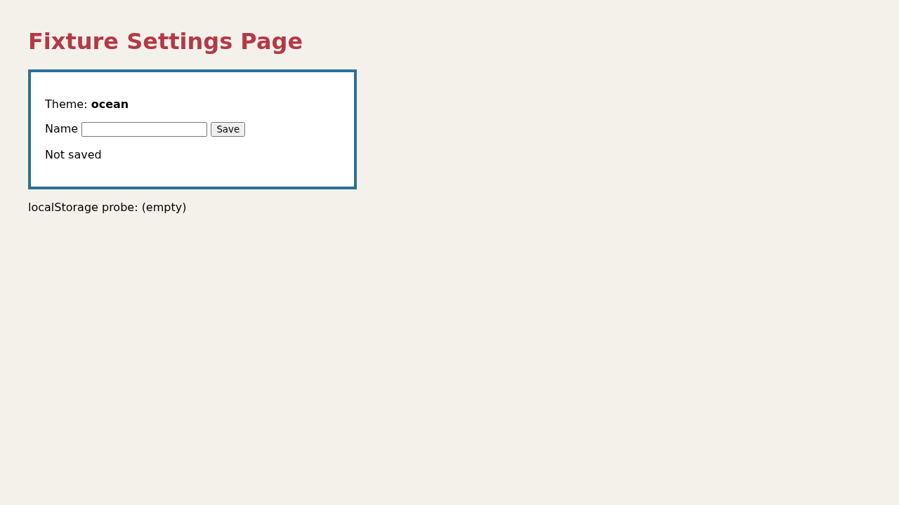
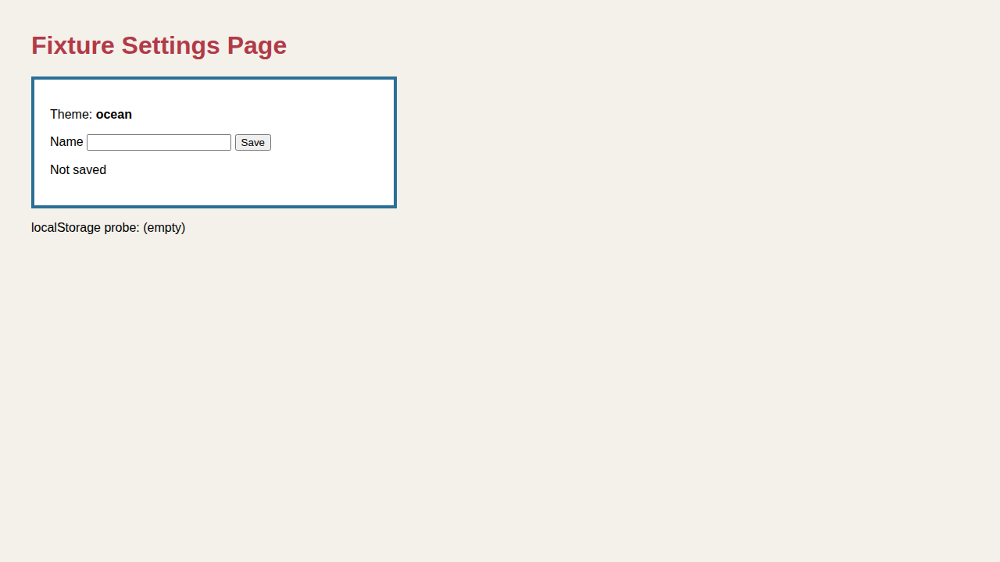
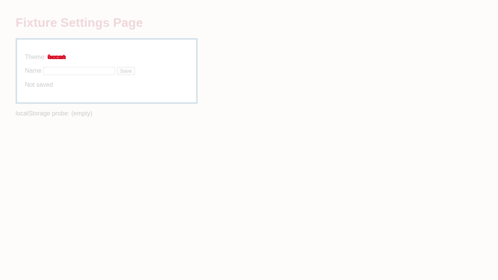
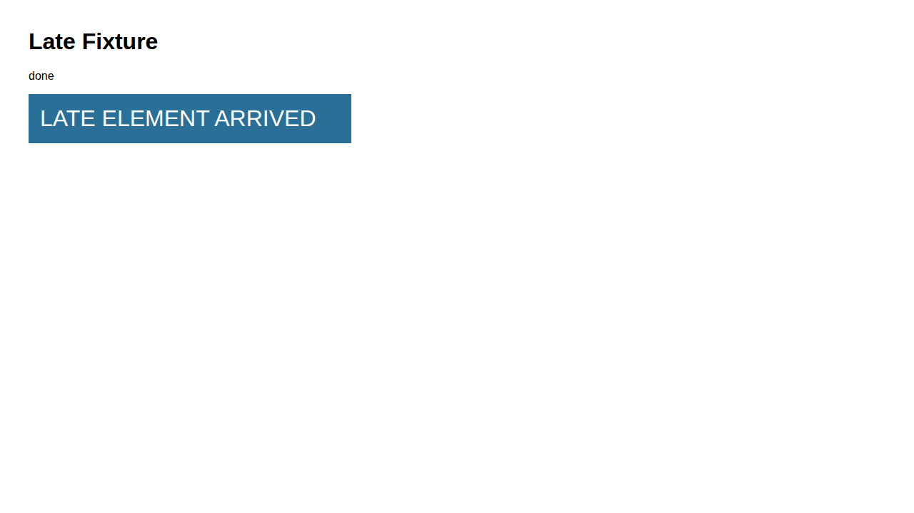
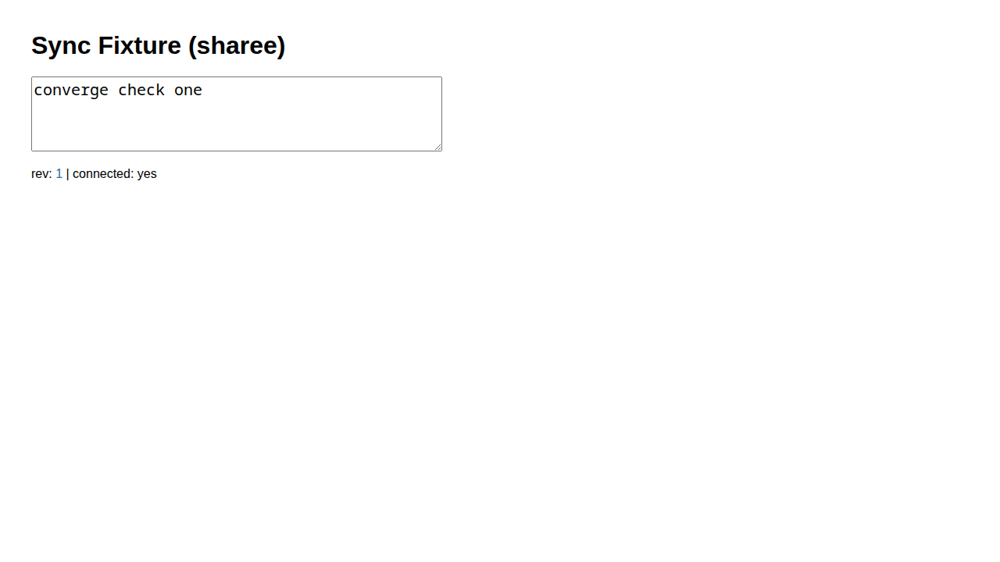
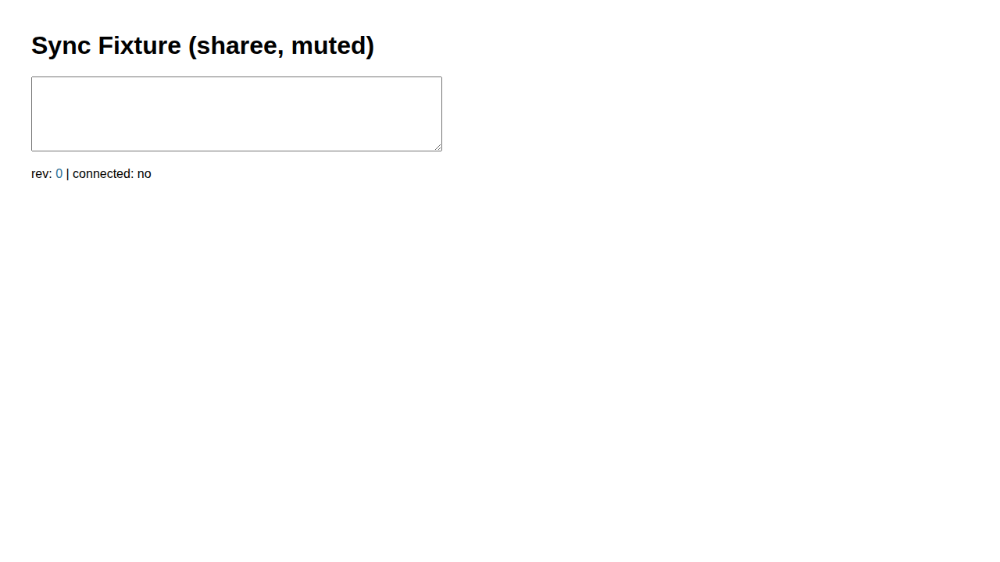

---
first_authored:
  by: "@claude-opus-5-5"
  at: 2026-10-07T20:50:00-07:00
task_list: cdocs/browser-delegation
type: devlog
state: live
status: review_ready
part_of: cdocs/devlogs/2026-09-17-browser-delegation-plugin.md
tags: [browser, delegation, playwright, implementation]
---

# Browser Delegation Plugin: Implementation (impl-1)

> BLUF: Phases 1-4 of `cdocs/proposals/2026-09-17-browser-delegation-plugin.md` are built and verified with real `@playwright/cli` 0.1.22 sessions on headless Chromium, dispatched through nested `claude -p --plugin-dir` harnesses; Phase 5 is not built.
> Phase 1: the CLI shares `@playwright/mcp`'s channel resolution (no SIGTRAP at chrome-for-testing 155 in the weftwise image), sessions are isolated and namespaced by workspace, dead sessions error rather than auto-open, a global CLI plus an explicit `--config` is the resolution, the API browser-use tool is GA but not a Claude Code built-in, and subagents inherit MCP tools.
> Every post-fix report parses, with existing absolute artifact paths whose screenshots show what the Facts claim; `opened`/`reused`/`reopened`, AE and size-mismatch diffs, missing-CLI `FAILED`, a real reviewer leg with `_media` copy, and 2-3 session convergence/divergence all ran for real.
> Gaps: convergence ran against a scratch SSE relay, not weftwise; the SIGTRAP spike ran in an ephemeral container from the weftwise image, not the live container; no full `/cdocs:iterate` Iteration Log row.
> impl-2 (r1 review) fixed the poll loop's false pass on matching eval errors, re-verified through nested dispatches, and ran `npm run build:cdocs` plus the CI checks green.

## Objective

Implement Phases 1-4 of the accepted proposal `cdocs/proposals/2026-09-17-browser-delegation-plugin.md` (Phase 5 is deferred, not built), dispatched as iteration impl-1 of a `/cdocs:iterate` loop.
Verification floor: a `browser-delegate` dispatch through a real Claude Code harness loading the worktree plugin drives a real `@playwright/cli` headless Chromium session against a local route and returns a parseable `BROWSER DELEGATE REPORT` whose absolute artifact paths exist and whose screenshot shows what its Facts claim.

## Scratchpoint

- as_of: 2026-10-07T21:45:00-07:00
- now: impl-2 done (r1 review: blocking poll-loop fix plus nits 2-6); devlog `review_ready`.
- next: review. To re-run: `S=<scratchpad above>`; `cd $S/site && python3 -m http.server 18731 --bind 127.0.0.1 &`; `cd $S/sync && node relay.mjs &`; `$S/dispatch/run.sh <tag> $S/dispatch/<prompt>`; `$S/dispatch/parse_report.py $S/dispatch/<tag>/delegate-return.txt`. Both fixture servers and all CLI sessions are stopped.
- important_files: `plugins/browser-delegate/agents/browser-delegate.md`, `plugins/browser-delegate/README.md`, `plugins/cdocs/skills/iterate/SKILL.md`, `plugins/cdocs/agents/reviewer.md`.
- callouts:
  - decision: work only in `/var/home/mjr/code/weft/clauthier/browser-delegate`; never merge; proposal status is the overseer's.
  - decision: convergence verified against a scratch SSE relay, not weftwise (see Implementation Notes > Phase 4).
  - blocker (for the iterate reviewer): this plugin is not installed in the overseer's session, so a reviewer dispatched there cannot use `browser-delegate:browser-delegate` directly; it needs a nested `claude -p --plugin-dir <worktree>/plugins/browser-delegate` (as here) or an install.
  - blocker (environment): no global `playwright-cli` and no system Chrome on this host; every run used a scratch-prefix CLI on `PATH` and a config pinning `~/.cache/ms-playwright/chromium_headless_shell-1208` (revision skew vs the CLI's expected 1247, worked in all runs).
  - todo: Phase 5 items stay deferred (fixer, A2A, browser-use promotion, dashboard port, R1-R6).

## Plan

1. Phase 1 spikes, each with a confirmed/denied line and raw evidence in Verification.
2. Phase 2: marketplace entry, `plugin.json`, agent, README; nested `claude -p --plugin-dir` dispatch against a local route.
3. Phase 3: iterate `confirmed` clause and the two `reviewer.md` bullets.
4. Phase 4: N-session convergence against a real sync-capable route (fixture if weftwise cannot run untouched).

## Testing Approach

Real runs only: actual `playwright-cli` sessions and actual headless Chromium, dispatched through a nested `claude -p` harness for the agent-level checks.
Artifacts are opened and looked at, not trusted from exit codes.

## Phase 1 Results

One line per item; raw evidence is in Verification > Phase 1.
All runs used `@playwright/cli@0.1.22` (bundles `playwright-core 1.64.0-alpha-1790635538000`, expects Chromium revision 1247) installed into a scratch prefix, never globally.

1. **SIGTRAP/crashpad exposure: exposure class CONFIRMED shared, crash DENIED at 0.1.22.**
   The CLI uses the same `coreBundle` channel resolution as `@playwright/mcp`: no `--browser` resolves to the system `chrome` channel (fails: "Chromium distribution 'chrome' is not found at /opt/google/chrome/chrome"), and `--browser=chromium` resolves to `chrome-for-testing`, the full binary with `chrome_crashpad_handler` (the binary behind weftwise's 2026-05-18/24 SIGTRAP).
   In an ephemeral container from the weftwise devcontainer image (`vsc-main-290a8...-uid`, the image behind the live `weftwise` container, run with its `label=disable` and `--shm-size=1g`), chrome-for-testing 155 (revision 1247) launched headless with live `chrome_crashpad` processes, loaded the route, and screenshotted with empty stderr: no SIGTRAP.
   An explicit `executablePath` to the image's `chromium_headless_shell-1232` also worked.
   Gap: the live `weftwise` container itself was not touched, and CfT revisions before 155 (where weftwise saw the crash) were not retested.
   README consequence: pin `@playwright/cli` and pass `--config` with an explicit headless-shell `executablePath`, the same discipline weftwise applies to `@playwright/mcp`.
2. **Named-session isolation: CONFIRMED.**
   Two concurrent sessions (`iso-a`, `iso-b`) on the same route: localStorage and a cookie set in `iso-a` read back `"from-a|probe=ca"` in `iso-a` and `"null|"` in `iso-b`.
   Session names are scoped by **workspace**, not cwd: the nearest ancestor (up to 10 levels) holding a `.playwright/` directory, else a hash of the CLI's own package root.
   Consequences: from `cd "$d"` (no `.playwright/` above it) every dispatch using the same CLI install shares one namespace, so reuse-by-name across dispatches works (confirmed: `list` from `/tmp`, from the worktree, and from `$d` shows the same sessions), and two worktrees' delegates are kept apart only by their branch-derived names.
   An `npx -y` copy of the same version has a different package root and sees `(no browsers)`: a CLI resolved through the npx cache does not reliably reuse sessions.
   The two-worktree case was exercised here at the CLI level (distinct names, one namespace); Phase 4's wA/wB runs (Verification > Phase 4) later confirmed it with two concurrent delegate dispatches from two checkouts.
3. **Session liveness: commands against a non-live name ERROR, they do not auto-open (CONFIRMED).**
   `goto`, `eval`, `screenshot`, `snapshot` on an unknown name all exit 1 with "The browser '<name>' is not open, please run open first".
   A `close` from another shell during an in-flight `eval` makes that `eval` exit 1 with "Target page, context or browser has been closed"; SIGKILL of the browser process ends its daemon too.
   `list` shows only live sessions (`status: open`); dead or closed sessions vanish from it rather than showing a dead status.
   So `reopened` detection works from those two error strings.
4. **CLI resolution: global `playwright-cli` PREFERRED; project-local `playwright cli` DENIED for weftwise today.**
   weftwise pins `playwright@1.57.0`, whose CLI has no `cli` subcommand (`playwright cli --help` falls through to the generic usage); `playwright cli` exists in the 1.64 alpha.
   A global install gives a stable package root, hence a stable session namespace (item 2).
   The agent resolves global `playwright-cli`, then `<start-cwd>/node_modules/.bin/playwright-cli` (a project dependency on `@playwright/cli`), else `FAILED`; `npx -y` is never used.
   Config: a project's `.playwright/cli.config.json` is found only from a cwd inside the project, so after `cd "$d"` it is NOT seen (confirmed: "chrome is not found" from `$d`, "opened" from the project dir); `~/.playwright/cli.config.json` is read regardless of cwd (confirmed with a scratch `HOME`).
   The agent therefore passes `--config <abs>` for a prompt-supplied config or `<start-cwd>/.playwright/cli.config.json`.
   A config is required wherever system Chrome is absent (this host, the weftwise image): without one, the default `chrome` channel fails.
   Running from the project dir also creates `.playwright-cli/` there, confirming the `cd "$d"` design.
5. **First-party browser-use tool: GA on the API CONFIRMED; available in the target harness DENIED.**
   `platform.claude.com` (browser-use-tool page): `browser_toolset_20260801`, generally available on the Claude API and Google Cloud, not on Bedrock/Foundry/Claude Platform on AWS; release date not stated.
   It is a **client** tool ("Your application runs every call against its own browser automation; nothing runs on Anthropic's side"), so it does not remove the browser binary the client must run.
   It is not a Claude Code built-in; Claude Code's browser is the Claude in Chrome extension integration (`--chrome`, a `claude-in-chrome` MCP server, needs `/login` rather than an API key, drives the user's Chrome), which does not fit a headless devcontainer.
   Phase 5 promotion stays deferred.
6. **MCP inheritance (current behavior): subagents INHERIT session MCP tools (CONFIRMED).**
   Nested `claude -p --mcp-config <scratch> --strict-mcp-config` with `@playwright/mcp@latest`: a `general-purpose` subagent listed all 25 `mcp__playwright__*` tools and called `mcp__playwright__browser_navigate` (transcript `tool_use` with a non-null `parent_tool_use_id`), returning title "Delegate Fixture".
   This matches the proposal's NOTE on Report B; D2 does not depend on it.

## Implementation Notes

### Phase 2

- **CLI resolution (Phase 1 item 4):** global `playwright-cli`, then `<start-cwd>/node_modules/.bin/playwright-cli`, else `FAILED`; never `npx -y` (separate session namespace per npx copy).
- **Config:** prompt path, else `<start-cwd>/.playwright/cli.config.json`, passed as `--config=<abs>` on `open`; the CLI also reads `~/.playwright/cli.config.json` itself.
- **wait-for:** the CLI has no wait command, so `wait-for` maps to `run-code "async page => { await page.locator(<sel>).waitFor({ timeout }) ... }"` (verified: exit 0 "found", exit 1 `TimeoutError`).
- **Death detection (Phase 1 item 3):** the two error strings `is not open, please run open first` and `Target page, context or browser has been closed`.
- **Blank-capture guard:** each screenshot gets an `identify -format '%wx%h colors=%k'` fact, so a single-color capture (`colors=1`) is visible in the report without the delegate judging it.
- **Report contract tightening** after the first real dispatch (d1): `Sessions:` entries are roles (d1 used `preview` as a literal name), keys repeat per line (d1 bulleted `Artifacts`), and `Sessions: none` when nothing opened (d6 invented a `not opened` state).
- **Test harness:** nested `claude -p --model sonnet --plugin-dir <worktree>/plugins/browser-delegate --strict-mcp-config --settings '{"enabledPlugins":{"cdocs@clauthier":false}}' --allowedTools "Agent Bash Read" --output-format stream-json --verbose`, cwd = this worktree, `PATH` prefixed with the scratch CLI's `bin`.
  The `cdocs` plugin is disabled in the nested session only because its top-level chat-record rule made the nested *dispatcher* write `cdocs/_chat/<session>.md` into the worktree on d1 (deleted; not a delegate write).
  Driver, extractor, and report parser: `$S/dispatch/run.sh`, `$S/dispatch/extract.py`, `$S/dispatch/parse_report.py`.

### Phase 3

- `iterate/SKILL.md` `confirmed` row gains one parenthetical: "(an artifact produced by a subagent the reviewer dispatched this round counts as its own)".
- `reviewer.md` gets the two bullets with the proposal's exact final text.
- No cdocs version bump and no rules-marker refresh: `plugins/cdocs/.claude-plugin/plugin.json` `version` is bumped only at release (`cdocs--v{version}` tag flow in `plugins/cdocs/README.md`), and the `/cdocs:init` marker hash covers `rules/*.md` only, which this change does not touch.
- OpenCode: `scripts/build-opencode.ts` transforms these two cdocs files into OC artifacts; the build was not run here (no `node_modules` in the worktree, and the build scripts are on the avoid list), so the OC output for the changed text is unverified.

### Phase 4

- weftwise was not used: `:1355` (portless) is listening but `https://main.weftwise.localhost:1355/` did not answer `curl`, and syncing through the user's live dev server would write documents into their dev data.
  Convergence is verified against a **scratch fixture**, `$S/sync/relay.mjs`: a Node `http` server holding last-writer-wins text per doc and pushing it to every subscriber over SSE after a 1.5 s delay, so convergence is a real network round-trip between independent browser sessions.
  `?muted=1` makes a client skip the SSE subscription, which forces non-convergence.
- Three agent-body fixes came out of this phase and its review: matching eval errors no longer count as agreement (impl-2, from the r1 review's blocking finding: the loop compared printed values only, so two sessions throwing the same `TypeError` reported `converged`), plus poll values come from the first meaningful output line (the last line on a dead session is the CLI's usage hint), and the script computes the 570 s cap itself (c3 ran with `T=900` and a 960000 ms Bash timeout before the fix).

> NOTE(opus-5-5/browser-delegation): Deviations from the proposal's agent spec, all driven by Phase 1:
> the description gains one prompt line (`Optional: config ...`), because a config is required wherever system Chrome is absent and the proposal left its source open ("if so pass it with `--config <abs path>`");
> project-local resolution is `node_modules/.bin/playwright-cli`, not `npx --no-install playwright cli`, because weftwise's pinned Playwright 1.57 has no `cli` subcommand and `npx` resolution risks a different session namespace;
> the `wait-for` action is implemented with `run-code`, since the CLI has no wait command;
> the report adds `colors=` facts and `Sessions: none` / `Artifacts: none` forms, which stay inside the proposal's field set;
> the frontmatter adds `color: cyan` (display only, matching `bash-runner`'s `color` key).
> The README also lists the plugin in the root `README.md` (one line, outside the proposal's file table).

## Changes Made

| File | Description |
|------|-------------|
| `.claude-plugin/marketplace.json` | `browser-delegate` entry. |
| `plugins/browser-delegate/.claude-plugin/plugin.json` | Manifest, version 0.1.0. |
| `plugins/browser-delegate/agents/browser-delegate.md` | The agent. |
| `plugins/browser-delegate/README.md` | Install, pinning, dispatch, report contract, sessions, multi-client, iterate integration, complements. |
| `README.md` | Plugin list entry. |
| `plugins/cdocs/skills/iterate/SKILL.md` | `confirmed` row: reviewer-dispatched subagent artifacts count as the reviewer's own. |
| `plugins/cdocs/agents/reviewer.md` | Commit rule: cited-screenshot `_media` copy; Bash rule: `mkdir -p cdocs/_media` and that copy excepted. |
| `cdocs/_media/2026-10-07-browser-delegate-*.png` | Cited evidence screenshots. |

## Verification

Scratch root for this session: `S=/tmp/claude-1000/-var-home-mjr-code-weft-clauthier-main/63ac45de-462d-4f43-ae1c-4ab6d59049b8/scratchpad` (CLI at `$S/pwcli/node_modules/.bin/playwright-cli`, fixture route `python3 -m http.server 18731` serving `$S/site/index.html`).
Host config used where system Chrome is absent: `$S/cfg/hs1208.json` = `{"browser":{"browserName":"chromium","launchOptions":{"executablePath":"~/.cache/ms-playwright/chromium_headless_shell-1208/.../chrome-headless-shell","headless":true}}}` (absolute path in the file).

### Phase 1

**Item 1 (host):**
```
$ cd /tmp/claude-1000/browser-delegate; playwright-cli -s=spike1 open http://127.0.0.1:18731/
Error: Daemon pid=3000001: Daemon process exited with code 1
[PlaywrightError: Chromium distribution 'chrome' is not found at /opt/google/chrome/chrome
$ playwright-cli -s=spike1 open --browser=chromium http://127.0.0.1:18731/
Error: Browser "chrome-for-testing" is not installed; expected executable at /home/mjr/.cache/ms-playwright/chromium-1247/chrome-linux64/chrome.
$ playwright-cli -s=spike1 open --config=$S/cfg/hs1208.json http://127.0.0.1:18731/
### Browser `spike1` opened with pid 3001835.   (exit 0; screenshot $S/art/spike1.png shows the fixture)
```

**Item 1 (weftwise devcontainer image, ephemeral):** `podman run --rm --network host --security-opt label=disable --shm-size=1g --userns=keep-id:uid=1000,gid=1000 --user node -v $S/pwcli:/opt/pwcli:ro ... localhost/vsc-main-290a8ffc...-uid:latest /spike.sh` (script `$S/ctr-spike.sh`, output `$S/ctr-spike2.out`, artifacts `$S/ctr-out/`):
```
### (a) default channel
[PlaywrightError: Chromium distribution 'chrome' is not found at /opt/google/chrome/chrome
### (c) executablePath headless shell 1232
open exit=0 ... stderr lines: 0 ... shot exit=0
### (b) chrome-for-testing channel (install then open)
install exit=0
open exit=0   ### Browser `b` opened with pid 208.   stderr lines: 0
shot exit=0   -rw-r--r--. 1 node node 19870 /tmp/bd/out/b.png
    220 Ssl  chrome
    222 Sl   chrome_crashpad
    224 S    chrome_crashpad
no sigtrap/crashpad strings in captured output
```


*Source: `$S/ctr-out/b.png` (session `b`, `--browser=chromium` = chrome-for-testing, weftwise image).*

**Item 2:**
```
$ (playwright-cli -s=iso-a open $C $U & playwright-cli -s=iso-b open $C $U & wait)
$ playwright-cli -s=iso-a localstorage-set probe from-a; playwright-cli -s=iso-a cookie-set probe ca
== a reads
"from-a|probe=ca"
== b reads
"null|"
$ playwright-cli -s=iso-b --raw localstorage-list   -> No localStorage items found
$ playwright-cli -s=iso-b --raw cookie-list         -> No cookies found
== list from /tmp, from the worktree, from $d: - iso-a: - iso-b: - spike1:
== from a dir with .playwright/:  (no browsers)
== npx -y @playwright/cli@0.1.22 list:  (no browsers)
list --json: "workspace": "8a913f8bbd881558"   (sha1 of the CLI package root; registry.js createClientInfo/findWorkspaceDir)
```

**Item 3:**
```
== ghost goto|eval|screenshot|snapshot   exit=1
The browser 'ghost' is not open, please run open first
== close from another shell during an 8s eval
Browser 'iso-b' closed
### Error
Target page, context or browser has been closed
eval exit=1
== list afterwards: iso-b absent; next command: The browser 'iso-b' is not open, please run open first
== kill -9 <chrome-headless child of session 'crash'>: list omits 'crash', daemon-gone, next command "is not open"
```

**Item 4:**
```
$ node weftwise/main/node_modules/.pnpm/playwright@1.57.0/node_modules/playwright/cli.js cli --help
Usage: npx playwright [options] [command]        (no cli subcommand)
$ $S/pwcli/node_modules/.bin/playwright --help | grep cli
  cli                                    run playwright cli commands from terminal
== project config $S/proj/.playwright/cli.config.json, open from $d:   distribution 'chrome' is not found
== same, open from $S/proj:                                           opened   (and $S/proj/.playwright-cli/ created)
== HOME=$S/fakehome with .playwright/cli.config.json, open from $d:    ### Browser `globalcfg` opened
```

**Item 5:** WebFetch of `https://platform.claude.com/docs/en/agents-and-tools/tool-use/browser-use-tool` (type `browser_toolset_20260801`; GA on Claude API and Google Cloud; "Your application runs every call against its own browser automation; nothing runs on Anthropic's side"; release date not stated) and `.../computer-use-tool` (`computer_toolset_20260801`, GA, links to the browser use tool).
Claude Code side: `https://code.claude.com/docs/en/chrome.md` (Claude in Chrome extension, `claude --chrome`, "Chrome integration also requires signing in with `/login`") and `llms.txt` ("Week 27 ... Claude in Chrome reaches general availability").

**Item 6:** `claude -p --model sonnet --mcp-config $S/mcpcheck/mcp.json --strict-mcp-config --allowedTools "Agent,mcp__playwright__browser_navigate" --output-format stream-json --verbose ...` (transcript `$S/mcpcheck/run.jsonl`, session `514428e1-b1c7-4d74-b4bd-aacffc7fafe9`, $0.10):
```
{"parent":null,"uses":[{"name":"Agent","input":"{\"description\":\"List MCP tools and navigate\",\"subagent_type\":\"general-purpose\",...
{"parent":"toolu_01WijxvHuatp5QPAMfrCuY8v","uses":[{"name":"mcp__playwright__browser_navigate","input":"{\"url\":\"http://127.0.0.1:18731/\"}"}]}
result: Tools in my pool whose names start with mcp__: - mcp__playwright__browser_click ... (25 tools)
        I called mcp__playwright__browser_navigate once with http://127.0.0.1:18731/. The page title it returned is "Delegate Fixture".
```

### Phase 2

`claude plugin validate plugins/browser-delegate`, `claude plugin validate plugins/browser-delegate/agents`, `claude plugin validate .`: all `✔ Validation passed`.

Nested dispatches (cwd = this worktree, agent `browser-delegate:browser-delegate` listed in each session's init `agents`; the delegate's tool calls are `Bash` only):

| Run | Session | Prompt gist | Report (parser) | Cost |
|---|---|---|---|---|
| d1 | `3817fa3f` | role `preview`, baseline forest | `preview` treated as a name, bulleted Artifacts: INVALID, fixed in `530d00b` | $0.22 |
| d2 | `fb49caa0` | same as d1 | `browser-delegate-preview ... opened`, AE 435: VALID | $0.18 |
| d3 | `f56835a5` | same name, 800x450 baseline | `reused`, `size mismatch 1280x720 vs 800x450`: VALID | $0.16 |
| d4 | `f4e6a991` | fresh sessions | `opened` (live one closed first): VALID | $0.15 |
| d5b | `9af004f9` | `wait-for #late` (appears at 15 s), closed from another shell 3 s into `run-code` | `reopened`, `#late found: yes (retry)`: VALID | $0.07 |
| d6b | `da9d9af1` | no CLI on `PATH`, none project-local | `Sessions: none`, `Status: FAILED`, `cli: not found`, one Bash call, no fallback: VALID | $0.16 |

d2 report, verbatim:
```
BROWSER DELEGATE REPORT
Sessions: browser-delegate-preview (role: preview, route: http://127.0.0.1:18731/, opened)
Status: OK
Artifacts: /tmp/claude-1000/browser-delegate/run.j0BpMd/browser-delegate-preview-settings.png (screenshot)
Artifacts: /tmp/claude-1000/browser-delegate/run.j0BpMd/browser-delegate-preview-diff.png (diff)
AE score: 435 (/tmp/claude-1000/browser-delegate/run.j0BpMd/browser-delegate-preview-settings.png vs $S/baselines/settings-forest.png)
Facts:
- cli: $S/pwcli/node_modules/.bin/playwright-cli (0.1.22)
- config: $S/cfg/hs1208.json
- scratch: /tmp/claude-1000/browser-delegate/run.j0BpMd
- loaded preview: yes (Page URL http://127.0.0.1:18731/, Page Title "Delegate Fixture")
- selector #settings-panel found: yes
- text "Theme: ocean" present: yes
- screenshot dimensions: 1280x720 colors=1790
- baseline dimensions: 1280x720
- compare exit status: 1 (images differ; 435 pixels, fraction 0.000472005)
- session left open: yes
Truncated: none
```
(`$S` abbreviates the scratchpad path; the report has it in full.)
Independent recheck of d1's identical pair: `compare -metric AE <shot> settings-forest.png null:` printed `435 (0.000472005)` exit 1; `identify` printed `1280x720 colors=1790`.


*Source: `/tmp/claude-1000/browser-delegate/run.j0BpMd/browser-delegate-preview-settings.png`. Shows what the Facts claim: the `#settings-panel` box and the text "Theme: ocean".*


*Source: `/tmp/claude-1000/browser-delegate/run.j0BpMd/browser-delegate-preview-diff.png`. Red marks only the "ocean"/"forest" word, consistent with AE 435.*


*Source: `/tmp/claude-1000/browser-delegate/run.mpSDfD/browser-delegate-reopen-late.png`. The `#late` element is present after the re-open and retry.*

d5b watcher log:
```
watcher: saw run-code at 2026-10-07T21:04:48-07:00
3044388 node .../playwright-cli -s=browser-delegate-reopen run-code async pa...
watcher: closing at 2026-10-07T21:04:51-07:00
Browser 'browser-delegate-reopen' closed
```
(The first attempt, d5, fired early: the watcher's `pgrep -f` matched its own parent shell's command line, so the close happened before the dispatch began and the run reported `opened`; d5b uses a self-excluding pattern.)

**Worktree hygiene:** `git status --short --untracked-files=all` in this worktree was empty after d2, d3, d4, d5, d5b, d6, d6b.
The CLI's `.playwright-cli/` (14 files) is only in `/tmp/claude-1000/browser-delegate/`.

### Phase 3

Scratch repo `$S/iterrepo` (branch `feat/settings`, project config `.playwright/cli.config.json` gitignored, devlog with a browser floor).
Before the run, the "implementer's" session `feat-settings-preview` was opened on the same route and given `localStorage.implmarker = "impl-was-here"`.
Nested run p3 (`09623f41`, $0.53): `claude -p --model sonnet --plugin-dir <worktree>/plugins/cdocs --plugin-dir <worktree>/plugins/browser-delegate ...`, prompted as the iterate overseer at Turn 1.b to dispatch `cdocs:reviewer` (opus) and name `browser-delegate:browser-delegate` as the available browser tooling (no session-naming or copy instructions in the prompt).

- Reviewer dispatched the delegate on `feat-settings-review-viewer` (`<branch>-review-<role>`), fresh; inlined report line: `Sessions: feat-settings-review-viewer (role: viewer, route: http://127.0.0.1:18731/, opened)`.
- The review inlines every report line except `Truncated` (Sessions, Status, both Artifacts, AE score, all Facts) plus its own description of the screenshot and snapshot.
- Reviewer Bash: `mkdir -p cdocs/_media && cp -n .../feat-settings-review-viewer-full.png cdocs/_media/2026-10-07-review-of-settings-theme-impl-settings-panel.png && cmp ...`; my `cmp` of the committed copy against the scratch source: identical.
- Embedded as `` with caption `Source scratch path: /tmp/claude-1000/browser-delegate/run.xJpiQM/feat-settings-review-viewer-full.png`, a path in the inlined `Artifacts` line.
- Commit `40e2cb3` (by exact paths): the review, the `_media` PNG, and the devlog's `last_reviewed`; the uncited snapshot was not copied; no pre-existing `_media` file existed or changed; `git status` clean afterwards.
- Implementer session after the review: `feat-settings-preview` still listed, `implmarker` still `"impl-was-here"`; the review session reads `null` for it.
- Nested overseer's answer: `review_proof: confirmed` ("re-ran the floor itself in a fresh `feat-settings-review-viewer` session ... cited its own artifacts").
  The reviewer's verdict was Revise for an unrelated, correct reason (the devlog's `site/index.html` is not tracked in that repo).

Not run: a full `/cdocs:iterate` loop writing an Iteration Log row; the round above is the reviewer leg with a nested overseer stating the row value.

### Phase 4

| Run | Sessions | Setup | Result (parser) | Cost |
|---|---|---|---|---|
| c1 (`26e6fee5`) | sharer, sharee | sharer types "converge check one" | both `opened`; `converged: yes after 2s`; only the sharer `fill`ed (transcript), relay state `{"text":"converge check one","rev":1}`: VALID | $0.20 |
| c2 (`f3d366f5`) | sharer, sharee (`muted=1`), fresh | 12 s timeout | `converged: no, timed out at 12s; last-seen browser-delegate-sharer: "this should not reach the sharee"; last-seen browser-delegate-sharee: ""`: VALID | $0.18 |
| c3 (`8eacc0fd`) | sharer, sharee, observer | 900 s requested | converged in 3 s but no cap fact and `T=900`, Bash timeout 960000: bug, fixed in `083c98a` | $0.18 |
| c3b (`0adcdf96`) | same | same | `timeout capped: asked 900s, used 570s (Bash tool limit 600s)`, Bash timeout 600000, `converged: yes after 2s`, three `opened` lines: VALID | $0.19 |
| wA (`64299b91`) / wB (`70320afe`) | `probe` from this worktree and from `$S/iterrepo`, run concurrently | each sets localStorage + cookie `who=checkout-<X>` | `browser-delegate-probe` reads `"checkout-A\|who=checkout-A"`, `feat-settings-probe` reads `"checkout-B\|who=checkout-B"`; each one's mid-run `list` shows the other's session live: VALID | $0.19 / $0.11 |


*Source: `/tmp/claude-1000/browser-delegate/run.kB50vP/browser-delegate-sharee-final.png`. The sharee's editor holds "converge check one" at rev 1 with SSE connected, though only the sharer typed.*


*Source: `/tmp/claude-1000/browser-delegate/run.HunUID/browser-delegate-sharee-viewport.png`. Empty editor, rev 0, not connected, matching the reported divergence.*

**Worktree hygiene:** `git status --short --untracked-files=all` empty in this worktree after every Phase 4 run, and in `$S/iterrepo` after wB.

### impl-2 (r1 review follow-ups)

Review: `cdocs/reviews/2026-10-07-review-of-browser-delegation-plugin-impl-r1.md` (on main), Revise with `review_proof: confirmed`.

**Blocking, poll-loop false pass.**
CLI behavior first: `--raw eval` on a page-side `TypeError` exits 1 (stack on stdout), and `String('')` prints `""` with exit 0, so "no output" never collides with a genuine empty string.
The loop now captures each eval's exit status (`raw=$(...); rc=$?`), treats a nonzero exit or empty output as non-agreement, and seeds `first` with a `firstiter` flag; the body states that an eval error is never agreement.
The template, extracted verbatim from the agent body and run by hand on two live sessions (`$S/poll-missing.sh`, `$S/poll-good.sh`):
```
== missing
timed out at 7s
last-seen man-a: TypeError: Cannot read properties of null (reading 'value')
last-seen man-b: TypeError: Cannot read properties of null (reading 'value')
== good
converged after 2s
last-seen man-a: "hi"
last-seen man-b: "hi"
```
Nested `claude -p --plugin-dir` dispatches (both delegates' transcripts show the new loop: `rc=$?` and `firstiter` present):

| Run | Poll | Report line | Parser | Cost |
|---|---|---|---|---|
| e1 (`400a1214`) | `document.querySelector('#missing-editor').value`, 10 s | `converged: no, timed out at 10s; last-seen browser-delegate-sharer: TypeError: Cannot read properties of null (reading 'value'); last-seen browser-delegate-sharee: TypeError: ...`, `Status: WARNINGS` | VALID | $0.18 |
| e2 (`bbb15b5c`) | `#editor` value equals "genuine converge", 30 s | `converged: yes after 2s`, both last-seen `"genuine converge"` | VALID | $0.18 |

Both reports' `cli` fact reads `.../playwright-cli (0.1.22, global)`, the literal shape nit 2 asked for.

**Nit 6, OpenCode build** (in this worktree: `npm ci`, then removed `node_modules/` and `build/`; `git status --short --ignored --untracked-files=all` empty afterwards):
```
npm ci                       exit 0 (warning: esbuild postinstall not covered by allowScripts)
npm run build:cdocs          exit 0   Agents converted: 7 (incl. reviewer.md)
npm run test:opencode        exit 0   ℹ tests 8  ℹ pass 8  ℹ fail 0
(build/cdocs/opencode) npm pack --dry-run   exit 0   weftwise-cdocs-opencode-0.1.0.tgz, 39 files
grep -c "counts as its own" build/cdocs/opencode/skills/iterate/SKILL.md   -> 1
grep -c "mkdir -p cdocs/_media" build/cdocs/opencode/agents/reviewer.md    -> 1
grep -c "cp -n" build/cdocs/opencode/agents/reviewer.md                    -> 1
```
These are the same three steps as `.github/workflows/opencode-build.yml` (`npm ci`, `npm run test:opencode`, `npm pack --dry-run`), run with local node v26 rather than CI's node 22.
