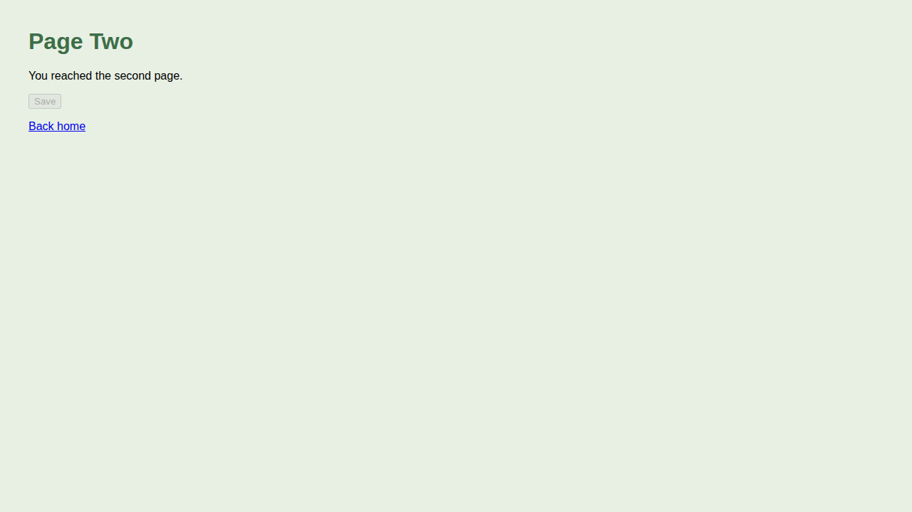

---
first_authored:
  by: "@claude-opus-5-5"
  at: 2026-10-08T09:26:26-07:00
task_list: cdocs/interfacer-agent
type: devlog
state: live
status: done
part_of: cdocs/devlogs/2026-10-08-interfacer-agent.md
tags: [interfacer, browser_delegation, subagents, runtime_validated]
---

# Interfacer Agent Implementation: Devlog

> BLUF: Iterate round 1 implementation of [the interfacer proposal](../proposals/2026-10-08-interfacer-agent.md), Phases 1-4, on branch `interfacer-agent`: agent, callers, and `browser-delegate` removal landed as specified, and static checks pass.
> The devcontainer canary (run 5 of 5) meets every criterion except screenshots, because the container cannot launch a browser (curl fallback); a secondary host run covers the browser path and supplies the `_media` screenshot.
> The canary forced four one-clause agent fixes (still 70 lines) and exposed a deviation from D5: a `SendMessage` resume runs in the background, so a dispatcher must stay in its turn to receive the reply.

## Objective

Implement `cdocs/proposals/2026-10-08-interfacer-agent.md` Phases 1-4: add `plugins/cdocs/agents/interfacer.md`, wire its callers, remove `browser-delegate`, and run the live canary.

> NOTE(opus-5-5/cdocs/interfacer-agent): The overseer reversed the proposal's ordering line: this lands before the graphify overhaul, which rebases onto it.

## Scratchpoint

- next_steps: none; review r1 accepted (`cdocs/reviews/2026-10-08-review-of-interfacer-agent-impl-r1.md`), its wording and NOTE items are applied, and the branch is ready to land.
- important_files: `plugins/cdocs/agents/interfacer.md`, `plugins/cdocs/agents/reviewer.md`, `plugins/cdocs/skills/{iterate,implement,devlog}/SKILL.md`, this devlog's Phase 4 sections.
- callouts:
  - decision: worktree `/var/home/mjr/code/weft/clauthier/interfacer-agent`, never writing `main/`.
  - decision: per maintainer steering, the canary that counts ran in the `clauthier` lace devcontainer (claude 2.1.285); a host run (claude 2.1.293) is secondary and covers the browser.
  - blocker: the devcontainer cannot launch headless Chromium (11 missing system libraries; `--with-deps` dry-run fails on apt), so the browser path is unverified there.
  - deviation: four canary-driven agent fixes (probed errors are not `OK`, final-message-only replies, in-turn wait for resumes, tear down by PID); see the run table.
  - deviation: replies are async (resumes always; a first dispatch unless `run_in_background: false`); a dispatcher that ends its turn never gets the reply. The proposal now carries NOTEs under "Durable by default" and D5.
  - todo: the reviewer clauses (own interfacer, `_media` copy) are unexercised until the first real iterate round with a runtime floor, as the proposal says.
  - observation: a `setsid` wrapper PID was twice recorded as the server PID (both runs self-corrected); tool knowledge, left to projects.
  - env: the worktree had no `node_modules`; `npm ci` (gitignored) was needed before `test:rules`/`test:opencode` could run.
  - cleanup: sandboxed `CLAUDE_CONFIG_DIR`s (credential copies) deleted on host and in the container; fixtures, streams, and instance dirs left in place as ephemeral evidence.

## Plan

1. Phase 1: agent file, `AGENTS.md`, `README.md`; `npm run test:rules`, `npm run test:opencode`.
2. Phase 2: caller clauses in `reviewer.md`, iterate, implement, devlog skills.
3. Phase 3: delete `plugins/browser-delegate/`, marketplace entry, root README bullet; archive the old proposal.
4. Phase 4: live canary per the proposal's Verification Methodology.

## Testing Approach

Static checks (`test:rules`, `test:opencode`, `jq`, `grep`) per phase; the live nested `claude -p` canary is the behavioral test.

## Implementation Notes

- Phase 1: the agent body started as the proposal's spec block verbatim (69 lines); Phase 4 then added four one-clause fixes (70 lines).
  The OpenCode build emits it with only `description` and `mode: subagent` (no `model`, `tools`, `permission`), as the proposal predicted.
- Phase 2: one clause per file, worded as the proposal's "Callers" section gives them.
  The reviewer's new sentence is its own bullet after the `Bash` bullet; the `_media` clause swaps the `Artifacts`-line/`.png` keying for "media a subagent produced ... `.<ext>`" and adds "look at it yourself".
- Phase 3: the old proposal gets `state: archived`, `status: evolved`, and the NOTE under its H1; its body and `last_reviewed` are untouched.

### Phase 4: canary setup

> NOTE(opus-5-5/cdocs/interfacer-agent): Maintainer steering moved the counted canary into the `clauthier` lace devcontainer (`podman exec -u node -w /workspace/clauthier/interfacer-agent clauthier ...`; Debian 12, claude 2.1.285, node v24.21.0, Python 3.11.2).

Container-specific setup, all by the verifier:

- Fixture: `mktemp -d /tmp/ifx-fixture.XXXXXX` -> `/tmp/ifx-fixture.Nau89p` (container tmp), a git repo with `site/{index,page2}.html`, `site/health.json`, a README, `.gitignore` (`node_modules/`), and one commit.
- Browser tooling: `npm install --save-dev @playwright/cli` (0.1.22) then `npx playwright-cli install-browser chromium --only-shell` (downloaded `chromium_headless_shell-1247`).
  Default config failed (`Chromium distribution 'chrome' is not found at /opt/google/chrome/chrome`); a `.playwright/cli.config.json` with `browserName: chromium` then failed with `error while loading shared libraries: libatk-1.0.so.0`.
  `ldd` lists 11 missing libraries: `libatk-1.0.so.0 libatk-bridge-2.0.so.0 libdbus-1.so.3 libXcomposite.so.1 libXdamage.so.1 libXfixes.so.3 libXrandr.so.2 libgbm.so.1 libxkbcommon.so.0 libasound.so.2 libatspi.so.0`.
  `install-browser --with-deps --dry-run` fails too (`E: Unable to locate package fonts-ipafont-gothic`, and three more font packages); the container's apt state was not changed.
  So the fixture README documents `curl` as the driver and says the browser does not work there.
- Claude config: a sandboxed `CLAUDE_CONFIG_DIR` (`mktemp -d /tmp/ifx-ccsb.XXXXXX` with copies of `~/.claude/.credentials.json` and `~/.claude/.claude.json`), `CDOCS_CHAT_RECORD=off`, `--permission-mode bypassPermissions`, `--model sonnet` for the top level and stand-in.
- Process monitor: `/tmp/ifx-psmon.sh` logs the `http.server 8799` PID once a second to `/tmp/ifx-psmon.log`.
- Port 8765 is taken on the host (a `voicemode` service answered 401 during a host probe), so the fixture uses 8799.

## Changes Made

| File | Description |
|------|-------------|
| `plugins/cdocs/agents/interfacer.md` | New sonnet testing-assistant agent: the spec plus four canary fixes (70 lines). |
| `plugins/cdocs/AGENTS.md` | `interfacer` bullet under Formal Agents. |
| `plugins/cdocs/README.md` | 8 agents in the OC table; `interfacer` named with `bash-runner` as following no rules. |
| `plugins/cdocs/agents/reviewer.md` | Own-interfacer sentence; `_media` clause generalized to any subagent media. |
| `plugins/cdocs/skills/iterate/SKILL.md` | Turn N.b floor and `confirmed` row name the reviewer's interfacer. |
| `plugins/cdocs/skills/implement/SKILL.md` | Step 5 verification bullet prefers a warm interfacer. |
| `plugins/cdocs/skills/devlog/SKILL.md` | Screenshots bullet: copy from an interfacer's report dir. |
| `plugins/browser-delegate/` | Deleted. |
| `.claude-plugin/marketplace.json`, `README.md` | `browser-delegate` entry and bullet deleted. |
| `cdocs/proposals/2026-09-17-browser-delegation-plugin.md` | Archived, `evolved`, superseded NOTE. |

## Screenshots



Host canary check 02, copied from `/tmp/claude-1000/interfacer/E24cvT/02-click-link-page2/page2.png` (`cp -n`, then `cmp` identical).

## Verification

### Static checks

Final, against the agent at `47da807`:

```
npm run test:rules     -> tests 11, pass 11, fail 0
npm run test:opencode  -> tests 9, pass 9, fail 0; "✔ OC agent interfacer.md"; built frontmatter has only description + mode: subagent
wc -l plugins/cdocs/agents/interfacer.md -> 70
jq -r '.plugins[].name' .claude-plugin/marketplace.json -> cdocs
grep -rn -i 'browser-delegate' --exclude-dir={cdocs,.git,build,node_modules} . -> no output, exit 1
```

Phases 1-3, before the canary fixes:

```
npm run test:rules     -> tests 11, pass 11, fail 0 (after Phase 1 and again after Phase 2)
npm run test:opencode  -> tests 9, pass 9, fail 0; "✔ OC agent interfacer.md"
wc -l plugins/cdocs/agents/interfacer.md -> 69
jq -r '.plugins[].name' .claude-plugin/marketplace.json -> cdocs
grep -rn -i 'browser-delegate' --exclude-dir={cdocs,.git,build,node_modules} . -> no output, exit 1
```

### Phase 4: devcontainer canary (the run that counts)

Command, from the fixture in container `clauthier`:

```sh
CLAUDE_CONFIG_DIR=/tmp/ifx-ccsb.xHos6j CDOCS_CHAT_RECORD=off claude -p \
  --plugin-dir /workspace/clauthier/interfacer-agent/plugins/cdocs \
  --permission-mode bypassPermissions --model sonnet \
  --output-format stream-json --verbose "$(cat /tmp/ifx-prompt.txt)"
```

The prompt has the top level dispatch a `general-purpose` stand-in, which dispatches `cdocs:interfacer` with "Check that the home page of this project's site renders and that its link reaches page two." (what, not how), then resumes it with `SendMessage` three times: "Now follow the link from the home page and capture page two.", the error probe "Fetch /missing.html, and check whether page two has an element with id `delete`.", and "tear down".

Five runs; all evidence is container-local and ephemeral (`/tmp/ifx-canary-runN.jsonl`, `/tmp/ifx-psmon-runN.log`, `/tmp/claude-1000/interfacer/<instance>/`), so the excerpts below are inlined.

| Run | Agent at | Instance | Outcome |
|---|---|---|---|
| 1 | `65e0fc5` (spec text) | `jzWzSX` | All steps ran, but check 03 reported `Status: OK` with a 404 and a missing element in its steps; resumed turns also `SendMessage`d free-form replies to the stand-in. |
| 2 | `2f829ee` (error-status + final-message-only fix) | `x3OAam` | Stand-in ended its turn after step 2's `SendMessage` and was never re-woken; steps 3-4 never sent; server PID 545727 left running (verifier killed it). |
| 3 | `2f829ee`, prompt adds an explicit in-turn wait | `YOacek` | All steps; each resumed reply reached the stand-in "as a task-notification after sleep 1"; check 03 `WARNINGS`. |
| 4 | `1c20ce0` (in-turn wait in the description), original prompt | `IZhswX` | All steps; stand-in waited with `sleep 20` unprompted; tear down used `pkill -f "http.server 8799"`, which matched its own shell (exit 144). |
| 5 | `47da807` (tear down by PID), original prompt | `uAlIdy` | All steps, every criterion below. Run of record. |

> NOTE(opus-5-5/cdocs/interfacer-agent): Four agent fixes came out of the canary; each is one clause, and the agent is 70 lines.
> 1. Status rule: a 404, missing element, or other error makes `Status:` `WARNINGS`/`FAILED` "even when the check was probing for it" (run 1).
> 2. Final message only, never `SendMessage` (run 1's resumed turns sent headerless replies).
> 3. Description: an in-turn wait for background replies (runs 2-3); after review r1 it reads "Replies can arrive in the background (a resumed check's always does), so stay in your turn (e.g. a short Bash `sleep`; the harness refuses long sleeps) until each arrives."
> 4. Tear down "by the PID or session name you recorded (never a pattern like `pkill -f`)" (run 4).

#### Resume mechanics (deviation from the proposal's model)

The proposal's D5 and sequence diagram assume a `SendMessage` follow-up returns its reply to the dispatcher like a call.
In claude 2.1.285 it does not: the stream's `task_started` events show the first dispatch at `spawn_depth: 2, is_backgrounded: false` (only because the stand-in passed `run_in_background: false`; an `Agent` call that omits it is async too, as the host run's depth-1 stand-in and review r1's host run show), and every `SendMessage` resume at `spawn_depth: 2, is_backgrounded: true`, with the `SendMessage` tool result only `{"success":true,"message":"Resuming agent ..."}`.
The resumed reply is delivered as a task-notification at the dispatcher's next tool call; a nested dispatcher that ends its turn instead never receives it (run 2), and the notification surfaces at the root session.
Run 1 only progressed because the interfacer itself `SendMessage`d the stand-in, which re-woke it.
The description sentence (fix 3) is the whole remedy; run 4 and run 5 show a stand-in following it from the description alone.

Run 5 `task_started`/`task_notification` excerpt (`jq` over `/tmp/ifx-canary-run5.jsonl`):

```
{"s":"task_started","task":"a49687c7","depth":1,"bg":false,"type":"general-purpose"}
{"s":"task_started","task":"a69ee1ef","tu":"toolu_014W8hoE","depth":2,"bg":false,"type":"cdocs:interfacer"}
{"s":"task_notification","task":"a69ee1ef","sum":"INTERFACER REPORT\nReport: /tmp/claude-1000/interfacer/uAlIdy/01-home-t"}
{"s":"task_started","task":"a69ee1ef","tu":"toolu_01HrM6uE","depth":2,"bg":true,"type":"cdocs:interfacer"}
{"s":"task_notification","task":"a69ee1ef","tu":"toolu_01HrM6uE","sum":"INTERFACER REPORT\nReport: /tmp/claude-1000/interfacer/uAlIdy/02-follow"}
{"s":"task_started","task":"a69ee1ef","tu":"toolu_01ULNeDy","depth":2,"bg":true,"type":"cdocs:interfacer"}
{"s":"task_notification","task":"a69ee1ef","tu":"toolu_01ULNeDy","sum":"INTERFACER REPORT\nReport: /tmp/claude-1000/interfacer/uAlIdy/03-missin"}
{"s":"task_started","task":"a69ee1ef","tu":"toolu_01142d9c","depth":2,"bg":true,"type":"cdocs:interfacer"}
[stand-in] Agent: {"subagent_type":"cdocs:interfacer","prompt":"Check that the home page of this project's site renders and that its link reaches page two.","run_in_background":false}
[stand-in] SendMessage: {"to":"a69ee1ef15ce073b0","message":"Now follow the link from the home page and capture page two."}   then Bash: sleep 20
[stand-in] SendMessage: {"to":"a69ee1ef15ce073b0","message":"Fetch /missing.html, and check whether page two has an element with id `delete`."}   then Bash: sleep 20
[stand-in] SendMessage: {"to":"a69ee1ef15ce073b0","message":"tear down"}   then Bash: sleep 20
[interfacer] Bash: kill 548444; sleep 1; kill -0 548444 2>&1; curl -sS -m 2 -o /dev/null http://127.0.0.1:8799/ 2>&1
```

#### Run 5 pass criteria

| Criterion | Result | Evidence |
|---|---|---|
| `Agent` with `subagent_type: cdocs:interfacer` at depth 2 | Pass | `task_started` `spawn_depth: 2`, `subagent_type: cdocs:interfacer` |
| `SendMessage` to the same `agentId` | Pass | all three `to: a69ee1ef15ce073b0`, the `agentId` of the first dispatch (task `a69ee1ef`) |
| Foreground or background recorded | Pass, both | first dispatch foreground (`is_backgrounded: false`, because the stand-in passed `run_in_background: false`); resumes background. The server started in foreground check 01 survived into checks 02-03, so the foreground-lifetime WARN holds for the gap it covers. |
| One instance dir with `01-*/` and `02-*/`, each with `report.md` | Pass | `uAlIdy/{01-home-to-page2,02-follow-link,03-missing-and-delete}/report.md` |
| Each check has a screenshot matching its description | **Not met (container)** | no browser in the container (see setup); media are saved HTML and headers. Browser path: see the host run below. |
| Check 1 `Setup:` cites the fixture README | Pass | "README.md says to serve with `python3 -m http.server 8799 ...` and drive via curl" |
| Check 2 reused check 1's server (same PID) | Pass | reports 02/03 "reused my server (PID 548444)"; monitor `09:40:29`-`09:41:30` shows only `548444` (61 one-second samples); `server.log` in 01 continues with checks 02-03's requests |
| Error probe not reported `OK` | Pass | 03 `Status: WARNINGS`, step "GET /missing.html -> 404 (expected by the probe, still reported as an error)", and `id="delete"` -> 0 matches |
| After tear down, server and session gone | Pass | interfacer: "`kill -0` reports no such process, and a request to port 8799 is refused"; monitor empty from `09:41:31`; `ps` shows no `http.server 8799` |
| Fixture `git status` shows nothing the interfacer created | Pass | `git status --short --ignored` -> `!! node_modules/` only (verifier's install) |
| Screenshot copied to `cdocs/_media/` and embedded | From the host run | the container produced no screenshot |

Run 5 monitor log (`uniq -c -f1 /tmp/ifx-psmon-run5.log`; `pid<ppid`, the first sample also catches the `setsid` wrapper):

```
     16 09:40:12 srv=[]
      1 09:40:28 srv=[548439<548197,548444<1,]
     61 09:40:29 srv=[548444<1,]
     30 09:41:31 srv=[]
```

Run 5 check 03 `report.md`:

```
# 03-missing-and-delete
Status: WARNINGS
Setup: reused my server (PID 548444, 127.0.0.1:8799), curl per README.md.
## Steps
1. GET /missing.html -> 404 (expected by the probe, still reported as an error)
2. GET /page2.html -> 200; grep for id="delete" -> 0 matches. The only id on the page is "save" (disabled button).
## Media
- /tmp/claude-1000/interfacer/uAlIdy/03-missing-and-delete/01-missing.html, .../01-missing.headers: 404 response
- /tmp/claude-1000/interfacer/uAlIdy/03-missing-and-delete/02-page2.html, .../02-page2.headers: page two
## Left running
- python3 http.server 127.0.0.1:8799, PID 548444: kill 548444
## Notes
No element with id "delete" exists on page two. HTML inspection only, no screenshots.
```

Other observations:

- The interfacer followed the README's tool choice in every run: curl, no browser install attempt, no tool swap.
- It started the server with `setsid` each run (parent PID 1 in the monitor), never `run_in_background`.
- The tear-down reply reuses check 03's report path rather than writing a new check directory; the agent body does not ask for one, so this matches the spec.
- Run 5's check 01 notes "server.pid initially recorded the wrapper PID; corrected to 548444", a self-corrected slip that the report surfaced rather than hid.

### Phase 4: host canary (secondary, browser path)

The devcontainer cannot run a browser, so a host run (claude 2.1.293, agent at `47da807`) covers the screenshot criteria.
Its fixture (`mktemp -d` in the session scratchpad) has the same site, a project-local `@playwright/cli` 0.1.22, a `.playwright/cli.config.json` pinning `~/.cache/ms-playwright/chromium_headless_shell-1208/chrome-headless-shell-linux64/chrome-headless-shell`, and a README naming `npx playwright-cli -s=<name>` as the driver plus how to set `outputDir` via a `--config` copy (playwright-cli otherwise writes `.playwright-cli/` into its cwd).
The prompt is the container one with "click the link on the home page and screenshot page two" and "Open /missing.html and screenshot it" as follow-ups, run from a sandboxed `CLAUDE_CONFIG_DIR`.

| Criterion | Result | Evidence |
|---|---|---|
| Depth 2, same `agentId` | Pass | `task_started` `spawn_depth: 2`, `cdocs:interfacer`; three `SendMessage` `to: aee6c5abf76331362`; stand-in waited with `sleep 15` and `sleep 20` between them; the harness refused its `sleep 30` (`Blocked: standalone sleep 30. To wait for a condition, use Monitor with an until-loop ...`, twice). The depth-1 stand-in itself ran in the background (`is_backgrounded: true`; the top level's `Agent` call omitted `run_in_background`), while its interfacer dispatch passed `false` and ran in the foreground |
| Instance dir with `01-*/`, `02-*/`, `report.md` and screenshots | Pass | `/tmp/claude-1000/interfacer/E24cvT/{01-home-to-page2/{home,page2}.png, 02-click-link-page2/page2.png, 03-missing-and-delete/{missing,page2}.png}`; the verifier viewed `home.png`, both `page2.png`, and `missing.png`, and each matches its description |
| `Setup:` cites the README | Pass | "README.md in the project ... Driven with `npx playwright-cli -s=chk --config .../E24cvT/cli.config.json` (copy of project config plus outputDir)" |
| Server and session reused | Pass | one new headless-shell PID (`3959784`, 09:42:42-09:44:04, versus a 19-process baseline from other sessions) and one server PID (`3959597`) across all checks; checks 02-03 use `goto`, never `open` |
| Error probe not `OK` | Pass | 03 `Status: WARNINGS` (404 plus console error); 02 `Status: WARNINGS` too, for two stale-ref click errors a retry got past |
| Tear down leaves nothing | Pass | `playwright-cli list` -> `(no browsers)`; no `http.server 8799`; monitor empty from 09:44:10 |
| Fixture `git status` clean | Pass | `!! node_modules/` only; the README's `outputDir` recipe kept `.playwright-cli/` out of the tree (its snapshots landed in the instance dir) |

Host-run caveats:

- The recorded `server.pid` (3959595) was the `setsid` wrapper, not the server (3959597); the first tear-down `kill` missed, and the interfacer checked `ss`, then killed 3959597 by PID.
  The reports' `Left running` lines carried the wrong PID until tear down.
- Check 01's tool calls do not appear in either stream (the foreground depth-2 run is not streamed); only its files and its final report are evidence for it.
