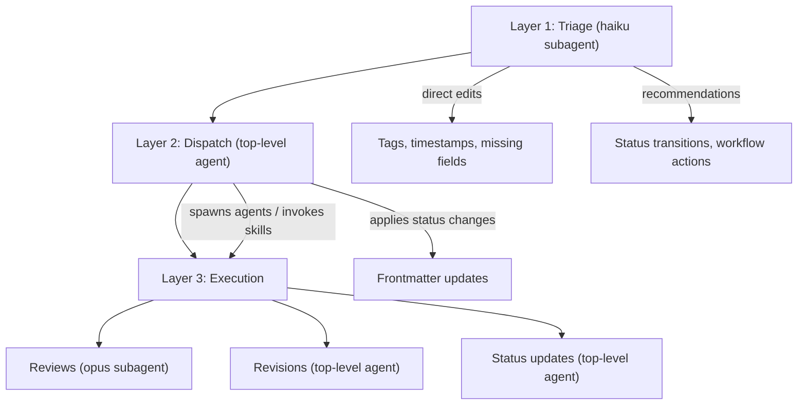

---
first_authored:
  by: "@claude-opus-4-5-20251101"
  at: 2026-01-29T12:00:00-08:00
last_reviewed:
  status: accepted
  by: "@claude-opus-4-5-20251101"
  at: 2026-01-29T13:00:00-08:00
  round: 2
task_list: cdocs/haiku-subagent
type: proposal
state: live
status: evolved
tags: [architecture, workflow_automation, claude_skills, subagent_patterns]
---

# Haiku Subagent for Frontmatter Maintenance and Workflow Automation

> BLUF(mjr/cdocs/haiku-subagent): Add a lightweight haiku subagent as an end-of-turn triage step that maintains cdocs frontmatter/tags and recommends workflow continuations (auto-review, auto-revision).
> Triage applies confident frontmatter edits directly (tags, timestamps) and reports them to the caller alongside recommendations for changes requiring judgment (status transitions, workflow actions).
> The top-level agent reviews the report, acts on recommendations, and dispatches workflow actions (opus for reviews, inline for revisions).
> The approach is a new `/cdocs:triage` skill backed by a haiku-model Task subagent, codified as a workflow pattern in `rules/workflow-patterns.md`.

## Objective

CDocs documents have a well-defined lifecycle (wip -> review_ready -> reviewed -> done) with frontmatter tracking state transitions, review status, and tags.
Currently, all of this bookkeeping is manual: the authoring agent must remember to update frontmatter, mark documents as review_ready, notice when reviews request revisions, and invoke the appropriate next skill.

This proposal explores adding a lightweight haiku-model subagent that runs at the end of agent turns to:
1. Maintain frontmatter accuracy (status, tags, timestamps).
2. Recommend which cdocs skill should be invoked next based on document state.
3. Enable automated workflow continuations: review_ready docs get reviewed, revision_requested docs get revised.

## Background

### Current state

- **Frontmatter spec** (`rules/frontmatter-spec.md`): defines required fields, valid values, status transitions.
- **PostToolUse hook** (`hooks/cdocs-validate-frontmatter.sh`): validates field presence after Write/Edit, but only checks existence, not semantic correctness.
- **Skills**: devlog, propose, review, report, status, init. Each operates independently.
- **Workflow patterns** (`rules/workflow-patterns.md`): parallel agents and subagent-driven development patterns. No end-of-turn triage pattern exists.

### What's missing

- No automated frontmatter updates (status transitions lag behind actual document state).
- No mechanism to detect "this document is done, trigger a review."
- No mechanism to detect "this review requests revisions, start revising."
- Tags often reflect initial creation context but aren't updated as content evolves.
- The review skill suggests Claude "may suggest a review when a document reaches review_ready" but there's no systematic trigger.

### Claude Code constraints

- **Hooks** run shell commands, not agent invocations. A hook cannot spawn a haiku Task subagent.
- **Task tool** supports `model: "haiku"` for cheap/fast subagents.
- **Context window** is managed by automatic compaction. Agents don't have programmatic access to context utilization percentage.
- **Skills** are loaded as prompts, not as executable code. A skill instructs the agent what to do, but the agent must choose to follow it. A skill cannot programmatically invoke another skill; inter-skill dispatch relies on the top-level agent's judgment.

## Proposed Solution

### Architecture: three-layer design



### The triage subagent

A haiku-model Task subagent invoked at the end of substantive work on cdocs documents.
Triage applies confident, mechanical edits directly (tags, timestamps, missing fields) and reports them to the caller.
Changes requiring judgment (status transitions, workflow actions) are returned as recommendations for the top-level agent.

**Invocation:** the top-level agent spawns a haiku Task subagent after completing substantive cdocs work.
"End of turn" means: after the agent finishes responding to a user message that involved creating or modifying cdocs documents.
Triage is not invoked mid-authoring or after trivial edits (typo fixes, formatting).

**Inputs (via prompt):**
- List of cdocs file paths created or modified in the current turn (absolute from repo root).
- The triage prompt template (see Appendix A).

**Responsibilities:**
1. **Frontmatter fixes (direct edits)**: add missing required fields, fix malformed timestamps, update tags to reflect document content. These are confident, mechanical changes applied via Edit calls and reported to the caller.
2. **Tag maintenance (direct edits)**: scan document headings and content for topic keywords, compare to existing tags. Add missing tags, remove stale tags. Be conservative: only change tags clearly supported by (or contradicted by) document content.
3. **Status transition detection (recommendations only)**: if a document appears complete but status is still `wip`, recommend updating to `review_ready`. Completeness signals: all template sections filled, verification section with evidence (for devlogs), BLUF present and consistent with content (for proposals/reports).
4. **Workflow recommendations (recommendations only)**: return a structured list of recommended next actions based on document state.

**Output format** (returned to top-level agent):

```
TRIAGE REPORT
=============
Files triaged: N

CHANGES APPLIED:
- cdocs/proposals/2026-01-29-foo.md:
  tags: added [hooks, workflow], removed [future_work]
- cdocs/devlogs/2026-01-29-bar.md:
  no changes needed

RECOMMENDATIONS:
- cdocs/proposals/2026-01-29-foo.md:
  status: recommend wip -> review_ready (all sections filled, BLUF present)
- cdocs/devlogs/2026-01-29-bar.md:
  status: no change (verification section empty)

WORKFLOW RECOMMENDATIONS:
- [REVIEW] cdocs/proposals/2026-01-29-foo.md is review_ready. Recommend: spawn opus review subagent.
- [REVISE] cdocs/proposals/2026-01-28-bar.md has revision_requested (round 1). Recommend: top-level agent revises inline.
- [ESCALATE] cdocs/proposals/2026-01-27-baz.md has revision_requested (round 3). Recommend: escalate to user.
- [NONE] cdocs/devlogs/2026-01-29-qux.md: no action needed.
```

### Workflow continuations

Based on triage recommendations, the top-level agent dispatches:

| Recommendation | Action | Agent |
|----------------|--------|-------|
| `[REVIEW]` review_ready doc | Invoke review skill | Opus subagent (Task tool, model: opus or sonnet) |
| `[REVISE]` revision_requested doc | Revise inline per review action items | Top-level agent (needs authoring context) |
| `[ESCALATE]` round >= 3, still revision_requested | Report to user for decision | Top-level agent (presents options) |
| `[STATUS]` status update needed | Update frontmatter | Top-level agent (quick edit) |
| `[NONE]` | No action | - |

### Auto-review flow

When triage detects a `review_ready` proposal or devlog:
1. Triage returns `[REVIEW]` recommendation with document path.
2. Top-level agent spawns an opus (or sonnet) subagent via Task tool.
3. Subagent reads the document and the review skill instructions, writes the review.
4. Triage runs again on the review output to validate review frontmatter.
5. Top-level agent reports the review verdict to the user.

### Auto-revision flow

When triage detects a document with `last_reviewed.status: revision_requested`:
1. Triage returns `[REVISE]` recommendation with document path and review path.
2. Top-level agent reads the review's action items.
3. Top-level agent revises the document inline (it has the authoring context).
4. Top-level agent updates `status: review_ready` for re-review.
5. If context is heavy, the user may want to compact first. Since agents can't programmatically check context utilization, this is a user decision or a heuristic based on turn count.

NOTE(mjr/cdocs/haiku-subagent): The user suggested compaction when context > 50%.
Claude Code's automatic compaction handles this transparently.
A practical heuristic: if the revision is the third or later major task in a session, suggest compaction or a fresh agent.

## Important Design Decisions

### Decision 1: Skill vs. rule vs. hook for the triage pattern

**Decision:** New `/cdocs:triage` skill + workflow pattern in `rules/workflow-patterns.md`.

**Why:** Hooks cannot spawn agents (shell-only).
A rule alone is advisory and easily forgotten.
A skill gives explicit invocability and discoverability, while the workflow pattern establishes the convention of "always triage at end of turn."
The skill contains the haiku subagent prompt; the rule establishes when to invoke it.

### Decision 2: Haiku for triage, opus for reviews

**Decision:** Use haiku for the triage/bookkeeping layer, opus (or sonnet) for review execution.

**Why:** Triage is mechanical: read frontmatter, compare to content, update fields, emit recommendations.
This doesn't require deep reasoning, just accurate pattern matching.
Reviews require critical analysis: evaluating proposal quality, finding gaps, making judgment calls.
Haiku keeps the triage step cheap and fast (sub-second), which matters if it runs at the end of every turn.

### Decision 3: Confident edits applied directly, judgment calls recommended

**Decision:** The haiku triage agent applies confident, mechanical frontmatter edits directly (tags, timestamps, missing fields) and reports them.
Status transitions and workflow actions are returned as recommendations for the top-level agent.

**Why:** Tag additions/removals and timestamp fixes are unambiguous: a proposal discussing hooks either has the `hooks` tag or it doesn't.
Haiku is reliable enough for these mechanical edits, and applying them directly avoids a round-trip through the top-level agent.
Status transitions carry semantic weight (marking `review_ready` is a judgment about completeness) and remain recommendations.
The existing PostToolUse hook validates field presence after edits, providing a basic safety net.
All applied changes are reported in the triage output, so the top-level agent has full visibility.

> TODO(mjr/cdocs/haiku-subagent): A wrapping utility script for structured YAML frontmatter mutations would provide machine-oriented correctness.
> This is a natural future enhancement that benefits both triage and manual maintenance.

### Decision 4: Structured text output, not JSON

**Decision:** Triage output uses structured plain text, not JSON.

**Why:** The consumer is the top-level Claude agent, not a program.
Structured text is easier for the agent to parse and act on.
JSON adds formality without benefit since the agent interprets natural language natively.

### Decision 5: Revisions stay with the top-level agent

**Decision:** Auto-revision is performed by the top-level agent, not a subagent.

**Why:** The authoring agent has the full context of what was written and why.
A fresh subagent would need to reconstruct this context from the document alone, losing nuance.
Reviews, by contrast, benefit from a fresh perspective (a subagent hasn't seen the authoring process).

### Decision 6: Context management is heuristic, not programmatic

**Decision:** Use turn-count heuristics and user judgment for context management before revisions, rather than attempting to measure context utilization programmatically.

**Why:** Claude Code's context utilization is not exposed to the agent.
Automatic compaction handles the mechanical concern.
The deeper concern (whether the agent has "fresh enough" perspective for revisions) is better addressed by the user deciding whether to continue or start a fresh session.
A practical heuristic: if the revision is the Nth major task in a session, the triage agent can note this in its recommendations.

## Stories

### Story 1: Author finishes a proposal

Agent completes writing a proposal.
Triage haiku runs, reads the proposal, notices all sections are filled and BLUF is present.
Recommends `status: wip -> review_ready` and tag additions.
Top-level agent applies the frontmatter updates and acts on the `[REVIEW]` recommendation.
Top-level agent spawns opus review subagent.
Review is written, verdict returned.
If `revision_requested`: top-level agent revises, re-triages, re-reviews.
If `accepted`: top-level agent updates proposal to `status: implementation_ready` (or `done` for non-implementation docs).

### Story 2: Agent resumes work on a previously-reviewed proposal

Agent opens a proposal with `last_reviewed.status: revision_requested`.
Triage (or the top-level agent reading status) identifies the pending revision.
Top-level agent reads the review's action items, revises the proposal.
Triage runs, recommends `status: review_ready` for re-review.
Top-level agent applies the update, opus subagent writes round 2 review.

### Story 3: Devlog reaches natural completion

Agent finishes implementation work, devlog is updated with verification results.
Triage notices the devlog has a verification section with evidence (non-empty, contains pasted output or concrete results).
Recommends `status: wip -> review_ready`.
Returns `[REVIEW]` recommendation (devlog reviews evaluate work quality, not just doc quality).
Top-level agent decides whether to invoke review or defer.

### Story 4: Multiple documents modified in one turn

Agent modifies a proposal and its devlog.
Triage reads both, analyzes frontmatter on each independently.
Returns recommendations for each document (frontmatter updates + workflow actions).
Top-level agent applies frontmatter updates, batches workflow actions or prioritizes.

## Edge Cases / Challenging Scenarios

### 1. Haiku misjudges document completeness

Risk: haiku prematurely recommends a document as `review_ready` when the author intended to continue editing.

Mitigation: status transitions are recommendations, not direct edits (Decision 3).
The top-level agent (or user) reviews status recommendations before applying them.
Tag and timestamp edits are applied directly but reported, so the caller has full visibility.

### 2. Triage runs on partially-written documents

If triage runs mid-authoring (not end-of-turn), it might flag incomplete documents incorrectly.

Mitigation: triage is explicitly an end-of-turn operation.
The workflow pattern and skill instructions make this clear.

### 3. Conflicting triage recommendations

Triage recommends both reviewing and revising the same document (shouldn't happen with valid state, but could with corrupted frontmatter).

Mitigation: triage detects frontmatter inconsistencies, reports contradictions, and only recommends actions after flagging the issue.
The top-level agent resolves contradictions before acting on workflow recommendations.

### 4. Review subagent lacks plugin context

An opus review subagent spawned via Task doesn't automatically load the cdocs plugin's rules and skill instructions.

Mitigation: the triage prompt includes instructions to pass relevant skill content (review skill SKILL.md) to the review subagent's prompt.
Alternatively, the top-level agent invokes the review skill directly rather than spawning a subagent.

NOTE(mjr/cdocs/haiku-subagent): This is a real constraint of the Task tool.
Subagents don't inherit plugin context.
The practical solution is to inline the review skill instructions into the subagent prompt.

### 5. Infinite review-revision loop

A review requests revisions, revision triggers re-review, re-review requests more revisions, etc.

Mitigation: cap at 2-3 review rounds.
After round 3, triage recommends escalating to the user rather than continuing the loop.
The `last_reviewed.round` field tracks this.

### 6. Context budget for chained operations

Authoring + triage + review + revision in one session could consume significant context.

Mitigation: triage can recommend deferring review to a fresh session.
Heuristic: if this is already the second major task in the session, recommend deferring.

## Test Plan

1. **Manual triage invocation**: invoke `/cdocs:triage` on a known set of cdocs files, verify frontmatter updates and recommendations are correct.
2. **Auto-review flow**: write a proposal, run triage, verify it recommends review, spawn review subagent, verify review is written correctly.
3. **Auto-revision flow**: given a reviewed proposal with `revision_requested`, run triage, verify it recommends revision, revise, re-triage, verify status update.
4. **Tag maintenance**: create a document with missing/stale tags, run triage, verify tags are updated.
5. **Edge case: partial document**: run triage on a wip document with empty sections, verify it does NOT recommend review_ready.
6. **Edge case: round cap**: simulate 3 review rounds, verify triage recommends user escalation instead of round 4.
7. **Recommendation accuracy**: run triage across all existing cdocs (N documents), verify recommendations are sensible and conservative (no false review_ready recommendations on incomplete documents).

## Implementation Phases

### Phase 0: Validate Task tool model parameter

1. Verify that the Task tool's `model: "haiku"` parameter works as expected.
2. Confirm haiku subagents can read files via the Read tool and return structured text.
3. Document any limitations discovered.

NOTE(mjr/cdocs/haiku-subagent): This was validated during dogfooding of this proposal.
The Task tool's model parameter works correctly: haiku subagents can read files, analyze content, and return structured reports.

**Success criteria:** haiku Task subagent successfully reads cdocs files and returns structured output.

### Phase 1: Triage skill and workflow pattern

1. Create `skills/triage/SKILL.md` with the haiku subagent prompt template (Appendix A).
2. Add "End-of-Turn Triage" section to `rules/workflow-patterns.md`.
3. The skill instructs the top-level agent to spawn a haiku Task subagent with:
   - The list of modified cdocs file paths.
   - The prompt template from Appendix A.
4. The skill also instructs the top-level agent how to interpret and act on the triage report.

**Success criteria:** `/cdocs:triage` can be invoked, spawns a haiku agent, and returns a triage report.

### Phase 2: Frontmatter analysis logic

1. Refine the triage agent's analysis rules (iterated from Appendix A):
   - Tags: scan document headings and content for topic keywords, compare to existing tags.
   - Timestamps: verify `first_authored.at` is present and valid ISO 8601 with timezone.
   - Status: detect completeness signals per type (see Appendix A, step 4). Recommend transitions conservatively.
2. Test on existing cdocs in this repo: run triage against all documents, verify recommendations are sensible.

**Success criteria:** triage correctly identifies frontmatter issues and makes conservative, accurate recommendations.

### Phase 3: Workflow recommendation engine

1. Define recommendation rules:
   - `status: review_ready` + no `last_reviewed` -> `[REVIEW]` (first review)
   - `status: review_ready` + `last_reviewed.status: revision_requested` -> `[REVIEW]` (re-review)
   - `status: wip` + `last_reviewed.status: revision_requested` -> `[REVISE]` (revision needed)
   - `last_reviewed.status: accepted` + type `proposal` + `status` not `implementation_ready` -> `[STATUS]` (update to implementation_ready)
   - `last_reviewed.status: accepted` + type not `proposal` + `status` not `done` -> `[STATUS]` (update to done)
   - `last_reviewed.round >= 3` + still `revision_requested` -> `[ESCALATE]`
2. Integrate into triage agent prompt.

**Success criteria:** triage returns correct recommendations for each document state.

### Phase 4: Review dispatch integration

1. Define how the top-level agent acts on `[REVIEW]` recommendations.
2. Write the review subagent prompt template (includes inlined review skill instructions).
3. Test end-to-end: author -> triage -> review -> triage -> report to user.

> NOTE(mjr): The review subagent should be prompted to still consider if clarification is needed from the user.
> If the subagent can request user input it should get clarification right then,
> otherwise it should surface to its invoker that they should go request clarification with multi-choice options from the user
> (depends on available apis).

**Success criteria:** a review_ready document automatically gets reviewed when triage recommends it.

### Phase 5: Revision dispatch integration

1. Define how the top-level agent acts on `[REVISE]` recommendations.
2. The top-level agent reads the review action items and revises inline.
3. Test end-to-end: review with revision_requested -> triage -> revision -> triage -> re-review.
4. Implement round cap (3 rounds) and escalation.

**Success criteria:** revision_requested documents get revised and re-reviewed, with loop protection.

### Phase 6: CLAUDE.md and documentation updates

1. Add `/cdocs:triage` to the skills reference in CLAUDE.md.
2. Update README.md skill table.

**Success criteria:** triage is discoverable in project documentation.

## Appendix A: Haiku Triage Agent Prompt Template

This is the prompt passed to the haiku Task subagent.
The top-level agent fills in `$FILES` with the list of modified cdocs file paths.

```
You are a CDocs triage subagent. Your job is to maintain cdocs frontmatter and
recommend workflow actions. You apply confident, mechanical edits directly (tags,
timestamps, missing fields) and recommend changes that require judgment (status
transitions, workflow actions).

## Files to triage

$FILES

## Your tasks

For each file:
1. Read the file completely. If frontmatter is missing or unparseable, report the
   file as "frontmatter missing or malformed" and skip further analysis.
2. Check frontmatter fields against the CDocs frontmatter spec:
   - Required: first_authored (by, at), task_list, type, state, status, tags
   - Reviews also require: review_of
   - Non-reviews may have: last_reviewed (status, by, at, round)
   - If required fields are missing, add them via Edit with sensible defaults
     and report the addition.
3. Maintain tags (DIRECT EDIT): scan document headings and content for topic keywords.
   Compare to existing tags. Add missing tags, remove stale tags via Edit.
   Be conservative: only change tags clearly supported by document content.
   Report all tag changes in the triage output.
4. Analyze status (RECOMMEND ONLY): check for completeness signals.
   - Proposals: all template sections filled, BLUF present and consistent with content.
   - Devlogs: verification section non-empty with concrete evidence (pasted output, results).
   - Reports: BLUF present, key findings and analysis sections filled.
   - If document appears complete and status is wip, recommend review_ready.
   - If unsure, do NOT recommend a status change.
5. Check workflow state (RECOMMEND ONLY):
   - status: review_ready + no last_reviewed -> [REVIEW] (first review)
   - status: review_ready + last_reviewed.status: revision_requested -> [REVIEW]
     (re-review: author marked revised doc ready)
   - status: wip + last_reviewed.status: revision_requested -> [REVISE]
     (revision not yet started)
   - last_reviewed.status: accepted + type proposal + status not implementation_ready
     -> [STATUS] (recommend implementation_ready)
   - last_reviewed.status: accepted + type not proposal + status not done
     -> [STATUS] (recommend done)
   - last_reviewed.round >= 3 + still revision_requested -> [ESCALATE]
   - Otherwise -> [NONE]

NOTE: The distinction between [REVISE] and [REVIEW] hinges on the status field.
If status is review_ready, the author has declared the revision complete.
If status is still wip with revision_requested, the revision hasn't started.

## Output format

Return EXACTLY this structure:

TRIAGE REPORT
=============
Files triaged: N

CHANGES APPLIED:
- <path>:
  <field>: <description of edit made>
  (or "no changes needed")

RECOMMENDATIONS:
- <path>:
  status: <recommend X -> Y (reason), or "no change">

WORKFLOW RECOMMENDATIONS:
- [ACTION] <path>: <explanation>

Be precise. Use repo-root-relative paths. Do not editorialize.
```
