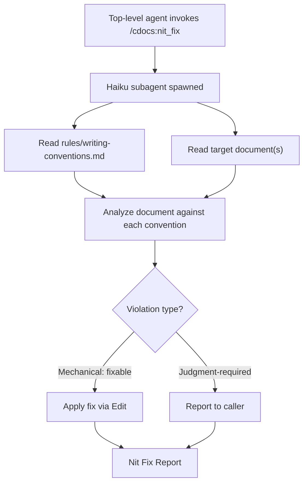

---
first_authored:
  by: "@claude-opus-4-5-20251101"
  at: 2026-01-29T14:00:00-08:00
task_list: cdocs/nit-fix
type: proposal
state: live
status: evolved
tags: [claude_skills, workflow_automation, writing_conventions, subagent_patterns]
last_reviewed:
  status: revision_requested
  by: "@claude-opus-4-5-20251101"
  at: 2026-01-29T15:30:00-08:00
  round: 1
---

# Nit Fix Skill

> BLUF(mjr/cdocs/nit-fix): A haiku-powered `/cdocs:nit_fix` skill that reads `rules/writing-conventions.md` at runtime and enforces it against target documents, applying mechanical fixes directly and reporting judgment-required violations.
> The agent contains no hardcoded rules: it is a generic "rules stickler" whose behavior evolves as the conventions file changes.
> Complements `/cdocs:triage` (which handles frontmatter/workflow state) by handling prose and formatting conventions.

## Objective

CDocs writing conventions (`rules/writing-conventions.md`) are easy to violate and tedious to enforce manually.
Convention violations accumulate during authoring because the authoring agent's attention is on content, not formatting.
A lightweight haiku subagent can scan documents for mechanical violations and fix them, functioning as a prose linter.

The agent must not embed convention knowledge in its own prompt.
Instead, it reads the rules file at runtime, making it a generic enforcement mechanism that adapts as conventions evolve.

## Background

### Current state

- **Writing conventions** (`rules/writing-conventions.md`): 11 conventions covering BLUF, brevity, sentence-per-line, callout syntax, history-agnostic framing, commentary decoupling, critical analysis, devlog convention, punctuation, diagrams, and emoji avoidance.
- **Triage skill** (`skills/triage/SKILL.md`): a haiku subagent that handles frontmatter accuracy and workflow recommendations. Does not address prose conventions.
- **Review skill** (`skills/review/SKILL.md`): a thorough section-by-section review that catches convention issues among other things. Heavyweight: opus-tier, produces a full review document.
- **PostToolUse hook** (`hooks/cdocs-validate-frontmatter.sh`): validates frontmatter field presence after Write/Edit. Shell-only, cannot evaluate prose.

### What's missing

- No lightweight mechanism to catch and fix prose convention violations.
- Reviews catch conventions issues but are expensive and produce findings that require author action.
- Triage handles frontmatter but explicitly excludes prose analysis.
- Authors (both human and agent) routinely violate sentence-per-line, callout attribution, and punctuation conventions.

### Haiku subagent patterns

The triage skill establishes the haiku subagent pattern for CDocs: spawn a haiku-model Task subagent with a focused prompt, receive structured output, and have the top-level agent act on it.
Nit-fix follows the same pattern but focuses on prose content rather than frontmatter metadata.

Key difference from triage: nit-fix applies edits directly (it's fixing formatting, not making status judgments), while triage recommends status changes and applies only mechanical field edits.

## Proposed Solution

### Architecture: rules-reading enforcement agent



The haiku subagent:
1. Reads `rules/writing-conventions.md` to learn the current convention set.
2. Reads each target document.
3. For each convention, checks whether the document violates it.
4. Applies mechanical fixes directly via Edit.
5. Reports judgment-required violations to the top-level agent.

### The "rules stickler" design

The subagent prompt does not list specific conventions.
Instead, it instructs the agent to:

1. Read the rules file.
2. For each rule found, determine whether it is mechanically enforceable (can be fixed without understanding authorial intent) or judgment-required (needs context about what the author meant).
3. Check the document against each mechanically enforceable rule.
4. Apply fixes for violations found.
5. Report violations that require judgment.

This means adding a new convention to `rules/writing-conventions.md` automatically makes it part of the nit-fix enforcement surface, with no skill changes required.

### Mechanical vs. judgment-required boundary

The subagent determines this boundary at runtime by reading the rules, but the general principle is:

**Mechanical (fix directly):**
- Sentence-per-line: split multi-sentence lines.
- Callout attribution: add `(author/workstream)` to bare `NOTE:`, `TODO:`, `WARN:` callouts (inferring attribution from frontmatter `task_list`).
- Punctuation: replace em-dashes with colons or spaced hyphens.
- Emoji removal: strip emojis from prose.
- Diagram format: flag ASCII diagrams (the fix is judgment-required, but detection is mechanical).

**Judgment-required (report only):**
- History-agnostic framing: detecting "previously", "now updated" is mechanical, but rewriting the sentence requires understanding context.
- BLUF quality: whether a BLUF is "good" (no surprises when full body is read) requires comprehension.
- Brevity: whether content is unnecessarily verbose requires editorial judgment.
- Commentary decoupling: whether a passage should be a NOTE callout vs. inline requires understanding authorial intent.
- Critical analysis quality: whether analysis is sufficiently critical/detached is subjective.

NOTE(mjr/cdocs/nit-fix): The boundary isn't perfectly crisp.
Some conventions have both a mechanical component (detectable) and a judgment component (fixable).
The agent reports the detection and indicates whether it applied a fix or deferred to the caller.

### Output format

```
NIT FIX REPORT
==============
Files processed: N
Rules loaded: M (from rules/writing-conventions.md)

FIXES APPLIED:
- cdocs/proposals/2026-01-29-foo.md:
  [line 15] Sentence-per-line: split 2 sentences onto separate lines
  [line 42] Callout attribution: NOTE: -> NOTE(mjr/cdocs/foo):
  [line 78] Punctuation: em-dash replaced with colon

JUDGMENT REQUIRED:
- cdocs/proposals/2026-01-29-foo.md:
  [line 23] History-agnostic framing: "previously, this was handled by..." references past state
  [line 56] ASCII diagram detected (lines 56-72): consider converting to mermaid

NO VIOLATIONS:
- cdocs/devlogs/2026-01-29-bar.md: clean
```

## Important Design Decisions

### Decision 1: No hardcoded rules in the agent prompt

**Decision:** The nit-fix agent reads `rules/writing-conventions.md` at runtime rather than having conventions embedded in its prompt.

**Why:** The user explicitly requested this design.
Beyond that, it's the right architecture: conventions evolve, and a rules-reading agent adapts automatically.
Adding a new convention to the rules file immediately extends enforcement without touching the skill.
This mirrors how linters read config files rather than embedding rules in source.

### Decision 2: Haiku model, direct edits for mechanical fixes

**Decision:** Use a haiku-model subagent that applies mechanical fixes directly via Edit.

**Why:** Mechanical convention fixes (splitting lines, fixing punctuation, adding callout attributions) are deterministic transformations that don't require deep reasoning.
Haiku is sufficient and keeps the operation cheap and fast.
Direct edits are appropriate because these are formatting-level changes, not semantic ones: the meaning of the text is preserved.
This follows the triage pattern where confident mechanical edits are applied directly.

### Decision 3: Separate skill from triage

**Decision:** Nit-fix is a standalone `/cdocs:nit_fix` skill, not integrated into triage.

**Why:** Triage and nit-fix have different concerns (frontmatter/workflow vs. prose conventions), different edit patterns (triage recommends most changes, nit-fix applies most changes), and different invocation timing (triage at end-of-turn, nit-fix at author's discretion or before review).
Keeping them separate follows the single-responsibility principle and allows each to evolve independently.
They can be chained (nit-fix before triage, or both before review) without coupling.

### Decision 4: Report judgment-required violations without fixing

**Decision:** Violations requiring editorial judgment are reported to the top-level agent but not fixed.

**Why:** A haiku agent rewriting prose to be "more history-agnostic" or "more concise" would likely degrade quality.
These are editorial decisions that belong to the authoring agent (or human) with full context.
The value is in detection, not automated rewriting.
The top-level agent or user can address reported violations at their discretion.

### Decision 5: Callout attribution inference from frontmatter

**Decision:** When adding missing callout attributions, infer from the document's `task_list` frontmatter field.

**Why:** `task_list` already captures the workstream context (e.g., `cdocs/nit-fix`).
A bare `NOTE:` in a document with `task_list: cdocs/nit-fix` becomes `NOTE(mjr/cdocs/nit-fix):` using the repo-owner prefix convention.

NOTE(mjr/cdocs/nit-fix): The `mjr` prefix is specific to this repo.
The agent should infer the author prefix from `first_authored.by` if it maps to a known username, or from `task_list` as a fallback.
This is a heuristic: if the inference is uncertain, the agent should report rather than fix.

## Stories

### Story 1: Author runs nit-fix before marking review_ready

Agent finishes writing a proposal.
Before updating status to `review_ready`, runs `/cdocs:nit_fix cdocs/proposals/2026-01-29-foo.md`.
Nit-fix reads the writing conventions, scans the proposal.
Finds 3 multi-sentence lines, 1 bare `NOTE:`, and 2 em-dashes.
Applies all 6 fixes directly.
Reports 1 history-agnostic framing violation for the author to review.
Author reviews the reported violation, rewrites the sentence, then marks `review_ready`.

### Story 2: Nit-fix runs on a clean document

Agent runs `/cdocs:nit_fix cdocs/devlogs/2026-01-29-bar.md`.
Nit-fix reads conventions, scans the devlog.
No violations found.
Reports "clean" for the file.

### Story 3: New convention added to rules file

A new convention is added to `rules/writing-conventions.md`: "Prefer active voice over passive voice in BLUFs."
The next time nit-fix runs, it reads the updated rules file and checks documents against the new convention.
No skill changes required.
The agent determines this is judgment-required (rewriting passive to active requires understanding meaning) and reports violations without fixing.

### Story 4: Batch nit-fix across all cdocs

User runs `/cdocs:nit_fix` without arguments.
The agent scans all `cdocs/**/*.md` files.
Produces a consolidated report showing violations per file.
Applies mechanical fixes across all files.
Reports judgment-required violations grouped by convention type.

### Story 5: Nit-fix integrated into pre-review workflow

The workflow pattern "before marking a document `review_ready`, run nit-fix" is documented in `rules/workflow-patterns.md`.
Triage detects a document appears complete and recommends `review_ready`.
The top-level agent runs nit-fix first, then applies the status update, then dispatches the review.
The reviewer sees a cleaner document and can focus on substance rather than formatting.

## Edge Cases / Challenging Scenarios

### 1. Rules file changes mid-session

If `rules/writing-conventions.md` is edited during the same session, the next nit-fix invocation reads the updated version.
This is a feature, not a bug: the agent always reads the current rules.

### 2. Haiku misidentifies a mechanical fix

Risk: haiku applies a "mechanical" fix that alters meaning (e.g., splitting a line at a sentence boundary that isn't really a sentence boundary).

Mitigation: the report lists all fixes applied, so the top-level agent (or user) can review them.
For the most ambiguous mechanical fix (sentence-per-line splitting), the agent should be conservative: only split at clear sentence boundaries (period + space + capital letter).

### 3. Conflicting conventions

A convention could conflict with another (hypothetically: "be brief" vs. "explain WHY not just WHAT" could pull in opposite directions).

Mitigation: the nit-fix agent enforces mechanical conventions, not editorial ones.
Brevity and critical analysis are judgment-required and reported, not fixed.
Mechanical conventions (punctuation, formatting, attribution) don't conflict with each other.

### 4. Large documents exceed haiku context

A very long document might approach haiku's context limits when combined with the rules file and the prompt.

Mitigation: haiku's context window (200K tokens) is sufficient for any reasonable cdocs document plus the rules file.
If a document is truly massive, the agent can process it in sections, but this is unlikely to be needed in practice.

### 5. Callout attribution inference fails

The agent can't determine the correct attribution prefix from frontmatter (e.g., `first_authored.by` is a model name, not a username).

Mitigation: when the inference is uncertain, report the bare callout as a judgment-required violation rather than guessing.
The convention format `(author/workstream)` has enough structure that the agent can usually construct it from `task_list` alone.

### 6. False positives on history-agnostic framing

The word "previously" might appear in a legitimate context (e.g., "the function previously validated input, then processed it" describing a sequence of steps, not a historical change).

Mitigation: history-agnostic framing violations are judgment-required, not mechanical fixes.
The agent flags them for human/caller review.
The report includes surrounding context so the reviewer can quickly assess whether it's a true violation.

## Test Plan

1. **Mechanical fix accuracy**: create a test document with known violations (multi-sentence lines, bare callouts, em-dashes, emojis). Run nit-fix, verify all are fixed correctly.
2. **Judgment-required detection**: create a document with history-agnostic framing violations, verbose prose, ASCII diagrams. Run nit-fix, verify they are reported but not fixed.
3. **Clean document**: run nit-fix on a document with no violations, verify clean report.
4. **Rules evolution**: add a new convention to `rules/writing-conventions.md`, run nit-fix, verify the new convention is checked.
5. **Callout attribution inference**: test on documents with various `task_list` and `first_authored.by` values, verify attribution is correctly inferred or deferred.
6. **Batch mode**: run nit-fix without arguments, verify all cdocs files are scanned and report is consolidated.
7. **Conservative splitting**: test sentence-per-line on tricky cases (abbreviations with periods, URLs, code blocks) to verify the agent doesn't split incorrectly.

## Implementation Phases

### Phase 1: Skill scaffolding

1. Create `plugins/cdocs/skills/nit_fix/SKILL.md` with the skill definition.
2. Create `plugins/cdocs/skills/nit_fix/template.md` if needed (nit-fix produces reports, not documents, so a template may not be necessary).
3. Register the skill in the plugin manifest.

**Success criteria:** `/cdocs:nit_fix` is invocable and spawns a haiku subagent.

### Phase 2: Rules-reading subagent prompt

1. Write the haiku subagent prompt template.
2. The prompt instructs the agent to:
   - Read `rules/writing-conventions.md`.
   - For each convention, classify it as mechanical or judgment-required.
   - Check target documents against mechanical conventions.
   - Apply fixes via Edit for mechanical violations.
   - Report judgment-required violations.
3. Test on existing cdocs documents.

**Success criteria:** the subagent correctly reads the current conventions file, identifies violations, and produces a structured report.

### Phase 3: Fix application and reporting

1. Refine the Edit-based fix application for each mechanical convention type.
2. Ensure fixes preserve document structure (don't break frontmatter, code blocks, or mermaid diagrams).
3. Test fix quality on documents with mixed content (prose, code, diagrams, tables).

**Success criteria:** mechanical fixes are applied correctly without collateral damage to non-prose content.

### Phase 4: Workflow integration

1. Add "Pre-Review Nit Fix" pattern to `rules/workflow-patterns.md`.
2. Document the recommended workflow: author -> nit-fix -> triage -> review.
3. Update the triage skill to optionally recommend nit-fix before review dispatch.

**Success criteria:** nit-fix is integrated into the documented cdocs workflow.

### Phase 5: Documentation

1. Add `/cdocs:nit_fix` to the plugin's skill listing.
2. Update any relevant documentation referencing the skill set.

**Success criteria:** nit-fix is discoverable in project documentation.

## Appendix A: Haiku Nit Fix Agent Prompt Template

This is the prompt passed to the haiku Task subagent.
The top-level agent fills in `$FILES` with the list of target file paths (or `cdocs/**/*.md` for batch mode).
The top-level agent fills in `$RULES_PATH` with the absolute path to the writing conventions file.

```
You are a CDocs nit-fix subagent. Your job is to enforce writing conventions on
cdocs documents. You are a "rules stickler": you read the rules file to learn
what to enforce, then check documents against those rules.

You do NOT have hardcoded knowledge of the conventions. You MUST read the rules
file first to learn them.

## Rules file

Read this file first, before reading any target documents:
$RULES_PATH

## Files to check

$FILES

## Your tasks

1. Read the rules file completely using the Read tool. Parse each convention
   (identified by ## headings in the rules file).

2. For each convention, classify it:
   - MECHANICAL: can be detected and fixed without understanding authorial intent.
     Examples: punctuation substitution, line splitting, adding attribution syntax,
     removing emojis, detecting ASCII art.
   - JUDGMENT-REQUIRED: detection may be mechanical, but fixing requires editorial
     judgment. Examples: rewriting for history-agnostic framing, improving brevity,
     decoupling commentary, improving critical analysis.

3. For each target file:
   a. Read the file completely.
   b. Skip frontmatter (between --- delimiters) and code blocks (``` delimiters).
      These are not prose and should not be modified by convention rules.
   c. For each MECHANICAL convention, check for violations.
      If found, apply the fix via the Edit tool.
      Record the fix in your report.
   d. For each JUDGMENT-REQUIRED convention, check for likely violations.
      If found, record the violation in your report with line context.
      Do NOT attempt to fix these.

4. For callout attribution fixes (bare NOTE:, TODO:, WARN: without parenthetical):
   - Read the document's frontmatter task_list field.
   - Use it to construct the attribution: (task_list_value).
   - If task_list is missing or unclear, report the violation instead of fixing.

5. Be conservative:
   - Do NOT split lines inside code blocks, tables, blockquotes, or list items
     that are logically one thought.
   - Do NOT replace punctuation inside code blocks or inline code.
   - When unsure if something is a violation, report it as judgment-required
     rather than applying a fix.

## Output format

Return EXACTLY this structure:

NIT FIX REPORT
==============
Files processed: N
Rules loaded: M (from rules/writing-conventions.md)

FIXES APPLIED:
- <path>:
  [line N] <convention>: <description of fix>
  (or "no fixes needed")

JUDGMENT REQUIRED:
- <path>:
  [line N] <convention>: <description of violation with surrounding context>
  (or "no judgment-required violations found")

NO VIOLATIONS:
- <path>: clean

Be precise. Use repo-root-relative paths. Include enough context in
judgment-required reports for the caller to assess the violation quickly.
```
