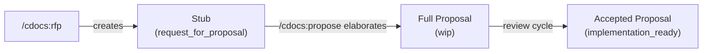

---
first_authored:
  by: "@claude-opus-4-5-20251101"
  at: 2026-01-29T16:00:00-08:00
task_list: cdocs/rfp-skill
type: proposal
state: live
status: implementation_wip
last_reviewed:
  status: accepted
  by: "@claude-opus-4-5-20251101"
  at: 2026-01-29T19:00:00-08:00
  round: 2
tags: [claude_skills, proposals, workflow_automation]
---

# RFP Skill

> BLUF(mjr/cdocs/rfp): A `/cdocs:rfp` skill that scaffolds lightweight `request_for_proposal` stubs containing four required sections (BLUF, Objective, Scope, Open Questions) and optional freeform sections.
> `/cdocs:rfp` feeds the proposal pipeline: `/cdocs:propose` can later consume an RFP stub by elaborating it in-place, preserving authorship and adding the full section set.
> Existing plugin infrastructure (PostToolUse hook, triage tag maintenance, status filters) covers RFP stubs without modification.

## Objective

Creating RFP stubs currently requires manual knowledge of frontmatter fields, proposal template structure, and the `request_for_proposal` status value.
A dedicated skill would let users quickly capture proposal ideas with consistent structure, lowering the barrier to seeding the proposal pipeline.

## Background

### Current state

Two RFP stubs have been authored manually in this repo: `nit-fix-skill.md` (since elaborated to a full proposal) and this document's original stub form (`rfp-skill.md`).
Both were created with knowledge of the frontmatter spec and proposal conventions.
They share a common structure: BLUF, Objective, Scope (what the proposal should explore), Open Questions, and optional domain-specific sections (e.g., "Known Convention Targets" in nit-fix-skill, "Known Design Considerations" in this document's original form).

> NOTE(claude-opus-4-5/cdocs/rfp-skill): The nit-fix-skill stub has been elaborated past the RFP stage (`status: wip`).
> This document's original form is the only remaining `request_for_proposal` exemplar in the repo.

### Relevant plugin components

- **Frontmatter spec** (`rules/frontmatter-spec.md`): defines `request_for_proposal` as a valid proposal status.
- **Propose skill** (`skills/propose/SKILL.md`): creates full proposals with `status: wip` and a complete section set.
  Uses `template.md` with all sections scaffolded.
- **PostToolUse hook** (`hooks/cdocs-validate-frontmatter.sh`): checks field presence (first_authored, type, state, status) on any `cdocs/**/*.md` write.
  Does not validate status values or section completeness.
- **Triage subagent** (proposed in `haiku-subagent-workflow-automation.md`): handles post-authoring frontmatter maintenance including tag refinement, status transition recommendations, and workflow dispatch.
  This proposal references triage primarily for its tag maintenance role.
- **Status skill** (`skills/status/SKILL.md`): can filter proposals by `--status=request_for_proposal` to surface the RFP backlog.
  No changes to the status skill are needed: existing filters already cover RFP stubs.

### Skill conventions

All existing skills follow a consistent pattern:
1. Accept `$ARGUMENTS` (topic string, path, or flags).
2. Determine today's date.
3. Create a file from a template with filled frontmatter.
4. Scaffold sections appropriate to the document type.
5. If the target directory doesn't exist, suggest `/cdocs:init`.

The RFP skill follows this same pattern with a reduced section set.

## Proposed Solution

### Skill definition

Create `skills/rfp/SKILL.md` and `skills/rfp/template.md` following existing skill conventions.

**Invocation:**
```
/cdocs:rfp [topic]
```

If `$ARGUMENTS` provides a topic, use it.
Otherwise, prompt the user.

**Output file:** `cdocs/proposals/YYYY-MM-DD-topic.md`

RFP stubs live in `cdocs/proposals/`, not a separate directory.
They are proposals: `type: proposal`, `status: request_for_proposal`.

### Template

```yaml
---
first_authored:
  by: "@MODEL_NAME"
  at: TIMESTAMP
task_list: WORKSTREAM/TASK
type: proposal
state: live
status: request_for_proposal
tags: []
---
```

```markdown
# TITLE

> BLUF(author/workstream): ...

## Objective

## Scope

## Open Questions

```

### Required sections

| Section | Purpose |
|---------|---------|
| **BLUF** | One-line summary of the idea and its value. |
| **Objective** | The problem or improvement goal. |
| **Scope** | What the full proposal should explore. Framed as questions or bullet points. |
| **Open Questions** | Unknowns that need resolution before or during elaboration. |

### Optional freeform sections

The skill scaffolds only the four required sections but instructs the author to add domain-specific sections as needed.
Existing examples from the repo:
- "Known Convention Targets" (nit-fix-skill): enumerates concrete instances of the problem.
- "Known Design Considerations" (rfp-skill original stub): captures constraints known upfront.

The SKILL.md suggests common optional sections by example, not by template enforcement:
- **Known Requirements**: concrete scenarios or constraints already identified.
- **Prior Art**: links to related docs, external references, or existing implementations.
- **Context**: brief background if the objective alone is insufficient.

### Relationship to `/cdocs:propose`

RFP and propose are sequential stages in the proposal lifecycle, not independent paths.



**When `/cdocs:propose` receives an existing RFP stub as input:**
1. The user invokes `/cdocs:propose cdocs/proposals/YYYY-MM-DD-topic.md`.
2. Propose reads the file, detects `status: request_for_proposal`, and switches to elaboration mode.
3. Propose preserves `first_authored` and the existing BLUF, Objective, and Scope content.
4. Propose inserts the full proposal sections after Scope: Background, Proposed Solution, Design Decisions, Edge Cases, Test Plan, Implementation Phases.
5. Open Questions is preserved at the end of the document; the author resolves them inline during elaboration or leaves them for reviewers.
6. The BLUF is expanded to cover the full proposal scope (the original BLUF captured only the idea; the elaborated BLUF summarizes the design).
7. Status transitions from `request_for_proposal` to `wip`.

The core authoring workflow is the same as creating a proposal from scratch: propose follows its normal drafting approach (BLUF-first, fill sections, review checklist).
The only difference is that propose starts with existing content rather than an empty template.

> NOTE(claude-opus-4-5/cdocs/rfp-skill): The propose skill's SKILL.md currently assumes creating a new file.
> Phase 2 adds the "elaborate existing RFP" path: detect `request_for_proposal` status, then follow the normal propose workflow with existing content as a starting point rather than a blank template.

**When `/cdocs:propose` is invoked without an existing RFP:**
The propose skill works exactly as it does today: creates a new proposal from scratch with `status: wip`.
The RFP step is optional, not mandatory.

### Argument handling

The skill accepts a topic string:
```
/cdocs:rfp haiku-powered-linting
```

It does not accept a reference to an existing document.
The "reference to existing doc" use case is handled by `/cdocs:propose` consuming RFP stubs, not by `/cdocs:rfp` linking to other docs.

If the user wants to reference related work, they include it in the Scope or Open Questions sections manually, or the triage subagent identifies relationships post-authoring.

## Important Design Decisions

### Decision 1: RFP stubs live in `cdocs/proposals/`, not a separate directory

**Decision:** RFP stubs are proposals and go in `cdocs/proposals/`.

**Why:** The frontmatter spec already defines `request_for_proposal` as a proposal status.
RFP stubs share the same `type: proposal` as full proposals.
A separate `cdocs/rfps/` directory would fragment the proposal pipeline: `/cdocs:status --type=proposal` would miss RFP stubs, and `/cdocs:propose` would need to look in two places.
Keeping them co-located means the status skill's existing filters work without modification.

### Decision 2: Four required sections, freeform optional

**Decision:** Require BLUF, Objective, Scope, Open Questions. Allow but don't scaffold additional sections.

**Why:** The two existing RFP stubs share exactly these four core sections.
The nit-fix stub adds "Known Convention Targets" as a domain-specific section; the rfp-skill stub adds "Known Design Considerations."
Mandating more sections defeats the purpose of a lightweight stub.
The SKILL.md suggests common optional sections by example, not by template enforcement.

### Decision 3: Tags are author-supplied, not auto-populated

**Decision:** The author supplies tags at creation time. No keyword-based auto-population.

**Why:** The triage subagent (proposed in `haiku-subagent-workflow-automation.md`) is designed to maintain tags post-authoring: scanning content, adding missing tags, removing stale ones.
Duplicating that logic in the rfp skill creates two tag-inference codepaths with different quality levels.
Author-supplied tags at creation are sufficient for initial discoverability.
Triage refines them later.

### Decision 4: No special hook validation for RFP stubs

**Decision:** The existing PostToolUse hook applies identically to RFP stubs and full proposals.

**Why:** The hook checks field presence (first_authored, type, state, status), not status values or section completeness.
RFP stubs have the same required frontmatter fields as any other proposal.
Adding section-completeness validation would require parsing markdown structure in bash, which is fragile and out of scope for the regex-based hook.
Section completeness is a triage or review concern, not a write-time concern.

### Decision 5: Propose elaborates RFP in-place rather than creating a new file

**Decision:** When `/cdocs:propose` receives an RFP stub path, it edits the stub rather than creating a second file.

**Why:** Two files for the same proposal (stub + elaboration) creates confusion about which is canonical.
In-place elaboration preserves the original `first_authored` attribution, keeps the file path stable (other docs may reference it), and naturally transitions `status: request_for_proposal -> wip`.
The propose skill's history-agnostic framing convention means the elaborated proposal reads as if it was always a full proposal.
This is consistent with how existing proposals in the repo have been edited in-place through their lifecycle (plugin-architecture, marketplace-restructure).

### Decision 6: RFP stubs do not auto-link to related documents

**Decision:** No automated cross-referencing at creation time.

**Why:** The rfp skill captures intent quickly.
Cross-referencing requires scanning existing documents, which adds latency and complexity to what should be a fast scaffolding operation.
If the author knows of related docs, they mention them in Scope or Open Questions.
Automated cross-referencing is a triage or status concern: `/cdocs:status --tag=hooks` surfaces related proposals more reliably than embed-time link scanning.

### Decision 7: Skill name `rfp`

**Decision:** Name the skill `rfp`.

**Why:** `rfp` is the established term in this repo: the frontmatter spec uses `request_for_proposal`, existing stubs use that status, and the concept is universally recognized.
Other skills use verbs (propose, review, report, implement) or nouns naming artifact types (devlog, status, init).
`rfp` fits the noun/artifact-type category: it names the thing being created, like `devlog`.
The acronym form is concise and unambiguous within the project vocabulary.

## Edge Cases / Challenging Scenarios

### 1. Name collision with existing proposal

The user runs `/cdocs:rfp foo` but `cdocs/proposals/YYYY-MM-DD-foo.md` already exists.

Mitigation: check for existing files before writing.
If a file exists, report it and ask the user whether to open the existing file or create a new one with a disambiguating suffix.
This matches the implicit convention in other skills (devlog, propose) where collisions are handled by distinct naming.

### 2. RFP stub is never elaborated

A stub sits at `request_for_proposal` indefinitely.

Mitigation: this is acceptable and expected.
The RFP backlog is surfaced via `/cdocs:status --status=request_for_proposal`.
Stale stubs can be marked `state: deferred` or `state: archived` via `/cdocs:status --update`.
The triage subagent can flag long-lived RFP stubs in its recommendations.

### 3. Propose receives a file path argument

Two sub-scenarios:

**(a) File is an RFP stub (`status: request_for_proposal`):** Propose assumes the user intends to elaborate it and proceeds with in-place elaboration.
The user knowingly passed a stub path; no confirmation is needed unless context clues suggest otherwise (e.g., the user says "create a new proposal about X" while passing a stub path).

**(b) File is a full proposal (`status: wip` or later):** Propose detects a non-RFP status and warns that the document is already a full proposal, suggesting `/cdocs:review` or manual revision instead of re-elaboration.

### 4. RFP stub with too much content

An author writes extensive design notes in an RFP stub, blurring the line between RFP and full proposal.

Mitigation: the SKILL.md instructs authors to keep stubs lightweight: "capture intent and scope, not design."
If a stub grows beyond the four required sections with substantial content, `/cdocs:propose` elaboration is the natural next step.
This is a convention enforcement issue, not a technical one.

### 5. Multiple RFP stubs for the same topic

Two stubs address overlapping concerns (e.g., "haiku-linting" and "nit-fix-automation").

Mitigation: `/cdocs:status --type=proposal --status=request_for_proposal` surfaces all stubs.
The triage subagent or a reviewer can identify overlap and recommend consolidation.
The propose skill, when elaborating one stub, can reference the other in Background.

## Test Plan

### Phase 1: RFP skill (tests 1-7)

1. **Basic invocation**: run `/cdocs:rfp test-topic`, verify file created at `cdocs/proposals/YYYY-MM-DD-test-topic.md` with correct frontmatter and four required sections.
2. **Argument handling**: run `/cdocs:rfp` without arguments, verify user is prompted for a topic.
3. **Frontmatter correctness**: verify `type: proposal`, `status: request_for_proposal`, `state: live`, `first_authored` fields are populated.
4. **Hook validation**: verify the PostToolUse hook runs on the created file without errors (existing validation covers RFP stubs).
5. **Status integration**: after creating an RFP stub, run `/cdocs:status --status=request_for_proposal` and verify the stub appears.
6. **Collision handling**: create a stub, then run `/cdocs:rfp` with the same topic on the same date, verify collision detection.
7. **Missing directory**: run `/cdocs:rfp` when `cdocs/proposals/` does not exist, verify the skill suggests running `/cdocs:init`.

### Phase 2: Propose elaboration (tests 8-12)

8. **Elaboration happy path**: create an RFP stub, then run `/cdocs:propose` on it, verify the stub is elaborated in-place with full sections and `status: wip`.
9. **Content preservation**: after elaboration, verify original BLUF intent, Objective, and Scope content are preserved (not overwritten).
   Open Questions section is present at the end of the document.
10. **Non-RFP rejection**: run `/cdocs:propose` on a proposal with `status: wip`, verify it warns the document is already a full proposal.
11. **File not found**: run `/cdocs:propose` with a path to a non-existent file, verify a clear error message.
12. **Non-proposal file**: run `/cdocs:propose` on a devlog or report path, verify it rejects the input with appropriate guidance.

## Implementation Phases

### Phase 1: RFP skill and template

1. Create `plugins/cdocs/skills/rfp/SKILL.md` with invocation logic, required sections, optional section guidance, and author instructions.
2. Create `plugins/cdocs/skills/rfp/template.md` with frontmatter scaffold and four required sections.
3. Run test plan tests 1-7.

**Success criteria:** `/cdocs:rfp topic` creates a well-formed RFP stub in `cdocs/proposals/` with correct frontmatter and sections.

### Phase 2: Propose skill integration

The propose skill already follows a "read arguments, create file, fill sections" workflow.
The change is narrow: when `$ARGUMENTS` resolves to an existing file with `status: request_for_proposal`, propose operates on that file instead of creating a new one.
The core authoring behavior (BLUF-first drafting, section filling, checklist review) is unchanged.

1. Update `plugins/cdocs/skills/propose/SKILL.md` Invocation section: if `$ARGUMENTS` is a path to an existing file, read it and check `status`.
   If `request_for_proposal`, elaborate in-place.
   If any other status, warn that the document is already a full proposal.
2. Add elaboration guidance: preserve `first_authored` and existing content, insert full section set after Scope, expand BLUF, transition `status` to `wip`.
3. Run test plan tests 8-12.

**Success criteria:** `/cdocs:propose cdocs/proposals/YYYY-MM-DD-topic.md` detects an RFP stub and elaborates it in-place.
Non-RFP proposals and invalid paths produce clear warnings.
**Depends on:** Phase 1.

### Phase 3: Documentation and discoverability

1. Update `plugins/cdocs/skills/init/SKILL.md` proposals README template to mention RFP stubs as a valid proposal subtype.
2. Verify `/cdocs:status` filters work for `--status=request_for_proposal` (expected to work already).
3. Add the rfp skill to any plugin-level documentation or README skill tables.

**Success criteria:** RFP stubs are discoverable via status filters and documented in init-generated READMEs.
**Depends on:** Phase 1.
**Parallel-safe with Phase 2.**
