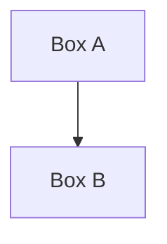
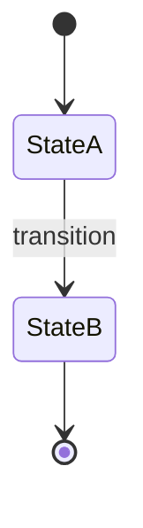

---
first_authored:
  by: "@claude-sonnet-4-20250514"
  at: 2026-01-30T09:00:00-08:00
task_list: cdocs/nit-fix-v2
type: proposal
state: live
status: review_ready
tags: [writing_conventions, diagrams, plugin_idioms, rules]
---

# Standalone Rule: Use Mermaid Diagrams

BLUF(mjr/nit-fix-v2): Extract Mermaid-over-ASCII convention into standalone rule file to support modular multi-rule agent architecture where rules are independently authored and loaded.

## Objective

Create `plugins/cdocs/rules/use-mermaid-diagrams.md` as a standalone rule file that provides detailed guidance for preferring Mermaid diagrams over ASCII art.
This supports the multi-rule nit-fix agent design where agents load multiple independent rule files rather than parsing one monolithic writing-conventions document.
Modular rules enable independent authoring, plugin-contributed conventions, and targeted agent behavior.

## Background

The existing `plugins/cdocs/rules/writing-conventions.md` contains a one-line convention: "Use Mermaid diagram syntax instead of ASCII art for flowcharts, sequence diagrams, state machines, and other visual representations."
The nit-fix-v2 agent architecture requires standalone rule files that provide:
- Detection heuristics for automated scanning
- Classification guidance (judgment-required vs. auto-fixable)
- Rationale and examples for human reviewers

A standalone rule file allows the Mermaid convention to be referenced, extended, and maintained independently from other writing conventions.

## Proposed Rule File Content

File path: `plugins/cdocs/rules/use-mermaid-diagrams.md`

```markdown
# Use Mermaid Diagrams Over ASCII Art

Prefer Mermaid diagram syntax over ASCII art for visual representations in documentation.

## Rationale

- Mermaid renders natively in GitHub and most markdown viewers
- Easier to maintain and modify than ASCII alignment
- Diffs cleanly in version control (semantic changes, not spacing shifts)
- Accessible to screen readers and indexable by search tools
- Supports flowcharts, sequence diagrams, state machines, Gantt charts, ER diagrams, and more

## When to Use Mermaid

Replace ASCII art when representing:
- Flowcharts and decision trees
- Sequence diagrams (actor interactions)
- State machines and transitions
- System architecture diagrams
- Process flows and pipelines
- Relationship diagrams

## ASCII Patterns to Avoid

Common ASCII diagram patterns that should be converted:

```
┌─────────┐         +----------+
│  Box A  │   or    |  Box A   |
└─────────┘         +----------+
     │                   |
     v                   v
┌─────────┐         +----------+
│  Box B  │         |  Box B   |
└─────────┘         +----------+
```

```
Actor A          Actor B
   |                |
   |---request----->|
   |                |
   |<--response-----|
   |                |
```

## Mermaid Equivalent Examples

Flowchart:


Sequence diagram:
```mermaid
sequenceDiagram
    Actor A->>Actor B: request
    Actor B->>Actor A: response
```

State diagram:


## Exceptions

ASCII is acceptable for:
- Simple inline notation (e.g., `A -> B -> C` in prose)
- Code comments where Mermaid is not supported
- Terminal output examples or CLI demonstrations
- Tables (proper markdown table syntax, not ASCII box-drawing)

## Classification

**Judgment-required**: Converting ASCII diagrams to Mermaid requires understanding the diagram's semantic intent and choosing the appropriate Mermaid diagram type (graph, sequence, state, etc.).
Automated detection can flag candidates, but human review should validate the conversion.
```

## Detection Heuristics

An automated agent can detect ASCII diagram candidates by scanning for:

1. **Box-drawing characters**: `┌ ┐ └ ┘ ─ │ ├ ┤ ┬ ┴ ┼` (Unicode box-drawing)
2. **ASCII box patterns**: Repeated sequences of `+---+` or `|   |` with alignment
3. **Arrow patterns**: `-->`, `<--`, `|`, `v`, `^` used for flow outside code blocks
4. **Multi-line structures**: 3+ consecutive lines containing alignment characters (`|`, `+`, `-`) with similar indentation
5. **Spacing-heavy blocks**: Lines with significant leading whitespace followed by diagram characters

Heuristic exclusions:
- Content inside fenced code blocks (` ``` `) unless explicitly diagrammatic
- Markdown tables (detected by header separator `|---|---|`)
- Single-line ASCII notation in prose

NOTE(mjr/nit-fix-v2): Detection should flag candidates for human review, not attempt automatic conversion.
ASCII-to-Mermaid requires semantic understanding of diagram intent.

## Important Design Decisions

**Standalone vs. embedded**: Extracting this rule from writing-conventions.md enables modular agent architecture where rules are independently loaded and potentially contributed by different plugins.
The writing-conventions.md file should reference this rule rather than duplicate content.

**Judgment-required classification**: Unlike style fixes (punctuation, formatting), diagram conversion requires understanding visual semantics.
The rule explicitly marks this as judgment-required to guide agent behavior toward flagging rather than auto-fixing.

**Detection scope**: Heuristics focus on structural patterns (box-drawing, alignment) rather than semantic content, since semantic analysis would require diagram comprehension beyond simple pattern matching.

## Implementation

Single phase:

1. Create `plugins/cdocs/rules/use-mermaid-diagrams.md` with the proposed content
2. Update `plugins/cdocs/rules/writing-conventions.md` to replace the current one-line Mermaid convention with a reference: "See `rules/use-mermaid-diagrams.md` for detailed guidance on preferring Mermaid over ASCII diagrams."

No additional tooling or agent implementation required at this stage.
The rule file is designed to be consumed by future nit-fix agents that load multiple rule files.
