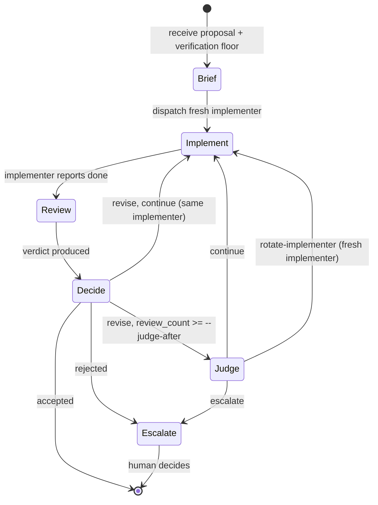

---
first_authored:
  by: "@claude-opus-4-7"
  at: 2026-05-13T08:40:00-07:00
task_list: cdocs/iterate-skill
type: proposal
state: live
status: review_ready
last_reviewed:
  status: accepted
  by: "@claude-opus-4-7"
  at: 2026-05-13T14:15:00-07:00
  round: 3
tags: [iterate_skill, oversee, agent_orchestration, claude_skills, workflow, iteration, verification, judge_role]
---

# Proposal: `/cdocs:iterate` Skill for Overseer Agents

> BLUF(opus/cdocs/iterate-skill): Add a `/cdocs:iterate` skill that codifies the implement-review loop overseer agents have been hand-specifying in prompts.
> An overseer invokes `/cdocs:iterate <proposal_path>`, the skill dispatches a fresh implementer, then a fresh reviewer, then decides based on the review verdict, repeating with patience until accept-or-escalate.
> Once the loop has produced several reviews without acceptance, the overseer dispatches a fresh **judge** subagent to assess loop health: continue, rotate the implementer, or escalate.
> The skill is a peer to `/cdocs:implement` and `/cdocs:review`, not a replacement: it composes them.
> Today the "overseer" is a behavioral mode the top-level session agent enters when invoking `/cdocs:iterate`.
> The `/oversee` RFP ([link](2026-03-26-rfp-oversee-skill.md)) names a separate, broader concept (multi-proposal project arcs); if and when `/oversee` is elaborated, it may choose to invoke `/cdocs:iterate` per proposal in its chain, but that composition is not assumed here.
>
> - **Motivated By:**
>   - [cdocs/proposals/2026-03-26-rfp-oversee-skill.md](2026-03-26-rfp-oversee-skill.md): the parent RFP this proposal sits within.
>   - [cdocs/reports/2026-05-13-agent-roles-and-iterative-loop.md](../reports/2026-05-13-agent-roles-and-iterative-loop.md): research report on role taxonomy and loop protocol.
>   - [cdocs/reports/2026-03-27-overseer-prompt-engineering.md](../reports/2026-03-27-overseer-prompt-engineering.md): companion report on writing overseer kickoff prompts.

## Objective

Eliminate the recurring need for users to hand-write the iterative implement-review loop into overseer prompts.
The pattern is stable enough to codify: a top-level agent that does not itself edit source code dispatches implementer and reviewer subagents in alternation, periodically dispatches a judge subagent to assess loop health, retires stuck implementers on the judge's verdict, and terminates on accept-or-escalate rather than retry-count.
Codifying it into a skill reduces prompt-engineering burden, makes the protocol auditable across sessions, and provides a target for future improvement (judge-trigger heuristics, model-tier selection, parallel-iteration safety).

> NOTE(opus/cdocs/iterate-skill): The "overseer" role names a *behavioral pattern* for the top-level agent in whatever session invokes `/cdocs:iterate`: that agent restricts itself to orchestration for the duration of the loop.
> The human user is the supervisor, not the overseer: the user invokes the skill and receives escalations; the agent runs the loop.
> A user who types `/cdocs:iterate` is asking their session agent to enter overseer mode for this work, not assuming the role themselves.

> NOTE(opus/cdocs/iterate-skill): On the relationship to `/oversee`: today there is no `/oversee` skill, only the [RFP](2026-03-26-rfp-oversee-skill.md).
> The overseer in this proposal is a behavioral mode the top-level session agent enters when invoking `/cdocs:iterate`, not a separate skill.
> If `/oversee` is later elaborated from its RFP, it may choose to invoke `/cdocs:iterate` per proposal in its chain, or it may decompose the implement-review loop some other way: that decision belongs to the `/oversee` proposal, not this one.

## Background

The user-stated pattern, copied verbatim from the request prompt:

> 1. An `/implement`'er aims to use Playwright following guidance based on this message and/or the prior review.
> 2. Whenever this agent considers its work complete, have it `/review`'d by a fresh QA subagent with the same guidance.
>    The reviewer should be highly critical of all rendering and usability issues.
> 3. Repeat for as long as possible until we've gotten the desired improvements to the gameplay loop.
>    We want to be very, very patient with this iteration loop, and if a subagent is fatigued or overwhelmed, it's definitely fine to get a new one - use your judgement as the manager.

Playwright is the canonical instance; the general pattern is "real-world verification by a fresh critic."
The pattern recurs across published agent frameworks ([LangGraph supervisor](https://reference.langchain.com/python/langgraph-supervisor), [CrewAI hierarchical](https://docs.crewai.com/en/learn/hierarchical-process), [AutoGen GroupChat](https://microsoft.github.io/autogen/0.2/docs/notebooks/agentchat_groupchat_vis/), [MetaGPT](https://www.ibm.com/think/topics/metagpt), [Aider architect mode](https://aider.chat/), [OpenHands iterative refinement](https://docs.openhands.dev/sdk/guides/iterative-refinement)) under different names for the same three roles.
The companion [report](../reports/2026-05-13-agent-roles-and-iterative-loop.md) maps the synonyms and surveys prior art.

The cdocs corpus already has the building blocks: `/cdocs:implement`, `/cdocs:review`, the formal `reviewer` agent, the subagent-driven-development workflow pattern, and the verification-rigor framing from the prompt-engineering report.
What is missing is the named protocol that wires `/cdocs:implement` and `/cdocs:review` together as a loop with explicit turn-by-turn responsibilities.

> NOTE(opus/cdocs/iterate-skill): `/oversee` is a separate RFP with a wider scope (multi-proposal project arcs, AFK/autonomous mode, shared state, chain sequencing).
> `/cdocs:iterate` is the narrower single-proposal sibling and ships first because its scope is smaller and its protocol is already well-validated by prior user prompts.

## Proposed Solution

A new skill at `plugins/cdocs/skills/iterate/SKILL.md` (CC authoring format; OpenCode build emits the OC variant per the multi-target marketplace pipeline).
The skill encodes the four-role taxonomy (Overseer, Implementer, Reviewer, Judge), the turn-by-turn loop protocol, freshness disciplines, termination rules, and a two-section iteration-and-judge audit trail added to the devlog.

### Role Taxonomy

Four roles with one-line responsibilities; synonyms surfaced for cross-framework prompt authors.

- **Overseer** (a.k.a. Supervisor, Manager, Orchestrator): the top-level agent in the invoking session, restricted to orchestration for the duration of the loop. Dispatches subagents and judges their output; does not Edit, Write, or run mutating commands. Owns termination, freshness, and escalation decisions. The human user is the supervisor, not the overseer.
- **Implementer** (a.k.a. Worker, Engineer, Coder, Editor): a fresh general-purpose subagent dispatched via the Task tool with a prompt that instructs it to follow `/cdocs:implement` conventions for a single iteration. Executes the proposal and self-verifies against real-world state before declaring done.
- **Reviewer** (a.k.a. Critic, QA Engineer, Critique Agent): a fresh subagent dispatched via the Task tool with `subagent_type: "reviewer"` (the formal cdocs reviewer agent, model opus, preloaded with `/cdocs:review`). Reads the implementer's output with fresh context and a critical mindset, with the safety constraint already encoded in `reviewer.md`: it may only Edit the target proposal's `last_reviewed` frontmatter; the review document itself is the artifact it produces.
- **Judge** (a.k.a. Arbiter, Meta-reviewer): a fresh subagent dispatched periodically by the overseer to reason about loop *meta-health*, not about the work itself. Reads the iteration log entries and the recent review documents; does not read source code. Returns one of `{continue, rotate-implementer, escalate}` with a short written rationale. Approaches the question with the same critical mindset as the reviewer: is the implementer stuck in a rabbithole, are reviewers and implementers thrashing, should the loop rotate or surface to the user?

### Loop Protocol



**Turn 0 (Brief)**: the overseer reads the proposal and any handoff devlog once, states the verification floor explicitly (`AskUserQuestion`'s the user if the proposal doesn't specify one), and creates or appends to a devlog with an "Iteration Log" section and an empty "Judge Log" section.

**Turn N.a (Implement)**: dispatch an implementer via the Task tool (default subagent type: `general-purpose`) with the proposal path, the verification floor, the previous review document if any, and an explicit directive *not* to dispatch its own reviewer (this directive overrides `/cdocs:implement`'s in-skill "Request `/cdocs:review` from a subagent after each phase" instruction for the duration of the loop iteration; the overseer owns review dispatch).
The implementer follows `/cdocs:implement` conventions for this single iteration, runs verification commands, commits per conventional commit format, and returns a structured summary.

**Turn N.b (Review)**: dispatch a *new* reviewer subagent (never the previous reviewer) via the Task tool with `subagent_type: "reviewer"` (the formal cdocs reviewer agent).
The reviewer follows `/cdocs:review` conventions, inspects the live system not just the diff, and produces a review document with a verdict.

**Turn N.c (Decide)**: read the produced review document and branch on the verdict:

- **Accept**: terminate; update proposal frontmatter; write the final devlog entry.
- **Reject**: escalate immediately. The reviewer is saying "the approach is wrong"; the overseer must not autonomously override.
- **Revise, review count < `--judge-after`** (default 3): loop directly to Turn (N+1).a with the same implementer (context carries forward).
- **Revise, review count >= `--judge-after`**: dispatch the judge before the next implementer turn (see Turn N.d).

The overseer may also dispatch the judge before `--judge-after` is reached if it senses trouble (an implementer returning unusually high uncertainty, a review surfacing structural concerns, repeated near-identical commits): this is discretionary and recorded in the judge log's `trigger` column.

**Turn N.d (Judge)**: dispatch a *new* judge subagent via the Task tool with the iteration log entries and the paths to the recent review documents.
The judge reads only those artifacts: review documents and the iteration log.
The judge does not read source code, run verification commands, or open the live system: its job is to assess the loop, not the work.
The judge returns one of three verdicts plus a short written rationale:

- **continue**: the loop is healthy; the implementer is making progress that the reviewer's bar simply has not yet cleared. Loop with the same implementer.
- **rotate-implementer**: the implementer appears stuck, thrashing, or circling the same failure modes. Retire the implementer; loop with a *new* implementer that onboards from the iteration log.
- **escalate**: the loop is structurally stuck (conflicting requirements, reviewer and implementer talking past each other, unresolvable design tension). Surface to the user with the judge's rationale.

The overseer writes a Judge Log row capturing the verdict, the rationale (or a path to a saved rationale file if it does not fit inline), and the trigger.

**Termination Conditions:**

1. Reviewer returns **Accept**.
2. Reviewer returns **Reject**.
3. Judge returns **escalate**.
4. The user interrupts.

No retry-count cap on Accept-bound progress. The user's stated principle is "be very patient"; the loop iterates as long as the reviewer keeps producing Revise verdicts and the judge keeps returning `continue` or `rotate-implementer`.

### Audit Trail: Iteration Log and Judge Log

Two table conventions added to the devlog (not the frontmatter) so any agent can resume an interrupted loop from the devlog alone.

**Iteration Log** captures per-iteration implement-and-review activity:

| iteration | implementer | reviewer | review_verdict | review_path | notes |
|---|---|---|---|---|---|
| 1 | impl-1 (general-purpose) | rev-1 (cdocs:reviewer) | revise | cdocs/reviews/2026-05-13-…-r1.md | initial pass; cards not rendering |
| 2 | impl-1 (general-purpose) | rev-2 (cdocs:reviewer) | revise | cdocs/reviews/2026-05-13-…-r2.md | borders fixed; zone alignment broken |
| 3 | impl-1 (general-purpose) | rev-3 (cdocs:reviewer) | revise | cdocs/reviews/2026-05-13-…-r3.md | borders still partially broken; same area as r1 |
| 4 | impl-2 (general-purpose) | rev-4 (cdocs:reviewer) | accept | cdocs/reviews/2026-05-13-…-r4.md | fresh implementer after rotate-implementer verdict |

**Judge Log** captures per-judge-invocation meta-assessments:

| judge_iteration | trigger | verdict | rationale | judge_path |
|---|---|---|---|---|
| 3 | review_count >= 3 (default) | rotate-implementer | impl-1 has circled the same scss border bug across r1-r3; fresh perspective likely to unblock | inline |
| (n/a) | (not yet invoked again) | | | |

The `implementer` and `reviewer` columns hold a synthetic per-loop handle (`impl-N` / `rev-N`) plus the subagent type in parentheses.
Task-tool dispatch does not surface a session identifier; the synthetic handle is generated by the overseer and is the durable cross-reference for "which agent made which iteration."
`review_path` points to the actual review artifact so any later agent can verify the verdict without re-running the review.

In the Judge Log, `judge_iteration` is the iteration number *before which* the judge ran (the judge runs between Turn N.c and Turn (N+1).a).
`trigger` is either the rule that fired (`review_count >= --judge-after`) or `discretionary` if the overseer invoked early.
`rationale` is the judge's written explanation: short rationales (one or two sentences) live inline; longer ones are saved to a file under `cdocs/reviews/` or `cdocs/devlogs/_judge/` and `judge_path` points to it.
The judge's verdict and rationale are the load-bearing audit signal for non-reviewer terminations and for implementer rotations.

The iteration log and judge log are devlog sections, not new frontmatter fields: the devlog is already the single source of truth for a work session.
Cross-session shared state (per the `/oversee` RFP's shared-state question) is `/oversee`'s problem; `/cdocs:iterate` resumes from the two logs alone.

### Invocation

```
/cdocs:iterate <proposal_path> [--verification-floor "<sentence>"] [--judge-after N]
```

- `<proposal_path>` is required. The proposal should have `status: implementation_ready` (warn but proceed otherwise).
- `--verification-floor` is optional. If omitted and the proposal lacks a `## Verification Methodology` section with a concrete sentence, the skill `AskUserQuestion`'s the user before starting (mirrors the prepare-then-execute pattern from [`2026-03-27-overseer-prompt-engineering.md`](../reports/2026-03-27-overseer-prompt-engineering.md)).
- `--judge-after N` defaults to 3. The judge runs starting from the Nth Revise verdict and again before each subsequent Revise-driven iteration; the overseer may also invoke the judge earlier at its discretion. This flag tunes when the meta-question "is the loop healthy?" starts being asked, not whether the loop ever escalates.

### Skill File Surface

```
plugins/cdocs/skills/iterate/
├── SKILL.md          # Skill orchestration prompt (this proposal's main deliverable)
└── template.md       # Iteration Log and Judge Log table templates appended to the devlog
```

A new formal `judge` agent at `plugins/cdocs/agents/judge.md`, modeled on `plugins/cdocs/agents/reviewer.md`.
The judge agent declares `model: opus`, restricts tools to `Read, Glob, Grep, Write` (no Edit, no Bash, no Task), and is dispatched via `subagent_type: "judge"`.
Its system prompt instructs it to read only the iteration log entries and the recent review documents and return a structured verdict-plus-rationale.

The skill also dispatches the existing formal `reviewer` agent (`subagent_type: "reviewer"`, model opus) for reviews, and a fresh `general-purpose` subagent loaded with `/cdocs:implement` for implementations. No new frontmatter fields.

> NOTE(opus/cdocs/iterate-skill): A future v2 may introduce a formal `implementer` agent in `plugins/cdocs/agents/` analogous to `reviewer.md` and `judge.md`, with a tool allowlist and an enforced no-double-review constraint.
> v1 uses `general-purpose` plus a prompt-level directive because the existing `/cdocs:implement` skill already encodes most of the desired behavior.

## Important Design Decisions

**Standalone skill, not a sub-skill of `/oversee`.**
`/cdocs:iterate` handles one proposal's loop and is currently a standalone skill that the top-level session agent invokes directly.
The `/oversee` RFP scopes multi-proposal project arcs: if it is elaborated, a future `/oversee` could invoke `/cdocs:iterate` per proposal in its chain, or it could replace the loop with a different decomposition.
This proposal keeps `/cdocs:iterate`'s scope tight and lets it ship without waiting on `/oversee`'s design.

> NOTE(opus/cdocs/iterate-skill): The `/oversee` RFP says `/oversee` "invokes `/implement`, `/review`, `/propose`, `/report` directly."
> One reading of that is that a future `/oversee` invokes `/cdocs:iterate` per proposal and `/cdocs:iterate` in turn invokes `/cdocs:implement` and `/cdocs:review`, which would let `/oversee` stay focused on chain sequencing without re-implementing the loop.
> Whether `/oversee` adopts that composition is for the `/oversee` proposal to decide; this proposal does not assume it.

**Freshness disciplines are rules, not suggestions.**
Reviewers are fresh every iteration; the judge is fresh every invocation; implementers are fresh when the judge says `rotate-implementer`.
The user's brief uses the load-bearing word *fresh* exactly once, applied to the reviewer.
A reviewer that participated in implementation has lost the perspective that justifies a separate review step.
The judge's value is its independence from both the implementer's mid-task context and the reviewer's per-review focus: a fresh judge each time prevents the meta-assessment from inheriting the same blind spots.
An implementer mid-task carries valuable context and should not be replaced reflexively; rotation happens on the judge's call, not on a counter.

**The judge is a meta-reviewer, not a second reviewer.**
The reviewer judges the work; the judge judges the loop.
The judge reads review documents and iteration log entries, not source code, because its question is "should this loop continue, rotate, or escalate," not "is this code correct."
A short rationale is mandatory because the verdict alone is not auditable: the rationale is what a later reader (the user, a future overseer, a retrospective) uses to assess whether the judge's call was sound.

**Judge invocations carry real cost; defaults bound them implicitly.**
A judge call is a fresh opus subagent reading reviews and writing a rationale: not free.
The `--judge-after` default (3) and the overseer's discretion in early invocation together provide a practical bound without an explicit cost cap: agents tuning aggressive loops can raise `--judge-after`, agents on critical work can lower it.
Baking in hard limits (e.g., `--max-judges N`) is over-engineering for v1.

**Termination is accept-or-escalate, not retry-count-exceeded.**
The user said "be very, very patient."
A patient overseer is bounded by review-signal quality and judge meta-assessment, not by clock or retry count.
`--judge-after` tunes when the meta-question gets asked, not whether the loop ever escalates.

**Verification floor is mandatory.**
The single most common failure mode in the `/oversee` RFP is "agents report completion without verifying against real-world state."
The skill requires a one-sentence verification floor with at least one failure-picture before starting (consequence-not-rule framing per the prompt-engineering report).
If the proposal doesn't specify one, `AskUserQuestion` blocks the loop until the user provides it.

**Iteration log and judge log live in the devlog.**
Not in frontmatter, not in a separate state file.
The devlog is already the single source of truth for a session.
Adding the two logs as table sections keeps resumability cheap and reuses the existing devlog conventions.
A reader who wants to know "what happened in this loop and why did it stop" can read the two tables top-to-bottom without opening a single review document, then follow paths if they want the detail.

**Asymmetric second-order subagent dispatch.**
The loop is auditable from the iteration log and judge log, so write-side subagent dispatch by any of the loop's workers is forbidden: implementers do not dispatch reviewers (the overseer owns review dispatch), the judge does not dispatch implementers or reviewers (the overseer owns rotation and re-review), and none of them dispatch `/cdocs:implement` or other code-mutating subagents.
Read-side investigative dispatch is allowed for reviewers: a reviewer may dispatch `/cdocs:report` to investigate a recurring bug class without leaving the review turn, because read-only investigation does not perturb the audited control flow.
The judge's toolset omits Task entirely: a judge that wanted to dispatch a sub-investigation would be re-implementing the overseer's job at the wrong layer.
An implementer that wants to escalate "I think this proposal is wrong" returns that as a structured uncertainty in its summary; the overseer reads it and may escalate to the user or invoke the judge early.

**`/cdocs:iterate` overrides `/cdocs:implement`'s in-skill review-dispatch instruction.**
`/cdocs:implement` says "Request `/cdocs:review` from a subagent after each phase to catch issues early."
Inside `/cdocs:iterate`'s loop, the overseer suppresses that instruction in the dispatched implementer's prompt, because the overseer dispatches the review itself.
Without this override, the loop would produce a double-review per iteration and the iteration log would not match the produced reviews.

**Defaults match the existing cdocs reviewer agent.**
The formal `reviewer` agent at `plugins/cdocs/agents/reviewer.md` declares `model: opus` and preloads `/cdocs:review`.
`/cdocs:iterate` uses it as-is and inherits the model choice.
This proposal does not change `reviewer.md`.

## Stories

**Story 1: UI implementation with Playwright verification.**
User invokes `/cdocs:iterate cdocs/proposals/2026-05-13-mtg-spike-gameplay-interface.md` (the canonical use case).
Verification floor: "Cards render with visible borders, zones align correctly, hover states fire."
Failure pictures: cards-invisible, borders-missing, zones-misaligned.
Iteration 1: implementer ships v1; reviewer opens Playwright, sees missing borders, returns Revise.
Iteration 2: implementer fixes the border issue; reviewer sees a new hover regression, returns Revise.
Iteration 3: implementer fixes the hover regression; fresh reviewer accepts. Total reviews: 3, judge not yet invoked (review count just reached `--judge-after` but Accept beat it to the punch).

**Story 2: Stuck implementer rotation via judge verdict.**
Same proposal as Story 1, harder ground.
Iterations 1-3: implementer keeps producing border-rendering fixes that pass on its dev server but the reviewer keeps finding subtle scss specificity bugs in slightly different selectors.
Before iteration 4, `--judge-after=3` fires.
The judge reads the three review documents and the iteration log, sees the implementer has been circling the same scss border bug under different selector names, and returns `rotate-implementer` with the rationale "impl-1 has converged on a local fix shape that does not generalize; fresh perspective on the cascade order should unblock."
Iteration 4 onboards impl-2 from the iteration log; impl-2 restructures the scss layering; iteration 4 accepts.

**Story 3: Stalemate escalation via judge verdict.**
A proposal with conflicting requirements (e.g., "minimize layout shifts" and "always show a loading skeleton").
Iteration 1: implementer favors no-skeleton; reviewer flags missing skeleton; Revise.
Iteration 2: implementer adds skeleton; reviewer flags layout shift instead; Revise.
Iteration 3: implementer compromises with a fixed-height skeleton; reviewer flags that the skeleton dimensions guess wrong for half the content; Revise.
Before iteration 4, `--judge-after=3` fires.
The judge reads the three reviews, notices the two requirements ("no layout shift" and "always show skeleton") are mutually exclusive without authored content-size hints, and returns `escalate` with the rationale "the proposal has conflicting requirements: every implementer attempt satisfies one constraint by violating the other; user input is needed to resolve the trade-off."
The overseer surfaces the judge's rationale to the user.

**Story 4: Reject escalation.**
Implementer ships v1; reviewer finds a fundamental architectural problem ("this approach race-conditions under concurrent users; needs distributed lock") and returns Reject.
Skill escalates immediately rather than dispatching the judge: Reject preempts the judge path because the reviewer is already asserting "the approach is wrong" at the work level, which the judge cannot adjudicate from the loop level.

**Story 5: potential future `/oversee` composition.**
If a future `/oversee` elaboration chooses to compose with `/cdocs:iterate`, the shape could look like this: `/oversee` chains three proposals and invokes `/cdocs:iterate` on each in sequence.
Each `/cdocs:iterate` run would be independent (its own iteration log section in its own devlog), and `/oversee` would read each accept-verdict before advancing.
This is illustrative of `/cdocs:iterate`'s compositional surface, not a commitment that `/oversee` will adopt this shape.

**Story 6: No verification floor; AFK user.**
User invokes `/cdocs:iterate cdocs/proposals/...` overnight; the proposal has no `## Verification Methodology` section and no `--verification-floor` flag was passed.
The skill cannot reach the user for `AskUserQuestion`, so it falls back to the documented edge-case behavior: writes a placeholder verification floor ("verification was not specified; tests pass and the proposal's stated objective is met") to the iteration log, runs one iteration, and prepends a `> WARN` callout to the final summary noting that the loop ran without an explicit verification floor.
The user reviewing the morning's output sees the warning and either adds a verification floor and re-invokes, or accepts the partial signal.

## Edge Cases / Challenging Scenarios

**No verification floor available.**
Proposal has no `## Verification Methodology` section, user invokes without `--verification-floor`, and the user is not present to answer `AskUserQuestion`.
Behavior: skill writes a placeholder verification floor ("verification was not specified; tests pass and the proposal's stated objective is met") to the iteration log, runs one iteration, and surfaces the gap prominently in the final summary regardless of verdict.
The iteration log's `notes` column on placeholder-floor rows is tagged `[placeholder-floor]` so dogfood retrospectives can locate them without scanning prose.
This is the least-bad option for AFK invocation.

**Implementer ships partial work and returns "I'm stuck."**
Implementer's structured summary includes residual_uncertainties.
Skill still dispatches a reviewer (the reviewer's job is to assess what was shipped, not what wasn't).
The reviewer's verdict drives the next decision; uncertainties surface in the iteration log notes.

**Reviewer crashes mid-review.**
Skill catches the error and re-dispatches a *different* fresh reviewer (not a retry of the same one).
If three reviewers in a row crash, escalate.

**Judge crashes mid-assessment.**
Skill catches the error and re-dispatches a *different* fresh judge once.
If the second judge also crashes, the overseer continues the loop with the same implementer for one more iteration and records the crash in the Judge Log's notes; if the next required judge invocation also fails, escalate.

**Same issue class recurring across reviewer subagents.**
This is what the judge is for: when the loop has produced `--judge-after` Revise verdicts, the judge reads the reviews and decides whether the recurrence indicates a stuck implementer (rotate), unresolvable design tension (escalate), or productive grinding (continue).
The overseer does not text-match issues itself; it delegates that judgment to the judge.

**Divergent `task_list` between proposal and existing devlog.**
The skill prefers appending to the most recent devlog whose `task_list` matches the proposal's `task_list`; if none matches, it creates a new devlog with the proposal's `task_list`.
The iteration log section lives in whichever devlog the skill chose, and the skill records that choice in its initial summary so the user can audit.

**Token-budget exhaustion or auto-compaction mid-loop.**
The overseer's context may compact between iterations.
The iteration log in the devlog is the durable resumption point: a fresh overseer agent reading only the devlog can reconstruct iteration count, current implementer handle, and pending review verdict.
The skill writes a final iteration-log row before yielding, so an interrupted loop never leaves the log half-populated.

**Tests-pass-but-reviewer-says-Revise.**
This is the most important signal for verification-rigor discipline: the implementer believed it was done; the reviewer found the live system did not match the verification floor.
The iteration log's `notes` column should distinguish this from "tests failed" so dogfood retrospectives can see how often the floor catches what tests miss.

**Implementer dispatches its own reviewer despite the directive.**
The implementer's review is not authoritative.
The skill's reviewer runs anyway.
This is a soft-fail: the iteration proceeds but the log notes "implementer dispatched unauthorized review" so the pattern can be caught.

**`status: implementation_accepted` proposal.**
Warn and ask whether the user intends a re-implementation; if confirmed, proceed but tag the iteration log entries with `[re-implementation]`.

**Non-`implementation_ready` proposal.**
Warn but proceed if the user confirms.
The skill is intentionally permissive: an overseer may want to iterate on a `wip` proposal to validate the design.

**Parallel `/cdocs:iterate` invocations.**
Out of scope for v1.
File-conflict detection is the `/oversee` RFP's problem.
v1 of `/cdocs:iterate` is single-threaded.

## Test Plan

The skill is largely instructional (a SKILL.md prompt) rather than executable code.
Test surface:

1. **Frontmatter validity**: the skill's frontmatter and the template's frontmatter parse and pass `/cdocs:triage` validation.
2. **Build script integration**: `npm run build:cdocs` emits `build/cdocs/opencode/skills/iterate/` with parity against the CC version.
3. **OpenCode parity**: build output mirrors the CC skill's structure; no CC-specific fields leak through.
4. **Dispatch fidelity**: when invoked on a small proposal, the produced iteration log has an `implementer` column referencing `general-purpose` and a `reviewer` column referencing `cdocs:reviewer`, and a `review_path` pointing to an actual file under `cdocs/reviews/` whose frontmatter has `review_of` matching the input proposal. This is checkable from artifacts, not from in-flight Task prompts.
5. **Iteration log format**: the iteration log table renders correctly in the devlog and is recognized by `/cdocs:triage` if/when triage gains awareness of it (out of scope for v1).
6. **End-to-end dogfood**: use `/cdocs:iterate` on a real proposal (e.g., this proposal's own implementation, or a simple cdocs convention update) and verify the loop completes within 3 iterations on a known-tractable task.

## Verification Methodology

**Mechanical verification** (CI-style, automatable):
- `npm run build:cdocs` succeeds.
- `/cdocs:triage cdocs/proposals/2026-05-13-iterate-skill.md` passes.
- The skill's `SKILL.md` parses as valid frontmatter+markdown.

**Behavioral verification** (manual integration test against produced artifacts):
- Dispatch `/cdocs:iterate` against a small toy proposal (one phase, well-defined verification floor).
- Confirm from artifacts: a devlog exists with an Iteration Log section and a Judge Log section; the first iteration row's `review_path` points to a review document at `cdocs/reviews/...` whose `review_of` field matches the proposal.
- Confirm on Accept: the proposal's `last_reviewed.status` is `accepted` and the devlog's `status` is `review_ready` (per `/cdocs:implement` conventions).
- Confirm judge dispatch: on a forced multi-Revise run (toy proposal authored to require >=3 iterations), the Judge Log contains a row at `judge_iteration: 3` with a verdict and rationale; the next iteration log row either continues with the same `implementer` handle (judge said `continue`) or increments to a new handle (judge said `rotate-implementer`).
- Confirm escalation: on Reject or on a judge `escalate` verdict, the devlog contains an "Escalation" subsection naming the trigger (reviewer Reject text, or judge rationale), and no further iteration row is appended.

**Dogfood**: once the skill ships, use it to implement at least one subsequent cdocs proposal.
The first dogfood run is itself the strongest verification.

## Implementation Phases

### Phase 1: Author the skill prompt and the judge agent

Author `plugins/cdocs/skills/iterate/SKILL.md`, `plugins/cdocs/skills/iterate/template.md`, and `plugins/cdocs/agents/judge.md`.
The SKILL.md prompt encodes the four roles, the turn-by-turn protocol, the freshness disciplines, the termination rules, the `--judge-after` semantics, and the AskUserQuestion-for-verification-floor pattern.
The template.md provides the Iteration Log and Judge Log table snippets that the skill appends to the devlog.
The judge.md agent file follows the shape of `plugins/cdocs/agents/reviewer.md`: opus model, restricted toolset, system prompt that loads the iteration-log entries and recent review paths and returns a structured verdict-plus-rationale.

**Success criteria:**
- The SKILL.md prompt follows the structure of `/cdocs:implement` and `/cdocs:review` (frontmatter, BLUF or analogous lead, Invocation, Behavior, Conventions).
- A fresh agent reading only SKILL.md and the cdocs rules can execute the loop correctly on a test proposal.
- The judge agent, dispatched standalone with a synthetic iteration log and review set, returns a well-formed verdict in `{continue, rotate-implementer, escalate}` with a non-empty rationale.
- The template renders correctly when appended to an existing devlog.

**Files:**
- `plugins/cdocs/skills/iterate/SKILL.md` (new)
- `plugins/cdocs/skills/iterate/template.md` (new)
- `plugins/cdocs/agents/judge.md` (new)

### Phase 2: Rules cross-references and surface mentions

Skills are discovered by directory layout (no per-skill registration in `plugin.json`), so no manifest edits are required: confirm this during implementation by inspecting the existing plugin.json.

Add a cross-reference in `plugins/cdocs/rules/workflow-patterns.md` under a new "Iterative Implementation Loop" subsection that points to the skill and names the four roles.
Update `plugins/cdocs/AGENTS.md` and `plugins/cdocs/README.md` to mention `/cdocs:iterate` alongside `/cdocs:implement` and `/cdocs:review`, and mention the `judge` agent alongside `reviewer`.

> NOTE(opus/cdocs/iterate-skill): The `/cdocs:review` Action Items `[blocking]` / `[non-blocking]` tag convention is still good practice and remains documented by example in the review skill, but `/cdocs:iterate` no longer depends on it: the judge reads review documents as prose and does not require a stable tag-count contract. Tightening the convention to a stated requirement could be done in a separate one-line proposal if a future skill wants to parse the tags mechanically.

**Success criteria:**
- `/plugin install cdocs@clauthier` exposes `/cdocs:iterate` as a slash command (validated post-install by directory-discovery, no manifest changes needed).
- Existing rule files reference the skill and the judge agent where appropriate without duplicating their content.

**Files:**
- `plugins/cdocs/rules/workflow-patterns.md` (cross-reference)
- `plugins/cdocs/AGENTS.md`
- `plugins/cdocs/README.md`
- `CLAUDE.md` (`Skills` bullet listing skills, and `agents` mention)

### Phase 3: OpenCode build parity

Update `scripts/build-opencode.ts` if needed to include the new skill and the new `judge` agent in the OC output (it likely already globs `plugins/cdocs/skills/*/SKILL.md` and `plugins/cdocs/agents/*.md`, but verify).
Run `npm run build:cdocs` and confirm `build/cdocs/opencode/skills/iterate/` and the OC analogue of `plugins/cdocs/agents/judge.md` match the CC source.

**Success criteria:**
- `npm run build:cdocs` succeeds.
- `build/cdocs/opencode/skills/iterate/SKILL.md` exists and is byte-equivalent (or semantically equivalent if any CC-specific transformations apply).
- The judge agent appears in the OC build output alongside the existing reviewer agent.

**Files:**
- `scripts/build-opencode.ts` (only if changes are needed)

### Phase 4: Dogfood and surface findings

Use `/cdocs:iterate` on at least one real subsequent proposal.
Surface findings in a follow-up devlog: did the loop terminate cleanly? Were the freshness rules adequate? Did escalation fire when it should have? Were there blocking gaps in the SKILL.md prompt?

Candidate dogfood targets (pick whichever is highest priority at implementation time):
- The next `implementation_ready` proposal in `cdocs/proposals/`: preferred, because dogfooding on real work is the strongest signal.
- A small intentional toy proposal (one phase, well-scoped verification floor): fallback if no real proposal is ready and the verification surface is still being tuned.

**Success criteria:**
- One or more devlogs documenting at least one `/cdocs:iterate` run from real use.
- A short retrospective section in the dogfood devlog identifying gaps for v2 (e.g., reviewer-model selection, parallel-iteration safety, second-order dispatch).

**Files:**
- `cdocs/devlogs/YYYY-MM-DD-iterate-dogfood-<topic>.md` (new)

### Phase 5 (deferred): possible `/oversee` integration

Out of scope for this proposal.
If `/oversee` is elaborated from its RFP, it may invoke `/cdocs:iterate` per proposal in its chain, or it may decompose the implement-review loop differently if `/cdocs:iterate`'s contract does not fit.
That decision belongs in the `/oversee` proposal.

## Open Questions

1. **Reviewer model downgrade for speed.**
   The existing `reviewer` agent runs on opus.
   Should `/cdocs:iterate` accept a `--reviewer-model sonnet` flag for cheaper passes on shallow proposals?
   Reasonable answer: not in v1; the loop is already gated by review-signal quality and downgrading the reviewer model dilutes that signal.

2. **Implementer's structured return format.**
   Should the implementer's summary follow a specific schema (e.g., `changes`, `verification_evidence`, `residual_uncertainties` JSON), or is freeform markdown sufficient?
   Reasonable answer: structured markdown sections with named headers benefit the judge (clearer to summarize across iterations) but are not strictly required: the judge reads review documents primarily, and the iteration log captures the load-bearing per-iteration signal. Freeform markdown with named headers is a good practice, not a strict contract.

3. **Judge trigger mode: every-review-after-N vs. once-then-overseer-discretion.**
   `--judge-after=3` is currently specified as "the judge runs starting from the 3rd Revise and again before each subsequent Revise-driven iteration."
   An alternative reading: "the judge runs *once* at the Nth Revise, and any subsequent judge invocation requires explicit overseer discretion."
   The first mode is more conservative (more frequent meta-checks, more cost); the second is leaner but trusts the overseer to recognize when re-judgment is needed.
   No defensible default yet: dogfooding should pick.
   A possible third mode: `--judge-after=N --judge-cadence=M` where M is the gap between judge invocations after the first.

4. **Triage awareness of the iteration log and judge log.**
   Should `/cdocs:triage` learn to detect a devlog with the two logs and produce different status recommendations (e.g., `[ITERATE]` workflow recommendation when the latest verdict is Revise and the latest judge verdict is `continue`)?
   Reasonable answer: defer to a v2; the logs are devlog conventions and existing triage rules apply.

5. **What if the user wants to participate in the loop?**
   E.g., user wants to inspect after iteration 2 before iteration 3 fires, or wants to override a judge verdict.
   Reasonable answer: the user can interrupt the agent at any point; the iteration log and judge log give them a clean resume point.
   A future flag (`--pause-after N` or `--pause-on-judge`) is a v2 idea.

6. **What about a non-implement-review loop variant?**
   E.g., propose-review iterations on a proposal itself (already handled by `/cdocs:propose` invoking `/cdocs:review`).
   Reasonable answer: `/cdocs:iterate` is scoped specifically to the implement-review loop.
   Generalizing to propose-review or other loops is a separate proposal if/when the need arises.

> NOTE(opus/cdocs/iterate-skill): Devlog ownership and reviewer-second-order-dispatch policy were both decided in **Important Design Decisions** above (only the overseer writes the devlog; reviewers may dispatch `/cdocs:report` but not write-side subagents). They were previously open questions; the design decisions section is now authoritative.
