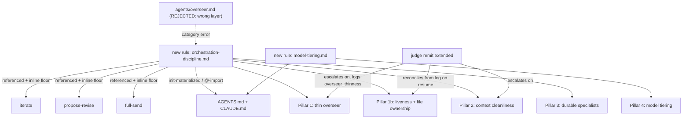

---
first_authored:
  by: "@claude-opus-4-8"
  at: 2026-08-28T15:49:55-07:00
task_list: cdocs/overseer-alignment
type: proposal
state: live
status: review_ready
last_reviewed:
  status: accepted
  by: "@claude-opus-4-8"
  at: 2026-09-01T16:20:00-07:00
  round: 3
tags: [oversee, agent_orchestration, context_management, model_tiering, durable_specialists, iterate, full_send, claude_skills, workflow]
---

# Overseer Alignment: Thin Lead, Durable Memory, Tiered Models

> BLUF: The cdocs "overseer" is a written behavioral mode duplicated across three skills with no rule governing its own context hygiene, and long-lived overseer-style sessions measured on the maintainer's setup ballooned ~6.4x within a session (peaking near a 964K-token single-turn re-read).
> This proposal promotes overseer discipline to a single enforced rule (`orchestration-discipline.md`, referenced by `iterate`/`propose-revise`/`full-send`, not an `agents/overseer.md` type), adds a context-cleanliness rule (checkpoint-to-durable-memory, compaction cadence, turn-size targets, on-resume liveness reconciliation, single-writer file ownership), formalizes the durable-specialist pattern, and codifies model tiering (strong lead, sonnet search/explore, cheap mechanical).
> It is almost entirely a rules/skills change, low code risk, delivered through the existing `/cdocs:init`-driven cross-target rule pipeline, and sequenced so Phase 1 (the rule, the resumption/ownership disciplines, the judge's logged signal, and per-skill inline floors) ships as a self-contained first `/cdocs:iterate` loop.

## Summary

Anthropic's orchestrator-worker pattern puts a strong model at the lead and delegates bulk execution to disposable-context workers, but its lead agent externalizes running state to memory precisely because a window that grows past ~200K tokens truncates and degrades.
The cdocs plugin encodes the orchestrator half (the "overseer mode" prose in `iterate`, `propose-revise`, `full-send`) but not the memory-and-thinness half.
There is no `rules/*.md` that mentions context cleanliness, overseer thinness, `/compact`, checkpointing, or durable memory: the concern lives only in historical proposal and report prose, so it carries no enforcement weight and is never delivered to consuming projects.

### Problem Evidence

The measured consequence, from a live usage-forensics pass on the maintainer's own sessions, is expensive:

- **Context bloat:** Overseer per-turn context climbed from ~125K to ~805K tokens (peak ~964K) before each reset, with no explicit management cadence.
- **Subagent disparity:** The overseer carried ~2.25x the per-turn context of its subagents despite dispatching most of the work, indicating context absorption rather than true delegation.
- **Inline work leakage:** ~59% of overseer context went to inline `Bash`/`Edit`/`Read` work it should have dispatched as subagent tasks, representing both cost and a loss of clarity about who did what.
- **Degraded reasoning:** At ~964K tokens, the overseer was well above the ~200K-300K window where prior research shows reasoning quality degrades; the overseer was paying the cost without the benefit of deeper reasoning.
- **Session duration:** A single overseer session ran 68+ hours / 10,600+ turns with no built-in reset pressure, amplifying the window-growth problem and making cost tracking difficult.

The fix is not to remove the overseer; it is to make it thin and give it durable external memory, which is what the reference architecture already does.

This proposal makes four coordinated changes and calls out the cdocs patterns that must change to support them.

## Objective

Align the cdocs multi-agent workflow with orchestrator-worker best practice so that a long-lived overseer session stays cheap and sharp:

1. A single, enforced definition of the overseer role (thin lead, dispatch-by-default), replacing duplicated and already-drifting per-skill prose.
2. A context-persistence-and-cleanliness discipline that keeps overarching state in durable files (devlog, `CLAUDE.md`, handoff) rather than in an ever-growing live window.
3. A formal durable-specialist pattern so deep per-workstream context is carried by a named, resumable subagent, not absorbed into the overseer.
4. A model-tiering convention: strong model for lead and judgment, sonnet for search/explore/research-aggregation, cheapest capable model for mechanical fan-out.

## Background

### Prior art and the pattern

- Anthropic's [Building Effective Agents](https://www.anthropic.com/engineering/building-effective-agents) names orchestrator-worker as a core pattern for tasks (coding among them) where subtasks cannot be predicted up front.
- Anthropic's [multi-agent research system](https://www.anthropic.com/engineering/multi-agent-research-system) is the production instance: an Opus lead orchestrating Sonnet subagents, beating single-agent Opus by 90.2% on their eval. It also reports the cost: multi-agent systems use ~15x the tokens of chat, and token usage explained ~80% of eval-score variance, so the pattern is gated to high-value tasks. Critically, the lead "saves its plan to Memory to persist context, since if the context window exceeds 200,000 tokens it will be truncated," and spawns fresh subagents "with clean contexts while maintaining continuity through careful handoffs." The lead treats a large window as a liability to manage, not a feature.
- The credible dissent, Cognition's [Don't Build Multi-Agents](https://cognition.com/blog/dont-build-multi-agents), argues against parallel peers editing shared work blind to each other's decisions, and for sharing full context. It is compatible with memory-offload; it does not license an unbounded single window either.
- [Context rot research](https://www.trychroma.com/research/context-rot) (Chroma, 18 models) shows reasoning quality degrades as input length grows, well before the window limit. A ~964K-token turn is far outside any regime these results call safe, independent of dollar cost.
- Claude Code's own mechanics assume thin-overseer + disposable-subagent: a subagent runs in its own context window and returns only a short summary; `/compact` is meant to run proactively after a meaningful chunk; and a repo-root `CLAUDE.md` is understood to be re-read from disk after compaction, which is the reseed mechanism this proposal leans on (a load-bearing assumption to verify at implementation).

### Current cdocs state (what exists, and the gap)

- The overseer is defined as a behavioral mode in three places: `plugins/cdocs/skills/iterate/SKILL.md`, `plugins/cdocs/skills/propose-revise/SKILL.md`, and `plugins/cdocs/skills/full-send/SKILL.md`. The definitions have already drifted: iterate says dispatch "for all tasks beyond trivial few-liners"; propose-revise says "even trivial ones."
- "Restricts itself to orchestration" is a written instruction with no backing: no tool allowlist constrains the top-level session agent (only dispatched subagents have allowlists).
- Four formal agents exist: `reviewer` (opus), `judge` (opus, no Edit/Bash/Task), `triage` (haiku), `nit-fix` (haiku). There is no formal implementer agent; the implementer is a `general-purpose` subagent.
- Three rule files exist: `workflow-patterns.md`, `writing-conventions.md`, `frontmatter-spec.md`. None mentions context cleanliness, overseer thinness, `/compact`, checkpointing, or durable memory. The only in-plugin occurrence of "compact" is a passing aside in `triage/SKILL.md`.
- Rule *content* is materialized into consuming projects by `/cdocs:init`, which writes `.claude/rules/cdocs.md`, `.opencode/rules/cdocs/`, and an inlined `AGENTS.md` section. The `SessionStart` hook (`hooks/inject-rules.ts`) does not inject content: it sha256-hashes `rules/*.md` and, on mismatch with the consumer's marker, emits a short directive to re-run `/cdocs:init`. In a source repo whose `CLAUDE.md` `@`-imports `plugins/cdocs/rules/`, the rules load directly via those imports and the hook stays silent. A new rule file is auto-covered by the hash and the `.opencode/` glob, but `/cdocs:init`'s AGENTS.md inlining hardcodes exactly three sections (`init/SKILL.md:73-81`), so a fourth rule is hashed-as-stale yet never inlined until that template is updated: a split-brain the phases must handle.
- `iterate` terminates on accept/reject/escalate/interrupt with no retry or context-budget cap. The Iteration Log is already positioned as "the durable resumption point": a fresh overseer reading only the devlog can reconstruct loop state. This is the seam the context discipline builds on.
- clauthier's root `CLAUDE.md` carries no model-default policy; consuming repos set their own (weftwise `main` sets a blanket Opus floor: "do not silently downgrade dispatched work"). This asymmetry is why model tiering belongs in a rule the plugin ships, not only in each consumer's `CLAUDE.md` - though a blanket floor can override the tiering shape (see Pillar 4).

> NOTE(claude-opus-4-8/overseer-alignment): The forensic figures (6.4x growth, ~964K peak, 2.25x overseer/subagent ratio, 59% inline work) come from a `~/.claude/usage.db` analysis of the maintainer's Aug 26-28 2026 sessions.
> They are motivating evidence, not a claim about the plugin in the abstract; the design stands on the prior art regardless.

## Proposed Solution

Four coordinated pieces, all delivered through the existing rule pipeline. The center of gravity is one new rule file that the three overseer-mode skills reference instead of duplicating.

### Canonical Unit: A Rule, Not an Agent Type

The overseer discipline is delivered as a single shared rule file, `plugins/cdocs/rules/orchestration-discipline.md`, referenced by `/cdocs:iterate`, `/cdocs:propose-revise`, and `/cdocs:full-send` via the existing cross-target rules delivery: `/cdocs:init` materialization into `.claude/rules/cdocs.md`, `.opencode/rules/cdocs/`, and an inlined `AGENTS.md` section; the `SessionStart` hash-based freshness nudge; and the source-repo `CLAUDE.md` `@`-import. This is the only canonical home for the discipline; Pillars 1-4 below are its content, not competing artifact types.

An `agents/overseer.md` role type is rejected as a category error, not deferred as future work. Two hard platform constraints make it incoherent for the overseer's primary use:
- The overseer is almost always the TOP-LEVEL session, which a subagent's frontmatter (`tools:`, `model:`, `memory:`) cannot constrain: that frontmatter governs a dispatched worker, not the session actually running the loop.
- A dispatched subagent-overseer could not dispatch its own workers, since the platform forbids subagent-from-subagent `Task` dispatch (already stated as a constraint on `reviewer.md`). An overseer's entire job is dispatch, so a subagent role type would be inert for the one thing it exists to do.

"Overseer" names a discipline a session adopts, not an artifact type: it is a hat the lead session wears, not an `agents/` entry. Nested orchestration, where genuinely needed, runs through the `fork`/`SendMessage` durable-specialist mechanics (Pillar 3), a different primitive from `Task` dispatch.

A `/cdocs:oversee-arc` skill for multi-proposal-arc chaining, cross-session arc durability, and full concurrent-multi-overseer coordination is a separate, later proposal. It would compose the loop skills and reference this rule, not re-embed the discipline; it is out of scope here.

### Pillar 1: Overseer-role enforcement (single source of truth)

Create `plugins/cdocs/rules/orchestration-discipline.md` as the canonical definition of overseer mode, and reduce the per-skill prose to a one-line reference, the inline discipline floor (below), plus any skill-specific carve-out.
The rule states:

- **Core responsibilities:** The overseer plans, dispatches, interprets returned summaries, makes cross-cutting decisions, and maintains durable state. It is a router and judgment layer, not a workhorse. Concretely: the overseer does not run `npm test`, does not read full file contents unless a summary would not serve, does not commit code, and does not run build/dev commands itself.
- **Dispatch-by-default:** Any bulk file read (>1KB or >20 lines), exploratory search sweep, build/test run whose full output is not needed verbatim, or implementation slice goes to a subagent. The canonical carve-out is "trivial few-liners" (single-line edits, one-off checks); a skill may set a stricter bar (propose-revise's "even trivial ones") but never a looser one. This reconciles the existing drift by making iterate's wording the default and propose-revise's the documented exception. A concrete heuristic: if the command output is more than 10 lines or if interpreting the output requires domain knowledge beyond "did it pass or fail," dispatch it.
- **Summary absorption:** The overseer never absorbs a subagent's raw file reads into its own window when a returned summary would serve. Concretely: if a subagent says "I read 10 files and found X," the overseer records X; it does not re-read those 10 files. The summary is the contract boundary.
- **Signaling self-check:** At each dispatch decision, the overseer runs a self-check: "Could a subagent do this better (more cheaply, more independently)?" If the honest answer is yes, dispatch it.

Enforcement method (the "Anthropic overseer-role enforcement" the maintainer asked for), in three graded layers:

1. Written rule + a self-check block the overseer is instructed to run at each dispatch decision ("could a subagent do this?").
2. Judge-remit extension (Pillar 2 supplies the input signal, this section supplies the judge's own output signal): the `judge` agent, already fresh each invocation and already assessing loop health, gains an explicit check for overseer-as-workhorse and context bloat. The judge cannot observe the live session: its inputs are the Iteration Log and reviews, by design (no Bash, no `usage.db`). So this backing is only real once the overseer is *required to log* a thinness signal (Pillar 2 names the field) and the judge is *required to log its own diagnosis* of that signal (Pillar 2's `overseer_thinness` field); the judge then escalates off the input field, and a missing input field or a missing `overseer_thinness` write is itself a flagged violation. Absent both logged signals this layer reduces to self-policing, which is why the fields are a blocking part of the design, not a nicety. This layer exists only inside `/cdocs:iterate`: `propose-revise` and `full-send` have no judge and fall back to the written self-check plus the optional Phase 5 hook, with no independent enforcer.
3. Optional `PreToolUse` advisory hook (future work, Phase 5): warn when the top-level session issues a run of inline `Edit`/`Write`/`Bash` calls past a threshold. Advisory only, since the hook cannot reliably know whether a session is in overseer mode.

**Inline discipline floor (delivery robustness, not a fourth enforcement layer).** A skill that reduces to a bare reference to `orchestration-discipline.md` is silently weaker on a marketplace install that has not run `/cdocs:init`: the `SessionStart` hook injects no rule content, only a directive to re-run `/cdocs:init`, so a fresh install's reference can point at content the session never loaded. Each of `iterate`, `propose-revise`, and `full-send` therefore keeps a 2-3 line inline summary in addition to the rule reference: dispatch-by-default (with the skill's own carve-out), durable state before compact, fresh reviewer/judge. This is deliberate, small duplication, the opposite of the zero-duplication goal in "cdocs patterns that must change" below, and it is the right trade: a correctness floor beats a clean-but-absent reference.

### Pillar 1b: On-Resume Liveness and Single-Writer File Ownership

Two durable disciplines, motivated by concrete failures observed in a live overseer session rather than by hypothetical risk, and foundational enough to ship with Pillar 1 rather than waiting on the rest of the context-persistence work in Pillar 2.

- **On-resume liveness reconciliation.** A dispatched child (implementer, reviewer, judge, or fork) can terminate without the overseer's in-window belief reflecting it: the harness notifies the overseer only when *no* live children remain, so a session resumed mid-interruption can retain a stale "child in flight" belief instead of the true state. NOTE(claude-sonnet-5/overseer-alignment-round2): a full-send orchestrator session hit exactly this and deadlocked, re-reporting "child in flight" on resume although the harness had already returned control because no live children remained. The rule requires that before acting on any resumed loop, the overseer re-derives dispatch/return state from the Iteration Log's dispatch/return event rows (Phase 1 adds these, alongside the thinness columns below) rather than trusting its own recollection. Durable memory without this on-resume reconciliation step still deadlocks, since a written handoff records what was *decided*, not what is *currently running*.
- **Single-writer file-ownership convention.** At most one agent writes a given file or document at a time. Before dispatching an agent that will `Write`/`Edit` a path, the overseer checks whether another live agent already owns that path (a claim recorded in the Iteration Log or devlog); if so, it serializes (waits) or re-scopes the dispatch to a different file rather than dispatching a second concurrent writer. NOTE(claude-sonnet-5/overseer-alignment-round2): this session had two agents concurrently writing the same proposal file, clobbering each other's edits and requiring manual reconciliation. A named durable specialist (Pillar 3) that owns a file across turns satisfies this by construction; the convention matters at the moment a *second* agent is dispatched against a path already claimed.

### Pillar 2: Context persistence and cleanliness

The same new rule (or a sibling `context-discipline.md`; see Design Decisions) codifies:

> NOTE(claude-sonnet-5/overseer-alignment-round2): The judge-observable thinness signal bullet below (the third one) ships in Phase 1 alongside Pillar 1 and Pillar 1b, since it is enforcement-critical. The remaining Pillar 2 items (handoff format, compaction cadence, `CLAUDE.md` reseed verification) ship in Phase 2.

- **Durable state:** State lives in files, not the window. At each task-unit boundary (a `task_list` boundary, or an accepted iterate iteration), the overseer writes a handoff into the devlog before compacting: what is done, decisions made, open todos, files touched. The iterate Iteration Log already carries most of this; the change makes the pre-compaction handoff explicit and required, not incidental. Handoff format: a markdown section with three subsections - "Completed," "Decisions Made," "Open Todos" - so a fresh reader can orient in <30 seconds.
- **Proactive compaction cadence:** Run `/compact` (or `/clear` for a hard reset) proactively at task-unit boundaries, not reactively at the window limit. Target keeping overseer turns under ~150K tokens rather than letting them run to 800K+. A concrete trigger: after every 3-5 iterations of the implement-review loop, or whenever a judge invocation completes, checkpoint and compact immediately. Do not wait for the window to grow.
- **Legible thinness signal (overseer-written):** At each checkpoint the overseer appends to the Iteration Log an approximate current-context estimate and an "inline-work performed this turn" flag (additive columns, permitted by Phase 1's additive-fields constraint). Estimate format: "~150K tokens (30% of turn was inline file reads)" so trends are visible. This is the field the judge reads to key `escalate`; without it the judge cannot see bloat and Pillar 1's judge layer is inert.
- **Judge-logged bloat signal (judge-written, the named enforcement signal):** The judge writes its own named, additive Iteration-Log field at each invocation: `overseer_thinness: clean | bloat_detected | signal_missing`. This is distinct from the judge's accept/reject/escalate/rotate-implementer verdict: a judge may log `bloat_detected` while still returning `continue`, when a rising-context trend coexists with clear forward progress (see the soft-loop-cap edge case below), so the bloat diagnosis stays auditable independent of whether it alone triggered escalation. `signal_missing` is written whenever the overseer's own context-estimate/inline-work columns are absent from the log, making an unenforced checkpoint visible in the log rather than only inferable from prose. This field, not prose guidance about "the judge may escalate on bloat," is what makes Pillar 1's judge-backstop layer real and gradeable.
- **CLAUDE.md reseed mechanism:** Rely on the repo-root re-read after compaction to restore overarching context, rather than holding it in live tokens. This reseed is load-bearing for the compaction-cadence guidance and must be verified against current Claude Code behavior (or cited) during implementation: if compaction does not re-read `CLAUDE.md` from disk, "compact aggressively, rely on reseed" loses its safety net. The verification step must confirm that `/compact` followed by a fresh agent invocation re-loads `CLAUDE.md` from the file system, not from a cache.
- **Hand-written handoffs before auto-compact:** Hand-written handoffs are more complete than auto-compaction's lossy summary; the rule says so and the iterate loop enforces the write before the compact. Skipping the handoff is a failure: the checkpoint is not complete until the handoff is written.

Wire-in: `iterate` gains an explicit "checkpoint" step at judge-assessment points and after each Accept, and a soft context-budget termination condition (Pillar-1 call-out below).

### Pillar 3: Durable specialists

Formalize the long-lived, named specialist subagent as the way to carry deep per-workstream context without inflating the overseer:

- **Named resumption:** One specialist per active workstream, resumed by name via `SendMessage`, so the specialist *is* the retained context, addressable rather than re-explained. Concrete pattern: an overseer running 5 proposals in parallel spawns 5 named specialists: "impl-proposal-1," "impl-proposal-2," ... "impl-proposal-5." Each carries its own context about its proposal. The overseer routes work to specialists by name, never by repeating context.
- **Fork for side-context:** A `fork` subagent is the tool for a side-investigation that needs full parent context without growing the parent thread. Concrete example: the overseer is mid-iteration; the implementer needs a quick decision about a library version. The overseer forks a fresh researcher agent with full context, gets a 3-sentence answer, and resumes the main thread. The fork's context is disposable (it ends when the fork completes).
- **One-per-workstream bound:** N parallel large-context specialists recreate the cost problem. The rule states this bound explicitly: an overseer managing 10 proposals spawns 10 specialists maximum, not 10+N advisory specialists. If the workstream count grows, the overseer escalates to a parent overseer or re-scopes the work.
- **Implementer as canonical specialist:** This generalizes a pattern iterate already half-encodes: the implementer is "fresh only when the judge says rotate-implementer" because "an implementer mid-task carries valuable context." That implementer is already a durable specialist; the rule names the pattern and extends it beyond the implement loop. In a multi-proposal oversee session, each proposal's implementer is its specialist, kept warm across iterations until the judge says rotate.
- **Specialist hygiene:** Each specialist's context is durable, so it does not re-read the overseer's general state repeatedly. The specialist reads its own task-specific devlog once on resumption, interprets instructions, and works. The overseer does not transmit its full context to the specialist; it transmits a task and a pointer to the specialist's devlog or a one-line checkpoint.

### Pillar 4: Model tiering

Create `plugins/cdocs/rules/model-tiering.md` codifying default model selection, which no rule currently states:

- **Lead / overseer / judgment (reviewer, judge):** Strong model (opus-class). Orchestration and adjudication are reasoning-heavy; Anthropic deliberately did not cheapen its lead. Concretely: if the overseer is running loops where it makes calls like "should this loop continue or escalate," those calls require opus-level reasoning; do not downgrade. The judge agent, which assesses loop health from iteration logs and review documents, is the quintessential case: it needs to spot subtle patterns (implementer stuck in local optima, reviewer and implementer talking past each other). Sonnet can read; opus can reason about the meta-patterns.
- **Search, explore, straightforward research-aggregation:** Sonnet. The workload is "find information and summarize it," not "reason deeply about trade-offs." Sonnet is cheaper and fast enough for these tasks, and the overseer can validate the returned summary.
- **Mechanical, deterministic fan-out (nit-fix, triage):** Cheapest capable model (haiku), as already assigned. These tasks have a clear pass/fail signal and do not require reasoning flexibility.

The tiering shape is advisory: a consumer's explicit model policy always wins. Where a consumer sets a blanket floor (weftwise's "do not silently downgrade dispatched work" forbids exactly the search/explore downgrade), the shape collapses toward that floor unless the consumer opts a tier back down. The intended adoption path is the consumer adding a named carve-out above its floor: weftwise's `CLAUDE.md` doing precisely this ("always use sonnet for search, explore, and research aggregation") is the model. The rule ships those carve-outs as ready-to-adopt guidance rather than as an automatic override, resolving the asymmetry where the tiering intent lived only in each consumer without clauthier dictating a downgrade a consumer's floor forbids.

**Cost-quality trade-off:** This tiering assumes the consumer is optimizing for value per token. An overseer session running ~10,000 turns on opus for everything is expensive; one running 100 overseer turns on opus + 9,900 subagent turns on cheaper models is an order of magnitude cheaper. The rule codifies the intent; adopters can tune the shape to their own cost targets.

### cdocs patterns that must change

- `iterate`, `propose-revise`, `full-send`: replace duplicated overseer-mode paragraphs with a reference to `orchestration-discipline.md` plus the retained inline discipline floor (dispatch-by-default, durable state before compact, fresh reviewer/judge); keep only skill-specific carve-outs beyond the floor. Removes the drift vector at its source while surviving an un-init'd marketplace install.
- `iterate` and `full-send`: add an on-resume step that reconstructs child-dispatch liveness from the Iteration Log's dispatch/return event rows before acting on any resumed loop, rather than trusting in-window belief about whether a dispatched child is still running (Pillar 1b).
- Any skill that dispatches two or more agents able to touch overlapping files (`iterate`'s implementer/reviewer, `full-send`'s propose+iterate composition): honor the single-writer file-ownership convention (Pillar 1b) before concurrent dispatch.
- `iterate` uncapped loop: add a soft cap and a context-budget-aware termination. The judge may `escalate` on excessive rounds or overseer context bloat. This directly targets the marathon-session cost, where a single session ran 68h / 10,600+ turns with no built-in reset pressure.
- `workflow-patterns.md` "Subagent-Driven Development" and "Dispatching Parallel Agents": add overseer-thinness and context-discipline cross-references so the tactics inherit the session-level discipline.
- `implement` (top-level mode) and `propose` (top-level mode): affirm they follow the same thinness rule, so the discipline is not iterate-only.
- Model guidance in skill frontmatter (`-m`/`-f` docs): cross-reference `model-tiering.md` so search/explore defaults resolve to sonnet.

## Important Design Decisions

- One new rule file for pillars 1-3 (including 1b) vs two. Pillars 1, 1b, 2, and 3 are one coherent concern (how a long-lived lead behaves), so a single `orchestration-discipline.md` reduces cross-reference overhead and matches how skills consume rules. Model tiering is a separable concern with a different audience (it also governs non-overseer dispatch), so it is its own `model-tiering.md`. Splitting context-cleanliness into its own file is left as an open question if the combined file grows unwieldy.
- Enforcement is graded, not hard. A hard tool-allowlist on the top-level session is not available (it is the user's own session), and a hook cannot reliably detect overseer mode. The durable enforcement is the independent judge plus the written rule, which matches how the plugin already backs the reviewer's constraints ("written instructions backed by container isolation, freshness, and the overseer's freedom to discard").
- Build on the Iteration Log, do not replace it. The log is already the resumption point; making the handoff-before-compact explicit is a smaller, safer change than inventing a new state file.
- Ship through the existing rule-delivery surfaces, correctly identified. No new delivery mechanism, but registration is not "add to the hook": the surfaces a new rule must touch are `plugins/cdocs/AGENTS.md` `@rules/` lines, the source-repo `CLAUDE.md` `@plugins/cdocs/rules/` imports, and `/cdocs:init`'s hardcoded AGENTS.md section template (`init/SKILL.md:73-81`). The `SessionStart` hash and the `.opencode/` copy pick up a new `rules/*.md` file automatically; the manual work is the AGENTS.md inline template and the `@`-import lists.
- Tiering as shape, not hard pins. The plugin ships the tiering shape; consumers keep the right to pin a family. This avoids clauthier dictating a model to every consuming repo while still delivering the intent.

## Edge Cases / Challenging Scenarios

- **Overseer legitimately needs to do inline work.** A genuine one-liner (changing a flag in a config file), or reading a returned summary. The "trivial few-liners" carve-out covers this; the self-check is a prompt, not a prohibition. Concretely: if the overseer changes 1-3 lines in a config based on a subagent's report, that's not a violation. If it reads a 50-line returned summary and re-reads the source files to "double-check," that is.

- **Compaction loses fidelity.** The handoff did not capture everything, and compaction's automatic summary is lossy. Mitigated by requiring the hand-written handoff before the compact, and by `CLAUDE.md` reseed. The rule warns that auto-compaction alone is insufficient. If a future session needs detail the handoff omitted, the devlog is still there as a re-reference point (not in the live window, but on disk).

- **Durable specialist proliferation.** If a session spins up many specialists (a specialist per subtask rather than per workstream), cost regresses. The rule bounds it to one-per-workstream and the judge can flag violation. Concrete test: if a session has 20 active proposals but 30 named specialists, the overseer has violated the bound. The judge's escalation text names this and suggests consolidation.

- **Specialist context stale across long interruptions.** A specialist is resumed after a long pause (user was AFK, conversation was interrupted). The specialist's prior context is stale relative to the repo's current state. Mitigation: the overseer writes a "context refresh" checkpoint in the specialist's devlog before a long break, summarizing the current repo state and the next task. When the specialist resumes, it reads the refresh checkpoint first.

- **Cross-target degradation (OpenCode).** Two different things degrade differently. Rule-*content* delivery degrades cleanly by construction: `/cdocs:init` already globs rules into `.opencode/rules/cdocs/`, so the two new rule files ship to OpenCode automatically. Only the *runtime* mechanics degrade: if a target lacks `SendMessage`/`fork`/`/compact` equivalents, the durable-specialist and compaction mechanics fall back to "start a fresh session with the handoff doc." The rule states both so neither is silently broken off-Claude-Code.

- **Soft loop cap causing premature escalation.** The judge uses the soft context cap as an input, not a hard kill; the judge weighs it against progress indicators (is the loop making forward progress despite high context? is the implementer circling?), preserving the existing accept-or-escalate contract. A healthy loop with rising context but clear progress may continue; a loop with rising context and no progress escalates. This is exactly why `overseer_thinness` (Pillar 2) is logged separately from the escalate verdict: a healthy-but-bloated loop logs `bloat_detected` and `continue` in the same turn, keeping the diagnosis auditable without forcing a premature escalation.

- **Enforcement hook false positives (Phase 5).** Advisory-only output avoids blocking legitimate inline work. The hook never says "this violates the rule"; it says "warning: you issued 12 inline edits in a row. Is this work you could dispatch?" The overseer can ignore the warning if it has a good reason.

- **Handoff-then-compact sequencing failure.** The overseer writes the handoff but crashes before running `/compact`, or the session ends with the handoff in the transcript but not committed to a file. Mitigation: the handoff is part of the Iteration Log (a devlog section), so it is already in the transcript. If the session crashes after writing the handoff, a resumed session reads the devlog and sees the handoff in the iteration log; the task is to call `/compact` to complete the checkpoint.

- **Multiple overseers in same repo.** Two parallel overseer sessions running against the same repo (e.g., one implementing proposals, one running reviews) can corrupt each other's state. The single-writer file-ownership convention (Pillar 1b) is in scope for v1 and directly prevents the observed failure mode (two agents clobbering one file): an overseer does not dispatch a write to a path another live agent already owns. Full multi-overseer coordination beyond file ownership (arc-level scheduling, cross-session locks, progress tracking across a whole proposal arc) remains out of scope for v1; a future `/cdocs:oversee-arc` proposal covers the multi-proposal-arc coordination layer that neither this proposal nor the shipped loop skills address. Beyond file ownership, for now serialize: only one overseer runs at a time, coordinated by humans.

## Test Plan

Mostly documentation and prompt-behavior changes, so verification is a mix of static checks and dispatched-agent behavioral probes.

**Static and mechanical checks:**

- **Rule delivery:** Confirm `/cdocs:init` materializes the two new rules into `.claude/rules/cdocs.md`, `.opencode/rules/cdocs/`, and the inlined `AGENTS.md` section (after its hardcoded template is extended), and that the `SessionStart` hook reports "stale" before re-init and stays silent after, using the existing rule-delivery regression approach (`cdocs/devlogs/2026-05-12-rule-delivery-regression-test.md`). Explicitly test the split-brain: a new rule hashed-but-not-inlined must be caught. Acceptance criterion: `/cdocs:init` succeeds; the generated `.claude/rules/cdocs.md` contains both rule files' content inline; re-running `/cdocs:init` in the same session reports no stale marker.

- **Drift removal:** Grep the three skills (`iterate`, `propose-revise`, `full-send`) to confirm each carries a reference to `orchestration-discipline.md`, a 2-3 line inline discipline floor, and skill-specific carve-outs, not the old duplicated multi-paragraph overseer-mode definition. Acceptance criterion: `rg "top-level session agent enters when invoking this skill" plugins/cdocs/skills/` (the old duplicated sentence) returns no matches; each skill's inline floor is 2-3 lines, not a full paragraph; `rg "trivial few-liners|even trivial ones" plugins/cdocs/skills/` resolves to rule-default-plus-exception, appearing at most once per skill as the carve-out.

- **Model tiering docs:** Confirm the two new rule files exist, are properly linked in `AGENTS.md` and the source `CLAUDE.md`, and contain the tiering guidance. Acceptance criterion: the rules are discoverable; search/explore skills reference `model-tiering.md` in their docs; the tiering shape is advisory, not prescriptive.

**Behavioral probes:**

- **Judge remit (context bloat detection):** Dispatch the updated `judge` against synthetic test data:
  - Test A: Iteration Log with rising context (row 1: ~80K tokens, row 2: ~150K tokens, row 3: ~200K tokens) and escalate criteria met. Confirm the judge returns `escalate`, logs `overseer_thinness: bloat_detected`, and gives a rationale naming the trend.
  - Test B: Iteration Log with steady context (~100K per row) and `continue` semantics. Confirm the judge returns `continue` and logs `overseer_thinness: clean`.
  - Test C: Iteration Log missing the new thinness columns. Confirm the judge logs `overseer_thinness: signal_missing` and flags the omission in its response rather than silently passing.
  - Test D: Iteration Log with rising context (as Test A) but clear forward-progress indicators (reviewer findings shrinking round over round). Confirm the judge returns `continue` while still logging `overseer_thinness: bloat_detected`, demonstrating the bloat diagnosis and the loop verdict are independently auditable.
  - Acceptance criterion: all four tests pass; the judge's rationale is auditable prose, not a code-generated template; `overseer_thinness` is present and correct in every test's Iteration Log write.

- **Overseer thinness behavioral probe:** Run an `/cdocs:iterate` loop on a small real proposal (5-10 phases, well-scoped). Confirm:
  - The overseer writes a handoff checkpoint in the devlog before running `/compact`.
  - The handoff has three subsections (Completed, Decisions Made, Open Todos).
  - Turns are kept lean: inspect a session's `~/.claude/usage.db` and confirm per-turn cache reads stay under ~150K tokens (baseline: previously ~300K+).
  - The Iteration Log includes the new thinness columns (estimated context, inline-work flag).
  - Acceptance criterion: handoff is present, turns are lean by measurement, Iteration Log has required columns.

- **Liveness reconciliation and file-ownership probe:** Against a synthetic Iteration Log with dispatch/return event rows (one child dispatched and returned, no live children remaining):
  - Confirm a simulated resumed overseer, instructed to follow the rule, reports the child as returned rather than in-flight, by reading the event rows rather than asserting a prior belief.
  - Against a synthetic Iteration Log with an open file-ownership claim on a path, confirm a simulated dispatch decision that would write the same path is deferred or re-scoped rather than issued concurrently.
  - Acceptance criterion: both probes demonstrate the rule text is followed from the log alone, without relying on in-window memory of prior turns.

- **Durable specialist pattern probe:** Run an oversee-style session managing 3+ proposals in parallel. Confirm:
  - Each proposal has one named specialist (implementer) resumed across iterations, not fresh each time.
  - The specialists are named consistently (impl-proposal-1, etc.).
  - The overseer does not absorb specialist context into its own window; it dispatches work by name.
  - Acceptance criterion: specialist names are visible in the Task dispatch log; the overseer does not re-read specialist work into its own window.

## Verification Methodology

**Verification harness:** Reuse the plugin's own `iterate` loop as the harness: implement each phase, then dispatch a fresh `/cdocs:review` (the author-checklist step already requires this) and, for the judge and rule-delivery phases, a dispatched behavioral probe rather than a self-graded read.

**Empirical verification for context discipline:** The core claim ("thin lead with durable memory keeps turns lean") must be verified empirically, not just by code inspection.

1. **Baseline reproduction (pre-change):** Before implementing Phase 1, run a real overseer session (a multi-iteration implement-review loop on a known-tractable proposal in the clauthier repo) under *current* cdocs rules and measure from `~/.claude/usage.db`:
   - Per-turn overseer cache-read (the "context size" of each turn when the overseer speaks).
   - Total tokens across the session (sum of all overseer + all subagent turns).
   - The per-turn average (should replicate the ~300K finding from the maintenance session; if it's not, measurement methodology must be reconciled).

2. **Post-change measurement (after the core phases, 1-4):** Run an equivalent loop on a similarly-scoped proposal under the new rules (with rule enforcement, checkpoint discipline, and durable specialists) and measure the same metrics. Acceptance criterion: per-turn overseer cache-read averages under ~150K, and the session's total token cost is lower by at least 30%.

3. **Measurement transparency:** Publish both measurements (pre and post) in a devlog section so the claim is auditable and future work can track improvements. If the post-change measurement does not show the expected improvement, the phases are not considered complete.

**Drift removal verification:** After Phase 1, grep for duplicated prose. The output of the grep is the verification artifact; zero matches on the old drift patterns (with the deliberate inline-floor lines excluded) is success.

**Judge and rule-delivery verification:** These are behavioral; the dispatched probe's devlog is the artifact. Both must complete without errors and with the acceptance criteria met.

## Implementation Phases

> NOTE(claude-sonnet-5/overseer-alignment-round2): Phases are sequenced so each is a self-contained `/cdocs:iterate` loop. Phase 1 bundles the enforcement backbone (the rule, the two new resumption/ownership disciplines, the judge's logged signal, the inline skill floors, and drift removal) so it can run as the first loop without waiting on Phases 2-4. Phases 2-4 each build on Phase 1's rule and registration pattern but do not block each other.

Phases 1-4 are the core; Phase 5 is optional future work.

### Phase 1: Foundational rule, resumption/ownership disciplines, judge signal (self-contained)
- Write `orchestration-discipline.md` covering Pillar 1 (overseer-role enforcement, including the inline discipline floor requirement) and Pillar 1b (on-resume liveness reconciliation, single-writer file ownership) under `plugins/cdocs/rules/`.
- Register at the real surfaces: add `@rules/orchestration-discipline.md` to `plugins/cdocs/AGENTS.md`; add the `@plugins/cdocs/rules/orchestration-discipline.md` import to the source-repo `CLAUDE.md` (clauthier, and document the same for other source consumers); and extend `/cdocs:init`'s hardcoded AGENTS.md section template (`init/SKILL.md:73-81`) with a new `## CDocs Orchestration Discipline` section so the rule is actually inlined for marketplace installs.
- Close the split-brain: the `SessionStart` hash and `.opencode/` glob pick the file up automatically, so without the template edit the hook nags "stale" but the content never materializes.
- Edit `iterate`, `propose-revise`, `full-send` to reference `orchestration-discipline.md` plus the 2-3 line inline discipline floor, retaining only skill-specific carve-outs beyond the floor. Resolves the "trivial few-liners" vs "even trivial ones" drift to rule-default-plus-exception.
- Add the on-resume liveness-reconciliation step to `iterate` and `full-send`, reading the Iteration Log's dispatch/return event rows rather than in-window belief.
- Add the additive Iteration-Log fields that make thinness legible and enforceable: the overseer-written context estimate and "inline-work performed" flag, the judge-written `overseer_thinness` verdict (`clean`/`bloat_detected`/`signal_missing`), and dispatch/return event rows for liveness reconciliation.
- Extend the `judge` agent's remit to key `escalate` off the overseer-written columns (rising context trend, or a run of inline-work turns), to write `overseer_thinness` at every invocation, and to flag `signal_missing` when the input columns are absent.
- Success: `/cdocs:init` in a scratch project materializes the rule into all three targets; the hook reports stale before re-init and silent after; source-repo `@`-import resolves; each of the three skills carries a reference plus a 2-3 line floor (not the old full paragraph); a synthetic Iteration Log drives all four judge-remit test cases (Test Plan) correctly; a synthetic dispatch/return log and a synthetic file-ownership claim drive correct liveness reconciliation and write-deferral in the resumption probe.
- Constraint: preserve each skill's existing role table and audit-trail semantics, and do not change the accept/reject/escalate/interrupt contract or the Iteration Log schema beyond these additive fields.
- This phase does not depend on Phases 2-4 and is the first `/cdocs:iterate` loop to run.

### Phase 2: Context persistence and cleanliness (remaining Pillar 2)
- Add the explicit handoff-before-compact checkpoint at judge-assessment points and after each Accept, with the Completed/Decisions Made/Open Todos subsections.
- Add the soft context-budget termination as a judge input, weighed against progress rather than a hard kill.
- Add the proactive compaction-cadence guidance to the rule (checkpoint-and-compact every 3-5 iterations, or after a judge invocation).
- Verify the `CLAUDE.md` reseed-after-compaction mechanic against current Claude Code behavior (or cite documentation); this is load-bearing for the cadence guidance and must be confirmed or corrected before the guidance ships as stated.
- References `orchestration-discipline.md` (Phase 1) for the enforcement backbone; does not redefine it.
- Success: behavioral probe shows handoff writes with the required subsections, correct judge weighing of the soft cap against progress, and a confirmed (or corrected) reseed mechanic.

### Phase 3: Durable specialists (Pillar 3)
- Document the durable-specialist pattern in `orchestration-discipline.md` (resume-by-name, fork, one-per-workstream, degradation fallback), noting it as the mechanism that satisfies Pillar 1b's file-ownership convention by construction for a specialist's own files.
- Add cross-references from `workflow-patterns.md` and affirm top-level `implement`/`propose` thinness.
- References Phase 1's rule and enforcement backbone; the pattern extends it, it does not restate it.
- Success: the pattern is discoverable from the workflow rule and the implement/propose skills without re-explaining it.

### Phase 4: Model tiering (Pillar 4)
- Write `model-tiering.md`; register at the same real surfaces as Phase 1 (AGENTS.md `@rules/`, source-repo `CLAUDE.md` import, and a new `## CDocs Model Tiering` section in `/cdocs:init`'s AGENTS.md template).
- State precedence explicitly: a consumer's model policy wins; the shape is advisory and adopted via named carve-outs (Pillar 4).
- Cross-reference from skill `-m`/`-f` frontmatter docs.
- Independent of Phases 2-3; can run in any order once Phase 1 has landed the registration pattern.
- Success: `/cdocs:init` materializes the rule into all three targets; search/explore guidance resolves to sonnet where a consumer adopts the carve-out.

### Phase 5 (optional / future work): Advisory enforcement hook
- Prototype a `PreToolUse` advisory that warns on long runs of inline `Edit`/`Write`/`Bash` from the top-level session.
- Success: fires on a synthetic workhorse run, stays silent on normal dispatch; advisory-only, never blocking.
- Flagged as future work: value depends on reliably approximating overseer mode, which is uncertain.

## Open Questions

- **File split for rules:** Should context-cleanliness be split from `orchestration-discipline.md` into its own `context-discipline.md`? Deferred until the combined file's size is known after Phase 3, once Pillars 1-3 (including Pillar 1b) have all landed. Heuristic: if the combined file exceeds 500 lines, consider splitting. The concern is not duplication (there is none; the two concerns are distinct) but readability and discoverability. A rule that is "too much" risks being skipped.

- **Soft loop cap tuning:** What is the right default soft loop/round cap for `iterate`, and should it be turns, tokens, or iterations? The proposal names "Nth Revise verdict" but doesn't pin a number. Needs one empirical calibration pass against real loops before pinning a number. Calibration: run 5 different `/cdocs:iterate` loops (varying complexity) and observe at which iteration number the judge typically needs to intervene (either because the loop is stuck or because the overseer's context is bloating). Propose a default in a follow-up proposal if the number is unstable.

- **Cross-target capability parity:** Does OpenCode expose adequate `fork`/resume/compaction equivalents, or does the durable-specialist pattern degrade to fresh-session-plus-handoff there? Requires a cross-target capability check (parity docs exist under `cdocs/devlogs/2026-03-13-parity-*`). Degradation is acceptable (the rule states it), but it must be named so adopters know what they're getting.

- **Specialist naming convention:** The proposal uses `impl-proposal-1`, `impl-proposal-2`, etc. Should this naming scheme be formalized in a rule, or left to the overseer's discretion? Formalizing makes it auditable; discretion makes it flexible. Deferred until Phase 3 (durable-specialist formalization).

- **Handoff format finalization:** The proposal suggests "Completed / Decisions Made / Open Todos" as the handoff subsection template. Should this be enforced in `/cdocs:triage`, or left as guidance? Enforcement makes auditing easier; guidance allows flexibility. Deferred to a follow-up `/cdocs:audit` skill if/when that is proposed.

### Round-1 review clarifications, resolved with recommended defaults
These are the maintainer's calls; the proposal proceeds on the recommended default and flags them for confirmation.
- **Judge bloat signal (review A):** recommended a combined signal - the overseer logs both an approximate per-checkpoint context estimate and an inline-work flag, and the judge escalates on trend or a run. Rejected: giving the judge a read-only `usage.db` probe (breaks its no-verification remit for marginal gain).
- **Tiering vs consumer floor (review B):** recommended consumer-floor-always-wins with the shape advisory, adopted via named carve-outs. This matches weftwise having just added a sonnet-for-search carve-out above its Opus floor.
- **One rule file vs split (review C):** recommended one `orchestration-discipline.md` now, splitting `context-discipline.md` only if it grows unwieldy (tracked as the first Open Question above).

### Round-2 review clarifications, resolved with recommended defaults
Findings from [`2026-09-01-review-of-overseer-approach.md`](../reviews/2026-09-01-review-of-overseer-approach.md), which reviewed this proposal alongside the RFP and the consolidation memo. The proposal proceeds on each recommended default.
- **Canonical unit (verdict):** confirmed - the shared rule is canonical; `agents/overseer.md` is rejected as a category error, not deferred. A future `/cdocs:oversee-arc` skill composes the loops and references this rule; it is a separate proposal and out of scope here.
- **Reference-vs-inline floor (misgiving 2):** resolved - each of the three skills keeps a 2-3 line inline discipline floor alongside its reference to `orchestration-discipline.md`, so the discipline survives an un-init'd marketplace install.
- **Liveness and file-ownership (misgiving 3, empirically motivated):** resolved - both disciplines are added to the rule as Pillar 1b and bundled into Phase 1, ahead of any `/cdocs:oversee-arc` build, per this session's own deadlock and file-clobber failures.
- **Judge bloat signal, sharpened:** the round-1 default (overseer logs context estimate + inline-work flag) is retained as the input signal; round-2 adds the judge's own named output signal, `overseer_thinness`, so the enforcement claim rests on a logged field rather than prose alone.
- **Enforcement-asymmetry and multi-overseer concurrency (misgivings 1 and 4):** not resolved here by design. The judge backstop remains iterate-only (already stated in Pillar 1's enforcement list); full multi-overseer coordination beyond single-writer file ownership remains deferred to `/cdocs:oversee-arc`. Both are named rather than solved, per the review's own account of what a rule-factoring can and cannot close.
