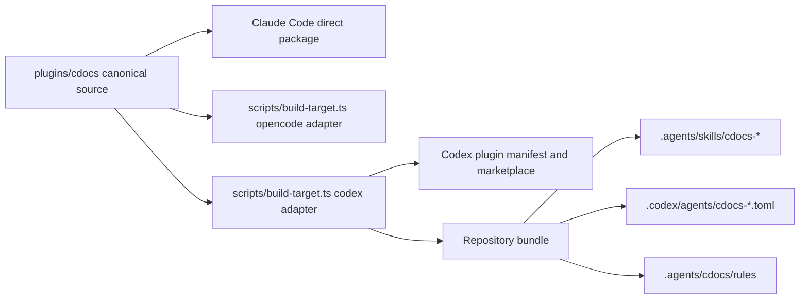

---
first_authored:
  by: "@gpt-5.6"
  at: 2026-08-31T11:37:54-07:00
task_list: cdocs/codex-support
type: proposal
state: live
status: review_ready
tags: [architecture, codex, multi-target, portability, build-system]
---

# Canonical Codex Support for CDocs

> BLUF(codex/cdocs-support): Extend CDocs to Codex from the canonical `plugins/cdocs/` source through two distinct surfaces: a Codex plugin package for optional user installation and generated `.agents/skills/` plus `.codex/agents/` artifacts for repository-scoped use.
> Keep the skill bodies single-source, translate only host-specific metadata and orchestration language, and leave Claude Code behavior unchanged.
> Repository-scoped setup must work in a fresh Codex environment with no marketplace or plugin entries in `~/.codex/config.toml`.

## Summary

CDocs has one authored skill tree under `plugins/cdocs/skills/`.
Claude Code consumes that tree directly, OpenCode consumes a generated package, and Codex gains both a co-located `.codex-plugin/plugin.json` and a generated repository bundle.

The two Codex outputs solve different problems.
The plugin manifest makes the canonical package distributable through Codex marketplaces, but Codex records installation and enablement in user state.
The repository bundle makes CDocs available because Codex discovers checked-in `.agents/skills/` and `.codex/agents/` directly.
It is the default for projects that require reproducible, repository-owned enablement.

The implementation also removes the Weftwise-local plugin copy and its marketplace catalog, unregisters the exact machine-local experiment, and replaces them with artifacts produced by Clauthier's Codex adapter.
The rejected experiment remains documented as an archived devlog, clearly marked as a non-canonical approach.

> NOTE(codex/cdocs-support): A Weftwise experiment places a copied plugin under `plugins/cdocs/`, a `personal` marketplace under `.agents/plugins/marketplace.json`, and corresponding entries in `~/.codex/config.toml`.
> Those artifacts prove plugin discovery, but they assign package ownership to the consumer repository and make project behavior depend on one user's machine state.
> They are cleanup inputs, not the target architecture.

## Objective

Make the complete CDocs workflow usable from Codex without duplicating authored workflow content, changing the Claude Code installation contract, or requiring each project contributor to mutate personal Codex configuration.

The design must provide:

- canonical ownership of all host adapters in Clauthier;
- repository-scoped skill and named-agent discovery for Codex;
- optional Codex marketplace packaging for users who want CDocs across repositories;
- explicit translations for CDocs orchestration roles and model choices;
- an honest hooks boundary where unsupported parity is visible;
- deterministic generation, drift detection, documentation, and isolated runtime verification;
- safe, exact cleanup of the Weftwise-local experiment.

## Background

### Existing multi-target architecture

Claude Code is the canonical authoring format for CDocs.
The plugin root contains shared markdown skills and rules, Claude agent definitions, and Claude lifecycle hooks.
`scripts/build-opencode.ts` generates OpenCode agent metadata and packaging while copying the canonical skills and rules into a disposable build directory.

This establishes the relevant precedent: author semantic workflow content once, then translate host-specific discovery, metadata, agent configuration, and hooks at a target boundary.
Codex support extends that architecture rather than creating a downstream fork.

> WARN(codex/cdocs-support): The current OpenCode build reports `Unknown CC tool "*"` while converting the reviewer agent.
> Phase 1 must characterize whether this produces a real capability loss before shared build utilities are extracted.
> Codex work must not normalize or conceal that warning, and any OpenCode correction requires its own regression evidence.

### Codex discovery and packaging primitives

OpenAI documents skills as the portable workflow authoring format and requires each skill directory to contain `SKILL.md` with `name` and `description` metadata.
Codex discovers repository skills under `.agents/skills/` from the working directory through the repository root, and it follows symlinked skill directories.
See [Build skills](https://developers.openai.com/codex/skills).

OpenAI documents `.codex-plugin/plugin.json` as the required entry point for a distributable Codex plugin.
A plugin may point directly at a root-level `skills/` directory and may coexist with hooks and other resources.
Repository and personal marketplaces are distribution catalogs, not equivalent scopes for runtime state.
Codex caches installed plugins and stores enablement in `~/.codex/config.toml`.
See [Package your plugin](https://developers.openai.com/plugins/build/plugins).

Codex custom agents are standalone TOML files under project `.codex/agents/` or personal `~/.codex/agents/`.
They require `name`, `description`, and `developer_instructions`, and may set model, reasoning, sandbox, MCP, and skill configuration.
Codex also provides built-in `default`, `worker`, and `explorer` agents.
See [Subagents](https://developers.openai.com/codex/subagents).

### Scope is not installation state

The word “repository” describes two different Codex mechanisms:

| Mechanism | Repository-owned input | Runtime consequence |
| --- | --- | --- |
| Repository marketplace | `.agents/plugins/marketplace.json` catalogs a plugin source. | Installation is cached and enablement is recorded in user configuration. |
| Repository skills and agents | `.agents/skills/` and `.codex/agents/` contain discoverable artifacts. | A fresh session discovers them without a plugin installation record. |

The repository bundle is therefore the only suitable acceptance path for “clone the project and receive CDocs behavior without personal plugin configuration.”
The marketplace package remains valuable for optional cross-project installation and ChatGPT surfaces, but it cannot serve as evidence for repository-only setup.

## Proposed Solution

### One canonical source with three target adapters



`plugins/cdocs/skills/`, `plugins/cdocs/rules/`, and the semantic bodies of `plugins/cdocs/agents/` remain the authored source of truth.
Generated files must identify their source and content hash and must never become editing surfaces.

Refactor the existing OpenCode builder only as far as needed to share target-neutral inventory, copying, hashing, and validation helpers.
Avoid a speculative generalized plugin framework: two small target adapters over shared utilities are easier to audit than one configuration language that attempts to encode every host.

### Canonical Codex plugin package

Add `plugins/cdocs/.codex-plugin/plugin.json` beside `.claude-plugin/plugin.json`.
The Codex manifest points `skills` at `./skills/` and uses the same package identity, version, repository, license, and publisher as the Claude manifest.
The build verifies that version and identity fields agree rather than maintaining independent release numbers.

Add a Codex marketplace catalog at Clauthier's repository root under `.agents/plugins/marketplace.json`.
Its `cdocs` entry points to `./plugins/cdocs`.
This makes Clauthier, not a consuming application repository, the owner of Codex package metadata.

The plugin path is optional distribution.
Documentation must state that `codex plugin marketplace add` and `codex plugin add` mutate user-local state and are appropriate only when the user wants that behavior.
They are not part of repository-scoped setup or its tests.

### Generated repository bundle

Add a Codex build target that writes a clean staging tree under `build/cdocs/codex/repository/`:

```text
build/cdocs/codex/repository/
  .agents/
    cdocs/
      manifest.json
      rules/
        frontmatter-spec.md
        workflow-patterns.md
        writing-conventions.md
    skills/
      cdocs-devlog/
        SKILL.md
        template.md
      cdocs-implement/
        SKILL.md
      ...
  .codex/
    agents/
      cdocs-judge.toml
      cdocs-nit-fix.toml
      cdocs-reviewer.toml
      cdocs-triage.toml
```

The target project checks these artifacts into source control.
Checked-in generated files are intentional deployment artifacts analogous to materialized CDocs rules: canonical authors edit Clauthier, and projects update through the generator.
The generated `manifest.json` records the CDocs version, source revision when available, and a content hash so drift can be detected without relying on timestamps.

Provide one idempotent deployment command owned by Clauthier that copies the staged bundle into an explicit target repository.
The command must require a target path, verify the target is a Git worktree, limit writes to `.agents/cdocs/`, `.agents/skills/cdocs-*`, `.codex/agents/cdocs-*`, and the CDocs marker block in root `AGENTS.md`, and refuse to overwrite unmanaged collisions.
It must support `--check` for CI and `--remove` for exact generated-artifact cleanup.

Do not use cross-repository symlinks for committed setup.
Although Codex follows symlinked skill folders, links into a sibling checkout encode one machine's directory layout and fail for other contributors and Codex cloud.

### Skill metadata and invocation names

Canonical Claude skills keep their current names because changing them would change `/cdocs:<skill>` commands.
The Codex repository adapter rewrites only generated frontmatter names to `cdocs-<skill>` and preserves the markdown body and sibling resources.
This gives unambiguous `$cdocs-propose`, `$cdocs-iterate`, and related selectors without altering Claude or OpenCode names.

The adapter normalizes filesystem-only spelling where needed, such as the `nit_fix` directory and `cdocs-nit-fix` public name.
A generated comment immediately after frontmatter identifies the canonical file and warns against manual edits.

### Host-neutral workflow language

Most CDocs skills contain portable process semantics but some name Claude-specific mechanisms: slash commands, the `Task` tool, `AskUserQuestion`, `subagent_type`, and Claude model aliases.
Codex output must translate those integration points without forking whole skill bodies.

Use narrowly scoped, tested transformations or generated preambles:

| Canonical concept | Claude Code | Codex repository output |
| --- | --- | --- |
| Explicit skill invocation | `/cdocs:implement` | `$cdocs-implement` or implicit skill selection |
| General implementer | `general-purpose` Task subagent | built-in `worker`, unless the invocation requests another model |
| Reviewer | `subagent_type: reviewer` | `cdocs-reviewer` custom agent |
| Judge | `subagent_type: judge` | `cdocs-judge` custom agent |
| Nit fix | `subagent_type: nit-fix` | `cdocs-nit-fix` custom agent |
| Triage | `subagent_type: triage` | `cdocs-triage` custom agent |
| User choice | `AskUserQuestion` | request user input when the active client exposes it, otherwise ask a concise blocking question |
| “haiku” role | low-cost mechanical work | `gpt-5.6-luna`, medium reasoning by default |
| “opus” role | high-judgment review | `gpt-5.6`, high reasoning by default |

Model mappings express role requirements, not claims of cross-vendor equivalence.
They live in one Codex adapter table and are covered by snapshot tests.
Invocation flags that explicitly request a model continue to override defaults.

Generated custom-agent instructions embed or reference the same semantic agent bodies but use Codex-native constraints.
Reviewer and judge freshness remains a workflow invariant enforced by the overseer, not a property of the TOML file.
The implementer remains a live agent across revise rounds until the judge requests rotation, matching the canonical iterate protocol.

### Rules delivery

Repository deployment copies canonical rules to `.agents/cdocs/rules/` and updates root `AGENTS.md` through the existing marker-delimited, hash-based CDocs initialization behavior.
Generated skills and agents refer to repository-root-relative rule paths and retain the AGENTS fallback.

Do not teach Codex to read rules from a Clauthier checkout or an installed plugin cache.
Repository behavior must remain valid in Codex cloud and on machines where Clauthier is not checked out beside the consumer repository.

The Codex adapter and `cdocs:init` must share the rule hash algorithm.
Two independently implemented hashing conventions would turn freshness checks into permanent false positives.

### Hooks boundary

Do not declare the Claude `hooks/hooks.json` as Codex-compatible merely because both products use a file with that name.
Event payloads, environment variables, matchers, output contracts, and enforcement semantics require separate empirical validation.

The initial Codex target provides no lifecycle hooks.
Equivalent behavior is divided as follows:

- rule injection is unnecessary because repository `AGENTS.md` and materialized rules supply instructions;
- frontmatter validation remains an explicit triage or test command;
- the CDocs-agent edit boundary remains written custom-agent instruction plus Codex sandbox configuration where enforceable;
- any future Codex hook is a separate proposal backed by a failing and passing runtime fixture.

This is a deliberate parity boundary, not an omission hidden behind “compatible” packaging.

### Weftwise repository installation

Deploy the generated repository bundle into Weftwise and commit only the generated Codex paths plus the corrected audit devlog.
Do not keep `weftwise/plugins/cdocs/` or a Weftwise-owned Codex marketplace entry.

The resulting project configuration is conceptually parallel to `.claude/settings.json` enabling `cdocs@clauthier`: it is reviewed and versioned with the project.
The mechanism differs because Codex's reproducible project primitive is direct skill and custom-agent discovery, while installed-plugin enablement remains user-local.

### Exact cleanup contract

Cleanup must begin with read-only inventory and refuse to broaden its targets if the observed state differs.
The known experiment consists of:

- untracked `weftwise/.agents/plugins/marketplace.json` with marketplace name `personal` and only the `cdocs` entry;
- untracked `weftwise/plugins/cdocs/`;
- untracked `weftwise/cdocs/devlogs/2026-08-31-codex-cdocs-plugin-setup.md`;
- `[marketplaces.personal]` in `~/.codex/config.toml` pointing at `/var/home/mjr/code/weft/weftwise/main`;
- `[plugins."cdocs@personal"]` with `enabled = true`;
- cache directory `~/.codex/plugins/cache/personal/cdocs/0.1.0+codex.local-20260831-102655/`.

Use `codex plugin remove cdocs@personal` and `codex plugin marketplace remove personal` so Codex owns edits to its config and cache.
Before removing marketplace `personal`, verify it still resolves only to the Weftwise experiment.
After each command, inspect `codex plugin list`, `codex plugin marketplace list`, the two config sections, and the exact cache path.
Do not edit `~/.codex/config.toml` manually unless the CLI fails and the user explicitly authorizes a reviewed fallback.

Remove the untracked wrapper and marketplace tree only after verifying every path is untracked and belongs to the experiment.
Retain the devlog, change it to `state: archived` and `status: done`, and add a prominent attributed warning that its implementation is rejected and removed.
This preserves the decision trail without presenting the experiment as current setup guidance.

## Important Design Decisions

### Repository discovery is the default acceptance surface

Plugin packaging is necessary for broad distribution but insufficient for repository-only reproducibility.
Treating a repository marketplace as repository enablement would repeat the central mistake: the catalog is checked in, but installation and on/off state still live under the user's home directory.

### Generated copies are deployment artifacts, not a second source

Repository-local skill discovery necessarily requires files inside the repository.
Deterministic generation, source headers, hashes, and `--check` preserve single-source authorship while allowing portable checked-in output.
This is preferable to absolute symlinks, undocumented manual copies, or runtime dependence on a sibling checkout.

### Target-specific transformations stay narrow

The proposal does not rewrite CDocs into an abstract intermediate language.
Skill prose remains canonical markdown.
Adapters own only discovery paths, frontmatter names, invocation syntax, named-agent configuration, model-role mappings, and verified path rewrites.

### Codex agents are first-class project configuration

Named CDocs roles are not optional polish.
`iterate`, `triage`, and pre-review nit-fix rely on role boundaries, freshness, and constrained responsibilities.
Generic subagents with prose-only role labels would weaken the workflow and make tests pass only by cooperative accident.

### Hook parity requires evidence

Similar directory names do not establish lifecycle compatibility.
Shipping no Codex hooks is safer and more accurate than silently loading Claude commands against a different host contract.

## Non-Goals

- Replacing Claude Code as the canonical authoring target.
- Publishing CDocs to the universal OpenAI plugin directory in this workstream.
- Making Codex and Claude model aliases appear equivalent.
- Porting Claude lifecycle hooks without a dedicated contract and runtime test suite.
- Changing CDocs document schemas, statuses, or writing conventions.
- Redesigning the OpenCode package beyond extracting clearly shared build helpers.
- Creating a generic marketplace or plugin framework for unrelated Clauthier plugins.
- Preserving the Weftwise-local wrapper for backward compatibility.
- Guaranteeing identical visual command names across hosts when their namespace mechanisms differ.

## Edge Cases and Challenging Scenarios

### Managed target collision

Deployment stops if `.agents/skills/cdocs-propose/` or another owned path exists without the expected generated marker.
It reports the collision and makes no partial update.
`--force` is intentionally absent from the first implementation.

### Stale generated bundle

`--check` compares generated content and manifest hashes against the target without rewriting it.
CI fails with a list of stale or missing paths and the command needed to regenerate them.

### Partial deployment failure

Generate into a temporary directory, validate the complete tree, then replace only managed target paths.
Record the prior managed manifest so interrupted updates can be diagnosed and a subsequent idempotent run can converge.

### Duplicate skill names

The adapter prefixes generated names with `cdocs-`.
Tests run with unrelated fixture skills to prove CDocs neither shadows nor is shadowed by common names such as `review` or `status`.

### Codex version drift

Codex custom-agent and plugin formats are evolving.
Pin the minimum verified CLI version in adapter documentation, test against the current supported version, and fail build validation on unknown required fields rather than silently dropping them.

### Plugin and repository bundle both active

Codex can expose both `cdocs:propose` from an installed plugin and `$cdocs-propose` from repository discovery.
Documentation identifies repository skills as authoritative inside configured projects.
Tests ensure duplicate availability does not result in generated skills recursively invoking the plugin name.

### No multi-agent capability

If a Codex surface lacks subagent tools, orchestration skills must stop before claiming an iterate or formal review loop ran.
They may offer a single-agent fallback only when the user explicitly accepts the weaker freshness guarantee, and the devlog must record that deviation.

### Read-only or untrusted project configuration

Repository skills still load according to Codex trust policy.
Deployment documentation must not instruct users to weaken trust, permissions, or sandboxing merely to make CDocs load.

### Cleanup state has changed

If `personal` contains another plugin, its source no longer points to Weftwise, the wrapper becomes tracked, or the cache version differs, cleanup stops and reports the mismatch.
No recursive deletion targets `~/.codex/plugins/cache/personal/`, the whole `plugins/` directory, or the whole `.agents/` directory.

## Test Plan

### Canonical inventory and deterministic generation

- Build the Codex repository bundle twice from clean output and compare byte-for-byte.
- Assert every canonical skill appears exactly once in the generated inventory.
- Assert templates and directly referenced resources are copied.
- Assert generated files contain source and hash metadata.
- Assert Claude and OpenCode outputs are unchanged by the Codex build.
- Assert Claude and Codex manifests share identity and version fields.

### Transformation tests

- Snapshot every generated skill's frontmatter name and invocation preamble.
- Snapshot each custom-agent TOML and parse it with a TOML parser.
- Assert all canonical Claude integration tokens are either deliberately portable or transformed in generated output.
- Assert role mappings select `worker`, `cdocs-reviewer`, `cdocs-judge`, `cdocs-nit-fix`, and `cdocs-triage` at the intended protocol points.
- Assert no generated path references a Clauthier checkout, Claude plugin cache, `${CLAUDE_PLUGIN_ROOT}`, or a user home directory.

### Deployment tests

- Deploy into a temporary Git repository and verify a second run is a no-op.
- Modify one generated file and verify `--check` fails with that path.
- Create an unmanaged collision and verify deployment refuses without modifying any other path.
- Run `--remove` and verify only manifest-owned paths are removed.
- Run deployment against a non-Git directory and verify it refuses.

### Runtime discovery tests

- Start Codex from the temporary repository with isolated user state and no configured marketplaces or installed plugins.
- Ask Codex to enumerate CDocs skills and verify all generated `cdocs-*` names are present.
- Invoke `cdocs-propose` and verify it reads its full canonical instructions and template.
- Spawn each CDocs custom agent by name and verify its role, model class, sandbox, and developer instructions are active.
- Run a minimal dispatched implement-review exchange and verify the reviewer is a fresh agent.

### Failure picture

The primary failure picture is a fresh Codex environment opening a configured repository and failing to expose `$cdocs-propose` until `codex plugin marketplace add` or `codex plugin add` mutates `~/.codex/config.toml`.
That result means repository-scoped setup has failed even if plugin installation succeeds afterward.

Additional fail-loud pictures are:

- `$cdocs-iterate` claims completion without spawning a fresh reviewer;
- a generated skill references `/cdocs:implement`, `subagent_type`, or `${CLAUDE_PLUGIN_ROOT}` as an executable Codex mechanism;
- cleanup leaves `cdocs@personal`, `marketplaces.personal`, or the exact experiment cache visible;
- deployment overwrites an unmanaged `.agents/skills/` directory;
- changing a canonical skill does not make `--check` fail in a deployed fixture.

### Cleanup tests

- Capture the exact pre-cleanup `codex plugin list`, marketplace list, config sections, cache path, and Weftwise `git status --short`.
- Verify both Codex removal commands target only `cdocs@personal` and marketplace `personal`.
- Verify the two config sections and exact cache directory are absent afterward.
- Verify the Weftwise wrapper and local marketplace are absent.
- Verify the archived experiment devlog remains and points readers to this proposal and the canonical setup documentation.
- Verify Weftwise exposes CDocs in an isolated fresh session through repository artifacts alone.

## Verification Methodology

Verification uses two independent temporary homes or operating-system users: one with the optional canonical plugin installed and one with no Codex marketplace or plugin state.
Do not reuse the maintainer's active `~/.codex` as the clean-room fixture.
Do not repurpose shell `HOME`, `CODEX_HOME`, or other shared environment variables in the test harness: pass supported explicit config paths or create an isolated user/container according to the CLI's verified contract.

For every iteration, the implementer records:

1. the Codex CLI version;
2. hashes of canonical inputs and generated outputs;
3. the clean-room plugin and marketplace listing before launch;
4. discovered skill names and custom-agent names;
5. a transcript excerpt from one skill invocation and one implement-review delegation;
6. Weftwise cleanup inventory before and after removal;
7. the repository's ordinary static-analysis results.

The reviewer independently recreates the clean-room repository fixture and re-runs discovery without reading the implementer's cache or configuration.
Acceptance requires the repository-only path to pass while the failure picture is demonstrably reproducible when `.agents/skills/` and `.codex/agents/` are withheld.

For plugin packaging, test in a separate fixture by installing from the Clauthier marketplace and verifying namespaced skill discovery.
This proves the optional package without allowing it to mask repository-bundle failures.

## Documentation

Update `plugins/cdocs/README.md` with a three-target support matrix and separate Codex sections for repository setup and optional plugin installation.
Lead with repository setup for application repositories.
State exactly which files are generated, how to refresh them, how to run `--check`, and how to remove them.

Update root `CLAUDE.md` to describe Codex as a generated target alongside OpenCode and name the build and verification commands.
Document the hook parity boundary and minimum verified Codex CLI version.

Generated repository artifacts include a short README or manifest note that points maintainers back to Clauthier and forbids direct edits.
The Weftwise archived devlog links to this proposal and the final setup section rather than retaining executable instructions for the rejected wrapper.

## Implementation Phases

### Phase 1: Characterization and failing fixtures

1. Add tests that inventory all canonical skills, agent roles, templates, and rule resources.
2. Add a clean-room Codex fixture with no marketplace or plugin state.
3. Capture the primary failure picture: the current repository does not discover CDocs without user-local installation.
4. Characterize current Claude and OpenCode build output so later refactoring must preserve it.

Acceptance criteria:

- the repository-discovery test fails for the expected missing-skill reason;
- fixture output proves no marketplace or plugin state is present;
- existing target characterization is committed before adapter implementation.

### Phase 2: Canonical plugin packaging

1. Add `.codex-plugin/plugin.json` under `plugins/cdocs/`.
2. Add Clauthier's `.agents/plugins/marketplace.json` catalog.
3. Add manifest schema, path, identity, and version checks.
4. Test optional install and namespaced skill discovery in an isolated plugin fixture.

Acceptance criteria:

- Codex accepts the canonical package directly;
- no skill, rule, or agent body is copied into another source directory;
- installing the optional package changes only the isolated fixture's user state.

### Phase 3: Repository bundle generator

1. Extract narrowly shared build utilities from `scripts/build-opencode.ts` without changing OpenCode output.
2. Generate prefixed Codex skill frontmatter, resource copies, canonical rules, and a hashed manifest.
3. Generate Codex custom-agent TOML from canonical roles and the explicit model-role map.
4. Add deterministic, snapshot, resource-closure, and forbidden-reference tests.

Acceptance criteria:

- two builds are byte-identical;
- all canonical skills and roles have exactly one generated counterpart;
- OpenCode characterization remains unchanged;
- generated output contains no host-invalid executable instructions.

### Phase 4: Safe project deployment

1. Add the explicit-target deploy, `--check`, and `--remove` command.
2. Add managed-file markers, collision refusal, and partial-update protection.
3. Integrate rule materialization and AGENTS marker updates with the existing hash convention.
4. Document repository setup and maintenance.

Acceptance criteria:

- temporary-repository idempotency, drift, collision, and exact-removal tests pass;
- deployment does not write outside its declared managed paths;
- a clean-room Codex session discovers every repository skill and custom agent.

### Phase 5: Workflow portability

1. Implement tested Codex translations for invocation, user input, subagent roles, and model-role defaults.
2. Exercise `propose`, `implement`, `review`, `triage`, `nit-fix`, and `iterate` through representative runtime probes.
3. Verify reviewer and judge freshness and implementer continuity across a revise round.
4. Document unsupported lifecycle-hook parity as an explicit limitation.

Acceptance criteria:

- the minimal implement-review loop produces a review artifact from a fresh named reviewer;
- mechanical agents respect their edit scopes in their instructions and configured sandbox;
- unavailable multi-agent capability fails loudly instead of simulating acceptance.

### Phase 6: Weftwise migration and exact cleanup

1. Re-inventory the experiment and stop if its ownership or contents differ from this proposal.
2. Remove `cdocs@personal` and marketplace `personal` through Codex CLI commands.
3. Remove only the untracked wrapper and local catalog paths.
4. Archive and annotate the experiment devlog.
5. Deploy and commit the canonical repository bundle in Weftwise.

Acceptance criteria:

- no experimental config section, exact cache path, wrapper, or local catalog remains;
- the audit devlog remains but cannot be mistaken for current instructions;
- Weftwise CDocs discovery passes in a fresh environment with no user plugin state.

### Phase 7: Cross-target regression and handoff

1. Run all build, static-analysis, deterministic-generation, deployment, and runtime tests.
2. Have a fresh reviewer reproduce both repository and plugin paths independently.
3. Record CLI versions, transcripts, hashes, cleanup evidence, and known parity gaps in the implementation devlog.
4. Update proposal and devlog status only after empirical acceptance.

Acceptance criteria:

- Claude Code, OpenCode, Codex plugin, and Codex repository paths pass their independent checks;
- the reviewer reproduces the primary success and failure pictures;
- no test depends on the maintainer's active personal Codex state.
