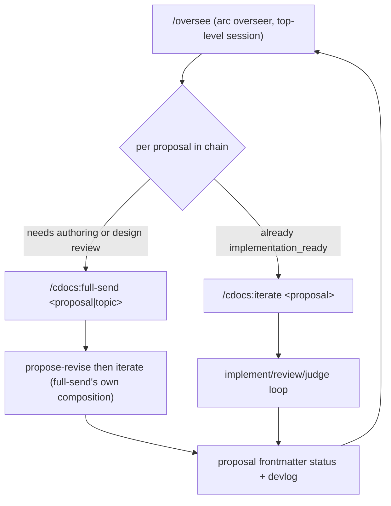

---
first_authored:
  by: "@claude-opus-4-8"
  at: 2026-09-03T11:30:00-08:00
task_list: cdocs/oversee-skill
type: proposal
state: live
status: review_ready
tags: [oversee, agent_orchestration, workflow, cdocs_meta, claude_skills]
last_reviewed:
  status: revision_requested
  by: "@claude-opus-4-8"
  at: 2026-09-03T12:30:00-08:00
  round: 1
  path: cdocs/reviews/2026-09-03-review-of-overseer-arc.md
---

# `/oversee`: Multi-Proposal-Arc Orchestration

> BLUF: `/oversee` is the arc layer ABOVE `/cdocs:full-send`: it sequences MULTIPLE proposals through their full lifecycle by composing `full-send`/`iterate`/`propose-revise` per proposal, never reimplementing a loop.
> It ships as a skill (the driver) plus a rule `oversee-arc.md` (the shared primitives), adds a durable `.claude/oversee/` arc-state file that survives interruption, an arc-level AFK field seeded by `--afk`, a repo-global claim registry for cross-arc file-conflict guarding, and a verification-depth ladder.
> It inherits, and does not restate, `orchestration-discipline.md`.

## Summary

The RFP [[2026-03-26-rfp-oversee-skill]] asked for three things; two shipped.
The single-proposal implement-review loop shipped as `/cdocs:iterate`, and the overseer's own resource discipline shipped as [[2026-08-28-overseer-alignment]] plus `orchestration-discipline.md` and `model-tiering.md`.
What remains, and what this proposal builds, is the layer that drives a whole ARC of proposals: the consolidation memo [[2026-09-01-overseer-consolidation]] §A enumerates its seven open questions.

`/oversee` is deliberately thin.
It is a top-level overseer (per `orchestration-discipline.md`) whose unit of work is a proposal, not a file: it advances proposal N+1 only when proposal N reaches a terminal accepted state, composing the existing loop skills to run each proposal and reading each proposal's frontmatter `status` as the return contract.
The genuinely new machinery is arc-level: a durable state file so an interrupted chain resumes, a repo-global claim registry so concurrent arcs do not clobber each other, a footprint-overlap test that decides serialize-vs-interleave, a troubleshooting budget, and a reusable verification-depth ladder that generates each proposal's `--verification-floor`.

> NOTE(claude-opus-4-8/cdocs/oversee-skill): This proposal BUILDS ON `orchestration-discipline.md` and does not re-propose it.
> Where the text says "the overseer is thin" or "single-writer ownership," it is invoking that rule's canonical prose, not restating it.
> The new content here is strictly the cross-proposal / cross-arc layer.

## Objective

Codify the recurring multi-proposal orchestration pattern users currently hand-specify every session: "take these proposals (or this topic), drive each through propose, review, revise, implement, and real verification, in the right order, continuing autonomously through the whole arc when I am AFK, without agents colliding on shared files or reporting done without verifying."

The failure modes this targets are arc-level, not loop-level (the loop-level ones are already handled by `iterate` and the overseer discipline):

1. An interrupted chain (rate limit, crash, closed terminal) loses track of which proposals are done and restarts or double-implements.
2. Two proposals' implementers touch overlapping files with no coordination and clobber each other.
3. The overseer stalls between PROPOSALS asking for permission to continue, even when the user has signaled AFK.
4. A stuck proposal burns expensive full-cycle retries (container rebuilds) instead of isolating the fault, starving the rest of the arc.
5. "Verified" is defined ad hoc per proposal with no shared vocabulary, so depth is inconsistent across the arc.

## Background

Required prior reading, in dependency order:

- **`orchestration-discipline.md`** (canonical overseer discipline): thin lead / dispatch-by-default (Pillar 1), single-writer file ownership and on-resume liveness reconciliation (Pillar 1b), context persistence and handoff-before-compact (Pillar 2), durable specialists and resume-by-name (Pillar 3), graded enforcement, cross-target degradation.
  `/oversee` dons this discipline; every claim of thinness or single-writer safety below is inherited from it.
- **[[2026-03-26-rfp-oversee-skill]]** §Scope: the original ask.
  Its single-proposal-loop and overseer-resource-discipline scope has shipped; its multi-proposal-arc, shared-state, and cross-agent-coordination scope has not.
  This proposal is that unbuilt remainder.
- **[[2026-09-01-overseer-consolidation]] §A** (authoritative scope boundary): the seven deduplicated open questions this design must answer, each distinguished from the already-shipped mechanism it resembles.
- **`plugins/cdocs/skills/full-send/SKILL.md`**, **`iterate/SKILL.md`**, **`propose-revise/SKILL.md`**: the composable loops `/oversee` invokes rather than duplicates.
  `full-send` already pairs one `propose-revise` with one `iterate` for a SINGLE proposal; `/oversee` sits one level up and sequences many.
- **`model-tiering.md`** (advisory tiers, consumer floor wins) and **`writing-conventions.md`**.

The scope boundary is sharp and worth restating as an exclusion list.
`/oversee` does NOT re-propose: the single-proposal implement/review loop (`iterate`), the propose/revise loop (`propose-revise`), or the overseer's context/model/resource discipline (`overseer-alignment` + `orchestration-discipline.md` + `model-tiering.md`).
It references and composes all of these.

## Proposed Solution

### Shape: a skill plus a rule (RFP Open Question 1)

**Decision: both, split along the driver/vocabulary line, mirroring the shipped `iterate` + `orchestration-discipline.md` precedent.**

- **Rule `plugins/cdocs/rules/oversee-arc.md`** holds the reusable, tool-agnostic primitives any agent may cite without running the skill: the arc-state-file schema, the claim-registry protocol, the footprint-overlap serialization heuristic, the troubleshooting-budget rule, and the verification-depth ladder taxonomy.
  These are vocabulary, not control flow, so they belong in a rule that `/cdocs:init` materializes alongside the others and that agents reference by pointer.
- **Skill `plugins/cdocs/skills/oversee/SKILL.md`** is the active driver: it parses the invocation, owns the arc-state file, sequences proposals by composing `full-send`/`iterate`/`propose-revise`, applies the rule's heuristics, honors the AFK field, and escalates at hard gates.

Rationale: the taxonomy (ladder rungs, budget numbers, schema) is referenced from multiple places and must be stated once (the project's deduplication value); the control flow is imperative and single-entry.
Putting the taxonomy in the skill would force other agents to read a skill to learn the ladder; putting the control flow in a rule would make it un-invokable.

### Composition, not reimplementation (RFP Open Question 3)

`/oversee` never runs an implement/review/judge loop directly.
Per proposal it invokes an existing loop skill and reads back a terminal contract:



The composition **interface** is two directional contracts:

- **Down (what `/oversee` passes into a composed loop):** the proposal path (or topic, for `full`), a `--verification-floor` derived from the proposal's required ladder rung (see below), model flags passed through unchanged (`-m`/`-f`, governed by `model-tiering.md`), and an autonomy signal derived from the arc AFK field.
- **Up (what `/oversee` reads back):** the composed loop's terminal state, expressed as the proposal's new frontmatter `status` (`implementation_accepted` on success, unchanged-plus-escalation on failure) and its devlog path.
  This IS the return contract.
  Consistent with Pillar 1 summary-absorption, `/oversee` reads the proposal's frontmatter `status` and the loop's final devlog handoff to decide advance-vs-escalate; it does NOT re-read the loop's Iteration Log turns or the implementer's diffs.

Mode-to-composition mapping:

| Invocation | Per-proposal composition |
|---|---|
| `/oversee chain [p1, p2, ...]` where `pN` is `implementation_ready` | `/cdocs:iterate pN` |
| `/oversee chain [p1, p2, ...]` where `pN` is an RFP stub or unauthored | `/cdocs:full-send pN` |
| `/oversee full <topic>` | first a scoping step (dispatch `/cdocs:propose` to author the arc's proposal set, or an RFP), then treat the result as a `chain` |

### The arc overseer is the ONLY overseer (nested-dispatch constraint)

`orchestration-discipline.md` states a dispatched subagent cannot dispatch its own workers, and that "overseer" is almost always the top-level session.
This constrains the arc design decisively: `/oversee` cannot spawn N sub-overseers that each run a full loop, because those subagents could not dispatch their own implementers.

Therefore there is exactly one overseer per arc: the top-level session.

- **Sequential arcs**: the top-level session runs each proposal's composed loop AS itself, one proposal at a time, checkpointing (Pillar 2 handoff-before-compact) at each proposal boundary before starting the next.
- **"Parallel" arcs**: the SAME top-level overseer INTERLEAVES turns across footprint-disjoint proposals: it dispatches proposal A's implementer and proposal B's implementer concurrently (parallel subagent dispatch IS supported), then interleaves their review/decide turns.
  There is still one overseer doing all dispatch, so the nested-dispatch prohibition is never violated.
  "Parallelization" at the arc level means interleaved turns under one overseer, NOT nested overseers.

> NOTE(claude-opus-4-8/cdocs/oversee-skill): This is a load-bearing constraint, not an incidental one.
> True parallel multi-proposal loops (each a full nested `/oversee`) would require nested-overseer support the current model does not guarantee.
> The interleaving model sidesteps it entirely and is the shipped design; see Cross-Target Degradation for where even interleaving thins out.

### Arc-level AFK / autonomous continuation (consolidation §A.2)

**Decision: the AFK signal is a FIELD in the durable arc-state file (`afk: true` plus an escalation-gate list), seeded by a `--afk` invocation flag and toggleable out-of-band by a `.claude/oversee/pause` marker.**

Mechanisms researched:

| Mechanism | Durable across session boundary? | Verdict |
|---|---|---|
| `--afk` invocation flag alone | No: lost on interruption/resume | Ergonomic setter only |
| Env var | Not reliably session-durable | Rejected as primary |
| Standalone marker file (`.claude/oversee/afk`) | Yes, but binary and detached from arc state | Kept only as an out-of-band pause override |
| **Field in the arc-state file** | **Yes, by construction** | **Chosen primary** |

Rationale: the DEFINING requirement is that a chain interrupted mid-arc and resumed in a fresh session must know whether to keep going without re-asking.
Only the arc-state file is read on resume, so only a field there is durable by construction; a flag or env var is gone by then.
The `--afk` flag writes the field on invocation; a `.claude/oversee/pause` marker file is the out-of-band STOP (a user with no live session drops it to force the arc to escalate-and-hold at its next gate), checked at each gate and cleared on acknowledgement.

This is distinct from `iterate`'s per-loop AFK fallback, which only handles a MISSING verification floor within one loop (write a placeholder floor, tag rows, warn).
Arc AFK governs whether the overseer advances between PROPOSALS and whether soft gates auto-resolve.

AFK semantics: `afk: true` converts every SOFT gate ("should I continue to the next proposal?", "which of two acceptable defaults?") into "apply the logged default and proceed."
It never suppresses a HARD gate (see Escalation).
At a hard gate under AFK the overseer writes the escalation into the arc-state file and a `.claude/oversee/escalations/` marker, then either holds (default) or skips the blocked proposal and continues the rest of the arc (`--afk=skip-blocked`), recording the choice.

### Cross-session durability: the arc-state file (consolidation §A.3)

A single JSON file per arc at `.claude/oversee/<arc-id>.json` is the durable resumption point, distinct from `iterate`'s per-loop Iteration Log: the Iteration Log tracks turns WITHIN one proposal's loop; the arc-state file tracks WHICH proposals in the chain are done and their ownership.
Two altitudes, two files.

Schema (illustrative, not exhaustive; the rule carries the normative version):

```jsonc
{
  "arc_id": "2026-09-03-oversee-cdocs-hooks",
  "mode": "chain",                    // chain | full
  "afk": false,                        // arc AFK field (see above)
  "afk_policy": "hold",                // hold | skip-blocked
  "created_at": "2026-09-03T11:30:00-08:00",
  "proposals": [
    {
      "path": "cdocs/proposals/2026-08-10-a.md",
      "status": "implementation_accepted", // mirrors proposal frontmatter at last transition
      "arc_state": "done",             // pending | in_progress | blocked | done
      "specialist": "arc-impl-a",      // durable-specialist handle if interleaved
      "devlog": "cdocs/devlogs/2026-09-03-a.md",
      "worktree": ".claude/worktrees/arc-a",
      "required_rung": "integration",  // verification-depth ladder rung
      "footprint": ["plugins/cdocs/rules/**", "cdocs/**"]
    }
  ],
  "position": 1,                       // index of the current proposal
  "claims": [ /* see claim registry */ ],
  "budget": { "full_cycle_retries_max": 2 }
}
```

The overseer writes this file at every arc-level transition (proposal start, proposal terminal, escalation, claim acquire/release), BEFORE compacting, the same handoff-before-compact discipline Pillar 2 applies to devlogs.
`arc_state` is the arc overseer's own bookkeeping; `status` mirrors the proposal's frontmatter at the last transition so a resumed overseer can detect drift (frontmatter says `implementation_accepted` but `arc_state` says `in_progress` → the loop finished during the interruption; reconcile forward).

### Shared state: the claim registry (consolidation §A.4)

Pillar 1b already guarantees single-writer ownership WITHIN one overseer's loop, checked against that loop's Iteration Log before a second writer is dispatched.
The NEW primitive here is CROSS-ARC / CROSS-SESSION: a second top-level `/oversee` in another worktree, or a concurrent arc, has no visibility into the first overseer's private Iteration Log.

The claim registry is a repo-global directory `.claude/oversee/claims/` (one file per claim), OUTSIDE any single devlog, so it is visible to every session in the repo:

```jsonc
// .claude/oversee/claims/arc-a--plugins-cdocs-rules.json
{
  "arc_id": "2026-09-03-oversee-cdocs-hooks",
  "owner": "arc-impl-a",               // specialist / loop handle
  "globs": ["plugins/cdocs/rules/**"],
  "acquired_at": "2026-09-03T11:40:00-08:00",
  "liveness": "live"                    // live | stale (reconciled on resume)
}
```

Protocol: before starting (or interleaving) a proposal whose footprint intersects an EXISTING live claim owned by a different arc/owner, the overseer serializes (waits or defers that proposal) or re-scopes, exactly as Pillar 1b does within a loop, but now across arcs.
This EXTENDS Pillar 1b to the cross-workstream altitude; it does not restate it.
A durable specialist that owns its own files satisfies its claim by construction (Pillar 3 "file ownership by construction"); the registry matters at the moment a SECOND arc's agent is dispatched against an already-claimed path.

### Serialization vs. parallelization with real file-conflict detection (consolidation §A.5)

The decisive signal is footprint overlap: "do these two proposals' agents touch overlapping files?"

1. **Footprint declaration.** Each proposal declares a `footprint:` (a set of path globs its implementation will touch), either as a proposal frontmatter field or derived: `/oversee` dispatches a cheap "footprint scout" (sonnet tier per `model-tiering.md`) that reads the two proposals' Implementation Phases and predicts the touched paths.
2. **Overlap test.** Intersect the two footprints' glob sets. Non-empty intersection → the proposals CONFLICT.
3. **Decision.** Conflicting proposals SERIALIZE (run in arc order, one terminal before the next starts). Disjoint proposals are eligible to INTERLEAVE under the single overseer (subject to the one-specialist-per-workstream bound from Pillar 3 and the overseer's own context budget).
4. **Uncertainty defaults to serialize.** If footprints cannot be predicted with confidence (the scout returns low confidence, or globs are broad like `**/*`), the overseer serializes: a false conflict costs latency, a missed conflict costs a clobber.

This uses `overseer-alignment`'s one-specialist-per-workstream bound as an adjacent constraint (it caps HOW MANY interleaved streams) but adds the missing piece: WHETHER two streams may run at all, decided by real footprint intersection rather than a count.

### Troubleshooting budgets (consolidation §A.6)

Rule (in `oversee-arc.md`): "isolate first, full-cycle second."
When a proposal's loop is stuck debugging, cap expensive full-cycle retries (container rebuild, full integration run) at a small N (default 2) before the overseer requires a switch to an isolation strategy: a minimal repro, a bisect, or a dispatched focused-diagnostic fork (`fork` per Pillar 3, disposable side-context).

Enforcement is graded, matching the discipline's posture: the arc overseer tracks full-cycle-retry count per proposal in the state file (`budget.full_cycle_retries_max`) and, when a proposal's loop trends past it, surfaces the signal into that loop's judge (the same soft-budget-as-judge-input mechanism `iterate` uses for context budget) or escalates the proposal as blocked.
It is a budget the overseer WATCHES and surfaces, not a hard kill, preserving the loop's accept/reject/escalate contract.

### Verification-depth ladder (consolidation §A.7)

A reusable rung taxonomy, authored once in `oversee-arc.md`, broader than `iterate`'s `review_proof` marker (which only distinguishes confirmed/n-a/deferred/skipped for one loop):

| Rung | Meaning | Typical evidence |
|---|---|---|
| `compile` | It builds / type-checks / lints clean | build or `tsc`/lint exit 0 |
| `unit` | Unit tests pass | test-runner summary |
| `integration` | Components work together against real dependencies | integration-suite output |
| `smoke` | The actual artifact starts and does its basic job | "the container starts and serves"; a CLI produces expected output |
| `live` | Validated against live/production-shaped state | real request/response, real data, cited artifact |

Each rung SUBSUMES the ones above it (a `live` requirement implies `compile`..`smoke` all pass).
`/oversee` selects the required rung per proposal (from the proposal's `required_rung`, or a `full <topic>` default) and generates the `--verification-floor` sentence it passes into that proposal's `iterate` composition, including at least one failure-picture as `iterate` requires.
The ladder is the shared vocabulary; the per-loop `review_proof` column remains the per-round audit field inside the loop.

## Important Design Decisions

- **Skill + rule, not one or the other (OQ1).** Driver in the skill, vocabulary in the rule; mirrors `iterate` + `orchestration-discipline.md` and honors deduplication.
- **AFK lives in the state file, not the flag (§A.2).** Only a state-file field is durable across the interruption the AFK signal exists to survive; the flag and marker are setters/overrides, not the source of truth.
- **One overseer per arc; parallel = interleaved turns, not nested overseers.** Forced by the no-nested-dispatch rule; the interleaving model is what makes arc-level concurrency legal at all.
- **Return contract is proposal frontmatter `status` + devlog, not loop internals.** Keeps the arc overseer thin (Pillar 1 summary-absorption): it reads a status field and a handoff, never the loop's raw turns.
- **Claim registry is repo-global, outside any devlog.** Cross-arc visibility is the whole point; a per-loop Iteration Log claim (Pillar 1b) is invisible to a second session, so the new primitive must live in a shared location.
- **Footprint uncertainty defaults to serialize.** Asymmetric cost: a missed conflict clobbers work; a false conflict only costs latency.
- **The verification ladder generates the floor; it does not replace `review_proof`.** Ladder = arc-level shared taxonomy; `review_proof` = per-loop round audit. They compose, not overlap.
- **`/oversee` is top-level-only.** Dispatched, it cannot dispatch its own loops; if invoked as a subagent it should degrade to sequential-advisory or decline, and say so.

## Edge Cases / Challenging Scenarios

- **Interrupted mid-proposal.** On resume, `arc_state: in_progress` but the proposal's frontmatter reads `implementation_accepted`: the loop finished during the gap. Apply Pillar 1b liveness reconciliation at the arc altitude: no live children means the child terminated; adopt the on-disk state (frontmatter + final devlog handoff) and advance, do not restart the loop.
- **Stale claim from a dead agent.** A claim file marked `live` whose owner is gone (no live children on resume) is reconciled to `stale` and released, so the arc does not deadlock waiting on a claim no one holds. This is Pillar 1b liveness reconciliation applied to the registry.
- **Footprint scout wrong (missed overlap).** Two "disjoint" interleaved proposals turn out to touch the same file mid-flight. The per-dispatch Pillar 1b check inside each loop is the second line of defense: the second writer against the now-shared path is caught at dispatch time and serialized. Footprint prediction reduces conflicts; it does not replace the per-dispatch guarantee.
- **AFK plus a hard gate.** A `reject` verdict or an unresolvable footprint conflict fires even under `afk: true`: write the escalation to the state file and `.claude/oversee/escalations/`, then hold (default) or skip-blocked-and-continue per `afk_policy`.
- **`/oversee full <topic>` scoping is a hard gate under AFK.** Deciding the proposal SET for an open topic is judgment the user may want to see; default is to escalate the proposed set once even under AFK, unless `--afk` was passed with an explicit "trust scoping" acknowledgement. (Preserved as an Open Question.)
- **Concurrent second `/oversee` in another worktree.** The repo-global claim registry is the only thing that makes this safe; two arcs with disjoint footprints proceed, two with overlapping footprints serialize on the registry. Two overseers with NO registry awareness is the clobber Pillar 1b's NOTE describes, now at arc scale.
- **Chain with a mix of authored and stub proposals.** Per-proposal composition mapping handles this: stubs route to `full-send`, `implementation_ready` proposals route to `iterate`, decided per element at its turn (not up front, since an earlier proposal may change a later one's readiness).

## Test Plan

This is a self-referential skill/rule change (like changes to `iterate` itself), so its verification is a smoke test run as a SEPARATE top-level invocation, and the `review_proof` for the implementing loop is `deferred-to-followup` with the pointer recorded.

Scenarios to exercise in a scratch worktree with two or three toy proposals:

1. **Sequential chain happy path.** `/oversee chain [t1, t2]` where footprints overlap: t1 reaches `implementation_accepted`, THEN t2 starts. State file shows `position` advancing and `arc_state: done` for t1 before t2 is `in_progress`.
2. **Interleaving.** Two footprint-DISJOINT toy proposals: confirm both loops' turns interleave under one overseer and both reach terminal, with two distinct claim files, no clobber.
3. **Footprint conflict forces serialize.** Two OVERLAPPING toy proposals declared parallel: confirm the overlap test serializes them and logs the decision.
4. **AFK continuation.** `--afk` set: confirm the overseer advances t1→t2 across the soft proposal-boundary gate without asking, and the field is present in the state file.
5. **Resume after simulated interruption.** Kill the session mid-t2, restart `/oversee resume`: confirm it reconstructs `position` and t1-done from the state file, applies liveness reconciliation, and does NOT re-run t1.
6. **Stale-claim reconciliation.** Leave a `live` claim owned by a dead agent; confirm resume marks it `stale` and releases it rather than deadlocking.
7. **Hard gate under AFK.** Force a `reject` on t2 under `--afk`: confirm escalation is written to the state file and `.claude/oversee/escalations/` and the arc holds (or skips per `afk_policy`), rather than silently continuing.
8. **Composition, not reimplementation.** Confirm `/oversee` invokes `full-send`/`iterate` and reads back frontmatter `status`, and does NOT contain its own implement/review/judge loop.

## Verification Methodology

cdocs has an established convention for self-referential skill changes: run the changed skill on a toy target in a scratch worktree as a fresh top-level invocation and inspect the durable artifacts (state file, claim files, proposal frontmatter, devlog).

The required rung for THIS proposal's own implementation is `smoke`: the `/oversee` skill actually drives two toy proposals through their composed loops and produces a correct arc-state file, a resumable checkpoint, and correct serialize/interleave decisions.
`compile`/`unit` do not apply to prose skill files; `integration`/`live` are unnecessary for a documentation-and-orchestration change with no runtime service.
The verification floor to pass into the implementing `iterate` loop: "`/oversee chain` drives two toy proposals to `implementation_accepted` in arc order, the arc-state file resumes a killed session without re-running the done proposal, and an overlapping-footprint pair serializes; failure picture: the resumed session re-runs an already-done proposal, or two disjoint proposals clobber a shared file."

## Implementation Phases

Phases are logical and independently verifiable.
Inter-phase dependencies and "what NOT to change" are called out per phase.
Recommended methodology: subagent/multi-implementer per phase, driven by an `/oversee`-of-`/oversee` or a plain `iterate` per phase, since the phases are largely independent with clear success criteria.

Constraints spanning ALL phases:

- Do NOT modify `orchestration-discipline.md`, `model-tiering.md`, `iterate/`, `propose-revise/`, or `full-send/`. `/oversee` COMPOSES and REFERENCES them; any need to change them is a signal to reconsider the composition interface, not to edit them.
- Do NOT restate any pillar of `orchestration-discipline.md` in the new rule or skill; reference by pointer, add only the arc-level delta.
- Keep the skill's inline discipline floor to the 2-3 line form the other loop skills use (delivery robustness on un-init'd installs).

### Phase 1: Rule `oversee-arc.md` and the arc-state schema

Author `plugins/cdocs/rules/oversee-arc.md` and a `plugins/cdocs/skills/oversee/template.md` (or a schema block in the rule) covering: the arc-state-file JSON schema (normative), the claim-registry file format and protocol, the footprint-overlap serialization heuristic, the troubleshooting-budget rule, and the verification-depth ladder taxonomy.
Each section states only the arc-level delta and points at `orchestration-discipline.md` for the inherited discipline.

- **Depends on:** nothing (this is the vocabulary the rest cites).
- **Success:** a reader unfamiliar with the arc layer can read the rule and understand the schema, ladder, and claim protocol without reading the skill.
- **Do NOT:** duplicate Pillar 1b prose; the claim-registry section extends it and links to it.

### Phase 2: `/oversee` skill, sequential chain (MVP)

Author `plugins/cdocs/skills/oversee/SKILL.md`: invocation parsing (`chain`, `full`, `resume`), arc-state-file lifecycle (create, transition-write-before-compact), the per-proposal composition mapping (stub→`full-send`, `implementation_ready`→`iterate`, `full <topic>`→scope-then-chain), phase progression by reading proposal frontmatter `status`, and the Pillar 2 checkpoint at each proposal boundary.
Sequential only; no AFK, no parallelism yet.

- **Depends on:** Phase 1 (schema).
- **Success:** Test Plan scenario 1 (sequential chain happy path) passes.
- **Do NOT:** implement any loop internals; `/oversee` must invoke the existing skills.

### Phase 3: AFK field and escalation gates

Add the `afk` / `afk_policy` fields, the `--afk` setter, the `.claude/oversee/pause` out-of-band marker, the soft/hard gate distinction, and escalation-to-state-file plus `.claude/oversee/escalations/` behavior.

- **Depends on:** Phase 2 (state file, gate points).
- **Success:** Test Plan scenarios 4 and 7 pass.
- **Do NOT:** touch `iterate`'s per-loop AFK verification-floor fallback; the arc AFK is a separate, higher signal.

### Phase 4: Footprint conflict detection and interleaving

Add footprint declaration/derivation (the sonnet-tier footprint scout), the overlap test, the repo-global claim registry (acquire/release/check), the single-overseer interleaving execution model, and the serialize-on-uncertainty default.

- **Depends on:** Phase 2 (state file, per-proposal loop); benefits from Phase 3 but is independent of it.
- **Success:** Test Plan scenarios 2 and 3 pass; no clobber under interleaving.
- **Do NOT:** attempt nested overseers; interleaving is one overseer dispatching concurrently. Do NOT weaken the per-dispatch Pillar 1b check inside each loop; footprint prediction is additive, the per-dispatch guarantee is the backstop.

### Phase 5: Cross-session resume and arc-level liveness reconciliation

Add `/oversee resume`: reconstruct arc position from the state file, apply Pillar 1b liveness reconciliation at the arc altitude (adopt on-disk proposal state when no live children remain; reconcile stale claims to released), and detect/repair `arc_state`-vs-frontmatter drift.

- **Depends on:** Phase 2 (state file) and Phase 4 (claims, for stale-claim reconciliation).
- **Success:** Test Plan scenarios 5 and 6 pass.
- **Do NOT:** invent a new liveness mechanism; reuse Pillar 1b's "no live children means terminated, adopt on-disk state."

### Phase 6 (optional): `/cdocs:init` materialization and cross-target check

Confirm `oversee-arc.md` is globbed by `/cdocs:init` into `.claude/rules/`, `.opencode/rules/cdocs/`, and the `AGENTS.md` block like the other rules, and document the cross-target degradation (below) in the rule.

- **Depends on:** Phase 1.
- **Success:** the rule ships to OpenCode via `/cdocs:init` with no runtime dependency; the runtime degradation is documented.

## Cross-Target Degradation

Consistent with how `orchestration-discipline.md` handles it: rule CONTENT (`oversee-arc.md`: schema, ladder, heuristics) delivers to OpenCode cleanly via `/cdocs:init` globbing, with no runtime dependency.
Only the RUNTIME mechanics degrade where a target lacks Claude-Code-only primitives:

- Where `fork`/`SendMessage` are absent, interleaved durable specialists degrade to fresh sessions restarted from the arc-state file plus each proposal's devlog handoff, the same fallback Pillar 1b/Pillar 3 name.
  Practically, absent these primitives, the arc runs SEQUENTIAL only (no interleaving), since one session cannot hold multiple warm specialists.
- Where `/compact` is absent, the proposal-boundary checkpoint degrades to "start a fresh session from the arc-state file and the last handoff," Pillar 2's stated fallback.
- The arc-state file and the claim registry are plain files and are the durable substrate that makes every one of these fallbacks faithful; they carry no Claude-Code dependency.

## Open Questions

Preserved from the RFP and consolidation §A where this design leaves a genuine choice to the implementer or a future iteration:

1. **Verification specification format (RFP OQ5).** How does a proposal DECLARE its `required_rung` and `footprint`? A frontmatter field (`required_rung:`, `footprint:`), a dedicated `## Verification` / `## Footprint` section, or a separate manifest? This proposal assumes frontmatter fields with a derive-on-absence fallback (the footprint scout); the exact field names and whether they belong in `frontmatter-spec.md` are open. Adding fields to `frontmatter-spec.md` would touch a file outside the current no-change set and should be its own proposal.
2. **`full <topic>` scoping autonomy under AFK.** Should deciding the proposal SET for an open topic ever proceed unattended? Default here is to escalate the proposed set once even under AFK; whether a stronger "trust scoping" acknowledgement should let it proceed fully unattended is unresolved.
3. **Devlog-as-coordination-point (RFP §3).** The RFP floated the devlog doing double duty as the coordination mechanism. This design uses a dedicated arc-state file plus claim registry instead, because cross-ARC visibility needs a repo-global location a per-session devlog does not provide. Whether the arc-state file should instead be a section of a top-level arc devlog (single artifact) versus a separate JSON (machine-legible, cross-session) is a real trade-off left open.
4. **Claim registry granularity and TTL.** One file per claim vs. a single registry file; glob granularity; whether claims carry a TTL so an abandoned arc's claims auto-expire without an explicit resume-reconciliation pass.
5. **Agent model selection for the arc overseer (RFP OQ4).** `model-tiering.md` puts the overseer/judgment tier at opus and the footprint scout at sonnet; whether the arc overseer should ever run at a cheaper tier for a long sequential chain is left to the consumer's floor and the pass-through `-m`/`-f` flags.
