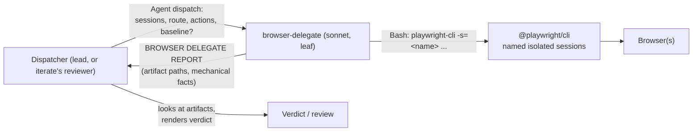
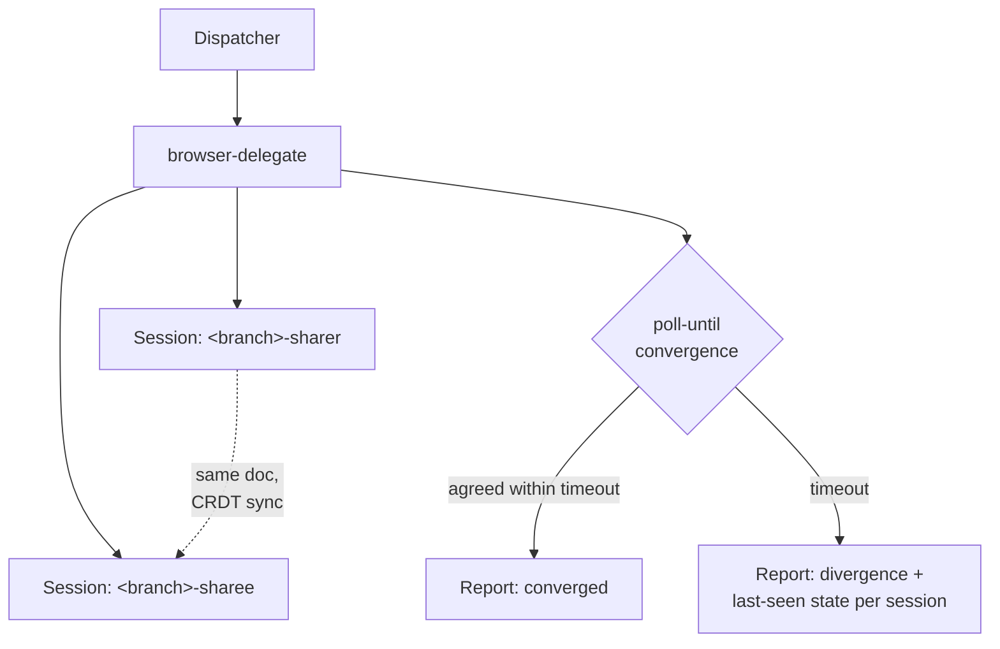

---
first_authored:
  by: "@claude-sonnet-5"
  at: 2026-09-17T13:30:00-07:00
task_list: cdocs/browser-delegation
type: proposal
state: live
status: review_ready
tags: [architecture, browser, delegation, mcp, model_tiering, testing]
last_reviewed:
  status: accepted
  by: "@claude-opus-5-5"
  at: 2026-10-07T18:42:06-07:00
  round: 5
---

# Browser Delegation Plugin: a sonnet-tier delegate for browser driving, UI capture, and multi-client sync testing

> BLUF: A Claude Code-only plugin, `browser-delegate`, ships one `bash-runner`-shaped agent: a sonnet leaf that drives `@playwright/cli` named sessions and returns a fixed report of artifact paths and mechanical facts.
> It never renders verdicts or writes devlogs.
> Under `/cdocs:iterate` the reviewer dispatches it, so its artifacts count as reviewer-produced, and the reviewer copies the screenshots it cites into `cdocs/_media/` and embeds them.
> One delegate drives N sessions for sync tests, and Phase 1 spikes settle pinning guidance and session isolation.

## Summary

Two reports ([delegation approaches](../reports/2026-09-17-browser-delegation-approaches.md), [isolation and parallelization](../reports/2026-09-17-browser-isolation-parallelization.md)) establish the groundwork.
The framing that resolves most of the design space: delegation is about who holds the tool-call loop, not which protocol is in play, and isolation is about which primitive gives each agent a distinct browser identity without new container-level infrastructure.

This proposal commits to:

1. **One agent, `browser-delegate` (sonnet), in a new sibling plugin.**
   Agent-only, dispatched directly like `bash-runner`: a "Prompt with:" description, a fixed report, a scratch artifact directory under `$TMPDIR`, no `Agent` tool (a leaf), no skills, no rules files.
2. **`@playwright/cli` as the driving tool**, for its native named, isolated sessions and because it keeps browser tools out of the lead's tool pool.
3. **Evidence, not verdicts.**
   The report has no verdict field.
   Within `/cdocs:iterate`, the reviewer dispatches the delegate and cites its artifacts as its own.
4. **The dispatcher owns all durable state.**
   The delegate writes only to scratch and reports session facts (names, routes, re-opens).
   The dispatcher (in iterate, the reviewer) records what it wants, and copies only the screenshots it cites into `cdocs/_media/`, embeds them in its review or devlog, and commits them by exact path with that doc.
5. **Claude Code only.**
   No OpenCode build changes, and nothing in the design depends on OpenCode.

## Objective

Let opus/fable leads delegate browser driving, UI capture, and multi-client sync-test driving to a cheaper agent, without the lead holding the browser tool-call loop itself, and without depending on weftwise's recurring `@playwright/mcp` version-pin regression class (three incidents in 2026: 2026-01-18, 2026-05-18/24, 2026-07-25).

### Scope (v1)

- A new clauthier plugin, `browser-delegate`, sibling to `cdocs`, registered in `.claude-plugin/marketplace.json`.
- One agent that drives a browser via `@playwright/cli` and returns captured artifacts plus a fixed-format mechanical report.
- Multi-client driving: one delegate drives N named sessions in one dispatch.
- Usage guidance (dispatch shape, toolset complements, iterate integration) in the plugin README and the agent's description.
- A one-clause clarification to `/cdocs:iterate`'s `confirmed` row so reviewer-dispatched artifacts unambiguously count.
- A one-clause `reviewer.md` change so the reviewer commits the `cdocs/_media/` evidence it embeds alongside its review.

### Non-Goals (v1)

- **No verdict logic.**
  The delegate captures, and visual and design judgment belongs to whoever consumes the artifacts.
- **No skills, no plugin rules files.**
  Plugins cannot ship rules natively ([#14200](https://github.com/anthropics/claude-code/issues/14200)), so a lead-facing rules file would never reach the lead.
  The agent body and README carry everything.
- **No OpenCode target.**
  `scripts/build-opencode.ts` builds one named plugin (`npm run build:cdocs`), and this plugin is not added to it.
  No part of the design assumes OpenCode exists.
- **No non-Claude model path.**
  Model choice stays entirely with the dispatcher and the reviewer: the delegate runs as `model: sonnet`, and the plugin hosts no gateway or direct-API path to another provider.
- **No fixer/auto-patch persona.**
  "Minor UI tweaking" stays in the existing implement/review loop (D3).
- **No A2A surface** (D4).
- **No change to a consumer's server-side test parallelization.**
  weftwise's `workers: 1` / shared-dev-server serialization is a server-state problem, not a browser problem.
- **No change to weftwise's `@playwright/mcp` version pin.**
  It defends a real failure class, and this plugin only avoids depending on it.

## Background

- [Delegation approaches report](../reports/2026-09-17-browser-delegation-approaches.md) (Report A): an MCP server does not by itself move the tool-call loop off the lead.
  It surveys `@playwright/mcp`, `chrome-devtools-mcp`, the first-party browser-use tool, Playwright's Planner/Generator/Healer, and browser-use/Stagehand.
- [Isolation and parallelization report](../reports/2026-09-17-browser-isolation-parallelization.md) (Report B): Playwright's maintainers closed the "one MCP server, many sessions" request and pointed at `playwright-cli` ([microsoft/playwright#40585](https://github.com/microsoft/playwright/issues/40585)).
  `@playwright/cli` ships named isolated sessions for coding agents, and lace's port/mount assignment is container-feature-scoped, so session naming should mirror weftwise's `portless`/`worktree.sh` branch-derived pattern.
  > NOTE(opus-5-5/browser-delegation): Report B's claim that MCP tools do not reach nested subagents is contradicted by the [subagents feature breakdown](../reports/2026-09-19-claude-code-subagents-feature-breakdown.md) §8 (subagents inherit all parent MCP tools by default, background subagents included) and by `mcp__playwright__browser_click` appearing in a sampled subagent transcript (`plugins/cdocs/skills/ablate/SKILL.md`). This design does not rely on it.
- [Delegate model comparison](../reports/2026-09-17-delegate-model-comparison.md): benchmark evidence on driving, visual judgment, and CSS-fix legs cuts in different directions by task (Gemini 3.5 Flash leads Claude 4.7 Opus on MT-Web2Code; Claude Sonnet 4.5 leads multi-round on 1D-Bench; every tier catches under half of DiffSpot's defects).
  Its decisive fact for this proposal: Claude Code's `model:` is Anthropic-only, so a non-Claude model needs a session-wide gateway or a direct API call from tool code.
  Driving stays sonnet in v1.
  The visual-model choice belongs to the reviewer leg, outside this plugin.
- [Subagents feature breakdown](../reports/2026-09-19-claude-code-subagents-feature-breakdown.md): MCP inheritance (§8), nesting depth of 3 layers below main with `Agent` removed at the limit (§10), and plugin agents ignoring `hooks`, `mcpServers`, and `permissionMode` (§13).
- [`plugins/cdocs/agents/bash-runner.md`](../../plugins/cdocs/agents/bash-runner.md): the dispatch and report shape this agent mirrors, including the `${TMPDIR:-/tmp}/claude-$(id -u)` scratch path.
- [`/cdocs:iterate`](../../plugins/cdocs/skills/iterate/SKILL.md) Turn N.b and the Iteration Log's `review_proof`: a `confirmed` row requires this round's reviewer to re-run the floor and cite an artifact it produced.
- [Nested subagent workflows](2026-10-06-nested-subagent-workflows.md): subagents dispatch subagents freely within the platform limit, and leaves are leaves because their `tools:` omit `Agent`.
- cdocs rules: `workflow-patterns.md` "Model Tiering" (sonnet for mechanical/search-tier work), `overseers.md` "Stay thin" (named subagents resumed with `SendMessage`, fresh-subagent handoff past ~400K context), `tool-use-safeguards.md` "One writer per file".
- weftwise `scripts/playwright-mcp-launch.sh` / `.mcp.json`: the baseline this design avoids depending on, which pins `@playwright/mcp@0.0.78` to one `chromium_headless_shell` binary in lockstep with `.devcontainer/Dockerfile`, with a single global browser context and no `--isolated`/`--user-data-dir`.

## Proposed Solution

### Architecture



The dispatcher never calls a browser tool.
It dispatches `browser-delegate` with sessions, a route, actions, and an optional baseline image, and reads back a fixed report.
The delegate pays the per-action context, and the dispatcher pays one dispatch and one report.

### The agent

`plugins/browser-delegate/agents/browser-delegate.md`, frontmatter modeled on `bash-runner`:

```yaml
name: browser-delegate
model: sonnet
effort: medium
description: |
  Drive one or more named @playwright/cli browser sessions, capture artifacts, and return a fixed-format report with no verdict.
  Prompt with:
  - Sessions: one or more roles (e.g. sharer, sharee); names default to <sanitized-branch>-<role>
  - Route(s) per session
  - Actions (navigate, click, type, wait-for, screenshot, snapshot, poll-until)
  - Optional: one baseline image and the screenshot to diff against it; convergence condition and timeout
  - Optional: fresh sessions (close any live session of that name, then open), required for independent verification; an iterate reviewer uses it with `<branch>-review-<role>` names
  Responds with artifact paths and mechanical facts only. Prefer it over driving a browser MCP yourself.
tools: Bash, Read
maxTurns: 40
```

The body holds everything the agent needs, and reads no rules files:

- **Workflow.**
  Resolve the CLI to an absolute command: global `playwright-cli`, or the project-local `playwright cli` if Phase 1 prefers it (if neither: `Status: FAILED` with the fact, no fallback).
  Resolve the baseline and any other prompt-supplied path to an absolute path against the starting cwd, before any `cd`.
  If a baseline was given, also check ImageMagick `compare` (if absent: `Status: WARNINGS` with the fact, and no diff).
  Use a stable scratch root and a per-dispatch output dir: `d="${TMPDIR:-/tmp}/claude-$(id -u)/browser-delegate"; mkdir -p "$d"; out=$(mktemp -d "$d/run.XXXXXX")`.
  Run every CLI command from `cd "$d"`, so the CLI's auto-snapshots (`.playwright-cli/`) and config lookup stay out of the dispatcher's worktree, and pass `--filename=$out/<name>` to every screenshot and snapshot.
  Take liveness at dispatch start from `playwright-cli list`, then open or reuse each named session (for fresh sessions, close any live one of that name first), run the actions, and, if a baseline was given, run `compare -metric AE` on that one baseline/candidate pair (a size mismatch is reported as a fact, not diffed, and `compare` exiting 1 means the images differ, not a failure).
  Leave artifacts in place: they are what the dispatcher cites.
- **Session naming.**
  Default name: current branch, with characters outside `[A-Za-z0-9_-]` replaced by `-` (`feature/foo` becomes `feature-foo`), suffixed `-<role>`.
  A prompt-supplied name wins.
  A session that dies during the dispatch is re-opened under the same name, never replaced by an unnamed default, and reported as `reopened`.
- **Convergence.**
  For a `poll-until` condition across sessions, poll shared/awareness state at a fixed interval until every session agrees or the timeout elapses (mirroring weftwise's `e2e/livesharing/convergence.spec.ts`).
  The poll runs inside one Bash invocation, a shell loop over `playwright-cli -s=<name> eval ...` per session bounded by the timeout, printing only the final states, so it costs one turn and little context.
  That Bash call sets its tool `timeout` above the convergence timeout (120s default, 600s maximum), so the convergence timeout is capped below 600s, and a larger requested timeout is reported as a fact naming the cap.
  A timeout is reported as divergence with each session's last-seen state, never as success.
- **No judgment.**
  Report what happened (loaded, selector found, text present, AE score), never whether the render looks right.

`tools: Bash, Read`: the CLI writes its own artifacts, so `Write` and `Edit` are omitted, signaling that the delegate edits nothing.
Bash can still write files, so this is intent, not enforcement: the prompt and report shape carry the rest.
No `Agent` tool keeps it a leaf.

### Report format

The agent's final message is only this plain-text report:

```
BROWSER DELEGATE REPORT
Sessions: <name> (role: <role>, route: <url>, opened | reused | reopened) [one line each]
Status: OK | FAILED | WARNINGS
Artifacts: <abs path> (<screenshot | snapshot | diff>) [one line each]
AE score: <n> (<candidate abs path> vs <baseline abs path>) | size mismatch <WxH> vs <WxH> | n/a
Facts:
- <mechanical fact>: <yes | no | value>
- converged: yes after <n>s | no, timed out at <n>s; last-seen <session>: <state>
Truncated: none | <what was omitted>; see: <path>
```

There is no field a verdict could go in (D6).
Each state is what one dispatch can observe: `opened` means no live session at dispatch start (or one closed first because the prompt asked for fresh sessions), `reused` means live at dispatch start, and `reopened` means the session died during this dispatch and was re-opened empty.
A dispatcher that expected continuity reads `opened` as lost state.
The `Sessions` lines are the role-to-session registry: a dispatcher that wants it durable copies it into its own devlog.

### Iterate integration

When a `/cdocs:iterate` verification floor needs browser evidence, the round's reviewer dispatches `browser-delegate` itself, looks at the returned artifacts, and cites their paths in its review.
Artifacts from a delegate the reviewer dispatched this round count as reviewer-produced for a `confirmed` row, and artifacts from an implementer's or earlier round's delegate do not.
Phase 3 adds that clause to the `confirmed` row in `plugins/cdocs/skills/iterate/SKILL.md`, where iterate defines admissibility (Turn N.b already points there), so the rule reads unambiguously without this plugin's context.

The reviewer always names its sessions `<branch>-review-<role>` and dispatches with the fresh-sessions option.
The suffix keeps implementer and reviewer from sharing a session in either direction: the reviewer never lands in the implementer's browser, and the implementer's next round never lands in the reviewer's.
The fresh-sessions option closes any review-suffixed session left live by a previous round's review and opens it new, and it never touches the implementer's sessions.
Its report must list each session as `opened`, and a `reused` session never backs a `confirmed` row.
The reviewer learns this from the option's line in the agent description, which is in its Agent tool listing, so the rule reaches it at runtime without the README.

Evidence has two parts, so it outlives scratch and survives worktrees:
- **Textual audit trail.** The review inlines the report's `Sessions`, `Facts`, and `AE score` lines (so the `opened` requirement stays auditable) plus the reviewer's own description of what the artifact shows.
- **Cited screenshots.** The reviewer copies each screenshot its verdict relies on from scratch to `cdocs/_media/YYYY-MM-DD-<description>.png` (the cdocs media convention, `frontmatter-spec.md` "Media"), embeds it in the review, and commits it with the review by exact path.
  Uncited captures stay in scratch.

One writer per file holds: the delegate writes only to scratch, and the reviewer alone writes the `_media/` copies and the review that embeds them.
Phase 3 adds the one clause `reviewer.md` needs for this to its commit rule.

Depth: under a top-level overseer the reviewer is layer 1 and the delegate layer 2, and a nested overseer ([nest-overseers RFP](2026-10-06-nest-overseers-rfp.md)) puts the delegate at layer 3, the default limit, which is fine for a leaf.
Under a nested overseer, any wrapper agent between the reviewer and the delegate pushes the delegate past the limit, so fan-out to multiple delegates is always done by the dispatcher directly, never by an intermediate agent.

Outside iterate, any agent can dispatch the delegate and review the artifacts however it likes: the plugin has no dependency on cdocs.

### Multi-client sync testing



The default is one delegate driving N named sessions: it sequences cross-client actions ("sharer types, then sharee reads") in one context, which separate delegates cannot do without a coordination channel.
Separate delegates, dispatched in parallel by the dispatcher, are for genuinely independent driving (two worktrees, unrelated flows) only.

This is additive to weftwise's existing patterns:

- **CI-style regression coverage** keeps using a single Playwright script driving N `browser.newContext()`s, the cheapest correct unit for fixed flows.
  Fixing weftwise's `createIsolatedContext` to stop pairing an unnecessary `chromium.launch()` with each `newContext()` is a recommended weftwise-side change, not a plugin deliverable.
- **`qa-up`'s human-in-the-loop flow** (Electron client via `PW_CLIENT_ACTION` plus a human at the host browser) gets an agent-drivable browser side: a named session on the same portless route, driven by a delegate instead of a human.

### Session reuse across turns

`@playwright/cli` sessions outlive the process addressing them, so a new delegate dispatch resumes the same browser by name while the session lives.
For a long multi-step flow, the dispatcher may keep one named delegate and resume it with `SendMessage` (`overseers.md` "Stay thin"), which retains the agent's step context.
Past that rule's ~400K context threshold, the dispatcher dispatches a new delegate on the same session names with the remaining steps in its prompt: the browser state carries over, so no handoff file is needed.
Profiles are in-memory by default and a headless session shuts down after an hour idle, so a dispatch past that window finds no live session and reports `opened` with empty cookies and storage, which the dispatcher reads as lost state.
Long flows pass `--idle-timeout=<ms>` at open, and `--persistent` stays out of the default because on-disk profiles would weaken isolation.

### Plugin files

| Path | Role |
|---|---|
| `.claude-plugin/marketplace.json` | Add a `browser-delegate` entry (`source: ./plugins/browser-delegate`). |
| `plugins/browser-delegate/.claude-plugin/plugin.json` | Plugin manifest. |
| `plugins/browser-delegate/agents/browser-delegate.md` | The agent: frontmatter above, with a body holding workflow, session naming, convergence, report format. |
| `plugins/browser-delegate/README.md` | Install, dispatch examples, the toolset complements table, iterate integration (reviewer uses `<branch>-review-<role>` names with the fresh-sessions option, inlines the report's `Sessions`/`Facts`/`AE score` lines, copies cited screenshots to `cdocs/_media/` and embeds them), multi-client guidance. |
| `plugins/cdocs/skills/iterate/SKILL.md` | One clause on the `confirmed` row: an artifact produced by a subagent the reviewer dispatched this round counts as its own. |
| `plugins/cdocs/agents/reviewer.md` | One clause on the commit rule: the review commit also includes the `cdocs/_media/` evidence the review embeds. |

Example dispatch (Agent tool, `subagent_type: "browser-delegate:browser-delegate"`):

```
Sessions: preview
Route: https://<branch>.weftwise.localhost:1355/settings
Actions: navigate; wait-for #settings-panel; screenshot full-page
Baseline: cdocs/_media/2026-09-10-settings-mock.png (diff the full-page screenshot)
```

## Important Design Decisions

### D1: A separate agent, not an extension of `reviewer`

`reviewer` exists to produce a trustworthy verdict and edits only `last_reviewed` frontmatter.
The delegate produces evidence: different tools, different job.
Keeping evidence-gathering in a leaf the reviewer dispatches preserves the reviewer's single purpose while still letting it own the evidence for `review_proof`.
It also keeps the same verifier/fixer split Report A recommends for any future fixer, one layer earlier.

### D2: `@playwright/cli` over `@playwright/mcp`

Reachability is not the reason: subagents inherit the parent's MCP tools by default, so a delegate could drive `@playwright/mcp`.
The reasons, in order of weight:

1. **Native named, isolated sessions.**
   `playwright-cli -s=<name>` (or `PLAYWRIGHT_CLI_SESSION=<name>`) addresses an isolated browser.
   `list`, `close-all`, and `kill-all` manage the set, and `show` opens a dashboard for human oversight.
   `@playwright/mcp` has no equivalent, and its maintainers point at `playwright-cli` for multi-session use.
2. **The lead is not invited to drive.**
   Plugin agents ignore `mcpServers`, so the plugin cannot give its agent a private inline Playwright server.
   Using MCP means configuring it at the session level, which puts its tools in the lead's pool and invites the lead to drive directly.
   The context cost is small, since MCP tools are deferred by default and the lead pays for tool names rather than full schemas, but the invitation remains.
   A CLI adds nothing to any agent's tool list.
3. **The version-pin regression class, possibly.**
   `@playwright/cli` likely bundles its own `playwright-core`, so it may share `@playwright/mcp`'s `channel: "chrome-for-testing"` crashpad/SIGTRAP exposure.
   Phase 1 spikes it, and the result gates README pinning guidance only.
   If it shares the risk, the plugin still adopts the CLI on points 1 and 2, and the README documents the same pin-and-track discipline weftwise applies to `@playwright/mcp`.

`chrome-devtools-mcp` and `@playwright/mcp` remain complements, documented in the README, for network/performance traces, accessibility-tree-driven test authoring, or a lead-held interactive session.
The delegate never silently substitutes them.
The first-party browser-use tool is the strongest long-term candidate to retire the pin-and-regress class (nothing to pin), but its GA status and in-harness availability are secondary-sourced only, so it is a Phase 1 check and a Phase 5 promotion, not the v1 default.

### D3: Fixer persona deferred entirely

Report A lays out three tiers of "minor UI tweaking": locator repair (Playwright's Healer), a genuine visual fix (belongs in implement/review), and a trivial auto-patch (scope creep against the reviewer/implementer split).
v1 takes none, including the narrowest, because the Healer's `claude` integration mode is search-verified only.
Primary-verifying it is the prerequisite for Phase 5's fixer item.

### D4: Named-subagent reuse in v1, A2A only for cross-harness needs

A2A's selling point (cross-process, cross-org task lifecycle) does not describe this problem: every dispatch is inside one Claude Code session.
`overseers.md` "Stay thin" already gives a browser agent the dispatcher converses with across turns.
A2A becomes relevant only if a consumer wants to hand browser work to a non-Claude-Code agent or a hosted browser-agent service.

### D5: Session naming mirrors `portless`/`worktree.sh`, not `.lace/*-assignments.json`

`.lace/port-assignments.json` and `.lace/mount-assignments.json` allocate per devcontainer feature at build time from a project-wide range: the wrong granularity for a per-worktree browser identity.
`portless` + `worktree.sh` solve that at runtime with a branch-derived name, and `@playwright/cli` sessions need no port, so no lace feature is needed.
A host-visible `playwright-cli show` dashboard is the one place a lace-managed port might matter, and it is Phase 5 future work.

### D6: No verdict by construction of the report

The report format has artifact paths and mechanical facts and no verdict-shaped field, so a consumer has nothing to over-trust.
This is the `bash-runner` pattern: a fixed report the dispatcher can parse, with interpretation left to the dispatcher.

### D7: Agent-only, no skills or rules

A skill wrapper would add a second entry point that only forwards arguments to the agent, and `bash-runner` shows the agent description alone is a sufficient dispatch contract.
Plugin rules files would not reach the lead ([#14200](https://github.com/anthropics/claude-code/issues/14200)), and the agent's own guidance fits in its body.
Lead-facing toolset guidance belongs where a lead looks when choosing a tool: the agent description (one line) and the README.

## Edge Cases

- **`@playwright/cli` shares the SIGTRAP/channel-pin risk.** The CLI is still adopted (D2 points 1 and 2), and the README documents pinning.
- **Neither the global nor the project-local CLI resolves.** The delegate reports `Status: FAILED` with that fact and an install hint, and stops.
  The dispatcher may choose to drive an MCP server itself.
  > WARN(opus-5-5/browser-delegation): That fallback re-incurs the per-step lead context this plugin exists to avoid: it is a dispatcher decision, never something the delegate does silently.
- **A named session dies.** During a dispatch, it is re-opened under the same name and reported as `reopened`.
  Between dispatches (closed, or idle past an hour), the next dispatch reports `opened`, and a dispatcher that expected continuity treats that as lost state.
- **Two dispatches target the same session name.** The dispatcher keeps one live delegate per session name, the session analog of `tool-use-safeguards.md` "One writer per file": serialize, or give the second a different role suffix.
- **Convergence never completes.** Reported as divergence with each side's last-seen state at the timeout.
- **An implementer's delegate artifacts are offered as proof.** They are third-party to the reviewer and do not make a `confirmed` row, so the reviewer dispatches its own on `<branch>-review-<role>` names with the fresh-sessions option.
- **No cdocs installed.** The delegate works the same, and the dispatcher reviews the artifacts by whatever means it has.

## Test Plan

- **MCP-inheritance current-behavior check.** From a session with a Playwright MCP server configured, dispatch a subagent and record whether `mcp__playwright__*` tools appear in its pool (transcript `tool_use` names or its tool list); from a session without one, confirm `browser-delegate` drives via the CLI.
  The design does not depend on the first result: it records current behavior so D2 stays honest.
- **Named-session isolation.** Two concurrent sessions with distinct names against the same route (one delegate, and separately two delegates from two worktrees): confirm no shared cookies or localStorage, per `playwright-cli list` and a set-then-read probe.
- **SIGTRAP/crashpad spike (Phase 1, gating).** `playwright-cli open <url>` (headless by default) in the target devcontainer, checking stderr and process exit, not just the exit code.
- **Report contract.** Every dispatch returns a report that parses against the format above, with absolute artifact paths that exist, and no verdict language.
- **Baseline diff.** One dispatch with a baseline returns an `AE score` line naming both paths, and one with a differently sized baseline reports the size mismatch.
- **Session states.** A second dispatch on a live name reports `reused`, and the same dispatch with the fresh-sessions option reports `opened`.
  `playwright-cli -s=<name> close` between dispatches, then re-dispatch: `opened`.
  `playwright-cli -s=<name> close` from another shell during a dispatch's `wait-for`: `reopened` (not `kill-all`, which ends every session on the host).
- **Worktree hygiene.** After a dispatch, the dispatcher's worktree has no new `.playwright-cli/` or other untracked files: the delegate writes only to scratch.
- **Iterate `review_proof`.** Run one iterate round whose floor needs a browser, after the implementer has driven the same route: the reviewer dispatches on `<branch>-review-<role>` names with the fresh-sessions option and its delegate reports its sessions as `opened` (not `reused`), the review inlines the report's `Sessions`, `Facts`, and `AE score` lines and embeds the cited screenshot from `cdocs/_media/YYYY-MM-DD-<description>.png`, committed with the review by exact path (uncited captures are not copied), the implementer's sessions are still live and untouched, and the overseer records `confirmed`.
- **Multi-client convergence.** One delegate, two sessions (sharer/sharee) on a real sync-capable route: convergence detected by polling within the timeout, and a forced non-convergence reports divergence, not a pass.
- **Missing CLI.** Make neither the global nor the project-local CLI resolve: the delegate reports `FAILED` and does not fall back.

## Verification Methodology

Run the real flows against a real target, with the TDD posture of this repo's wezterm workflow: capture a baseline, make the change, check the actual output, and diff rather than trusting a clean-looking run.

1. Record a confirmed/denied verdict for each Phase 1 item before any later phase relies on it.
2. Dispatch the scaffolded agent against a local route (weftwise's dev server if available, otherwise a local static page) and open the returned artifacts to confirm they show what the facts claim.
3. Run the iterate round end to end and read the Iteration Log row.
4. Run multi-client against a real sync-capable route if one is available, otherwise record the gap rather than simulating convergence.

## Implementation Phases

### Phase 1: Spikes (gate README guidance, CLI resolution, and session naming only)

- `@playwright/cli` SIGTRAP/crashpad exposure in the target devcontainer(s).
- Named-session isolation sufficiency: `-s=<name>` alone isolates two concurrent sessions (two roles in one delegate, and two worktrees).
  Also record whether session names are scoped by cwd or workspace (the `show` dashboard groups sessions by workspace), and confirm the agent's fixed `cd "$d"` keeps reuse-by-name working across dispatches.
- Session liveness: whether a command against a non-live session name errors or auto-opens a new browser, and how `list` reports live and dead sessions.
  If commands auto-open, the delegate cannot see a mid-dispatch death, and `reopened` detection needs another signal.
- CLI resolution: whether the delegate should prefer a project-local `npx --no-install playwright cli` (which inherits the project's existing Playwright pin, as in weftwise) over a global `playwright-cli`, resolved to an absolute command before the `cd`.
  Also record whether the project's `.playwright/cli.config.json` is needed (for example for a pinned `channel` or `executablePath`), and if so pass it with `--config <abs path>`.
  The answer is folded into the availability check.
- First-party browser-use tool: primary-verify GA status and runtime availability in the target harness/devcontainer against `platform.claude.com`'s docs.
- MCP-inheritance current-behavior check (Test Plan).
- Success: one confirmed/denied line per item, with any fallback a later phase actually uses.
- Depends on: nothing.
  The scaffold may proceed in parallel, and only README pinning wording, CLI resolution, and (if isolation fails) session naming wait on this phase.

### Phase 2: Plugin scaffold and the agent

- Add the marketplace entry, `plugin.json`, `agents/browser-delegate.md`, and `README.md` per the file table.
- Agent body: CLI resolution and availability check, scratch root and `--filename` captures, session naming and sanitization, the fresh-sessions option, re-open handling, action vocabulary, single-pair AE diff, bounded poll loop, report format.
- README: dispatch examples, toolset complements (D2), pinning note per Phase 1, iterate integration (reviewer uses `<branch>-review-<role>` names with the fresh-sessions option, inlines the report's `Sessions`/`Facts`/`AE score` lines, copies cited screenshots to `cdocs/_media/` and embeds them), multi-client guidance.
- Success: a dispatch from a session with no Playwright MCP server produces a named session, a saved screenshot, an `AE score` against a supplied baseline, and a report matching the format, verified by opening the artifacts.
- Constraints: no skills, no `rules/`, no changes to `scripts/build-opencode.ts` or any OpenCode artifact.
- Depends on: Phase 1 for README pinning wording and CLI resolution, and for session naming if the isolation spike fails.

### Phase 3: Iterate integration

- Add the one-clause `confirmed` clarification to `plugins/cdocs/skills/iterate/SKILL.md`.
- Add the one-clause commit-rule change to `plugins/cdocs/agents/reviewer.md`: "Commit your review file, plus the `cdocs/_media/` evidence it embeds (and the reviewed doc's `last_reviewed` ...), by explicit path".
- Success: an iterate round with a browser floor ends with a `confirmed` row citing an artifact from a delegate the reviewer dispatched on `<branch>-review-<role>` names with the fresh-sessions option, whose inlined `Sessions` line reports `opened`, and whose cited screenshot is embedded from `cdocs/_media/` in the committed review.
- Constraints: no cdocs agent or skill changes beyond these two clauses (`reviewer.md` already has `tools: "*"`).
- Depends on: Phase 2.

### Phase 4: Multi-client driving and convergence

- Exercise N-session dispatches and `poll-until` convergence against a real sync-capable route, adjusting the agent body's action vocabulary as needed.
- Success: convergence detected within a bounded timeout, and forced non-convergence reports divergence.
- Depends on: Phase 2.
  Independent of Phase 3.

### Phase 5: Deferred (tracked, not built)

- **Fixer persona** (Healer-based locator repair, a distinct agent), gated on primary-verifying the Healer's `claude` integration (D3).
- **A2A surface**, gated on a real cross-harness delegation need (D4).
- **First-party browser-use tool as default**, if Phase 1 confirms availability, as a follow-up proposal.
- **Host-visible `playwright-cli show` dashboard port** (D5).
- **R1-R6 visual-review discipline** from the [pixel-grounding handoff report](../reports/2026-08-04-visual-review-gaps-and-pixel-grounding-handoff.md) would sharpen how reviewers judge delegate artifacts; it is a cdocs reviewer change, independent of this plugin.

## Assumptions Needing Confirmation

- **`@playwright/cli` SIGTRAP/channel-pin exposure.** Unconfirmed in either report, spiked in Phase 1.
  Affects only D2 point 3 and README pinning guidance.
- **Named-session isolation sufficiency.** Report B's isolation question concerned `@playwright/mcp`'s location-derived profile default, whereas the CLI isolates by explicit name, so this is a narrower, CLI-specific check.
  Phase 1, gating D5's isolation claim and, if it fails, the agent's session naming.
- **First-party browser-use tool GA and in-harness availability.** Existence and behavior are primary-verified, but GA date and devcontainer availability are secondary-sourced (Report A).
  Gates Phase 5's promotion only.
- **Playwright Healer's `claude` integration (v1.56+).** Search-verified only.
  Gates Phase 5's fixer only.

## Open Questions

- What dispatch round-trip count makes an exploratory loop (a lead refining actions across several dispatches) costlier than the lead driving directly?
  v1 dispatches are bounded and single-shot, but an iterative loop re-approaches lead-holds-the-loop at dispatch granularity.
- Should Phase 2's scaffold wait for Phase 1, or is parallel work (as planned) worth the risk of README rework?

## Links

- [Delegation approaches report](../reports/2026-09-17-browser-delegation-approaches.md)
- [Isolation and parallelization report](../reports/2026-09-17-browser-isolation-parallelization.md)
- [Delegate model comparison report](../reports/2026-09-17-delegate-model-comparison.md)
- [Subagents feature breakdown](../reports/2026-09-19-claude-code-subagents-feature-breakdown.md)
- [`plugins/cdocs/agents/bash-runner.md`](../../plugins/cdocs/agents/bash-runner.md)
- [`plugins/cdocs/skills/iterate/SKILL.md`](../../plugins/cdocs/skills/iterate/SKILL.md)
- [Nested subagent workflows](2026-10-06-nested-subagent-workflows.md)
- Playwright MCP multi-session request (closed, maintainer points at `playwright-cli`): [microsoft/playwright#40585](https://github.com/microsoft/playwright/issues/40585)
- `microsoft/playwright-cli`: [github.com/microsoft/playwright-cli](https://github.com/microsoft/playwright-cli)
- Plugin-native rules request: [anthropics/claude-code#14200](https://github.com/anthropics/claude-code/issues/14200)
