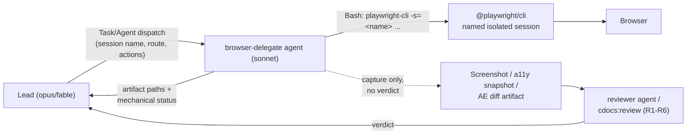
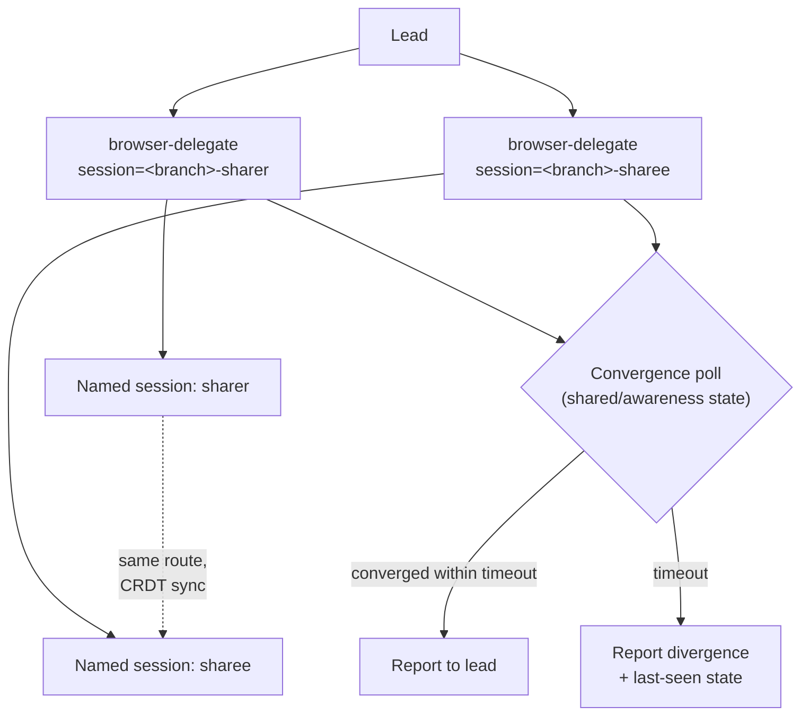

---
first_authored:
  by: "@claude-sonnet-5"
  at: 2026-09-17T13:30:00-07:00
task_list: cdocs/browser-delegation
type: proposal
state: live
status: review_ready
tags: [architecture, browser, delegation, mcp, model_tiering, testing, future_work]
last_reviewed:
  status: accepted
  by: "@claude-sonnet-5"
  at: 2026-09-17T15:10:00-07:00
  round: 1
---

# Browser Delegation Plugin: a sonnet-tier delegate for browser driving, UI verification, and multi-client sync testing

> BLUF: New sibling plugin `browser-delegate` gives opus/fable leads a sonnet-tier subagent that drives browsers so the lead never touches one directly. The delegate's driving/capture leg defaults to `@playwright/cli` (Bash-invoked, subagent-safe, named isolated sessions), not the version-pin-fragile `@playwright/mcp`. Visual verdicts stay entirely with cdocs's existing R1-R6 discipline and `reviewer` agent: this plugin adds no new judgment logic. v1 ships drive+capture+verdict-handoff and named-session multi-client coordination; a fixer persona and any A2A surface are explicitly deferred. Three facts this design leans on are unconfirmed and gated behind a Phase 1 spike before they affect any default.

## Summary

Two Sonnet reports (`cdocs/reports/2026-09-17-browser-delegation-approaches.md`, `cdocs/reports/2026-09-17-browser-isolation-parallelization.md`) established the groundwork this proposal turns into a shippable plugin surface. The framing that resolves most of the apparent design space: delegation is about who holds the tool-call loop, not which protocol is in play, and isolation is about which primitive gives each agent/worktree a distinct browser identity without inventing new container-level infrastructure.

This proposal commits to:

1. **A new agent, `browser-delegate` (sonnet-tier), distinct from cdocs's `reviewer`.** It drives and captures; it never judges design correctness. The `reviewer` agent (and the R1-R6 discipline behind it) stays the sole verdict layer, unmodified.
2. **`@playwright/cli` as the default driving/capture tool**, specifically because it is a CLI (works inside subagents, which MCP tools do not) and ships named, isolated sessions as a first-class primitive.
3. **A worktree/branch-derived session-naming convention**, mirroring weftwise's own `portless`/`worktree.sh` pattern rather than `.lace/port-assignments.json`'s container-feature-level scope.
4. **A lean v1**: drive, capture, verdict-handoff, and named multi-session coordination for sync testing. No fixer persona, no A2A surface, no changes to any consumer's server-side test parallelization.

## Objective

Let opus/fable leads delegate browser driving, UI capture, and multi-client sync-test coordination to a cheaper agent, without the lead ever holding the browser tool-call loop itself, and without inheriting weftwise's recurring `@playwright/mcp` version-pin regression class (three incidents in 2026: 2026-01-18, 2026-05-18/24, 2026-07-25).

### Scope (v1)

- A new clauthier plugin, `browser-delegate`, sibling to `cdocs`.
- One delegate agent that drives a browser via CLI and returns captured artifacts plus a mechanical status report.
- Skills for a lead to invoke a single delegate session and to coordinate 2+ named sessions for multi-client sync testing.
- A session-naming/isolation rule mirroring `portless`/`worktree.sh`'s branch-derived pattern.
- A toolset-selection rule naming the default and the complements, with unconfirmed facts explicitly gated.
- Explicit handoff into cdocs's existing R1-R6 verdict discipline where cdocs is installed, and a documented degradation path where it is not.

### Non-Goals (v1)

- **No fixer/auto-patch persona.** "Minor UI tweaking" stays in the existing implement/review loop. Locator-repair-only wrapping of Playwright's Healer is a named future item (Implementation Phases, Phase 5), gated on primary-verifying its `claude` integration claim.
- **No A2A surface.** Session reuse across lead turns uses the durable-specialist pattern (`orchestration-discipline.md` Pillar 3), not a second protocol. A2A is named as a documented future escalation for genuine cross-harness/cross-org delegation, not built here.
- **No change to a consumer's server-side test parallelization.** weftwise's `workers: 1` / shared-dev-server serialization is a server-state problem, not a browser problem; out of scope, acknowledged, not designed against.
- **No change to the `@playwright/mcp` version pin.** It defends a real, three-times-recurring failure class; this plugin does not touch it, only avoids depending on it for the delegate's default path.
- **No new verdict logic.** Every visual/design judgment this plugin's output feeds goes through the existing `reviewer` agent and R1-R6 discipline unmodified.
- **No cross-repo rule-materialization machinery.** Unlike cdocs's `/cdocs:init` + `AGENTS.md`/`.opencode/rules` delivery (a different problem: injecting discipline into arbitrary consumer repos), this plugin's rules ship as ordinary plugin `rules/*.md` files, read by the delegate agent the same way `reviewer.md` reads cdocs's rules today (relative path first, plugin-root fallback).

## Background

- [Delegation architectures report](../reports/2026-09-17-browser-delegation-approaches.md): establishes that an MCP server does not by itself move the tool-call loop off the lead, surveys the toolset landscape (`@playwright/mcp`, `chrome-devtools-mcp`, the first-party browser-use tool, Playwright's built-in Planner/Generator/Healer, browser-use/Stagehand), and recommends reusing the existing R1-R6 visual-review discipline verbatim as the verdict layer.
- [Isolation and parallelization report](../reports/2026-09-17-browser-isolation-parallelization.md): establishes that Playwright's own maintainers closed the "one MCP server, many sessions" request ("start multiple mcp servers or use ... playwright-cli instead"), that `@playwright/cli` ships named isolated sessions built specifically for coding agents, and that lace's port/mount assignment machinery is container-feature-scoped, not per-worktree, so browser session naming should mirror `portless`/`worktree.sh`'s branch-derived pattern instead.
- The pixel-grounding handoff report (`cdocs/reports/2026-08-04-visual-review-gaps-and-pixel-grounding-handoff.md`, cited by Report A) is the origin of the R1-R6 discipline and the tightened `review_proof` contract this plugin's captured artifacts must satisfy. `plugins/cdocs/agents/reviewer.md` is the concrete agent that discipline lives in today.
  > NOTE(claude-sonnet-5/browser-delegation): The pixel-grounding handoff and visual-verification-survey reports are cited by Report A but were not independently re-read for this proposal; the R1-R6 discipline is treated as settled per Report A's characterization and `reviewer.md`'s existing constraints, not re-derived here.
- `plugins/cdocs/agents/reviewer.md`: the reviewer-never-edits-source constraint that motivates keeping this plugin's delegate (drives, captures) structurally separate from any future fixer (patches).
- `plugins/cdocs/rules/model-tiering.md`: the search/explore tier (sonnet default) this plugin's delegate occupies; judgment (the verdict) stays opus-class per the existing `reviewer`/`judge` agents.
- `plugins/cdocs/rules/orchestration-discipline.md` Pillar 3 (Durable Specialists): the resume-by-name pattern this plugin uses for session reuse instead of A2A.
- weftwise `scripts/playwright-mcp-launch.sh` / `.mcp.json`: the concrete baseline this proposal avoids depending on for the delegate's default path. It pins `@playwright/mcp@0.0.78` to one `chromium_headless_shell` binary, in lockstep with `.devcontainer/Dockerfile`, with a single global browser context and no `--isolated`/`--user-data-dir` flag.
- `cdocs/proposals/2026-09-17-graphify-cdocs-integration.md`: the sibling proposal this one mirrors structurally (stateless-tool-first, cross-target degradation reasoning, phased-with-a-conditional-later-phase, a discriminator-style spike gate before default claims harden).

## Proposed Solution

### Architecture: who holds the loop, and with what



The lead never calls a browser tool directly. It dispatches `browser-delegate` with a task description (route, session name, actions, optional baseline image) and reads back a structured report: artifact paths plus mechanical facts (page loaded, selector found, screenshot saved). It does not read back a design verdict, because the delegate does not produce one.

This is the same "who holds the loop" axis Report A names: an MCP server the lead calls directly does not delegate anything, since the lead is still the one driving step by step. A CLI-invoked-via-Bash subagent does, because the subagent (not the lead) pays the per-action context, and the CLI has no MCP-tool-inheritance wall to cross.

### Toolset default: `@playwright/cli`, not `@playwright/mcp`

The delegate's driving/capture leg defaults to `@playwright/cli`, invoked via `Bash`, for three reasons, in order of weight:

1. **It works inside subagents.** MCP tools are connected at the top-level session and are not inherited by nested subagents (Report B, citing weftwise's own `docs/playwright_mcp_usage.md`). A CLI invoked via `Bash` has no such boundary. This alone is close to disqualifying for `@playwright/mcp` as the delegate's tool, independent of the version-pin question.
2. **It has native named, isolated sessions.** `playwright-cli -s=<name> open <url>` or `PLAYWRIGHT_CLI_SESSION=<name>` addresses a specific, isolated browser instance; `list`/`close-all`/`kill-all` manage the set; `show` opens a multi-session dashboard for human oversight. `@playwright/mcp` has no equivalent: Playwright's maintainers closed the "one server, many sessions" request and pointed at `playwright-cli` by name.
3. **It sidesteps the version-pin regression class**, though not by construction: `@playwright/cli` likely bundles its own `playwright-core` the same way `@playwright/mcp` does, so it may be subject to the same `channel: "chrome-for-testing"` crashpad/SIGTRAP risk. This is unconfirmed (see Assumptions Needing Confirmation) and is spiked in Phase 1 before it is trusted as a real advantage rather than an assumed one.

`chrome-devtools-mcp` and `@playwright/mcp` remain named complements, not the default, for cases specifically needing MCP's tool surface: network/performance traces, accessibility-tree-driven deterministic test authoring, or a lead-held (non-delegated) interactive session where subagent-inheritance is not the constraint. Both are called out in `rules/toolset-selection.md` as complements the delegate agent (or the lead directly, for the MCP case) may reach for, not as fallbacks the delegate silently substitutes.

The first-party browser-use tool (`platform.claude.com`'s toolset sibling to computer use) is named as the strongest long-term candidate to retire `@playwright/mcp`'s entire pin-and-regress failure class, since it has no npm package or Chromium revision to pin at all. It is explicitly NOT the v1 default: its GA date and its runtime availability inside a devcontainer/target-harness are secondary-sourced only (Report A), and this design does not want a load-bearing default resting on an unconfirmed fact. Phase 1 spikes availability; if confirmed, promoting it to default is a follow-up revision to this proposal, not something this version commits to.

### Agent/skill surface

New plugin: `plugins/browser-delegate/`, sibling to `plugins/cdocs/`.

| Path | Role |
|---|---|
| `plugins/browser-delegate/.claude-plugin/plugin.json` | Plugin manifest |
| `plugins/browser-delegate/agents/browser-delegate.md` | The delegate: `model: sonnet`, `tools: Bash, Read, Write`. Drives `@playwright/cli`, captures artifacts, writes a structured report. Never judges. |
| `plugins/browser-delegate/skills/drive/SKILL.md` | `/browser-delegate:drive` — lead-facing entry point for a single delegate session: navigate, act, capture, report. |
| `plugins/browser-delegate/skills/sync/SKILL.md` | `/browser-delegate:sync` — coordinates 2+ named sessions (roles, e.g. `sharer`/`sharee`) for multi-client testing; dispatches one `browser-delegate` invocation per role. |
| `plugins/browser-delegate/rules/session-isolation.md` | Session-naming convention (branch-derived, role-suffixed), the role-to-session registry convention, and why this is a `portless`/`worktree.sh`-layer concern, not a `.lace/*-assignments.json` one. |
| `plugins/browser-delegate/rules/toolset-selection.md` | The default/complement/escape-hatch table above, and the explicit "do not assume browser-use-tool availability" gate. |

**Invoking the delegate.** A lead calls `/browser-delegate:drive` with a route, a session name, an action list, and (optionally) a baseline image path for a later visual diff:

```
/browser-delegate:drive session=<branch>-preview route=https://<branch>.weftwise.localhost:1355/settings \
  actions="navigate; wait-for selector=#settings-panel; screenshot full-page" \
  baseline=cdocs/_media/2026-09-10-settings-mock.png
```

The skill dispatches the `browser-delegate` agent, which runs `playwright-cli -s=<branch>-preview open <route>`, performs the actions, saves a screenshot artifact, and (if a baseline was given) runs an ImageMagick `compare -metric AE` pass, per the existing `review_proof` contract's tightened definition. It reports back: artifact paths, the AE score if computed, and mechanical pass/fail facts (did the page load, was the selector found). It does not say whether the render "looks right."

**Verdict handoff.** If a design verdict is needed, the lead (or an overseeing skill) dispatches the existing `reviewer` agent (or a fresh looker per the `cdocs:review` methodology) against the captured artifact, exactly as it would against any other `review_proof` input. This plugin adds no new code path on the verdict side; it only gets pixels into the reviewer's hands more cheaply than the lead capturing them inline.

**Session reuse across turns.** Because `@playwright/cli` sessions are named and persist independently of whichever process addresses them, a fresh delegate dispatch and a durable-specialist dispatch can both resume the *same underlying browser session* by name. A durable specialist (Pillar 3, resume-by-name via `SendMessage`) is still worth using for a long, multi-step interactive flow (e.g., a 10-step onboarding walkthrough spanning several lead turns), because it retains the delegate *agent's* own task context ("I am on step 6 of 10"), which the named browser session alone does not carry. For a one-shot capture, a fresh delegate dispatch is sufficient and cheaper.

### Multi-client sync-test coordination



`/browser-delegate:sync` dispatches one `browser-delegate` invocation per logical role (`sharer`, `sharee`, or more), each with its own branch-derived, role-suffixed session name. This is the pattern Report B identifies as most directly serving "parallelize the browser-delegate agent": genuinely independent driving intelligence per client, which a single script's N `browser.newContext()`s cannot provide when the two sides need different actions or different pacing.

This is additive to, not a replacement for, weftwise's existing patterns:

- **CI-style regression coverage** (fixed scripted flows, no independent per-client judgment needed) should keep using a single Playwright script driving N `browser.newContext()`s, per Playwright's own documented guidance and Report B's finding that this is the cheapest correct unit for that case. Fixing weftwise's `createIsolatedContext` to stop pairing an unnecessary `chromium.launch()` with each `newContext()` is a weftwise-side change, not a plugin deliverable; it is noted here as a recommended consumer action, not designed further.
- **`qa-up`'s human-in-the-loop flow** (a real Electron client via `PW_CLIENT_ACTION`, paired with a human at the host browser) gets an agent-drivable counterpart on the browser side: a named `@playwright/cli` session pointed at the same portless route, driven by a `browser-delegate` dispatch instead of a human. The Electron half needs no change.

**Convergence discipline.** CRDT sync is eventually consistent. Each delegate polls shared/awareness state until both sides agree (mirroring `e2e/livesharing/convergence.spec.ts`'s existing approach) within a bounded timeout, rather than sleeping a fixed duration. A timeout is reported as a divergence with the last-seen state on each side, never silently treated as success.

**Role-to-session registry.** The "role name maps to a concrete session/route handle, addressable across turns" state Report B flags as the one piece of genuinely new state this work needs is kept as a small table in the invoking devlog (following cdocs's existing devlog-as-durable-state convention), not a new JSON schema modeled on `.lace/*-assignments.json`. `.lace`'s schema is container-feature-scoped state with its own allocator; this plugin's registry is per-workstream, human-and-agent-readable, and lives where the rest of that workstream's durable state already lives.

| Role | Session name | Route | Last dispatched |
|---|---|---|---|
| sharer | `<branch>-sharer` | `https://<branch>.weftwise.localhost:1355/doc/123` | 2026-09-17T13:40:00-07:00 |
| sharee | `<branch>-sharee` | `https://<branch>.weftwise.localhost:1355/doc/123?join=1` | 2026-09-17T13:40:05-07:00 |

## Important Design Decisions

### D1: A new `browser-delegate` agent, not an extension of `reviewer`

`reviewer.md` is structurally forbidden from editing anything but `last_reviewed` frontmatter, and its whole job is producing a trustworthy verdict from a fresh, unconditioned read. A delegate that drives a browser, writes artifact files, and manages session state has a completely different tool footprint and a completely different job: it produces evidence, not a verdict. Merging the two would either weaken `reviewer`'s single-purpose isolation or force the delegate into `reviewer`'s no-source-edits constraint for no reason (a delegate needs to write screenshots and possibly update a devlog's session-registry table, which is not "editing source"). Keeping them separate extends the same verifier/fixer split logic Report A recommends for any future fixer persona (D1 there) one layer earlier: verifier (existing `reviewer`) and evidence-gatherer (new `browser-delegate`) are different roles even before a fixer enters the picture.

### D2: `@playwright/cli` over `@playwright/mcp` for the delegate's default, gated on a SIGTRAP spike

The subagent-inheritance argument (D2 above, point 1) is decisive on its own regardless of the version-pin question: `@playwright/mcp` simply does not reach a dispatched subagent today. The version-pin argument is corroborating, not load-bearing, because whether `@playwright/cli` avoids the same crashpad/channel-pin failure class is unconfirmed. Phase 1 spikes this before any implementation phase treats it as settled. If the spike finds `@playwright/cli` shares the risk, the plugin still adopts it (the subagent-inheritance win stands alone), but `toolset-selection.md` documents the shared risk and the same pin-and-track discipline weftwise already applies to `@playwright/mcp`.

### D3: Fixer persona deferred entirely, not partially scoped

Report A lays out three tiers of "minor UI tweaking": locator repair (Playwright's Healer, narrow), a genuine visual/design fix (belongs in the existing implement/review loop), and a trivial-fast-path auto-patch (flagged as scope creep against the reviewer/implementer separation). This proposal takes none of the three in v1, including the narrowest one, because Playwright's Healer integration claims (the `claude` integration mode specifically) are search-verified only, not primary-fetched against Playwright's own docs. Building a fixer around an unconfirmed integration surface would couple v1's scope to a fact this proposal cannot currently stand behind. Phase 5 names the primary-verification step as the unblocking prerequisite, not a design detail to work out once inside that phase.

### D4: A2A named as future escalation, durable-specialist pattern used now

A2A's actual selling point (cross-process, cross-org task lifecycle) does not describe this plugin's problem: every delegate dispatch here is inside one Claude Code (or OpenCode) session/org. `orchestration-discipline.md` Pillar 3 already gives "a browser agent the lead converses with across many turns" without a second protocol. A2A becomes relevant only if a future consumer wants to hand browser work to a non-Claude-Code agent or a vendor's hosted browser-agent service; that is named as a documented escalation path in `toolset-selection.md`, not designed against here.

### D5: Session isolation mirrors `portless`/`worktree.sh`, not `.lace/*-assignments.json`

`.lace/port-assignments.json` and `.lace/mount-assignments.json` allocate resources once per devcontainer *feature*, at container build time, from a project-wide range. That is the wrong granularity for a per-worktree or per-agent browser identity, which is exactly the problem `portless` + `worktree.sh` already solve one layer down, at runtime, inside the container, via a branch-derived name. `@playwright/cli`'s named sessions need no port at all, so this plugin's isolation story needs no new lace feature. The one place a lace-managed port plausibly becomes relevant, a host-visible session-monitoring dashboard via `playwright-cli show`, is named as new plumbing in Open Questions, not assumed.

### D6: Verdict logic is out of scope by construction, not by discipline alone

Rather than merely instructing the delegate agent not to render verdicts (a discipline that could erode under prompt drift), the delegate's `tools:` list and its skill's output contract structurally exclude verdict language: its report schema is artifact-paths-plus-mechanical-facts, with no field for a design judgment. A reviewer or looker consuming that report has nothing to over-trust, because there is nothing verdict-shaped in it to begin with.

## Edge Cases / Challenging Scenarios

- **`@playwright/cli` shares the SIGTRAP/channel-pin risk.** Gated by the Phase 1 spike (D2). If confirmed, the plugin still ships (subagent-inheritance wins independently), with the shared risk documented and pinned the same way weftwise pins `@playwright/mcp` today.
- **A named session is killed or expires mid-flow.** The delegate re-opens the named session rather than silently falling back to an unnamed default, and logs the re-open as an event in the devlog's session registry, so a later reader can see the session was not continuous.
- **Two dispatches race on the same session name.** A session name is claimed by one in-flight delegate dispatch at a time (mirroring Pillar 1b's single-writer-file convention, applied to a session instead of a file); a second dispatch against a claimed name either serializes behind it or is given a suffixed name, never silently shares the in-flight session.
- **CRDT convergence never completes.** Bounded timeout, reported as divergence with each side's last-seen state; never silently reported as success (Verification Methodology, below).
- **The target environment has no Node/`@playwright/cli` available at all.** Documented degradation: the lead falls back to driving `@playwright/mcp` or `chrome-devtools-mcp` itself, explicitly re-incurring the per-step context cost this plugin exists to avoid. This is a WARN-level fallback, not a silent one.
  > WARN(claude-sonnet-5/browser-delegation): This fallback defeats the plugin's own value proposition. It exists so the plugin degrades gracefully rather than hard-failing, not as a tolerated steady state.
- **OpenCode or another non-Claude-Code target.** `@playwright/cli` is a plain CLI with no MCP-tool-inheritance concept to cross, so this plugin's core mechanism degrades cleanly cross-target, unlike a design that depended on `SendMessage`/subagent primitives for the driving leg itself (only the optional durable-specialist session-reuse convenience needs those, and it degrades per Pillar 3's existing cross-target fallback: a fresh session from the handoff doc).
- **A consumer without cdocs installed wants a verdict.** The delegate's report is still useful (artifact paths, mechanical facts); the plugin documents a minimal inline fallback (the lead performs its own fresh, unconditioned look using the R1-R6 shape) rather than requiring cdocs as a hard dependency.

## Test Plan

- **Subagent-inheritance regression check.** Dispatch `browser-delegate` from a session whose top-level `.mcp.json` does NOT declare any Playwright MCP server, and confirm it still successfully drives a browser via `Bash`-invoked `@playwright/cli`. This is the test that validates the plugin's core architectural claim.
- **Named-session isolation check.** Dispatch two `browser-delegate` invocations with distinct session names against the same route concurrently (or from two worktrees), and confirm distinct sessions (no shared cookies/localStorage), per `playwright-cli list`.
- **SIGTRAP/crashpad spike (Phase 1, gating).** Run `playwright-cli open --headless <url>` in the target devcontainer and confirm no crash, using the TDD-style validation posture already established for wezterm config changes (capture baseline, make the change, check stderr/exit behavior, do not trust silent success).
- **Verdict-handoff check.** Feed a delegate-captured screenshot into the existing `cdocs:review` methodology (or a direct `reviewer` agent dispatch) and confirm it is treated as an ordinary `review_proof` artifact, requiring no new reviewer-side code path.
- **Multi-client convergence check.** Two named sessions (sharer/sharee) against a real sync-capable route (weftwise, if available at implementation time), asserting convergence is detected via explicit polling within a bounded timeout, and that a forced non-convergence case reports divergence rather than a false pass.
- **Degradation check.** Simulate the no-`@playwright/cli`-available case and confirm the documented WARN-level fallback triggers rather than a hard failure.

## Verification Methodology

Run the real flows against a real target, per the same TDD instinct already established in this repo's own `CLAUDE.md` for wezterm config validation: capture a baseline, make the change, check the actual tool output (not just an exit code), and diff before/after rather than trusting a clean-looking run. Concretely:

1. Land Phase 1's spikes and record confirmed/denied verdicts for each flagged assumption before any later phase depends on them.
2. Land the agent/skill scaffold (Phase 2) and manually dispatch it against a locally running route (weftwise's own dev server, if available, or any local static page as a smoke test) to confirm the subagent-inheritance and named-session claims empirically, not by inspection of the CLI's docs alone.
3. Wire verdict-handoff (Phase 3) and run one real capture through the existing `cdocs:review` skill end to end, confirming zero reviewer-side changes were needed.
4. Wire multi-client coordination (Phase 4) against a real sync-capable route if one is available at implementation time; if not, document the gap explicitly rather than simulating convergence behavior that has not been observed.

## Implementation Phases

### Phase 1: Spike and confirm the flagged assumptions (gate; blocks default-toolset claims only)

- Empirically test whether `@playwright/cli` triggers the same `channel: "chrome-for-testing"` crashpad/SIGTRAP class `@playwright/mcp` has hit three times in 2026, in the actual target devcontainer(s).
- Empirically verify the "unique user-data-dir per client root dir" default (an upstream maintainer's comment, not yet empirically checked in any of this proposal's target environments) is sufficient for two worktrees to run isolated sessions without collision.
- Primary-verify (against `platform.claude.com`'s own docs, not secondary summaries) the first-party browser-use tool's runtime availability inside the target harness/devcontainer, and its actual GA status.
- Record a one-line confirmed/denied verdict per item. Nothing in Phase 2 onward is blocked by this phase's *scaffold* work (the plugin structure itself does not depend on the outcome), only by which tool a given phase treats as default versus complement.
- Success: each item in Assumptions Needing Confirmation has a recorded verdict and, where denied, a documented fallback that a later phase actually uses.
- Depends on: nothing. Gates: the "default" language in Phases 2 and 3 (the scaffold itself may proceed in parallel).

### Phase 2: Plugin scaffold and the delegate's drive/capture leg

- Create `plugins/browser-delegate/` with `.claude-plugin/plugin.json`, `agents/browser-delegate.md`, `skills/drive/SKILL.md`, `rules/session-isolation.md`, `rules/toolset-selection.md`.
- Implement the delegate's core loop: open/reuse a named `@playwright/cli` session, perform a bounded action list, capture a screenshot (and an ImageMagick `compare -metric AE` score if a baseline was supplied), and return the structured artifact-paths-plus-mechanical-facts report (D6).
- Success: dispatching `/browser-delegate:drive` from a session with no Playwright MCP server configured produces a named, isolated session and a saved screenshot artifact, verified manually against a real local route.
- Depends on: Phase 1 for which tool is documented as default (scaffold work itself may start in parallel).

### Phase 3: Verdict handoff

- Document (in `toolset-selection.md` and the `drive` skill) that a design/visual verdict is a separate dispatch to the existing `reviewer` agent / `cdocs:review` methodology, never something the delegate itself renders.
- Add the minimal inline fallback for consumers without cdocs installed (the lead performs its own fresh R1-R6-shaped look).
- Success: one real delegate-captured screenshot flows through `cdocs:review` end to end with zero changes needed on the reviewer side.
- Depends on: Phase 2.

### Phase 4: Multi-client sync-test coordination

- Implement `skills/sync/SKILL.md`: dispatches one `browser-delegate` invocation per named role, each with a branch-and-role-derived session name.
- Implement the convergence-polling discipline (poll shared/awareness state, bounded timeout, explicit divergence reporting on timeout) inside the delegate's action vocabulary.
- Document the role-to-session registry as an in-devlog table convention (D5), not a new JSON schema.
- Success: two named sessions coordinate against a real sync-capable route (if available at implementation time) and convergence is detected within a bounded timeout; a forced non-convergence case reports divergence rather than a false pass.
- Depends on: Phase 2. Independent of Phase 3.

### Phase 5: Deferred future work (not built; tracked)

- **Fixer persona** (locator repair via Playwright's Healer, narrowly scoped, a distinct agent from `browser-delegate`), gated on primary-verifying the Healer's `claude` integration claim against Playwright's own docs (D3). Not started until that verification lands.
- **A2A surface**, gated on an actual cross-harness/cross-org delegation need appearing (D4). Not started speculatively.
- **Promote the first-party browser-use tool to default**, if Phase 1 confirms GA and runtime availability in the target harness(es). A follow-up revision to this proposal, not silently folded into a later phase here.
- **A lace-managed "browser dashboard" port** for host-visible `playwright-cli show` monitoring, if a consumer wants it (D5, Open Questions). New plumbing, not assumed to exist.

## Assumptions Needing Confirmation

Carried forward from both reports, listed here so no phase treats them as settled before Phase 1 resolves them:

- **Whether `@playwright/cli` shares `@playwright/mcp`'s crashpad/`channel: "chrome-for-testing"` SIGTRAP risk class.** Unconfirmed in either report; gates D2's "corroborating, not load-bearing" framing. Phase 1 spike.
- **The first-party browser-use tool's GA date and runtime availability inside a devcontainer/target harness.** Report A's sourcing is secondary (`enterprisedna.co`, `channelinsider.com`, `thenewstack.io`, `digitalapplied.com`); the tool's existence and behavior are primary-verified, its GA date and in-harness availability are not. Gates Phase 5's promotion-to-default item only; v1's default does not depend on this.
- **Playwright's built-in Planner/Generator/Healer (`v1.56+`) and its reported `claude` integration mode.** Search-verified only across practitioner writeups, not primary-fetched against Playwright's own docs. Gates Phase 5's fixer-persona item; nothing in v1 depends on it.
- **The "unique user-data-dir per client root dir" default's sufficiency for concurrent, non-colliding worktree sessions.** An upstream maintainer's comment (`@playwright/mcp`'s GitHub issue tracker), not empirically verified in this container or any target devcontainer. Gates the isolation claim underlying D5; Phase 1 spike, re-verified specifically for `@playwright/cli` since its internals may differ from `@playwright/mcp`'s.

## Open Questions

- Should `browser-delegate` declare a hard dependency on the `cdocs` plugin being installed, or ship fully standalone with the documented inline-fallback verdict path as the only integration point? This proposal assumes standalone-with-integration; a reviewer may want a firmer position.
- Is the in-devlog role-to-session registry table (D5) the right level of ceremony, or should it be a small dedicated JSON file after all, once a second consumer needs to read it programmatically rather than a human/agent reading a devlog?
- Should Phase 2's scaffold work genuinely proceed in parallel with Phase 1's spikes (as designed), or is the risk of building against a default that Phase 1 later overturns high enough to serialize them?
- Is `browser-delegate` the right marketplace plugin name, or should it be namespaced to signal its tight (but non-hard) coupling to cdocs conventions, e.g. `cdocs-browser`?
- Does the multi-client "roles" concept (`sharer`/`sharee` in the example) need to be more general (N arbitrary named roles, not a hardcoded pair) in v1, or is a pair sufficient until a real 3+-client scenario appears?

## Links

- [Delegation architectures report](../reports/2026-09-17-browser-delegation-approaches.md)
- [Isolation and parallelization report](../reports/2026-09-17-browser-isolation-parallelization.md)
- [`plugins/cdocs/agents/reviewer.md`](../../plugins/cdocs/agents/reviewer.md)
- [`plugins/cdocs/rules/model-tiering.md`](../../plugins/cdocs/rules/model-tiering.md)
- [`plugins/cdocs/rules/orchestration-discipline.md`](../../plugins/cdocs/rules/orchestration-discipline.md)
- [`cdocs/proposals/2026-09-17-graphify-cdocs-integration.md`](2026-09-17-graphify-cdocs-integration.md)
- Playwright MCP multi-session feature request (closed, maintainer points at `playwright-cli`): [microsoft/playwright#40585](https://github.com/microsoft/playwright/issues/40585)
- `microsoft/playwright-cli`: [github.com/microsoft/playwright-cli](https://github.com/microsoft/playwright-cli)
