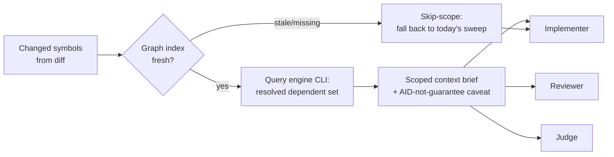

---
first_authored:
  by: "@claude-opus-4-8"
  at: 2026-09-17T11:40:00-08:00
task_list: code-graph/cdocs-integration
type: proposal
state: live
status: implementation_ready
tags: [tooling, code_review, architecture, model_tiering, token_efficiency, future_work]
last_reviewed:
  status: accepted
  by: "@claude-opus-4-8"
  at: 2026-09-23T10:05:00-08:00
  round: 4
---

# Graphify integration into cdocs loops, and the librarian question

> NOTE(claude-opus-4-8/code-graph/cdocs-integration, scoping + lean-track revision): This is a targeted re-aim of an accepted-but-unbuilt proposal, not a rewrite; the spine (the stateless graph-scoping surface as core, recall parity as a hard principle, the CRDT blind-spot honesty) is intact.
> WHY re-aimed: the accepted, e2e-verified `/cdocs:ablate` harness now exists (so the per-task "did scoping help" discriminator is DELEGATED to it); the near-term surface is CLI-FIRST (the MCP is shadowed by a config over-mount, the CLI covers every needed query over the same index); the ablate e2e (Probe A single-file -> `context_gap 0`) anchors task targeting to MULTI-FILE blast-radius shapes; and the graphify license is RESOLVED Apache-2.0.
> LEAN-TRACK re-scope (maintainer-approved in the "Graphify in cdocs" explainer): the shippable headline is the integration itself - Phase 2, the scoping surface - validated by a `/cdocs:ablate` spot-check on real multi-file tasks, NOT by a mandatory before/after coarse baseline. Phase 1 (coarse per-role meter) is demoted to OPTIONAL instrumentation; Phase 3 (the formal, corpus-measured discriminator gate) is a deferrable later increment; the librarian and the adapter are struck from this proposal's scope (revisit via a fresh proposal if ever justified).

> BLUF(claude-opus-4-8/code-graph/cdocs-integration): Integrate a pre-indexed code-graph engine (graphify, Apache-2.0, CLI-backed) into cdocs loops as a stateless, cross-target scoping surface that hands the implementer, reviewer, and judge a change's true MULTI-FILE dependent set up front, cutting speculative read sweeps and enabling tighter model-tiering.
> Ship the integration itself (Phase 2): prime a graphify dependent-set brief into the loop before iterate/review and instruct the reviewer (then implementer/judge) to use the graphify CLI, validated by a `/cdocs:ablate` spot-check on real multi-file tasks. Coarse per-role metering is OPTIONAL instrumentation; the formal measured discriminator gate is a deferrable later increment; the librarian and adapter are out of scope. Recall parity is a hard principle, protected STRUCTURALLY in the shipped increment (additive-only, skip-scope on a stale/missing index, behind a flag): a token win that misses a dependent is a regression.

## Summary

The graph substrate resolves a changed symbol's real dependent set: barrel re-exports, aliased re-exports, and multi-hop chains that a textual grep cannot follow.
The leverage is not review-only.
The implementer, reviewer, and judge each run the same "what does this change touch" context-gathering sweep, so a precise dependent set up front cuts the speculative read burn across every heavy loop role and lets more of the loop run on cheaper models without losing related-code coverage.

The proposal's one bet is **a stateless graph-scoping surface** (CLI-backed now) every loop role queries directly: this is the core, load-bearing deliverable, and it is what ships.
A durable "librarian" sonnet subagent (orchestration-discipline Pillar 3) was considered as packaging on top of it and is dropped from this proposal's scope (see Important Design Decisions); the tool captures the near-certain win without it.

Three disciplines carry from the source RFP and are non-negotiable: recall parity (a token win that misses one more dependent is a regression), the CRDT blind spot (the graph is a scoping AID, never a related-code guarantee), and a metered verdict before any efficiency claim (discriminator-first, satisfied for the shipped increment by a `/cdocs:ablate` spot-check on real multi-file tasks).

The shippable deliverable is **Phase 2**: a graphify dependent-set brief primed into the loop up front plus the reviewer (then implementer and judge) instructed to use the graphify CLI, integrated behind a flag.
Its validation of record is a `/cdocs:ablate` spot-check on a couple of real MULTI-FILE tasks (the harness is already built and e2e-verified), not a mandatory before/after coarse baseline.
Recall parity is protected STRUCTURALLY in this increment (additive-only, skip-scope on a stale/missing index, behind a flag); the MEASURED recall-parity gate is what the deferrable Phase 3 adds.
Phase 1 (a coarse per-role baseline meter) is OPTIONAL instrumentation for when hard live per-role numbers are wanted and does not block shipping Phase 2.
Phase 3 (the formal, corpus-measured discriminator gate) is a deferrable later increment, opt-in and not required to ship. The librarian and the adapter are out of scope for this proposal.

> NOTE(claude-opus-4-8/code-graph/cdocs-integration): This is a NEW clauthier proposal, not an in-place elaboration of the source RFP.
> The RFP is the weftwise-side consumer decision trail; clauthier/cdocs is where the plugin, agent, and skill surfaces actually change.

## Objective

Cut heavy subagent token burn in cdocs loops by replacing the speculative "what does this change touch" context-gathering sweep with a precise, graph-resolved dependent set delivered up front, without sacrificing recall.
Secondary: this proposal weighed bundling graph access into a durable librarian subagent against exposing the graph as a plain retrieval tool each role queries directly, and lands on the tool; the librarian is out of scope (see D1).

## Background

- **Source RFP** (sibling `weftwise` repo, consumer decision trail): local path `cdocs/proposals/2026-09-15-code-graph-review-plugin-rfp.md` in the sibling `weftwise` checkout. Not navigable from this repo and no canonical URL exists yet; it is a sibling-repo local path a reader opens in the adjacent checkout.
  It sets the efficiency thesis, the discriminator-first prerequisite, the recall-parity constraint, the CRDT blind spot, the librarian idea, and the engine/license diligence.
  This proposal is its clauthier-side realization: same graph substrate, the cdocs loop as consumer.
  Carried from the RFP as a BOUND, not a forecast: the efficiency ceiling is ~10-20% of TOTAL loop burn, concentrated entirely in the context-gathering phase, with the realized figure likely below that ceiling and scaling with how much the loop over-reads today. Reasoning and code-writing tokens are untouched; do not expect scoping to move them.
- **Sibling #3** (canvas consumer of the same graph substrate) is out of scope here; it is referenced only where the engine-agnostic adapter migration path matters.
- **cdocs rules** this proposal builds on:
  - `plugins/cdocs/rules/model-tiering.md`: advisory tiers, consumer floor always wins. The graph-scoping's tiering claim lives or dies here.
  - `plugins/cdocs/rules/orchestration-discipline.md`, especially "Pillar 3: Durable Specialists": the resume-by-name durable-specialist pattern the librarian would instantiate, its one-per-workstream bound, and its cross-target degradation.
  - `plugins/cdocs/rules/workflow-patterns.md`: the iterate loop's four roles (overseer, implementer, reviewer, judge), each of which is a candidate graph consumer.
- **Target surfaces** the integration touches: the `reviewer` and `judge` agents in `plugins/cdocs/agents/`, the implementer (a fresh `general-purpose` subagent per `/cdocs:iterate`), and the loop skills `plugins/cdocs/skills/{iterate,implement,review}/SKILL.md`. The `triage` agent is deliberately excluded: it does frontmatter/devlog-state work (glob/filter/parse of `cdocs/**`), not code-symbol context-gathering, so it consumes no dependent set.

### Where scoping plugs in

> NOTE(claude-opus-4-8/code-graph/cdocs-integration): The scoping surface targets MULTI-FILE dependent-set / change-blast-radius navigation, NOT single-file lookups.
> The ablate e2e (Probe A, a single-file `explain` task) scored `context_gap 0`: a change fully reconstructable by reading one file exercises none of graphify's blast-radius strength, and the evaluator honestly scored 0 rather than manufacturing a win.
> So single-file/trivial changes are EXPECTED-NULL for scoping value and must never be read as "graphify has no value"; the surface plugs in where a change's true dependent set spans files a single read would miss. This grounds the recall-parity and discriminator framing (D2, Phase 3, Test Plan) in real e2e data.

## Proposed Solution

### The stateless graph-scoping surface (the core, and only, bet)

A single graph-retrieval capability, queried directly by whichever role is gathering context.
Input: the changed symbols for the round (derived from the diff).
Output: the resolved dependent set (barrel/aliased re-exports and multi-hop chains), returned as a compact scoped-context brief, not whole files.

Properties:

- **Stateless and role-agnostic.** No warm context, no ownership, no per-role variant. The reviewer, implementer, and judge issue the same query shape and receive the same brief format.
- **Engine-behind-CLI now, adapter-ready later.** Query the engine's CLI subcommands (`query`/`explain`/`path`) directly in the first cut: they cover every query the scoping brief needs over the same tree-sitter index, and the CLI is live in-container while the MCP is shadowed by a config over-mount (D4). Structure the query/response contract so a later swap onto the RFP's engine-agnostic adapter (sibling #3), or onto the MCP transport, is a surface change, not a rewrite. Do not couple loop code to graphify-specific response shapes beyond a thin translation layer. Constrain the wrapper to the query subcommands, never raw `graph.json` ingestion, to keep the brief compact.
- **AID, not guarantee.** Every brief carries a standing caveat that the dependent set is a scoping aid and NOT a related-code-completeness guarantee (see the CRDT blind spot below). Roles must not treat an empty or small dependent set as "nothing else is coupled."
- **Skip-scope on a stale or missing index.** If no fresh index exists, the role falls back to today's unscoped sweep for that round rather than blocking or trusting a stale graph. Scoping is strictly additive: its absence must never degrade recall below the current baseline.

### The librarian (considered, dropped from scope)

A durable "librarian" sonnet subagent (resume-by-name, holding codebase knowledge to answer leads' lookups) was considered as packaging over the scoping surface, not a replacement for it: it would itself query the same graph.
It is dropped from this proposal's scope. The tool-first rationale (see D1) holds regardless, and the librarian may be revisited via a fresh proposal if instrumentation ever shows the stateless tool leaves residual, re-query-driven burn worth a standing agent's cost.

### Discriminator-first: the ablate spot-check (validation of record)

The efficiency claim is never asserted, it is metered. For the shipped increment (Phase 2) the discriminator is the `/cdocs:ablate` harness:

- **Per-task causal verdict: the `/cdocs:ablate` spot-check.** "Does scoping actually pay for this task?" is answered by the accepted, e2e-verified ablation harness ([`2026-09-17-mcp-tool-effectiveness-ablation.md`](./2026-09-17-mcp-tool-effectiveness-ablation.md)), which runs graphify-as-tool against the counterfactual of not having it on a representative scoping task and emits a signed context-gap verdict with a token corroborator. The shipped increment is validated by running this spot-check on a couple of real MULTI-FILE tasks, not by a mandatory before/after coarse baseline. This proposal CONSUMES the harness for the causal "did it help" discriminator rather than building a bespoke attribution meter to infer it.
- **Optional live per-role baseline burn: the Phase 1 coarse meter.** When hard live per-role numbers are wanted, a COARSE per-role token meter (per-role totals plus a context-gathering read-token proxy and tool-call count) can be landed and re-metered to track baseline burn per role across a real loop (see Phase 1). This is opt-in instrumentation, not a gate on shipping Phase 2; it deliberately does NOT attempt per-phase attribution (the fragile interleaved-phase meter is off the critical path entirely).

The ablate spot-check supplies the per-task causal "scoping pays" verdict on dependent-set task shapes and is sufficient to ship the increment.
The deferrable Phase 3 adds the corpus-measured recall-parity gate and, if wanted, the optional coarse per-role baseline it is measured against.

## Important Design Decisions

### D1: Plain retrieval tool, statelessly (centerpiece)

**Recommendation: expose the graph as a stateless retrieval tool (CLI now) that every role queries directly. This is the whole of the proposal's bet; the librarian is out of scope (see below).**

The substrate's value is fully captured statelessly: the precise dependent set up front, the core win, needs no warm context.
Having no model, a stateless tool needs no per-consumer model-tier carve-out negotiation and ships clean even to a consumer with no search carve-out, and it degrades cleanly cross-target (CLI and MCP are both cross-target; every role queries it identically on either runtime).
A durable librarian would add a resident-index bet on TOP of the retrieval bet: conflating them means a librarian failure would sink the retrieval win it does not depend on, and a resume-by-name librarian carries a standing warm-agent cost that must be earned, so the retrieval tool captures the near-certain win with none of that risk.

> NOTE(claude-opus-4-8/code-graph/cdocs-integration): The librarian was analyzed at depth in earlier rounds (its Pillar-3 reconciliation as a read-only shared service, its cross-target degradation on runtimes without `SendMessage`, and the empirical threshold at which a resident index would beat re-querying the stateless tool).
> That analysis is not carried here as live scope: the librarian is dropped from this proposal (see "Out of scope"). If it is ever revisited, a fresh proposal should re-open those questions against real instrumentation.

### D2: Recall parity is a hard gate, and the gate is itself a discriminator

Any missed-dependent regression versus the current unscoped baseline fails the change, regardless of token savings.
Scoping is additive over the existing sweep: on any doubt (stale index, engine error, low confidence) the role falls back to the unscoped sweep for that round.
Because the whole design is discriminator-first, the gate must be measurable, not asserted. It is operationalized as three parts:

- **Ground-truth labeling protocol.** For each fixture change the true dependent set is built as a labeled CANDIDATE union, then adjudicated: (1) union the graph output, a grep-recall floor (per the RFP, grep holds ~97.4% raw recall), and an `.observe`/`.subscribe` observe-site scan of the touched files; (2) opus/human-adjudicate that union to drop false positives and confirm true dependents. Crucially the CRDT label does NOT come from the graph, which is blind by construction: it comes from the observe-site scan, hardened on a small CRDT-heavy subset by (3) runtime-trace-derived coupling as the gold-standard tiebreaker. This is how a true dependent is defined for a change the graph cannot see: by the non-graph signals, never the graph itself.
- **Corpus.** A minimum labeled corpus characterized to over-represent the hard cases the graph exists to win and the CRDT cases it cannot: barrel re-exports, aliased re-exports, multi-hop chains, and observe/subscribe-coupled changes, plus plain-import controls. A hard gate on a tiny or barrel-free fixture is noise, so the corpus is sized and its case-mix recorded before any gate reading is admissible; exact size is a Phase 3 deliverable (the measured-gate increment that consumes this corpus), floored at enough per-category fixtures to yield a meaningful per-category rate.
The discriminator corpus is further constrained to MULTI-FILE dependent-set / blast-radius task shapes, the cases graphify exists to win, grounded in the ablate e2e Probe A finding that a single-file task scores `context_gap 0`; single-file/trivial fixtures are retained ONLY as expected-null controls and are inadmissible as evidence that scoping does not pay.
- **Pass rule under noise.** Recall is measured on a sample, so the gate is not naive zero-tolerance on a single fixture flip. The rule: scoped per-category recall must be >= unscoped baseline recall within the labeling protocol's confidence interval, AND there is zero tolerance for a SYSTEMATIC miss class (a whole coupling category the scoping drops, e.g. every aliased re-export). A lone ambiguous-label flip is label noise; a category regression is a real recall loss and fails.

> NOTE(claude-opus-4-8/code-graph/cdocs-integration): The gate distinguishes label noise from a recall regression by CLASS, not by raw count.
> A per-fixture zero-tolerance rule on a noisy hand-labeled sample would be either unachievable or gamed; a per-category systematic-miss rule is the falsifiable form.

### D3: The CRDT blind spot persists and must be surfaced, not hidden

The graph captures barrel and reference coupling but is blind to weftwise's ~125 `.observe`/`.subscribe` CRDT sites, which are ~86.8% of real coupling.
The scoped-context brief must be framed to every consuming role as a scoping AID, never a related-code guarantee.
Operationally: the brief carries the caveat inline, and roles are instructed not to narrow their related-code consideration to the graph's dependent set.

The caveat and instruction alone are a SOFT, test-validated guard, not a runtime guarantee: the CRDT fixture (Test Plan) checks the behavior at test time on known cases, but a production CRDT-heavy change outside the fixture set would have only the caveat standing between it and a recall regression, and a token-pressured role is exactly the actor most likely to treat a small confident set as license to stop. The design therefore hardens the guard STRUCTURALLY, so a role cannot receive a bare small set:

- The brief format never presents the dependent set as exhaustive, and always co-surfaces a "nearby `.observe`/`.subscribe` sites" signal for the touched files, so a role always sees the CRDT-coupling channel alongside the graph set.
- A near-empty graph set on a change whose touched files carry observe/subscribe sites TRIGGERS an unscoped sweep for that round (skip-scope) instead of handing the role a small confident set. This is additive: it can only widen, never narrow, the round's context.

Together these make the production guard structural (the brief cannot omit the CRDT channel) plus an escalation trigger for the worst case, with the fixture retained as the test-time check. Skip-scope never lowers the baseline, so this is the honest ceiling of the claim: it reduces, but cannot eliminate, the risk on coupling no non-graph signal catches.

> WARN(claude-opus-4-8/code-graph/cdocs-integration): The failure mode to design against is a role treating a small graph dependent set as license to skip broader review.
> On a CRDT-heavy codebase the graph can return a near-empty dependent set for a change with heavy runtime coupling. The caveat is not decoration; it is the guardrail against a recall regression that the token meter alone would not catch.

### D4: Engine choice: graphify default, CLI-backed now, adapter later

graphify (Apache-2.0, CONFIRMED) is the default candidate and is pre-1.0.
The license precondition is RESOLVED: the engine is PyPI `graphifyy`, built from the public [`Graphify-Labs/graphify`](https://github.com/Graphify-Labs/graphify) GitHub repository, which carries an Apache-2.0 `LICENSE` at its root (confirmed via the GitHub license API, spdx `Apache-2.0`).
Residual diligence, NOT a blocker for shipping Phase 2: PyPI package metadata for `graphifyy` omits the SPDX classifier (a packaging gap, not a license ambiguity), and the adopted pin (`0.9.61`) should be spot-checked to carry the same `LICENSE` at its tag before it becomes a standing dependency.
Query its CLI subcommands (`query`/`explain`/`path`) directly in the first cut; keep the loop-side contract thin so migration onto the engine-agnostic adapter (RFP sibling #3), or onto the MCP transport, is a later surface swap.

> NOTE(claude-opus-4-8/graphify-integration): The scoping surface is transport-agnostic: graphify's CLI subcommands (`query`/`explain`/`path`) map one-to-one onto the MCP tools (`query_graph`/`get_node`/`shortest_path`) over the identical tree-sitter index, so "MCP" is a transport, not a distinct capability (see [`../reports/2026-09-17-graphify-mcp-vs-cli-value-add.md`](../reports/2026-09-17-graphify-mcp-vs-cli-value-add.md)). Read D4 as "engine-direct now (CLI by default), adapter later": the thin loop-side contract is what matters. The first cut is CLI-BACKED by default, not merely as a fallback: graphify's CLI is live in-container and the MCP-vs-CLI report ([`../reports/2026-09-17-graphify-mcp-vs-cli-value-add.md`](../reports/2026-09-17-graphify-mcp-vs-cli-value-add.md)) concludes the CLI subcommands fully cover the scoping queries, while in the clauthier lace devcontainer the graphify MCP is currently shadowed by a claude-code host-config over-mount (tracked by a lace-side RFP). The brief-up-front shape (not ad-hoc query mid-reasoning) is exactly the shape the CLI serves cleanly. Revisit an MCP transport only if Phase 3 instrumentation shows the loop needs unplanned graph queries mid-reasoning rather than a precomputed brief.
Treat graphify's pre-1.0 churn as an integration risk: pin a version, and keep the translation layer small enough to re-target if the engine's shape shifts.

### D5: Index provisioning and staleness policy

Who indexes, when, and how a loop tolerates a stale or missing index is a first-class design point, not a detail.
Policy: the loop treats scoping as best-effort. A fresh index is a precondition for scoping a round, never for running the round.
Options for provisioning: index-on-loop-start, index-as-a-standing-service the loop reads, or index-on-demand per round. Phase 2 picks the simplest workable option to ship the surface; refining the choice against measured cost is deferrable work, not a blocker.
The staleness contract is fixed now: stale or missing means skip-scope for that round, never block and never trust a stale graph.

## Edge Cases / Challenging Scenarios

- **Stale index mid-loop.** A change lands that the index predates. Detected by index-vs-diff freshness check; the affected round skip-scopes. Never silently returns a dependent set computed against old source.
- **Engine returns empty or errors.** Treated identically to a missing index: skip-scope, fall back to the unscoped sweep, log the fallback so instrumentation does not misattribute the round's burn to "scoped."
- **CRDT-heavy change with a near-empty graph set.** The highest-risk recall case (D3). The structural guard holds here: the brief co-surfaces the nearby `.observe`/`.subscribe` sites and never presents the set as exhaustive, and a near-empty set on observe-coupled touched files triggers an unscoped sweep for that round. The test plan includes a CRDT-coupled fixture to verify a role does not over-trust the set.
- **Scoping cost exceeds savings on a tiny diff.** A one-symbol change may not repay even a cheap graph query plus brief-loading. Instrumentation must attribute this; the policy may gate scoping below a diff-size threshold. A single-file/trivial change is additionally EXPECTED-NULL for scoping value (ablate e2e Probe A: single-file `explain` -> `context_gap 0`): a near-empty benefit there is honest, not a failure, and must not gate the tool out.
- **lace.** An unspecified weftwise integration target. Out of scope: named only as an open question, not designed against.

## Test Plan

The shipped increment (Phase 2) is validated by the ablate spot-check plus the structural-guard and fallback checks below; the corpus-measured rows (labeled recall corpus, coarse before/after) belong to the deferrable Phase 3 and its optional meter.

- **Ablate spot-check (primary, shipped increment).** Run the `/cdocs:ablate` harness on a couple of real MULTI-FILE dependent-set tasks: graphify-as-tool against the counterfactual of not having it, reading the signed context-gap verdict with its token corroborator. This is the validation of record that scoping pays; no mandatory before/after coarse baseline is required to ship.
- **Task-shape targeting (grounds the discriminator).** The ablate spot-check (and any later Phase-3 corpus) runs on MULTI-FILE dependent-set / blast-radius task shapes, per the e2e Probe A finding (single-file `explain` -> `context_gap 0`). Single-file/trivial fixtures are expected-null controls only; a near-zero result on them is NOT admissible as "scoping does not pay."
- **CRDT guard (structural).** A fixture where the graph dependent set is near-empty but real runtime coupling is heavy. Assert the brief co-surfaces the nearby observe/subscribe sites and never presents the set as exhaustive (D3), and that the near-empty-plus-observe-proximity trigger forces an unscoped sweep for that round. The check is at test time; the production guard is the structural brief format plus that trigger, not the caveat alone.
- **Staleness / fallback.** Force a stale and a missing index; assert the round skip-scopes and its recall matches the unscoped baseline (recall parity protected structurally: scoping only ever adds context), and that a fallback round is labeled fallback, not scoped.
- **Recall parity (hard gate, MEASURED in Phase 3).** In the shipped increment recall parity is protected STRUCTURALLY (additive-only, skip-scope, behind a flag) rather than measured. The MEASURED gate lands in Phase 3: missed-dependent rate on a labeled fixture set (changes with known true dependent sets, including barrel/aliased/multi-hop cases); scoped recall must be >= unscoped baseline recall, and any regression fails the change (D2).
- **Coarse token accounting (optional, Phase 1).** When hard live per-role numbers are wanted: live COARSE per-role burn on a fixed corpus of representative loops, metered before scoping and re-metered after, testing that total per-role burn and the read-token (context-gathering) proxy fall for implementer, reviewer, and judge while the generate-token (reasoning/writing) proxy holds. Opt-in; not a gate on shipping Phase 2.
- **Model-tiering realization (Phase 3).** Re-run a subset of loops with a downgraded role model under scoping; assert recall parity holds at the lower tier (the tiering claim's evidence). Only admissible if the consumer's floor permits the downgrade or a carve-out exists.

## Verification Methodology

The loop is its own test harness: run the real `/cdocs:iterate` loop and read the metered output, do not simulate.

For the shipped increment (Phase 2):

1. Land the scoping surface behind a flag: prime the graphify dependent-set brief into the loop up front and instruct the reviewer (then implementer/judge) to use the graphify CLI.
2. Run the `/cdocs:ablate` spot-check on a couple of real MULTI-FILE dependent-set tasks; read the signed context-gap verdict with its token corroborator. A single-file task is expected-null and does not disconfirm the tool (ablate e2e Probe A).
3. Verify the structural recall guard directly: scoping only ever adds context, a stale or missing index skip-scopes to the unscoped baseline, and the CRDT-proximity trigger forces an unscoped sweep (Test Plan). Recall parity is protected structurally here, not measured.

For the deferrable Phase 3 (opt-in): land the corpus-measured recall-parity gate, and, if hard live per-role numbers are wanted, land the optional Phase 1 coarse meter and capture a before/after per-role baseline. The change is admissible only if context-gathering tokens fall AND recall holds; a token win with any recall loss is rejected (D2).

> NOTE(claude-opus-4-8/code-graph/cdocs-integration): The causal "did the tool help" convention exists as the accepted, e2e-verified `/cdocs:ablate` harness; this proposal CONSUMES it as the shipped increment's validation of record rather than rebuilding it or blocking on a bespoke meter.
> The optional Phase 1 coarse meter is complementary, not a prerequisite; the dropped per-phase attribution meter must not be resurrected onto any critical path.

## Implementation Phases

No time estimates. Dependencies are explicit.

**The shippable HEADLINE is Phase 2: the integration itself.**
Prime a graphify dependent-set brief into the loop up front and instruct the reviewer (then implementer and judge) to use the graphify CLI, integrated behind a flag.
Its validation of record is a `/cdocs:ablate` spot-check on a couple of real MULTI-FILE tasks (the harness is already built and e2e-verified), not a mandatory before/after coarse baseline.
Recall parity is protected STRUCTURALLY here, not measured: scoping is additive (it only ADDS context to the round, never removes it), skip-scope on a stale or missing index guarantees the baseline floor, and the surface ships behind a flag.
Phase 1 (a coarse per-role meter) is OPTIONAL instrumentation and does NOT block shipping Phase 2.
Phase 3 (the MEASURED recall-parity discriminator gate, D2) is a deferrable later increment, opt-in and not required to ship. The librarian and adapter are out of scope (see below).

### Phase 2: Stateless graph-scoping surface (the headline deliverable)

- Precondition (RESOLVED): graphify's license is Apache-2.0, confirmed from the upstream [`Graphify-Labs/graphify`](https://github.com/Graphify-Labs/graphify) repo's root `LICENSE` (D4). The engine is NOT license-blocked. The sole residual is a spot-check that the adopted pin `0.9.61` carries the same `LICENSE` at its tag; a license regression at the pin would block adoption at that pin, nothing more.
- Provision a graphify index over the working tree; expose the graph query behind a thin loop-side contract over the CLI subcommands (`query`/`explain`/`path`), never raw `graph.json` ingestion (D4).
- Prime the scoped-context brief (dependent set + AID caveat, D3) from the round's changed symbols INTO the loop up front, and instruct the consuming role to use the graphify CLI for follow-up queries.
- Wire skip-scope on stale/missing index and on engine error (D5), with fallback labeled.
- Integrate into ONE role first (reviewer, the RFP's original consumer) behind a flag; then the implementer and judge (same query shape, same brief).
- Validate with the `/cdocs:ablate` spot-check on a couple of real MULTI-FILE dependent-set tasks (ablate e2e Probe A: single-file tasks are expected-null and do not gate the tool out).
- Success: the reviewer (then implementer/judge) receives a correct dependent-set brief up front on a fresh index and falls back cleanly otherwise, briefs carry the caveat, and the ablate spot-check shows a positive context-gap verdict on multi-file tasks.
- Depends on: nothing (Phase 1 is optional and not a prerequisite).

### Phase 1: Coarse token-accounting baseline (OPTIONAL instrumentation)

Opt-in, for when hard live per-role numbers are wanted. It does NOT block Phase 2 and is not a prerequisite for any claim; the shipped increment's causal "scoping pays" verdict comes from the `/cdocs:ablate` spot-check.

- Build a COARSE per-role token meter for cdocs loops, attributing tokens to overseer/implementer/reviewer/judge. This is tractable: role maps to subagent identity, and the dispatched-agent result payload already surfaces per-subagent tokens (the `/cdocs:ablate` harness reads the same source, so this reuses a proven metering path).
- Resolution is per-role TOTALS plus a context-gathering PROXY: read-token volume and tool-call count per turn (context-gathering reads) versus generate-token volume (reasoning/writing, expected unmoved).
- Per-phase attribution is explicitly OUT of scope. The interleaved-phase meter (tool-boundary / read-vs-generate attribution WITHIN a single turn) was the design's fragile point; it must not be resurrected onto any critical path.
- Success: a reproducible coarse per-role baseline plus the read/generate proxy exists on the corpus, when a consumer chooses to land it.

### Phase 3: Formal discriminator gate (deferrable later increment)

Opt-in and NOT required to ship Phase 2. This is where recall parity is MEASURED rather than protected only structurally.

- Run the discriminator against a labeled corpus of MULTI-FILE dependent-set / blast-radius task shapes (D2), with the optional Phase 1 coarse meter supplying live per-role token deltas and `/cdocs:ablate` supplying the per-task causal verdict on those same shapes.
- Enforce the MEASURED recall-parity hard gate (D2): scoped per-category recall >= unscoped baseline within the labeling protocol's confidence interval, zero tolerance for a systematic miss class. A token win with any recall regression is rejected.
- Success: a metered verdict on the efficiency claim, admissible only if recall holds.
- Depends on: Phase 2.

### Out of scope (dropped)

The following were framed as later increments in earlier rounds and are struck from this proposal. They are not carried as live plan and may be revisited via a FRESH proposal if ever justified by instrumentation.

- **Librarian (formerly Phase 4).** A durable resume-by-name subagent holding codebase knowledge (D1). Dropped: the stateless tool captures the near-certain win, and a standing warm-agent cost is not justified without evidence the tool leaves residual re-query burn.
- **Adapter migration (formerly Phase 5).** Migrating the loop-side contract onto the RFP's engine-agnostic adapter (sibling #3). Dropped from this proposal; the thin loop-side contract (D4) already keeps a future swap a surface change, so no work is required here until sibling #3 exists.

## Investigation Requested

Forward-looking items a review round could pressure-test:

- **Ablate spot-check sufficiency (Phase 2).** The shipped increment's causal "scoping pays" verdict comes from a `/cdocs:ablate` spot-check on a couple of real multi-file tasks, not a mandatory coarse baseline. Confirm the spot-check plus the structural recall guard together carry the shipped increment, and that no gate silently reintroduces a dependence on the optional Phase 1 meter to ship Phase 2.
- **Structural CRDT guard sufficiency (D3).** The brief-format co-surfacing plus near-empty-set trigger is stronger than a bare caveat but still cannot guarantee recall on coupling no non-graph signal catches. Confirm the additive framing (skip-scope never lowers the baseline) is the honest ceiling of the claim.

## Open Questions

- **What is "lace"?** An unspecified weftwise integration target referenced by the maintainer. Not designed against here; a prerequisite for any lace-specific hook.
- **Index provisioning model (D5).** Index-on-loop-start vs standing-service vs on-demand: Phase 2 ships the simplest workable option; refining it against metered cost is deferrable.
- **Diff-size threshold for scoping.** Below what change size does scoping cost exceed its savings? An instrumentation output, not a guess.
- **graphify license (RESOLVED).** graphify is Apache-2.0, confirmed from the upstream [`Graphify-Labs/graphify`](https://github.com/Graphify-Labs/graphify) root `LICENSE` (D4). No longer an open blocker; the sole residual is a per-pin spot-check of the `0.9.61` tag's `LICENSE`, tracked as Phase 2 diligence, not a gate.
- **Semantic-retrieval complement.** Structural graph scoping and embedding retrieval answer different questions; whether a hybrid beats either is left to the RFP's separate report, not this proposal.

## Links

- Source RFP: sibling-repo local path `cdocs/proposals/2026-09-15-code-graph-review-plugin-rfp.md` in the `weftwise` checkout (sibling repo, not navigable from clauthier, no canonical URL yet).
- Model tiering: [`plugins/cdocs/rules/model-tiering.md`](../../plugins/cdocs/rules/model-tiering.md).
- Orchestration discipline (Pillar 3): [`plugins/cdocs/rules/orchestration-discipline.md`](../../plugins/cdocs/rules/orchestration-discipline.md).
- Workflow patterns: [`plugins/cdocs/rules/workflow-patterns.md`](../../plugins/cdocs/rules/workflow-patterns.md).
