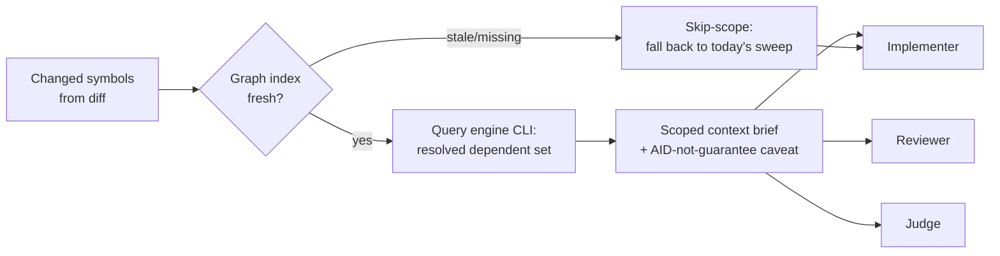

---
first_authored:
  by: "@claude-opus-4-8"
  at: 2026-09-17T11:40:00-08:00
task_list: code-graph/cdocs-integration
type: proposal
state: live
status: review_ready
tags: [tooling, code_review, architecture, model_tiering, token_efficiency, future_work]
last_reviewed:
  status: accepted
  by: "@claude-opus-4-8"
  at: 2026-09-22T15:30:00-07:00
  round: 3
---

# Graphify integration into cdocs loops, and the librarian question

> NOTE(claude-opus-4-8/code-graph/cdocs-integration, scoping revision): This is a targeted re-aim of an accepted-but-unbuilt proposal, not a rewrite; the spine (Bet 1 as core, librarian deferred/conditional, recall parity as a hard gate, the CRDT blind-spot honesty) is intact.
> WHY re-aimed: the accepted, e2e-verified `/cdocs:ablate` harness now exists (so the per-task "did scoping help" discriminator is DELEGATED to it and Phase 1 shrinks to a coarse per-role meter); the near-term surface is CLI-FIRST (the MCP is shadowed by a config over-mount, the CLI covers every needed query over the same index); the ablate e2e (Probe A single-file -> `context_gap 0`) anchors task targeting to MULTI-FILE blast-radius shapes; and the graphify license is RESOLVED Apache-2.0. Restructured toward a green-lightable FIRST INCREMENT (Phase 1 + Phase 2).

> BLUF(claude-opus-4-8/code-graph/cdocs-integration): Integrate a pre-indexed code-graph engine (graphify, Apache-2.0, CLI-backed) into cdocs loops as a stateless, cross-target scoping surface that hands the implementer, reviewer, and judge a change's true MULTI-FILE dependent set up front, cutting speculative read sweeps and enabling tighter model-tiering.
> Ship a FIRST INCREMENT: a coarse per-role baseline meter (with the per-task "does scoping pay" verdict DELEGATED to the accepted `/cdocs:ablate` harness) plus a reviewer-first, CLI-backed scoping surface. DEFER roll-across-roles, the librarian, and the adapter. Recall parity is a hard gate: a token win that misses a dependent is a regression.

## Summary

The graph substrate resolves a changed symbol's real dependent set: barrel re-exports, aliased re-exports, and multi-hop chains that a textual grep cannot follow.
The leverage is not review-only.
The implementer, reviewer, and judge each run the same "what does this change touch" context-gathering sweep, so a precise dependent set up front cuts the speculative read burn across every heavy loop role and lets more of the loop run on cheaper models without losing related-code coverage.

This proposal makes two separable bets and phases them apart so the second can be dropped:

1. **A stateless graph-scoping surface** (CLI-backed now) every loop role queries directly. This is the core, load-bearing bet.
2. **A durable "librarian" sonnet subagent** (orchestration-discipline Pillar 3) that would hold codebase knowledge and answer leads' lookups cheaply. This is packaging on top of bet 1, and this proposal recommends deferring it until instrumentation justifies it.

Three disciplines carry from the source RFP and are non-negotiable: a metered token baseline before any efficiency claim (discriminator-first), recall parity (a token win that misses one more dependent is a regression), and the CRDT blind spot (the graph is a scoping AID, never a related-code guarantee).

The shippable FIRST INCREMENT is Phase 1 (a coarse per-role baseline meter, with the per-task "does scoping pay" causal verdict DELEGATED to the accepted `/cdocs:ablate` harness rather than inferred from a fragile per-phase meter) plus Phase 2 (a reviewer-first, CLI-backed scoping surface).
Roll-across-roles (Phase 3), the librarian (Phase 4), and the adapter (Phase 5) are explicitly-deferred later increments, each gated on the one before it, so the maintainer can green-light full-sending just the first increment.

> NOTE(claude-opus-4-8/code-graph/cdocs-integration): This is a NEW clauthier proposal, not an in-place elaboration of the source RFP.
> The RFP is the weftwise-side consumer decision trail; clauthier/cdocs is where the plugin, agent, and skill surfaces actually change.

## Objective

Cut heavy subagent token burn in cdocs loops by replacing the speculative "what does this change touch" context-gathering sweep with a precise, graph-resolved dependent set delivered up front, without sacrificing recall.
Secondary: evaluate honestly whether bundling graph access into a durable librarian subagent earns its keep versus exposing the graph as a plain retrieval tool each role queries directly.

## Background

- **Source RFP** (sibling `weftwise` repo, consumer decision trail): local path `cdocs/proposals/2026-09-15-code-graph-review-plugin-rfp.md` in the sibling `weftwise` checkout. Not navigable from this repo and no canonical URL exists yet; it is a sibling-repo local path a reader opens in the adjacent checkout.
  It sets the efficiency thesis, the discriminator-first prerequisite, the recall-parity constraint, the CRDT blind spot, the librarian idea, and the engine/license diligence.
  This proposal is its clauthier-side realization: same graph substrate, the cdocs loop as consumer.
  Carried from the RFP as a BOUND, not a forecast: the efficiency ceiling is ~10-20% of TOTAL loop burn, concentrated entirely in the context-gathering phase, with the realized figure likely below that ceiling and scaling with how much the loop over-reads today. Reasoning and code-writing tokens are untouched; do not expect scoping to move them.
- **Sibling #3** (canvas consumer of the same graph substrate) is out of scope here; it is referenced only where the engine-agnostic adapter migration path matters.
- **cdocs rules** this proposal builds on:
  - `plugins/cdocs/rules/model-tiering.md`: advisory tiers, consumer floor always wins. The graph-scoping's tiering claim lives or dies here.
  - `plugins/cdocs/rules/orchestration-discipline.md`, especially "Pillar 3: Durable Specialists": the resume-by-name durable-specialist pattern the librarian would instantiate, its one-per-workstream bound, and its cross-target degradation.
  - `plugins/cdocs/rules/workflow-patterns.md`: the iterate loop's four roles (overseer, implementer, reviewer, judge), each of which is a candidate graph consumer.
- **Target surfaces** the integration touches: the `reviewer` and `judge` agents in `plugins/cdocs/agents/`, the implementer (a fresh `general-purpose` subagent per `/cdocs:iterate`), and the loop skills `plugins/cdocs/skills/{iterate,implement,review}/SKILL.md`. The `triage` agent is deliberately excluded: it does frontmatter/devlog-state work (glob/filter/parse of `cdocs/**`), not code-symbol context-gathering, so it consumes no dependent set.

### Where scoping plugs in

> NOTE(claude-opus-4-8/code-graph/cdocs-integration): The scoping surface targets MULTI-FILE dependent-set / change-blast-radius navigation, NOT single-file lookups.
> The ablate e2e (Probe A, a single-file `explain` task) scored `context_gap 0`: a change fully reconstructable by reading one file exercises none of graphify's blast-radius strength, and the evaluator honestly scored 0 rather than manufacturing a win.
> So single-file/trivial changes are EXPECTED-NULL for scoping value and must never be read as "graphify has no value"; the surface plugs in where a change's true dependent set spans files a single read would miss. This grounds the recall-parity and discriminator framing (D2, Phase 3, Test Plan) in real e2e data.

## Proposed Solution

### Bet 1: a stateless graph-scoping surface (core)

A single graph-retrieval capability, queried directly by whichever role is gathering context.
Input: the changed symbols for the round (derived from the diff).
Output: the resolved dependent set (barrel/aliased re-exports and multi-hop chains), returned as a compact scoped-context brief, not whole files.

Properties:

- **Stateless and role-agnostic.** No warm context, no ownership, no per-role variant. The reviewer, implementer, and judge issue the same query shape and receive the same brief format.
- **Engine-behind-CLI now, adapter-ready later.** Query the engine's CLI subcommands (`query`/`explain`/`path`) directly in the first cut: they cover every query the scoping brief needs over the same tree-sitter index, and the CLI is live in-container while the MCP is shadowed by a config over-mount (D4). Structure the query/response contract so a later swap onto the RFP's engine-agnostic adapter (sibling #3), or onto the MCP transport, is a surface change, not a rewrite. Do not couple loop code to graphify-specific response shapes beyond a thin translation layer. Constrain the wrapper to the query subcommands, never raw `graph.json` ingestion, to keep the brief compact.
- **AID, not guarantee.** Every brief carries a standing caveat that the dependent set is a scoping aid and NOT a related-code-completeness guarantee (see the CRDT blind spot below). Roles must not treat an empty or small dependent set as "nothing else is coupled."
- **Skip-scope on a stale or missing index.** If no fresh index exists, the role falls back to today's unscoped sweep for that round rather than blocking or trusting a stale graph. Scoping is strictly additive: its absence must never degrade recall below the current baseline.

### Bet 2: the librarian (deferred, conditional)

A durable, resume-by-name sonnet subagent that would hold codebase/context knowledge and answer leads' lookups, so an expensive opus/fable lead never loads a file it could delegate a lookup for.
This is packaging over bet 1, not a replacement for it: a librarian would itself query the same graph surface.
The recommendation (see Important Design Decisions) is to build bet 1 first and gate the librarian on instrumentation showing the stateless tool leaves residual, re-query-driven burn worth a standing agent's cost.

### Discriminator-first instrumentation (gates everything)

The discriminator is split across two instruments with a clear division of labor, so the fragile fine-grained meter is off the critical path:

- **Per-task causal verdict: the `/cdocs:ablate` harness (DELEGATED).** "Does scoping actually pay for this task?" is answered by the accepted, e2e-verified ablation harness ([`2026-09-17-mcp-tool-effectiveness-ablation.md`](./2026-09-17-mcp-tool-effectiveness-ablation.md)), which runs graphify-as-tool against the counterfactual of not having it on a representative scoping task and emits a signed context-gap verdict with a token corroborator. This proposal CONSUMES that instrument for the causal "did it help" discriminator rather than building a bespoke per-phase attribution meter to infer it.
- **Live per-role baseline burn: the Phase 1 coarse meter (owned here).** A COARSE per-role token meter (per-role totals plus a context-gathering read-token proxy and tool-call count), landed BEFORE either bet and re-metered after, to track live baseline burn per role across a real loop. It deliberately does NOT attempt per-phase attribution (see Phase 1): that fine-grained interleaved-phase meter was the design's fragile point and is dropped from the critical path.

Together: the ablation harness supplies the per-task causal "scoping pays" verdict on dependent-set task shapes; the Phase 1 coarse meter supplies the live per-role baseline the rolled-out loop (Phase 3) is measured against.
Without at least these two, every efficiency figure below is a guess and is inadmissible.

## Important Design Decisions

### D1: Plain retrieval tool FIRST; librarian deferred and conditional (centerpiece)

**Recommendation: expose the graph as a stateless retrieval tool (CLI or MCP) that every role queries directly. Defer the librarian until instrumentation proves the plain tool leaves residual burn a resident specialist would cut.**

Rationale, weighed against bundling graph access into a durable librarian from the start:

- **The substrate's value is fully captured statelessly.** The precise dependent set up front, the review's core win, needs no warm context. A librarian adds a resident-index bet on TOP of the retrieval bet; conflating them means a librarian failure would sink the retrieval win it does not depend on.
- **Model-tiering / consumer floor: the tool needs no carve-out negotiation.** A sonnet librarian serving opus/fable leads is search/explore/research-aggregation work, which a consumer floor governs (`model-tiering.md` "Precedence"). For the named consumer this is NOT the obstacle it first appears: weftwise already ships a named "always use sonnet for search, explore, and research aggregation" carve-out above its Opus floor, and an explicit delegation of lookup work to a search-tier agent is not the silent downgrade that floor targets, so a librarian's lookups are plausibly already permitted for weftwise. The stateless tool's genuine, defensible advantage is narrower and real: having NO model, it needs no per-consumer carve-out negotiation at all and ships clean even to a consumer with NO search carve-out. So the tool wins on carve-out-free portability, not because a librarian trips a floor. The live librarian question is therefore its standing warm-agent cost, not its model tier.
- **The one-durable-specialist-per-workstream bound.** A librarian shared across workstreams does not fit cleanly under Pillar 3's bound: it is either a second specialist per workstream (violates the bound) or a cross-workstream shared agent the bound does not describe. The cleanest framing, if a librarian is later built, is as a read-only SHARED SERVICE, not a workstream specialist: it owns no files, so single-writer ownership (Pillar 1b) is not implicated, and it holds no workstream, so the one-per-workstream bound does not govern it. It is orthogonal to the bound, not an extension of it. But a resume-by-name librarian still consumes a standing warm-agent cost that must be earned, which is why it is gated, not assumed. One shared librarian serving M workstreams does not recreate the N-parallel-specialists problem the bound targets, yet it CAN recreate the large-context problem inside a SINGLE agent: its resident context accumulates M workstreams' worth of knowledge and grows unbounded as M rises. Phase 4 must therefore test that the shared index stays bounded (eviction, per-workstream scoping, or a cap that triggers re-scoping), not merely that it cuts burn.
  > NOTE(claude-opus-4-8/code-graph/cdocs-integration): This "read-only service, not workstream specialist" framing is the load-bearing reconciliation with Pillar 3.
  > If a reviewer disagrees that a shared read-only agent escapes the one-per-workstream bound, that is the decision to litigate, and the tool-first path holds regardless.
- **Cross-target degradation.** A librarian's value is warm resident context across turns via `SendMessage`/resume-by-name, a Claude Code primitive. On OpenCode (no `SendMessage`), Pillar 3 degrades to "fresh session from the handoff doc," which discards exactly the warm context a librarian exists to hold, so the librarian degrades to roughly its own overhead with little of its benefit. A stateless tool (CLI or MCP) degrades cleanly: both transports are cross-target, and every role queries it identically on either runtime.
- **When a librarian earns its keep.** Long, multi-workstream arcs where the same codebase questions recur and the marginal cost of re-querying the stateless tool AND re-loading its answers into each fresh subagent exceeds a resident index's standing cost. That is an empirical threshold the instrumentation is built to detect, not a thing to assume up front. When a loop is short or single-workstream, the librarian is pure overhead.

Net: the tool captures the near-certain win with no tiering or cross-target cost; the librarian is a larger, conditional bet the instrumentation must justify.

### D2: Recall parity is a hard gate, and the gate is itself a discriminator

Any missed-dependent regression versus the current unscoped baseline fails the change, regardless of token savings.
Scoping is additive over the existing sweep: on any doubt (stale index, engine error, low confidence) the role falls back to the unscoped sweep for that round.
Because the whole design is discriminator-first, the gate must be measurable, not asserted. It is operationalized as three parts:

- **Ground-truth labeling protocol.** For each fixture change the true dependent set is built as a labeled CANDIDATE union, then adjudicated: (1) union the graph output, a grep-recall floor (per the RFP, grep holds ~97.4% raw recall), and an `.observe`/`.subscribe` observe-site scan of the touched files; (2) opus/human-adjudicate that union to drop false positives and confirm true dependents. Crucially the CRDT label does NOT come from the graph, which is blind by construction: it comes from the observe-site scan, hardened on a small CRDT-heavy subset by (3) runtime-trace-derived coupling as the gold-standard tiebreaker. This is how a true dependent is defined for a change the graph cannot see: by the non-graph signals, never the graph itself.
- **Corpus.** A minimum labeled corpus characterized to over-represent the hard cases the graph exists to win and the CRDT cases it cannot: barrel re-exports, aliased re-exports, multi-hop chains, and observe/subscribe-coupled changes, plus plain-import controls. A hard gate on a tiny or barrel-free fixture is noise, so the corpus is sized and its case-mix recorded before any gate reading is admissible; exact size is a Phase 1 deliverable, floored at enough per-category fixtures to yield a meaningful per-category rate.
The discriminator corpus is further constrained to MULTI-FILE dependent-set / blast-radius task shapes, the cases graphify exists to win, grounded in the ablate e2e Probe A finding that a single-file task scores `context_gap 0`; single-file/trivial fixtures are retained ONLY as expected-null controls and are inadmissible as evidence that scoping does not pay.
- **Pass rule under noise.** Recall is measured on a sample, so the gate is not naive zero-tolerance on a single fixture flip. The rule: scoped per-category recall must be >= unscoped baseline recall within the labeling protocol's confidence interval, AND there is zero tolerance for a SYSTEMATIC miss class (a whole coupling category the scoping drops, e.g. every aliased re-export). A lone ambiguous-label flip is label noise; a category regression is a real recall loss and fails.

> NOTE(claude-opus-4-8/code-graph/cdocs-integration): The gate distinguishes label noise from a recall regression by CLASS, not by raw count.
> A per-fixture zero-tolerance rule on a noisy hand-labeled sample would be either unachievable or gamed; a per-category systematic-miss rule is the falsifiable form.

### D3: The CRDT blind spot persists and must be surfaced, not hidden

The graph captures barrel and reference coupling but is blind to weftwise's ~125 `.observe`/`.subscribe` CRDT sites, which are ~86.8% of real coupling.
The scoped-context brief must be framed to every consuming role as a scoping AID, never a related-code guarantee.
Operationally: the brief carries the caveat inline, and roles are instructed not to narrow their related-code consideration to the graph's dependent set.

The caveat and instruction alone are a SOFT, test-validated guard, not a runtime guarantee: the CRDT fixture (Test Plan) checks the behavior at test time on known cases, but a production CRDT-heavy change outside the fixture set would have only the caveat standing between it and a recall regression, and a token-pressured role is exactly the actor most likely to treat a small confident set as license to stop. The design therefore hardens the guard STRUCTURALLY, so a role cannot receive a bare small set:

- The brief format never presents the dependent set as exhaustive, and always co-surfaces a "nearby `.observe`/`.subscribe` sites" signal for the touched files, so a role always sees the CRDT-coupling channel alongside the graph set.
- A near-empty graph set on a change whose touched files carry observe/subscribe sites TRIGGERS an unscoped sweep for that round (skip-scope) instead of handing the role a small confident set. This is additive: it can only widen, never narrow, the round's context.

Together these make the production guard structural (the brief cannot omit the CRDT channel) plus an escalation trigger for the worst case, with the fixture retained as the test-time check. Skip-scope never lowers the baseline, so this is the honest ceiling of the claim: it reduces, but cannot eliminate, the risk on coupling no non-graph signal catches.

> WARN(claude-opus-4-8/code-graph/cdocs-integration): The failure mode to design against is a role treating a small graph dependent set as license to skip broader review.
> On a CRDT-heavy codebase the graph can return a near-empty dependent set for a change with heavy runtime coupling. The caveat is not decoration; it is the guardrail against a recall regression that the token meter alone would not catch.

### D4: Engine choice: graphify default, CLI-backed now, adapter later

graphify (Apache-2.0, CONFIRMED) is the default candidate and is pre-1.0.
The license precondition is RESOLVED: the engine is PyPI `graphifyy`, built from the public [`Graphify-Labs/graphify`](https://github.com/Graphify-Labs/graphify) GitHub repository, which carries an Apache-2.0 `LICENSE` at its root (confirmed via the GitHub license API, spdx `Apache-2.0`).
Residual diligence, NOT a blocker for the first increment: PyPI package metadata for `graphifyy` omits the SPDX classifier (a packaging gap, not a license ambiguity), and the adopted pin (`0.9.61`) should be spot-checked to carry the same `LICENSE` at its tag before it becomes a standing dependency.
Query its CLI subcommands (`query`/`explain`/`path`) directly in the first cut; keep the loop-side contract thin so migration onto the engine-agnostic adapter (RFP sibling #3), or onto the MCP transport, is a later surface swap.

> NOTE(claude-opus-4-8/graphify-integration): The scoping surface is transport-agnostic: graphify's CLI subcommands (`query`/`explain`/`path`) map one-to-one onto the MCP tools (`query_graph`/`get_node`/`shortest_path`) over the identical tree-sitter index, so "MCP" is a transport, not a distinct capability (see [`../reports/2026-09-17-graphify-mcp-vs-cli-value-add.md`](../reports/2026-09-17-graphify-mcp-vs-cli-value-add.md)). Read D4 as "engine-direct now (CLI by default), adapter later": the thin loop-side contract is what matters. The first cut is CLI-BACKED by default, not merely as a fallback: graphify's CLI is live in-container and the MCP-vs-CLI report ([`../reports/2026-09-17-graphify-mcp-vs-cli-value-add.md`](../reports/2026-09-17-graphify-mcp-vs-cli-value-add.md)) concludes the CLI subcommands fully cover the scoping queries, while in the clauthier lace devcontainer the graphify MCP is currently shadowed by a claude-code host-config over-mount (tracked by a lace-side RFP). The brief-up-front shape (not ad-hoc query mid-reasoning) is exactly the shape the CLI serves cleanly. Revisit an MCP transport only if Phase 3 instrumentation shows the loop needs unplanned graph queries mid-reasoning rather than a precomputed brief.
Treat graphify's pre-1.0 churn as an integration risk: pin a version, and keep the translation layer small enough to re-target if the engine's shape shifts.

### D5: Index provisioning and staleness policy

Who indexes, when, and how a loop tolerates a stale or missing index is a first-class design point, not a detail.
Policy: the loop treats scoping as best-effort. A fresh index is a precondition for scoping a round, never for running the round.
Options for provisioning (to be decided in Phase 3, informed by instrumentation): index-on-loop-start, index-as-a-standing-service the loop reads, or index-on-demand per round.
The staleness contract is fixed now: stale or missing means skip-scope for that round, never block and never trust a stale graph.

## Edge Cases / Challenging Scenarios

- **Stale index mid-loop.** A change lands that the index predates. Detected by index-vs-diff freshness check; the affected round skip-scopes. Never silently returns a dependent set computed against old source.
- **Engine returns empty or errors.** Treated identically to a missing index: skip-scope, fall back to the unscoped sweep, log the fallback so instrumentation does not misattribute the round's burn to "scoped."
- **CRDT-heavy change with a near-empty graph set.** The highest-risk recall case (D3). The structural guard holds here: the brief co-surfaces the nearby `.observe`/`.subscribe` sites and never presents the set as exhaustive, and a near-empty set on observe-coupled touched files triggers an unscoped sweep for that round. The test plan includes a CRDT-coupled fixture to verify a role does not over-trust the set.
- **Scoping cost exceeds savings on a tiny diff.** A one-symbol change may not repay even a cheap graph query plus brief-loading. Instrumentation must attribute this; the policy may gate scoping below a diff-size threshold. A single-file/trivial change is additionally EXPECTED-NULL for scoping value (ablate e2e Probe A: single-file `explain` -> `context_gap 0`): a near-empty benefit there is honest, not a failure, and must not gate the tool out.
- **Librarian, if built, on OpenCode.** No `SendMessage`: degrades to fresh-session-from-handoff, losing warm context. The librarian must degrade to "each role queries the stateless tool directly" (i.e., bet 1), never to a broken resume.
- **lace.** An unspecified weftwise integration target. Out of scope: named only as an open question, not designed against.

## Test Plan

Metrics are meaningless without the Phase 1 meter; every row below presumes it.

- **Token accounting (primary).** Two instruments (see Discriminator-first instrumentation). Live COARSE per-role burn on a fixed corpus of representative loops, metered before scoping lands and re-metered after: the claim under test is that total per-role burn and the read-token (context-gathering) proxy fall for implementer, reviewer, and judge while the generate-token (reasoning/writing) proxy holds. The per-task causal "scoping pays" verdict is DELEGATED to the `/cdocs:ablate` harness run on dependent-set task shapes, not inferred from a per-phase meter.
- **Task-shape targeting (grounds the discriminator).** The discriminator and the `/cdocs:ablate` verdict run on MULTI-FILE dependent-set / blast-radius task shapes, per the e2e Probe A finding (single-file `explain` -> `context_gap 0`). Single-file/trivial fixtures are expected-null controls only; a near-zero result on them is NOT admissible as "scoping does not pay."
- **Recall parity (hard gate).** Missed-dependent rate on a labeled fixture set (changes with known true dependent sets, including barrel/aliased/multi-hop cases). Scoped recall must be >= unscoped baseline recall. Any regression fails the change.
- **CRDT guard (structural).** A fixture where the graph dependent set is near-empty but real runtime coupling is heavy. Assert the brief co-surfaces the nearby observe/subscribe sites and never presents the set as exhaustive (D3), and that the near-empty-plus-observe-proximity trigger forces an unscoped sweep for that round. The check is at test time; the production guard is the structural brief format plus that trigger, not the caveat alone.
- **Staleness / fallback.** Force a stale and a missing index; assert the round skip-scopes and its recall matches the unscoped baseline, and that instrumentation labels the round as fallback, not scoped.
- **Model-tiering realization.** Re-run a subset of loops with a downgraded role model under scoping; assert recall parity holds at the lower tier (the tiering claim's evidence). Only admissible if the consumer's floor permits the downgrade or a carve-out exists.
- **Librarian (only if Phase 4 proceeds).** Compare stateless-tool loops against librarian-served loops on the same corpus: total loop burn including the librarian's standing cost, and recall parity. The librarian passes only if it cuts total burn net of its own cost without recall loss.

## Verification Methodology

The loop is its own test harness: run the real `/cdocs:iterate` loop on the fixture corpus and read the metered output, do not simulate.

1. Land Phase 1 coarse instrumentation and capture the BEFORE baseline on the corpus (per-role totals + read/generate proxy; missed-dependent rate). The per-task causal "did scoping help" verdict is supplied by `/cdocs:ablate` on dependent-set (multi-file) task shapes, not by this meter.
2. Land the scoping tool behind a flag; run the SAME corpus with scoping on and off; diff the metered tokens and recall. Use dependent-set (MULTI-FILE) task shapes; a single-file task is expected-null and does not disconfirm the tool (ablate e2e Probe A).
3. Gate: the change is admissible only if context-gathering tokens fall AND recall holds. A token win with any recall loss is rejected (D2).
4. For the librarian (if reached), repeat the before/after against the stateless-tool baseline, charging the librarian's standing cost to its column.

> NOTE(claude-opus-4-8/code-graph/cdocs-integration): The causal "did the tool help" convention now exists as the accepted, e2e-verified `/cdocs:ablate` harness; this proposal CONSUMES it rather than rebuilding it.
> Phase 1 adds only the complementary LIVE per-role baseline meter (coarse). If that coarse meter proves broadly useful beyond this proposal, factor it out via a follow-up; do not over-generalize it here, and do not resurrect the dropped per-phase attribution meter on the critical path.

## Implementation Phases

Phased so the librarian (Phase 4) can be dropped entirely if Phase 3 instrumentation shows the stateless tool suffices.
No time estimates. Dependencies are explicit.

**FIRST INCREMENT (green-lightable on its own): Phase 1 + Phase 2.**
The coarse per-role baseline meter (Phase 1, with the per-task causal verdict delegated to `/cdocs:ablate`) plus a reviewer-first, CLI-backed scoping surface (Phase 2).
This is the shippable slice: it establishes the live baseline and puts a correct dependent-set brief in front of the RFP's original consumer, with no dependence on the roll-out, the librarian, or the adapter.
In this first increment recall parity is protected STRUCTURALLY, not measured: scoping is additive (it only ADDS context to the round, never removes it), skip-scope on a stale or missing index guarantees the baseline floor, and the surface ships behind a flag.
The MEASURED recall-parity discriminator gate (D2, the hard gate) lands in Phase 3, where scoping rolls across roles and is metered against the labeled corpus; the first increment does not weaken that gate, it precedes it.
Phases 3 to 5 are explicitly-deferred LATER increments, each gated on the one before it; the maintainer can full-send just the first increment.

### Phase 1: Coarse token-accounting baseline (gate; prerequisite for all claims)

- Build a COARSE per-role token meter for cdocs loops, attributing tokens to overseer/implementer/reviewer/judge. This is tractable: role maps to subagent identity, and the dispatched-agent result payload already surfaces per-subagent tokens (the `/cdocs:ablate` harness reads the same source, so this reuses a proven metering path).
- Resolution is per-role TOTALS plus a context-gathering PROXY: read-token volume and tool-call count per turn (context-gathering reads) versus generate-token volume (reasoning/writing, expected unmoved). The efficiency claim is stated at THIS resolution: total per-role burn falls and the read-token proxy falls while the generate proxy holds, recall held.
- Per-phase attribution is explicitly OUT of Phase 1's critical path. The interleaved-phase meter (tool-boundary / read-vs-generate attribution WITHIN a single turn) was the design's fragile point; the "did scoping actually help" causal question it existed to answer is DELEGATED to the `/cdocs:ablate` harness (see Discriminator-first instrumentation), which answers it per-task by A/B rather than by inference. Nothing downstream depends on true per-phase attribution; a later phase may add finer resolution, but it must not be resurrected onto the critical path.
- Capture the BEFORE baseline on the labeled corpus (D2), including missed-dependent labels.
- Success: a reproducible coarse per-role baseline plus the read/generate proxy exists on the corpus.
- Constraint: this phase adds NO scoping. It only measures. Nothing downstream is admissible until it lands.
- Depends on: nothing. Blocks: Phases 2, 3, 4.

### Phase 2: Stateless graph-scoping surface (CLI-backed)

- Precondition (RESOLVED): graphify's license is Apache-2.0, confirmed from the upstream [`Graphify-Labs/graphify`](https://github.com/Graphify-Labs/graphify) repo's root `LICENSE` (D4). The engine is NOT license-blocked for the first increment. The sole residual is a spot-check that the adopted pin `0.9.61` carries the same `LICENSE` at its tag; a license regression at the pin would block adoption at that pin, nothing more.
- Provision a graphify index over the corpus; expose the graph query behind a thin loop-side contract over the CLI subcommands (`query`/`explain`/`path`), never raw `graph.json` ingestion (D4).
- Produce the scoped-context brief (dependent set + AID caveat, D3) from changed symbols.
- Wire skip-scope on stale/missing index and on engine error (D5), with fallback labeled for instrumentation.
- Integrate into ONE role first (reviewer, the RFP's original consumer) behind a flag.
- Success: reviewer receives a correct dependent set on a fresh index and falls back cleanly otherwise; briefs carry the caveat.
- Depends on: Phase 1. Blocks: Phase 3.

> NOTE(claude-opus-4-8/code-graph/cdocs-integration): FIRST-INCREMENT BOUNDARY. Phases 1 to 2 above are the green-lightable slice; Phases 3 to 5 below are deferred later increments, each gated on the one before it.

### Phase 3: Roll scoping across roles + measure (the discriminator gate)

- Extend the scoping surface to the implementer and judge (same query shape, same brief).
- Run the discriminator on MULTI-FILE dependent-set / blast-radius task shapes (ablate e2e Probe A: single-file tasks are expected-null and do not gate the tool out). Produce the token and recall deltas from the coarse per-role meter, and take the per-task causal "scoping pays" verdict from `/cdocs:ablate` on those same task shapes.
- Decide, on the metered result: does scoping pay, and does the residual re-query pattern justify evaluating a librarian at all?
- Success: a metered verdict on the efficiency claim (admissible only if recall holds), and an explicit go/no-go on Phase 4.
- Depends on: Phase 2. Gates: Phase 4.

### Phase 4: Librarian evaluation (conditional; only if Phase 3 justifies it)

- Only if Phase 3 shows residual re-query burn a resident index would cut.
- Prototype the librarian as a read-only shared SERVICE (D1), not a workstream specialist. Confirm the consuming project's model policy admits its tier rather than authoring a new carve-out: for weftwise the existing search/explore->sonnet carve-out plausibly already covers a librarian's lookup work (D1), making this a confirmation step; a consumer with NO search carve-out would need one. Test that the shared index stays bounded as workstream count grows (D1), not merely that it cuts burn.
- Measure total loop burn net of the librarian's standing cost, against the Phase 3 stateless-tool baseline; verify cross-target degradation to bet 1 on a no-`SendMessage` runtime.
- Success: the librarian cuts total burn net of its cost without recall loss, OR is explicitly declined with the metered reason recorded.
- Depends on: Phase 3 go decision. Blocks: nothing.

### Phase 5: Adapter migration (deferred, tracked)

- Migrate the loop-side contract from graphify's engine-direct surface (CLI now, MCP if later adopted) onto the RFP's engine-agnostic adapter (sibling #3) when it exists.
- Success: engine swap is a surface change; loop code is unchanged.
- Depends on: sibling #3 landing. Not blocking for Phases 1 to 4.

## Investigation Requested

Forward-looking items a review round could pressure-test:

- **Coarse-meter sufficiency (Phase 1).** Per-phase attribution is dropped from the critical path: the coarse per-role meter plus the read/generate proxy is the plan of record, and the per-task causal verdict is delegated to `/cdocs:ablate`. Confirm the coarse resolution plus the ablation harness together carry the efficiency claim, and that no downstream gate silently reintroduces a dependence on true per-phase attribution.
- **Bounded shared-librarian context (D1, Phase 4).** Whether a single shared read-only librarian can hold M workstreams' context without recreating the large-context problem inside one agent is unproven and deferred to Phase 4. Flag if it should GATE Phase 4 entry rather than be tested within it.
- **Structural CRDT guard sufficiency (D3).** The brief-format co-surfacing plus near-empty-set trigger is stronger than a bare caveat but still cannot guarantee recall on coupling no non-graph signal catches. Confirm the additive framing (skip-scope never lowers the baseline) is the honest ceiling of the claim.

## Open Questions

- **What is "lace"?** An unspecified weftwise integration target referenced by the maintainer. Not designed against here; a prerequisite for any lace-specific hook.
- **Index provisioning model (D5).** Index-on-loop-start vs standing-service vs on-demand: deferred to Phase 3, informed by the metered cost of each.
- **Diff-size threshold for scoping.** Below what change size does scoping cost exceed its savings? An instrumentation output, not a guess.
- **graphify license (RESOLVED).** graphify is Apache-2.0, confirmed from the upstream [`Graphify-Labs/graphify`](https://github.com/Graphify-Labs/graphify) root `LICENSE` (D4). No longer an open blocker; the sole residual is a per-pin spot-check of the `0.9.61` tag's `LICENSE`, tracked as Phase 2 diligence, not a gate.
- **Semantic-retrieval complement.** Structural graph scoping and embedding retrieval answer different questions; whether a hybrid beats either is left to the RFP's separate report, not this proposal.

## Links

- Source RFP: sibling-repo local path `cdocs/proposals/2026-09-15-code-graph-review-plugin-rfp.md` in the `weftwise` checkout (sibling repo, not navigable from clauthier, no canonical URL yet).
- Model tiering: [`plugins/cdocs/rules/model-tiering.md`](../../plugins/cdocs/rules/model-tiering.md).
- Orchestration discipline (Pillar 3): [`plugins/cdocs/rules/orchestration-discipline.md`](../../plugins/cdocs/rules/orchestration-discipline.md).
- Workflow patterns: [`plugins/cdocs/rules/workflow-patterns.md`](../../plugins/cdocs/rules/workflow-patterns.md).
