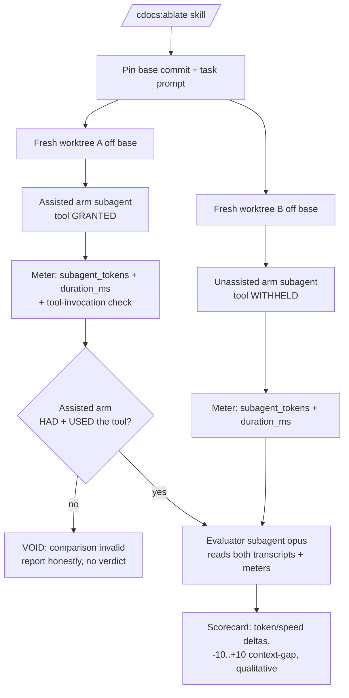

---
first_authored:
  by: "@claude-opus-4-8"
  at: 2026-09-17T17:30:00-08:00
task_list: cdocs/mcp-ablation
type: proposal
state: live
status: review_ready
last_reviewed:
  status: revision_requested
  by: "@claude-opus-4-8"
  at: 2026-09-17T18:05:00-08:00
  round: 1
tags: [tooling, verification, testing, token_efficiency, orchestration, model_tiering]
---

# MCP-tool effectiveness ablation harness

> BLUF(claude-opus-4-8/cdocs/mcp-ablation): An on-demand `/cdocs:ablate` harness that proves whether a given MCP tool helps a cdocs task: it runs the SAME task from a byte-identical baseline twice, once WITH the tool and once WITHOUT, meters each arm's tokens + wallclock from the harness result payload, and an opus evaluator emits a scorecard (token/speed deltas, a signed -10..+10 context-gap score, qualitative verdict). If the assisted arm never invoked the tool, the run is VOID, never a false no-effect.

## Summary

A tool that claims to help an agent must PROVE it, on a real task, against the counterfactual of not having it.
This harness is that proof: an assisted-versus-unassisted ablation, parameterized by a target MCP tool and a representative task, that isolates tool access as the ONLY variable between two arms and reports what the tool actually bought.

The mechanics are three dispatched subagents orchestrated by a thin `/cdocs:ablate` skill:

1. An **assisted arm** that HAS the tool performs the task from a fresh baseline worktree and rolls out to end of turn.
2. An **unassisted arm** that lacks the tool performs the SAME task from an identical fresh baseline worktree.
3. An **evaluator** (opus) reads both arms' transcripts and metered files and emits a scorecard.

Two disciplines are load-bearing and carried from prior cdocs work.
First, a **usage precondition**: before any comparison, the harness confirms the assisted arm both had access to AND actually invoked the tool during its rollout.
An ablation where the treatment never happened proves nothing, so that case is reported VOID, never as a false "no effect."
Second, **metering honesty**: token usage is the stable axis and wallclock is indicative only, so a scorecard never rests a verdict on wallclock alone.

graphify is the first consumer and running example, but the harness is tool-agnostic: it takes which MCP tool and which task as parameters.

> NOTE(claude-opus-4-8/cdocs/mcp-ablation): This is a general realization of the graphify proposal's "prove it helped" requirement, not a graphify-specific script.
> The graphify proposal owns graphify's internals; this owns the ablation method.

## Objective

Give cdocs a repeatable, on-demand way to answer "does this MCP tool actually help THIS task?" with metered evidence and an honest verdict, rather than an asserted or assumed benefit.
The comparison must isolate tool access as the sole variable, refuse to render a verdict when the treatment did not occur, and emit a scorecard a human or a downstream gate can read.

## Background

- **Motivating accepted proposal:** [`cdocs/proposals/2026-09-17-graphify-cdocs-integration.md`](./2026-09-17-graphify-cdocs-integration.md).
  Its Phase 1 is discriminator-first token-accounting instrumentation whose entire purpose is to PROVE graph-scoping cuts context-gathering burn without losing recall.
  This harness is a concrete, general instrument for that "prove it helped" requirement: the graphify proposal can CONSUME this verifier to substantiate its token and recall gates, running graphify as the ablated tool on a representative loop task.
  This proposal does not re-spec graphify's internals, its license, or its pin: those are owned there.
  It also carries graphify's honesty stance directly: "check absent != check passed" (its D3), here reshaped as "treatment absent != no effect."
- **Superseded first attempt:** [`cdocs/proposals/2026-09-17-target-setup-validation-and-verification.md`](./2026-09-17-target-setup-validation-and-verification.md), now `status: evolved`.
  That proposal designed a declarative per-target `verify.toml` test-manifest; the maintainer redirected toward this ablation harness instead.
  Two of its pieces are salvaged here, not discarded:
  - The **PASS / ABSENT / FAIL honesty taxonomy** (its D2): a check that did not run is a distinct, logged state, never coerced into a pass.
    This harness reuses that shape as its outcome taxonomy (see the Outcome taxonomy below): a VALID comparison, a VOID run, or a task FAIL, each logged as itself.
  - The **confirmed lace facts**: lace v0.1.0 exposes exactly `doctor | resolve-mounts | up | validate`, and NONE of these probes in-container service or MCP reachability.
    Consequence for this harness: "did the assisted arm actually reach and use the MCP tool" is verified at the HARNESS level from the arm's own transcript, never via a lace command.
- **cdocs rules this builds on:**
  - `plugins/cdocs/rules/model-tiering.md`: the evaluator is judgment-heavy, so it defaults to opus; a consumer floor always wins.
  - `plugins/cdocs/rules/orchestration-discipline.md`: the harness is a thin overseer that dispatches the two arms and the evaluator as subagents; it does not do the arms' work inline.
  - `plugins/cdocs/rules/workflow-patterns.md`: the dispatched-subagent pattern the three roles instantiate.

## Proposed Solution

A `/cdocs:ablate` skill orchestrates a two-arm ablation plus an evaluator, backed by a small helper script for the two mechanical, correctness-critical steps a subagent should not improvise: baseline reset and meter aggregation.

Inputs: `--tool <mcp-tool-id>`, `--task <task spec or path>`, optional `--trials N` (default per D3), `--base <commit>` (default `HEAD`).

### The two arms

Each arm is a dispatched subagent handed the SAME task prompt and run against a SEPARATE fresh worktree checked out from the SAME pinned base commit.
The only permitted difference is tool access:

- **Assisted arm:** the target MCP tool is present in the subagent's tool set.
- **Unassisted arm:** the target MCP tool is absent from the subagent's tool set; everything else (task prompt, base model, seed workspace, non-target tools) is held identical.

Each arm rolls out to the end of its turn.
The harness meters that arm and captures its transcript and its produced diff.

### Metering

Per-arm metrics come from the Claude Code harness's dispatched-agent result payload, which already surfaces `subagent_tokens` and `duration_ms`.
The harness reads those directly rather than inventing instrumentation.
The helper script normalizes them into a per-arm meter file alongside a pointer to the arm's transcript and diff.

- **Token usage** is the stable, primary axis.
- **Wallclock** (`duration_ms`) is recorded but flagged inherently noisy: model-latency variance dominates it, so it is indicative, never authoritative, and never the sole basis for a verdict.

### The usage precondition (the honesty gate)

Before the evaluator runs, the harness verifies the assisted arm both (a) HAD the tool available and (b) actually INVOKED it at least once during the rollout.
Availability is known from how the arm was dispatched; invocation is confirmed from the assisted arm's transcript, by detecting a real tool-call to the named MCP tool (tool-call boundaries are visible in the result payload).
There is no lace command that probes in-container MCP reachability, so this check is harness-level, from the transcript, by construction.

If the tool was unavailable or was available but never invoked, the treatment did not occur and the comparison is VOID.
The harness reports that plainly and renders NO effect verdict, because an ablation without a treatment proves nothing.

### Outcome taxonomy (salvaged PASS/ABSENT/FAIL shape)

Every run resolves to exactly one logged outcome:

- **VALID** (the PASS analog): both arms completed the task and the assisted arm verifiably USED the tool. Only VALID runs yield a scorecard verdict.
- **VOID** (the ABSENT analog): the tool was unavailable or never invoked, so the treatment is absent. Logged as VOID, never as "no effect." This is the exact "absent != passed" honesty carried forward.
- **TASK-FAIL** (the FAIL analog): one or both arms failed to complete the task. Handled explicitly (see Edge Cases): a token/speed comparison across a completion and a non-completion is not apples-to-apples, so the scorecard flags it rather than reporting a spurious token win.

### The evaluator and scorecard

On a VALID run, an opus evaluator subagent reads both arms' transcripts, both diffs, and both meter files, and emits a scorecard with these axes:

- **Token usage:** assisted versus unassisted, with the delta.
- **Speed / wallclock:** assisted versus unassisted, labeled indicative-only.
- **Context gap:** a signed integer in `[-10, +10]`. `+10` = the tool surfaced critical information the agent would otherwise have missed; `-10` = the tool result confused the agent or cost it time and context; `0` = no discernible effect on the agent's information state. Rubric anchors in D5.
- **Qualitative result:** the evaluator's prose assessment of what the tool did or did not do for this task.

The scorecard is written as a small structured file plus a human-readable markdown summary (D7).

## Important Design Decisions

### D1: Reset safety - a fresh throwaway worktree per arm (load-bearing)

**Recommendation: run each arm in its own fresh, throwaway git worktree checked out from the same pinned base commit, and remove it on teardown. Do NOT use `git stash`.**

Rationale.
The two arms must start byte-identical, and the base must be restorable between them.
In this repo's bare-repo-plus-sibling-worktrees layout the git stash stack is SHARED across all worktrees, and other Claude sessions push and pop it concurrently.
A bare `git stash` / `git stash pop` in the harness could therefore pop or drop another session's work: silent cross-session corruption.
A fresh worktree off a pinned base commit sidesteps the stash entirely: each arm gets an isolated, identical tree; the base commit is the shared, immutable baseline; teardown is `git worktree remove`, which touches no shared mutable state.
This also gives the two arms genuine filesystem isolation, so the assisted arm's writes cannot contaminate the unassisted arm's baseline, which a single shared tree reset in place could not guarantee.

The failure it prevents: clobbering a concurrent session's uncommitted work via the shared stash stack, and cross-arm contamination via a shared working tree.
The rejected alternatives - bare `git stash`/`pop` (shared-stack clobber) and WIP-commit-and-hard-reset in a shared tree (no cross-arm isolation, and a hard reset is destructive if the tree was not clean) - are both strictly worse here.

### D2: Metering source - the harness result payload, not new instrumentation

**Recommendation: base metering on `subagent_tokens` and `duration_ms` from the dispatched agent's result payload; add no bespoke token counter.**

The harness already meters dispatched subagents, so re-deriving token counts would duplicate a trusted source and risk disagreeing with it.
Token usage is the stable axis and drives the verdict; wallclock is recorded but explicitly marked noisy, because model-latency variance makes a single arm's `duration_ms` a weak signal.
The scorecard states this asymmetry so a reader never over-weights a wallclock swing.

### D3: Variance - single-shot with a loud caveat first, N-trials as the eventual default

**Recommendation: ship single-shot-with-a-loud-caveat FIRST (Phases 1-2), then make N-trials aggregation the default (Phase 3), `--trials` defaulting to 3 and the scorecard reporting median plus spread.**

A single A/B pair is noisy because rollouts are nondeterministic, so a single-shot scorecard MUST carry a prominent caveat that its deltas are one draw, not an estimate, and that a sign flip on a small delta is within noise.
Relating this to the graphify proposal's noise-by-class discipline: the axes differ in stability, so they are trusted differently.
Token usage is the stable axis and tolerates single-shot reading with a caveat; wallclock is noisy and needs aggregation before it means much; the context-gap and qualitative axes are evaluator judgments that a single strong rollout can already justify.
N-trials (median across trials, plus the spread) is the honest default once the harness is proven, and the spread itself becomes a reported signal: a wide spread is a finding, not a number to hide.
Shipping single-shot first keeps Phase 1 minimal and buildable without blocking on trial orchestration.

### D4: Fair two-arm construction - tool access is the ONLY variable

**Recommendation: grant the tool by including the target MCP in the assisted arm's tool set and withhold it by excluding it from the unassisted arm's tool set; hold the task prompt, base model, and seed workspace constant across arms.**

Holding conditions constant:

- **Task prompt:** one pinned prompt string, passed verbatim to both arms.
- **Base model:** the same model id for both arms; the evaluator runs on opus regardless (D5), but the two ARMS must match each other.
- **Seed workspace:** both arms branch from the same pinned base commit into fresh worktrees (D1), so the starting bytes are identical.
- **Non-target tools:** identical between arms; only the single target MCP differs.

The tool grant/withhold is the treatment; anything else that differs is a confound and invalidates the comparison, so the harness records the exact tool-set diff between arms in the run log for auditability.

### D5: Evaluator model and rubric - opus, blind-where-feasible

**Recommendation: run the evaluator on opus (judgment-heavy per model-tiering; a consumer floor wins if stricter). Score the context gap on a fixed rubric, and blind the evaluator to arm identity where feasible.**

The evaluator reasons about subtle cross-arm differences in the agent's information state, which is exactly the opus-tier judgment work model-tiering reserves for a strong model.

Context-gap rubric (signed, `[-10, +10]`):

- **+6 to +10:** the tool surfaced information the unassisted arm demonstrably missed or reconstructed expensively, and that information was load-bearing for the task.
- **+1 to +5:** the tool provided useful context that modestly improved the assisted arm's path.
- **0:** no discernible difference in the agent's information state attributable to the tool.
- **-1 to -5:** the tool result added noise or a minor detour without clear benefit.
- **-6 to -10:** the tool result actively confused the assisted arm or cost it meaningful time/context (a net-negative tool).

Bias mitigation.
Full blinding is impossible for the assisted arm, whose transcript necessarily shows the tool calls, so the mitigation is partial and honest about it: label the arms neutrally (A/B) in the meter files, have the evaluator record its qualitative read of EACH arm before it is told which arm is assisted, and fix the rubric up front so the score is anchored rather than free-floating.
The scorecard notes that the assisted arm is identifiable by its tool calls, so the reader knows the blind is partial.

### D6: Packaging - a `/cdocs:ablate` skill over a thin helper script

**Recommendation: package as a `/cdocs:ablate` cdocs skill that orchestrates dispatched subagents, backed by a small helper script for reset and meter aggregation only.**

The user offered a CLI util or a slash command; a skill fits the cdocs dispatch model better.
The skill is a THIN overseer: it pins the base and prompt, dispatches the two arms and the evaluator as subagents, and assembles the scorecard.
It does NOT perform an arm's task inline, which would violate overseer thinness and, worse, contaminate the ablation with the overseer's own tokens.
The helper script owns only the two mechanical, correctness-critical steps that must be deterministic and must not be improvised by a language model: worktree creation/teardown (D1) and normalizing the harness payload into meter files (D2).
Judgment stays in the subagents; mechanics stay in the script.

### D7: Scorecard artifact - structured file plus human summary, under a run directory

**Recommendation: write per-arm meter files and the final scorecard under a per-run directory; the scorecard is a small structured sidecar plus a human-readable markdown summary.**

Layout per run (under a run id, e.g. a timestamped directory in the harness scratchpad, with the durable summary optionally promoted to a `/cdocs:report`):

- `arm-assisted.meter.json`, `arm-unassisted.meter.json`: tokens, `duration_ms`, tool-set diff, transcript and diff pointers, tool-invocation-confirmed flag.
- `scorecard.json`: the structured verdict (outcome VALID/VOID/TASK-FAIL, token delta, wallclock delta, context-gap integer, trials/spread).
- `scorecard.md`: the human-readable summary, leading with the outcome and the caveat, then the evaluator's qualitative assessment.

The structured sidecar lets a downstream gate (e.g. graphify's) consume the verdict programmatically; the markdown is for human review.

## Edge Cases / Challenging Scenarios

- **Tool available but never invoked.** The precondition fails: outcome VOID, no verdict. This is the central honesty case: reporting it as "no effect" would falsely imply the tool was tried and did nothing.
- **Tool unavailable in the assisted arm** (misconfiguration, MCP not reachable). Also VOID, distinguished in the log from available-but-unused, since the fix differs.
- **Nondeterministic variance.** A single-shot delta is one draw; the scorecard caveats it (D3), and N-trials with median-plus-spread is the mitigation once shipped. A small delta whose sign is unstable across trials is reported as within-noise, not a win.
- **Wallclock noise.** `duration_ms` is indicative only (D2); a verdict never rests on it alone, and a wallclock swing against a token tie is reported as inconclusive on speed.
- **Reset clobbering shared state.** Prevented structurally by per-arm fresh worktrees off a pinned base (D1); the harness never touches the shared stash stack.
- **Evaluator bias.** Partial blinding plus a fixed rubric (D5); the scorecard discloses that the assisted arm is identifiable by its tool calls, so the residual bias is visible rather than hidden.
- **The assisted arm fails the task** (or the unassisted arm does). Outcome TASK-FAIL: the harness records which arm(s) failed and does NOT report a token comparison as a tool win, because fewer tokens spent failing is not a benefit. If exactly one arm completes, that asymmetry is itself the reported finding (the tool may have enabled or prevented completion), separate from any token delta.
- **Both arms take wildly different solution paths.** Even with tool access as the only granted difference, nondeterminism can send the arms down different routes, inflating the token delta with path variance rather than tool effect. The evaluator's qualitative read must flag divergent paths, and N-trials aggregation dampens it; a single-shot run with divergent paths is caveated as low-confidence.
- **Task too trivial to exercise the tool.** If neither arm needed the tool's information, the context gap is legitimately near 0; the scorecard should surface that the task under-exercised the tool rather than concluding the tool is useless in general.

## Test Plan

- **Reset isolation (core).** Assert each arm runs in its own worktree off the pinned base, the stash stack is never touched, and teardown removes the worktrees. Force a dirty base and assert the harness refuses rather than stashing.
- **Metering source.** Assert per-arm meter files are populated from the result payload's `subagent_tokens` and `duration_ms`, and that wallclock is labeled indicative in the scorecard.
- **Usage precondition (honesty core).** Three fixtures: tool used (VALID), tool available-but-unused (VOID), tool unavailable (VOID). Assert VOID is logged as VOID and NEVER rendered as a "no effect" verdict, mirroring the salvaged ABSENT != PASS rule.
- **Fair construction.** Assert the two arms receive an identical task prompt, identical base model, identical seed worktree, and a tool-set diff of exactly the one target MCP; assert the diff is recorded in the run log.
- **Task-fail handling.** Fixtures where one arm fails and where both fail; assert outcome TASK-FAIL and that no spurious token-win verdict is emitted; assert a one-arm-completes case reports the completion asymmetry.
- **Evaluator rubric.** On a fixture where the tool clearly surfaced missed info, assert a positive context gap; on a fixture where the tool result was noise, assert a negative or zero gap; assert the evaluator recorded a per-arm read before arm identity was revealed.
- **Variance / trials.** With `--trials 3`, assert median-plus-spread reporting and that a sign-unstable small delta is flagged within-noise. With single-shot, assert the loud caveat is present.
- **Scorecard artifact.** Assert `scorecard.json` and `scorecard.md` are produced, the structured outcome field is one of VALID/VOID/TASK-FAIL, and the markdown leads with outcome and caveat.

## Verification Methodology

Dogfood: run the verifier on graphify itself and show it produces a coherent scorecard.

1. Land the minimal single-shot harness (Phase 1) and run it on a hand-built pair of fixtures with a stub tool whose effect is known (a tool that injects an obviously-needed fact), confirming the harness detects a positive context gap when the tool is used and VOID when it is stubbed to never be invoked. Do not simulate the arms; dispatch real subagents.
2. Wire graphify as the target tool (Phase 4) on a representative cdocs loop task (a "what does this change touch" context-gathering task, graphify's canonical win case). Run the ablation and read the scorecard: assert it is VALID (graphify was actually invoked), that the token axis is populated from the payload, and that the evaluator's context gap and qualitative read are coherent with the transcripts.
3. Confirm the honesty path end to end: force graphify to be present-but-unused (a task that does not need it) and assert the run reports VOID, not a false "graphify had no effect."

> NOTE(claude-opus-4-8/cdocs/mcp-ablation): The dogfood is a coherence check on the harness, not a verdict on graphify.
> Whether graphify passes its own token and recall gates is the graphify proposal's question; this only shows the instrument produces a coherent, honest scorecard.

## Implementation Phases

No time estimates. Dependencies explicit. Phased so the minimal harness delivers value before the evaluator, trials, and the graphify wiring land.

### Phase 1: Minimal single-shot harness - safe reset + two arms + metering

- Helper script: create two fresh worktrees off a pinned base commit (D1), refuse on a dirty base, tear them down on exit; never touch the stash stack.
- Skill: pin the task prompt and base, dispatch the assisted and unassisted arms as subagents with the tool granted/withheld (D4), holding prompt/model/workspace constant.
- Meter each arm from the result payload's `subagent_tokens` and `duration_ms` (D2) into per-arm meter files.
- Implement the usage precondition: confirm the assisted arm HAD and USED the tool from its transcript; emit the VALID / VOID / TASK-FAIL outcome (salvaged taxonomy).
- Single-shot only, with the loud noise caveat (D3). No evaluator yet: emit raw per-arm meters and the outcome.
- Success: on a fixture pair the harness produces two isolated arms, correct meters, and the right outcome, including VOID when the tool is unused.
- Depends on: nothing. Blocks: 2, 3, 4.
- Constraint: no evaluator, no trials, no graphify wiring in this phase.

### Phase 2: Evaluator + scorecard

- Dispatch an opus evaluator (D5) that reads both transcripts, both diffs, and both meter files.
- Produce the context-gap score on the fixed rubric and the qualitative assessment, with partial-blinding (per-arm read before arm identity revealed).
- Emit `scorecard.json` and `scorecard.md` under the run directory (D7), leading with outcome and caveat.
- Success: a VALID run yields a coherent scorecard; a VOID run yields no verdict and says why.
- Depends on: 1. Blocks: 4 (dogfood needs the scorecard).

### Phase 3: N-trials aggregation (becomes the default)

- Run `--trials N` (default 3) per arm; aggregate token and wallclock as median plus spread; report the spread as a signal.
- Flag sign-unstable small deltas as within-noise; keep single-shot available with its caveat.
- Success: a repeated ablation reports median-plus-spread and correctly flags a noisy delta.
- Depends on: 1, 2. Blocks: nothing.

### Phase 4: graphify as the first wired consumer (dogfood)

- Wire graphify as the target MCP tool on a representative context-gathering task.
- Run the Verification Methodology dogfood; confirm a coherent VALID scorecard and the VOID honesty path.
- Document the invocation as the reference example for a tool-agnostic consumer, and note how the graphify proposal can consume the structured scorecard for its own gates (without re-speccing graphify).
- Success: graphify produces a coherent scorecard and the honesty path holds.
- Depends on: 2 (3 optional but recommended for a non-single-shot verdict).

## Investigation Requested

Items for a review round to pressure-test:

- **Tool-invocation detection robustness.** The usage precondition reads the assisted arm's transcript for a real tool-call to the named MCP. Confirm the result payload reliably exposes MCP tool-call boundaries by tool id, and that a tool invoked only inside a nested/aborted path still counts as "used" (or should not). If detection is unreliable, the VOID gate weakens.
- **Path-divergence confound versus tool effect.** Even with tool access as the only granted difference, nondeterministic path divergence can dominate the token delta. Confirm whether N-trials median-plus-spread plus the evaluator's divergence flag is sufficient, or whether a same-seed / constrained-task discipline is needed to attribute the delta to the tool rather than the path.
- **Evaluator blinding ceiling.** The assisted arm is identifiable by its tool calls, so blinding is only partial. Confirm the per-arm-read-before-reveal mitigation plus disclosure is the honest ceiling, or whether a stronger protocol (e.g. a transcript-scrubbing pass) is worth the complexity.
- **Single-shot admissibility.** Confirm whether a single-shot scorecard should ever be treated as a verdict a downstream gate consumes, or only as an indicative preview until N-trials runs.

## Open Questions

- **In-container MCP reachability.** lace v0.1.0 has no command that probes whether an in-container MCP service is reachable, so usage is verified at the harness level from the transcript. If a later lace version adds a reachability query, the availability half of the precondition could prefer it. Do not invent a lace subcommand for this.
- **Representative-task selection.** What makes a task "representative" for a given tool is a judgment the harness caller supplies; whether cdocs should ship a small library of canonical per-tool tasks is deferred.
- **Standalone CLI.** Whether the harness should also be user-invokable outside a loop (a plain CLI in addition to `/cdocs:ablate`) is deferred to a follow-up if the skill form proves broadly useful.
- **Cross-target.** The harness leans on Claude Code dispatch and the harness result payload; how it degrades on OpenCode (payload shape, worktree dispatch) is unspecified here and left for a cross-target follow-up.

## Links

- Motivating proposal (consumer of this verifier): [`cdocs/proposals/2026-09-17-graphify-cdocs-integration.md`](./2026-09-17-graphify-cdocs-integration.md).
- Superseded first attempt: [`cdocs/proposals/2026-09-17-target-setup-validation-and-verification.md`](./2026-09-17-target-setup-validation-and-verification.md).
- Model tiering: [`plugins/cdocs/rules/model-tiering.md`](../../plugins/cdocs/rules/model-tiering.md).
- Orchestration discipline: [`plugins/cdocs/rules/orchestration-discipline.md`](../../plugins/cdocs/rules/orchestration-discipline.md).
- Workflow patterns: [`plugins/cdocs/rules/workflow-patterns.md`](../../plugins/cdocs/rules/workflow-patterns.md).
