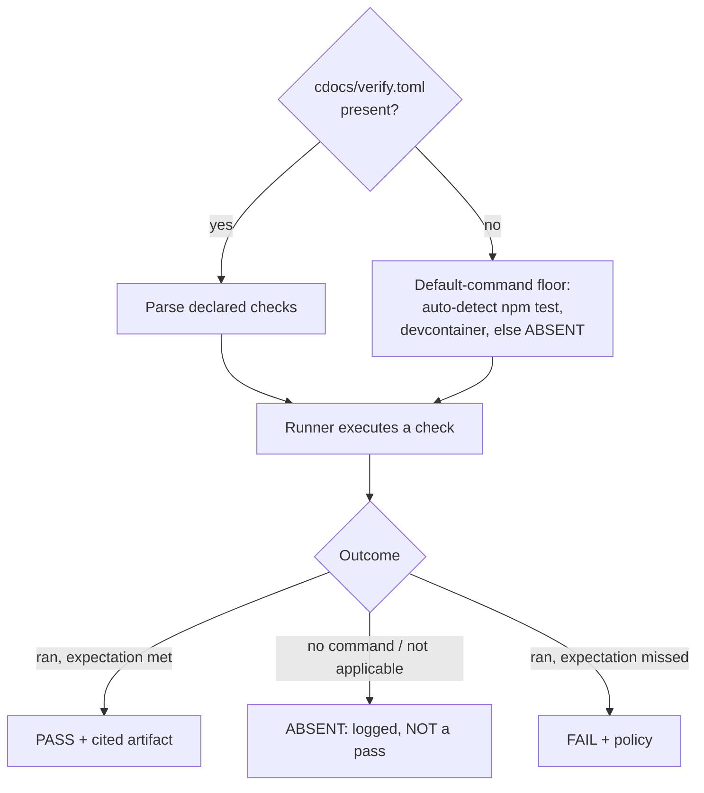
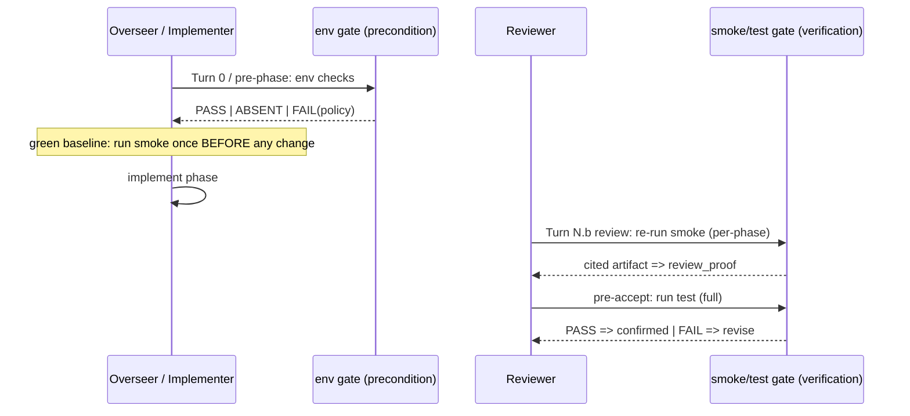

---
first_authored:
  by: "@claude-opus-4-8"
  at: 2026-09-17T15:20:00-08:00
task_list: cdocs/target-verification
type: proposal
state: live
status: evolved
last_reviewed:
  status: accepted
  by: "@claude-opus-4-8"
  at: 2026-09-17T16:10:00-08:00
  round: 1
tags: [tooling, verification, testing, devcontainer, cross_target, orchestration]
---

# Target setup-validation and test-verification for cdocs loops

> NOTE(claude-opus-4-8/cdocs/mcp-ablation): Superseded by [`2026-09-17-mcp-tool-effectiveness-ablation.md`](./2026-09-17-mcp-tool-effectiveness-ablation.md); this proposal's PASS/ABSENT/FAIL honesty taxonomy and confirmed lace facts are salvaged there.

> BLUF(claude-opus-4-8/cdocs/target-verification): A cdocs capability where the TARGET repo declares its own verification in a `cdocs/verify.toml` manifest, consumed uniformly by every loop: environment-validation as a PRECONDITION gate, test-verification as a per-phase and pre-accept gate.
> Every check resolves to one of three LOGGED outcomes, PASS / ABSENT / FAIL, and absence is never a pass. A missing manifest degrades to a default-command floor; lace's confirmed `validate`/`doctor`/`up` are the first devcontainer adapter.

## Summary

cdocs loops are starting to execute real code against real environments, not just produce documents.
The just-accepted graphify proposal ([`2026-09-17-graphify-cdocs-integration.md`](./2026-09-17-graphify-cdocs-integration.md)) lands executable surface and a discriminator-first instrumentation discipline, and a parallel workstream is wiring a graphify service into clauthier's lace devcontainer.
Once a loop runs code against a target, it needs a reusable way to answer two questions that today each proposal re-invents in an ad-hoc `## Verification Methodology` section:

1. **Setup/environment validation (precondition).** Is the target set up to do the work at all: dependencies installed, devcontainer up, ports/mounts assigned, required services reachable?
2. **Test verification (baseline and regression).** Can the target's own tests run green, so an implementer's "it works" is backed by an executed check rather than asserted?

This proposal generalizes both into ONE capability with a single load-bearing inversion: the TARGET repo declares how to validate itself in a small manifest, and cdocs loops CONSUME that declaration uniformly.
cdocs never hardcodes per-repo commands; it ships a conservative default floor when the manifest is absent, and it treats the absence of a check as a distinct, logged outcome, never as a pass.

The discipline is carried directly from the graphify proposal: a "verified" claim must cite an actually-run check with its output, and "check absent" is a first-class state distinct from "check passed" and "check failed" (graphify D3, the honesty stance).
The capability is what the propose skill's Verification Methodology and the implement/iterate verification steps should POINT AT, not duplicate.

> NOTE(claude-opus-4-8/cdocs/target-verification): This is a cdocs plugin capability, not a per-target script.
> The graphify plugin and the lace-graphify devcontainer edit are separate workstreams; this consumes them as an example target and a first adapter, and designs neither.

## Objective

Give cdocs loops a uniform, target-declared way to (a) validate that a target environment is ready BEFORE work starts, and (b) verify a target stays green DURING and BEFORE-ACCEPT, so an implementer's verification claim rests on an executed check rather than an assertion.
Secondary: fold the per-proposal hand-written verification methodology into a shared contract, so loops verify the same way everywhere and the propose/implement/iterate surfaces reference it rather than re-specify it.

## Background

- **Motivating accepted proposal:** [`cdocs/proposals/2026-09-17-graphify-cdocs-integration.md`](./2026-09-17-graphify-cdocs-integration.md).
  It introduces cdocs' first executable surface and the discriminator-first discipline this proposal borrows wholesale: a metered/executed baseline before any claim, and the "check absent != check passed" stance (its D3 and Verification Methodology).
  It is also a candidate TARGET: a loop that validates "is the graphify MCP/service reachable" is exactly the setup-validation case here.
- **Current verification handling in cdocs loops** (the surfaces this composes with, not replaces):
  - `plugins/cdocs/skills/propose/SKILL.md` "Verification Methodology": each proposal hand-writes an iterative direct-verification method, and the skill notes that absent an established convention the author should flag a `/cdocs:rfp`. This proposal IS that convention.
  - `plugins/cdocs/skills/implement/SKILL.md`: the implementer self-verifies before reporting done (step 5, 6), and the top-level retrospective (step 7) explicitly asks whether implementers are equipped to truly verify rather than "shoot from the hip." That retrospective is the gap this fills.
  - `plugins/cdocs/skills/iterate/SKILL.md`: the reviewer empirically re-runs the verification floor and cites an artifact, which is what makes an Iteration Log `review_proof: confirmed` row admissible (its `review_proof` column takes `confirmed | n/a | deferred-to-followup | skipped`). This capability produces exactly that cited artifact.
- **First concrete target environment:** clauthier's own lace devcontainer.
  - `.devcontainer/devcontainer.json`, `.devcontainer/Dockerfile`: base image plus devcontainer *features* including `ghcr.io/weftwiseink/devcontainer-features/lace-fundamentals`, and a `customizations.lace.workspace` block (bare-worktree layout).
  - `.lace/devcontainer.json`: the resolved lace config (features, mounts, `appPort`/`forwardPorts`, `containerEnv`, `runArgs` naming the container `clauthier`).
  - `.lace/devcontainer-lock.json`: resolved feature set with pinned digests (the "features present" ground truth).
  - `.lace/port-assignments.json`, `.lace/mount-assignments.json`: assigned ports and resolved mount sources (the "ports/mounts assigned" ground truth).
  - `.lace/runtime-fingerprint`: a short fingerprint of the running runtime.
- **`lace` CLI (confirmed, v0.1.0).** `lace --help` exposes exactly four commands: `doctor` (diagnose and reset lace-owned host state; `--reset` terminates the host portless and removes `~/.config/lace/portless-runtime.json`), `resolve-mounts`, `up` (start a devcontainer with resolved features/ports/mounts), and `validate` (validate devcontainer config WITHOUT starting a container; takes `--workspace-folder`, `--no-cache`, `--skip-metadata-validation`).
  > NOTE(claude-opus-4-8/cdocs/target-verification): These four command names are confirmed from `lace --help` in this repo, not assumed.
  > Crucially, `lace validate` is a STATIC config check (pre-`up`, no container), and `lace doctor` is HOST-STATE diagnosis/reset. NEITHER confirms "the container is up AND the graphify service inside it is reachable." That runtime-reachability probe has no confirmed lace command and is left as an Open Question, not invented here.
- **cdocs rules this builds on:** writing conventions (`plugins/cdocs/rules/writing-conventions.md`), model tiering (`plugins/cdocs/rules/model-tiering.md`), and orchestration-discipline's "Cross-Target Degradation" (`plugins/cdocs/rules/orchestration-discipline.md`): rule content and a command-list manifest deliver to OpenCode cleanly; only runtime primitives degrade.

## Proposed Solution

### The inversion: the target declares, cdocs consumes

A target repo declares its verification in a manifest at `cdocs/verify.toml`.
cdocs loops read it and run the declared checks; cdocs owns the RUNNER and the outcome taxonomy, never the commands.



### The three-outcome taxonomy (the honesty core)

Every check resolves to exactly one LOGGED outcome, carried from the graphify proposal's stance that absence is not success:

- **PASS**: the check ran and met its expectation (default `expect_exit = 0`). A PASS must reference the check's captured output artifact; a PASS with no artifact is inadmissible, mirroring iterate's `confirmed`-needs-a-cited-artifact rule.
- **ABSENT**: no command was declared for this check, or the check is not applicable to this target (no manifest, no `test` script, no devcontainer). ABSENT is logged as a distinct state and NEVER coerced to PASS. Absence of tests is a first-class outcome.
- **FAIL**: the check ran and missed its expectation. What happens next is the check's `policy` (below), but the outcome logged is FAIL regardless.

> WARN(claude-opus-4-8/cdocs/target-verification): The single failure mode this taxonomy exists to prevent is a token-pressured or optimistic role reporting "verified" because a check did not run.
> ABSENT must be visible in the log as ABSENT. Collapsing ABSENT into PASS is the exact dishonesty the graphify proposal's "check absent != check passed" stance forbids, and it is worse here because it masquerades as a green baseline.

### The manifest shape

```toml
# cdocs/verify.toml: target-declared verification, consumed by cdocs loops.
# Absent file => cdocs applies the default-command floor.
[meta]
version = 1

# Gate 1: setup/environment validation (precondition; runs before work).
[[env]]
id = "devcontainer-config"
run = "lace validate --workspace-folder ."
policy = "block"          # block | warn | reprovision | skip-with-note
expect_exit = 0

[[env]]
id = "container-and-service"
run = "<target-defined reachability probe>"
policy = "reprovision"
reprovision = "lace up"    # attempted ONCE, then re-check; still-failing => escalate to block

# Gate 2a: smoke tests (fast green baseline; per-phase gate).
[[smoke]]
id = "unit-fast"
run = "npm run test:smoke"
policy = "block"

# Gate 2b: full tests (pre-accept gate).
[[test]]
id = "full"
run = "npm test"
policy = "block"
```

Per-check fields: `id` (stable, for log correlation), `run` (the command), optional `cwd`, optional `expect_exit` (default 0), optional `timeout`, optional `policy` (default `block` for `env`/`test`, see D-policy), and for `reprovision` policy an optional `reprovision` command.
Three named groups map to the two gates: `env` is the precondition gate, `smoke` and `test` are the two rungs of the verification gate (fast-per-phase and full-pre-accept).

### Where the two gates plug into the loop

The two gates have DISTINCT semantics and distinct plug points.



- **Gate 1, setup/environment validation = up-front PRECONDITION.**
  Runs at `/cdocs:iterate` Turn 0 (Brief) before the first implementer dispatch, and at `/cdocs:implement` before executing phases.
  It asks "is the world ready?" and its failure blocks or re-provisions rather than producing a review verdict.
  The overseer runs it (or dispatches a thin precondition-check subagent per orchestration-discipline dispatch-by-default); the result is recorded before any code changes.
- **Gate 2, test verification = per-phase and pre-accept.**
  A BASELINE run of `smoke` fires once at Turn 0 AFTER the env gate passes, to establish a green starting point, so a later red is attributable to the implementer rather than pre-existing.
  `smoke` re-runs per phase at Turn N.b (Review): the reviewer's empirical re-run IS running the manifest's `smoke` group and citing its artifact.
  The full `test` group runs as the pre-accept gate before the loop terminates on Accept.
  Outcome maps onto the existing Iteration Log `review_proof` column: PASS(cited) -> `confirmed`, ABSENT -> `skipped` (justified in notes) or `n/a`, FAIL -> the review verdict is `revise`, never `confirmed`.

### Failure semantics (per-check policy)

`policy` decides what a FAIL or ABSENT does, decoupled from the logged outcome:

- **`block`** (default for `env` and `test`): a FAIL stops the loop or phase. The world is not ready, or the code is not green; proceeding would produce unverifiable work.
- **`warn`**: log a `> WARN`, proceed. For soft or advisory checks whose failure should not stop work.
- **`reprovision`**: on FAIL, run the declared `reprovision` command ONCE (e.g. `lace up`, or `lace doctor --reset` then `lace up`), re-run the check, and on a second FAIL escalate to `block`. For environment that can be brought up rather than merely reported broken.
- **`skip-with-note`**: the check is ABSENT or not applicable; record ABSENT and proceed. This is the only policy that legitimately proceeds past a non-PASS, and it proceeds past ABSENT, never past FAIL.

### Default-command floor (manifest absent)

With no `cdocs/verify.toml`, cdocs applies a conservative auto-detected floor so an un-instrumented target still gets honest verification:

- `env`: if a `.devcontainer/` exists AND `lace` is on PATH, a single `lace validate --workspace-folder .` check at `warn` policy; otherwise no env check (recorded ABSENT). The floor never invents a reprovision or a service probe.
- `smoke`/`test`: if `package.json` declares a `scripts.test`, one `test` check running `npm test` at `warn` policy; otherwise ABSENT.
- Everything the floor cannot detect is ABSENT, logged as such. The floor's job is to avoid silent zero-verification, not to guess a green baseline into existence.

> NOTE(claude-opus-4-8/cdocs/target-verification): The floor defaults to `warn`, not `block`, precisely because it is GUESSED, not declared.
> A target that wants blocking gates declares them in the manifest. Auto-detection blocking a loop on a command cdocs inferred would be a worse failure than proceeding with a logged WARN.

### The lace/devcontainer adapter (first concrete case)

The lace adapter is a set of DECLARED checks a lace target puts in its manifest, plus cdocs-side helpers for the file-presence checks. Grounded in confirmed commands and files:

- **Config valid (precondition):** `lace validate --workspace-folder .`, a confirmed static check, ideal as a `block` env check.
- **Features present:** read `.lace/devcontainer-lock.json` and assert the expected feature set (e.g. `lace-fundamentals`) is resolved. A cdocs-side file assertion, no command invented.
- **Ports/mounts assigned:** assert the expected keys exist in `.lace/port-assignments.json` and `.lace/mount-assignments.json` (e.g. `lace-fundamentals/sshPort`). File assertion.
- **Host state sane / re-provision:** `lace doctor` (diagnose) and `lace doctor --reset` then `lace up` as the `reprovision` command. Confirmed commands.
- **Container up + service/MCP reachable:** NO confirmed lace command answers this (see Open Questions). The manifest's `container-and-service` check leaves the probe `run` to the target/graphify workstream (e.g. a port probe against the assigned port, or a graphify-defined health command). cdocs does not invent the probe.

## Important Design Decisions

### D1: The target owns the manifest; cdocs owns the runner and the taxonomy

The commands are target-specific and volatile; the outcome semantics are cdocs-universal.
Putting the commands in the target (`cdocs/verify.toml`) keeps cdocs from hardcoding per-repo knowledge and lets each target evolve its checks without a cdocs change.
Putting the runner, the three-outcome taxonomy, and the gate placement in cdocs keeps verification UNIFORM across targets, which is the whole point: a loop verifies the same way everywhere.
The manifest lives beside the docs the loops already read (`cdocs/`), so it is discoverable without a new search path.

### D2: Absence is a first-class outcome, not a pass (the honesty gate)

Carried verbatim in spirit from the graphify proposal's D3: a "verified" claim must be backed by an actually-run check.
The three-outcome taxonomy (PASS/ABSENT/FAIL) is the structural enforcement, not a convention a role can quietly ignore: the runner emits ABSENT as a typed state, the loop logs it, and no code path coerces ABSENT to PASS.
A PASS must cite the check's output artifact, mirroring iterate's rule that a `confirmed` row rests on a reviewer-produced artifact, not a re-cited prior one.
This is the load-bearing decision: without it the capability becomes a way to LAUNDER an unrun check into a green claim.

### D3: Two gates, two failure semantics, decoupled from the outcome

Setup-validation and test-verification are different questions with different consequences, so they are different gates with different default policies (`env` and `test` block, `smoke` blocks per-phase, floor-detected checks warn).
Policy is deliberately decoupled from the logged outcome: a `warn` check that FAILs is still logged FAIL, it just does not stop the loop. This keeps the audit trail honest even where the loop chooses to proceed.
`reprovision` is the one policy that models a recoverable environment: attempt-once-then-block avoids an infinite provision loop while still self-healing a container that is merely down.

### D4: Baseline-before-change is mandatory for attribution

A `smoke` baseline at Turn 0 (after the env gate) is not optional decoration: without a known-green starting point, a red `smoke` mid-loop is unattributable (pre-existing vs implementer-caused).
If the Turn 0 baseline is already red, that is a `block` on the loop with a distinct note ("target not green before work"), not an implementer failure and not a thing to silently work around.

### D5: This capability is pointed AT, not duplicated by, existing surfaces

The propose skill's `## Verification Methodology` section, once this lands, becomes a pointer: a proposal declares or extends `cdocs/verify.toml` and its Verification Methodology names what is target-specific, rather than re-deriving a bespoke method.
The implement self-verify step and iterate's `review_proof`/verification-floor machinery consume the same manifest: the reviewer's empirical re-run runs the manifest's groups.
No new verification vocabulary is introduced in those skills; they reference this capability. This is deduplication, consistent with the project's stated value.

## Edge Cases / Challenging Scenarios

- **No manifest.** Default-command floor applies (auto-detected, `warn` policy); undetectable checks are ABSENT. The loop runs, honestly under-verified, never silently "green."
- **No tests at all.** `smoke`/`test` are ABSENT, logged. The implement retrospective (implement SKILL step 7) surfaces "target has no tests" as a project-level gap, not a pass. A verification floor that requires tests on a test-less target is a `block` with a clear note.
- **Flaky tests.** A single FAIL on a `smoke`/`test` check is a FAIL; the runner does NOT auto-retry to hide flakiness (auto-retry would launder a red into green, the D2 anti-pattern). A target that knows a check is flaky declares a narrower/`warn` variant or fixes it; cdocs does not paper over it. Retry-on-flake, if ever added, is an explicit per-check declaration, logged as such.
- **Environment partially up.** e.g. container running but the graphify service not yet reachable. The env gate FAILs the `container-and-service` check; its `reprovision` policy attempts `lace up` once, re-checks, and blocks on a second failure. Partial-up is a FAIL, never a lenient pass.
- **Reprovision loops.** `reprovision` is attempt-ONCE-then-block by construction (D3), so a chronically broken environment blocks with a logged reprovision attempt rather than spinning.
- **Manifest declares a command that does not exist / errors at launch.** Treated as FAIL (non-zero exit / launch error), with the runner capturing stderr as the artifact. A malformed manifest (unparseable TOML) is a loud loop-blocking error, not a silent fall-through to the floor: a broken declaration is a target bug to fix, distinct from an absent declaration.
- **Slow full suite.** `smoke` (fast, per-phase) and `test` (full, pre-accept) split exists so per-phase gating stays cheap; a target with only a slow suite declares it under `test` and accepts pre-accept-only verification, logged.
- **Concurrent loops / worktrees.** Checks run in the dispatched agent's own worktree (implement/reviewer isolation per orchestration-discipline); env checks that touch shared host state (e.g. `lace doctor --reset`) are the overseer's cross-worktree concern, surfaced as a precondition, not run blindly inside an isolated child.

## Test Plan

- **Outcome taxonomy (core).** Fixtures that force each of PASS / ABSENT / FAIL and assert the logged outcome is exactly that; specifically assert an ABSENT check is never recorded or reported as PASS, and a PASS with no captured artifact is rejected.
- **Manifest parsing.** A valid manifest, an absent manifest (floor applies), and a malformed manifest (loud block, not silent floor fall-through). Assert per-check field defaults (`expect_exit = 0`, default `policy`).
- **Gate placement.** Assert the `env` gate runs before the first implementer dispatch and blocks/reprovisions per policy; assert `smoke` runs at Turn 0 baseline and Turn N.b review; assert `test` runs pre-accept; assert outcomes map onto `review_proof` values correctly (PASS->confirmed, ABSENT->skipped/n-a, FAIL->revise).
- **Policy semantics.** For each of `block` / `warn` / `reprovision` / `skip-with-note`, force a FAIL and assert the loop-control consequence, with the logged outcome unchanged by policy.
- **Reprovision attempt-once.** Force a persistent env FAIL; assert exactly one reprovision attempt then escalation to block.
- **Default floor.** A target with only `package.json scripts.test` (floor detects `npm test` at `warn`); a target with a `.devcontainer/` and `lace` on PATH (floor detects `lace validate` at `warn`); a target with neither (all ABSENT). No floor check blocks.
- **Lace adapter.** On this repo: `lace validate --workspace-folder .` as a real PASS; a file-presence assertion against `.lace/port-assignments.json` / `.lace/devcontainer-lock.json`; a forced-missing assignment as a FAIL. The container-up/service-reachable probe is asserted only against whatever the target declares, since cdocs invents no probe.
- **Cross-target.** Assert the manifest+runner produce identical outcomes when driven from a fresh session (the OpenCode fallback) as from a CC dispatched reviewer, since the gate is "run commands, read exit codes."

## Verification Methodology

This capability is partly self-referential (it verifies loops, and its own tests are a target for it), so verification is staged to avoid circularity.

1. Land the runner and taxonomy (Phase 1) and verify it directly against hand-built fixtures for each outcome, using cdocs' own repo as the first real target: `npm test` for the `test` group, `lace validate` for a real `env` PASS. Capture the artifacts; a PASS row that cannot cite one fails the phase.
2. For loop integration (Phase 3), run a real `/cdocs:iterate` on a throwaway proposal against this repo and read the Iteration Log: assert the env gate ran at Turn 0, the `smoke` baseline is present, and a deliberately-broken change produces a FAIL that blocks Accept. Do not simulate; drive the actual loop.
3. For the lace adapter (Phase 4), run against the live lace devcontainer: `lace validate` and the assignment-file checks against the real `.lace/` state. The container-up/service probe is verified only to the extent the graphify/lace workstream provides a probe; absent one, this is logged ABSENT, per D2, not asserted green.

> NOTE(claude-opus-4-8/cdocs/target-verification): There is no prior cdocs verification-runner convention; this proposal establishes it.
> If it proves useful beyond cdocs loops (e.g. a standalone `cdocs verify` command), factor it out in a follow-up rather than over-generalizing here.

## Implementation Phases

No time estimates. Dependencies explicit. Phased so the floor (Phase 1) delivers honest verification even if the manifest (Phase 2) or the lace adapter (Phase 4) slip.

### Phase 1: Runner + three-outcome taxonomy + default floor (foundation)

- Build the check runner: execute a command, capture stdout/stderr as an artifact, compare against `expect_exit`, emit exactly one of PASS / ABSENT / FAIL.
- Enforce the honesty gate structurally: ABSENT is a typed outcome; a PASS without a captured artifact is rejected. No code path coerces ABSENT to PASS.
- Implement the default-command floor (auto-detect `npm test`; auto-detect `.devcontainer/` + `lace` -> `lace validate`; else ABSENT), all at `warn` policy.
- Success: given a target with no manifest, the runner produces honest, artifact-cited outcomes and never reports ABSENT as PASS. Verified against per-outcome fixtures and against this repo.
- Depends on: nothing. Blocks: 2, 3, 4.
- Constraint: NO manifest parsing and NO loop wiring in this phase. Runner + floor + taxonomy only.

### Phase 2: The declarative manifest

- Define and parse `cdocs/verify.toml` (schema in Proposed Solution): `env` / `smoke` / `test` groups, per-check `id`/`run`/`expect_exit`/`timeout`/`cwd`/`policy`/`reprovision`.
- Manifest present overrides the floor; malformed manifest is a loud block, not a silent floor fall-through.
- Implement the four policies (`block` / `warn` / `reprovision` / `skip-with-note`), with `reprovision` attempt-once-then-block.
- Success: a target's declared checks run with correct policy semantics; the malformed-manifest and absent-manifest paths behave per D3 and the floor.
- Depends on: 1. Blocks: 3.

### Phase 3: Loop integration (the two gates)

- Wire the `env` gate as a precondition at `/cdocs:iterate` Turn 0 and `/cdocs:implement` pre-phase; wire the `smoke` baseline at Turn 0 and `smoke` re-run at Turn N.b; wire `test` pre-accept.
- Map outcomes onto the Iteration Log `review_proof` column (PASS->confirmed with the cited artifact, ABSENT->skipped/n-a with a note, FAIL->revise).
- Update the propose/implement/iterate skills to POINT AT this capability (D5): the propose Verification Methodology references the manifest; the implement self-verify and retrospective reference the runner; do not restate the taxonomy in each skill.
- Success: a real `/cdocs:iterate` on this repo shows the env gate at Turn 0, a `smoke` baseline, and a broken change blocked from Accept, with `review_proof` populated from runner outcomes.
- Depends on: 2. Blocks: nothing (4 is parallel-able once 2 lands).

### Phase 4: Lace/devcontainer adapter (first concrete consumer)

- Ship the lace checks as a documented manifest example plus cdocs-side file-presence helpers: `lace validate` (config precondition), `.lace/devcontainer-lock.json` feature assertion, `.lace/{port,mount}-assignments.json` assignment assertions, `lace doctor`/`lace up` as the `reprovision` command.
- Leave the container-up + graphify-service/MCP reachability probe as a target-declared `run` (Open Questions); cdocs invents no probe command.
- Success: on the live lace devcontainer, the adapter's declared checks produce correct outcomes; the reachability probe is either target-provided (PASS/FAIL) or honestly ABSENT.
- Depends on: 2 (manifest) and 1 (runner); independent of 3.

## Investigation Requested

Items for the reviewer to pressure-test:

- **Manifest format and location.** `cdocs/verify.toml` co-locates with docs but mixes a machine-consumed file into a mostly-markdown directory. Is TOML the right format (vs JSON, which matches the plugin's TS/build tooling), and is `cdocs/verify.toml` the right path vs a repo-root `.cdocs-verify.toml`? Confirm the choice does not collide with cdocs doc-scanning globs.
- **Block-vs-warn default for declared `env`/`test` checks.** The design defaults declared `env`/`test` to `block` and floor-detected checks to `warn`. Confirm `block` is the right default for a DECLARED check, given a too-eager block can dead-end a loop on a transient environment issue the overseer could route around.
- **Runner ownership and the overseer thinness boundary.** The `env` gate touching shared host state (e.g. `lace doctor --reset`) is cross-worktree and belongs to the un-isolated overseer, while `smoke`/`test` run inside the isolated reviewer/implementer. Confirm this split is right and does not smuggle workhorse execution into the overseer beyond a thin dispatch.
- **Self-referential verification risk.** cdocs verifying cdocs (Phase 3 drives a real iterate on this repo) risks circular green-lighting. Confirm the staged methodology (fixtures first, then a real loop with a deliberately-broken change) adequately breaks the circularity.

## Open Questions

- **Container-up + service/MCP reachability has no confirmed lace command.** `lace validate` is static-config-only and `lace doctor` is host-state; neither confirms a running container or a reachable in-container service. The probe is left to the target/graphify workstream (a port probe against the assigned port, or a graphify health command). Do NOT invent a lace subcommand for this; confirm against a newer `lace --help` or the lace-fundamentals feature before assuming one exists.
- **Does lace expose a "container status" query at all?** The confirmed command set is `doctor | resolve-mounts | up | validate`; none is obviously a status/health read. If a later lace version adds one, the adapter's container-up check should prefer it over a file-fingerprint heuristic (`.lace/runtime-fingerprint`).
- **How does the graphify service expose reachability?** The graphify proposal specs an MCP surface but its reachability probe is that workstream's to define; this capability only consumes it as a declared `run`.
- **Should the floor ever `block`?** Defaulted to `warn` (D-floor NOTE). If a class of auto-detected check is safe to block (e.g. a missing `node_modules`), that is a future floor refinement, not assumed here.
- **Standalone `cdocs verify` command.** Whether the runner should also be user-invokable outside a loop (a `/cdocs:verify` or CLI) is deferred to a follow-up if the in-loop use proves the runner broadly useful.

## Links

- Motivating proposal: [`cdocs/proposals/2026-09-17-graphify-cdocs-integration.md`](./2026-09-17-graphify-cdocs-integration.md).
- Propose skill (Verification Methodology): `plugins/cdocs/skills/propose/SKILL.md`.
- Implement skill (self-verify, retrospective): `plugins/cdocs/skills/implement/SKILL.md`.
- Iterate skill (`review_proof`, verification floor): `plugins/cdocs/skills/iterate/SKILL.md`.
- Orchestration discipline (Cross-Target Degradation, isolation): [`plugins/cdocs/rules/orchestration-discipline.md`](../../plugins/cdocs/rules/orchestration-discipline.md).
- Model tiering: [`plugins/cdocs/rules/model-tiering.md`](../../plugins/cdocs/rules/model-tiering.md).
- Lace target files: `.devcontainer/devcontainer.json`, `.lace/devcontainer.json`, `.lace/devcontainer-lock.json`, `.lace/port-assignments.json`, `.lace/mount-assignments.json`.
