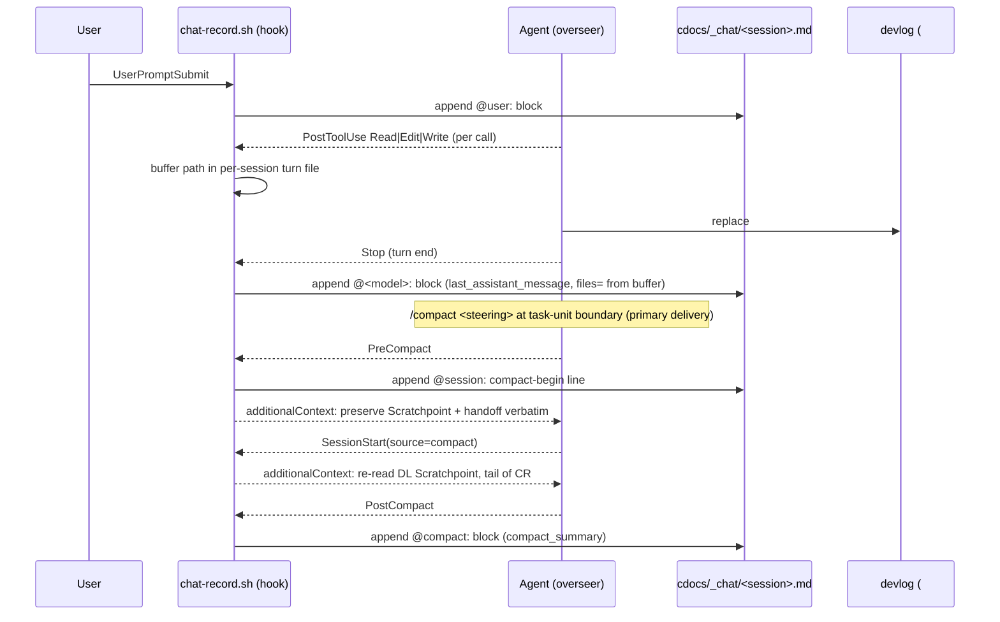

---
first_authored:
  by: "@claude-fable-5-1"
  at: 2026-09-22T18:27:04-07:00
task_list: meta/chat-record-devlog-management
type: proposal
state: live
status: implementation_ready
last_reviewed:
  status: accepted
  by: "@claude-opus-4-8"
  at: 2026-09-23T08:47:59-07:00
  round: 2
tags: [meta, tooling, context_persistence, hooks, devlog, orchestration, agent-memory]
---

# Chat Record, Scratchpoint, and Semantic Devlog Splitting

> BLUF(fable-5-1/chat-record-devlog-management): Build both layers.
> A hook-written, per-session, `@speaker:`-delimited **chat record** under `cdocs/_chat/` captures every user turn, assistant reply (with the files it read or edited), and compaction summary verbatim at zero LLM cost; a rolling agent-written **`## Scratchpoint`** block in the devlog captures dense working state every turn, including a one-line **gist per file touched** so a sibling agent can decide whether to re-read.
> Delivery across compaction is `/compact <steering>` first, with `PreCompact`, `SessionStart(compact)`, and `PostCompact` hooks as a second layer.
> Devlogs split at **closed-concern boundaries** into `-<concern>` chunk files with the root devlog as index, never at a byte count.
> A Phase-0 canary (seven sandboxed runs, evidence in [`_verify/2026-09-22-chat-record-hook-canary.md`](../devlogs/_verify/2026-09-22-chat-record-hook-canary.md)) confirmed every hook this design needs fires on Claude Code 2.1.280 headless, including `PostCompact`, which the research report assumed did not exist.
> The system makes the compaction summary's quality irrelevant to resumption and compaction rare; it does not prevent native auto-compaction in the top-level session.

## Summary

This proposal operationalizes the resolved design in [`2026-09-22-chat-record-scratchpoint-design.md`](../reports/2026-09-22-chat-record-scratchpoint-design.md) (the chat-record report) and the devlog-management half of the context-management roadmap (RFP-2).
It does not re-derive the research; it specifies file formats, hook contracts, rule and skill text, and a phased, testable rollout.

Three artifacts, each with exactly one writer:

| Artifact | Writer | Cadence | Location |
|---|---|---|---|
| Chat record | `chat-record.sh` hook (mechanical) | every user turn, assistant turn end (with a `files=` list of paths read or edited that turn), compaction | `cdocs/_chat/YYYY-MM-DD-<sid8>.md`, one file per session |
| Scratchpoint | the overseer or a durable specialist (agent) | every state-changing turn, replaced in place; carries a `files:` gist list (one line per important file: what it was useful for) | `## Scratchpoint` block in the devlog that agent owns |
| Devlog chunks | the devlog's author (agent) | at a handoff boundary when a concern has closed | `cdocs/devlogs/YYYY-MM-DD-<root>-<concern>.md`, root becomes index |

The chat record generalizes nothing that exists; it fills the gap the read-source report names ("`/compact` does not preserve full user history").
The scratchpoint generalizes the per-turn `overseer_thinness` columns in [`orchestration-discipline.md`](../../plugins/cdocs/rules/orchestration-discipline.md) (same per-turn, agent-authored, judge-observable pattern) with one deliberate change of storage shape: replace-in-place rather than additive append, because chronology now lives in the chat record and an append-only per-turn log would recreate the devlog-bloat failure mode.

> NOTE(fable-5-1/chat-record-devlog-management): The chat-record report treated `PostCompact` as an open feature request ([#14258](https://github.com/anthropics/claude-code/issues/14258)) and treated a `PreCompact` reliability gap on manual `/compact` ([#13572](https://github.com/anthropics/claude-code/issues/13572)) as a reason to keep hooks secondary.
> Both issues are now closed upstream (#13572 as stale, #14258 as shipped), and the official hooks reference lists `PostCompact` with `manual|auto` matchers (https://code.claude.com/docs/en/hooks.md); the canary adds the payload shape: on 2.1.280 `PostCompact` delivers the full `compact_summary`, and both `PreCompact` and `PostCompact` fired on manual and auto compaction headless.
> The primary/secondary ranking is kept anyway (see Design Decision 7) because the interactive `/compact` path was not exercised by the canary, not because any open issue reports it broken.

## Objective

Make the compaction summary's quality irrelevant to resumption, and make compaction rare, by ensuring that at any moment durable state exists that is at most one turn stale (capture), and that a fresh or post-compaction window is seeded from that state rather than from an opaque summary (delivery).
See "Relationship to native auto-compaction" for what this does and does not prevent.
Keep devlogs skimmable as workstreams grow by splitting them where the work itself has seams, so a resuming agent reads the one chunk relevant to its task rather than a 40KB chronology.

## Background

Read in this order; this proposal assumes their conclusions:

1. [`2026-09-22-chat-record-scratchpoint-design.md`](../reports/2026-09-22-chat-record-scratchpoint-design.md): resolves that capture (chat record plus scratchpoint) and delivery (compaction wrapping) are complementary, scopes the chat record to the top-level session and the scratchpoint to the overseer plus Pillar-3 durable specialists, and gives the 3-phase rollout adopted here.
2. [`2026-09-20-token-spend-by-role.md`](../reports/2026-09-20-token-spend-by-role.md) workstream 1: names the two capture sub-mechanisms and the hard dependency of cap-and-reseed (workstream 4) on them.
3. [`2026-09-19-devlog-methodology-value.md`](../reports/2026-09-19-devlog-methodology-value.md) recommendations 2 and 3: point compaction at the devlog rather than letting it run as a third summarization layer; past ~10-15KB or ~5 rounds a devlog stops being skimmable and should be split.
4. [`orchestration-discipline.md`](../../plugins/cdocs/rules/orchestration-discipline.md) Pillar 2 (handoff-before-compact, proactive cadence, reseed mechanism) and the Judge-Observable Thinness Signal (the `overseer_ctx_est`/`inline_work` columns this proposal generalizes).
5. [`plugins/cdocs/skills/devlog/SKILL.md`](../../plugins/cdocs/skills/devlog/SKILL.md) and its `template.md`: the convention the scratchpoint block and the split rule extend.
6. The devlog mandate: root `CLAUDE.md` ("IMPORTANT: Always create a devlog") and the "Devlog Convention" section of [`writing-conventions.md`](../../plugins/cdocs/rules/writing-conventions.md).
   The brief named `cdocs/rules/cdocs.md` as a candidate location; that path does not exist in this repo (the source repo loads rules via `@plugins/cdocs/rules/` imports), so the mandate is cited from its actual locations.
7. Existing hook plumbing: [`plugins/cdocs/hooks/hooks.json`](../../plugins/cdocs/hooks/hooks.json), [`inject-rules.ts`](../../plugins/cdocs/hooks/inject-rules.ts) (the `additionalContext` nudge pattern), and the sandbox-testing recipe in [`plugins/cdocs/README.md`](../../plugins/cdocs/README.md) "Sandbox testing notes".
8. [`2026-09-01-devlog-autoflush-hook.md`](2026-09-01-devlog-autoflush-hook.md): an RFP stub whose open questions (can a hook force a write; which devlog is active) this proposal answers; it should be marked `evolved` into this one at Phase 1.
9. [`2026-09-22-shared-retrieval-cache-redundancy-check.md`](../reports/2026-09-22-shared-retrieval-cache-redundancy-check.md): drops the shared-cache RFP and splits its value in two halves.
   The **awareness** half ("was this file already read, and what is the gist") is cheap, proven, and folded into this proposal as the files-touched gist log.
   The **token-cost** half (putting agent A's file bytes into agent B's context) has no working mechanism on this platform and is explicitly not solved here; the gist log lets an agent decide whether to re-read, it does not make the re-read free.

### Non-Goals

- **Graphify-scoped retrieval.** A separate effort, already in progress elsewhere; nothing here depends on or designs it.
- **Shared retrieval cache and cross-agent read deduplication (the token-cost half).** Dropped per the shared-cache report; this proposal neither designs nor assumes any content-sharing mechanism and makes no claim that the gist log reduces the measured 97.4% cross-agent re-read figure.
- **Memory-tool integration.** Orthogonal per the chat-record report; a possible future storage backend, not adopted.
- **Post-hoc distillation of devlogs by a cheap model.** Rejected by the devlog-value report.
- **Chat records for dispatched subagents, in Phases 1 and 2.** The hook exits on every event whose payload carries `agent_id`, the field the hooks reference documents as "present only when the hook fires inside a subagent call", so top-level-only scoping rests on a documented guard rather than on the (also observed) fact that `UserPromptSubmit` does not fire for a subagent's dispatch prompt.
  A per-workstream record that includes dispatched legs is a Phase-3 design sketch, not built here.
- **Hook-enforced scratchpoint writing.** The scratchpoint is judgment-bearing; a hook can nudge, never author.
- **Redaction or secret scanning.** Chat records commit by default with no redaction pass; the exposure is accepted and documented (Design Decision 9).
  General redaction and secret scanning for committed cdocs artifacts is scoped separately in [`2026-09-23-chat-record-redaction-scanning-rfp.md`](2026-09-23-chat-record-redaction-scanning-rfp.md) and nothing here attempts it.

## Proposed Solution

### Layer map



### Chat record

#### Location and naming

`cdocs/_chat/YYYY-MM-DD-<sid8>.md`, one file per Claude Code session, where `YYYY-MM-DD` is the local date of the session's first recorded event and `<sid8>` is the first eight hex characters of `session_id`.
Example: `cdocs/_chat/2026-09-22-13ee1efb.md`.

The hook locates the file by glob, `cdocs/_chat/*-<sid8>.md`, never by recomputing the date (a `--resume` the next day must land in the same file), and creates it only when the glob is empty.
The first line of every file is `@session: <ts> start source=startup sid=<full session_id> cwd=<cwd>`; when the glob hits a file whose first line carries a different `sid=`, the hook falls back to the full id in the filename (`YYYY-MM-DD-<session_id>.md`) rather than appending to a stranger's record.
A same-day 32-bit prefix collision is negligible in probability, but the hook must never be silently wrong about it.

Why per session rather than per `task_list`: the hook knows `session_id` on every event and knows nothing about workstreams; `--resume` continues a session under the same id (per `claude --help`), so a resumed session keeps appending to the same file; and a session is the unit that compaction acts on.
The link from workstream to chat record is made the other way: the hook tells the agent its chat-record path via `additionalContext` on the first prompt of the session and on every post-compaction `SessionStart`, and the agent records it in the devlog (`## Chat Record` pointer in the index devlog, see Scratchpoint section).

Why an underscore directory at the top level: `cdocs/_media/` already marks non-document assets; chat records are mechanical artifacts, not authored documents, so they carry no frontmatter and are excluded from the frontmatter-validation regex (`cdocs/(devlogs|proposals|reviews|reports)/`) and from the cdocs-subagent edit-path allowlist, both of which match only the four typed directories.
No frontmatter-spec change is needed; the spec gains one line noting `_chat/` alongside `_media/`.

Chat records are committed, like devlogs, because durable state that must survive a fresh session or a sibling worktree is worthless untracked (the bare-repo layout in `CLAUDE.md` makes this explicit).

**Commit protocol.** The record grows on every turn, so the working tree is dirty at every moment a commit happens.
Therefore: the overseer stages the record by explicit path at each handoff (`git add cdocs/_chat/<file> cdocs/devlogs/<devlog>`), in the same devlog-class bookkeeping commit as the devlog; dispatched agents never stage `cdocs/_chat/` (no `git add -A`, no `git commit -a`, no "commit everything" step touches it), and their briefs say so.
A commit made mid-turn is stale by the next `Stop`; that is expected, the record is append-only and the next handoff commit catches up.
This is the carve-out to Pillar 1's "the overseer does not commit code itself": devlog and chat-record commits are bookkeeping the overseer already performs, not code commits.

> WARN(fable-5-1/chat-record-devlog-management): A committed chat record has three leak channels, not one: text a human pastes into a prompt; `@<model>` bodies, where an assistant that echoes a `.env` value, a token from a tool result, or a credential path writes it to git with no human paste involved; and `@compact` summaries, which condense exactly the tool outputs this design tells compaction to drop and run 7-9KB each under auto-compaction.
> Maintainer decision (2026-09-23): commit by default, no redaction pass in the hook; the exposure is accepted and documented here rather than mitigated.
> General redaction and secret scanning is deferred to [`2026-09-23-chat-record-redaction-scanning-rfp.md`](2026-09-23-chat-record-redaction-scanning-rfp.md).
> Opt-outs: the hook honors `CDOCS_CHAT_RECORD=off` (no writes at all), and a project may add `cdocs/_chat/` to `.gitignore` to keep records local at the cost of cross-worktree and cross-session durability.

#### Block grammar

A chat record is a sequence of blocks.
Each block is a header line at column 0 followed by a body that runs to the next header line or end of file.

```
HEADER_RE := ^@[A-Za-z0-9][A-Za-z0-9._-]*:          ; the ONE pattern both writer and reader use
record    := block*
block     := header "\n" body
header    := HEADER_RE (" " meta)? "\n"              ; column 0, no leading whitespace
meta      := timestamp (" " key "=" value)*          ; timestamp is ISO 8601 with offset
value     := bare-token | "\"" qchar* "\""           ; quote when the value has spaces, "=", "," or "\""
qchar     := any char except "\"" "\\" LF CR | "\\\\" | "\\\"" | "\\n" | "\\r"
body      := line*                                   ; verbatim, may contain blank lines and fences
```

Rules that keep the grammar unambiguous:

- **`HEADER_RE` is the single split and escape test.** A line is a header if and only if it matches `HEADER_RE` at column 0 with no preceding backslash; whatever follows the colon on a real header is parsed as `meta` (an empty or malformed `meta` is still a header, with the tail kept as opaque text).
  The writer escapes any body line matching `^\\*HEADER_RE` by prefixing one backslash, so `@alice: can you look at this`, a LESS `@brand-color: #333;`, a CSS `@page:first {`, and a pasted `@user: ...` first line are all escaped even though none carries a timestamp; the reader strips exactly one leading backslash from any line matching `^\\+HEADER_RE`.
  Both tests use the same prefix, so writer and reader can never disagree about where a block ends.
  The transform is applied to every body line regardless of fence state, so parsing is stateless and round-trips verbatim.
- **Quoted values have exactly four escapes.** Inside `"..."`, `\\` and `\"` are the only escapes for `\` and `"`, and a literal newline or carriage return in a value (a pasted multi-line `/compact` instruction, a path with a quote) is written as the two-character sequences `\n` and `\r`.
  The reader unescapes those four and nothing else.
  This is what keeps "metadata lives on the header line only" true.
- **CRLF is normalized.** The writer converts `\r\n` to `\n` in bodies before the escape pass, so a pasted Windows transcript cannot carry `\r` into the header test.
- **Metadata lives on the header line only.** A body never carries metadata; a following line is always content.
  This keeps the header regex the single thing a reader needs.
- **Block separation is by header, not by blank line.** The writer emits one blank line after each body for readability; the reader strips trailing blank lines from a body.
  Multi-paragraph and fenced content inside a body needs no delimiter because only the next header ends it.
- **No collision with cdocs markdown.** `#` headings, `>` callouts (`BLUF`, `NOTE`, `WARN`), `|` tables, `-` lists, and fences never begin with `@`, and column-0 `@` is not markdown syntax (it renders as text).
  Chat records are never embedded in other cdocs documents except inside a fenced code block; the devlog skill says so.

Speakers:

| Speaker | Written on | Body |
|---|---|---|
| `@user` | `UserPromptSubmit` with a human prompt | the prompt, verbatim |
| `@harness` | `UserPromptSubmit` whose prompt is a harness envelope (see Edge Cases) | the prompt, verbatim |
| `@<model-short>` (e.g. `@opus-4-8`, `@fable-5-1`, `@haiku-4-5`) | `Stop` | `last_assistant_message`, verbatim |
| `@assistant` | `Stop` when the model id cannot be determined | same |
| `@compact` | `PostCompact` | `compact_summary`, verbatim |
| `@session` | `SessionStart`, `PreCompact`, `SessionEnd` | empty; the header's metadata is the content |

`<model-short>` is the model id with the `claude-` prefix and any trailing `-YYYYMMDD` stripped: `claude-haiku-4-5-20251001` becomes `haiku-4-5`, `claude-opus-4-8` becomes `opus-4-8`.
The id comes from two sources in order: the `model` field of the most recent `SessionStart(source=compact)` payload, cached per session in the runtime dir, then the last `assistant` entry's `message.model` in the transcript; `@assistant` only when neither exists.
Slash-command turns are captured as the raw invocation string (`/cdocs:propose-revise --first-round ...`), not the expanded skill body, which is short and exact; built-in `/compact` fires no `UserPromptSubmit` at all and is represented by the `compact-begin` line instead.

Header metadata, all optional after the timestamp: `n=<ordinal of this speaker's blocks in the file>`, `p=<first 8 hex of prompt_id>` (correlates a `@user` block with its `@<model>` reply), `files="<list>"` on `@<model>` blocks (below), `trigger=manual|auto` on `@compact` and `compact-begin`, `source=startup|resume|compact|clear` and `reason=` on `@session`, `instructions="<custom_instructions>"` on `compact-begin` when `/compact <text>` was used.

**`files=` (the mechanical half of the gist log).** A quoted, comma-separated list of the files the assistant read or edited during that turn, each prefixed by its access mode: `r:` read in full (`Read`), `w:` written or edited (`Edit`, `Write`, `NotebookEdit`), `rw:` both.
Paths are relative to `cwd` when under it, absolute otherwise, deduplicated, in first-touch order.
Example: `files="r:plugins/cdocs/hooks/hooks.json,rw:plugins/cdocs/hooks/chat-record.sh"`.
This is ground truth about *which* files the top-level agent's own turn touched, written by the hook from `PostToolUse` events (verified, Phase 0); it says nothing about *why*, which is the Scratchpoint's `files:` gist list.
`PostToolUse` also fires inside dispatched subagents (with `agent_id` set; verified by the round-1 review and documented in the hooks reference), and the hook drops those events, so a reviewer's reads never appear on the overseer's block.
Reads that bypass the `Read` tool (a `cat` inside `Bash`, a haiku-wrapper dispatch) do not produce a matching event at all; the agent's gist list covers those when they mattered.
The path field is `tool_input.file_path`, or `tool_input.notebook_path` for `NotebookEdit`.
`NotebookEdit` is in the matcher by analogy to `Edit`/`Write`; the canary exercised `Read` and `Edit` only, so its `PostToolUse` firing and field name are an assumption the Phase-1 tests must confirm, not a verified fact.

Example (a composite assembled from Phase-0 runs 2, 4, and 7, since no single run wired every event; bodies abbreviated):

```
@session: 2026-09-22T18:24:38-07:00 start source=startup cwd=/tmp/.../proj4

@user: 2026-09-22T18:24:39-07:00 n=1 p=407cc386
Reply with exactly the word: alpha

@haiku-4-5: 2026-09-22T18:24:40-07:00 p=407cc386 files="r:a.txt,rw:b.txt"
alpha

@session: 2026-09-22T18:24:40-07:00 compact-begin trigger=manual

@compact: 2026-09-22T18:24:52-07:00 trigger=manual
<analysis>
This conversation is extremely brief. ...
</analysis>

@user: 2026-09-22T18:24:53-07:00 n=2 p=8c1e02aa
WITHOUT using any tools: list every string of the form MARKER_<WORD>_<DIGITS> ...
```

#### Hook contract: `plugins/cdocs/hooks/chat-record.sh`

One bash script, dispatched by event name as its first argument, registered in `hooks.json` under seven events.
Bash plus `jq`, not `tsx`: `UserPromptSubmit` runs on the critical path of every prompt and `npx tsx` startup is measurable, while the existing shell hooks show the pattern.

| Event | Matcher | Writes | Emits |
|---|---|---|---|
| `SessionStart` | (all) | `@session ... start source=<source>`; creates the file on first event | on `source=startup\|resume`: `additionalContext` naming the chat-record path. On `source=compact`: the post-compaction reseed pointer (below) |
| `UserPromptSubmit` | (all) | `@user` or `@harness` block | nothing (never `decision: block`) |
| `PostToolUse` | `Read\|Edit\|Write\|NotebookEdit` | nothing in the record; appends `<mode>:<path>` to a per-session turn buffer at `${XDG_RUNTIME_DIR:-/tmp}/cdocs-chat/<session_id>.turn`; when the path matches `cdocs/devlogs/*.md` and the tool is `Edit` or `Write`, also records it as the session's active devlog in `<session_id>.devlog` | nothing |
| `Stop` | (all) | `@<model>` block from `last_assistant_message` (the final text block of the turn, not every text the model emitted between tool calls) with `files=` built from the turn buffer, which is then cleared; skipped when the message is empty (the buffer still clears) | nothing |
| `PreCompact` | `manual\|auto` | `@session ... compact-begin trigger= instructions=` | the pre-compaction nudge (below) |
| `PostCompact` | (all) | `@compact` block from `compact_summary` | nothing |
| `SessionEnd` | (all) | `@session ... end reason=<reason>` | nothing |

Invariants:

- **`agent_id` guard, first thing on every event.** If the payload carries `agent_id`, exit 0 before any read or write.
  The guard is defensive on all seven registered events, but the load-bearing case is `PostToolUse`: it is the only Phase-1 event that carries `agent_id` in practice, because tool events fire inside dispatched subagents with `agent_id` and `agent_type` set (hooks reference; round-1 review Run A, reproduced in the `_verify` artifact), while plain `Stop` fires only for the top-level agent (`agent_id: null`, run 5) and a subagent's turn end is `SubagentStop`, which Phase 1 does not register.
  Without the guard an overseer turn that dispatched a reviewer would end with `files="r:<everything the reviewer read>"`.
  This guard is also what makes the chat record top-level-only.
- Always exit 0; a chat-record failure never blocks or slows the user.
  Errors go to stderr only.
- No `cdocs/` directory under `cwd`, or `CDOCS_CHAT_RECORD=off`: exit silently before any write, mirroring `inject-rules.ts`.
- Appends use `>>` (`O_APPEND`) with the whole block written in one `printf`, so concurrent events (a `Stop` racing a `SessionEnd`) interleave at block granularity, not mid-line.
- The hook is the chat record's only writer.
  Agents read chat records (`tail`, `Read` with an offset) and never `Edit` them; a cdocs subagent cannot even path-wise (`_chat/` is outside the edit-path allowlist), and the rule text says so for the main session.
- Model identity for `Stop` blocks comes from the cached `SessionStart(compact)` `model` field first, then best-effort from the transcript (`transcript_path` is in the payload; the last `assistant` entry's `message.model`), falling back to `@assistant`.
  The canary showed the transcript can lag the `Stop` event by a turn, which is harmless for the model id (it rarely changes) and is why the body comes from `last_assistant_message`, not the transcript.
- The captured assistant body is summary-shaped by rule, not by luck: the overseer discipline (Pillar 2 text, Phase 1) says the overseer ends every turn with a short turn summary as its final message, which is exactly the block `Stop` captures.

Pre-compaction nudge (`PreCompact` `additionalContext`, under 500 bytes):

> Compaction imminent (trigger=auto). Durable state: `<devlog>` (`## Scratchpoint` and the latest Completed/Decisions Made/Open Todos handoff) and `<chat record>` (N user turns). Preserve the Scratchpoint and handoff verbatim in the summary; drop tool outputs and file contents, they are re-readable.

Post-compaction reseed pointer (`SessionStart` with `source=compact`, `additionalContext`, under 500 bytes):

> Context was just compacted. Before continuing: Read `## Scratchpoint` and the latest handoff in `<devlog>`, then the last 5 blocks of `<chat record>`. Do not re-derive state from the compaction summary alone.

`<devlog>` is resolved per session, in three tiers: first the path in `${XDG_RUNTIME_DIR:-/tmp}/cdocs-chat/<session_id>.devlog`, which the `PostToolUse` hook wrote the last time this session `Edit`ed or `Write`d a `cdocs/devlogs/*.md` (the "active devlog" the autoflush RFP asked how to find, and per-session, so two sessions on one checkout cannot cross-contaminate); then `grep -l "<sid8>" cdocs/devlogs/*.md`, which finds the devlog whose `## Chat Record` section the agent wrote; then, as a last resort, the most recently modified `cdocs/devlogs/*.md` (excluding `_*/`) with mtime later than the session's first `@session` line.
If all three miss, the nudge names only the chat record and says "the devlog you own".

### Compaction steering (the primary delivery mechanism)

`orchestration-discipline.md` Pillar 2 gains a concrete instructions string.
An agent cannot invoke `/compact` ([#71803](https://github.com/anthropics/claude-code/issues/71803) is open), so the string is typed by the user, or printed by the Phase-3 `/cdocs:compact` skill for the user to run.
When the overseer reaches a task-unit boundary it writes the handoff, refreshes the Scratchpoint, commits, and ends its turn by asking for:

```
/compact Preserve verbatim from cdocs/devlogs/<devlog>.md: the ## Scratchpoint block and the latest Completed / Decisions Made / Open Todos handoff. Keep the paths cdocs/devlogs/<devlog>.md and cdocs/_chat/<record>.md and the last three user turns verbatim. Drop tool outputs and file contents; they are re-readable.
```

The `custom_instructions` field arrives in the `PreCompact` payload (verified, Phase 0), so the hook records the steering text used, which makes steering discipline auditable from the chat record.

### Relationship to native auto-compaction

This design does not obviate native auto-compaction for the top-level session, and it should not be read as trying to:

- Compaction cannot be prevented by the agent.
  `/compact` and `/clear` are user actions; agent-invokable compaction does not exist.
  In AFK `oversee` runs and headless `-p` sessions nobody types either, so auto-compaction is the only trimming mechanism there, and Phase-0 run 3 shows it firing four times in three minutes under a 100K window.
- Context growth is not fully agent-controlled: tool results, harness notifications, and reseeded rules arrive unbidden.
- Durable specialists (Pillar 3) are the exception.
  Their "compaction" is the ~1M sawtooth reset, and Phase 3's cap-and-reseed is a dispatch-level primitive the overseer does control, so for subagents the system genuinely can keep compaction from ever running.

What the design achieves instead: with a Scratchpoint at most one turn stale, a handoff, a chat-record tail, and a `SessionStart(compact)` pointer that says "read those, not the summary", compaction becomes a mechanical trimming event whose summary quality no longer determines resumption quality.
Auto-compaction stays as the safety net for unmanaged stretches, and its role shrinks to "trim when nobody checkpointed", which the Scratchpoint staleness signal makes visible to the judge.
Whether a hard `/clear` plus reseed from durable state beats steered `/compact` on the interactive path (no summarizer call, no 30-second pause, no 7-9KB `@compact` block) is an empirical question the Phase-2 A/B's third arm answers; if it ties, `/cdocs:compact` prints `/clear` plus a resume pointer instead of a steering string.

### Scratchpoint

A single `## Scratchpoint` H2 section in the devlog the agent owns, replaced in place on every state-changing turn, bounded by rule to at most 15 lines and at most 8 `files:` entries (older entries roll into the handoff at the next boundary):

```markdown
## Scratchpoint

- as_of: 2026-09-22T18:40:11-07:00 ctx: ~140K (10% inline)
- now: wiring PreCompact nudge; hook writes but additionalContext not yet confirmed interactively
- since_handoff: PostCompact exists on 2.1.280 and carries compact_summary; transcript lags Stop by one turn, so body comes from last_assistant_message
- open: interactive /compact check (#13572); model id when transcript is stale
- next: run interactive canary, then commit hooks.json entry
- files:
  - plugins/cdocs/hooks/hooks.json (rw): only three events wired today; SessionStart entry is the template for the new ones
  - plugins/cdocs/hooks/inject-rules.ts (r): the additionalContext emit shape and silent-exit guards to copy
  - plugins/cdocs/README.md#sandbox-testing-notes (r): the credential-copy recipe; nothing else in the README matters here
```

Fields: `as_of` (timestamp plus the context estimate that iterate's `overseer_ctx_est` column already asks for), `now` (current subtask), `since_handoff` (facts and decisions not yet in a handoff), `open` (threads), `next` (the single next action), and `files` (the gist log).

**`files:` (the judgment half of the gist log).** One line per important file read in full or edited since the last handoff, in the fixed shape `- <path> (<r|w|rw>): <one-line gist of what it was useful for or why it mattered here>`.
Its job is awareness, per the shared-cache report: a sibling or successor agent reads the gist and decides "does this cover me, or do I need the bytes", instead of re-reading blind.
It is not a token saver and must not be described as one; when a task needs real content (review, exact edits, verification), the agent re-reads regardless.
"Important" is the author's call: files skimmed for a `Glob` or `Grep` hit do not belong; the hook's `files=` on the chat record is the exhaustive complement if someone needs the full list.
At each handoff the current `files:` list rolls into the handoff's Completed subsection ("files touched" gains the gist one-liners), and the Scratchpoint's list restarts empty.
Writers: the overseer of any loop (`iterate`, `propose-revise`, `full-send`, `oversee`) and any Pillar-3 durable specialist, in the devlog it owns; a specialist that owns no devlog writes to the file its dispatch brief names.
Not writers: one-shot dispatched legs (their returned summary is their checkpoint, per the chat-record report).

Relationship to the existing thinness columns, stated plainly: this generalizes that pattern.
The columns are the per-turn, agent-written, judge-observable precedent; the Scratchpoint carries the same `ctx` estimate plus actual working state, outside the iterate loop as well as inside it.
The columns are not removed or replaced: inside `iterate` they remain the judge's bloat signal per row, and the Scratchpoint's `as_of` staleness becomes an additional input to the judge's existing `overseer_thinness` field: a Scratchpoint whose `as_of` is older than two Iteration Log rows, or absent, is written as `overseer_thinness: signal_missing`, the same value the judge already writes when the thinness columns are absent, so the judge agent's update in Phase 2 is one added condition, not a new field.
The one deviation from the precedent is storage shape: replace-in-place, not additive rows, because per-turn history is now the chat record's job and appending working state every turn would push the devlog toward the append-only chronology the devlog-value report identifies as the failure mode.

The index devlog also carries a two-line `## Chat Record` section: the path the hook announced, and the `@user` ordinal at the last handoff (so a resuming reader knows which tail to read).

### Devlog splitting at closed-concern boundaries

**When to look for a split.** At every handoff-before-compact boundary the author checks devlog size.
Past ~12KB (the midpoint of the devlog-value report's 10-15KB band) or past ~5 loop rounds, the author must look for a boundary.
The size is the prompt to look, never the place to cut.

**What a closed concern is.** A concern is a completed phase, a finished sub-loop of rounds, a resolved investigation or debugging arc, or a landed verification campaign.
It is *closed* when all three hold: (i) it has a heading of its own (H2 or H3) in the devlog; (ii) every Open Todo in the most recent handoff that names it is done, or has been moved into the root's current handoff; and (iii) no live table in the root still receives rows for it.
Two agents applying this test to the same devlog get the same answer, which is what makes the Phase-2 dry-run scoreable.

**Where to cut.** At a split, move **every** closed concern, one chunk per closed concern; a closed concern under ~3KB merges into the adjacent closed chunk, because a chunk should be worth opening alone.
Everything belonging to a concern moves with it: its Implementation Notes, Debugging Process, Changes Made rows, Verification evidence, and Iteration Log rows for a finished sub-loop.
Rows in shared tables (Changes Made, Verification) move with the concern that produced them; a row that belongs to two concerns stays in the root.
Open concerns and live tables (Iteration Log, Judge Log, Dispatch/Return Events, Steering Log for the active loop) stay in the root.
If no concern has closed, do not split: a large live section beats an arbitrary cut; instead move bulky pasted evidence to `cdocs/devlogs/_verify/` as the repo already does.

**Naming.** Chunk files are flat siblings: `cdocs/devlogs/YYYY-MM-DD-<root-slug>-<concern-slug>.md`, sharing the root's date prefix so chunks sort adjacent to their root (the existing `2026-09-01-overseer-alignment-phase{1..4}.md` precedent), with `first_authored.at` carrying the chunk's real creation time.
Concern slugs name the concern, not a number: `-phase2-hooks`, `-canary`, `-iterate-r1-r5`, `-debug-transcript-lag`.
No directory-per-workstream: the `{date}-{slug}.md` convention, the hook path regexes, and `/cdocs:status` all assume flat typed directories, and the index table below does the grouping job a directory would.

**The root becomes the index.** It keeps its frontmatter, Objective, `## Chat Record`, `## Scratchpoint`, the current handoff, live tables, and gains a `## Chunks` table:

```markdown
## Chunks

| chunk | concern | status | read this when |
|---|---|---|---|
| [-canary](2026-09-22-chat-record-devlog-management-canary.md) | Phase-0 hook canary, payload shapes | done | you need a hook's exact payload fields or the sandbox recipe |
| [-phase1-hooks](2026-09-22-chat-record-devlog-management-phase1-hooks.md) | chat-record.sh and hooks.json | done | you are touching the hook script or its tests |
```

The `read this when` column is the navigation contract: a resuming agent reads the root (index, Scratchpoint, handoff) and opens only the chunk whose trigger matches its task.

**Each chunk stands alone.** It has full frontmatter (same `task_list`, `status: done` because a closed concern is done by definition, so `/cdocs:triage` never flags a chunk as stale `wip`, plus `part_of: cdocs/devlogs/<root>.md`), an opening BLUF that does not depend on the root, and a first-line `> NOTE(author/workstream): Chunk of [<root>](<root>.md); see its Chunks table for siblings.` backlink.
`part_of` is a new optional frontmatter field with `review_of` semantics (a repo-root path); `/cdocs:status` and `/cdocs:triage` group by it.

## Important Design Decisions

1. **Both layers, firmly.** Compaction wrapping is delivery; chat record and scratchpoint are capture.
   Without capture, wrapping seeds from a devlog that is up to a task unit stale; without delivery, captured state is never read.
   Neither is redundant with the other, with `CLAUDE.md` reseed (static discipline, not dynamic state), or with the Dispatch/Return Events table and arc-state file (orchestration bookkeeping for a second session, not one agent's working notes).
2. **Turn-delimited markdown, not a schema.** `@speaker:` headers with inline metadata are readable by a human with `tail`, appendable by a shell one-liner, and parseable with one regex.
   JSONL would be easier for a program and worse for the two actual readers (a post-compaction agent and a human).
3. **One file per session at `cdocs/_chat/`.** The only key the hook has is `session_id`; sessions are the compaction unit; `_`-prefix marks a mechanical asset outside the typed-document directories, so no frontmatter and no validation or edit-path changes.
4. **Hook-only writer for the chat record; agent-only writer for the devlog.** Single-writer ownership (Pillar 1b) applied to artifacts: a hook `>>`-appending to a file an agent is `Edit`-rewriting would race.
   This is why the scratchpoint lives in the devlog, not in the chat record.
5. **Scratchpoint is replace-in-place.** History is the chat record's job; the scratchpoint is a bounded "current state" block so the devlog does not grow per turn.
   It generalizes the thinness-column pattern, keeps the columns, and changes only the storage shape.
6. **Semantic split, flat naming, root as index, `part_of` link.** A byte-count cut produces chunks that are meaningless to navigate; a closed concern is a unit someone will actually want to read alone.
   Flat naming keeps every existing path assumption intact; the `read this when` column replaces a directory hierarchy.
7. **`/compact <steering>` primary, hooks secondary, on the strength of what is verified, not on any reported breakage.** The canary confirmed hooks fire headless on 2.1.280 for manual and auto compaction; the interactive TUI `/compact` path is simply unverified (the issue once filed against it, [#13572](https://github.com/anthropics/claude-code/issues/13572), is closed as stale).
   Steering is verified interactive (read-source report) and costs nothing; hooks are defense-in-depth until the interactive check in Phase 1 passes, after which the ranking is a documentation note, not a design constraint.
8. **Bash plus `jq`, not `tsx`.** `UserPromptSubmit` runs before every prompt; `npx tsx` startup is measurable latency on the interactive path, and two of the three existing hooks are already shell.
9. **Committed by default, no redaction, explicit-path staging.** Untracked durable state does not cross worktrees or sessions.
   The three leak channels (pastes, assistant bodies, compaction summaries) are named in the `WARN` and accepted by maintainer decision; redaction is a separate workstream ([`2026-09-23-chat-record-redaction-scanning-rfp.md`](2026-09-23-chat-record-redaction-scanning-rfp.md)).
   The always-dirty tree is handled by protocol (overseer stages by explicit path at handoff; dispatched agents never stage `_chat/`), not by gitignoring.
10. **`Stop`-captured assistant turns are included.** `last_assistant_message` is in the payload at zero cost and is exactly what the user saw; without it the record is half a conversation.
    Tool calls, thinking, and tool results are deliberately not captured: they are the re-readable bulk compaction should drop.
11. **The gist log is split into a mechanical half and a judgment half, and claims only awareness.** The hook's `files=` list is exhaustive and free but knows nothing about relevance; the agent's `files:` gists know relevance but can forget a file.
    Together they answer "was it read, and what was it for" for a sibling agent, which is the half of the dropped shared-cache idea the redundancy-check report found cheap and valuable.
    The other half (content reuse without a re-read) is out of scope and unclaimed; the read-source report's transcript-granularity re-read measurement is the instrument to re-run after Phase 2 if anyone wants to check that the 97.4% figure moves (the report predicts it will not, materially).

## Edge Cases / Challenging Scenarios

- **Harness-generated prompts fire `UserPromptSubmit`.** Canary run 5 showed a background subagent's completion notification arrived as a second `UserPromptSubmit` with no human input; its prompt begins `<task-notification>` / `<task-id>...` (see the `_verify` artifact).
  The payload has no field distinguishing it, so the hook classifies by shape: a prompt whose first non-blank token is an opening tag from a known harness set (`<task-notification`, `<system-reminder`, and whatever the Phase-1 implementer observes) is `@harness`; anything else, including a human pasting HTML, is `@user`.
  Allowlist, not "starts with `<`", to avoid mislabeling humans.
- **Slash commands.** A user-defined or plugin command fires `UserPromptSubmit` with the raw invocation string and is recorded as such; built-in `/compact` fires none (run 2) and is represented by `compact-begin`; `/clear` and `/resume` side effects on `UserPromptSubmit` and `session_id` are a Phase-1 verification item.
- **Body content that looks like a header.** A user pasting a chat record (whose very first line is `@user: ...`), or an assistant quoting one, is handled by the backslash escape; round-trip is a Phase-1 unit test with adversarial input (a prompt whose first line matches `HEADER_RE`, headers inside fences, lines starting with `\@`, empty bodies, a multi-line `instructions=` value, a `files=` path containing `"`, CRLF input).
- **Transcript lag on `Stop`.** Observed: the first `Stop` of a session found no assistant entry in the transcript and the second found the previous turn's.
  Body comes from `last_assistant_message`; only the model id is transcript-derived, with `@assistant` as fallback.
- **`--resume` and `/clear`.** Resume keeps `session_id` and appends to the same file with a `@session ... start source=resume` line.
  `/clear` fires `SessionStart` with `source=clear`; whether the id changes is a Phase-1 verification item; either way the record is correct (same file continues, or a new one starts).
- **Two sessions on one checkout.** Per-session files never collide, and the active-devlog pointer is per session (runtime-dir file keyed by `session_id`), so the nudge names the right devlog; only the third-tier mtime fallback can cross sessions, and the nudge text always includes "the devlog you own".
- **Empty or tool-only turns.** `Stop` with an empty `last_assistant_message` writes nothing and clears the turn buffer.
- **Stale turn buffer.** A crash between `PostToolUse` and `Stop` leaves a buffer behind; the next `SessionStart` for that session id truncates it, and `SessionEnd` removes it.
  Buffers live outside the repo (`$XDG_RUNTIME_DIR`), so nothing stale is ever committed.
- **Files touched outside the `Read`/`Edit` tools, or inside a subagent.** A `cat` in `Bash` or a `Glob`/`Grep` hit produces no matching event; a subagent's `Read` produces one that the `agent_id` guard drops.
  `files=` is therefore exhaustive only for the top-level agent's own use of the four matched tools, and the Scratchpoint gist is where the agent records the rest when it mattered.
- **Very large prompts or summaries.** Written verbatim; the file is read by tail and offset, never whole.
  No cap: truncation would defeat "lossless by construction".
- **Hook timeout or `jq` missing.** Timeout 5s on every entry; the script checks for `jq` and exits 0 silently without it, printing one stderr line.
- **Not a cdocs project.** No `cdocs/` under `cwd`: silent exit, no directory created.
- **Devlog with no closed concern at 20KB.** Do not split; move evidence to `_verify/`, tighten prose, and note in the Scratchpoint that a split is pending the next phase close.
- **Chunk needed while a sub-loop's tables are still live.** Only rows for finished rounds move; the live table stays in the root with a one-line pointer to the chunk holding earlier rows.
- **OpenCode and other targets.** The hook is Claude-Code-only; `build-opencode.ts` does not port it (no equivalent event surface is assumed).
  Rule and skill text (scratchpoint, splitting, steering string) delivers to OpenCode via `/cdocs:init` unchanged; where a target lacks `/compact`, Pillar 2's existing degradation ("start a fresh session from the handoff") now also says "and the chat record if one exists".

## Test Plan

**Phase 1, hook tests (`plugins/cdocs/hooks/tests/chat-record.test.sh`):**

- Headless sandbox run per the README recipe (sandboxed `CLAUDE_CONFIG_DIR` with copied credentials, out-of-repo `cwd` containing an empty `cdocs/`, `--model haiku`, never `--bare`), asserting after each scenario on the produced `cdocs/_chat/*.md`:
  - single prompt: one `@session start`, one `@user` (verbatim prompt), one `@<model>` (matches the `result` field of `--output-format json`), one `@session end`.
  - manual compaction via `--input-format stream-json` with a `/compact` message: `compact-begin trigger=manual` then `@compact trigger=manual` with a non-empty body, in that order.
  - auto compaction via `--autocompact 100000` and ~100K tokens of `Read`s: at least one `compact-begin trigger=auto` / `@compact trigger=auto` pair.
  - `Agent` dispatch: exactly one `@user` block (the subagent's prompt is absent).
  - `Agent` dispatch whose subagent `Read`s `a.txt` while the parent reads nothing: the parent's `@<model>` block carries no `files=` (the `agent_id` guard).
  - `Read a.txt`, `Read b.txt`, `Edit b.txt` in one turn: the `@<model>` header carries exactly `files="r:a.txt,rw:b.txt"`; a following turn with no file access carries no `files=`.
  - `NotebookEdit` on `n.ipynb`: the header carries `files="w:n.ipynb"` (this scenario is what turns the `NotebookEdit` assumption above into a verified fact; if the event does not fire or the field differs, the matcher and path lookup are corrected here, not worked around).
  - a project command `.claude/commands/echo.md` invoked as `/echo hello-world`: one `@user` block whose body is exactly `/echo hello-world`.
  - the `/compact` line in the stream-json scenario produces no `@user` block, only `compact-begin` and `@compact`.
  - `Edit` of `cdocs/devlogs/x.md` followed by a compaction: the `SessionStart(compact)` nudge names `cdocs/devlogs/x.md`, and the `SessionStart(compact)` payload's `model` field is present and cached.
  - `CDOCS_CHAT_RECORD=off`: no file created.
  - no `cdocs/` in `cwd`: no file created.
- Grammar unit test (pure shell, no Claude): escape/unescape round-trip on the adversarial fixture listed under Edge Cases (header-shaped first line, `@alice: hey`, LESS and CSS at-rules, headers inside fences, `\@` lines, empty body, multi-line `instructions=`, a path with `"`, CRLF); a reader that splits on `HEADER_RE` recovers exactly the input bodies and metadata values.
- Payload-shape guard: each event's required fields (`prompt`, `last_assistant_message`, `compact_summary`, `trigger`, `source`) present, so a Claude Code upgrade that renames a field fails loudly in the test rather than silently in production.

**Phase 1, interactive check (manual, once, recorded in the devlog with the resulting chat-record excerpt):** type `/compact` in a real interactive session with the plugin installed and confirm the `compact-begin` and `@compact` blocks appear; this is the [#13572](https://github.com/anthropics/claude-code/issues/13572) check the headless canary could not perform.

**Phase 2, scratchpoint and splitting:**

- Resumption-quality A/B (the gate for Phase 3), modeled on the Factory.ai anchored-iterative-summarization eval the devlog-value report cites: three real workstreams, a reset forced mid-task-unit (between handoffs), three arms per workstream: (1) carry indefinitely, i.e. resume from the native compaction summary alone; (2) steered `/compact` then resume from Scratchpoint plus handoff plus chat-record tail; (3) `/clear` then reseed from the same durable state with no summary at all.
  A fresh reviewer scores each resume on "correct next action, no re-litigated decision, no re-read of already-read files".
  Pass: arm 2 wins or ties arm 1 on all three workstreams.
  Decision rule for `/cdocs:compact`: if arm 3 ties arm 2, the skill prints `/clear` plus a resume pointer rather than a steering string, since a hard reset is then strictly cheaper.
- Split dry-run on the two largest existing devlogs (`2026-09-22-agent-dispatch-labeling.md`, 19KB; `2026-05-12-rule-delivery-regression-test.md`, 17KB): a fresh agent, given only the root index, is asked three task-scoped questions and must answer each by opening at most one chunk.
- `/cdocs:triage` and `/cdocs:status` recognize `part_of` and group chunks under their root.

**Phase 3:** covered under Implementation Phases, gated on the Phase-2 A/B.

## Verification Methodology

The implementer verifies hooks by reading the artifact they write, not by trusting the hook ran.
The canary recorder below is the reusable instrument; it logs every event with its full stdin payload, so a failing assertion shows the actual shape.

```bash
# canary.sh <Event>: append {"event","at","stdin"} to $CANARY_LOG; optionally emit additionalContext.
EV="$1"; IN="$(cat)"
printf '{"event":"%s","at":"%s","stdin":%s}\n' "$EV" "$(date -Is)" \
  "$(printf '%s' "$IN" | jq -c .)" >> "$CANARY_LOG"
exit 0
```

```bash
# Sandbox: fresh CLAUDE_CONFIG_DIR with settings.json wiring canary.sh to every event under test,
# plus copies of ~/.claude/.credentials.json and ~/.claude/.claude.json (README "Sandbox testing notes").
cd "$SANDBOX/proj" && CLAUDE_CONFIG_DIR="$SANDBOX/cfg" claude -p "<prompt>" --model haiku \
  --output-format stream-json --verbose --include-hook-events > out.jsonl
# manual compaction: --input-format stream-json with a {"type":"user",...,"content":"/compact"} line
# auto compaction:   --autocompact 100000 --permission-mode bypassPermissions and ~100K tokens of Reads
```

Two independent evidence channels, and they disagree in one useful way: the `--include-hook-events` stream emitted `hook_started`/`hook_response` for `SessionStart` and `UserPromptSubmit` but not for `PreCompact`/`PostCompact`, even though the canary log proves both ran.
The canary log is the ground truth for compaction hooks; the stream's `compact_boundary` system message (`pre_tokens`, `post_tokens`, `trigger`) corroborates that a compaction happened.

For the scratchpoint and splitting, verification is the A/B and the split dry-run above, both scored by a fresh agent, never by the author.

## Implementation Phases

### Phase 0: hook canary (done in this environment, 2026-09-22, Claude Code 2.1.280)

Prerequisite the brief required before Phase 1: confirm the hooks this design needs actually fire and behave, given three separate hook gaps surfaced in one session (`PostToolUse updatedToolOutput` and `PreToolUse updatedInput` dead for built-in Bash, and the then-open [#13572](https://github.com/anthropics/claude-code/issues/13572)).
Seven headless runs in a sandboxed `CLAUDE_CONFIG_DIR` with `--model haiku`; per-run `settings.json`, exact commands, stream-json inputs, canary-log lines, and model results are in [`cdocs/devlogs/_verify/2026-09-22-chat-record-hook-canary.md`](../devlogs/_verify/2026-09-22-chat-record-hook-canary.md), and the round-1 review independently re-derived every row and added two runs of its own ([`2026-09-22-review-of-chat-record-devlog-management.md`](../reviews/2026-09-22-review-of-chat-record-devlog-management.md), "Independent Verification"):

| Hook | How triggered | Fired | Payload facts relied on |
|---|---|---|---|
| `SessionStart` (startup) | `claude -p` | yes | `session_id`, `cwd`, `source=startup`; `additionalContext` reaches the model |
| `UserPromptSubmit` | `claude -p "<prompt>"` | yes | `prompt` verbatim, `prompt_id`, `session_id`; `additionalContext` reached the model (marker echoed back) |
| `UserPromptSubmit` inside a dispatched subagent | `Agent` tool dispatch | **no** (only the main-thread prompt fired) | scoping to the top-level session is mechanical |
| `UserPromptSubmit` on a background-subagent completion | background `Agent` | yes, a second firing with no human input | motivates the `@harness` speaker |
| `Stop` | turn end | yes | `last_assistant_message` (matches the printed result), `prompt_id`, `transcript_path`; no model field; transcript lags by a turn |
| `SubagentStart` / `SubagentStop` | `Agent` dispatch | yes | `agent_id`, `agent_type`, `agent_transcript_path`, `last_assistant_message` (not used by this design) |
| `PostToolUse` matcher `Read\|Edit\|Write\|Glob\|Grep` | `Read a.txt`, `Read b.txt`, `Edit b.txt` | yes, once per call, in order | `tool_name`, `tool_input.file_path`; plain `PostToolUse` firing is unaffected by the dead `updatedToolOutput` channel |
| `PostToolUse` inside a dispatched subagent | review Run A: foreground `Agent` whose subagent `Read`s a file | **yes, with `agent_id` and `agent_type` set** | the reason for the `agent_id` guard; the hooks reference documents this behavior |
| `UserPromptSubmit` on a user-defined slash command | review Run B: `claude -p "/echo hello-world"` | yes | `prompt` is the raw invocation string, not the expanded body |
| `PreCompact` (manual) | `/compact` via `--input-format stream-json` | yes | `trigger=manual`, `custom_instructions` (null when unsteered); [#13572](https://github.com/anthropics/claude-code/issues/13572) did not reproduce headless |
| `PreCompact` (auto) | `--autocompact 100000`, ~72K `pre_tokens` | yes, four times in one run | `trigger=auto` |
| `SessionStart` (compact) | both compaction paths | yes, between `PreCompact` and `PostCompact` | `source=compact`, `model`; `additionalContext` visible to the model after compaction |
| `PostCompact` (manual and auto) | both | yes | `trigger`, `compact_summary` (full summary text); `additionalContext` visible to the model after compaction |
| `SessionEnd` | process exit | yes | `reason` |

Result: **confirmed working** for every hook Phase 1 uses.
`PreCompact` `additionalContext` was also visible post-compaction (marker listed by the model); whether it arrived via the summarizer's input or by direct injection was not distinguished and does not matter for the nudge.
Built-in `/compact` sent as a user line fired no `UserPromptSubmit` (run 2).
Not verified: the interactive TUI `/compact` path (Phase 1 manual check), and behavior of `/clear` and `/resume` on `session_id` and `UserPromptSubmit`.

### Phase 1: capture, steering, nudge

Deliverables:

1. `plugins/cdocs/hooks/chat-record.sh` implementing the hook contract above, `agent_id` guard first; `hooks.json` entries for `SessionStart`, `UserPromptSubmit`, `PostToolUse` (matcher `Read|Edit|Write|NotebookEdit`, path from `file_path` or `notebook_path`), `Stop`, `PreCompact`, `PostCompact`, `SessionEnd` (timeouts 5s); the per-session `.turn`, `.devlog`, and `.model` files in the runtime dir.
2. `plugins/cdocs/hooks/tests/chat-record.test.sh` per the Test Plan, plus the grammar round-trip fixture.
3. `/cdocs:init` scaffolds `cdocs/_chat/` with a one-paragraph `README.md` (what it is, hook-written, do not edit, opt-outs).
4. `frontmatter-spec.md`: one line under "Media" noting `cdocs/_chat/` as hook-written, frontmatter-free, like `_media/`; `plugins/cdocs/README.md` "Hooks" gains the seven entries and the opt-outs.
5. `orchestration-discipline.md` Pillar 2: the steering string and who types it, the commit protocol (overseer stages devlog and chat record by explicit path at handoff; dispatched agents never stage `cdocs/_chat/`), the Pillar 1 carve-out sentence ("devlog and chat-record commits are bookkeeping commits, not the code commits Pillar 1 routes to subagents"), "after any compaction Read the Scratchpoint, handoff, and chat-record tail", the rule that the overseer ends every turn with a short turn summary as its final message, and the rule that agents never edit `cdocs/_chat/`.
6. `plugins/cdocs/skills/devlog/SKILL.md`: `## Chat Record` pointer section; chat records are quoted only inside fences.
7. Interactive `/compact` check, plus `/clear` and `/resume` behavior, recorded in the devlog.
8. Mark `2026-09-01-devlog-autoflush-hook.md` `status: evolved` with a pointer here.

Success criteria: all hook tests green, including the subagent-`Read` and slash-command scenarios; a real session in this repo produces a committed `cdocs/_chat/` file whose `@user` blocks match what was typed and whose `@<model>` `files=` lists contain no file a dispatched agent read; the interactive check shows both compaction blocks.

Constraints: do not touch `inject-rules.ts`, `validate-cdocs-edit-path.sh`, or `cdocs-validate-frontmatter.sh`; do not add `_chat/` to either path regex; never emit `decision: block` from any chat-record event.

### Phase 2: scratchpoint and semantic splitting

Depends on Phase 1 (the reseed pointer and steering string name the Scratchpoint).

Deliverables:

1. `orchestration-discipline.md`: a "Scratchpoint" subsection under Pillar 2 with the block format (including the `files:` gist list and its awareness-only framing), writer set, cadence, and the judge-observable staleness rule; the handoff format's Completed subsection gains the gist one-liners for files touched; Pillar 3 says durable specialists keep one in the devlog they own.
2. `plugins/cdocs/skills/devlog/template.md` gains `## Scratchpoint` and `## Chat Record`; `iterate`, `propose-revise`, `full-send`, `oversee`, and `implement` skills reference the rule (one line each, no restating); `agents/implementer.md` tells a warm implementer to maintain it.
3. `plugins/cdocs/skills/devlog/SKILL.md`: "Splitting a devlog" section with the trigger, the three-part closure test, the move-every-closed-concern and ~3KB-merge rules, naming, the Chunks table, chunk frontmatter (`status: done`, `part_of`) and backlink; Pillar 2's handoff step adds "check size; if past ~12KB, split every closed concern".
4. `frontmatter-spec.md`: optional `part_of`; `triage` and `status` skills group by it; `agents/judge.md` gains the Scratchpoint-staleness condition for `overseer_thinness: signal_missing`.
5. The three-arm resumption-quality A/B and the split dry-run from the Test Plan, results in the devlog.

Success criteria: A/B arm 2 wins or ties arm 1 on all three workstreams, and the arm-3 result is recorded as the `/cdocs:compact` decision input; the split dry-run answers each task question with at most one chunk opened; `cdocs-validate-frontmatter.sh` accepts chunk files unchanged.

Constraints: the `overseer_ctx_est`/`inline_work` columns and the judge's `overseer_thinness` field are not removed or renamed; the Scratchpoint is additive to them.
Do not introduce a directory-per-workstream layout.

### Phase 3 (gated on the Phase-2 A/B): cap-and-reseed and `cdocs:compact`

1. **Cap-and-reseed durable specialists** (token-spend workstream 4): Pillar 3 and the `iterate` skill gain a cutoff (starting value per that report's own caution, ~0.4-0.6M, tentative) at which the overseer has the specialist write a final Scratchpoint and handoff, then dispatches a fresh leg seeded from them plus a one-line pointer, instead of letting the specialist run to the ~1M sawtooth reset.
   This is fully agent-controllable today: no compaction primitive is involved, only dispatch.
2. **`/cdocs:compact` skill**: user-invoked; performs the checkpoint (Scratchpoint, handoff, commit of devlog plus chat record) and then prints the exact line for the user to run: `/compact <steering>`, or `/clear` plus a resume pointer if the Phase-2 arm-3 result says a hard reset ties, because agent-invokable compaction does not exist ([#71803](https://github.com/anthropics/claude-code/issues/71803) open).
   When that primitive ships, the skill's last step becomes the invocation itself.
3. **Per-workstream chat record (design sketch, not built here).** Maintainer direction (2026-09-23): nested chat records will be wanted soon, scoped per workstream, one record for the set of proposer, reviewer, and implementer legs working the same `task_list`, not one per subagent, because the point is context preservation for a workstream.
   The sketch below uses only mechanics Phase 1 already ships or the canary already verified; the gating items are at the end.

   *Scoping unit and key.* The key is `task_list`, resolved the same way the reseed pointer resolves the active devlog: the hook reads `task_list:` from the frontmatter of the session's active devlog (`<session_id>.devlog`, tier 1), so a session learns its workstream the first time it `Edit`s or `Write`s a devlog.
   Nothing new is written by an agent; the hook remains the only writer.

   *File layout: derive the workstream record, do not relocate files.* A session's file stays `cdocs/_chat/YYYY-MM-DD-<sid8>.md` (moving it after the key is learned would break the glob lookup and any devlog pointer already written).
   When the hook first learns the workstream it appends `@session: <ts> workstream ws=<task_list>`; the workstream record is then the ordered set `grep -l 'ws=<task_list>' cdocs/_chat/*.md`, which also covers a workstream resumed the next day in a new session, and it merges cleanly across worktrees because each session's file is distinct.
   A `cdocs/_chat/<task_list-slug>/` directory per workstream was considered and rejected for the relocation reason; `_chat/` is a mechanical asset directory, so the flat-naming argument from devlogs is not what decides this, the glob stability is.

   *Who writes the legs' blocks, and when.* Dispatched legs' events arrive in the parent session's hook process carrying the parent's `session_id` plus `agent_id`/`agent_type`, so the parent session's file is the natural home for their chronology and there is still exactly one writer.
   Phase 3 replaces the Phase-1 "exit on `agent_id`" with a `case` on the event: `SubagentStart` appends `@dispatch: <ts> agent=<agent_type>/<agent_id8>` with the dispatch prompt as body; `PostToolUse` with `agent_id` appends to a per-agent buffer `<session_id>.<agent_id>.turn`; `SubagentStop` appends `@return: <ts> agent=<agent_type>/<agent_id8> files="..."` with `last_assistant_message` as body, which for a one-shot leg is already its checkpoint summary.
   Sourcing the `@dispatch` body is the unsettled step: `PreToolUse` on the `Agent` tool would carry the brief as `tool_input.prompt` but no `agent_id`, while `SubagentStart` carries `agent_id` but (per run 5's key list) neither the prompt nor `agent_transcript_path`, which only `SubagentStop` delivers.
   So either the prompt is correlated from `PreToolUse` to the next `SubagentStart` (by dispatch ordering or a shared tool-use id, unspecified until canaried), or the `@dispatch` block is written lazily at `SubagentStop` time from the transcript's first user message, with `PreToolUse` as an optimization; gating canary (c) decides.
   The overseer's own `@<model>` blocks keep excluding subagent files, so the awareness split (who read what) is preserved, only now the legs' reads are recorded on the legs' own `@return` blocks instead of dropped.

   *What this adds beyond the Scratchpoint.* Chronology only: which briefs were dispatched in which order, what each returned, and what each read.
   The state half for durable specialists is already the Scratchpoint in the devlog they own; one-shot legs need nothing more than their `@dispatch`/`@return` pair, which is exactly the Dispatch/Return Events table's content captured mechanically rather than by the overseer's hand.

   *Gating and the Phase-3 canary.* (a) Phase 1's `agent_id` guard and active-devlog tracking landed (they are the same script); (b) a canary confirming that a durable specialist resumed by `SendMessage` fires a fresh `SubagentStart`/`SubagentStop` pair with the same `agent_id` (unverified; if it does not, the specialist's later turns need a different anchor); (c) `PreToolUse` on the `Agent` tool delivering `tool_input.prompt` in the parent, and how that prompt is correlated to the later `SubagentStart`'s `agent_id` given that `SubagentStart` carries neither the prompt nor `agent_transcript_path` (unverified; the answer picks between eager correlation and lazy write-at-`SubagentStop`); (d) evidence that workstreams actually span enough legs and sessions to need the derived record, which the Phase-1 records themselves will show.

Success criteria: a specialist reseeded at the cutoff continues without re-reading files its predecessor already read (measured by the reviewer on the next round); `/cdocs:compact` followed by the printed line produces a post-compaction or post-clear turn that acts on `next` from the Scratchpoint without re-orientation; the per-workstream sketch's canary items (b) and (c) have answers recorded before any implementation of item 3 begins.
