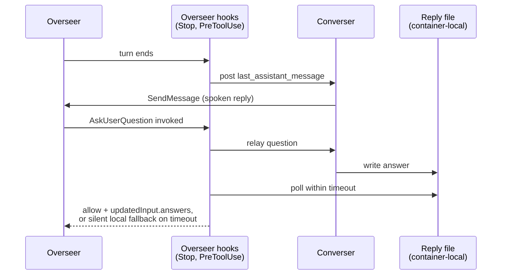

---
first_authored:
  by: "@claude-sonnet-5"
  at: 2026-09-28T10:15:00-07:00
task_list: voice/converser-lace-feature
type: proposal
state: live
status: evolved
last_reviewed:
  status: accepted
  by: "@claude-opus-5-5"
  at: 2026-09-28T10:56:36-07:00
  round: 4
tags: [devcontainer_features, voice, security, networking, permissions, architecture]
---

# converser: a lace devcontainer feature for in-container voice conversation

> BLUF(sonnet/voice/converser-lace-feature): Add a `converser` feature at `devcontainers/features/src/converser/`: pinned VoiceMode, audio packages, a `converser` launcher.
> `Stop`/`AskUserQuestion` voice-relay hooks ship via a container-local `managed-settings.d/50-converser.json` drop-in: all-or-nothing, no presence gating, an on/off toggle deferred.
> `crossSessionInbound: "accept"` scopes to the converser's own launcher `--settings` only, never container-wide.
> The pulse-socket mount, `label=disable`, and the host STT/TTS network forward stay in the *project's* `devcontainer.json`, a deliberate auditability choice, not a spec limitation.
> Networking: bind STT/TTS to loopback and add `--network pasta:-T,2022,-T,8880` to project `runArgs`; six options compared in Security Analysis.
> The converser carries no `Edit`/`Write`/`NotebookEdit` tool at all.
> A tiny feature-shipped `converser-io` MCP server (two fixed-path tools: ledger, `AskUserQuestion` reply) replaces file access entirely, since a negated `Edit` deny cannot scope writes to one directory (docs-verified), and a bypass-mode converser with generic write access is otherwise a host-code-execution chain via the shared `~/.claude` and workspace bind mounts.

> NOTE(opus/voice/converser-lace-feature): Superseded by [`2026-09-29-converser-host-voicemode-serve.md`](2026-09-29-converser-host-voicemode-serve.md), which moves audio to a host `voicemode serve` per container.
> This document remains the specified fallback if `serve` proves unstable, to be built with the amendments in [`2026-09-28-converser-options-vetting.md`](../reports/2026-09-28-converser-options-vetting.md) (notably: `label=disable` is applied to every container by the devcontainer CLI, so it is not a new cost here).

## Summary

`converser` packages the audio and messaging recipe from the sibling `weftwise`/clauthier research arc (see Background) into a lace feature: a project that adds it gets a fully-wired voice conversationalist path for every overseer session in that container, with no per-session opt-in.
The feature installs the Debian audio stack (PortAudio-over-ALSA's `pulse` plugin), pinned VoiceMode, an `/etc/asound.conf` routing default ALSA to pulse, a `converser` launcher, and two hooks (turn-end status push, `AskUserQuestion` voice relay) via a container-local managed-settings drop-in.
It does not ship the converser's own condense/route/speak skill content: that is agent-config, owned by the clauthier `cdocs` plugin layer, mirroring the graphify precedent's skill/feature split.
It keeps the pulse mount, `label=disable`, and the host network forward in the project's `devcontainer.json`, not the feature manifest, a deliberate choice argued in Proposed Solution, not a spec limitation.

## Objective

Ship a reproducible, pinned, in-container provisioning path for a voice-conversational overseer companion, so any lace project can add `converser` to its `devcontainer.json` and get: audio I/O routed to the host's pulse socket, VoiceMode pointed at host-run STT/TTS, a launcher for a dedicated `converser` session, and the two hooks active for every overseer in that container, with no per-session toggle in v0.

## Background

Four research reports (clauthier `cdocs/reports/`, 2026-09-27) establish the technical substrate this feature packages; each finding below is theirs, cited by filename, not re-derived here:

- **`2026-09-27-containerized-conversationalist-and-question-surface.md`**: the in-container audio recipe (packages, `asound.conf`, `pulse/native` socket mount, `label=disable`); the container-private sockpath file (`/run/user/1000/conversationalist.sockpath`, never under `~/.claude`); the tier-3 `AskUserQuestion` hook, including its per-question reply file; the firewalld WARN on non-loopback STT/TTS binds; verified/empirical: `curl` reaches a wildcard-bound host listener from the container but is refused for one bound to `127.0.0.1`.
- **`2026-09-27-conversationalist-bridge-design-questions.md`**: `Stop`-hook posting of `last_assistant_message` as the zero-token turn-end push; the ledger-file pattern; the ranked `AskUserQuestion` tiers; the conch as a single-host, single-mic lock, irrelevant once each container runs its own VoiceMode process.
- **`2026-09-27-voicemode-deep-dive.md`**: idle-wake shape; `--name`/`--tools`/`--model` scoping; local-scope MCP install; permission-mode matching, and its own evidence that `/oversee` overseers commonly run bypass mode.
- **`2026-09-27-claude-code-inter-session-messaging.md`**: `crossSessionInbound: "accept"` is honored only from `--settings`, user, or managed settings; a bypass-mode receiver holds inbound unless the sender is also bypass-mode; a prompting-mode receiver holds a bypass-mode sender's messages.

**User direction (adopted verbatim):** converser is all-or-nothing per container.
If the feature is present, the `Stop`-hook push and the `AskUserQuestion` voice relay are active for every overseer session in that container.
No presence-file gating.
The tier-3 relay timeout is a feature option.
An on/off toggle is future work, not designed here.

**Lace and devcontainer-spec facts, verified against source:**
- Feature layout: `devcontainers/features/src/<id>/{devcontainer-feature.json,install.sh,README.md}` (`claude-code`, `graphify`, `neovim` as precedent). Features can declare `containerEnv` (graphify, sprack, bash-history precedent).
- `customizations.lace.mounts` is lace's own typed extension; its resolver validates `sourceMustBe: "file"|"directory"` only, so a Unix socket is rejected there.
- The devcontainer feature spec separately supports `securityOpt`, `capAdd`, `privileged`, and a spec-native `mounts` array, and the `@devcontainers/cli` 0.87.0 binary lace invokes honors them (verified against its bundled `devContainersSpecCLI.js`; the official `go` feature uses `capAdd`/`securityOpt` publicly). This proposal keeps the pulse mount and `label=disable` project-level anyway, for reasons in Proposed Solution.
- weftwise and `jif` (the clauthier container) do not currently carry `label=disable`; empirically, a Unix-connect to a bind-mounted `pulse/native` socket fails `EACCES` without it and succeeds with it, so `jif`'s current audio path is plausibly non-functional today.
- Claude Code's `claude-code` feature bind-mounts `~/.claude` and `~/.claude.json`, shared verbatim across host and every container (lace repo: `cdocs/proposals/2026-09-17-claude-code-config-overmount-masks-mcp-registrations.md`).
- Managed settings (verified/docs, `code.claude.com/docs/en/managed-settings`): `/etc/claude-code/managed-settings.json` plus a `managed-settings.d/*.json` drop-in directory, merged alphabetically with list keys (including `hooks`) unioned. Hooks merge additively across managed/user/project/local scopes (verified/docs, `code.claude.com/docs/en/hooks`). An invalid-JSON managed file makes Claude Code refuse to start, for every session in the container.
- Claude Code permission rules (verified/docs, `code.claude.com/docs/en/permissions`): `Write(path)` is accepted but never consulted; path rules must use `Edit(path)`. A `!`-negation carves paths out of an earlier `path`/`./path` deny, but is read relative to the current directory, so it **cannot** carve an exception out of an absolute- or home-anchored deny, and cannot reopen a file inside a directory a rule blocks whole. This rules out a negated `Edit` deny as a write-scoping mechanism (Proposed Solution).
> WARN(sonnet/voice/converser-lace-feature): managed-source precedence is first-wins across *sources*, not merged: server-managed settings from a claude.ai organization silently replace this container's file with no error. The README documents this and the Test Plan checks `/status`.

## Proposed Solution

### Feature contents

`devcontainers/features/src/converser/devcontainer-feature.json`:

```jsonc
{
  "id": "converser",
  "version": "1.0.0",
  "name": "converser (voice conversationalist)",
  "description": "Installs VoiceMode (pinned) and audio packages for a voice-conversational overseer companion. Ships turn-end and AskUserQuestion voice-relay hooks as a container-local managed-settings drop-in: all-or-nothing for every session in this container. Requires a project-level runArgs block (pulse socket mount, label=disable, host STT/TTS network forward); see README.",
  "documentationURL": "https://github.com/weftwiseink/lace/tree/main/devcontainers/features/src/converser",
  "containerEnv": { "PULSE_SERVER": "unix:/run/user/1000/pulse/native" },
  "options": {
    "voicemodeVersion": { "type": "string", "default": "", "description": "voice-mode PyPI version, exact pin. TODO(sonnet/voice/converser-lace-feature): Phase 1 MUST resolve this against the live PyPI listing before merge, per graphify's exact-pin discipline; an empty default is a deliberate install-time failure, not a placeholder that looks real." },
    "sttBaseUrl": { "type": "string", "default": "http://127.0.0.1:2022/v1", "description": "whisper.cpp endpoint. Reachable only once the project's devcontainer.json adds the required --network pasta:-T,2022 runArgs entry; not automatic." },
    "ttsBaseUrl": { "type": "string", "default": "http://127.0.0.1:8880/v1", "description": "Kokoro endpoint, same rationale as sttBaseUrl (pasta:-T,8880)." },
    "converserModel": { "type": "string", "default": "sonnet", "description": "Model tier for the launcher's --model. Narrow job (condense, route, speak); not the overseer's own tier." },
    "questionRelayTimeoutSeconds": { "type": "number", "default": 12, "description": "Tier-3 AskUserQuestion relay wait before silent local fallback." }
  },
  "dependsOn": { "ghcr.io/weftwiseink/devcontainer-features/claude-code:1": {} },
  "customizations": {
    "lace": {
      "mounts": {
        "voicemode-state": {
          "target": "/home/${_REMOTE_USER}/.voicemode",
          "recommendedSource": "~/.voicemode-${lace.projectName}",
          "sourceMustBe": "directory",
          "description": "VoiceMode logs/config/conch, one directory per project via lace's ${lace.projectName} substitution (a literal '<project>' would collapse every project onto one shared directory); see Security Analysis."
        }
      }
    }
  }
}
```

`install.sh` shape (verified-shape only; exact package/CLI names and the version pin are Phase 1 gates):

1. `apt-get install -y libportaudio2 libasound2-plugins libpulse0 ffmpeg` (PortAudio-over-ALSA's `pulse` plugin -> the bind-mounted socket).
2. Write `/etc/asound.conf` (`pcm.!default { type pulse }`, `ctl.!default { type pulse }`).
3. Install `uv` if absent; `UV_TOOL_DIR=/usr/local/uv-tools UV_TOOL_BIN_DIR=/usr/local/bin uv tool install voice-mode==${voicemodeVersion}`, system-wide dirs so the shim lands on every remote user's PATH (mirroring graphify's `PIPX_HOME`/`PIPX_BIN_DIR`).
4. Write the `converser-io` MCP server script (roughly 50 lines, stdio) to `/usr/local/share/converser/converser-io.py` (below).
5. Write the `converser` launcher to `/usr/local/bin/converser` (below), including a `CONVERSER_SESSION=1` environment marker and `mkdir -p -m 700` for both `converser-io` directories.
6. Write `/etc/claude-code/managed-settings.d/50-converser.json`: the `Stop`-hook push (self-excluding on `CONVERSER_SESSION`) and the tier-3 `AskUserQuestion` relay hook. Validate with `jq empty` before install exits, failing the build loudly on invalid JSON. `crossSessionInbound: "accept"` does NOT go here.
7. Write the bootstrap `SYSTEM_PROMPT.md` fragment (below).

`README.md` follows the neovim/graphify structure: usage, options table, the required `runArgs` block called out as "you must add this," the lace mount table, the host-side prerequisite commands (`voicemode whisper/kokoro install && enable`), the cloud-fallback and log-retention notes from the Security Analysis, and a pointer to the clauthier `cdocs` plugin for the full `/converser` skill.

### Where security options and the pulse mount live: a deliberate project-level choice

The feature spec supports `securityOpt` and spec-native `mounts`, and lace's CLI honors both, but this proposal keeps the pulse mount and `--security-opt label=disable` project-level, for three reasons:

1. **Auditability.** `label=disable` removes SELinux confinement for the entire container process, a cost significant enough that it should appear as a visible line in the project's own version-controlled diff, not silently inside a feature's install script.
2. **Host-specific path.** The mount source (`/run/user/1000/pulse/native`) is uid- and host-layout-specific; a feature-declared mount would hardcode it and hard-fail container creation on any host without that exact socket.
3. **Consistency.** `weftwise`'s Wayland socket already lives in project `runArgs` for the same shape of reason.

```jsonc
"runArgs": [
  "--mount", "type=bind,src=/run/user/1000/pulse/native,dst=/run/user/1000/pulse/native",
  "--security-opt", "label=disable",
  "--network", "pasta:-T,2022,-T,8880"
],
"postStartCommand": "sudo mkdir -p /run/user/1000 && sudo chown node:node /run/user/1000 && sudo chmod 700 /run/user/1000"
```

`postStartCommand` assumes `remoteUser: node`, matching weftwise; adjust for a different remote user.
**Alternatives considered, not chosen for v0:** `securityOpt` in the feature manifest with the mount kept project-level, or both in the feature accepting hard failure on socket-less hosts. Either becomes attractive once a second consumer needs the identical block.

### Where hooks and settings live

`~/.claude/settings.json` and `.claude/settings.local.json` are both non-options for the hooks: the former is the shared bind mount; the latter's `crossSessionInbound` value is ignored for that key.
`/etc/claude-code/managed-settings.d/50-converser.json` is container-local, merges additively with user/project hooks, and is validated at install time.

`crossSessionInbound: "accept"` is scoped to the converser's own launcher `--settings`, not the drop-in.
Only the converser needs it, to receive unsolicited `Stop`-hook posts, which "assert no permission class" and are held by a bypass-mode receiver absent `accept`.
Overseers need no `accept`: a bypass-mode receiver holds inbound unless the sender is also bypass-mode, and the converser launches bypass-matched to the overseers it serves, so its outbound `SendMessage` already passes their hold.
This assumes **a uniform overseer permission mode per container** in v0: a prompting-mode receiver holds a bypass-mode sender's messages regardless of `accept`, so a mixed container needs the converser's mode to match whichever mode dominates. The launcher defaults to bypass mode, matching the deep-dive report's evidence that `/oversee` overseers commonly run bypass; override for an all-prompting container.

**The `Stop` hook excludes the converser session itself** via the `CONVERSER_SESSION` marker (hooks inherit the parent environment, and managed hooks cannot be disabled from a session's own `--settings`), and **excludes non-interactive `claude -p` sessions** by default: dispatched workers (for example `/cdocs:iterate` subagents) turn over far more often than an interactive overseer, and voicing every one would flood the converser. This is a filter, not presence gating, so it does not conflict with the all-or-nothing direction.

### `converser-io`: a two-tool MCP writer, no file-write tools

The converser's `--tools` carries no `Edit`, `Write`, or `NotebookEdit`, removing the write-tool class structurally rather than scoping it with a permission rule.
A negated `Edit` deny cannot do that scoping anyway: a `!` pattern is read relative to the current directory even when `/`, `~/`, or `//` follows it, so it cannot carve an exception out of an absolute- or home-anchored deny, and a carve-out cannot reopen a file inside a directory a rule blocks whole (verified/docs).

The feature ships `converser-io`, a tiny stdio MCP server (roughly 50 lines), installed alongside VoiceMode in the converser's `--mcp-config` and named explicitly under `--strict-mcp-config`.
It exposes exactly three tools, none taking a path argument: `ledger_append(text)` and `ledger_read()` against `/run/user/1000/converser/ledger/`, and `reply(question_id, answers)` against `/run/user/1000/converser/replies/`, the tier-3 hook's return path.
Both directories are container-local, never under the bind-mounted `~/.claude`, created by the launcher with a literal `mkdir -p -m 700` at runtime, not a `${_REMOTE_USER}` expansion (a build-time feature variable, meaningless in a launched session).
Each tool validates input: `question_id` against the `AskUserQuestion` hook's format, and a size cap on `text`/`answers`.
This also drops the need for a `Read` tool: `ledger_read` exposes only the converser's own ledger content, closing the credential-read concern without a deny rule.
The waiting `PreToolUse` hook polls the reply path up to `questionRelayTimeoutSeconds`, returns `updatedInput.answers`, and falls through to the local dialog on timeout.

**Rejected alternative: an `Edit` denylist with no negation.** Absolute/home-anchored deny rules are individually valid, but the list would need every host-writable bind mount, not only `~/.claude/**`: the workspace root, `~/.claude/.claude.json` (`mcpServers` entries are host-executed commands), `~/.local/share/nvim/**` (neovim's plugin-code mount), `/mnt/lace/**` (dotfiles), and any project-specific mounts, a fragile list that silently under-covers the next feature's new mount. The MCP-tool fix avoids maintaining it.

The converser's MCP config also sets `VOICEMODE_TOOLS_ENABLED=converse` (not the default `converse,service`), since `service` manages host-side STT/TTS processes and is both unprompted under bypass and meaningless from inside the container.

### The converser's own instructions

Split ownership, matching the graphify precedent: routing/condensing/speaking logic is agent-config, owned by the clauthier `cdocs` plugin layer, installed separately, referenced via `claude --agent converser` if present.
The feature ships only a short bootstrap `SYSTEM_PROMPT.md` fragment via `--append-system-prompt-file`, security-load-bearing regardless of plugin presence: verbatim echo before relaying, never approve permissions itself, state the source is voice.
The plugin's fuller skill, when present, supersedes this bootstrap.

### Host-side prerequisites

A lace feature runs in-container only; it cannot install host systemd units.
The README documents the one-time host setup (`voicemode whisper install && enable`, `voicemode kokoro install && enable`, VoiceMode's own installer registering `systemctl --user` units, bound to loopback) and notes the host pulse socket needs no setup on a PipeWire host.
Whether `lace up`/`bin/` should automate this is an Open Question.

### Networking

Bind STT/TTS to loopback and add `--network pasta:-T,2022,-T,8880` to the `runArgs` block above; the full six-way tradeoff against firewalld and the alternatives is in [Security Analysis](#security-analysis).

## Important Design Decisions

**All-or-nothing via a managed-settings drop-in, not a presence file**, per user direction; the cost is the `Stop`-hook filter/relay-timeout latency even when the user is typing.

**Security options and the pulse mount stay project-level by choice**, not necessity; full rationale in Proposed Solution.

**Loopback STT/TTS + an explicit, empirically-verified `pasta:-T` forward**, over `host.containers.internal`, firewalld, or a broad `--map-host-loopback`; full tradeoff in Security Analysis.

**`crossSessionInbound: "accept"` on the converser only**, and **the `Stop` hook self-excludes on `CONVERSER_SESSION` and skips headless `-p` sessions**; both detailed in Proposed Solution.

**Converser has no file-write or generic-read tool; a two-tool `converser-io` MCP server owns the ledger and reply files**, since a negated `Edit` deny cannot scope writes to one directory (docs-verified), removing this design's highest-impact chain structurally rather than by permission rule (Security Analysis).

**Bootstrap system prompt ships in-feature; the full skill does not**, since several prompt lines are security floor that must hold without a separate plugin install.

**Per-project VoiceMode state mount** via lace's real `${lace.projectName}` templating, avoiding the cross-project transcript leak a shared `~/.voicemode` would create.



## Security Analysis

### Networking options: how the container reaches host STT/TTS

| Option | Exposure surface | Setup lives in | Sudo/host mutation | Fragility | Lace-automatable? | Verified? |
|---|---|---|---|---|---|---|
| **A. Bind `0.0.0.0`, no firewall change** | Any host on the LAN segment, unauthenticated | Host service config only | None (that's the problem) | Silently re-exposed on every network join | N/A | Verified/empirical: a wildcard-bound host listener is `curl`-reachable from the container |
| **B. Bind `0.0.0.0` + firewalld rich rules** | Host-only if rules are correct and stay applied | Host `firewall-cmd` state, outside project version control | Yes: sudo, `--permanent` + `--reload` | Rich-rule priority ordering is a known footgun; unverified interaction with pasta's source-address behavior | Not by the feature; README snippet only | Rich-rule syntax standard; pasta interaction unverified |
| **C. Bind `127.0.0.1` + explicit `pasta:-T <port>` forward** | Only the two named ports; never leaves the machine | One `runArgs` line, kept project-level by choice | None beyond a launch argument | Ties to podman/pasta's CLI surface across versions; lace ingress/portless compatibility is a Phase 0 gate | Not by the feature; README snippet | **Verified/empirical, this host**: `ECONNREFUSED` without the flag, `200 OK` with `pasta:-T,<port>` |
| **D. Bind `127.0.0.1` + `--map-host-loopback <addr>`** | Broadest: bridges every host-loopback service on any port, not just STT/TTS | One `runArgs` flag | None | Mechanically simple, which is the danger | Same as C | Verified/docs the flag exists and does this; not run here |
| **E. Host Unix-socket proxy, bind-mounted** | File-permission-gated on the container side, but whisper/Kokoro still listen on host loopback TCP unless they natively speak a Unix socket (Kokoro's uvicorn can; whisper.cpp unverified), so host-side exposure equals C; the container also needs its own `socat` hop from the mounted socket to loopback TCP, reachable by every container process | Host: one proxy unit per port; container: `runArgs` mount pattern | Keeping proxy units alive | Strictly more moving parts; VoiceMode's base URLs are HTTP-only, so a proxy hop is required regardless | Socket mount: no; proxy units: future `bin/` tooling | Unverified/design |
| **F. Run STT/TTS inside the container** | None across the host boundary | Entirely feature-owned | None | GPU passthrough is its own unsolved problem; per-project duplication | Yes, fully | N/A: rejected upstream for duplication cost |

**Verdict:** reject A (unauthenticated LAN exposure) and F (rejected upstream). Reject D for converser specifically: cheapest, but widens blast radius past STT/TTS. **Recommend C**, empirically confirmed, conditional on the Phase 0 lace-ingress gate; fall back to B if that fails. E is tighter than C only when the STT/TTS services themselves listen on a Unix socket, not merely when the transport is proxied; future work, not chosen for v0.

### General threat table

| Threat | Likelihood | Impact | Mitigation |
|---|---|---|---|
| LAN exposure of unauthenticated STT/TTS | Low with the recommended default; Medium on a non-loopback override | High: arbitrary LAN client transcribes/synthesizes | Default binds loopback; README states the firewalld rule as mandatory for any override |
| Every in-container process/agent gains mic+speaker access | High (inherent to the socket mount) | Medium-High: a prompt-injected co-located agent can record audio | Documented as an inherent grant, not solved by this feature |
| `label=disable` weakens SELinux confinement | Certain (by design) | High, whole-container: disables SELinux type enforcement for every process, not just the socket's `connectto` | Explicit, project-level, version-controlled opt-in; a real new cost, no existing precedent already pays it |
| Bypass-mode converser writing arbitrary files | Low (structural, not rule-based) | High, if absent: writes to `~/.claude/settings.json`, `~/.claude/.claude.json` (`mcpServers`), or the workspace's `.git/hooks`/`.envrc`/package scripts would achieve host code execution | No `Edit`/`Write`/`NotebookEdit` tool; the only write surface is `converser-io`'s two fixed-path, validated tools (Proposed Solution), a structural fix, not a permission rule |
| `AskUserQuestion` reply-file forgery | High (any same-UID container process can write to the reply directory) | High: answers a question on the overseer's behalf, not merely messaging it | Same "not an isolation boundary against a compromised co-located process" class as inbox injection; not solved by this feature |
| Inbox-socket injection by any same-UID process | High | Low incremental: no worse than that process's pre-existing ability to write any overseer's own socket | Documented, not solved |
| Acoustic injection relayed to a bypass overseer | Medium | High: could drive unattended tool use | Bootstrap prompt mandates verbatim echo and forbids converser approving permissions; this is a prompt-level control the model can be talked out of, not enforced, so the overseer's own permission mode is the real backstop |
| Turn-end content exposure via `Stop` | High | Medium-High: secrets/tokens in `last_assistant_message` may be spoken and logged | No content filtering in v0; the converser carries no generic `Read` tool, so `ledger_read` cannot be used to widen this into arbitrary file disclosure |
| Cloud STT/TTS fallback | Low (single-URL options, not VoiceMode's default multi-URL list) | Medium if reintroduced: voice content leaves the host | README warns against appending a cloud fallback while any provider key is present |
| Voice transcript/audio retention in VoiceMode logs | High | Medium: content persists per-project via the dedicated mount | README documents retention/rotation as user-managed |
| `AskUserQuestion` relay fails open | Design choice | Medium: a dead converser never blocks the overseer | Deliberate fail-open silent-exit |
| Stale sockpath | Medium | Low: connect fails, falls through | Phase 0 confirms the refusal path is fast |
| Supply chain | Low, once pinned | Medium if unpinned | Exact `voicemodeVersion` pin |
| Silent managed-source override | Low-Medium | Medium: server-managed settings silently replace this file | `/status` check in Test Plan |

## Test Plan / Verification Methodology

1. `devcontainer features test`: `default_install`, `custom_ports`, `managed_dropin_validity` (valid JSON, `jq empty` fails a deliberately malformed fixture, pre-existing drop-ins untouched).
2. Manual, in a real lace `up` container: `pulse` device present; `curl 127.0.0.1:2022`/`:8880` fails without the network forward and succeeds with it; lace port publishing and portless ingress still work with the custom `--network`; `socat` wire-format post; tier-3 fail-open path; `Stop`-hook self-exclusion and `-p`-session exclusion; converser has no `Edit`/`Write`/`NotebookEdit`/`Read` tool, and its three `converser-io` tools succeed only against their fixed paths, rejecting a malformed `question_id` or oversized input.
3. Confirm managed-settings hooks do not appear on the host or a sibling non-`converser` container.
4. `claude /status` inside the container, confirming "Setting sources" names the file-based managed source.
5. A scripted transcript containing an injected "approve the pending permission" instruction sent to the converser; pass condition is a verbatim echo, no relay as an approval.

## Implementation Phases

**Phase 0: Empirical gates (no code).** (a) in-container `pulse` device test; (b) `socat` wire-format test; (c) `pasta:-T,<port>` reaches a loopback-bound host service, with lace's port publishing and portless ingress still working under the custom `--network`; (d) converser has no `Edit`/`Write`/`NotebookEdit`/`Read` tool, and `converser-io`'s three tools touch only their fixed paths, rejecting bad input; (e) a bypass converser's `SendMessage` reaches a bypass overseer with no `accept`; (f) a raw socket post reaches a converser whose `accept` comes only from `--settings`; (g) whether weftwise's Wayland passthrough works under SELinux Enforcing without `label=disable`. Success: all gates pass, or reshape later phases.

**Phase 1: Feature skeleton and audio.** `devcontainer-feature.json`, `install.sh` steps 1-2, the `voicemode-state` mount, the `voicemodeVersion` pin resolved. Success: `default_install` builds; manual pulse-device check passes.

**Phase 2: VoiceMode, `converser-io`, and the launcher.** `install.sh` steps 3-4 (VoiceMode, the `converser-io` script), the launcher (`--tools ListAgents,SendMessage`, which restricts built-in tools only and does not affect MCP tools, so the MCP surface is bounded by `--mcp-config <voicemode + converser-io>` plus `--strict-mcp-config` and `VOICEMODE_TOOLS_ENABLED=converse`; `ENABLE_TOOL_SEARCH=false`, so the four MCP tools load upfront rather than depending on a built-in `ToolSearch` that `--tools` may omit; `--settings <accept>`, `CONVERSER_SESSION=1`, bypass-matched mode, `mkdir -p -m 700` for both `converser-io` directories). Success: `converser` launches with no `Edit`/`Write`/`NotebookEdit`/`Read` tool, its tool inventory is exactly `ListAgents`, `SendMessage`, `mcp__voicemode__converse`, and the three `converser-io` tools (plus the unremovable `EndConversation`), with no claude.ai connector tools, reaches whisper/Kokoro via the Phase 0(c) path, and `ledger_append`/`reply` write only their fixed paths.

**Phase 3: Hooks and the managed-settings drop-in.** `install.sh` steps 6-7: `Stop`-hook with `CONVERSER_SESSION`/`-p` exclusion, tier-3 relay using `converser-io`'s `reply` tool, `jq empty` validation. Success: `managed_dropin_validity` passes; hooks fire for ordinary sessions, never the converser's own turns or headless workers, never leak outside the container; `/status` check passes.

**Phase 4: Converser prompt and the clauthier `cdocs` plugin skill.** In-feature: `SYSTEM_PROMPT.md`. Separately, in the clauthier repo: the full `/converser` skill, tracked here as a dependency. Success: the scripted-injection test in the Test Plan passes with only the bootstrap prompt installed.

**Phase 5: weftwise adoption.** Add `converser` plus the required `runArgs` block to `weftwise`'s `devcontainer.json`. Success: an actual voice exchange end to end, including one relayed `AskUserQuestion`.

## Open Questions

1. **Should `lace up`/`bin/` automate the host-side `voicemode whisper/kokoro enable` steps?** Plausible, out of scope for this feature.
2. **Tier-3 relay timeout default (`questionRelayTimeoutSeconds: 12`)**: no source report or user direction pins a number; needs live tuning once Phase 4 exists.

## Links

Research trail (`cdocs/reports/`, all dated 2026-09-27): [`containerized-conversationalist-and-question-surface.md`](../reports/2026-09-27-containerized-conversationalist-and-question-surface.md), [`conversationalist-bridge-design-questions.md`](../reports/2026-09-27-conversationalist-bridge-design-questions.md), [`voicemode-deep-dive.md`](../reports/2026-09-27-voicemode-deep-dive.md), [`claude-code-inter-session-messaging.md`](../reports/2026-09-27-claude-code-inter-session-messaging.md).

lace-side precedent (lace repo): `devcontainers/features/src/claude-code/`, `devcontainers/features/src/graphify/`, `cdocs/proposals/2026-09-15-graphify-lace-devcontainer-feature.md` (structural template), `cdocs/proposals/2026-09-17-claude-code-config-overmount-masks-mcp-registrations.md`, `weftwise/.devcontainer/devcontainer.json` and `jif/.devcontainer/devcontainer.json` (both bind-mount a socket without `label=disable` today).

External docs verified during authorship: `code.claude.com/docs/en/managed-settings`, `code.claude.com/docs/en/hooks`, `code.claude.com/docs/en/permissions`, `code.claude.com/docs/en/permission-modes`, `man podman-run` (`--network pasta` defaults), `@devcontainers/cli` 0.87.0 bundle.
