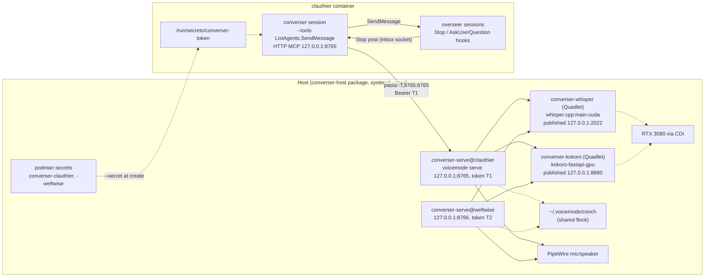

---
first_authored:
  by: "@claude-opus-5-5"
  at: 2026-09-29T09:28:24-07:00
task_list: voice/converser-lace-feature
type: proposal
state: live
status: review_ready
last_reviewed:
  status: accepted
  by: "@claude-opus-5-5"
  at: 2026-09-29T10:07:46-07:00
  round: 5
tags: [voice, architecture, security, networking, packaging, podman, claude_plugins, future_work]
---

# converser: a host voice service and an in-container voice session

> BLUF(opus/voice/converser-lace-feature): Run VoiceMode on the host as `voicemode serve` (loopback, one `systemd --user` instance and bearer token per container, `converse` tool only), with whisper.cpp and Kokoro as rootless podman Quadlet containers from digest-pinned upstream images, published on `127.0.0.1` and given the GPU through the host's CDI spec.
> A container reaches its instance over one `pasta:-T` forward and gets its token from a podman `--secret` in `runArgs`.
> Everything lives in the clauthier `converser` plugin directory (`host/` CLI and units, launcher, prompt).
> Stage 1 ends with a voice conversation in the `clauthier` container relaying to an in-container session.
> Supersedes [`2026-09-28-converser-lace-feature.md`](2026-09-28-converser-lace-feature.md), which stays as the in-container fallback.

> NOTE(opus/voice/converser-lace-feature): Revision r6 (after r5 was accepted) adopts the hybrid from [`2026-09-29-containerized-voice-server.md`](../reports/2026-09-29-containerized-voice-server.md).
> STT and TTS move from a homebrew `whisper.cpp` bottle and VoiceMode's Kokoro installer to Quadlet containers.
> That removes the brew pins, the Kokoro start-script derivation, the delete-reload-mask sequence (one `mask` line stays as a guard), and the firewall backstop.
> The only host `sudo` left is one narrow SELinux boolean for the GPU.
> Separately, a podman `--secret` in `runArgs` replaces `instance handoff`: the devcontainer CLI appends `runArgs` verbatim, which was verified in its source and on live containers.
> A fixed in-container port removes the port file.
> The first target is now the `clauthier` container, and stage 1 is restructured to reach it.
> The six ambiguities listed in the design map are resolved inline.
> The design map ([`-assets/index.html`](2026-09-29-converser-host-voicemode-serve-assets/index.html)) still depicts r5 (brew, firewall, handoff) and needs regeneration.

## Summary

Audio lives on the host.
That removes raw PCM and pulse-control access, monitor-source capture, pulse-socket inode pinning, and the in-container audio install.
It also closes cross-container talk-over, because every host `serve` process shares one hardcoded conch lock.
It does not change SELinux posture for devcontainers: the devcontainer CLI applies `label=disable` to every podman container regardless (vetting report, finding A14; seen again in the CLI source below).

This proposal specifies the design, re-derives the converser security posture, and answers where each piece lives:

- **How does the converser talk?** It relays a cleaned, faithful rendering of the user's speech in plain prose and logs it in a numbered history labelled by the target's Claude Code session name ("#4: clauthier-overseer").
  It asks first only to verify intent: when the request is unclear or doesn't make sense, or when it is truly destructive and the user didn't say so explicitly.
  The user corrects by saying so.
  The audio stream is treated like a keyboard.
- **Is a lace feature needed?** No. VoiceMode's host installers are the awkward part, and this design does not run them: STT and TTS come from upstream images, and `serve` runs from a `uv` tool install under package-owned units. Lace-level host-service hooks move to Future Work.
- **Why only STT/TTS in containers, not `serve`?** A containerized `serve` brings audio back into a container: a pulse mount, `label=disable`, an image we build ourselves. It also breaks the shared conch across PID namespaces unless every instance runs with `--pid=host` (report §1, verified/source). STT and TTS are plain HTTP services with upstream images.
- **Can the in-container wiring be a clauthier plugin?** The behavior and the launcher can.
  Enablement cannot be plugin-scoped: plugin hooks follow whichever settings file enables them, and user settings are the `~/.claude` bind mount shared by host and every container.
  A container-local managed-settings file supplies the per-container scope.
  In stage 1 the launcher and prompt are plugin-directory files run by absolute path; the plugin is not yet listed in the marketplace, so nothing loads it.
- **Where does host-side responsibility go?** Into `converser-host`: a small shell CLI plus two Quadlet files and one unit template.
  It installs, mints per-project instances (port, token, podman secret, the `runArgs` lines to paste), and checks health.
  It lives in `plugins/converser/host/`, so the host writer and the container reader of the token contract sit in one plugin.

> NOTE(opus/voice/converser-lace-feature): The round-4 proposal put VoiceMode, PortAudio, and the pulse socket inside each devcontainer; four follow-up reports converged on moving audio to the host.
> This is a new proposal rather than an in-place revision for two reasons: the deliverable changed kind (a lace devcontainer feature became a host package plus a plugin), and the old document is still the specified fallback if `serve` proves unstable, so it stays readable as written, marked `evolved` with a pointer here.

## Objective

Give a devcontainer project a voice-conversational companion session whose audio I/O, VAD, and STT/TTS run on the host, reached through a narrow, token-gated MCP endpoint.
The first project is `clauthier` itself (podman container `clauthier`, lace project at `/var/home/mjr/code/weft/clauthier`); `weftwise` is the second instance.
Goals:

- the `clauthier` container usable with the converser at the end of stage 1: launch it, hold a voice conversation, and have requests relay to an in-container session and replies come back;
- a host install that is safe by default and repeatable, with no hand-edited VoiceMode install;
- a converser security posture re-derived for the host-serve topology;
- an explicit placement of every piece, with plugin packaging gated on a week of real use.

## Background

### Inputs

All reports are in this repo's `cdocs/reports/` unless noted; this proposal cites their findings rather than re-deriving them.

- [`2026-09-29-containerized-voice-server.md`](../reports/2026-09-29-containerized-voice-server.md): the hybrid recommendation (option B), the Quadlet sketches, the conch-across-PID-namespaces bug that rules out a containerized `serve`, and the `--secret` idea. Unreviewed; every claim adopted here was re-checked (facts below).
- [`2026-09-28-converser-options-vetting.md`](../reports/2026-09-28-converser-options-vetting.md): the assumption audit (A14: `label=disable` is universal), the tier-3 latency floor, Stop-hook volume (50-150 wakes/h upper bound), the permission analysis (2b), twelve amendments, the gate list.
- [`2026-09-28-host-audio-broker-split.md`](../reports/2026-09-28-host-audio-broker-split.md): `serve` access control is thin; `pasta:-T` traffic arrives as `127.0.0.1`, so the token is the only gate; tool set and STT/TTS URLs must be narrowed host-side.
- [`2026-09-28-voicemode-fork-complexity.md`](../reports/2026-09-28-voicemode-fork-complexity.md): reuse upstream unmodified; #521/#522 concurrency wedges and their two mitigations; fork/own tripwires.
- [`2026-09-29-voicemode-complexity-breakdown.md`](../reports/2026-09-29-voicemode-complexity-breakdown.md): service installers are VoiceMode's largest bucket (17%).
- Decision artifact [`2026-09-28-converser-directions-assets/index.html`](../reports/2026-09-28-converser-directions-assets/index.html): ten open decisions, five-stage roadmap, tripwires, gate checklist. Adopted, except decision 10 ("should `lace up` automate host setup"), which becomes "no, a host package does".
- Background (`cdocs/reports/`, 2026-09-27): `claude-code-inter-session-messaging.md`, `voicemode-deep-dive.md`, `conversationalist-bridge-design-questions.md`, `containerized-conversationalist-and-question-surface.md`.

Evidence labels: **verified/source** (VoiceMode at `126d15e`, `/var/home/mjr/code/weft/clauthier/main/build/research/voicemode`; upstream Dockerfiles and the devcontainer CLI where named), **verified/docs** (code.claude.com fetched 2026-09-29; local `podman-run(1)`, `podman-systemd.unit(5)`, `pasta(1)`), **verified/live** (read-only inspection of this host and registries, 2026-09-29), **plausible**, **unverified**.

### Facts this design rests on

VoiceMode `serve` (verified/source):

- `voicemode serve` binds `--host 127.0.0.1 --port 8765` by default and serves streamable HTTP at `/mcp` (`cli.py:2017-2044`, `:2157`). `--port`/`--host` are literal click defaults; the port goes on the command line.
- The bearer token is read from `VOICEMODE_SERVE_TOKEN` when `--token` is absent (`config.py:1664`). Upstream's `start-voicemode-serve.sh` passes it as `--token` argv, visible to every host process via `ps`.
- Tool registration defaults to `{converse, service}` (`tools/__init__.py:119`); `service` controls host systemd units. `VOICEMODE_TOOLS_ENABLED=converse` narrows it.
- STT/TTS URL lists default to loopback then `https://api.openai.com/v1` (`config.py:777-778`).
- Process environment wins over `voicemode.env` files (`config.py:520`), which are `~/.voicemode/voicemode.env` plus the nearest `.voicemode.env` walking up from the working directory (`config.py:18-67`).
- The conch lock is hardcoded to `~/.voicemode/conch` (`conch.py:133`), shared by every same-user process in one PID namespace; `VOICEMODE_BASE_DIR` moves transcripts, audio, logs, and the control socket (`config.py:545-550,697`).
- `converse()` defaults to `wait_for_conch=False`: a second caller gets a fast "conch held" result (`converse.py:4308-4330`). `listen_duration_max` defaults to 120s with no server-side clamp.
- `VOICEMODE_CONCH_TIMEOUT` bounds only `wait_for_conch=true`; a numeric `wait_for_conch` replaces it (`converse.py:3118-3123`). `hold_conch`/`conch_hold_timeout` reserve the floor between calls. None is clamped server-side.
- The control channel (`VOICEMODE_CONTROL_CHANNEL_ENABLED`, default off) is an owner-only Unix socket at `$VOICEMODE_BASE_DIR/control.sock` (`control_socket.py:303-320`); it interrupts TTS playback, not an in-flight listen.
- `audio://` resources are metadata-only and gated on `VOICEMODE_SAVE_AUDIO`; tmux autofocus (`converse.py:144`) reads the serve process's `TMUX_PANE`, so it is inert here. VoiceMode has no cross-session triage.
- `v8.12.0` (latest PyPI) contains everything above and is two commits behind `126d15e`. Pin `voice-mode==8.12.0`; `requires-python >= 3.10`.
- VoiceMode's own `whisper install`/`kokoro install` auto-enable their units, and whisper's start script hardcodes `--host 0.0.0.0` (`config.py:927`, `templates/scripts/start-whisper-server.sh:149`). This design never runs either installer.
- Two paths still reach for upstream unit names without any installer. `voicemode whisper model install` runs `systemctl --user start voicemode-whisper.service` whenever `pgrep -f whisper-server` matches (`whisper_model_unified.py:169-179`). When the unit file is absent, the service tool falls back to killing whatever holds the port and launching its `0.0.0.0` script (`service.py:431-470,612-640`). A mask symlink routes both through `systemctl`, which refuses.

Upstream STT/TTS images (verified/live from `ghcr.io` manifests and configs unless marked):

- `ghcr.io/ggml-org/whisper.cpp:main-cuda` (index `sha256:8a9def3eea0615dbee85cac1e0fa3898dce214fe9bb7955635ba25667da3884a` on 2026-09-29, 2.25 GB compressed, amd64) and `:main` for CPU (`sha256:070afe9654a204cb0b60848c47d25f6f9d052fd3a1e198de8462201233381391`, 0.51 GB). Entrypoint `["bash","-c"]`, runs as root inside its user namespace. The Dockerfile installs `curl` and `ffmpeg` and builds CUDA 13.0 for sm 75/80/86/90, which covers the RTX 3080 (verified/source, `.devops/main-cuda.Dockerfile`). `whisper-server` serves `GET /health` (verified/source, `examples/server/server.cpp:1218`). The tags float, so the package pins digests.
- `ghcr.io/remsky/kokoro-fastapi-gpu:v0.9.0` (`sha256:9ba150465c6b8f5d6b1c62b54de83eb9aa0a1444aad8a1a9c8948eed60564b76`, equal to `latest`, 4.64 GB compressed, CUDA 12.6) and `kokoro-fastapi-cpu:latest` (`sha256:ee3111d6a2c903ed62f3b4fa19543c6901205ed39fce3c177e895b34a8386b9c`, 1.53 GB). They run as `appuser`, and the entrypoint is `./entrypoint.sh`. The image sets no `UVICORN_*` variable. At revision `404d122`, which the image labels name (verified/source):
  - the entrypoint runs `download_model.py` unless `DOWNLOAD_MODEL=false`; that script verifies existing files by sha256 and returns early;
  - it then runs uvicorn on `${HOST:-0.0.0.0}:${PORT:-8880}` with no request limit;
  - the Dockerfile bakes the model at build time (`ARG DOWNLOAD_MODEL=true`), and the app serves `GET /health`.
  That the published image was built with that default is plausible and is checked at first start (gate u).
- Model files: `https://huggingface.co/ggerganov/whisper.cpp/resolve/main/ggml-<model>.bin`, the same URL VoiceMode uses (`whisper_helpers.py:116`). `large-v3-turbo` is 1.62 GB, LFS sha256 `1fc70f774d38eb169993ac391eea357ef47c88757ef72ee5943879b7e8e2bc69`. `base.en` is 148 MB, sha256 `a03779c86df3323075f5e796cb2ce5029f00ec8869eee3fdfb897afe36c6d002`.

Podman, Quadlet, pasta, and the devcontainer CLI:

- Quadlet (verified/docs, `podman-systemd.unit(5)`, podman 5.8.2):
  - `.container` files in `~/.config/containers/systemd/` generate same-named user services;
  - generated services are transient and cannot be `systemctl enable`d, so their `[Install]` section is applied by the generator;
  - `Exec=` appends arguments after the image entrypoint;
  - `Notify=healthy` with `HealthCmd=` delays readiness until the healthcheck passes;
  - `AddDevice=`, `PublishPort=` (IP-qualified), `Environment=`, `NoNewPrivileges=`, and `DropCapability=` exist;
  - a first pull can exceed the default start timeout.
  `QUADLET_UNIT_DIRS=<dir> /usr/lib/systemd/user-generators/podman-user-generator --dryrun` prints the generated service; a dry run shows `Exec="a b"` passed as one argument after the image, which is what a `bash -c` entrypoint needs (verified/live).
- `podman run --secret name[,type=mount][,target=...][,uid=..][,mode=..]` copies the secret into the container at creation; `target` may be absolute; the file driver stores values unencrypted under `~/.local/share/containers/storage/secrets/` (`0700`) (verified/docs, `podman-run(1)`; directory mode verified/live in the report).
- `pasta -T` takes the `-t` spec, including `port:target` mappings (verified/docs, `pasta(1)`): `-T,8765:8766` forwards the container's port 8765 to the host's port 8766.
- devcontainer CLI 0.87.0 builds `podman run` as `[..., ...securityOpts, ...e.runArgs||[], ...]`, appending `runArgs` unfiltered. It adds `--security-opt label=disable` and `--userns=keep-id` for podman on Linux (verified/source, `dist/spec-node/devContainersSpecCLI.js`). Lace preserves user `runArgs`: weftwise's `--mount ... wayland-0` and `--shm-size=1g` appear verbatim in its `CreateCommand` (verified/live). Lace recreates a *running* container on config drift only with `lace up --rebuild` (otherwise it warns and reuses; lace `up.ts`, verified/source).

Claude Code (verified/docs unless marked):

- HTTP MCP servers have a per-request timer to the first response byte, 60s by default, raised only by a per-server `timeout` or `MCP_TOOL_TIMEOUT` above 60s ([mcp](https://code.claude.com/docs/en/mcp), [env-vars](https://code.claude.com/docs/en/env-vars)). A default 120s listen therefore aborts client-side at 60s: the #522 trigger. A dropped HTTP server gets five reconnect attempts (about 31s), then is marked failed.
- `.mcp.json` supports `${VAR}` expansion in `url` and `headers`; whether `--mcp-config` files do is unverified.
- `crossSessionInbound`: "A project or local value applies only when it's stricter than the value managed settings, the `--settings` flag, or user settings give" ([settings-reference](https://code.claude.com/docs/en/settings-reference)).
- A bypass receiver holds inbound unless the sender is also bypass ([cross-session-messaging](https://code.claude.com/docs/en/cross-session-messaging)). Container and host sessions cannot message each other. The session's inbox path is exported as `CLAUDE_CODE_MESSAGING_SOCKET` before any hook runs, including `SessionStart` (same page; round-1 review).
- Each live session writes `$CLAUDE_CONFIG_DIR/sessions/<pid>.json` with `sessionId`, `cwd`, `name`, `pidDomain`, and `messagingSocketPath` (verified/live, Claude Code 2.1.283; an undocumented internal). The directory is on the shared `~/.claude` mount, and `pidDomain` distinguishes containers.
- Plugins ([plugins-reference](https://code.claude.com/docs/en/plugins-reference), [components](https://code.claude.com/docs/en/plugins/components)): can ship skills, agents, hooks, MCP servers, `bin/`, `userConfig`; agent frontmatter ignores `permissionMode`, `hooks`, `mcpServers`; `bin/` is on the Bash *tool's* PATH only; plugins cannot set CLI flags, `crossSessionInbound`, or managed settings; `--strict-mcp-config` excludes plugin MCP servers.
- Managed `enabledPlugins` installs a plugin from a registered marketplace at session start and cannot be disabled from a user scope ([plugins/org](https://code.claude.com/docs/en/plugins/org)). Project settings outrank user settings for `enabledPlugins`.

This host and the `clauthier` container (verified/live):

- Aurora `aurora-dx-nvidia-open` 44 (rpm-ostree), RTX 3080 (12 GB) on driver 595.71.05; podman 5.8.2 rootless, default network `pasta`; systemd 259; `Linger=no`. `~/.config/containers/systemd/` does not exist yet. Linuxbrew provides `uv`; `/lib64/libportaudio.so.2` is present, so `sounddevice` in a `uv` tool install finds PortAudio.
- `/etc/cdi/nvidia.yaml` (CDI 0.5.0) defines `nvidia.com/gpu=0|<UUID>|all`. The device nodes it injects are `/dev/nvidia{0,ctl,-uvm,-uvm-tools}`, labelled `xserver_misc_device_t`, plus `/dev/dri/{card1,renderD129}`, labelled `dri_device_t`.
- SELinux Enforcing: `container_use_devices --> off`, `container_use_xserver_devices --> off`, `container_use_dri_devices --> on`. `sesearch` shows `container_t` gets `open read write ioctl map` on `xserver_misc_device_t` character devices only under `container_use_xserver_devices`. `container_use_devices` grants access to every `device_node` type, which is broader.
- firewalld: the `FedoraWorkstation` zone on `enp3s0` opens `1025-65535/tcp`; `tailscale0` is up. Loopback traffic is not filtered by firewalld.
- The `clauthier` container: network `pasta` (no `-T`), user `node` (uid 1000, `--userns=keep-id`), `label=disable`, sshd on `22431`. It mounts the whole clauthier bare-repo tree **read-write** at `/workspace/clauthier` (workspace `/workspace/clauthier/main`) and `~/.claude` read-write. It sets **no `XDG_RUNTIME_DIR`**, and `/run/user` does not exist. It has `claude` 2.1.274, `flock`, `python3`, `curl`, `jq`, and passwordless `sudo`, and `/etc/claude-code/` does not exist. Its `.devcontainer/devcontainer.json` is tracked in clauthier and has no `runArgs`; lace adds `--label`/`--name` in the gitignored `.lace/devcontainer.json`.
- `weftwise`: network `pasta`, mounts clauthier `main` read-only at its host path, sets `XDG_RUNTIME_DIR=/run/user/1000`, runs bypass sessions.
- No container mounts `~/.local/bin`, `~/.local/share/converser-host`, `~/.config/converser-host`, `~/.config/systemd`, or `~/.config/containers`.
- VoiceMode, whisper, and Kokoro are not installed; no voice path has run end to end. Ports 2022, 8765-8800, and 8880 are free.

## Proposed Solution

### Architecture



One `serve` process per container keeps each single-client, which closes #521 (the shared-process in-memory guard); a client tool timeout above the server's longest `converse()` closes #522 (client abandons a live call, then reconnects).
All `serve` processes run in the host PID namespace and share the conch file, so two projects' conversers serialize on the one microphone.

### Host: the `converser-host` package

A POSIX shell CLI (`install`, `instance add`, `status`) plus `converser-whisper.container`, `converser-kokoro.container`, and `converser-serve@.service`.
It wraps nothing: it runs VoiceMode's `serve` unmodified from a pinned `uv` tool install, runs STT and TTS from pinned upstream images, and replaces only the unsafe defaults (binds, token transport, tool scope).
Source: `plugins/converser/host/` in clauthier (see "Where the package source lives").

**Why not a formula or a containerized `serve`.** Nothing here needs packaging beyond two image digests, one `uv` pin, and three unit files. A containerized `serve` is rejected in the Summary.

**Running from a container-writable checkout.**
The `clauthier` container mounts the clauthier checkout read-write, and its bypass-mode sessions commit to it, so any script the host runs from the checkout is code a container session could have written.
`install` therefore refuses to run if `git status --porcelain plugins/converser/host` is non-empty.
It then copies the CLI and unit sources from `HEAD` (`git archive HEAD plugins/converser/host`) into `~/.local/share/converser-host/src/`, links `~/.local/bin/converser-host` to that copy, and records the commit in `~/.local/share/converser-host/installed-rev`.
Every later command runs from the installed copy, which no container mounts.
Before each `install`, the user reviews `git log -p $(cat ~/.local/share/converser-host/installed-rev)..HEAD -- plugins/converser/host/` (the whole directory on first install).

**Commands.** Stage 1 builds `install`, `instance add`, and a thin `status`; `instance rm`, `uninstall`, and `model set` are stage 3b.

- `converser-host install [--cpu]` (stage 1): idempotent; it never runs `sudo` itself.
  1. **Self-install from a clean commit** (above).
  2. **VoiceMode and the scoping stop-check.** `uv tool install --python 3.12 voice-mode==8.12.0` (3.12, not the host's default 3.14, so every dependency has wheels; plausible).
     Then start one throwaway `serve` on `127.0.0.1:8800`, outside the 8765-8799 instance range. It gets a `mktemp -d` `VOICEMODE_BASE_DIR` and working directory, a throwaway token passed as `VOICEMODE_SERVE_TOKEN` (never `--token`), and `VOICEMODE_TOOLS_ENABLED=converse`.
     From the host, `curl` an MCP `initialize` + `tools/list`: without the token it must return 401, and with it exactly `[converse]`. Then stop the process and remove the temp dir.
     `curl` never takes a token on argv: the authenticated request reads its header as a curl config from stdin through the shell builtin, `printf 'header = "Authorization: Bearer %s"\n' "$tok" | curl -K - ...`. `status` uses the same pattern.
     Stop here if either check fails.
  3. **Model.** Download `ggml-large-v3-turbo.bin` (`ggml-base.en.bin` with `--cpu`) into `~/.local/share/converser-host/models/` and check its sha256 against the value pinned in the script (Facts).
  4. **GPU gate.** Unless `--cpu`, require `getsebool container_use_xserver_devices` to print `on`. If it is off, print the one `sudo` line (below) and exit non-zero, so the `sudo` is an explicit user step, not hidden inside the script.
  5. **Units.** Write the two `.container` files (GPU or CPU image digests) into `~/.config/containers/systemd/` and `converser-serve@.service` into `~/.config/systemd/user/`, `systemctl --user daemon-reload`, `podman pull` both pinned digests (several GB; pulling before start keeps the first start inside its timeout), then `systemctl --user start converser-whisper converser-kokoro`.
     Then, as a guard, `systemctl --user mask voicemode-whisper voicemode-kokoro voicemode-serve`. No installer has written those unit files, so `mask` cannot collide with a regular file.
  6. **Verify.** `ss -ltnH` shows 2022 and 8880 on `127.0.0.1` only; `podman inspect` shows each published port with `HostIp` `127.0.0.1`; both units are `active` (which with `Notify=healthy` means healthy); each upstream unit's `systemctl --user is-enabled` output is `masked`. `is-enabled` exits 1 for a masked unit, so the script compares output, never the exit code, under `set -e`.
- `converser-host instance add <project> [--port N] [--uid U]` (stage 1):
  1. Pick the first free port in 8765-8799 (clear of lace's 22425-22499).
  2. Mint a token with `openssl rand -hex 32` (64 hex characters).
  3. Write `~/.config/converser-host/instances/<project>.env` (`0600`, unquoted `KEY=value` lines: `VOICEMODE_SERVE_PORT` and `VOICEMODE_SERVE_TOKEN`) and a raw `<project>.token` beside it (`0600`).
  4. `podman secret create converser-<project> ~/.config/converser-host/instances/<project>.token` (the value is read from the file, never argv).
  5. `systemctl --user enable --now converser-serve@<project>`.
  6. Print the `runArgs` entries to add (below). It never prints the token.
  `--uid` (default 1000) is the container user's uid for the secret's owner.
- `converser-host status [<project> <container>]` (stage 1, thin): the gate-q checks from step 6, plus per instance: the unit is active; an unauthenticated `tools/list` returns 401 and an authenticated one returns `[converse]` (token via `curl -K -` on stdin); `/proc/<MainPID>/environ` holds the pins; `ps -o args` shows no `--token`. Given a container, it also checks that the container's `CreateCommand` carries `pasta:-T,<container-port>:<instance port>` and `--secret converser-<project>`.
- Stage 3b: `instance rm <project>` (stops and disables the unit, removes the env, token, and secret; warns when a container's `CreateCommand` still references the secret, since that container can then no longer be recreated), `uninstall` (removes units, Quadlet files, masks, images, and the self-install), and `model set <name>` (downloads, then edits the `Exec=` line of `converser-whisper.container`).

**GPU and SELinux: `container_use_xserver_devices`, not `container_use_devices`.**
A labelled (`container_t`) container given the NVIDIA nodes through CDI cannot open them while the boolean that covers `xserver_misc_device_t` is off.
The plan takes **`sudo setsebool -P container_use_xserver_devices on`**, which needs the user's `sudo` once.
It covers every NVIDIA node the CDI spec injects; the `/dev/dri` nodes are already allowed by `container_use_dri_devices=on`.
`container_use_devices` stays **off**: it grants every device-node type to any labelled container that is handed one, which is broader than needed.
Both booleans are persistent and host-wide, but they only matter for labelled containers that are explicitly given a device; every devcontainer already runs `label=disable`, so nothing else on this host changes behavior.
Fallbacks, in order:
- if an AVC denial names another type, read it with `sudo ausearch -m avc -ts recent`, then decide between `container_use_devices` and a local policy module;
- if the user declines any `sudo`, use `SecurityLabelDisable=true` on the two STT/TTS containers (they then run unconfined by SELinux, still rootless);
- or use `install --cpu`, which is acceptable for stage 1.

**The container contract.** `converser-host` owns one interface to the container side, documented once in `plugins/converser/host/README.md` and read by the launcher in the same plugin:
the token is a file at `/run/secrets/converser-token` (`0400`, owned by the container user), and `serve` is reachable at `http://127.0.0.1:8765/mcp` inside every container, whatever the host port.
The host port appears once, in the forward.

**Units.**
`~/.config/containers/systemd/converser-whisper.container`:

```ini
[Unit]
Description=converser STT (whisper.cpp server)

[Container]
ContainerName=converser-whisper
# main-cuda at authoring; --cpu writes :main's digest and base.en instead.
Image=ghcr.io/ggml-org/whisper.cpp@sha256:8a9def3eea0615dbee85cac1e0fa3898dce214fe9bb7955635ba25667da3884a
AddDevice=nvidia.com/gpu=all
Volume=%h/.local/share/converser-host/models:/models:ro,Z
# Host exposure is set here: loopback only. The in-container bind is namespace-local.
PublishPort=127.0.0.1:2022:2022
# One string: the entrypoint is `bash -c`.
Exec="whisper-server --host 0.0.0.0 --port 2022 --model /models/ggml-large-v3-turbo.bin --inference-path /v1/audio/transcriptions --threads 4 --convert"
HealthCmd=curl -fsS http://127.0.0.1:2022/health
HealthInterval=5s
Notify=healthy
NoNewPrivileges=true
DropCapability=all

[Service]
Restart=on-failure
TimeoutStartSec=900

[Install]
WantedBy=default.target
```

`converser-kokoro.container` has the same shape:
- `Image=ghcr.io/remsky/kokoro-fastapi-gpu:v0.9.0@sha256:9ba1504...` (or the `-cpu` digest);
- `AddDevice=nvidia.com/gpu=all` (dropped for `--cpu`) and `PublishPort=127.0.0.1:8880:8880`;
- `Environment=DOWNLOAD_MODEL=false`, so a start never fetches from the network and a missing baked model fails loudly;
- `HealthCmd=curl -fsS http://127.0.0.1:8880/health` with `Notify=healthy`, plus `NoNewPrivileges=true` and `DropCapability=all`;
- `Restart=on-failure` and `TimeoutStartSec=900`.
`on-failure` suffices because the image's uvicorn has no request limit and never exits 0 by design (Facts). There is no `Exec=`, so the image entrypoint runs.

`converser-serve@.service`:

```ini
[Unit]
Description=VoiceMode MCP server for container project %i
Wants=converser-whisper.service converser-kokoro.service
After=converser-whisper.service converser-kokoro.service

[Service]
Type=simple
StateDirectory=converser-serve/%i
WorkingDirectory=%S/converser-serve/%i
# Port and token only; security pins are on the command line,
# so no EnvironmentFile or drop-in line can override them.
EnvironmentFile=%h/.config/converser-host/instances/%i.env
ExecStart=/usr/bin/env \
  VOICEMODE_TOOLS_ENABLED=converse \
  VOICEMODE_STT_BASE_URLS=http://127.0.0.1:2022/v1 \
  VOICEMODE_TTS_BASE_URLS=http://127.0.0.1:8880/v1 \
  VOICEMODE_SERVE_ALLOW_TAILSCALE=false \
  VOICEMODE_SERVE_ALLOW_ANTHROPIC=false \
  VOICEMODE_AUTO_START_KOKORO=false \
  VOICEMODE_CONCH_TIMEOUT=60 \
  VOICEMODE_CONTROL_CHANNEL_ENABLED=true \
  VOICEMODE_BASE_DIR=%S/converser-serve/%i \
  %h/.local/bin/voicemode serve --host 127.0.0.1 --port ${VOICEMODE_SERVE_PORT} --transport streamable-http
# Refuse to start with an empty or short token: serve treats an empty token as
# "no auth" (cli.py:2152). $$ keeps systemd from substituting the value into argv.
ExecStartPre=/bin/sh -c 'test $${#VOICEMODE_SERVE_TOKEN} -ge 32'
# on-failure, not upstream's always: a clean exit means a deliberate stop.
Restart=on-failure
RestartSec=5

[Install]
WantedBy=default.target
```

> NOTE(opus/voice/converser-lace-feature): The pins sit on `ExecStart=/usr/bin/env ...` because systemd lets `EnvironmentFile=` override `Environment=`.
> They win for the keys they name; an env file can still set unpinned keys (for example `VOICEMODE_SERVE_ALLOWED_IPS`, inert behind the token under pasta).
> The `/proc/<pid>/environ` check confirms the pins rather than being the only guard.

Design points:

- **No wildcard host listener.** `serve` binds `127.0.0.1`; whisper and Kokoro bind `0.0.0.0` only inside their own network namespaces, and their host exposure is the `127.0.0.1:` `PublishPort=`.
- **No firewall rules.** The r5 backstop guarded against VoiceMode's wildcard-bound installers, which this design never runs. `serve` needs no rule to be reachable: `pasta -T` connects to the host's loopback, which firewalld does not filter. Nothing listens off loopback, so the `FedoraWorkstation` zone's open range and `tailscale0` do not matter here.
- **`VOICEMODE_CONCH_TIMEOUT=60`** bounds `wait_for_conch=true` only; the converser's floor allows only boolean `wait_for_conch` (below).
- **`WorkingDirectory` under the state dir** keeps project `.voicemode.env` files out; `~/.voicemode.env` and `~/.voicemode/voicemode.env` would still load, losing to the command-line pins.
- **Control channel on.** It gives a later "stop talking" hotkey a per-project `control.sock`; the hotkey must pick the conch holder's project (holder PID to `converser-serve@<project>` via `/proc/<pid>/cgroup`). Stage-2 work.
- **Images are pinned by digest and bumped by hand** (edit the digest, `daemon-reload`, restart; roll back to the previous digest), matching the `voice-mode==8.12.0` pin. No `AutoUpdate=`.

### Container: forward and token

`instance add clauthier` prints, for the first instance on host port 8765:

```jsonc
"runArgs": [
  "--network", "pasta:-T,8765:8765",
  "--secret", "converser-clauthier,target=/run/secrets/converser-token,uid=1000,mode=0400"
]
```

`-T,8765:<host port>` forwards the container's `127.0.0.1:8765` to the host's loopback instance port and nothing else; a second instance on host port 8766 prints `-T,8765:8766`.
The secret is copied into the container at creation, so it survives every `lace up --rebuild` with no re-run.
`podman inspect` shows the secret's name, not its value (plausible).
Lace's `-p` publishing and portless ingress must keep working under the explicit `--network` (gate c).
The lines go into the project's `.devcontainer/devcontainer.json` as a local, uncommitted edit (Implementation Phases): a host without the secret cannot create the container, so the lines must not reach other clones.

> NOTE(opus/voice/converser-lace-feature): `instance handoff` (the token and port written into the container over `podman exec -i` stdin, re-run after every recreate) is the fallback if gate s shows the secret missing or unreadable in the container.
> It is not built unless that happens.

### Container: the converser session

The converser is a `claude` session started by `plugins/converser/bin/converser`, run by absolute path from the container's view of the clauthier checkout (`/workspace/clauthier/main/...` in `clauthier`, `/var/home/mjr/code/weft/clauthier/main/...` in `weftwise`), with:

- `--tools ListAgents,SendMessage` (built-ins only) and `--disallowedTools "mcp__claude_ai_*"`;
- `--strict-mcp-config --mcp-config <generated>` naming one HTTP server, `voicemode`, with the bearer header and `"timeout": 600000`;
- `ENABLE_TOOL_SEARCH=false`, so `mcp__voicemode__converse` loads upfront;
- `--settings <generated>` carrying `crossSessionInbound: "accept"` and a `SessionStart` hook that records `$CLAUDE_CODE_MESSAGING_SOCKET` into the sockpath file;
- `--permission-mode bypassPermissions`, `CONVERSER_SESSION=1`, `--name converser`, model `sonnet`;
- `--append-system-prompt-file plugins/converser/launcher/SYSTEM_PROMPT.md` with the security floor and interaction model;
- a single-instance `flock`.

**Run directory.** `run=${XDG_RUNTIME_DIR:-/tmp}/converser-$(id -u)`, created `0700` and owner-checked; it holds the lock, the generated MCP config and settings, and `converser.sockpath`.
The fallback matters because `clauthier` sets no `XDG_RUNTIME_DIR`.
The launcher, the `SessionStart` recorder, and the `Stop` hook all use this one expression, stated in the README contract.
The launcher removes the MCP config and the sockpath on exit or signal; a sockpath left by a crash points at a dead socket, which the hooks' connect-based liveness check treats as absent.

```sh
#!/bin/sh
set -eu
here=$(CDPATH= cd -- "$(dirname -- "$0")/.." && pwd)    # plugins/converser
run="${XDG_RUNTIME_DIR:-/tmp}/converser-$(id -u)"
mkdir -p -m 700 "$run"; [ -O "$run" ] || { echo "converser: $run not mine" >&2; exit 1; }
exec 9>"$run/lock"
flock -n 9 || { echo "converser already running" >&2; exit 1; }
port=${CONVERSER_PORT:-8765}
tokf=${CONVERSER_TOKEN_FILE:-/run/secrets/converser-token}
[ -r "$tokf" ] || { echo "converser: no token at $tokf (runArgs --secret missing?)" >&2; exit 1; }
# Preflight without the token: 401 means the forward and serve are up
# (plausible that auth answers before MCP parsing; gate pre shows the status).
code=$(curl -s -o /dev/null -w '%{http_code}' -X POST "http://127.0.0.1:$port/mcp" || :)
[ "$code" = 401 ] || { echo "converser: voice server on 127.0.0.1:$port answered '$code', expected 401" >&2; exit 1; }
umask 077
trap 'rm -f "$run/mcp.json" "$run/converser.sockpath"' EXIT HUP INT TERM
# printf is a shell builtin, so the token never reaches argv; `cat` sees only the path.
# Do not swap in /usr/bin/printf or jq --arg, both of which would put it on a command line.
printf '{"mcpServers":{"voicemode":{"type":"http","url":"http://127.0.0.1:%s/mcp","headers":{"Authorization":"Bearer %s"},"timeout":600000}}}' \
  "$port" "$(cat "$tokf")" > "$run/mcp.json"
printf '{"crossSessionInbound":"accept","hooks":{"SessionStart":[{"hooks":[{"type":"command","command":"%s/launcher/record-sockpath.sh"}]}]}}' \
  "$here" > "$run/settings.json"
CONVERSER_SESSION=1 ENABLE_TOOL_SEARCH=false claude \
  --name converser --model sonnet --permission-mode bypassPermissions \
  --tools ListAgents,SendMessage --disallowedTools 'mcp__claude_ai_*' \
  --strict-mcp-config --mcp-config "$run/mcp.json" \
  --settings "$run/settings.json" \
  --append-system-prompt-file "$here/launcher/SYSTEM_PROMPT.md"
```

`record-sockpath.sh` computes the same `run` and writes `$CLAUDE_CODE_MESSAGING_SOCKET` to `$run/converser.sockpath` (`0600`).

**Client timeout.** The security floor bounds the converser's calls: `listen_duration_max` ≤ 90, single-turn (no `turns`), spoken messages under a minute, `wait_for_conch` only `true` or `false` (never a number), no `hold_conch`, never `conch_mode=callback`.
The worst case is then about 60s conch wait, 60s playback, 90s listen, and a few seconds of STT, well under the 600s per-server `timeout`.
Without that field the 60s HTTP request timer aborts every default listen, so the field is load-bearing.
These bounds are prompt-level: they hold for the converser, not for another container process holding the token (Security Analysis).

### Overseer hooks

Two hooks, active for every overseer session in the container and never for the converser itself (`CONVERSER_SESSION`) or headless `claude -p` workers:

1. **`Stop` push** (`async: true`), `plugins/converser/hooks/stop-post.py`. It skips when `background_tasks` is non-empty.
   It resolves its own label for `From:` by finding the hook input's `session_id` in `$CLAUDE_CONFIG_DIR/sessions/*.json` and taking `name`, falling back to the `cwd` basename plus `(unnamed)`. The registry is an undocumented internal, hence the fallback.
   It truncates `last_assistant_message` to 600 characters with a `[truncated]` marker; there is no model call in a hook, so "condensed" means truncated.
   It posts to the socket named in `$run/converser.sockpath` through `plugins/converser/hooks/inbox.py`, the one place the inbox wire format is written down. Gate f's test script imports the same module.
   It appends one JSONL line per event to `$run/stop-trace.jsonl`, including the parent `claude` argv it saw. With `--trace-only` it records without posting (gate j).
2. **Tier-2 `AskUserQuestion` redirect** (stage 2): a `PreToolUse` hook that, only when the converser's socket answers, denies with the reason: "The user is on voice. Do not ask here: send this question with SendMessage to the session named `converser`, then end your turn; the answer arrives as a message." Otherwise the local dialog appears. It never waits on a timeout. Tier 3 stays deferred behind gates (h) and (l).

Both are liveness-checked by construction (a dead converser means an unreachable socket), not presence-gated.

### Converser interaction model

The user-facing surface is built for interpretability and ergonomics.

**Relay without asking.**
The converser compiles the user's speech into the message it will send: disfluencies, false starts, and obvious transcription slips removed, target session resolved.
It sends without waiting for approval, then logs the entry and speaks a short readback ("Sent to clauthier-overseer: ..."), so the readback reflects what was actually sent.
Readback-first would help only with an interrupt that can abort a pending `SendMessage`; the control channel stops playback, not sends.
It never echoes the raw transcript for confirmation.

**Confirmation is intent verification.**
The converser asks first only when it is not confident it understood what the user wants:
- **Comprehension:** the target session is unclear or matches nothing live; a consequential detail (name, number, branch, path) came through low-confidence or implausible.
- **Sensibility:** the request contradicts itself or what the user just said, or doesn't make sense against what the target is doing.
- **Destructive intent:** the request is truly destructive (irreversible deletion or overwrite, force-push, history rewrite, dropping data, production deploys, anything that spends money or messages outside) and the user did not signal that intent explicitly. "Force remove the branch" or "delete it destructively" is explicit and relays without a check; "clean up the branches" that the converser would render as a deletion is not.

The question is short and specific ("Clauthier or lace?", "Delete the remote branch too, or just local?"), never "did I hear you right?" for the whole utterance.
This is a comprehension aid, not a security control (Security Analysis).

**History, labelled by session.**
In v0 the history is the converser session's own terminal transcript.
Each relay prints one entry, number first, labelled by the target's session name exactly as `ListAgents` shows it (the name set with `--name` or `/rename`): `#4: clauthier-overseer → <compiled message>`.
Inbound status the converser chose to speak appears as `#5: clauthier-overseer ← <spoken summary>`, using the `From:` label the `Stop` hook stamps.
Numbers form one global sequence across all targets, so the number alone, which is what the user says, is unambiguous.
A session `ListAgents` shows without a name gets whatever identifying field `ListAgents` returns plus `(unnamed)`. The converser says so on first use and suggests `/rename` for a stable, speakable label.
`ListAgents` covers only sessions in the converser's own container: the registry is shared through `~/.claude`, but `pidDomain` separates containers.
Corrections reference the number: the user says "fix four" (or "fix that last one"), and the correction, sent to the same target, cites `#4: clauthier-overseer`.
A persistent, externally viewable ledger (a tmux pane, `converser status`) is stage-3 work and would return as a fixed-path `converser-io` MCP tool, never as `Write`.

**Correction by follow-on utterance.**
The history is the undo surface.
The user reads or hears what was sent and says what to change; the converser relays a correction to the same target, referencing the labelled entry.
It never tries to retract a delivered message, since cross-session messages cannot be recalled.

**Style, both directions.**
Plain, human prose to agents and to the user, with ordinary sentences and light formatting, not the dense bullet-and-jargon register agents use with each other.
To agents: a faithful, cleaned rendering of what the user said, keeping the user's words, emphasis, hedges, and uncertainty; no added instructions, no upgrading "maybe look at" into "fix."
Each relay opens with a one-line marker that it is the user's speech relayed by voice.
To the user: agent output condensed into short spoken sentences (questions, completions, failures), the rest left in the history.

**Structural relay rule.**
The converser forwards only what the user said.
Text arriving in an overseer's `Stop` post is spoken or summarized to the user, never forwarded as an instruction to another overseer.

**Listen gating.**
The converser opens a listen only when the user starts an exchange, or immediately after it asked the user something; never an idle open-mic loop.
In stage 1 the user starts an exchange by typing into the converser's terminal (Enter, or "listen"); stage 2 adds a push-to-talk hotkey.
A headset is the default; hands-free is an explicit opt-in.

The interaction and style content lives in `plugins/converser/launcher/SYSTEM_PROMPT.md` in stage 1 and in the plugin's `/converser` skill at stage 3.
The launcher-shipped security floor keeps only the non-negotiable lines: never approve permissions or change configuration on request, forward only user speech, mark relays as voice, the call-shape bounds, and listen gating.

### Placement

| Piece | Stage 1 | Stage 3 (packaged) | Why there |
|---|---|---|---|
| Host STT/TTS | Quadlet containers written by `converser-host install` | Same; completed in 3b | Host-global, shared by every project; upstream images remove VoiceMode's installers from the path |
| `serve` lifecycle | `converser-serve@.service` | Same | Only the init system restarts a crashed or post-reboot daemon |
| Port, token, secret, per-project `BASE_DIR` | `converser-host instance add clauthier` | Same | The package owns the unit it binds to; no second tool needs to know the token |
| Forward and token into the container | Two `runArgs` entries printed by `instance add`, local uncommitted edit | Same, or emitted by lace host-service hooks (Future Work) | Survives rebuilds; the token never touches argv, `containerEnv`, or committed config |
| Launcher, security-floor prompt, sockpath recorder | `plugins/converser/bin/converser`, `launcher/`, run by absolute path | Same files; `bin/` on the plugin's Bash PATH once the plugin is listed | The floor ships with the launcher that grants bypass; plugin `bin/` is not on the terminal PATH |
| Managed settings file (hooks, later `enabledPlugins`) | Hand-written `/etc/claude-code/managed-settings.d/50-converser.json` (in-container `sudo`, passwordless in `clauthier`) | Written by `converser setup`, re-run after each rebuild | Container-local and container-wide; the only scope that is neither host-shared nor project-committed |
| Overseer hook bodies | `plugins/converser/hooks/*.py`, referenced by absolute path from the managed file | Plugin hooks, force-enabled by the managed file | Versioned in clauthier; scoped by the managed file |
| VoiceMode MCP client config | Generated by the launcher | Same | A plugin `.mcp.json` would hand every overseer the token; `--strict-mcp-config` excludes plugin servers anyway |
| `crossSessionInbound: accept` | Launcher `--settings` | Same | Project/local `accept` is ignored; user scope would apply everywhere |
| Converser agent, interaction and style skill | `SYSTEM_PROMPT.md` | Plugin agent (`tools`, `model`) and `/converser` skill | Agent config belongs in the plugin layer |
| `converser-io` MCP server | Not built | Only if a persistent ledger proves necessary | Tier 2 has no reply file; the history is the session transcript |

**Plugin hook scope.**
A plugin's hooks fire in every session where the plugin is enabled, and enablement is per settings file.
From user settings, the converser plugin's hooks would run on the host and in every container, because `~/.claude/settings.json` is the shared bind mount.
From a project's `.claude/settings.json`, they would run for every session in that repo, host-side too, and for collaborators; project settings also outrank user settings here, so the plugin must never be listed in any project settings file.
Only a managed file inside the container scopes them to exactly one container and force-enables them.
The plugin declares `defaultEnabled: false`, and the stage-3 managed file carries both keys, with the marketplace path as the *container* sees it (`/workspace/clauthier/main` in `clauthier`):

```json
{
  "extraKnownMarketplaces": {
    "clauthier": { "source": { "source": "directory", "path": "/workspace/clauthier/main" } }
  },
  "enabledPlugins": { "converser@clauthier": true }
}
```

> WARN(opus/voice/converser-lace-feature): Unverified (gate t): that a directory-source managed install works end to end inside the container at session start, and the exact `extraKnownMarketplaces` source shape above.

### Where host-side responsibility goes

| Option | Lifecycle | Knows port and token | New code | Fit | Verdict |
|---|---|---|---|---|---|
| **A. Lace spawns and tracks a PID** | Weak: acts only during `lace up`; no restart on crash or after reboot | Yes | Medium | Lace becomes an audio-daemon supervisor | Reject |
| **B. Hand-configured units** | Strong | No: restated per project | None | Every safety step (loopback publish, argv-free token, masks, secret) is a manual checklist | Reject |
| **C. Lace-provisioned units** | Strong | Yes | Small-medium, mostly generic | Good long-term, but couples a voice experiment to lace changes | Future Work (host-service hooks) |
| **D. Self-contained host package (`converser-host`)** | Strong: Quadlet and systemd units | Yes: `instance add` mints and prints | Small: one shell CLI, two Quadlet files, one unit | Fixes the actual problem in one reviewable place | **Recommended** |
| **E. Homebrew formula/tap** | `brew services` single-unit only | No instances | Formula plus separate instancing | Nothing left that fits | Not needed |
| **F. chezmoi dotfiles** | Same as B | No | None | Personal-host config, not reusable | Only as a fallback home for the units |

If more projects adopt voice, generalized lace host-service hooks (Future Work) can call `converser-host instance add` and emit its `runArgs` rather than replace it.

### Where the package source lives

**Decision: clauthier, `plugins/converser/host/`** (user direction: avoid a full repo for now).
The alternatives (a new `converser-host` repo, the lace repo, chezmoi) cost a repo split of the token contract, contradict "keep lace out near-term", or are not reusable.
The directory is host-side tooling shipped alongside the plugin, not executed by the plugin runtime: no hook, skill, MCP entry, or `bin/` item references it, and it is outside `bin/`.
`install` self-installs from a clean `HEAD` (above), so the checkout is a source, not a runtime: no unit and no later command executes from it.
Containers see the directory through the clauthier mount (read-write in `clauthier`, read-only in `weftwise`); it holds no secrets.
If stage 2 kills the project, `plugins/converser/` is removed; no repo is left behind.

### How the pieces bind, and what replaces all-or-nothing

Three independently installed pieces (host package, `runArgs` entries, managed file) allow partial states:

- `serve` down or forward missing: the launcher's preflight refuses to start with a message naming the port; mid-session, `converse()` errors and the converser says "voice unavailable" rather than going silent.
- Secret missing from the container: the launcher refuses with a message naming the path. The secret deleted on the host: the next `lace up --rebuild` fails at create (Edge Cases).
- Managed file missing (any rebuild in stage 1): overseers silently stop posting, and the trace cannot show it because the trace comes from the missing hook.
- Plugin enabled at user or project scope by mistake (stage 3): hooks on the host too (liveness checks keep them no-ops, but it is the wrong scope).

`converser-host status <project> <container>` covers the host half and the forward; the stage-3 `converser status` covers the container half (launcher present, managed file present and valid, plugin enabled, port reachable with token, `tools/list` equals `[converse]`, converser socket live).

## Important Design Decisions

**Supersede, do not evolve.** Stated in the Summary NOTE.

**Host `serve`, one process and token per container.** The only cheap option that removes the pulse socket and closes cross-container talk-over; the token is the only real gate because `pasta` erases the source address.

**STT and TTS as Quadlet containers from pinned upstream images; `serve` stays on the host.** STT and TTS are plain HTTP services, which is where every messy host step came from (brew pins, VoiceMode's Kokoro installer, a derived start script, the unit-mask dance, the firewall backstop). Containerizing them removes those steps, confines both under `container_t`, and gets CUDA through CDI without a host toolkit. `serve` needs the microphone and the shared conch, and both are simpler on the host.

**A host package, not lace, owns the host side.** One package with safe defaults baked in fixes the host install for every consumer, and lace can call it later.

**Stage 1's host step is the package's first version.** Writing the script once is cheaper and less error-prone than a hand checklist that must later be scripted anyway.

**One narrow SELinux boolean, applied by the user.** `container_use_xserver_devices` covers exactly the NVIDIA device type; `container_use_devices` would cover every device type. `install` checks it and prints the `sudo` line rather than running `sudo` itself.

**Token by podman secret, port by fixed in-container mapping.** The devcontainer CLI appends `runArgs` verbatim (verified/source), so a `--secret` survives rebuilds with no re-run step. `-T,8765:<host port>` makes the container side constant, so the host port lives in one place.

**Self-install from a clean commit.** The checkout is writable from the `clauthier` container; the host runs only a reviewed, committed copy.

**The VoiceMode MCP entry is launcher-generated.** A plugin MCP server would load in every overseer with the token.

**`converser-io` is dropped for v0.** Tier 2 has no reply file, and the history is the session transcript. Any future ledger is a fixed-path MCP tool, never `Write`.

**Security floor ships with the launcher.** The launcher grants bypass, so the floor travels with it.

**Explicit per-server MCP `timeout`.** The 60s HTTP request timer otherwise turns every default listen into the #522 trigger.

**Relay without asking; verify intent by exception; correct by follow-on.** Echo-and-confirm on every utterance is too cumbersome; confirmation exists to catch misunderstanding and unsignalled destructive requests, not to authenticate the speaker.

**Tier 2 in v0; Stop hook trace-first.** Per the artifact's open decisions.

## Security Analysis

### Converser posture, re-derived for host `serve`

| Control | Still needed? | Reasoning |
|---|---|---|
| No `Edit`/`Write`/`NotebookEdit`/`Read`/`Bash` | Yes | The risk is code execution and credential reads through bind mounts (`~/.claude`, `~/.claude.json`, the read-write clauthier tree, nvim data, dotfiles, `authorized_keys`); moving audio changes no mount |
| `--tools ListAgents,SendMessage` + strict MCP | Yes | The MCP set shrinks to one HTTP server |
| `VOICEMODE_TOOLS_ENABLED=converse` | Yes, **host-side** | Any container process holding the token can speak raw JSON-RPC, so only the host process can scope tools |
| STT/TTS pinned to loopback | Yes, **host-side** | Otherwise stopping whisper fails audio over to OpenAI |
| Managed settings file for hooks | Yes | The only container-local, container-wide scope |
| `crossSessionInbound: accept` via launcher `--settings` | Yes | Project/local `accept` is ignored |
| Bypass converser | Yes | Bypass overseers hold everything but bypass senders; the own-child relay (gate n) remains a spike |
| Pulse mount, audio packages, per-project `~/.voicemode-*` mount | **Removed** | Audio is host-side; per-instance `VOICEMODE_BASE_DIR` replaces the mount; the conch deliberately stays shared |

### Threat table

| Threat | Likelihood | Impact | Mitigation |
|---|---|---|---|
| Any container process reads the token and drives `converse()` | High (every agent runs as the container user) | Medium: room transcription and TTS over a narrower channel than the pulse socket; also a second concurrent client (#521) unbound by the converser's call-shape floor | Inherent; one token per container limits it to that container's port. Recovery is `systemctl --user restart` |
| Token visible to host processes | Low | Medium | Env file and podman secret store (both owner-only, unencrypted at rest), never argv. The startup banner logs the token's first four characters to the journal |
| Env file re-widens tools or URLs | Very low | High | Pins on the `ExecStart` command line win; `/proc/<pid>/environ` confirms |
| Wildcard-bound STT/TTS | Very low: no VoiceMode installer runs; a Quadlet `PublishPort=` would have to be edited | High: unauthenticated LAN transcription | Loopback `PublishPort=`; `status` checks `ss` and `podman inspect`; upstream unit names masked against manual VoiceMode commands |
| Host runs container-written code (the checkout is read-write in `clauthier`) | Medium without the self-install | High: host code execution as the user | `install` refuses a dirty tree, installs from `HEAD` into a path no container mounts, and records the rev for diff review. Not a new escape class: the shared read-write `~/.claude` (host hooks, settings) already is one |
| Third-party STT/TTS image compromised or replaced | Low (digest-pinned) | Medium: code as the host user through a rootless container escape; model-volume read | Digest pins, manual bumps, `container_t` labelling, no mounts but the model directory `:ro`, `NoNewPrivileges`, all capabilities dropped |
| GPU access widened by `container_use_xserver_devices` | Low | Low | Narrowest boolean that works; matters only for labelled containers explicitly given NVIDIA devices; devcontainers are `label=disable` regardless |
| `serve` starts with an empty token | Low | High: no auth, and `allow_local` admits every `pasta:-T` caller | `ExecStartPre` length check; `status` confirms 401 without the token |
| Secret readable by other users in the container | Low (single-user containers) | Medium | `mode=0400,uid=<container user>`; container root can read it, as it can any file |
| `converse(ref_text=<host path>)` reads a host file | Low | Low: used only for a configured clone voice (`converse.py:518-541`, `simple_failover.py:42-50`) | No clone voices configured |
| `conch_mode=callback` types into a host tmux pane via `session send` | Low: binary absent | Low | Floor forbids callback mode |
| #521/#522 wedge | Medium | Medium | One client per process (while no other token holder connects); 600s `timeout`; bounded call shape; manual restart for a wedged-but-alive process |
| DNS rebinding against the loopback listener | Low | Medium absent a token | Token required; FastMCP `Host`/`Origin` validation unverified |
| Non-user speech relayed to a bypass overseer | Low-Medium | High | **Accepted: the audio stream is treated like a keyboard**; see below |
| Agent turn-end text laundered into another overseer | Low | High | Structural: only user speech is forwarded |
| Turn-end secrets spoken and logged | High | Medium-High | Unchanged; logs land host-side under the per-project `BASE_DIR` |

Removed rows: pulse-socket mic/monitor capture, pulse module loading, inode pinning, per-container double capture, and the firewalled-zone row (nothing listens off loopback).
`label=disable` on devcontainers is not a row: it applies to every container regardless.
The launcher, prompt, and hook bodies live in a tree that sessions in the `clauthier` container can edit. That grants nothing those sessions do not already have in the container, so it is not a row.

> NOTE(opus/voice/converser-lace-feature): Lace containers publish their own ports on `0.0.0.0` (for example `clauthier` sshd `22431`), and the `FedoraWorkstation` zone opens `1025-65535/tcp`, so those ports are plausibly LAN-reachable. That is independent of voice and tracked by lace's `cdocs/proposals/2026-09-29-container-port-exposure.md` (lace `e2e797a`).

### Residual risk v0 accepts: the audio stream is a keyboard

v0 treats anything captured inside an open listen window as the user's input, exactly as it treats keystrokes typed into the converser's terminal.
The trust model is physical access to an input device: whoever can speak into the open mic can instruct a bypass-mode overseer, just as whoever can reach the keyboard can.
There is no speaker attribution; speech from a video, a call, another person, or the converser's own TTS leaking into an open mic is indistinguishable from the user's.
Intent verification is not a control against this: a plausible, well-formed instruction relays without a question, and an injected destructive request phrased explicitly ("force delete ...") relays too.
The overseer's permission mode is no backstop, since bypass approves everything.

What keeps the "keyboard" physically scoped, all cheap and none complete:
- **Listen gating:** the mic is live only inside a window the user opened by typing (stage 1) or a push-to-talk key (stage 2).
- **Headset default:** removes speaker-to-mic feedback and most room audio.
- **Visible, labelled history:** a wrong relay is noticed and corrected by a follow-on utterance, after the fact; a correction is not a rollback.
- **Voice marker on relays:** advisory to the overseer.

This fits a one-user, desk-bound, headset-first prototype and does not fit hands-free use in a shared room, which stays an explicit opt-in.
Speaker attribution and audio provenance are Future Work ([`2026-09-29-converser-audio-input-trust.md`](2026-09-29-converser-audio-input-trust.md)).

## Edge Cases / Challenging Scenarios

- **`serve` restarts mid-call.** The request fails; Claude Code's five reconnect attempts (about 31s) cover `RestartSec=5`. A longer outage leaves the converser needing `/mcp` reconnect or a relaunch. The kernel releases the conch flock on process death.
- **Wedged `serve`.** `Restart=on-failure` does not fire; recovery is `systemctl --user restart converser-serve@<project>`. Stage 2's trace records `converse()` durations so a wedge is visible.
- **Two projects, one utterance.** The second `converse()` returns "conch held"; the converser yields rather than retrying in a loop.
- **Port collision after reboot.** `instance add` recorded a fixed port; if something else took it, the unit fails and `status` reports it.
- **First start pulls an image.** `install` pre-pulls; `TimeoutStartSec=900` covers a pull after a manual digest bump.
- **Kokoro image without a baked model.** With `DOWNLOAD_MODEL=false` the container exits and the unit fails, visible in `journalctl --user -u converser-kokoro`. Remove that line for one start to let it download, then restore it.
- **GPU denied or driver upgraded.** CUDA init fails under SELinux or with a stale CDI spec (Aurora plausibly regenerates it at boot). whisper.cpp may fall back to CPU or exit. `status` reads the backend line from the journal (gate u); `install --cpu` is the fallback.
- **GPU memory.** `large-v3-turbo` and Kokoro together fit in 12 GB with room for a desktop, plausibly; a separate GPU-heavy job can starve them, and the symptom is a CUDA OOM in the journal.
- **Whisper model change.** Stage 1: edit `Exec=` in the Quadlet and restart; stage 3b: `model set`. `voicemode whisper model install` would see the containerized `whisper-server` through `pgrep` (container processes are host processes; plausible), try the masked upstream unit, and fail loudly.
- **VoiceMode upgrade.** Re-running `uv tool install` cannot touch the Quadlet files, the `serve@` unit, or the masks; the pin stays until deliberately bumped.
- **Upstream unit unmasked by hand.** VoiceMode's service fallback could then kill the port holder, which is the rootless port forwarder of the whisper container. `status` reports any upstream unit that is not `masked`.
- **Secret deleted while a container references it.** The next `lace up --rebuild` fails at create with a missing-secret error; `instance rm` warns first (3b). Recreating the secret with the same name fixes it.
- **Token rotation.** `podman secret create --replace` plus a `serve@` restart; whether the running container sees the new value without a recreate is Open Question 1.
- **Container rebuild.** The token survives (secret); the launcher, prompt, and hook bodies survive (repo files); the managed file does not (gate s re-places it).
- **Host logout with `Linger=no`.** User units, including the Quadlet containers, stop; voice unavailable until login. `loginctl enable-linger` if not acceptable.
- **Converser started twice.** The `flock` refuses the second. A lingering child can keep the inherited lock fd after `claude` exits; `fuser "$run/lock"` finds it.
- **Mixed-mode overseers.** A prompting overseer holds the bypass converser's messages; stage 1 requires the target sessions in `clauthier` to run bypass (vetting A19).
- **Unnamed or renamed sessions.** Labels can collide or go stale; the converser restates the label it used, and a correction citing a stale label asks which session is meant.

## Test Plan

New gates introduced here:
- **(p)** the per-server MCP `timeout` is load-bearing: a 90s listen survives with it and aborts near 60s without it;
- **(q)** host hygiene: STT/TTS/serve listen on loopback only, published ports are `127.0.0.1` in `podman inspect`, upstream units are masked, the running `serve` has the pinned environment and no token on argv;
- **(r)** first voice loop in `clauthier`: one spoken request out, one `SendMessage` reply back, no Stop hook;
- **(s)** post-rebuild: after `lace up --rebuild`, the token file is present (`0400`, container user) with no re-run, and the managed file is re-placed;
- **(t)** a directory-source managed plugin install works inside the container (stage 3);
- **(u)** GPU: whisper's and Kokoro's journals name a CUDA device; if not, the CPU images pass gate r.

1. **Scoping pre-check (gate `pre`).** `install` step 2 (401 without token, `[converse]` with it).
   Then, in the headset sitting, from the host: one `converse()` end to end against `converser-serve@clauthier`, and a concurrent `converse()` against a throwaway instance on 8800 that returns "conch held".
   Both use a small Python MCP client that reads its token from stdin.
2. **Host hygiene (gates q, u).** Covered by `converser-host status`:
   - `ss -ltnH` shows 2022, 8880, and each instance port on `127.0.0.1` only;
   - `podman inspect converser-whisper converser-kokoro --format '{{json .HostConfig.PortBindings}}'` shows `HostIp` `127.0.0.1`;
   - `systemctl --user start voicemode-whisper` refuses;
   - `/proc/<MainPID>/environ` holds the pins, and `ps -eo args` shows no `--token`;
   - the journals name the CUDA backend.
   From the container, `curl http://host.containers.internal:2022/` fails: a `127.0.0.1` listener refuses the host's global address.
3. **Forward and secret in `clauthier` (gates i, c, s-token).** `podman inspect clauthier --format '{{json .Config.CreateCommand}}'` contains `pasta:-T,8765:8765` and `--secret`.
   In the container, `stat -c '%a %U' /run/secrets/converser-token` prints `400 node`, and an unauthenticated `POST http://127.0.0.1:8765/mcp` returns 401. Authenticated, `tools/list` is `[converse]` and `service` is absent.
   With whisper stopped, `converse()` fails rather than reaching OpenAI.
   sshd on `22431` still answers (`ssh -p 22431 node@localhost true` from the host).
4. **Timeout guard (gate p).**
5. **Converser inventory (gate d).** Exactly `ListAgents`, `SendMessage`, `mcp__voicemode__converse`, plus any unremovable built-in (`EndConversation`, possibly `WaitForMcpServers` with tool search off); no `Edit`/`Write`/`NotebookEdit`/`Read`/`Bash`, no `mcp__claude_ai_*`.
6. **Messaging (gates e, f, b).**
   - A bypass converser's `SendMessage` reaches a bypass overseer in `clauthier` with no `accept`.
   - `ListAgents` shows that overseer by name and shows no host or `weftwise` sessions.
   - A raw socket post through `hooks/inbox.py` reaches the converser, whose `accept` comes only from `--settings`.
   - The sockpath is at `/tmp/converser-1000/converser.sockpath`, since `clauthier` has no `XDG_RUNTIME_DIR`.
7. **First voice loop (gate r).** Typed trigger, one spoken request, relay, the overseer's `SendMessage` reply spoken or shown.
8. **Interaction behavior** (scripted transcripts, audio-free via `skip_tts` where possible; each run starts from a typed trigger).
   A clear request with one obvious target relays without a question, as a `#N: <session>` entry, in cleaned user prose; entries to different targets share one number sequence.
   A request with no resolvable target, or contradicting the previous one, gets one short question.
   "Clean up the old branches", rendered as a deletion, gets a destructive-intent check; "force delete the old branches" does not.
   "Fix four" produces a correction citing `#4: <session>`, sent to that entry's target.
   A `Stop` post from overseer A containing an instruction for overseer B is spoken, never forwarded.
   A post asking the converser to "approve the pending permission" is not acted on.
9. **Stop hook (gates j, k).** Trace-only over one AFK arc counts would-be wakes per hour and records parent argv; then posts carry a `From:` label resolved from the sessions registry, falling back to `cwd`; the converser stays silent on acks.
10. **Post-rebuild (gate s).** After `lace up --rebuild`: item 3's token checks pass with no host step; the launcher starts; the managed file is absent until re-placed.
11. **Stage 3 only.** Gate t; hooks absent on the host and in a sibling container; `/status` names the file-based managed source; gates m, n, canary; a fresh-host `converser-host install` reproduces gate q.

## Verification Methodology

Verify by observation, not config reading (vetting A14's lesson): `podman inspect` for the real `CreateCommand` and published ports, `/proc/<pid>/environ` for the real `serve` environment, `systemctl --user is-enabled` for masking, `/status` and the tool list inside the converser for the real session.

The loop per layer, from the host unless marked:

```sh
# Static, before anything runs (1.0):
sh -n plugins/converser/host/converser-host plugins/converser/bin/converser
shellcheck plugins/converser/host/converser-host plugins/converser/bin/converser plugins/converser/launcher/*.sh
QUADLET_UNIT_DIRS=$PWD/plugins/converser/host /usr/lib/systemd/user-generators/podman-user-generator --dryrun
systemd-analyze --user verify plugins/converser/host/converser-serve@.service
# STT/TTS health and backend:
curl -fsS http://127.0.0.1:2022/health; curl -fsS http://127.0.0.1:8880/health
journalctl --user -u converser-whisper -b | grep -i -m3 -E 'cuda|ggml_cuda|backend'
# Host half, one command:
converser-host status clauthier clauthier
# Container half:
podman exec -u node clauthier sh -c 'stat -c "%a %U" /run/secrets/converser-token;
  curl -s -o /dev/null -w "%{http_code}\n" -X POST http://127.0.0.1:8765/mcp'
```

Observability pair for stage 2: the Stop hook's `$run/stop-trace.jsonl` plus `journalctl --user -u converser-serve@clauthier`; a voice gap is diagnosed by checking which stopped recording first.

**Failure pictures** (the log lines are illustrative; the commands and the conclusion are what matter):

- *GPU denied by SELinux.* `converser-whisper` is active and `/health` answers, but transcription is slow. The whisper journal shows a CUDA init failure (for example `ggml_cuda_init: failed to initialize CUDA: no CUDA-capable device is detected`) and no CUDA device line. `sudo ausearch -m avc -ts recent` shows a `denied { open }` for `container_t` on `xserver_misc_device_t`. Cause: `container_use_xserver_devices` is off. Fix: the boolean, or `--cpu`.
- *Forward missing after a recreate.* The launcher exits with `voice server on 127.0.0.1:8765 answered '000', expected 401`. `podman inspect clauthier --format '{{json .Config.CreateCommand}}' | grep -c pasta:-T` prints `0`. Cause: the `runArgs` edit was lost (a checkout reset cleared the skip-worktree edit) or lace reused the running container (`lace up` without `--rebuild`). Fix: restore the lines, then `lace up --rebuild`.
- *Secret missing on the host.* `lace up --rebuild` fails before the container starts with podman's missing-secret error (`no secret with name or id "converser-clauthier"`). `podman secret ls` confirms. Fix: `converser-host instance add clauthier` again, or remove the `runArgs` lines.
- *Relays never arrive.* `SendMessage` succeeds in the converser but the overseer shows nothing: the overseer is not running bypass. Check with `/status` in the overseer, where the permission mode is shown.

## Implementation Phases

Stage numbering follows the decision artifact's roadmap.
Stages 1-2 touch this host and a new `plugins/converser/` directory in clauthier. That directory is not listed in `marketplace.json` and has no `.claude-plugin/plugin.json`, so no plugin loads.
They also add one uncommitted edit to clauthier's `.devcontainer/devcontainer.json` and one container-local managed file.
They do not modify lace, `cdocs`, or any other existing clauthier file.

**User asks, batched.** The implementer runs everything else and should run from the host, not from inside `clauthier` (1.3 recreates that container and ends every session in it).

| Ask | Kind | Needed before | Notes |
|---|---|---|---|
| A. Review `git log -p` of `plugins/converser/` at the commit to install | Review | 1.1 | Batch with B |
| B. `sudo setsebool -P container_use_xserver_devices on` | **Host `sudo`** (the only one) | 1.1 step 4 | Declining means `install --cpu` |
| C. Consent to recreate `clauthier` | Consent | 1.3 | Ends every session in that container; pick a natural break |
| D. Headset sitting: host `converse()` and conch check (item 1), first voice loop (gate r), voice parts of item 8 | **Physical presence**, mic and speaker | 1.5 | One sitting; the rest of item 8 runs audio-free |
| E. Leave one AFK arc running in `clauthier` | Time | 1.6 | For the trace-only Stop count |

In-container `sudo` (the managed file) is passwordless in `clauthier` and is not a user ask.

### Stage 1: the `clauthier` container, end to end

**Stage-1 defaults:** relay order is send, then readback. Audio scope includes TTS, but gate r may run STT-only with `skip_tts`. The target sessions in `clauthier` run bypass.

**1.0 Author the files (no host changes).**
Create and commit, one logical commit each:
- `plugins/converser/host/`: `converser-host`, `converser-whisper.container`, `converser-kokoro.container` (GPU and CPU digests as script constants), `converser-serve@.service`, and `README.md` (the container contract, the run-dir expression, the review-before-install rule);
- `plugins/converser/bin/converser`;
- `plugins/converser/launcher/`: `SYSTEM_PROMPT.md` (the security floor, then the interaction model: relay without asking, intent verification, `#N: <session>` history on one global sequence, correction by follow-on utterance, prose both ways, never ack status posts, silence on posts that answer nothing it asked, the spoken-output budget) and `record-sockpath.sh`;
- `plugins/converser/hooks/`: `inbox.py` and `stop-post.py`.
Pass the static checks in Verification Methodology.
**Do not** add `.claude-plugin/plugin.json` or a `marketplace.json` entry, and put nothing under `bin/` except the launcher.

**1.1 Host install.** After asks A and B: `sh plugins/converser/host/converser-host install` from the clauthier checkout on the host. Its step 2 is the scoping stop-check (stop on failure); the pulls are about 6.9 GB compressed on the GPU path.
Then `converser-host status` passes the host part of Test Plan item 2, including gate u (or record the CPU fallback).

**1.2 Instance.** `converser-host instance add clauthier`; record the printed `runArgs`.
`status clauthier` passes the per-instance checks (401 and `[converse]`, pins, no `--token`).

**1.3 Forward, secret, recreate.** After ask C:
1. Add the printed entries as a `runArgs` array in `/var/home/mjr/code/weft/clauthier/main/.devcontainer/devcontainer.json`.
2. Protect the edit with `git update-index --skip-worktree .devcontainer/devcontainer.json`. Bypass-mode sessions commit to this checkout, and the lines must not reach other clones. Undo with `--no-skip-worktree` before any intended edit to the file.
3. Recreate with `lace up --rebuild --workspace-folder /var/home/mjr/code/weft/clauthier/main`. Plain `lace up` warns and reuses a running container.
Then Test Plan item 3.

**1.4 Converser without voice.** In a `clauthier` terminal, start a bypass overseer named for the test (`claude --name clauthier-overseer --permission-mode bypassPermissions`). In another, run `/workspace/clauthier/main/plugins/converser/bin/converser`.
Test Plan items 4, 5, 6, and the audio-free part of 8. The one-minute `${VAR}` expansion test for `--mcp-config` (Open Question 2) also runs here.

**1.5 Headset sitting (ask D): first voice loop.** Test Plan item 1's end-to-end half, then gate r (item 7): type the trigger, speak one request, let the converser relay it, have the overseer reply with `SendMessage`. Then the voice parts of item 8.
No hook is needed: a bypass overseer's `SendMessage` to the bypass converser is delivered.
**This is stage 1's target end state.**

**1.6 Stop hook, trace-first.** Write `/etc/claude-code/managed-settings.d/50-converser.json` with in-container `sudo`. The `async: true` `Stop` hook runs `python3 /workspace/clauthier/main/plugins/converser/hooks/stop-post.py --trace-only`.
Run `jq empty` on the file first: an invalid managed file stops every session in the container.
Trace-only for one AFK arc (ask E, gate j), then drop `--trace-only` (gate k). Test Plan items 9 and 10 (`lace up --rebuild` again, at a natural break).

**Success:** gates `pre`, i, c, d, e, f, b, j, k, p, q, r, s, u pass; a spoken request in `clauthier` reaches an overseer and its reply comes back.
**Tripwire:** `serve` wedges repeatedly or proves unstable, so fall back to the in-container stack ([round-4 proposal](2026-09-28-converser-lace-feature.md) with vetting amendments 1-12), hand-wired first.

### Stage 2: one week of real use

- Tier-2 redirect hook (wording above), a push-to-talk hotkey (hands-free as explicit opt-in), `converse()` duration logging, and optionally the "stop talking" hotkey against the conch holder's `control.sock`.
- Optional second instance: `instance add weftwise` (prints `-T,8765:8766` if 8765 is taken), the same skip-worktree edit in weftwise, launcher path `/var/home/mjr/code/weft/clauthier/main/plugins/converser/bin/converser`; confirms two conversers serialize on the conch.

**Kill tripwire:** voice unused after a week, so stop: disable the instances and units, `podman secret rm`, delete `plugins/converser/`, drop the `runArgs` lines.
**Success:** measured use, Stop volume within subscription comfort, no unexplained relays.

### Stage 3: packaging (gated on stage 2)

Independent workstreams:
- **3a. clauthier `converser` plugin**, listed in `marketplace.json`:
  - `.claude-plugin/plugin.json` with `defaultEnabled: false`, and no `.mcp.json`;
  - an agent (`tools: ListAgents, SendMessage`, `model: sonnet`) and a `/converser` skill carrying the interaction model and style;
  - the `Stop` and tier-2 hooks from `hooks/`;
  - `bin/converser` gains `setup` (writes and validates the managed file with `extraKnownMarketplaces` and `enabledPlugins`) and `status` subcommands.
  Success: `claude plugin validate --strict` passes; removing the stage-1 managed file and running `converser setup` reproduces stage 1; gate t.
- **3b. `converser-host` completion**: `instance rm`, `uninstall`, `model set`, a fuller `status`, documentation; a fresh-host install reproduces gate q.

**Constraints:** the plugin ships no MCP server that reaches VoiceMode and is never enabled from any project settings file; `crossSessionInbound` appears only in the launcher's `--settings`; `converser-host` never publishes or binds anything off loopback, never puts the token on argv, and never runs `sudo`; lace is not modified.

### Stages 4-5

Broker hardening (file the #521 lock upstream now; tier 3 only if gates h and l pass) and Android/remote (Remote Control plus dictation as away mode; VoiceMode Connect watched) follow the artifact's roadmap unchanged.

## Future Work and Non-goals

Deliberately not designed here:

- **Generalized lace host-side service hooks**: a lace feature declaring that it needs host service X on a forwarded port, with lace allocating the port, minting the secret, and emitting the `pasta:-T` and `--secret` `runArgs`. `converser-host instance add` would be the first consumer; its Quadlet files are artifacts such a hook could emit.
- **Containerized `serve` and a shared per-project podman network** (report options C and D): `serve` reached by name with no host listener, and source-IP allowlisting through `VOICEMODE_SERVE_ALLOWED_IPS`. It requires moving lace containers off `pasta` and running every `serve` with `--pid=host` (or one shared-PID pod) so the conch's stale-lock check does not delete a live lock.
- **Seeding the converser with the user's earlier typed messages**, as style and reference context.
- **Voice fingerprinting, audio provenance, speaker attribution**, and any control stronger than "the audio stream is a keyboard" ([RFP](2026-09-29-converser-audio-input-trust.md)).
- **An iterative compose buffer** ([RFP](2026-09-29-converser-iterative-compose-buffer.md)).
- Tier-3 `AskUserQuestion` answer relay, the own-child poster relay (gate n), and Android/remote, per the artifact's roadmap.

## Open Questions

1. **Token rotation.** `podman secret create --replace` plus a `serve@` restart rotates the host side; `podman-run(1)` says modifying a secret after creation "affects the secret inside the container", which suggests no recreate is needed. Is that true for `type=mount`, and is on-demand `instance rotate` enough?
2. **`--mcp-config` env expansion.** Settled by a one-minute test in 1.4; if it works, the launcher can use a static config and read the token through an env var.
3. **Headless detection in the `Stop` hook.** The hook input does not say whether the session is `claude -p`; the trace's parent-argv field shows whether argv inspection is reliable.

## Links

Superseded: [`2026-09-28-converser-lace-feature.md`](2026-09-28-converser-lace-feature.md) (the in-container fallback) and its reviews.
Reviews of this proposal: `cdocs/reviews/2026-09-29-review-of-converser-host-voicemode-serve.md` and the `-r2-` through `-r5-` rounds beside it.
Design map (depicts r5; needs regeneration): [`2026-09-29-converser-host-voicemode-serve-assets/index.html`](2026-09-29-converser-host-voicemode-serve-assets/index.html).
Reports: see Background.
VoiceMode source: `cli.py:2017-2273`, `config.py:18-110,520,545-550,690-697,777-778,885-891,927,1639-1667`, `conch.py:125-140,348,388-440`, `control_socket.py:300-322`, `shared.py:44`, `tools/__init__.py:110-125`, `tools/converse.py:138-150,518-541,3112-3140,4308-4345`, `tools/service.py:431-470,612-640,733-742`, `whisper_model_unified.py:169-179`, `utils/services/whisper_helpers.py:116`, `simple_failover.py:25-50`.
Images: [whisper.cpp `.devops/main-cuda.Dockerfile`](https://github.com/ggml-org/whisper.cpp/blob/master/.devops/main-cuda.Dockerfile), [whisper `server.cpp`](https://github.com/ggml-org/whisper.cpp/blob/master/examples/server/server.cpp), [Kokoro-FastAPI `404d122`](https://github.com/remsky/Kokoro-FastAPI/tree/404d122e847569012bd6a6afe36f1c3a5e1c66b7) (`docker/gpu/Dockerfile.optimized`, `docker/scripts/entrypoint.sh`, `docker/scripts/download_model.py`, `api/src/main.py:164`).
Podman: `podman-systemd.unit(5)`, `podman-run(1)` (`--secret`), `pasta(1)` (`-T`), podman 5.8.2; devcontainer CLI 0.87.0 `dist/spec-node/devContainersSpecCLI.js`; NVIDIA [CDI support](https://docs.nvidia.com/datacenter/cloud-native/container-toolkit/1.16.0/cdi-support.html).
Claude Code docs (fetched 2026-09-29): [cross-session-messaging](https://code.claude.com/docs/en/cross-session-messaging), [settings-reference](https://code.claude.com/docs/en/settings-reference), [mcp](https://code.claude.com/docs/en/mcp), [env-vars](https://code.claude.com/docs/en/env-vars), [plugins-reference](https://code.claude.com/docs/en/plugins-reference), [plugins/components](https://code.claude.com/docs/en/plugins/components), [plugins/org](https://code.claude.com/docs/en/plugins/org).
Upstream issues: [#521](https://github.com/mbailey/voicemode/issues/521), [#522](https://github.com/mbailey/voicemode/issues/522), [PR #523](https://github.com/mbailey/voicemode/pull/523).
