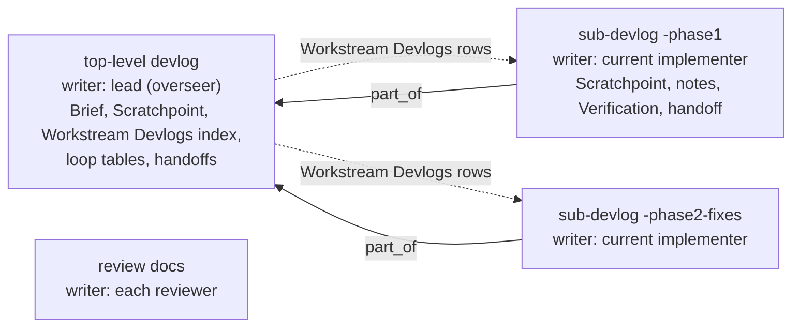

---
first_authored:
  by: "@claude-opus-5-5"
  at: 2026-10-06T11:45:00-07:00
task_list: cdocs/devlog-ownership-rework
type: proposal
state: live
status: implementation_ready
last_reviewed:
  status: accepted
  by: "@claude-opus-5-5"
  at: 2026-10-06T11:56:48-07:00
  round: 2
tags: [orchestration_discipline, devlog, architecture]
---

# Devlog Ownership: Lead Devlog as Index, Sub-Devlogs by Concern

> BLUF(opus-5-5/cdocs/devlog-ownership-rework): A workstream's top-level devlog belongs to its lead (the overseer in a loop): it holds the Brief, the lead's Scratchpoint, the loop tables, handoffs, and a `## Workstream Devlogs` index.
> Implementation notes go in sub-devlogs (`part_of` the top-level), cut by content: a concern, not an agent, a turn, or a context window.
> Whoever is working an open concern writes its sub-devlog, one writer at a time, and a new one starts forward at a natural seam instead of being split out afterwards.
> Recommended over the smaller "implementer owns the workstream devlog" variant (see Alternative Considered).

## Summary

Both designs considered give the overseer and the implementers separate files.
They differ in which file is the root and in how devlogs grow:

| | Recommended: lead devlog as index | Alternative: implementer owns the workstream devlog |
|---|---|---|
| Top-level devlog | lead's (overseer, or a solo implementer) | implementer's |
| Overseer loop state | in the top-level | in the overseer's own linked devlog |
| Implementer notes | sub-devlogs by concern, `part_of` the top-level | one workstream devlog |
| Restart at ~400K, rotation | the next implementer continues the open concern's sub-devlog | the next implementer continues the workstream devlog |
| Growth | a new sub-devlog at a content seam | retroactive split (existing rule) |
| Linking | `part_of`, sub -> top-level | body links both ways |

The recommendation deletes the split procedure (closed-concern test, cut, merge floor, rewording moved text) and rewords triage's chunk sentence into an equivalent family sentence.
No existing devlog is migrated: split devlogs from earlier loops already have this shape (an index root, `part_of` children), and triage reads them with the same family rule.

## Objective

When an overseer owns the loop devlog and dispatched implementers append notes to it:
- The devlog's `## Scratchpoint` tracks orchestration (who is dispatched, which round), not the work, so a resuming implementer has no current-state block of its own.
- Each rotated or restarted implementer adds another section-level Scratchpoint, so they pile up in one file.
- Two live writers share one file, against "One writer per file".

The goal: each devlog is a real devlog with one writer at a time, the overseer keeps continuous loop state per workstream (an overseer may run several), triage still finds a loop's latest verdict, and the rules get shorter.

## Background

- [`orchestration-discipline.md`](../../plugins/cdocs/rules/orchestration-discipline.md): "Stay thin" (the ~400K warm-subagent restart via a handoff beside the Scratchpoint), "Resume from disk" (dispatch/return rows), "One writer per file", "Durable state" (the Scratchpoint, including section-level Scratchpoints from `ec690e6`).
- [`devlog/SKILL.md`](../../plugins/cdocs/skills/devlog/SKILL.md): Scratchpoint, "Splitting a devlog" (~1,500-word look, closed concerns, Chunks table, `part_of`).
- [`iterate/SKILL.md`](../../plugins/cdocs/skills/iterate/SKILL.md) and [`template.md`](../../plugins/cdocs/skills/iterate/template.md): Turn 0 copies the Scratchpoint and the Iteration, Judge, Dispatch/Return, and Steering tables into the loop devlog.
- [`agents/implementer.md`](../../plugins/cdocs/agents/implementer.md), [`implement/SKILL.md`](../../plugins/cdocs/skills/implement/SKILL.md): the implementer appends to the overseer's devlog under `### Implementer Notes`.
- [`agents/triage.md`](../../plugins/cdocs/agents/triage.md) step 6: finds the loop devlog by `task_list`, a `## Iteration Log` heading, and a citation of the proposal, and reads a root and its chunks as one devlog.
- Real loops, both split by hand after the fact:
  - [`2026-10-05-chat-record-devlog-management-iterate.md`](../devlogs/2026-10-05-chat-record-devlog-management-iterate.md): a 653-word root and four chunks of 731 to 2,500 words, cut by phase; the Phase 2 chunk holds two implementers' notes.
  - [`2026-10-05-oversee-haiku-bash-wrapper.md`](../devlogs/2026-10-05-oversee-haiku-bash-wrapper.md): a 990-word arc root and five chunks; one implementer's eight iterations of one phase were cut in two at a model switch. Most root table rows moved out, leaving rows that span two concerns.
  - The roots the splitter produced hold exactly a Brief, an index, the live tables, and handoffs: the top-level this proposal describes.
  - Getting split devlogs readable by triage took two review rounds and two fixes (chat-record Phase 2, iterations 4-6).
- Review r1: [`2026-10-06-review-of-devlog-ownership-rework-r1.md`](../reviews/2026-10-06-review-of-devlog-ownership-rework-r1.md), including the per-chunk word and implementer breakdown of both families.

## Proposed Solution

### Roles and files



- **Top-level devlog**: the lead's devlog for the workstream, named as loop devlogs are today (`YYYY-MM-DD-<slug>-<loop>.md`, such as `-full-send` or `-iterate`).
  In a loop the lead is the overseer; in solo `/cdocs:implement` it is the implementer, and solo work changes only when a devlog reaches a seam worth cutting.
  It holds the Brief (scope, floor, proposal path), the lead's Scratchpoint, a `## Workstream Devlogs` table (`| devlog | writer | status | read this when |`), the loop tables, and handoffs, and it carries the top-level session's `chat_record:`.
  One top-level per workstream, continued by later loops on the same proposal (propose-revise then iterate, or a resumed iterate).
- **Sub-devlog**: a concern's devlog, at `YYYY-MM-DD-<top-level-slug>-<concern>.md` (the top-level's date; a concern such as `-phase1b`, `-phase2-fixes`, `-canary`), with `part_of: <top-level path>` and a first-line backlink NOTE.
  It is a normal devlog: Objective (proposal, predecessor if any), Scratchpoint, Plan, Implementation Notes, Changes Made, Verification, handoff.
  Short concerns share one; a large self-contained concern (a verification campaign done in one turn) gets its own.
- **Reviewers and the judge** write their own review and rationale documents, never a devlog.
  A review is already the single-writer, per-round record, with its verdict and cited evidence.
- **`/oversee` arcs**: the arc overseer starts a top-level devlog per workstream (proposal) and keeps the arc devlog for arc narrative, handoffs, and links to those top-levels.
- `part_of` is one level deep: it always names a devlog that has no `part_of`.

### Who writes what

| Content | Lives in | Writer |
|---|---|---|
| Brief, lead Scratchpoint, Workstream Devlogs index, Iteration/Judge/Dispatch-Return/Steering tables, loop handoffs | top-level | overseer |
| Implementer Scratchpoint, notes, Changes Made, Verification, handoff | the open concern's sub-devlog | whichever implementer is on that concern, one at a time |
| Review, judge rationale | `cdocs/reviews/`, `cdocs/devlogs/_judge/` | reviewer, judge |

Each writer keeps one live `## Scratchpoint` per workstream, replaced in place: the lead's in the top-level, an implementer's in the sub-devlog it is writing.
A writer that moves on to a new sub-devlog closes the one it leaves (handoff, `status: done`, the Scratchpoint's `next:` naming the successor), so only one of its Scratchpoints is live.

### Continuing forward

Devlogs grow by starting a new sub-devlog at a seam, never by moving written text.

- **Look at every return or handoff.** Start a new sub-devlog when a new concern begins that is big enough to stand alone (a phase, a fix round, a verification campaign), or when the current one is around ~1,500 words (`wc -w`) and a natural seam arrives.
  Size prompts the look; the content chooses the cut.
- **Who.** Whoever is writing when the seam arrives: an implementer mid-dispatch closes its sub-devlog, starts the successor, and reports the path in its return; the overseer names a new one when it dispatches a new concern.
  The overseer adds the `## Workstream Devlogs` row either way.
- **Agents do not set the boundary.** A restart, a rotation, a new turn, or a full context continues the open concern's sub-devlog; a new file only when the content calls for one.
- **Top-level tables.** Table rows do not count toward the top-level's size (agents read their last rows).
  Continuing the tables in a forward sub-devlog is a judgment call at a loop or phase boundary, with a line under each table pointing to the continuation.
- Iteration numbers keep increasing across the workstream, so "latest" is defined across files.

### Restart and rotation

On the ~400K restart ("Stay thin") or a judge `rotate-implementer`:
1. The outgoing implementer, when it can, writes its handoff beside its Scratchpoint and commits both by explicit path.
2. The overseer dispatches the next implementer with the proposal path, the sub-devlog to continue (or a new one if the concern changed), the top-level path, the latest review path, scope, and floor.
3. The next implementer reads that sub-devlog's Scratchpoint and latest handoff, the proposal, and the review (and the top-level's Workstream Devlogs "read this when" column as needed), then replaces the Scratchpoint and keeps writing.

### Lookup

- **Triage** (step 6) keeps its filters: `task_list` match, a `## Iteration Log` heading, a citation of the proposal.
  The overseer's top-level matches; sub-devlogs have no Iteration Log unless the tables continued forward.
  Its chunk sentence becomes a family sentence: a sub-devlog stands for its top-level, the family reads as one devlog, and each table's latest row is the row with the highest iteration number across the family.
  Earlier split devlogs (empty root tables, rows in chunks) read correctly under the same sentence.
- **Status** groups sub-devlogs under their top-level by `part_of`, as it groups chunks.
- **Post-compaction**: `grep -l <record path>` finds the devlogs the session wrote; the session's live Scratchpoint is in the top-level (lead) or in its `wip` sub-devlog, and a closed one's `next:` points onward.
- **Judge** reads the top-level's Iteration and Judge Log (and any forward continuation) plus recent reviews.

### Changes by file

| File | Change |
|---|---|
| `rules/orchestration-discipline.md` | "Stay thin": the next subagent continues from the handoff and Scratchpoint. "Resume from disk": rows go in your devlog. "Durable state": one live Scratchpoint per writer per workstream; at each handoff, look for a seam per the devlog skill. Drop the section-level clause. Net word count must not grow. |
| `rules/frontmatter-spec.md` | `part_of`: sub-devlogs, path to the top-level devlog, one level; drop "a chunk carries no `chat_record`" (the chat-record rule already limits it to top-level sessions). |
| `skills/devlog/SKILL.md` | Scratchpoint bullet: one live per writer, replaced in place. `chat_record` bullet: drop the "another agent's devlog" clause. "Splitting a devlog" becomes "Continuing in a new devlog" (the bullets above, including naming and the backlink), plus: a dispatched agent writes the sub-devlog its lead names. |
| `skills/implement/SKILL.md` | Step 3, dispatched: write the sub-devlog the overseer names (create it with `part_of` if absent, else continue from its Scratchpoint and handoff). Scratchpoint line: the sub-devlog's own; look for a seam at each return; on a restart request, write the handoff. |
| `agents/implementer.md` | Constraints: write the sub-devlog in your Task prompt and keep its Scratchpoint; the top-level devlog and its tables are the overseer's and you do not edit them; report any successor sub-devlog you start. |
| `skills/iterate/SKILL.md` | Turn 0: create or continue the workstream's top-level devlog (task_list match, cites the proposal, no `part_of`). Turn N.a: name the sub-devlog to write (the open concern's, or a new one for a new concern) and add Workstream Devlogs rows, including any the implementer reports. Turn N.b: point the reviewer at the proposal and the sub-devlog. Checkpoint: drop "the dispatched implementer keeps none". Steering and resume: "your devlog". |
| `skills/iterate/template.md` | Header: the sections are the top-level devlog's; add an empty `## Workstream Devlogs` table. |
| `skills/propose-revise/SKILL.md` | The loop devlog is the workstream's top-level, owned by the overseer, and a later iterate continues it. (`full-send` already reads correctly.) |
| `skills/oversee/SKILL.md`, `template.md` | The arc overseer starts a top-level devlog per proposal; the arc file's per-proposal `devlog` is that top-level; the arc devlog holds arc narrative and links. |
| `agents/judge.md` | Input: the overseer's top-level devlog (tables may continue in a forward sub-devlog). Rotation onboarding: from the open sub-devlog's handoff and the reviews. |
| `agents/triage.md`, `skills/triage/SKILL.md` | Steps 2 and 5 wording for sub-devlogs (a closed one is `done`); step 6.1's family sentence; output grouping wording. |
| `skills/status/SKILL.md` | "chunks" -> "sub-devlogs"; logic unchanged. |

Key wording, for the implementer to adapt rather than paste:

```markdown
<!-- orchestration-discipline.md, Durable state -->
At each task-unit boundary write a devlog handoff (Completed / Decisions Made / Open Todos) a cold reader can act on, and look for a seam to continue in a new devlog per the devlog skill.
Between handoffs keep your `## Scratchpoint` (as_of, now, next, open, files touched) current after each substantial turn: one per workstream, in the devlog you are writing.

<!-- agents/triage.md, step 6.1 (second sentence) -->
A sub-devlog (`part_of` set) stands for its top-level: steps 2-6 read the family as one devlog, and each table's last row is its row with the highest iteration number across the family.
```

## Important Design Decisions

1. **The lead's devlog is the root.** The overseer's file exists first (propose-revise has no implementer), holds what lookups need (verdicts, open work, the index), and lives as long as the workstream, so it is the natural parent for triage, status, a resumed overseer, and a human.
2. **One writer at a time; a devlog's unit is a concern, not an agent.** Real work segmented by content: one implementer's long phase was cut in two, two implementers shared one phase's chunk. Continuing an open concern's devlog is the same move as resuming one's own devlog after compaction (read the Scratchpoint and handoff, replace the Scratchpoint), so it costs no new intuition.
3. **Forward, not retroactive.** Agents start a new file at a seam readily; they do not re-cut history unprompted. The guidance is soft: size prompts the look, the content chooses the cut.
4. **Reuse `part_of`, no new field.** The recommended shape is the shape split devlogs already have, so `part_of`, the index table, and triage/status grouping carry over; only "chunk" semantics (`done` by construction, no `chat_record`) relax.
5. **Tables stay in the top-level and do not count toward its size.** A `-loop` sub-devlog would add a file to every short loop, and counting rows would make table continuation routine (chat-record's tables reached ~1,450 words in six iterations).
6. **Highest iteration, not file order.** Earlier chunks copied their root's `first_authored`, so timestamps cannot order a family; iteration numbers can.
7. **`## Workstream Devlogs`, not `## Chunks`.** The entries are live documents with their own writers, not pieces cut from the root; lookups key off `part_of`, so legacy `## Chunks` headings keep working.

## Alternative Considered: Implementer Owns the Workstream Devlog

The smallest change: the workstream devlog (`YYYY-MM-DD-<slug>.md`) is the implementers' devlog, and the overseer keeps its own continuous per-workstream devlog for loop state.

- The first implementer creates the workstream devlog at a path the overseer names; later implementers continue it, replacing its Scratchpoint after reading the predecessor's handoff.
- The overseer's devlog (`<slug>-<loop>.md`) holds the Brief, its Scratchpoint, the four tables, and loop handoffs; it is the file triage matches, so triage logic is unchanged.
- Linking is by body links both ways: `part_of` would make the overseer devlog a "chunk" (`done`, no `chat_record`) of a file that does not exist during propose-revise.
- Growth keeps the retroactive split rule.
- Touches about nine files, wording only; no spec, triage, or status logic changes.

For it:
- Smallest diff and least relearning; the overseer devlog is today's loop devlog minus the guests.
- One continuous implementation narrative per workstream.

Against it:
- The implementer prose alone reached ~5,500 words (chat-record) and ~6,400 words (haiku p0), so the workstream devlog still needs the retroactive split, its moved-row lines, and triage's chunk logic, which took two review rounds to get right.
- The overseer's file also grows and splits.
- The state record and index sit in the "sub" file, and `/cdocs:status` shows the pair as unrelated rows.
- Forward continuation needs an index, and the natural home for that index is the lead's devlog, which turns this design into the recommended one.

The recommended design keeps this alternative's real strength, continuity of an open concern across implementers, inside its sub-devlogs.

## Edge Cases

- **Propose-revise only:** the top-level holds proposer and reviewer rows; no sub-devlogs exist.
- **A writer stops without a handoff** (stuck, killed): the next implementer continues the sub-devlog from its Scratchpoint, last notes, and the latest review. If the concern is abandoned instead, the successor or the overseer may set the dead writer's file to `done`; a dead writer is not a live one.
- **Parallel implementers on disjoint footprints:** different concerns, one sub-devlog each; only the overseer writes the top-level, so Workstream Devlogs rows never collide.
- **A later loop misses the existing top-level:** triage picks the most recent matching family (step 6.4, unchanged); iterate Turn 0 continues the top-level without `part_of`.
- **Solo session that continues forward:** the session lists its `chat_record` in each devlog it works on and closes the one it leaves.
- **Earlier split devlogs:** read as families; the highest-iteration rule finds the verdict whether rows sit in the root or in chunks.
- **Nested `part_of`:** not allowed; triage reports a `part_of` naming a sub-devlog, as it reports one naming no devlog.

## Test Plan

- `npm run build:cdocs` exits 0.
- `plugins/cdocs/hooks/tests/chat-record.test.sh --unit` passes.
- The frontmatter validator is silent for each cdocs file the change writes and for a fixture sub-devlog (`part_of`, `status: wip`).
- Stale-reference grep (`grep -rniE`) over `plugins/cdocs` returns nothing for: `top of your own`, `top of its own`, `top of that section`, `notes section`, `keeps none`, `another agent's devlog`, `Implementer Notes`, `tables belong to the overseer`, `Splitting a devlog`, `split trigger`, `chunk`.
- `wc -w plugins/cdocs/rules/*.md` total does not grow; `wc -w plugins/cdocs/skills/devlog/SKILL.md` shrinks.
- Triage fixtures in a scratch repo (headless `claude -p --plugin-dir <abs plugins/cdocs> --model sonnet '/cdocs:triage <proposal>'`):
  1. Pair: proposal `implementation_wip`; top-level `-iterate` with rows 1 (revise) and 2 (accept); `-phase1` sub-devlog with notes and no tables -> `[STATUS] implementation_accepted`, `devlog:` the top-level.
  2. Forward tables: as 1, but top-level rows 1-2 (revise) with a pointer line and a sub-devlog holding row 3 (accept) -> `implementation_accepted` (failure: reads row 2 and returns `[NONE]`).
  3. Mid-loop: last row revise, no Judge Log rows -> `[NONE]` with "in-flight iterate loop".
  4. Chat-record history, on copies of `cdocs/proposals/2026-09-22-chat-record-devlog-management.md` and its iterate devlog family -> `[NONE]`, not a regression to `implementation_ready`.
  5. Haiku arc history, on copies of `cdocs/proposals/2026-09-22-haiku-bash-wrapper.md` and the arc devlog family (Iteration rows 1-5 and 6-8 in two chunks, Judge rows at 5 and 8) -> latest Iteration row 8 (accept), latest Judge row 8, `[NONE]` (failure: reads row 5).

## Verification Methodology

The floor: build, validator, and unit suite pass; the grep is clean; triage locates loop state on the fixtures; and a live sonnet `/cdocs:iterate` smoke in a sandbox produces an implementer-written sub-devlog with its own Scratchpoint and a separate overseer top-level with dispatch/return and iteration rows.
Failure picture: overseer rows land in the sub-devlog, the implementer edits the top-level, a devlog carries two live Scratchpoints, or triage cannot find the latest verdict.

Live smoke: adapt the loop-smoke driver described in [the rules-context-decomposition devlog](../devlogs/2026-10-06-rules-context-decomposition-full-send.md) "Phase 5 verification" (sandboxed `CLAUDE_CONFIG_DIR`, rules materialized, the one-file `greet.sh` proposal, `claude -p --plugin-dir <abs> --model sonnet --permission-mode bypassPermissions`, stream-json).
Check from the transcripts, not only the files:
- Every Write/Edit on the top-level comes from the lead; every Write/Edit on the sub-devlog comes from an implementer transcript, and no two implementer transcripts overlap in time on it.
- Each devlog has exactly one `## Scratchpoint`.
- The top-level has the Iteration Log row, dispatch and return rows, and a Workstream Devlogs row naming the sub-devlog; the sub-devlog has `part_of`, notes, and Verification; neither holds the other's sections.
- Staging is by explicit path in every transcript.
- Triage run in the sandbox afterwards reports the loop's verdict from the top-level.

Optional, if cheap: a two-phase variant (phase 2 adds `--shout`) whose brief asks for a fresh implementer for phase 2, checking that the fresh implementer continues or starts a sub-devlog by content (not because it is fresh), replaces rather than adds a Scratchpoint, and that only one implementer writes at a time.
Record evidence paths in the implementation devlog.

## Implementation Phases

One implementer, phases in order; each phase commits its own files by explicit path.
Do not edit existing devlogs, reviews, or proposals other than this one's status; do not change `cdocs-validate-frontmatter.sh` unless the fixture check fails.

### Phase 1: Ownership and the Scratchpoint

Files: `rules/orchestration-discipline.md`, `skills/devlog/SKILL.md` (Scratchpoint and `chat_record` bullets only), `skills/implement/SKILL.md`, `agents/implementer.md`.
Success: the section-level Scratchpoint wording is gone; a dispatched implementer's instructions say it writes the named sub-devlog, continues an open one from its handoff, and never edits the top-level; always-loaded rule words do not grow; unit suite passes.

### Phase 2: Forward continuation and lookup

Files: `skills/devlog/SKILL.md` ("Continuing in a new devlog" replaces "Splitting a devlog"), `rules/frontmatter-spec.md`, `agents/triage.md`, `skills/triage/SKILL.md`, `skills/status/SKILL.md`.
Success: triage fixtures 1-5 pass, the devlog skill shrinks, and `grep -rni chunk plugins/cdocs` is empty.

### Phase 3: Loop skills

Files: `skills/iterate/SKILL.md`, `skills/iterate/template.md`, `skills/propose-revise/SKILL.md`, `skills/oversee/SKILL.md`, `skills/oversee/template.md`, `agents/judge.md`.
Depends on Phases 1-2 for the terms (top-level, sub-devlog, Workstream Devlogs table).
Success: build passes; the stale-reference grep is clean; iterate's Turn 0, N.a, N.b, Checkpoint, Steering, and resume text name the right file for each write.

### Phase 4: Verification

Run the full Test Plan and the live smoke; paste evidence into the implementation devlog.
Rule text changes alter `/cdocs:init` output, so consuming projects' materialized rules (`.claude/rules/cdocs.md`, `AGENTS.md`) refresh through `/cdocs:init` and the freshness hook; this repo has none to regenerate.
Success: the floor above, with the failure picture checked explicitly against transcripts.
