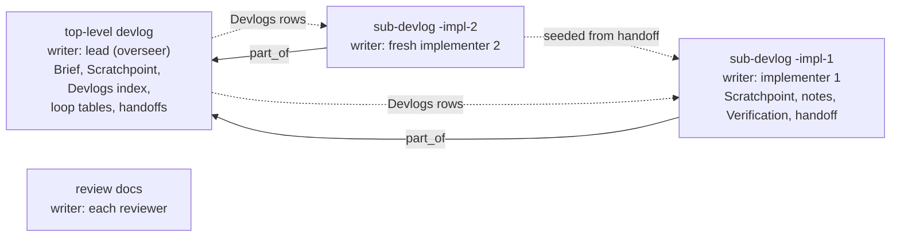

---
first_authored:
  by: "@claude-opus-5-5"
  at: 2026-10-06T11:45:00-07:00
task_list: cdocs/devlog-ownership-rework
type: proposal
state: live
status: review_ready
last_reviewed:
  status: revision_requested
  by: "@claude-opus-5-5"
  at: 2026-10-06T11:58:00-07:00
  round: 1
tags: [orchestration_discipline, devlog, architecture]
---

# Devlog Ownership: One Writer per Devlog, Lead Devlog as Index

> BLUF(opus-5-5/cdocs/devlog-ownership-rework): Every devlog has one writer and one `## Scratchpoint`.
> A workstream's top-level devlog belongs to its lead (the overseer in a loop): it holds the Brief, the lead's Scratchpoint, the loop tables, handoffs, and a `## Devlogs` index.
> Each dispatched implementer writes its own sub-devlog (`part_of` the top-level), and a devlog that outgrows ~1,500 words continues forward in a new one at the next checkpoint, replacing retroactive splitting.
> Recommends this over the smaller "implementer owns the workstream devlog, overseer keeps a sub-devlog" variant, laid out in Alternative Considered.

## Summary

Two designs fix the shared loop devlog, and both give the overseer and the implementers separate files.
They differ in which file is the root and in how devlogs grow:

| | Recommended: lead devlog as index | Alternative: implementer owns the workstream devlog |
|---|---|---|
| Top-level devlog | lead's (overseer, or a solo implementer) | implementer's, continued by successors |
| Overseer loop state | in the top-level | in the overseer's own linked devlog |
| Implementer notes | own sub-devlog per implementer, `part_of` the top-level | the workstream devlog |
| Restart at ~400K / rotation | fresh implementer starts a new sub-devlog from the handoff | fresh implementer continues the same devlog |
| Growth | continue forward at a checkpoint | retroactive split (existing rule) |
| Linking | `part_of`, sub -> top-level | body links both ways |

The recommendation costs about three more touched files than the alternative but shrinks the rule text: the 25-line split rule becomes a short "continue forward" rule, and triage's chunk special case becomes one family rule.
No existing devlog is migrated: split devlogs from earlier loops already have the recommended shape (index root, `part_of` children) and triage reads them with the same rule.

## Objective

When an overseer owns the loop devlog and dispatched implementers append notes to it:
- The devlog's `## Scratchpoint` tracks orchestration (who is dispatched, which round), not the work, so a resuming implementer has no current-state block of its own.
- Each rotated or restarted implementer adds another section-level Scratchpoint, so they pile up in one file.
- Two live writers share one file, against "One writer per file".

The goal: each devlog is a real devlog with one writer, the overseer keeps continuous loop state per workstream (an overseer may run several workstreams), triage still finds a loop's latest verdict, and the rules get simpler rather than longer.

## Background

- [`orchestration-discipline.md`](../../plugins/cdocs/rules/orchestration-discipline.md): "Stay thin" (the ~400K warm-subagent restart via a handoff beside the Scratchpoint), "Resume from disk" (dispatch/return rows), "One writer per file", "Durable state" (the Scratchpoint; section-level Scratchpoints from `ec690e6`).
- [`devlog/SKILL.md`](../../plugins/cdocs/skills/devlog/SKILL.md): Scratchpoint, "Splitting a devlog" (trigger ~1,500 words, closed concerns, Chunks table, `part_of`).
- [`iterate/SKILL.md`](../../plugins/cdocs/skills/iterate/SKILL.md) and [`template.md`](../../plugins/cdocs/skills/iterate/template.md): Turn 0 copies the Scratchpoint and the Iteration, Judge, Dispatch/Return, and Steering tables into the loop devlog.
- [`agents/implementer.md`](../../plugins/cdocs/agents/implementer.md), [`implement/SKILL.md`](../../plugins/cdocs/skills/implement/SKILL.md): the implementer appends to the overseer's devlog under `### Implementer Notes`.
- [`agents/triage.md`](../../plugins/cdocs/agents/triage.md) step 6: finds the loop devlog by `task_list`, a `## Iteration Log` heading, and a citation of the proposal; reads a root and its chunks as one devlog.
- Evidence from real loops:
  - [`2026-10-05-chat-record-devlog-management-iterate.md`](../devlogs/2026-10-05-chat-record-devlog-management-iterate.md): a 653-word root with four retroactive chunks of 731 to 2,500 words; the Phase 2 chunk interleaves the overseer's three tables with impl-4's and impl-5's notes sections.
  - [`2026-10-05-oversee-haiku-bash-wrapper.md`](../devlogs/2026-10-05-oversee-haiku-bash-wrapper.md): a 990-word arc root, five chunks, every root table empty with a "Finished rows moved" line.
  - Getting split devlogs readable by triage took two review rounds and two fixes (chat-record Phase 2, iterations 4-6: chunk-blind lookup, then an empty-root-table gap).

## Proposed Solution

### Roles and files



- **Top-level devlog**: the lead's devlog for the workstream, named as loop devlogs are today (`YYYY-MM-DD-<slug>-<loop>.md`, e.g. `-full-send`, `-iterate`).
  In a loop the lead is the overseer; in solo `/cdocs:implement` it is the implementer, and nothing changes for solo work until a devlog outgrows the trigger.
  It holds the Brief (scope, floor, proposal path), the lead's Scratchpoint, a `## Devlogs` table, the loop tables, and handoffs.
  It carries the top-level session's `chat_record:`.
  One top-level per workstream, continued by later loops on the same proposal (propose-revise then iterate, or a resumed iterate).
- **Sub-devlog**: any other agent's devlog in the workstream, at `YYYY-MM-DD-<top-level-slug>-<concern>.md` (the top-level's date; concern such as `-impl-1`, `-phase2`), with `part_of: <top-level path>` and a first-line backlink NOTE.
  A dispatched implementer's sub-devlog is a normal devlog: Objective (proposal, predecessor if any), its own Scratchpoint, Plan, Implementation Notes, Changes Made, Verification, handoff.
- **Reviewers and the judge** write their own review and rationale documents, never a devlog.
- `part_of` is one level deep: it always names a devlog that has no `part_of`.
  An `/oversee` arc devlog links its workstreams' top-level devlogs in its body and arc file, as today.

### Who writes what

| Content | Lives in | Writer |
|---|---|---|
| Brief, overseer Scratchpoint, Devlogs index, Iteration/Judge/Dispatch-Return/Steering tables, loop handoffs | top-level | overseer |
| Implementer Scratchpoint, notes, Changes Made, Verification, restart handoff | implementer's sub-devlog | that implementer only |
| Review, judge rationale | `cdocs/reviews/`, `cdocs/devlogs/_judge/` | reviewer, judge |

Every devlog has exactly one `## Scratchpoint`, replaced in place by its writer.
The section-level Scratchpoint ("top of your own section") is withdrawn: with one writer per devlog it has no use.

### Continuing forward instead of splitting

Devlogs grow by starting a new one, never by moving written text.

- **When.** At a checkpoint (a handoff at a phase end, a restart, a rotation), if the devlog you are writing is past ~1,500 words (`wc -w`), and always when a fresh agent takes over a dispatched agent's work.
- **Close.** Write the handoff (Completed / Decisions Made / Open Todos), set `status: done`, and point the Scratchpoint's `next:` at the successor.
- **Start.** The successor is a sub-devlog of the top-level (`part_of`, backlink, Objective linking the predecessor's handoff).
  The lead adds its `## Devlogs` row: `| devlog | writer | status | read this when |`.
- **Top-level.** Never closed while the workstream is live.
  When it passes ~1,500 words at a checkpoint, its owner continues its tables in a forward sub-devlog (new rows there, one line under each table pointing to it) and keeps the Brief, Scratchpoint, Devlogs table, and latest handoff in the top-level.
- Iteration numbers keep increasing across the workstream, so "latest" is well defined across files.

This replaces "Splitting a devlog" (trigger, closed-concern test, cut, merge floor, root as index, chunk rewording) with the four bullets above.

### Restart and rotation

On the ~400K restart ("Stay thin") or a judge `rotate-implementer`:
1. The outgoing implementer, when it can, writes its handoff beside its Scratchpoint, closes its sub-devlog, and commits both by explicit path.
2. The overseer dispatches a fresh implementer with: the proposal path, a new sub-devlog path, the predecessor's sub-devlog path, the latest review path, scope and floor.
3. The fresh implementer reads the predecessor's Scratchpoint and handoff (its notes only as needed), the proposal, and the review, then starts its own sub-devlog.
4. The overseer logs the dispatch row and the Devlogs row.

A warm implementer kept across iterations continues its own sub-devlog; if it crosses the trigger at a phase end it closes and starts its successor itself, reporting the new path in its return.

### Lookup

- **Triage** (step 6) keeps its filters: `task_list` match, a `## Iteration Log` heading, a citation of the proposal.
  The overseer's top-level matches; implementer sub-devlogs have no Iteration Log.
  One rule replaces the chunk special case: a sub-devlog stands for its top-level, the family reads as one devlog, and each table's latest row is the row with the highest iteration number across the family.
  This also reads earlier split devlogs (empty root tables, rows in chunks) correctly, so no legacy clause is needed.
- **Status** groups sub-devlogs under their top-level by `part_of`, as it groups chunks.
- **Post-compaction**: `grep -l <record path>` finds the devlogs the session wrote; the `wip` one's Scratchpoint is current, a closed one's `next:` points onward.
- **Judge** reads the top-level's Iteration and Judge Log (and any forward continuation) plus recent reviews.

### Changes by file

| File | Change |
|---|---|
| `rules/orchestration-discipline.md` | "Stay thin": the fresh subagent starts its own devlog from the handoff. "Resume from disk": rows go in your devlog. "Durable state": one Scratchpoint per devlog, by its writer; continue forward per the devlog skill when past the trigger. Drop the section-level clause. Net word count must not grow. |
| `rules/frontmatter-spec.md` | `part_of`: sub-devlogs, path to the top-level devlog, one level; drop "a chunk carries no `chat_record`" (the chat-record rule already limits it to top-level sessions). |
| `skills/devlog/SKILL.md` | Scratchpoint bullet: one, by the devlog's writer. `chat_record` bullet: drop the "another agent's devlog" clause. "Splitting a devlog" becomes "Continuing in a new devlog" (the bullets above) plus one line: a dispatched agent writes its own sub-devlog at the path its lead names. |
| `skills/implement/SKILL.md` | Step 3: dispatched, create the devlog at the named path (`part_of` the top-level), seeded from a predecessor's handoff when given. Scratchpoint line: the devlog's own; on a restart request, write the handoff and close. |
| `agents/implementer.md` | Constraints: your devlog is the sub-devlog in your Task prompt; keep its Scratchpoint and notes; the top-level devlog and its tables are the overseer's and you do not edit them. |
| `skills/iterate/SKILL.md` | Turn 0: create or continue the workstream's top-level devlog (the overseer's own). Turn N.a: name the implementer's sub-devlog (new for each fresh implementer), add its Devlogs row. Turn N.b: point the reviewer at the proposal and the implementer's sub-devlog. Checkpoint: drop "the dispatched implementer keeps none". Steering and resume: "your devlog". |
| `skills/iterate/template.md` | Header: the sections are the top-level devlog's; add an empty `## Devlogs` table. |
| `skills/full-send/SKILL.md`, `skills/propose-revise/SKILL.md` | One top-level devlog per workstream, owned by the overseer, carrying both loops. |
| `skills/oversee/SKILL.md`, `template.md` | The arc file's per-proposal `devlog` is that workstream's top-level; the arc devlog is the arc's own. |
| `agents/judge.md` | Input: the overseer's top-level devlog (tables may continue in a forward sub-devlog). Rotation onboarding: from the predecessor's handoff and the reviews. |
| `agents/triage.md`, `skills/triage/SKILL.md` | Step 2 and 5 wording for sub-devlogs (a closed one is `done`); step 6.1's family rule above; output grouping wording. |
| `skills/status/SKILL.md` | "chunks" -> "sub-devlogs"; logic unchanged. |

Key wording, for the implementer to adapt rather than paste:

```markdown
<!-- orchestration-discipline.md, Durable state -->
At each task-unit boundary write a devlog handoff (Completed / Decisions Made / Open Todos) a cold reader can act on; past ~1,500 words, continue in a new devlog per the devlog skill.
Between handoffs keep the `## Scratchpoint` (as_of, now, next, open, files touched) of the devlog you write current after each substantial turn; each devlog has one writer and one Scratchpoint.

<!-- agents/triage.md, step 6.1 (second sentence) -->
A sub-devlog (`part_of` set) stands for its top-level: steps 2-6 read the family as one devlog, and each table's last row is its row with the highest iteration number across the family.
```

## Important Design Decisions

1. **The lead's devlog is the root.** The overseer's file exists first (propose-revise has no implementer), holds what lookups need (verdicts, open work, the index), and lives as long as the workstream; making it the parent matches who reads it first (triage, status, a resumed overseer, a human).
2. **One writer per devlog, ever.** Succession inside one file (the alternative) is single-writer at any moment but mixes authors' Scratchpoints and prose; a fresh file per fresh agent removes the pile-up by construction and fits "always create a devlog".
3. **Forward, not retroactive.** Agents naturally start a new file at a seam; they do not naturally re-cut history. Forward cuts land at predicted seams (phase ends, restarts) rather than discovered ones; a concern spanning a cut is carried by the handoff.
4. **Reuse `part_of`, no new field.** The recommended shape is the shape split devlogs already have, so `part_of`, the index table, and triage/status grouping carry over; only "chunk" semantics (`done` by construction, no `chat_record`) relax.
5. **Tables stay in the top-level by default.** A separate `-loop` sub-devlog for every workstream would add a file to every short loop; forward continuation of the tables covers long ones.
6. **Highest iteration, not file order.** Earlier chunks copied their root's `first_authored`, so timestamps cannot order a family; iteration numbers can.
7. **Reviewers stay out of devlogs.** Their output is a review document with a verdict; a reviewer devlog would duplicate it.

## Alternative Considered: Implementer Owns the Workstream Devlog

The smallest change: the workstream devlog (`YYYY-MM-DD-<slug>.md`) is the implementers' devlog again, and the overseer keeps its own continuous per-workstream devlog for loop state.

- The first implementer creates the workstream devlog at a path the overseer names; rotated or restarted implementers continue it, reading and then replacing its Scratchpoint, after the predecessor's handoff.
- The overseer's devlog (`<slug>-<loop>.md`) holds the Brief, its Scratchpoint, the four tables, and loop handoffs; it is the file triage matches, so triage logic is unchanged.
- Linking is by body links both ways: `part_of` would make the overseer devlog a "chunk" (`done`, no `chat_record`) of a file that does not exist during propose-revise.
- Growth keeps the retroactive split rule.
- Touches about nine files, wording only; no spec, triage, or status logic changes.

For it:
- Smallest diff and least relearning; the overseer devlog is exactly today's loop devlog minus the guests.
- One continuous implementation narrative per workstream, which a reviewer reads in one file.
- Fewer files on a long loop with several implementers.

Against it:
- The heavier artifacts stay: the split rule, its moved-row lines, and triage's empty-root-table logic, which took two review rounds to get right.
- Both files grow unbounded and each eventually needs a retroactive split, the overseer's file most (its tables run about 200 words per iteration).
- The state record and index sit in the "sub" file; `/cdocs:status` shows the pair as unrelated rows.
- Restart is succession in one file: the fresh implementer inherits its predecessor's Scratchpoint and prose.
- Forward continuation is separable in principle, but it needs an index, and the natural home for that index is the lead's devlog, which turns this design into the recommended one.

Verdict: the alternative is a sound minimal fix for the three symptoms, but it keeps the split machinery the recommended design deletes; the recommended design costs a few more touched files for a smaller rule surface and cleaner restarts.

## Edge Cases

- **Propose-revise only:** the top-level holds proposer and reviewer rows; no sub-devlogs exist.
- **Implementer stops without a handoff** (stuck, killed): the fresh implementer reads the predecessor's Scratchpoint, last notes, and the latest review; the overseer marks the predecessor `done` in its Devlogs row and asks no edit of the dead file.
- **Parallel implementers on disjoint footprints:** one sub-devlog each; only the overseer writes the top-level, so Devlogs rows never collide.
- **A later loop misses the existing top-level:** triage picks the most recent matching family (step 6.4, unchanged); iterate Turn 0 says to continue the workstream's existing top-level.
- **Solo session that continues forward:** the session lists its `chat_record` in each devlog it works on; the closed one's `next:` names the successor.
- **Earlier split devlogs:** read as families; the highest-iteration rule finds the verdict whether rows sit in the root or in chunks. They keep their `## Chunks` heading; lookups key off `part_of`, not the heading.
- **Nested `part_of`:** not allowed; triage reports a `part_of` naming a sub-devlog, as it reports one naming no devlog.

## Test Plan

- `npm run build:cdocs` exits 0.
- `plugins/cdocs/hooks/tests/chat-record.test.sh --unit` passes.
- The frontmatter validator is silent for each cdocs file the change writes, and for a fixture sub-devlog (`part_of`, `status: wip`).
- Stale-reference grep (`grep -rniE`) over `plugins/cdocs` returns nothing for: `top of your own`, `top of that section`, `keeps none`, `another agent's devlog`, `Implementer Notes`, `tables belong to the overseer`, `Splitting a devlog`, `split trigger`, `chunk`.
- `wc -w plugins/cdocs/rules/*.md` total does not grow; `wc -w plugins/cdocs/skills/devlog/SKILL.md` shrinks.
- Triage fixtures (scratch repo, headless `claude -p --plugin-dir <abs plugins/cdocs> --model sonnet '/cdocs:triage <proposal>'`), each with a proposal at `implementation_wip`:
  1. Pair: top-level `-iterate` with rows 1 (revise) and 2 (accept), plus `-impl-1` with notes and no tables -> `[STATUS] implementation_accepted`, `devlog:` the top-level.
  2. Forward tables: top-level rows 1-2 (revise) with a pointer line, sub-devlog rows 3 (accept) -> `implementation_accepted` (failure: reads row 2 and returns `[NONE]`).
  3. Mid-loop: last row revise, no Judge Log rows -> `[NONE]` with "in-flight iterate loop".
  4. Real history: triage on `cdocs/proposals/2026-09-22-chat-record-devlog-management.md` -> `[NONE]`, not a regression to `implementation_ready`.

## Verification Methodology

The floor (from the loop Brief): build, validator, and unit suite pass; the grep is clean; triage locates loop state on the fixtures; and a live sonnet `/cdocs:iterate` smoke in a sandbox produces an implementer-written sub-devlog with its own Scratchpoint and a separate overseer top-level with dispatch/return and iteration rows.
Failure picture: overseer rows land in the implementer's devlog, the implementer edits the top-level, or triage cannot find the latest verdict.

Live smoke: adapt the loop-smoke driver described in [the rules-context-decomposition devlog](../devlogs/2026-10-06-rules-context-decomposition-full-send.md) "Phase 5 verification" (sandboxed `CLAUDE_CONFIG_DIR`, rules materialized, the one-file `greet.sh` proposal, `claude -p --plugin-dir <abs> --model sonnet --permission-mode bypassPermissions`, stream-json).
Check from the transcripts, not only the files:
- Every Write/Edit on the top-level comes from the lead; every Write/Edit on the sub-devlog comes from the implementer's transcript.
- The top-level has the Iteration Log row, dispatch and return rows, and a Devlogs row naming the sub-devlog; the sub-devlog has `part_of`, one `## Scratchpoint`, notes, and Verification; neither holds the other's sections.
- Staging is by explicit path in every transcript.
- Triage run in the sandbox afterwards reports the loop's verdict from the top-level.

Optional, if cheap: a two-phase variant (phase 2 adds `--shout`) with "use a fresh implementer for phase 2" in the floor, checking that the second implementer starts `-impl-2` seeded from `-impl-1`'s handoff and that `-impl-1` is `done`.
Record evidence paths in the implementer's devlog.

## Implementation Phases

One implementer, phases in order; each phase commits its own files by explicit path.
Do not edit existing devlogs, reviews, or proposals other than this one's status; do not change `cdocs-validate-frontmatter.sh` unless the fixture check fails.

### Phase 1: Ownership and the Scratchpoint

Files: `rules/orchestration-discipline.md`, `skills/devlog/SKILL.md` (Scratchpoint and `chat_record` bullets only), `skills/implement/SKILL.md`, `agents/implementer.md`.
Success: the section-level Scratchpoint wording is gone; a dispatched implementer's instructions say it writes its own sub-devlog at the named path and never the top-level; always-loaded rule words do not grow; unit suite passes.

### Phase 2: Forward continuation and lookup

Files: `skills/devlog/SKILL.md` ("Continuing in a new devlog" replaces "Splitting a devlog"), `rules/frontmatter-spec.md`, `agents/triage.md`, `skills/triage/SKILL.md`, `skills/status/SKILL.md`.
Success: triage fixtures 1-4 pass, the devlog skill shrinks, and `grep -rni chunk plugins/cdocs` is empty.

### Phase 3: Loop skills

Files: `skills/iterate/SKILL.md`, `skills/iterate/template.md`, `skills/full-send/SKILL.md`, `skills/propose-revise/SKILL.md`, `skills/oversee/SKILL.md`, `skills/oversee/template.md`, `agents/judge.md`.
Depends on Phases 1-2 for the terms (top-level, sub-devlog, Devlogs table).
Success: build passes; the stale-reference grep is clean; iterate's Turn 0, N.a, N.b, Checkpoint, Steering, and resume text name the right file for each write.

### Phase 4: Verification

Run the full Test Plan and the live smoke; paste evidence into the implementer's devlog.
Success: the floor above, with the failure picture checked explicitly against transcripts.

## Open Questions

1. Should loop tables always live in a `-loop` sub-devlog, leaving the top-level a pure index? This proposal keeps them in the top-level to avoid a third file on short loops.
2. Rename the index heading to `## Devlogs` (proposed) or keep `## Chunks`? Lookups key off `part_of`, so either works.
3. The maintainer floated reviewers as devlog co-owners; this proposal keeps reviewers to review documents. Is there a reviewer need a devlog would serve?
4. Should a warm implementer that crosses ~1,500 words at a phase end start its successor itself (proposed) or wait for the overseer to name it?
