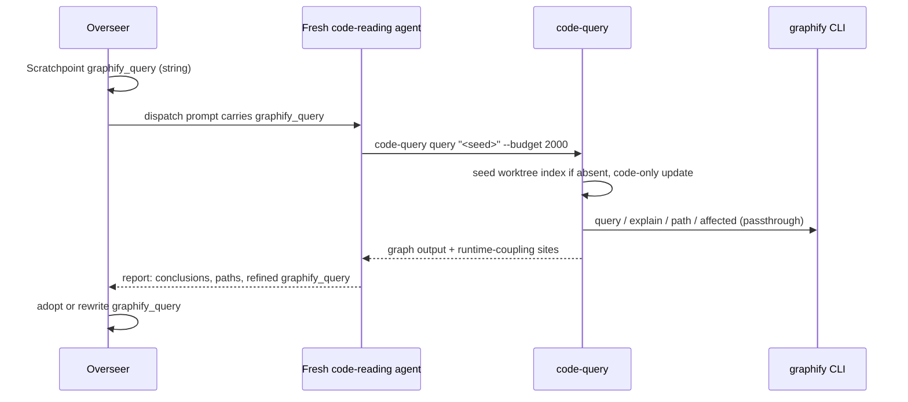

---
first_authored:
  by: "@claude-opus-5-5"
  at: 2026-10-08T08:56:00-07:00
task_list: cdocs/graphify-overhaul
type: proposal
state: live
status: review_ready
last_reviewed:
  status: accepted
  by: "@claude-opus-5-5"
  at: 2026-10-08T09:35:00-07:00
  round: 2
tags: [graphify, claude_skills, architecture, token_efficiency]
---

# Graphify overhaul: a workstream seed query run by fresh contexts

> BLUF: Replace `graphify-scope` (362 lines, overseer-run) with `code-query` (at most about 80 lines), which each code-reading agent runs itself.
> It seeds a per-worktree index from the main graph if absent, runs an incremental code-only `graphify update`, passes `query`/`explain`/`path`/`affected` through unchanged, and appends `.observe`/`.subscribe` sites the graph cannot see.
> `cdocs/` is excluded from every graph via the repo's `.graphifyignore` (written by `/cdocs:init`), and `code-query` rebuilds any index that still holds `cdocs/` nodes.
> The overseer only writes the Scratchpoint `graphify_query:` string and passes it in dispatch prompts; a thin `/cdocs:code-query` skill and the "CDocs Tool Use Guidance › Tools and Skills" line deliver the rest.

## Summary

The shipped integration has the overseer run `graphify-scope` (`explain` per changed file, then `affected` per symbol) and paste its output verbatim into the reviewer's prompt.
That puts graph output in the overseer's context, reduces the graph to a union of dependent file paths, and leaves `query` and `path` unused.
In the lace devcontainer, the only environment with graphify, it also never scopes: it skips with `stale-index` whenever any changed file is newer than the index (`graphify-scope:251-254`), every review round's changed files are, and nothing refreshes the index (no git hook).

The replacement:
- **Seed query.** `graphify_query:` (already in both Scratchpoint templates) is one natural-language question, in the workstream's own entity names, that loads the code context the work needs.
  The overseer writes and refines it; it never runs graph commands or reads their output.
- **Any agent that reads code runs it**, at startup, through `code-query`, then uses `explain`, `path`, and single-symbol `affected` as its work demands.
  Implementers return a refined query in their report.
- **`code-query`** gives each worktree its own index, copied once from the main graph and kept current by incremental code-only updates, so no agent writes a shared index.
- **`cdocs/` stays out of the graph:** it is large and is prose the agents read directly.
  graphify's own `.graphifyignore` excludes it from every build and update.
- **Delivery.** The rule line reaches every agent (discovery plus the overseer's duty); the skill carries the per-role procedure; iterate gains a short "Seed query" section.

Absent graphify or any index, `code-query` prints one line and exits 0, and the overseer leaves `graphify_query` empty.

> NOTE(claude-opus-5-5/cdocs/graphify-overhaul): Neither design has been measured.
> The only `/cdocs:ablate` run on graphify (Probe A, single-file) found `context_gap 0`, and the prior proposal's multi-file efficiency spot-check never ran.
> This proposal rests on context hygiene, per-worktree correctness, and use of the CLI's actual surface; a multi-file ablate run is a follow-up, not a gate.

## Objective

Make graphify serve the agents that read code, on their own terms, with an index that matches their own tree, while keeping the overseer's context free of graph output.

## Background

- **Prior design:** [`2026-09-17-graphify-cdocs-integration.md`](2026-09-17-graphify-cdocs-integration.md) (`implementation_accepted`; lean track "prime-context + instruct-agents"), its reviews, and the [full-send devlog](../devlogs/2026-09-23-graphify-cdocs-integration-full-send.md).
  Its live run against graphify 0.9.61 found plain-text output, `affected` as the dependents primitive, symbol labels (not file names) as targets, and the index at `$GRAPHIFY_OUT`.
  The `explain`+`affected` pipeline came from that contract reconciliation, not from weighing it against `query`.
  Its D3 made the CRDT blind spot structural: briefs co-surfaced `.observe`/`.subscribe` sites, and a near-empty dependent set on such files forced an unscoped sweep.
- **MCP vs CLI:** [`2026-09-17-graphify-mcp-vs-cli-value-add.md`](../reports/2026-09-17-graphify-mcp-vs-cli-value-add.md): CLI subcommands map 1:1 to MCP tools.
- **Environment:** [`2026-09-17-graphify-lace-devcontainer-enablement.md`](2026-09-17-graphify-lace-devcontainer-enablement.md).
  The lace feature `graphify:1` installs PyPI `graphifyy` 0.9.61 via pipx, bakes `GRAPHIFY_OUT=/var/cache/graphify` (one index shared by every worktree, D3), and installs no git hook (D5).
  MCP registration is shadowed by a host config bind-mount; access is CLI-only.
  graphify is not installed on the host.
- **CLI surface** ([CLI reference](https://graphify.net/graphify-cli-commands.html), [README v8](https://github.com/Graphify-Labs/graphify/blob/v8/README.md), PyPI latest 0.9.80):
  - `query "<question>"` with `--budget N`, `--dfs`, `--graph <path>`; `explain "<entity>"`; `path "<A>" "<B>"`.
  - `update <path>`: re-extracts changed files only. Code is tree-sitter AST (no LLM); docs use an LLM backend.
    The README says rebuilds are serialized against concurrent writes.
  - `extract <path> --code-only`: AST only, no API calls.
  - Exclusion: `.graphifyignore` in the project root (gitignore syntax, `!` negation), merged after each directory's `.gitignore`, which is respected automatically; `extract --no-gitignore` disables the latter.
    There is no `--exclude` flag.
  - Paths: `manifest.json` keys and node `source_file` values are relative to the scan root ("re-anchored on load, so committing it is safe").
  - Pruning: `update` does not remove nodes for deleted files ("the old nodes linger"); `--force` overwrites even when the rebuild has fewer nodes.
  - `install` / `claude install`: the `/graphify` skill plus a `PreToolUse` `hook-guard` nudging toward `graphify query`.
  - `affected` (reverse dependents) exists in 0.9.61 but not in the current public docs.
- **graphify's skill** ([v8 `skill.md`](https://github.com/Graphify-Labs/graphify/blob/v8/graphify/skill.md)): 723 lines, almost all build pipeline; the query fast path is a short block.
- **Maintainer edits:** `dba0ac9` added "CDocs Tool Use Guidance › Tools and Skills" with a `/graphify` line; `58bb5fa` and `0832011` added the undefined `graphify_query:` Scratchpoint field.

## Proposed Solution

### Roles



| Role | `graphify_query` | Runs `code-query` | Uses |
|---|---|---|---|
| Overseer (iterate, propose-revise, full-send, oversee) | Writes on Turn 0; refines between rounds | Never | Passes the string to every agent that reads code |
| Implementer | Returns a refined query in its report; may also keep it in its sub-devlog Scratchpoint | Yes | Seed at startup; `explain` an entity before changing it; `path` to trace how a change reaches a caller |
| Reviewer | No | Yes | Seed at startup; `explain` each changed entity for callers and importers; `path` to test relationships the change assumes; `affected` on one symbol where available |
| Proposer reading code | No | Yes | Seed at startup |
| Judge | No | No | Reads documents only |
| Single-agent `/cdocs:implement` | Its own devlog Scratchpoint | Yes | As implementer |

### Seed query lifecycle

- **Written** by the overseer on Turn 0, only when `command -v graphify` succeeds: one question naming the subsystem and behavior in entity names the graph can match.
  Example: `how does the iterate overseer dispatch implementer and reviewer subagents and record their returns in the devlog`.
- **Passed** verbatim in each code-reading dispatch prompt as `graphify_query: "<q>"`.
- **Refined:** an implementer whose work reveals sharper terms or a new subsystem ends its report with `graphify_query: "<refined>"`; the overseer adopts it or writes its own when the Steering Log or phase moves scope.
- **Audited:** each Iteration Log row's `notes` carries `[seed: set]` or `[seed: empty]`.

### `code-query` wrapper

`plugins/cdocs/bin/code-query`, on `PATH` from the plugin's `bin/`; target at most about 80 lines of portable bash (no bash-4 features or GNU-only flags, so CI runs it on Linux and macOS).

Usage: `code-query {query|explain|path|affected} ARGS...`.

| Step | Behavior |
|---|---|
| Availability | No `graphify`, not in a git worktree, or no index anywhere: one `code-query: ...; skipping` line on stderr, exit 0. |
| Paths | Worktree index: `<toplevel>/graphify-out/`. Main graph: `$CODE_QUERY_MAIN_OUT`, else `$GRAPHIFY_OUT` (the container's shared `/var/cache/graphify`), else `graphify-out/` in the worktree on branch `main` (`git worktree list --porcelain`). |
| Seed (idempotent) | If the worktree index has no `graph.json`, copy the main graph directory into a temp dir beside it (writing a `*` `.gitignore` first, so consuming repos need no `.gitignore` edit), then rename it into place. Skip if the worktree index exists; a lost rename race is ignored. If the worktree is the main graph's owner, this is a no-op. |
| Purge `cdocs/` | If the worktree index has any node whose `source_file` starts with `cdocs/` (one `grep`), rebuild it once with a forced code-only build, since `update` never prunes. A clean index costs one `grep` per call. |
| Update | Run the code-only incremental update with `GRAPHIFY_OUT` set to the worktree index, output to `graphify-out/update.log`. Skip when a stamp of `HEAD` plus a `git status --porcelain` checksum matches the last successful update. On failure, one stderr line, and query the existing index. |
| Passthrough | `graphify "$@" --graph <worktree graph.json>`, stdout unchanged, exit code preserved. |
| Runtime coupling | Grep files named in the output (that exist in the worktree) for `\.(observe\|subscribe)\(`; if any match, append a `RUNTIME COUPLING (not in the graph):` header and up to 30 `path:line: text` hits. |

Sketch of the core (Phase 1 fixes the update form):

```bash
wt_out="$top/graphify-out"
if [ ! -f "$wt_out/graph.json" ]; then
  [ -f "$main_out/graph.json" ] || skip "no graph index"
  tmp=$(mktemp -d "$top/graphify-out.tmp.XXXXXX") && echo '*' >"$tmp/.gitignore" &&
    cp -R "$main_out/." "$tmp/" && { [ -e "$wt_out" ] || mv "$tmp" "$wt_out"; }
  rm -rf "$tmp" 2>/dev/null
fi
stamp="$(git rev-parse HEAD) $(git status --porcelain | cksum)"
if [ "$(cat "$wt_out/.stamp" 2>/dev/null)" != "$stamp" ]; then
  GRAPHIFY_OUT="$wt_out" graphify update "$top" $CODE_ONLY >"$wt_out/update.log" 2>&1 &&
    echo "$stamp" >"$wt_out/.stamp" || note "update failed; querying existing index"
fi
```

- TODO(claude-opus-5-5/cdocs/graphify-overhaul): generalize the runtime-coupling pattern to a list the consuming repo supplies; `.observe`/`.subscribe` is weftwise's idiom.
- WARN(claude-opus-5-5/cdocs/graphify-overhaul): no lock: two agents running `code-query` in the same worktree at once can race the update (the README says graphify serializes rebuilds; unverified on 0.9.61).

The skip-scope labels, stale-index skip, near-empty threshold, and truncation markers are not carried over.
They existed because the old brief could *narrow* a reviewer's attention: a small confident set might hide runtime coupling, so the script forced an unscoped sweep.
Here nothing narrows: agents query as an aid to their own reading, the coupling sites are appended to every result, and staleness is fixed by updating rather than signaled by skipping.

### `/cdocs:code-query` skill (draft)

`plugins/cdocs/skills/code-query/SKILL.md`:

```md
---
name: code-query
description: Load code context from a graphify code graph (seed query, entities, paths) through the code-query command
argument-hint: "[question]"
---

# CDocs Code Query

Load code context from a graphify graph instead of grep sweeps and full-file reads.
`code-query` keeps this worktree's index current and passes its arguments to `graphify` unchanged; if it prints a "skipping" line, continue without the graph.

## Commands

- `code-query query "<question>" --budget 2000`: concept-level context around the matched nodes; `--dfs` traces one chain.
- `code-query explain "<entity>"`: an entity and its neighbors.
- `code-query path "<A>" "<B>"`: how two entities connect.
- `code-query affected "<symbol>"` (versions that have it): reverse dependents of one symbol, one at a time.

If a query matches nothing, retry once with entity names (files, functions, types), then proceed without it.

## Reading the output

The graph is static structure.
The appended runtime-coupling sites are the floor, not the ceiling: before concluding a change is contained, grep the changed code for the project's other runtime idioms (event emitters, registries, dynamic dispatch, config).

## By role

- Seed: when your prompt or workstream Scratchpoint carries `graphify_query:`, run it before reading code.
- Implementers: `explain` an entity before changing it; when your work reveals sharper terms, end your report with `graphify_query: "<refined>"`.
- Reviewers: `explain` each changed entity; `path` to check relationships the change assumes.

Report conclusions and file paths, not raw graph output.
```

### Rule line

"CDocs Tool Use Guidance › Tools and Skills", replacing the `/graphify` line:

```md
- `/cdocs:code-query` when graphify is installed: agents that read code run the workstream's `graphify_query` at startup and `explain` code entities, preferring it when practical over `grep` and full-file reads.
  Overseers write `graphify_query`, pass it in prompts to agents that read code, and never run graph queries themselves.
```

### Devlog and iterate skills

Devlog skill, "The Scratchpoint Section":

```md
`graphify_query` is a natural-language seed question for `/cdocs:code-query`, in the workstream's own entity names, so a fresh context loads the relevant code first.
Refine it as the change grows; leave it empty when graphify is not installed.
```

Iterate skill: replace "Graphify scoping" with "Seed query": write `graphify_query` on Turn 0 when `command -v graphify` succeeds, adopt or rewrite it from implementer reports between rounds, tag each Iteration Log row `[seed: set|empty]`.
Passing it in prompts and never running queries come from the rule line.

### Replacement and deletion list

| Path | Change |
|---|---|
| `plugins/cdocs/bin/graphify-scope` | delete; replaced by `plugins/cdocs/bin/code-query` |
| `plugins/cdocs/hooks/tests/graphify-scope.test.sh` | delete; replaced by `plugins/cdocs/hooks/tests/code-query.test.sh` |
| `.github/workflows/cdocs-hooks.yml` | the graphify-scope step and header comments become a `code-query` step on both OSes |
| `plugins/cdocs/bin/README.md` | `## graphify-scope` section becomes a short `## code-query` section |
| `plugins/cdocs/README.md` | bundled commands line names `chat-record` and `code-query`; skills table gains `/cdocs:code-query` |
| `plugins/cdocs/skills/iterate/SKILL.md` | drop `[--graphify-scope]` from `argument-hint`, the flag bullet, and "Graphify scoping" (replaced by "Seed query") |
| `plugins/cdocs/agents/reviewer.md` | drop "Graphify scoped-context brief (when present)" |
| `CLAUDE.md` | Skills line gains `code-query` |
| `.gitignore` | add `graphify-out/` (belt and braces with the self-ignoring directory) |
| `.graphifyignore` | new, with `cdocs/` |
| `plugins/cdocs/skills/init/SKILL.md` | new step: ensure a `cdocs/` line in `.graphifyignore` when it exists or graphify is installed |

Untouched: `/cdocs:ablate`, `.devcontainer/`, `scripts/build-opencode.ts`.

## Important Design Decisions

### D1: Fresh contexts query; the overseer holds only a string

The consumer runs the graph; the overseer authors the question.
The overseer's context is the loop's scarcest resource, and graph output helps only the agent that reads code.
A concept query also returns what `explain`-then-`affected` discards: the matched neighborhood with its relations, rather than a file union truncated at about 20 connections per file.
And only the consumer knows when to go deeper with `explain` or `path`.

### D2: A thin wrapper, a thin skill, and one rule bullet

- **Wrapper:** index placement and freshness are mechanics every caller would otherwise repeat in prose, and get wrong in different ways.
  Everything about *what* to ask stays with the agent: the wrapper adds no arguments and filters no output.
- **Skill:** per-role procedure and the runtime-coupling instruction, loaded on demand; rules load in every session of every consuming project, including ones without graphify.
- **Rule bullet:** discovery for every agent, and the overseer's half of the contract, which must be in context without loading anything.
  Each duty is stated once: the overseer's in the rule, the consumers' in the skill, the loop bookkeeping in iterate.

### D3: Per-worktree indexes, seeded from the main graph

Each worktree gets its own `graphify-out/`, copied once from the main graph and kept current with incremental code-only updates.
No agent writes the shared index, so one-writer-per-file holds across worktrees, and an agent in one worktree never queries another branch's graph.
This removes the cross-worktree staleness and overwrite risk that lace D3 accepted for a shared index.
Copying avoids a full rebuild per worktree; the update then re-extracts only files that differ.
Refreshing the main graph (for example `graphify update` on the main checkout with `GRAPHIFY_OUT` unset in the container) stays an operator task; a stale main graph only costs a larger first update.

> WARN(claude-opus-5-5/cdocs/graphify-overhaul): The copy is only useful because node `source_file` values and manifest keys are relative to the scan root, which the README and v8 skill document ("now portable", so possibly newer than 0.9.61).
> If 0.9.61 stores absolute paths, a worktree's first update would treat every file as new and keep the main checkout's nodes alongside its own.
> Phase 1 checks this; if paths are absolute, the seed step becomes `graphify extract "$top" --code-only` (a full AST pass, still no LLM) instead of a copy.

### D4: Code-only update

Updates run code-only so a round's markdown edits (devlogs, reviews) never trigger LLM extraction.
Phase 1 picks the form on 0.9.61: `update --code-only` if accepted; else confirm `update` skips docs without an LLM backend configured (the lace live run's `graphify update .` produced 3694 nodes with no backend configured); else `extract --code-only`.

### D5: Not graphify's own `/graphify` skill or `graphify claude install`

The skill is 723 lines, mostly an extraction pipeline that invites agents to build the graph with LLM subagents.
The `PreToolUse` hook-guard changes every agent's read behavior, the overseer's included, against D1.
Phase 1 confirms the lace feature installs neither; users who install them anyway lose nothing.

### D6: The dispatch prompt carries the query; agent files gain nothing

The rule line tells overseers to pass `graphify_query` to any agent that reads code, so propose-revise, full-send, and oversee are covered without per-skill text.
An explicit prompt line is the most reliable trigger and makes verification direct.
`implementer.md` and `reviewer.md` gain no graphify section; `reviewer.md` loses its brief section.

> NOTE(claude-opus-5-5/cdocs/graphify-overhaul): If Phase 5 shows fresh agents skipping the seed despite the prompt line, the fallback is one startup line per agent file, not more machinery.

### D7: Reviewers may write their worktree's index

`code-query` writes a self-gitignored derived cache in the reviewer's own checkout, the same class of side effect as a test run's build output, which `reviewer.md`'s "empirical verification" already allows.
It never touches tracked files, configuration, or the shared index, so `reviewer.md`'s boundary text needs no change.

### D8: Replace, do not deprecate

`--graphify-scope` defaults off and is documented only in iterate; nothing composes it, so the flag and script go in one change.

### D9: Exclude `cdocs/` with the repo's `.graphifyignore`

`cdocs/` is excluded from every graph: the main build, each worktree's updates, and therefore every query.
**Mechanism:** a `cdocs/` line in the consuming repo's root `.graphifyignore`, graphify's only exclusion mechanism (no CLI flag exists).
It lives in the repo, not the wrapper, because the operator's main-graph build never passes through `code-query` and must honor it too.
`/cdocs:init` adds the line idempotently when `.graphifyignore` exists or `command -v graphify` succeeds, so repos without graphify get no stray file; clauthier commits its own.
Gitignoring `cdocs/` is not an option: cdocs documents are tracked.

**Pre-exclusion graphs:** `update` never prunes, so a main graph built before the line existed keeps its `cdocs/` nodes, and a copy inherits them.
The wrapper's purge step catches this per worktree (a forced code-only rebuild, once); the operator rebuilds the main graph once with `--force` after adding the line, which makes the purge a no-op for later worktrees.
Code-only updates alone would add no new markdown nodes, but they would not remove old ones, and full builds would add them, so the ignore line is needed either way.

## Edge Cases

- **No graphify, no index, or not in git:** one stderr line, exit 0; the overseer leaves the seed empty.
- **Main checkout is the caller:** its `graphify-out/` is both main graph and worktree index; the copy is skipped and the update keeps the main graph current as a side effect.
- **Bare-repo layout:** the main graph is found by branch (`main`), not list order; in this repo `git worktree list` lists the bare dir and `interfacer-agent` before `main`.
  `CODE_QUERY_MAIN_OUT` overrides.
- **Concurrent callers in one worktree:** see the WARN above; across worktrees there is no shared writer.
- **Deleted files:** `update` keeps their nodes, so a long-lived worktree index can name files that no longer exist; agents verify edges in code, and deleting `graphify-out/` resets it from the main graph.
- **`.graphifyignore` missing the `cdocs/` line** (repo not re-initialized): code-only updates still add no markdown nodes, and the purge step removes any inherited ones; only an operator's full build would reintroduce them.
- **Update failure or timeout:** query the existing index; agents verify specific edges in code.
- **Large output:** `--budget` caps `query`; `explain` truncates its own connection list; the coupling section is capped at 30 lines.
- **No match:** retry once with entity names, then proceed without the graph.
- **Docs-heavy repos (clauthier):** code-only updates graph the TypeScript and shell, not the markdown skills; the overseer may leave the seed empty for pure-prose workstreams.
- **OpenCode:** `build:cdocs` copies `skills/` wholesale; the skill ships unchanged, and `code-query` is plain bash, available wherever `bin/` is on `PATH`.

## Test Plan

`plugins/cdocs/hooks/tests/code-query.test.sh` (target at most about 100 lines), against a `graphify` stub on `PATH` that logs argv, `$GRAPHIFY_OUT`, and `$PWD`, in a temp git repo with a main-branch worktree and a sibling worktree:
- No `graphify` on `PATH`: exit 0, one stderr line, no `graphify-out/` created.
- No index anywhere: exit 0, one stderr line, stub never called for a query.
- Sibling worktree without an index: the main graph is copied, `.gitignore` is `*`, `git status --porcelain` is clean.
- Second call: no copy (an index-file sentinel is unchanged), no update (stamp matches); after editing a tracked file, the update runs again.
- Update writes only under the worktree's `graphify-out/` (stub log shows `GRAPHIFY_OUT=<worktree>/graphify-out`); the main graph's mtime is unchanged.
- Passthrough: `code-query path "A B" C` reaches the stub as exactly `path`, `A B`, `C`, `--graph <worktree graph.json>`; stub stdout and exit code come back unchanged.
- Update failure: one stderr line, query still runs.
- Purge: a main graph whose fixture has a `"source_file": "cdocs/..."` node triggers one forced code-only rebuild of the worktree index (stub log), and a clean graph triggers none.
- Runtime coupling: a file named in stub output with `.observe(` gets a `RUNTIME COUPLING` section; output naming no such file gets none.

Also:
- Exclusion: `.graphifyignore` at the repo root contains `cdocs/`; re-running the init step leaves exactly one such line.
- Removal: `grep -rn 'graphify-scope\|graphify_scope\|scoped-context brief' plugins/ .github/ CLAUDE.md scripts/` is empty.
- `npm run test:rules` passes; `npm run test:opencode` passes and `build/cdocs/opencode/skills/code-query/SKILL.md` exists.
- `chat-record.test.sh --unit` and `validate-cdocs-edit-path.test.sh` pass.

## Verification Methodology

graphify is absent on the host, so verification uses a stub there and the real binary in the devcontainer.

**Host stub run (in-loop):**
1. Install a stub `graphify` in a directory on the Bash tool's `PATH` (for example `~/.local/bin`, after confirming no real `graphify` resolves).
   It appends argv to a scratch log, accepts `update`, and puts a unique `GFY-MARKER-<random>` on every output line, node labels included.
   It is time-boxed: it embeds an expiry 30 minutes out, after which it deletes itself and exits 127, so it cannot leak into concurrent sessions; remove it explicitly when done.
2. Create a fixture main graph at `graphify-out/graph.json` in the `main` checkout.
3. From a dispatched agent acting as overseer, dispatch a fresh `cdocs:reviewer` with `isolation: "worktree"` on a small real target, with `graphify_query: "<q>"` in the prompt.
4. Check, in order:
   - **Primary:** the stub log contains `query <q>` with `GRAPHIFY_OUT` under the reviewer's worktree, preceded by one `update`.
   - **Secondary:** `bash plugins/cdocs/skills/ablate/ablate.sh detect-usage --transcript <reviewer transcript> --tool 'cli:code-query (query|explain|path)'` reports `used`.
   - **Positive control:** the dispatching agent's own transcript (the newest `~/.claude/projects/<slug>/<session_id>/subagents/agent-*.jsonl` whose `Agent` `tool_use` prompt contains the seed query) contains the reviewer's returned report as that call's `tool_result`.
   - **Overseer clean:** `grep -c GFY-MARKER` on that same transcript is `0`, and `detect-usage --tool 'cli:(code-query|graphify) '` on it reports `unused`.
5. Remove the stub and fixture and dispatch again: the reviewer completes normally, makes no install or build attempt, and mentions the absence in at most one line.

**Devcontainer live run (post-accept, routed to the overseer or user):** a one-round `/cdocs:iterate` on a small real proposal in a `lace up` container with graphify 0.9.61 and a built `/var/cache/graphify`.
Check that the implementer's and reviewer's worktrees each gain `graphify-out/`, that `/var/cache/graphify/graph.json`'s mtime is unchanged, that the implementer's report carries a refined `graphify_query`, and that the overseer's transcript contains no distinctive node label from the real output.

Failure pictures: the stub log has no `query` line (agents ignore the seed); the marker appears in the dispatching agent's transcript (graph output bled back); the shared index's mtime moves (a worktree wrote it); the no-op run shows an install attempt or an error paragraph.

## Implementation Phases

Phases run in order; Phases 2 and 3 both touch `iterate/SKILL.md` and READMEs, so do not parallelize them.

### Phase 1: CLI reconciliation (non-blocking)

If a real graphify is reachable, record in the devlog: `graphify --version`; the code-only update form (D4); whether `explain`, `path`, and `affected` accept `--graph`; whether node and manifest paths are relative (D3 WARN); which files under `graphify-out/` `update` needs; that `.graphifyignore` is honored by `update` and the node field name for the purge `grep` (D9); the forced code-only rebuild form; whether the lace feature installs `/graphify` or the hook-guard (D5).
If none is reachable, record that, implement the D3/D4 defaults, and leave the checks to the devcontainer live run.
**Done when:** each item is confirmed or explicitly deferred.

### Phase 2: `code-query` replaces `graphify-scope`

Write `bin/code-query` and `hooks/tests/code-query.test.sh` (TDD: tests first), delete the old script and test, update the CI step, `bin/README.md`, the plugin README commands line, and `.gitignore`; add `.graphifyignore` with `cdocs/`.
**Done when:** the new suite passes, the remaining hook suites pass, and the script is at most about 80 lines.
**Do not change:** `/cdocs:ablate`, `.devcontainer/`, `scripts/build-opencode.ts`.

### Phase 3: Seed-query wiring

Add the skill; replace the `/graphify` rule bullet; define `graphify_query` in the devlog skill; replace iterate's "Graphify scoping" and flag with "Seed query"; drop the reviewer brief section; add the init `.graphifyignore` step; list the skill in the plugin README and `CLAUDE.md`.
**Done when:** the removal grep is empty, and `npm run test:rules` and `npm run test:opencode` pass.

### Phase 4: Supersede the prior proposal

Set [`2026-09-17-graphify-cdocs-integration.md`](2026-09-17-graphify-cdocs-integration.md) to `status: evolved`, `state: archived`, with a NOTE under its title: replaced by this proposal; its D3 runtime-coupling guard is kept as unconditional `.observe`/`.subscribe` surfacing on every query (pattern to be generalized), while the forced unscoped fallback on near-empty sets is dropped because nothing narrows a reviewer's sweep any more.
Add a NOTE to the lace proposal's D3: agents now query per-worktree indexes seeded from `/var/cache/graphify` and never write it, so the cross-worktree staleness and overwrite risk D3 accepted no longer applies; the shared index is a read-only seed the operator refreshes (once with `--force` after `cdocs/` is excluded, per this proposal's D9).
**Done when:** `/cdocs:triage` reports no frontmatter issues on either file.

### Phase 5: Verification

Run the host stub verification; record the stub log excerpt, the `detect-usage` results, the positive control, and the marker count in the devlog.
Route the devcontainer live run to the overseer as post-accept.
**Done when:** all host checks pass, or a failure picture is recorded with the D6 fallback applied and re-run.

## Open Questions

- Is a multi-file `/cdocs:ablate` run worth scheduling after the devcontainer run, to measure recall and tokens with and without the seed query?
- Should the operator's main-graph refresh become a lace `postStartCommand` (code-only, on the `main` checkout), or stay manual?
