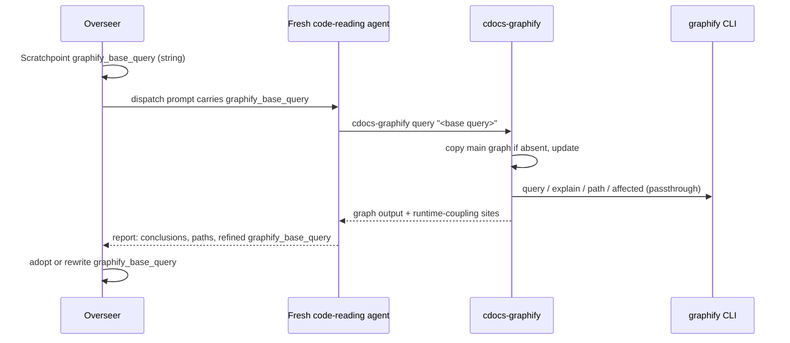

---
first_authored:
  by: "@claude-opus-5-5"
  at: 2026-10-08T08:56:00-07:00
task_list: cdocs/graphify-overhaul
type: proposal
state: live
status: implementation_wip
last_reviewed:
  status: accepted
  by: "@claude-opus-5-5"
  at: 2026-10-08T10:03:56-07:00
  round: 3
tags: [graphify, claude_skills, architecture, token_efficiency]
---

# Graphify overhaul: a workstream base query run by fresh contexts

> BLUF: Replace `graphify-scope` (362 lines, overseer-run) with `cdocs-graphify` (at most about 60 lines), which each code-reading agent runs itself.
> It copies the main graph into a per-worktree index if absent, runs `graphify update` (AST-only, no LLM), passes `query`/`explain`/`path`/`affected` through unchanged, and appends `.observe`/`.subscribe` sites the graph cannot see.
> `cdocs/` is excluded from every graph via the repo's `.graphifyignore` (written by `/cdocs:init`).
> The overseer only writes the Scratchpoint `graphify_base_query:` string and passes it in dispatch prompts; a thin `/cdocs:graphify` skill and the "CDocs Tool Use Guidance › Tools and Skills" line deliver the rest.

## Summary

The shipped integration has the overseer run `graphify-scope` (`explain` per changed file, then `affected` per symbol) and paste its output verbatim into the reviewer's prompt.
That puts graph output in the overseer's context, reduces the graph to a union of dependent file paths, and leaves `query` and `path` unused.
In the lace devcontainer, the only environment with graphify, it also never scopes: it skips with `stale-index` whenever any changed file is newer than the index (`graphify-scope:251-254`), every review round's changed files are, and nothing refreshes the index (no git hook).

The replacement:
- **Base query.** `graphify_base_query:` (the Scratchpoint field both templates carry as `graphify_query:`, renamed in Phase 3) is one natural-language question, in the workstream's own entity names, that loads the code context the work needs.
  The overseer writes and refines it; it never runs graph commands or reads their output.
- **Any agent that reads code runs it**, at startup, through `cdocs-graphify`, then uses `explain`, `path`, and single-symbol `affected` as its work demands.
  Implementers return a refined query in their report.
- **`cdocs-graphify`** gives each worktree its own index, copied once from the main graph and kept current by `graphify update` on every call, so no agent writes a shared index.
- **`cdocs/` stays out of the graph:** it is large and is prose the agents read directly.
  graphify's own `.graphifyignore` excludes it from every build and update.
- **Delivery.** The rule line reaches every agent (discovery plus the overseer's duty); the skill carries the per-role procedure; iterate gains a short "Base query" section.

Absent graphify or any index, `cdocs-graphify` prints one line and exits 0, and the overseer leaves `graphify_base_query` empty.

> NOTE(claude-opus-5-5/cdocs/graphify-overhaul): Neither design has been measured.
> The only `/cdocs:ablate` run on graphify (Probe A, single-file) found `context_gap 0`, and the prior proposal's multi-file efficiency spot-check never ran.
> This proposal rests on context hygiene, per-worktree correctness, and use of the CLI's actual surface; a multi-file ablate run is a follow-up, not a gate.

## Objective

Make graphify serve the agents that read code, on their own terms, with an index that matches their own tree, while keeping the overseer's context free of graph output.

## Background

- **Prior design:** [`2026-09-17-graphify-cdocs-integration.md`](2026-09-17-graphify-cdocs-integration.md) (`implementation_accepted`; lean track "prime-context + instruct-agents"), its reviews, and the [full-send devlog](../devlogs/2026-09-23-graphify-cdocs-integration-full-send.md).
  Its live run against graphify 0.9.61 found plain-text output, `affected` as the dependents primitive, symbol labels (not file names) as targets, and the index at `$GRAPHIFY_OUT`.
  The `explain`+`affected` pipeline came from that contract reconciliation, not from weighing it against `query`.
  Its D3 made the CRDT blind spot structural: briefs co-surfaced `.observe`/`.subscribe` sites, and a near-empty dependent set on such files forced an unscoped sweep.
- **MCP vs CLI:** [`2026-09-17-graphify-mcp-vs-cli-value-add.md`](../reports/2026-09-17-graphify-mcp-vs-cli-value-add.md): CLI subcommands map 1:1 to MCP tools.
- **Environment:** [`2026-09-17-graphify-lace-devcontainer-enablement.md`](2026-09-17-graphify-lace-devcontainer-enablement.md).
  The lace feature `graphify:1` installs PyPI `graphifyy` 0.9.61 via pipx, bakes `GRAPHIFY_OUT=/var/cache/graphify` (one index shared by every worktree, D3), and installs no git hook (D5).
  MCP registration is shadowed by a host config bind-mount; access is CLI-only.
  graphify is not installed on the host.
- **CLI surface** ([CLI reference](https://graphify.net/graphify-cli-commands.html), [README v8](https://github.com/Graphify-Labs/graphify/blob/v8/README.md), PyPI latest 0.9.80), with 0.9.61 behavior verified in the lace container by the [r2 review](../reviews/2026-10-08-review-of-graphify-overhaul-r2.md):
  - `query "<question>"` (`--budget`, default 2000; `--dfs`), `explain "<entity>"`, `path "<A>" "<B>"`, and `affected "<symbol>"` (absent from the public docs) all accept `--graph <path>`; `query` writes a small cache file next to that graph.
  - `update <path>` (only `--force` and `--no-cluster`): a full-corpus AST pass with a per-file cache, no LLM, about 2.4 s on clauthier.
    It graphs code and markdown headings, prunes nodes for deleted files, evicts nodes newly matched by `.graphifyignore`, and takes a blocking per-output-dir lock.
  - Exclusion: `.graphifyignore` in the project root (gitignore syntax, `!` negation), merged after each directory's `.gitignore`; there is no `--exclude` flag.
  - Paths: node `source_file` values and `manifest.json` keys are relative; `.graphify_root` holds the absolute scan root.
  - `install` / `claude install`: the `/graphify` skill plus a `PreToolUse` `hook-guard` nudging toward `graphify query`; the lace container has neither.
- **graphify's skill** ([v8 `skill.md`](https://github.com/Graphify-Labs/graphify/blob/v8/graphify/skill.md)): 723 lines, almost all build pipeline; the query fast path is a short block.
- **Maintainer edits:** `dba0ac9` added "CDocs Tool Use Guidance › Tools and Skills" with a `/graphify` line; `58bb5fa` and `0832011` added the undefined `graphify_query:` Scratchpoint field (renamed `graphify_base_query:` here).

## Proposed Solution

### Roles



| Role | `graphify_base_query` | Runs `cdocs-graphify` | Uses |
|---|---|---|---|
| Overseer (iterate, propose-revise, full-send, oversee) | Writes on Turn 0; refines between rounds | Never | Passes the string to every agent that reads code |
| Implementer | Returns a refined query in its report; may also keep it in its sub-devlog Scratchpoint | Yes | Base query at startup; `explain` an entity before changing it; `path` to trace how a change reaches a caller |
| Reviewer | No | Yes | Base query at startup; `explain` each changed entity for callers and importers; `path` to test relationships the change assumes; `affected` on one symbol where available |
| Proposer reading code | No | Yes | Base query at startup |
| Judge | No | No | Reads documents only |
| Single-agent `/cdocs:implement` | Its own devlog Scratchpoint | Yes | As implementer |

### Base query lifecycle

- **Written** by the overseer on Turn 0, only when `command -v graphify` succeeds: one question naming the subsystem and behavior in entity names the graph can match.
  Example: `how does the iterate overseer dispatch implementer and reviewer subagents and record their returns in the devlog`.
- **Passed** verbatim in each code-reading dispatch prompt as `graphify_base_query: "<q>"`.
- **Refined:** an implementer whose work reveals sharper terms or a new subsystem ends its report with `graphify_base_query: "<refined>"`; the overseer adopts it or writes its own when the Steering Log or phase moves scope.
- **Audited:** each Iteration Log row's `notes` carries `[base_query: set]` or `[base_query: empty]`.

### `cdocs-graphify` wrapper

`plugins/cdocs/bin/cdocs-graphify`, on `PATH` from the plugin's `bin/`.
It is not named plain `graphify`: plugin `bin/` is on `PATH`, so that name would shadow the real CLI for every agent and make the wrapper call itself.
The skill is `/cdocs:graphify` (the plugin namespace keeps it distinct from graphify's own `/graphify`), since agents use it for `explain`, `path`, and `affected`, not only `query`.
Size: at most about 60 lines of portable bash (no bash-4 features or GNU-only flags, so CI runs it on Linux and macOS).

Usage: `cdocs-graphify {query|explain|path|affected} ARGS...`.

| Step | Behavior |
|---|---|
| Availability | No `graphify`, not in a git worktree, or no index anywhere: one `cdocs-graphify: ...; skipping` line on stderr, exit 0. |
| Paths | Worktree index: `<toplevel>/graphify-out/`. Main graph: `$GRAPHIFY_OUT` (the container's shared `/var/cache/graphify`), else `graphify-out/` in the worktree on branch `main` (`git worktree list --porcelain`). |
| Copy (idempotent) | If the worktree index has no `graph.json`, copy the main graph directory into a temp dir beside it, delete the copied `.graphify_root` (it names the main checkout, and would keep the branch's deleted files alive through the first update), write a `*` `.gitignore` (so consuming repos need no `.gitignore` edit), then rename it into place. Skip if the worktree index exists; a lost rename race is ignored. On the host, the main checkout's own index is the main graph, so there the copy is a no-op. |
| Ignore hint | If `cdocs/` exists and `.graphifyignore` has no `cdocs/` line, one stderr hint naming `/cdocs:init`; then proceed. |
| Update | `GRAPHIFY_OUT=<worktree index> graphify update <toplevel>` on every call, output to `graphify-out/update.log`. On failure, one stderr line, and query the existing index. |
| Passthrough | `graphify "$@" --graph <worktree graph.json>`, stdout unchanged, exit code preserved. |
| Runtime coupling | Grep files named in the output (that exist in the worktree) for `\.(observe\|subscribe)\(`; if any match, append a `RUNTIME COUPLING (not in the graph):` header and up to 30 `path:line: text` hits. |

Sketch of the core:

```bash
wt_out="$top/graphify-out"
if [ ! -f "$wt_out/graph.json" ]; then
  [ -f "$main_out/graph.json" ] || skip "no graph index"
  tmp=$(mktemp -d "$top/graphify-out.tmp.XXXXXX") && cp -R "$main_out/." "$tmp/" &&
    rm -f "$tmp/.graphify_root" && echo '*' >"$tmp/.gitignore" &&
    { [ -e "$wt_out" ] || mv "$tmp" "$wt_out"; }
  rm -rf "$tmp" 2>/dev/null
fi
[ -d "$top/cdocs" ] && ! grep -qxE '/?cdocs/?' "$top/.graphifyignore" 2>/dev/null &&
  note "hint: .graphifyignore lacks cdocs/; run /cdocs:init"
GRAPHIFY_OUT="$wt_out" graphify update "$top" >"$wt_out/update.log" 2>&1 ||
  note "update failed; querying existing index"
```

- TODO(claude-opus-5-5/cdocs/graphify-overhaul): generalize the runtime-coupling pattern to a list the consuming repo supplies; `.observe`/`.subscribe` is weftwise's idiom.

> NOTE(claude-opus-5-5/cdocs/graphify-overhaul): Two defaults the maintainer may override: (1) no update stamp: `update` runs on every call (about 2.4 s on clauthier; a porcelain-status stamp would miss repeat edits to a dirty file); (2) when `.graphifyignore` lacks `cdocs/`, `cdocs-graphify` prints one stderr hint and otherwise proceeds, leaving the fix to `/cdocs:init`.

The skip-scope labels, stale-index skip, near-empty threshold, and truncation markers are not carried over.
They existed because the old brief could *narrow* a reviewer's attention: a small confident set might hide runtime coupling, so the script forced an unscoped sweep.
Here nothing narrows: agents query as an aid to their own reading, the coupling sites are appended to every result, and staleness is fixed by updating rather than signaled by skipping.
The same reasoning rules out a `cdocs/` purge step: a plain `update` evicts ignored nodes once the ignore line exists.

### `/cdocs:graphify` skill (draft)

`plugins/cdocs/skills/graphify/SKILL.md`:

```md
---
name: graphify
description: Load code context from a graphify code graph (base query, entities, paths) through the cdocs-graphify command
argument-hint: "[question]"
---

# CDocs Graphify

Load code context from a graphify graph instead of grep sweeps and full-file reads.
`cdocs-graphify` keeps this worktree's index current and passes its arguments to `graphify` unchanged; if it prints a "skipping" line, continue without the graph.

## Commands

- `cdocs-graphify query "<question>"`: concept-level context around the matched nodes; `--dfs` traces one chain.
- `cdocs-graphify explain "<entity>"`: an entity and its neighbors.
- `cdocs-graphify path "<A>" "<B>"`: how two entities connect.
- `cdocs-graphify affected "<symbol>"` (versions that have it): reverse dependents of one symbol, one at a time.

If a query matches nothing, retry once with entity names (files, functions, types), then proceed without it.

## Reading the output

The graph is static structure.
The appended runtime-coupling sites are the floor, not the ceiling: before concluding a change is contained, grep the changed code for the project's other runtime idioms (event emitters, registries, dynamic dispatch, config).

## By role

- Base query: when your prompt or workstream Scratchpoint carries `graphify_base_query:`, run it before reading code.
- Implementers: `explain` an entity before changing it; when your work reveals sharper terms, end your report with `graphify_base_query: "<refined>"`.
- Reviewers: `explain` each changed entity; `path` to check relationships the change assumes.

Report conclusions and file paths, not raw graph output.
```

### Rule line

"CDocs Tool Use Guidance › Tools and Skills", replacing the `/graphify` line:

```md
- `/cdocs:graphify` when graphify is installed: agents that read code run the workstream's `graphify_base_query` at startup and `explain` code entities, preferring it when practical over `grep` and full-file reads.
  Overseers write `graphify_base_query`, pass it in prompts to agents that read code, and never run graph queries themselves.
```

### Devlog and iterate skills

Devlog skill, "The Scratchpoint Section":

```md
`graphify_base_query` is a natural-language base question for `/cdocs:graphify`, in the workstream's own entity names, so a fresh context loads the relevant code first.
Refine it as the change grows; leave it empty when graphify is not installed.
```

Iterate skill: replace "Graphify scoping" with "Base query": write `graphify_base_query` on Turn 0 when `command -v graphify` succeeds, adopt or rewrite it from implementer reports between rounds, tag each Iteration Log row `[base_query: set|empty]`.
Passing it in prompts and never running queries come from the rule line.

### How `cdocs/` is kept out of the graph

- **What holds the ignore:** a `cdocs/` line in `.graphifyignore` at the repository root, graphify's own exclusion file (gitignore syntax).
  There is no CLI flag for exclusion, and gitignoring `cdocs/` is not an option because cdocs documents are tracked.
- **Who writes it:** each repository, committed like `.gitignore`.
  clauthier commits its own in Phase 2; `/cdocs:init` adds the line to consuming repos (creating the file if needed) when `graphify` is installed or `.graphifyignore` already exists, and leaves it alone if the line is present.
- **When graphify reads it:** on every build and every `update`, including the main-graph refresh and each `cdocs-graphify` call; queries read only the graph, so they never see `cdocs/` once it is out.
- **What the wrapper does:** nothing beyond a one-line stderr hint when `cdocs/` exists and the line is missing; it passes no exclusion arguments and filters no output.
- **Verified eviction (0.9.61, r2 review):** `update` graphs markdown headings without an LLM, so without the line `cdocs/` is 6637 of clauthier's 7375 nodes; with the line, the next plain `update` evicts those nodes (no `--force`), whether in a worktree copy or the main graph.

### Graph refresh ownership

Refreshing the main graph is left to the consumer for now (operator, lace lifecycle command, or git hook); no cdocs skill refreshes it, and `cdocs-graphify` only updates the caller's own worktree index.
`update` takes graphify's per-output-dir lock, so a refresh cannot corrupt the graph if a worktree copies it at the same moment; the copy may just be one refresh behind, which the copier's own `update` repairs.

### Replacement and deletion list

| Path | Change |
|---|---|
| `plugins/cdocs/bin/graphify-scope` | delete; replaced by `plugins/cdocs/bin/cdocs-graphify` |
| `plugins/cdocs/hooks/tests/graphify-scope.test.sh` | delete; replaced by `plugins/cdocs/hooks/tests/cdocs-graphify.test.sh` |
| `.github/workflows/cdocs-hooks.yml` | the graphify-scope step and header comments become a `cdocs-graphify` step on both OSes |
| `plugins/cdocs/bin/README.md` | `## graphify-scope` section becomes a short `## cdocs-graphify` section |
| `plugins/cdocs/README.md` | bundled commands line names `chat-record` and `cdocs-graphify`; skills table gains `/cdocs:graphify` |
| `plugins/cdocs/skills/iterate/SKILL.md` | drop `[--graphify-scope]` from `argument-hint`, the flag bullet, and "Graphify scoping" (replaced by "Base query") |
| `plugins/cdocs/agents/reviewer.md` | drop "Graphify scoped-context brief (when present)" |
| `CLAUDE.md` | Skills line gains `graphify` |
| `.gitignore` | add `graphify-out/` (belt and braces with the self-ignoring directory) |
| `.graphifyignore` | new, with `cdocs/` |
| `plugins/cdocs/skills/graphify/SKILL.md` | new skill (draft above) |
| `plugins/cdocs/rules/tool-use-safeguards.md` | "Tools and Skills" `/graphify` bullet replaced by the rule line above |
| `plugins/cdocs/skills/devlog/SKILL.md` | "The Scratchpoint Section" defines `graphify_base_query` |
| `plugins/cdocs/skills/devlog/template.md`, `plugins/cdocs/skills/iterate/template.md` | `graphify_query:` becomes `graphify_base_query:` |
| `plugins/cdocs/skills/init/SKILL.md` | new step: ensure a `cdocs/` line in `.graphifyignore` when it exists or graphify is installed |

Untouched: `/cdocs:ablate`, `.devcontainer/`, `scripts/build-opencode.ts`.

## Important Design Decisions

### D1: Fresh contexts query; the overseer holds only a string

The consumer runs the graph; the overseer authors the question.
The overseer's context is the loop's scarcest resource, and graph output helps only the agent that reads code.
A concept query also returns what `explain`-then-`affected` discards: the matched neighborhood with its relations, rather than a file union truncated at about 20 connections per file.
And only the consumer knows when to go deeper with `explain` or `path`.

### D2: A thin wrapper, a thin skill, and one rule bullet

- **Wrapper:** index placement and freshness are mechanics every caller would otherwise repeat in prose, and get wrong in different ways.
  Everything about *what* to ask stays with the agent: the wrapper adds no arguments and filters no output.
- **Skill:** per-role procedure and the runtime-coupling instruction, loaded on demand; rules load in every session of every consuming project, including ones without graphify.
- **Rule bullet:** discovery for every agent, and the overseer's half of the contract, which must be in context without loading anything.
  Each duty is stated once: the overseer's in the rule, the consumers' in the skill, the loop bookkeeping in iterate.

### D3: Per-worktree indexes, copied from the main graph

Each worktree gets its own `graphify-out/`, copied once from the main graph and kept current by `update` on every call.
No code-reading agent writes the shared index, so one-writer-per-file holds across worktrees, and an agent in one worktree never queries another branch's graph.
This removes the cross-worktree staleness and overwrite risk that lace D3 accepted for a shared index.
The copy works because node paths and manifest keys are relative (verified on 0.9.61); dropping the copied `.graphify_root` makes the first update resolve them against the worktree, so it prunes the branch's deleted files at once.
Refreshing the main graph (`graphify update /workspace/clauthier/main` with the baked `GRAPHIFY_OUT` in the container) is the consumer's; a stale main graph only costs a larger first update.

### D4: Plain `update`, no LLM

`graphify update <toplevel>` is AST-only on 0.9.61 (`--code-only` is rejected), so no markdown edit ever triggers LLM extraction.

### D5: Not graphify's own `/graphify` skill or `graphify claude install`

The skill is 723 lines, mostly an extraction pipeline that invites agents to build the graph with LLM subagents.
The `PreToolUse` hook-guard changes every agent's read behavior, the overseer's included, against D1.
The lace container has neither (verified); users who install them anyway lose nothing.

### D6: The dispatch prompt carries the query; agent files gain nothing

The rule line tells overseers to pass `graphify_base_query` to any agent that reads code, so propose-revise, full-send, and oversee are covered without per-skill text.
An explicit prompt line is the most reliable trigger and makes verification direct.
`implementer.md` and `reviewer.md` gain no graphify section; `reviewer.md` loses its brief section.

> NOTE(claude-opus-5-5/cdocs/graphify-overhaul): If Phase 5 shows fresh agents skipping the base query despite the prompt line, the fallback is one startup line per agent file, not more machinery.

### D7: Reviewers may write their worktree's index

`cdocs-graphify` writes a self-gitignored derived cache in the reviewer's own checkout, the same class of side effect as a test run's build output, which `reviewer.md`'s "empirical verification" already allows.
It never touches tracked files, configuration, or the shared index, so `reviewer.md`'s boundary text needs no change.

### D8: Replace, do not deprecate

`--graphify-scope` defaults off and is documented only in iterate; nothing composes it, so the flag and script go in one change.

### D9: Exclude `cdocs/` with the repo's `.graphifyignore`

The ignore lives in the repository, not the wrapper, because the main-graph refresh never passes through `cdocs-graphify` and must honor it too.
Mechanics are in "How `cdocs/` is kept out of the graph" above.

## Edge Cases

- **No graphify, no index, or not in git:** one stderr line, exit 0; the overseer leaves the base query empty.
- **Main checkout is the caller (host only):** its `graphify-out/` is both main graph and worktree index; the copy is skipped and the update keeps the main graph current as a side effect.
  In the container, `GRAPHIFY_OUT` names `/var/cache/graphify` as the main graph, so the main checkout gets its own copy like any worktree.
- **Bare-repo layout:** the main graph is found by branch (`main`), not list order; in this repo `git worktree list` lists the bare dir and `interfacer-agent` before `main`.
  `GRAPHIFY_OUT` overrides.
- **Concurrent callers in one worktree:** safe without a wrapper lock, since `update` takes a per-output-dir lock; across worktrees there is no shared writer.
- **`.graphifyignore` missing the `cdocs/` line** (repo not re-initialized): the rule change's freshness prompt to re-run `/cdocs:init` adds the line.
- **Update failure or timeout:** query the existing index; agents verify specific edges in code.
- **Large output:** `query` caps itself at its default `--budget`; `explain` truncates its own connection list; the coupling section is capped at 30 lines.
- **No match:** retry once with entity names, then proceed without the graph.
- **Docs-heavy repos (clauthier):** skills and rules are graphed as markdown heading structure, which orients but carries no call edges; the overseer may leave the base query empty for pure-prose workstreams.
- **OpenCode:** `build:cdocs` copies `skills/` wholesale; the skill ships unchanged, and `cdocs-graphify` is plain bash, available wherever `bin/` is on `PATH`.

## Test Plan

`plugins/cdocs/hooks/tests/cdocs-graphify.test.sh` (target at most about 80 lines), against a `graphify` stub on `PATH` that logs argv, `$GRAPHIFY_OUT`, and `$PWD`, in a temp git repo with a main-branch worktree and a sibling worktree:
- No `graphify` on `PATH`: exit 0, one stderr line, no `graphify-out/` created.
- No index anywhere: exit 0, one stderr line, stub never called for a query.
- Sibling worktree without an index: the main graph is copied without `.graphify_root`, `.gitignore` is `*`, `git status --porcelain` is clean.
- Second call: no copy (an index-file sentinel is unchanged); `update` runs again.
- Ignore hint: with `cdocs/` present and no `cdocs/` line in `.graphifyignore`, exactly one hint line on stderr and the query still runs; with the line, no hint.
- Update writes only under the worktree's `graphify-out/` (stub log shows `GRAPHIFY_OUT=<worktree>/graphify-out`); the main graph's mtime is unchanged.
- Passthrough: `cdocs-graphify path "A B" C` reaches the stub as exactly `path`, `A B`, `C`, `--graph <worktree graph.json>`; stub stdout and exit code come back unchanged.
- Update failure: one stderr line, query still runs.
- Runtime coupling: a file named in stub output with `.observe(` gets a `RUNTIME COUPLING` section; output naming no such file gets none.

Also:
- Exclusion: `.graphifyignore` at the repo root contains `cdocs/`; re-running the init step leaves exactly one such line.
- Removal: `grep -rn 'graphify-scope\|graphify_scope\|scoped-context brief' plugins/ .github/ CLAUDE.md scripts/` is empty.
- `npm run test:rules` passes; `npm run test:opencode` passes and `build/cdocs/opencode/skills/graphify/SKILL.md` exists.
- `chat-record.test.sh --unit` and `validate-cdocs-edit-path.test.sh` pass.

## Verification Methodology

graphify is absent on the host, so verification uses a stub there and the real binary in the devcontainer.

**Host stub run (in-loop):**
1. Install a stub `graphify` in a directory on the Bash tool's `PATH` (for example `~/.local/bin`, after confirming no real `graphify` resolves), and symlink the branch's `plugins/cdocs/bin/cdocs-graphify` beside it, removed with the stub; otherwise agents resolve the main checkout's plugin `bin/`, which lacks the wrapper until Phases 2-3 land, and an empty stub log would misread as agents ignoring the base query.
   It appends argv to a scratch log, accepts `update`, and puts a unique `GFY-MARKER-<random>` on every output line, node labels included.
   It is time-boxed: it embeds an expiry 30 minutes out, after which it deletes itself and exits 127, so it cannot leak into concurrent sessions; remove it explicitly when done.
2. Create a fixture main graph at `graphify-out/graph.json` in the `main` checkout.
3. From a dispatched agent acting as overseer, dispatch a fresh `cdocs:reviewer` with `isolation: "worktree"` on a small real target, with `graphify_base_query: "<q>"` in the prompt.
4. Check, in order:
   - **Primary:** the stub log contains `query <q>` with `GRAPHIFY_OUT` under the reviewer's worktree, preceded by one `update`.
   - **Secondary:** `bash plugins/cdocs/skills/ablate/ablate.sh detect-usage --transcript <reviewer transcript> --tool 'cli:cdocs-graphify (query|explain|path)'` reports `used`.
   - **Positive control:** the dispatching agent's own transcript (the newest `~/.claude/projects/<slug>/<session_id>/subagents/agent-*.jsonl` whose `Agent` `tool_use` prompt contains the base query) contains the reviewer's returned report as that call's `tool_result`.
   - **Overseer clean:** `grep -c GFY-MARKER` on that same transcript is `0`, and `detect-usage --tool 'cli:^(cdocs-)?graphify '` on it reports `unused`.
5. Remove the stub and fixture and dispatch again: the reviewer completes normally, makes no install or build attempt, and mentions the absence in at most one line.

**Devcontainer live run (post-accept, routed to the overseer or user):** a one-round `/cdocs:iterate` on a small real proposal in a `lace up` container with graphify 0.9.61.
First rebuild the main graph from the repo after `.graphifyignore` lands: `graphify update /workspace/clauthier/main` with the baked `GRAPHIFY_OUT` (about 2.4 s).

> NOTE(claude-opus-5-5/cdocs/graphify-overhaul): `/var/cache/graphify` currently holds a stale 73-node fixture rooted at a deleted `/tmp` dir, left by the prior workstream's truncation test: the shared-index overwrite D3 removes, seen in practice.

Check that the implementer's and reviewer's worktrees each gain `graphify-out/`, that `/var/cache/graphify/graph.json`'s mtime is unchanged, that the implementer's report carries a refined `graphify_base_query`, and that the overseer's transcript contains no distinctive node label from the real output.

**Ablation run (weftwise container):** reuse the setup of the earlier `/cdocs:ablate` graphify run ([Probe A](../devlogs/2026-09-18-ablate-e2e-probeA-inject-rules.md), summarized in the [mcp-ablation devlog](../devlogs/2026-09-17-mcp-ablation-iterate.md)), changing only the signature, the treatment line, and the task.

- **What transfers unchanged:** single-shot (`trials=1`, indicative); two detached worktrees at one pinned base; sonnet arms and an opus evaluator; the CLI withhold expressed in the unassisted arm's prompt and confirmed by `detect-usage` on its transcript reporting `unused`; answers written to `ANSWER.md`.
- **Signature:** `cli:^(cdocs-)?graphify ` (Probe A used `cli:graphify `, before `detect-usage` matched per command segment).
- **Treatment:** the assisted arm's prompt adds `graphify_base_query: "<q>"` and "run it via `/cdocs:graphify` first"; the unassisted arm's adds "do not run graphify or cdocs-graphify".
  Step 0 records these two prompt lines as the arm difference instead of a tool-allowlist entry, since a CLI on the shared `PATH` cannot be withheld by allowlist.
- **Task: does not transfer.** Probe A explained one small file (`inject-rules.ts`), and the evaluator scored `context_gap 0` because reading that file answered it.
  No clauthier task fixes this: its code is about 3,000 lines with almost no import edges, and its references live in markdown bodies, which graphify graphs only as headings, so any multi-file clauthier answer is one `grep` away (the r3 review showed this for a rule-reference task).
- **Closest viable variant:** Probe A's "what does this change touch" shape, widened to a multi-file blast radius in weftwise (1228 TypeScript files, with the `.observe`/`.subscribe` coupling the wrapper surfaces):

```
/cdocs:ablate \
  --tool 'cli:^(cdocs-)?graphify ' \
  --task "A change alters the value type of the most-imported atom exported by packages/weft/src/lib/mounts/atoms.ts. In ANSWER.md, list every file and symbol that must change or be re-verified (direct importers, consumers reached through hooks and re-exports, tests, and runtime subscribers), one line of reason each." \
  --base <pinned weftwise commit>
```

  `mounts/atoms.ts` has 33 direct importers across about ten directories; the graph's advantage, if any, is the transitive consumers that no single literal greps to.
  The base query: `how do mount atoms flow through hooks and tabs, palette, and editor settings consumers`.
- **Environment:** the `weftwise` devcontainer, once a separate workstream lands the `graphify:1` lace feature and a root `.graphifyignore` with `cdocs/` there and rebuilds the container.
  Prerequisite, checked by the implementer before the run: `podman exec -u node weftwise graphify --version` succeeds, a built main graph exists at the container's `$GRAPHIFY_OUT/graph.json`, and the cdocs plugin from this change is on `PATH`.
  If any check fails, the implementer reports back to the overseer instead of skipping the run or moving it to clauthier.
- **What would change the design:**
  - VOID (`available_unused`): agents ignore a base query they were handed; apply D6's fallback (a startup line in agent files) and re-run.
  - VALID with `context_gap` at or below 0 and no token saving: overseers stop writing `graphify_base_query` by default (the field stays, opt-in), and the wrapper remains for explicit use.
  - VALID with a positive `context_gap` or a clear token saving: keep the design; consider passing the base query to the judge too.
  - TASK-FAIL with only the assisted arm failing: read its transcript for misleading graph output before anything else.

**Exclusion check (devcontainer, with the live run):** after the main-graph rebuild, `grep -o '"source_file": *"cdocs/' /var/cache/graphify/graph.json | wc -l` is `0`, and the same count on each worktree's `graphify-out/graph.json` is `0`.
The without-the-line count (6637 of 7375 nodes) was already measured by the r2 review and need not be repeated.

Failure pictures: the stub log has no `query` line (agents ignore the base query); the marker appears in the dispatching agent's transcript (graph output bled back); the shared index's mtime moves (a worktree wrote it); the no-op run shows an install attempt or an error paragraph.

## Implementation Phases

Phases run in order; Phases 2 and 3 both touch `iterate/SKILL.md` and READMEs, so do not parallelize them.
This workstream runs in parallel with the unlanded `interfacer-agent` branch, which also edits `plugins/cdocs/agents/reviewer.md` and `plugins/cdocs/skills/iterate/SKILL.md`: whichever lands second rebases over the other.

### Phase 1: CLI reconciliation (non-blocking)

The r2 review verified the CLI surface in the container.
Remaining, if a real graphify is reachable: time `update` on the target repo (weftwise scale, for the no-stamp default), and confirm the coupling grep's path extraction against real output formats (`Source: src/a.ts L2`, `src/a.ts:L2`).
If none is reachable, record that and leave both to the devcontainer live run.
**Done when:** each item is confirmed or explicitly deferred.

### Phase 2: `cdocs-graphify` replaces `graphify-scope`

Write `bin/cdocs-graphify` and `hooks/tests/cdocs-graphify.test.sh` (TDD: tests first), delete the old script and test, update the CI step, `bin/README.md`, the plugin README commands line, and `.gitignore`; add `.graphifyignore` with `cdocs/`.
**Done when:** the new suite passes, the remaining hook suites pass, and the script is at most about 60 lines.
**Do not change:** `/cdocs:ablate`, `.devcontainer/`, `scripts/build-opencode.ts`.

### Phase 3: Base-query wiring

Add the skill; rename `graphify_query:` to `graphify_base_query:` in both Scratchpoint templates and any other hit of `grep -rn graphify_query plugins/ CLAUDE.md`; replace the `/graphify` rule bullet; define `graphify_base_query` in the devlog skill; replace iterate's "Graphify scoping" and flag with "Base query"; drop the reviewer brief section; add the init `.graphifyignore` step; list the skill in the plugin README and `CLAUDE.md`.
**Done when:** the removal grep and `grep -rn 'graphify_query' plugins/ CLAUDE.md` are empty, and `npm run test:rules` and `npm run test:opencode` pass.

### Phase 4: Supersede the prior proposal

Set [`2026-09-17-graphify-cdocs-integration.md`](2026-09-17-graphify-cdocs-integration.md) to `status: evolved`, `state: archived`, with a NOTE under its title: replaced by this proposal; its D3 runtime-coupling guard is kept as unconditional `.observe`/`.subscribe` surfacing on every query (pattern to be generalized), while the forced unscoped fallback on near-empty sets is dropped because nothing narrows a reviewer's sweep any more.
Add a NOTE to the lace proposal's D3: agents now query per-worktree indexes copied from `/var/cache/graphify` and never write it, so the cross-worktree staleness and overwrite risk D3 accepted no longer applies; the shared index is a read-only source the consumer refreshes.
**Done when:** `/cdocs:triage` reports no frontmatter issues on either file.

### Phase 5: Verification

Run the host stub verification; record the stub log excerpt, the `detect-usage` results, the positive control, and the marker count in the devlog.
Route the clauthier devcontainer live run and the exclusion check to the overseer as post-accept.
Run the weftwise ablation once its prerequisite checks pass; if they fail, report back rather than skip.
**Done when:** all host checks pass, or a failure picture is recorded with the D6 fallback applied and re-run.

## Open Questions

- Should the consumer's main-graph refresh become a lace `postStartCommand` (on the `main` checkout), or a step in a workstream-starting skill?
