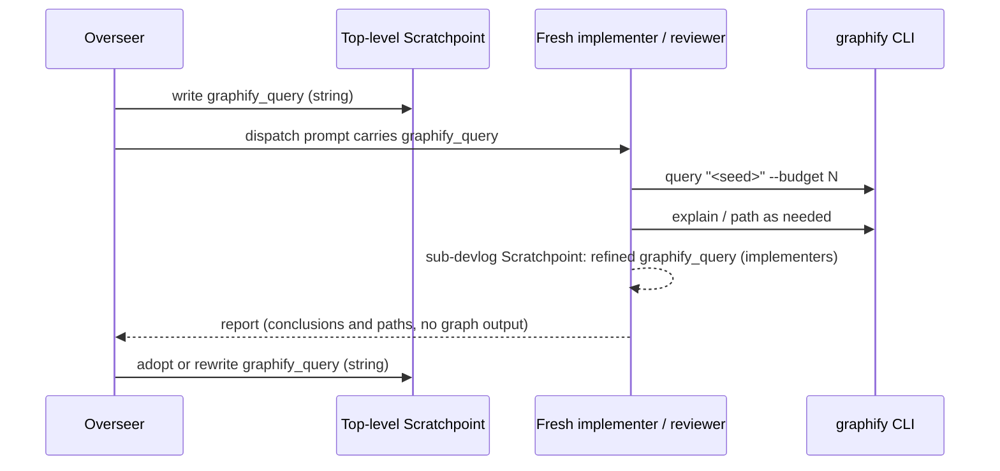

---
first_authored:
  by: "@claude-opus-5-5"
  at: 2026-10-08T08:56:00-07:00
task_list: cdocs/graphify-overhaul
type: proposal
state: live
status: review_ready
last_reviewed:
  status: revision_requested
  by: "@claude-opus-5-5"
  at: 2026-10-08T09:01:00-07:00
  round: 1
tags: [graphify, claude_skills, architecture, token_efficiency]
---

# Graphify overhaul: a workstream seed query run by fresh contexts

> BLUF: Delete `graphify-scope` and its iterate flag, reviewer brief, test, and CI step.
> The workstream carries a natural-language seed query in its Scratchpoint `graphify_query:`; the overseer only writes and refines that string and passes it in dispatch prompts, and each fresh implementer or reviewer runs it itself, then uses `explain`/`path` as needed.
> A thin new `/cdocs:code-query` skill (about 35 lines) holds the CLI procedure, and the "CDocs Tool Use Guidance › Tools and Skills" line points at it instead of graphify's own `/graphify` skill.

## Summary

The shipped integration has the overseer run `graphify-scope` (an `explain` per changed file, then an `affected` per symbol) and paste the resulting dependent-file list verbatim into the reviewer's prompt.
That puts graph output in the overseer's context, reduces the graph to a file union, and leaves `query` and `path` unused.

The replacement has three parts:
- **Seed query.** `graphify_query:` (already in both Scratchpoint templates) becomes a defined field: one natural-language question, in the workstream's own entity names, that loads the code context the work needs.
- **Fresh contexts run it.** Implementers and reviewers run the seed query at startup and use `explain`, `path`, and (version-permitting) single-symbol `affected` as their own work demands.
  Implementers may write a refined query into their sub-devlog Scratchpoint; the overseer adopts it as a string, never reading graph output.
- **Delivery.** One rule line (always in context, discovery) plus the `/cdocs:code-query` skill (on demand, procedure).
  No hooks, no scripts, no agent-file additions, no OpenCode build changes.

Absent graphify or an index, everything is a silent no-op: the overseer leaves `graphify_query` empty, and the skill exits after one availability check.

> NOTE(claude-opus-5-5/cdocs/graphify-overhaul): Neither the shipped design nor this one has been measured.
> The only `/cdocs:ablate` run on graphify (Probe A, a single-file task) found `context_gap 0`, and the prior proposal's multi-file efficiency spot-check never ran.
> This proposal is justified on context hygiene and use of the CLI's actual surface, not on measured recall or token savings; an ablate run on a multi-file task is a recommended follow-up, not a gate.

## Objective

Make graphify serve the roles that read code (implementers, reviewers) on their own terms, keep the overseer's context free of graph output, and remove the machinery that does neither.

## Background

- **Prior design:** [`2026-09-17-graphify-cdocs-integration.md`](2026-09-17-graphify-cdocs-integration.md) (`implementation_accepted`, lean track: "prime-context + instruct-agents"), its reviews, and the [full-send devlog](../devlogs/2026-09-23-graphify-cdocs-integration-full-send.md), whose live run against graphify 0.9.61 found the CLI contract differed from the design on four counts (plain-text output; `affected` as the dependents primitive; symbol labels rather than file names as targets; index at `$GRAPHIFY_OUT`).
- **MCP vs CLI:** [`2026-09-17-graphify-mcp-vs-cli-value-add.md`](../reports/2026-09-17-graphify-mcp-vs-cli-value-add.md): the CLI subcommands map 1:1 to the MCP tools and suffice.
- **Environment:** [`2026-09-17-graphify-lace-devcontainer-enablement.md`](2026-09-17-graphify-lace-devcontainer-enablement.md).
  The lace feature `graphify:1` installs PyPI `graphifyy` 0.9.61 via pipx (CLI plus `graphify-mcp`), bakes `GRAPHIFY_OUT=/var/cache/graphify`, shares that one index across all worktrees in the container (D3), and installs no git hook (D5, a hard constraint).
  The MCP registration is shadowed by a host config bind-mount; access is CLI-only.
  graphify is not installed on the host (`command -v graphify` fails).
- **Current CLI surface** ([graphify CLI reference](https://graphify.net/graphify-cli-commands.html), [README v8](https://github.com/Graphify-Labs/graphify/blob/v8/README.md), PyPI latest 0.9.80):
  - `graphify query "<question>"` with `--budget N` (caps output tokens), `--dfs` (trace one chain instead of BFS), `--graph <path>`.
  - `graphify explain "<entity>"`: one node and its neighbors.
  - `graphify path "<A>" "<B>"`: shortest path between two entities.
  - `graphify update <path>`: re-extracts changed files only; AST-only for code, no LLM cost.
  - `graphify hook install`, `graphify watch`, `graphify install` / `graphify claude install` (writes the `/graphify` skill and a `PreToolUse` `hook-guard` that nudges toward `graphify query`).
  - `affected` (reverse dependents of a symbol) exists in the pinned 0.9.61 but is absent from the current public docs.
- **graphify's own skill** ([v8 `skill.md`](https://github.com/Graphify-Labs/graphify/blob/v8/graphify/skill.md)): about 723 lines, almost entirely the build pipeline (detection, AST and LLM extraction via subagents, clustering, community labeling, exports); querying an existing graph is a short fast path.
- **Maintainer edits pointing here:** `dba0ac9` added "CDocs Tool Use Guidance › Tools and Skills" with a `/graphify` line (`query` for initial workstream context, `explain` for entities, preferred over `grep` and full-file reads); `58bb5fa` and `0832011` added `graphify_query:` to the devlog and iterate Scratchpoint templates without defining it.

## Proposed Solution

### Roles



| Role | Writes `graphify_query` | Runs graphify | Uses |
|---|---|---|---|
| Overseer | Turn 0; refines between rounds | Never (beyond `command -v graphify`) | Passes the string in dispatch prompts |
| Implementer | Refined query in its sub-devlog Scratchpoint | Yes | Seed query at startup; `explain` on an entity before changing it; `path` to trace how a change reaches a caller |
| Reviewer | No | Yes | Seed query at startup; `explain` each changed entity for its neighbors (callers, importers); `path` to test relationships the change assumes; single-symbol `affected` where available |
| Judge | No | No | Reads documents only |
| Single-agent `/cdocs:implement` | Its own devlog Scratchpoint | Yes | As implementer |

### Seed query lifecycle

- **Written:** by the overseer on Turn 0, only when `command -v graphify` succeeds, from the proposal's subject: one question naming the subsystem and behavior, using entity names (files, functions, types) the graph can match.
  Example: `how does the iterate overseer dispatch implementer and reviewer subagents and record their returns in the devlog`.
- **Passed:** verbatim in every implementer and reviewer dispatch prompt as `graphify_query: "<q>"`, with "run it via `/cdocs:code-query` at startup".
- **Refined:** the implementer, having seen the graph, writes a sharper query to its sub-devlog's `graphify_query:` when its work reveals better terms or the change spreads into another subsystem.
  The overseer reads that string at turn end (it already reads the Scratchpoint), and adopts it or rewrites its own when the Steering Log or phase moves scope.
- **Empty:** when graphify is unavailable; nothing downstream happens.

### `/cdocs:code-query` skill (draft)

`plugins/cdocs/skills/code-query/SKILL.md`:

```md
---
name: code-query
description: Load code context from a prebuilt graphify code graph (seed query, entities, paths) when one is available
argument-hint: "[question]"
---

# CDocs Code Query

Load code context from a prebuilt graphify graph instead of grep sweeps and full-file reads.
The graph is static structure: it misses runtime coupling (events, observers, subscriptions, dynamic dispatch, config), so its silence never proves nothing depends on a thing.

## Availability

Check `command -v graphify` and an index at `${GRAPHIFY_OUT:-graphify-out}/graph.json`.
If either is missing, continue without the graph: do not install graphify or build an index, and mention the absence in at most one line.

## Freshness

If the index is older than `HEAD` (its mtime vs `git log -1 --format=%ct`), run `graphify update .` once: it re-extracts changed files only.
If that fails, query anyway and read the code before relying on any one edge.
Sibling worktrees can share one index, so node paths may name another checkout: map them onto your own tree.

## Commands

- `graphify query "<question>" --budget 2000`: concept-level context around the matched nodes; `--dfs` traces one chain.
- `graphify explain "<entity>"`: an entity and its neighbors.
- `graphify path "<A>" "<B>"`: how two entities connect.
- `graphify affected "<symbol>"` (versions that have it): reverse dependents of one symbol; one symbol at a time, not a sweep.

Output is plain text; never read `graph.json` directly.
If a query matches nothing, retry once with entity names, then proceed without it.

## By role

- Seed query: when your dispatch prompt or workstream Scratchpoint carries `graphify_query:`, run it before reading code.
- Implementers: `explain` an entity before changing it; write a sharper query to your devlog Scratchpoint `graphify_query:` when your work reveals better terms.
- Reviewers: `explain` each changed entity; `path` to check relationships the change assumes.
- Overseers: do not run graph commands; write and refine the query string and pass it on.

Report conclusions and file paths, not raw graph output.
```

Phase 1 reconciles `--budget` and `affected` against the pinned binary when one is reachable.

### Rule line

"CDocs Tool Use Guidance › Tools and Skills", replacing the `/graphify` line:

```md
- `/cdocs:code-query` when a code graph is available: fresh contexts run the workstream's `graphify_query` at startup and `explain` code entities to understand them, preferring it when practical over `grep` and full-file reads; overseers only write the query.
```

### Devlog skill: defining the field

In "The Scratchpoint Section" of `plugins/cdocs/skills/devlog/SKILL.md`, one paragraph:

```md
`graphify_query` is a natural-language seed question for `/cdocs:code-query`, in the workstream's own entity names, so a fresh context loads the relevant code first.
Refine it as the change grows; leave it empty when no code graph is available.
```

### Iterate skill: overseer duties

Replace "Graphify scoping" with a short "Seed query" section carrying the lifecycle above (write on Turn 0 when graphify is present, pass verbatim in implementer and reviewer prompts, adopt or rewrite between rounds, never run graph commands or paste their output).

### Deletion list

| Path | Change |
|---|---|
| `plugins/cdocs/bin/graphify-scope` | delete |
| `plugins/cdocs/hooks/tests/graphify-scope.test.sh` | delete |
| `.github/workflows/cdocs-hooks.yml` | drop the "graphify-scope unit suite" step and its header-comment mentions |
| `plugins/cdocs/bin/README.md` | drop the `## graphify-scope` section |
| `plugins/cdocs/README.md` | "two commands, `chat-record` and `graphify-scope`" becomes the one command `chat-record` |
| `plugins/cdocs/skills/iterate/SKILL.md` | drop `[--graphify-scope]` from `argument-hint`, the flag bullet, and "Graphify scoping" (replaced by "Seed query") |
| `plugins/cdocs/agents/reviewer.md` | drop "Graphify scoped-context brief (when present)" |

Untouched: `/cdocs:ablate` (tool-agnostic; graphify is only its example, and its `cli:` fixtures do not use `graphify-scope`), the lace devcontainer config, the OpenCode build.

## Important Design Decisions

### D1: Fresh contexts query; the overseer holds only a string

**Decision:** The consumer runs the graph; the overseer authors the question.
**Why:** The overseer's context is the loop's scarcest resource, and graph output is only useful to the agent that reads code.
A concept query also returns what `explain`-then-`affected` discards: the matched neighborhood with its relations, rather than a union of dependent file paths truncated at about 20 connections per file.
And the consumer, not the overseer, knows when to go deeper with `explain` or `path`.

### D2: Thin skill plus one rule line (both)

**Decision:** The rule line is discovery; the skill is procedure.
**Why:** Rules materialize into every consuming project and load in every session, including projects that will never have graphify, so the roughly 30 lines of procedure (availability, freshness, commands, roles) do not belong there.
A skill costs one description line until invoked.
A rule line alone would leave the freshness and no-op behavior unspecified; a skill alone would not reach the overseer, whose half of the contract ("only write the query") must be in context without loading anything.

### D3: Not graphify's own `/graphify` skill or `graphify claude install`

**Decision:** cdocs does not depend on graphify's skill or its `PreToolUse` `hook-guard`.
**Why:** The skill is about 723 lines, mostly an extraction pipeline that invites agents to build or rebuild the graph with LLM subagents; the query fast path is a handful of lines.
The hook-guard changes every agent's read behavior, the overseer's included, which runs against D1.
And the lace feature installs neither, so the `/graphify` rule line names a skill that is absent in the environment where graphify exists.
Users who install them anyway lose nothing: they coexist.

### D4: The dispatch prompt carries the query

**Decision:** The overseer puts `graphify_query: "<q>"` and the instruction to run it in each implementer and reviewer prompt, rather than relying on the agent finding the Scratchpoint.
**Why:** Reviewers' targets are not always devlogs, a fresh sub-devlog's own field starts empty, and an explicit prompt line is the most reliable trigger.
It also makes verification direct: the prompt names the query, the transcript must show it run.

### D5: No agent-file additions

**Decision:** `implementer.md` and `reviewer.md` gain no graphify section; `reviewer.md` loses its brief section.
**Why:** The rule line and the dispatch prompt already reach both roles; a third copy is duplication.

> NOTE(claude-opus-5-5/cdocs/graphify-overhaul): If Phase 5 shows fresh agents skipping the seed query despite the prompt line, the fallback is a one-line startup step in each agent file, not more machinery.

### D6: Refresh once if stale; never gate on staleness

**Decision:** The consumer runs `graphify update .` once when the index predates `HEAD`, and otherwise queries whatever index exists.
**Why:** In the devcontainer nothing refreshes the index (no git hook, by the lace proposal's D5), so the old skip-on-stale rule made scoping a no-op after the first commit.
The incremental update is AST-only for code and cheap.
A stale or sibling-worktree index is still useful for orientation, which is the seed query's job; agents verify specific edges in the code.

### D7: Delete outright

**Decision:** No deprecation period for `graphify-scope` or `--graphify-scope`.
**Why:** The flag defaults off and is documented only in iterate; nothing composes it.

## Edge Cases

- **graphify missing or no index:** The overseer leaves `graphify_query` empty, so no prompt line and no skill load.
  If an agent loads the skill anyway, the availability check ends it in one line.
- **Index built from a sibling worktree:** Paths name another checkout and edges may reflect another branch; the skill tells agents to map paths and verify edges.
  Per-worktree `GRAPHIFY_OUT` remains the lace proposal's deferred escalation.
- **Parallel agents refreshing the shared index:** Two concurrent `graphify update` runs race on one `graph.json`.
  WARN(claude-opus-5-5/cdocs/graphify-overhaul): graphify's guard refuses to overwrite with a smaller graph, but concurrent-write safety is unverified; under parallel dispatch the overseer may say "do not refresh the index" in the prompts.
- **Large output:** `--budget` caps `query`; `explain` truncates its connection list itself.
  If the pinned version lacks `--budget`, Phase 1 drops the flag and the skill says to keep queries narrow.
- **No match:** Retry once with entity names, then proceed without the graph.
- **Agent pastes graph output into its report:** The skill's last line forbids it; Phase 5's marker check detects it.
- **Docs-heavy repos (clauthier itself):** Markdown skills and rules are graphed only by LLM extraction; the AST graph covers the TypeScript and shell.
  The seed query is worth less here than in a code-heavy repo such as weftwise, and the overseer may leave it empty when the workstream is pure prose.
- **OpenCode:** `build:cdocs` copies `skills/` wholesale, so the new skill ships without build changes; the CLI calls are plain bash.

## Test Plan

- **Removal:** `grep -rn 'graphify-scope\|graphify_scope\|scoped-context brief' plugins/ .github/ CLAUDE.md scripts/` returns nothing.
- **Rules:** `npm run test:rules` passes (the new rule line and skill reference rules by heading only).
- **Remaining suites:** `bash plugins/cdocs/hooks/tests/chat-record.test.sh --unit` and `validate-cdocs-edit-path.test.sh` pass; the workflow YAML parses.
- **OpenCode:** `npm run test:opencode` passes and `build/cdocs/opencode/skills/code-query/SKILL.md` exists.
- No unit test for the skill: it is prose, verified end to end below.

## Verification Methodology

Graphify is absent on the host, so verification uses a stub there and the real binary in the lace devcontainer.

**Host stub run (in-loop):**
1. Install a stub `graphify` into a directory already on the Bash tool's `PATH` (for example `~/.local/bin`, after confirming no real `graphify` resolves).
   The stub appends its argv to a scratch log and prints a unique marker (`GFY-MARKER-<random>`) plus a few plausible node lines for `query`, `explain`, and `path`.
2. Create a fixture index at `graphify-out/graph.json` in the checkout (gitignored by Phase 2).
3. As overseer, dispatch a fresh `cdocs:reviewer` on a small real target with `graphify_query: "<q>"` in the prompt.
4. Check:
   - The stub log contains `query "<q>"` (the fresh agent ran the seed).
   - `bash plugins/cdocs/skills/ablate/ablate.sh detect-usage --transcript <subagent output_file> --tool 'cli:^graphify (query|explain|path)'` reports `used`.
   - The same check on the overseer's session transcript (`~/.claude/projects/<project-slug>/<session_id>.jsonl`) reports `unused`, and `grep -c GFY-MARKER` on it is `0` (no graph output reached the overseer, including via the subagent's report).
5. Remove the stub and fixture; dispatch again with the same prompt.
   The agent completes normally, makes no install or build attempt, and mentions the absence in at most one line.

**Devcontainer live run (post-accept, routed to the overseer or user):** in a `lace up` container with real graphify 0.9.61, repeat steps 3 and 4 without the stub (marker check replaced by a distinctive node label from the real output), and confirm `graphify update .` refreshes `$GRAPHIFY_OUT/graph.json`.

Failure pictures: the stub log has no `query` line (agents ignore the seed); the overseer transcript contains the marker (graph output bled back); the no-op run shows an install attempt or an error paragraph.

## Implementation Phases

Phases run in order; Phases 1 and 3 both edit `iterate/SKILL.md`, so do not parallelize them.

### Phase 1: CLI reconciliation (non-blocking)

If a real graphify is reachable, record `graphify --version`, `graphify --help`, and `graphify query --help` in the devlog, and confirm `--budget`, `--dfs`, `explain`, `path`, `affected`, `update`, and `GRAPHIFY_OUT` handling.
If none is reachable, record that and use the public-docs surface above; the devcontainer live run closes the gap.
**Done when:** the skill draft's commands are either confirmed or marked for the live run.

### Phase 2: Delete `graphify-scope`

Apply the deletion list; add `graphify-out/` to `.gitignore`.
**Done when:** the removal grep is empty, the remaining hook suites pass, and `npm run test:rules` passes.
**Do not change:** `/cdocs:ablate`, `.devcontainer/`, `scripts/build-opencode.ts`.

### Phase 3: Seed-query wiring

- Add `plugins/cdocs/skills/code-query/SKILL.md` from the draft, adjusted by Phase 1.
- Replace the `/graphify` line in "CDocs Tool Use Guidance › Tools and Skills" with the rule line above.
- Define `graphify_query` in the devlog skill's Scratchpoint section.
- Add iterate's "Seed query" section.
- List `/cdocs:code-query` in `plugins/cdocs/README.md`'s skills table and `CLAUDE.md`'s Skills line.

**Done when:** `npm run test:rules` and `npm run test:opencode` pass.

### Phase 4: Supersede the prior proposal

Set [`2026-09-17-graphify-cdocs-integration.md`](2026-09-17-graphify-cdocs-integration.md) to `status: evolved`, `state: archived`, with a NOTE under its title: the `graphify-scope` brief is replaced by the seed-query design here, and its CRDT blind-spot caveat survives as the skill's static-structure caveat.
Add a one-line NOTE to the lace proposal's D3 that index freshness is handled per this proposal's D6.
**Done when:** `/cdocs:triage` reports no frontmatter issues on either file.

### Phase 5: Verification

Run the host stub verification; record the stub log excerpt, both `detect-usage` results, and the marker count in the devlog.
Route the devcontainer live run to the overseer as post-accept.
**Done when:** all three host checks pass, or a failure picture is recorded with the D5 fallback applied and re-run.

## Open Questions

- Should iterate also pass the seed query to `/cdocs:propose-revise` proposers, who read code to design?
  This proposal limits the prompt line to implementers and reviewers and leaves proposers to the rule line.
- Is a multi-file `/cdocs:ablate` run worth scheduling once the devcontainer run passes, to measure recall and tokens with and without the seed query?
