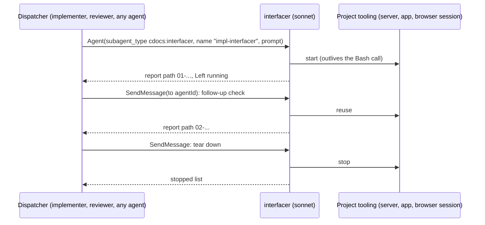

---
first_authored:
  by: "@claude-opus-5-5"
  at: 2026-10-08T09:06:30-07:00
task_list: cdocs/interfacer-agent
type: proposal
state: live
status: review_ready
last_reviewed:
  status: revision_requested
  by: "@claude-opus-5-5"
  at: 2026-10-08T09:30:00-07:00
  round: 1
tags: [architecture, claude_skills, interfacer, browser_delegation, testing, subagents]
---

# Interfacer Agent: a general sonnet testing assistant replacing `browser-delegate`

> BLUF: Delete the `browser-delegate` plugin and add one ~65-line sonnet agent, `cdocs:interfacer`, shaped like `bash-runner`.
> Any agent dispatches it as a testing assistant: it learns how to drive the target from the dispatch prompt and the project's own docs and scripts, writes media and a brief `report.md` under `${TMPDIR:-/tmp}/claude-<uid>/interfacer/<instance>/NN-<check>/`, and replies with the path and a short summary.
> Durable by default: the dispatcher names it and resumes it with `SendMessage`, and what it starts stays up until told to tear down.

## Summary

The agent is a leaf-shaped helper with a short body: a two-step setup, a per-check loop, seven one-sentence rules, and a fixed report.
It reports observations ("the Save button rendered, disabled") and leaves acceptability to the dispatcher.
Inside `/cdocs:iterate` the reviewer dispatches its own fresh interfacer, so that output is reviewer-produced proof for the `confirmed` row; the reviewer looks at any media its verdict relies on and copies it into `cdocs/_media/`.

Changes outside the new agent are one clause each: `reviewer.md`, iterate's Turn N.b and `confirmed` row, the implement skill's verification bullet, the devlog skill's Screenshots bullet, and the agent listings.
The OpenCode build needs no change: it auto-discovers agents, and `scripts/build-opencode.test.ts` covers the new file.

> NOTE(opus-5-5/cdocs/interfacer-agent): The old agent is 184 lines because every review finding was answered with more text (explainer: https://claude.ai/artifact/UGak8RdKKZoTXWX9nAExKR).
> This design keeps only rules that prevent a failure seen in practice, and pushes all tool knowledge to the calling project.

## Objective

Give implementers, reviewers, and any other agent a cheap "hey sonnet, please test this for me" assistant for whatever interface the project exposes (a web app, a flutter app, a simulator, an HTTP API), without the caller holding the tool-call loop and without clauthier encoding any project's tooling.
Remove the separate, playwright-specific `browser-delegate` plugin it supersedes.

## Background

- [`cdocs/proposals/2026-09-17-browser-delegation-plugin.md`](2026-09-17-browser-delegation-plugin.md): the superseded design.
  Its maintainer decisions carry over: the dispatcher owns durable state, and cited screenshots are copied into `cdocs/_media/` by the doc that cites them.
  Its other decisions (`@playwright/cli` only, session naming by branch, no observations at all, baseline diffs, convergence polling) do not.
- `plugins/browser-delegate/agents/browser-delegate.md` and its reviews (`cdocs/reviews/*browser-delegation*`): real failures they found, which the new rules cover in one sentence each:
  matching eval errors counted as convergence (impl r1, blocking), a piped command's exit status read as the tool's (impl r2), and session reuse across agents breaking reviewer independence (r3-r7).
- [`plugins/cdocs/agents/bash-runner.md`](../../plugins/cdocs/agents/bash-runner.md): the style target (65 lines, "Prompt with:" description, `${TMPDIR:-/tmp}/claude-$(id -u)` scratch, fixed brief report, capture left in place).
- [`cdocs/reports/2026-09-19-claude-code-subagents-feature-breakdown.md`](../reports/2026-09-19-claude-code-subagents-feature-breakdown.md) §4-5, 8, 10: the mechanics "durable" rests on.
  `SendMessage(to: <id or name>)` resumes an agent with full history, tool results, and tool set, cache-warm; the Agent tool result carries `agentId`; a newer agent taking a name makes `SendMessage` refuse and name the holder; long-running commands started by a background subagent can outlive it; subagents inherit MCP tools unless `tools` narrows them; nesting is three layers by default.
- "CDocs Overseer Rules › Stay thin": warm subagents are expected, with a fresh one of the same type past ~400K context after a handoff.
- `plugins/cdocs/skills/iterate/SKILL.md`: Turn N.b requires the reviewer to re-run empirical floors and cite an artifact; the `confirmed` row already counts "an artifact produced by a subagent the reviewer dispatched this round" as the reviewer's own.
- `plugins/cdocs/agents/reviewer.md` line 50: the `_media` copy clause, keyed to a subagent report's `Artifacts` line (the `BROWSER DELEGATE REPORT` field) and to `.png`.

## Proposed Solution

### Removal

| Path | Change |
|---|---|
| `plugins/browser-delegate/` (agent, README, `.claude-plugin/plugin.json`) | Delete. |
| `.claude-plugin/marketplace.json` | Delete the `browser-delegate` entry. |
| `README.md:7` | Delete the `browser-delegate` bullet. |
| `cdocs/proposals/2026-09-17-browser-delegation-plugin.md` | `status: evolved`, plus a NOTE under the H1 pointing here. Body unchanged. |

A repo grep outside `cdocs/` finds no other live reference.
Historical cdocs (devlogs, reviews, reports, chat records) stay as written.

### The agent: `plugins/cdocs/agents/interfacer.md`

The implementer may polish wording, but the shape, the rule set, and the length (about `bash-runner`'s) are the spec.

````markdown
---
name: interfacer
model: sonnet
effort: medium
description: |
  Testing assistant: drive the app or interface under test with the tooling the project already has (a browser CLI, flutter, a simulator, an HTTP client, an MCP server), capture screenshots and other media, and write a brief markdown report.
  Prompt with:
  - What to check, and where (URL, screen, endpoint, command)
  - How the project drives it, if you know (a script, doc, or command), else it reads the project's docs and scripts
  - Optional: sessions or processes to reuse, by name, or "fresh" to start its own
  - Optional: which states to capture, and any logs wanted

  Durable by default: dispatch it with a `name`, resume it with `SendMessage` for follow-up checks, and say "tear down" when done; what it starts stays up in between.
  Responds with its report path, a short summary, and what it left running.
color: cyan
maxTurns: 40
---

# CDocs Interfacer Agent

Drive the interface a dispatching agent wants checked, capture media, and report what happened.
You are the dispatcher's hands and eyes, and it decides whether the result is acceptable.

Don't read rules files.

## Setup (first dispatch only)

1. Make your instance directory, `d="${TMPDIR:-/tmp}/claude-$(id -u)/interfacer"; mkdir -p "$d"; mktemp -d "$d/XXXXXX"`, and reuse its printed path as a literal for every later call and follow-up.
2. Learn how this project drives the target: the prompt first, then the project's own docs and scripts (README, CLAUDE.md, AGENTS.md, package scripts, Makefile, `scripts/`, tool config files).
   If you find no working way to drive it, stop and report `FAILED` with what you looked for.

## Each check

The first dispatch and each follow-up message is one check, in `<instance>/NN-<slug>/` (`NN` counts up from `01`).

1. Start or reuse what the check needs, run its steps, and capture media into the check directory.
2. Look at every capture you describe (`Read` shows images).
3. Write `report.md` in the check directory, then reply.

## Rules

- Use the project's setup as documented: don't install tools, change config, or swap in a different tool when it fails, but report what is missing.
- Write only under your instance directory, by absolute path, and never create or edit files in the project tree (if a tool writes into its cwd anyway, say so in the report).
- Never close, kill, restart, or reuse sessions and processes you did not start, unless the prompt names them.
- Start long-lived things (servers, apps, browser sessions) so they outlive the Bash call, and leave them running until told to tear down.
- An error is never a pass: report every failed command, timeout, missing element, or blank capture, including ones a retry got past, and never read a piped command's exit status as the tool's.
- Describe what you observed and point at the media that shows it ("the Save button rendered, disabled"), but leave whether the change is correct or acceptable to the dispatcher.
- On "tear down", stop everything you started and list what you stopped.

## Report

`report.md`, usually under ~300 words:

```
# <check slug>
Status: OK | WARNINGS | FAILED
Setup: <how you drove it: commands or scripts, versions, and the doc or script that said so>
## Steps
1. <action> -> <what happened>
## Media
- <abs path>: <what it shows>
## Left running
- <session or process>: <how to stop it> | none
## Notes
<errors, surprises, anything the dispatcher should know>
```

Your final message is only:

```
INTERFACER REPORT
Report: <abs path to report.md>
Status: OK | WARNINGS | FAILED
Summary: <two to five lines>
Left running: <names> | none
```

The instance directory is what the dispatcher cites: never delete it.
````

Output layout:

```
${TMPDIR:-/tmp}/claude-<uid>/interfacer/
  <XXXXXX>/              one per interfacer instance, made on its first dispatch
    01-<slug>/           one per check (dispatch or follow-up)
      report.md
      <step>.png, <step>.log, ...
    02-<slug>/
```

### Durable by default

Working reading: the agent and what it starts outlive a single check.



- **Warm agent.** The dispatcher passes a `name` (its role plus `-interfacer`, so names do not collide across agents) and keeps the returned `agentId`, which survives a name collision.
  A resume keeps the agent's history, so a follow-up is one sentence ("now submit the form and screenshot the result"), and it hits the prompt cache.
- **Live tooling.** The interfacer starts servers and apps so they outlive its Bash calls (Bash `run_in_background`, or a tool's own daemon such as a browser CLI's session).
  Its `Left running` line is the dispatcher's inventory of what to tear down or hand on.
- **Context limit.** Screenshots grow the interfacer's context fastest.
  Past ~400K ("CDocs Overseer Rules › Stay thin"), the dispatcher sends "tear down" or dispatches a fresh interfacer with the last report's path and the names to reuse.
  The report is the handoff, so no handoff section is needed.
- **Ending.** A dispatcher finishing its work for good sends "tear down", unless it hands the running tooling to its own dispatcher and says so in its return.
  A dispatcher that expects to be resumed (an iterate implementer between rounds) keeps its interfacer and tooling up.

### Callers

Any agent dispatches it directly, with no skill and no wrapper.

- **Implementer.** `plugins/cdocs/skills/implement/SKILL.md` step 5's verification bullet gains: "for checks against a running app or interface, dispatch a `cdocs:interfacer` and keep it warm rather than driving the tool yourself."
  A warm implementer under iterate keeps its interfacer warm across rounds too, since its history holds the `agentId`.
- **Reviewer.** `reviewer.md` gains one sentence and the `_media` clause is generalized:
  - New: "For a runtime check, dispatch your own `cdocs:interfacer` asking for fresh sessions, never resume one another agent started, and tear it down before you return."
  - Generalized line 50: "When your verdict relies on media a subagent produced (such as your interfacer's), look at it yourself, `cp -n` it to `cdocs/_media/YYYY-MM-DD-<review-doc-name>-<description>.<ext>` ..." (the rest of the clause unchanged).
- **Iterate.** Turn N.b: "the reviewer empirically re-runs the floor, itself or through its own `cdocs:interfacer`, and cites at least one artifact path".
  `confirmed` row: "(an artifact produced by a subagent the reviewer dispatched this round, such as its `cdocs:interfacer`, counts as its own; one from an interfacer another agent started does not)".
- **Devlogs.** The devlog skill's Screenshots bullet gains: "copy from an interfacer's report directory (tmp paths do not persist)."

The interfacer never writes `cdocs/_media/`: the dispatcher copies only what its doc cites, per the old proposal's maintainer decision.

### Listings and OpenCode

| File | Change |
|---|---|
| `plugins/cdocs/AGENTS.md` "Formal Agents" | Add `interfacer` (sonnet; inherits all tools, including the project's MCP servers). |
| `plugins/cdocs/README.md` | "7 agents converted" becomes 8; "`bash-runner` follows no rules" names `interfacer` too. |
| `CLAUDE.md` | No change: it lists skills, not agents. |
| `scripts/build-opencode.ts`, its test | No change. With `tools` omitted the build emits no `tools`/`permission` block (OpenCode: all tools), drops `model`, and round-trips the description; the test loops over every agent file. |

The CC-specific words in the description (`SendMessage`, `run_in_background`) pass through to OpenCode as text; an OpenCode caller resumes subagents its own way.

## Important Design Decisions

### D1: One agent in `cdocs`, no plugin, no skill

A separate plugin cost a marketplace entry, an install step, and a README for one file.
`bash-runner` already lives in `cdocs` as a generic helper; the interfacer is the same kind of thing.
A skill would add ceremony the "Prompt with:" description already covers.

### D2: Tool knowledge comes from the calling project

Clauthier cannot track every project's tooling, and the old agent's CLI resolution, config lookup, and session-naming sections all rotted into tool trivia.
The interfacer reads the prompt and the project's docs and scripts, and its report says which source it used, so a project that wants reliable tests documents its setup once (which helps humans too).

### D3: `tools` omitted (inherit everything)

The project's interfacing tool may be an MCP server (a browser or mobile MCP); narrowing `tools` would bake a "CLI tools only" assumption into clauthier.
The write boundary is a rule, not a tool ban (the maintainer prefers guidelines over bans), matching `proposer` and `implementer`.
It keeps `Agent`, so it can hand a verbose build log to a `bash-runner` (depth stays within three layers under iterate: overseer, reviewer, interfacer, runner).

### D4: Observations allowed, verdicts kept by the dispatcher

The old "mechanical facts only" rule made the dispatcher re-open every screenshot to learn anything, which defeats delegation.
A sonnet describing a screenshot it looked at is reliable and checkable, since each observation points at its media.
Acceptability ("the fix works", "matches the design") needs the proposal's criteria and, under iterate, belongs to the reviewer, who looks at any media its verdict relies on.

### D5: Durable by default means warm agent plus live tooling

Re-dispatching for each follow-up pays a fresh briefing, a fresh setup discovery, and a cold app start.
`SendMessage` resume and long-lived processes are native mechanics, so durability costs a `name` at dispatch and a "tear down" at the end, with no state file.
The alternative readings are in Open Questions.

### D6: Fresh per reviewer, warm per implementer

Reviewer independence needs its own sessions and its own agent, so a reviewer never resumes or reuses the implementer's.
The implementer benefits most from warmth (many small checks while fixing).

### D7: Report file plus short final message

The dispatcher gets a few lines in context and reads `report.md` or the media only when it needs them; the file also survives for a later reader of the instance directory.

## Edge Cases / Challenging Scenarios

- **No documented setup.** The interfacer reports `FAILED` with what it searched; the dispatcher either names the command or fixes the project's docs.
- **A tool writes into its cwd** (some browser CLIs write a state dir there). The interfacer notes it in the report, and if the project's docs give a cwd or output flag, it uses that.
- **Two agents told to reuse the same named session.** Not prevented: the rule against touching unnamed sessions covers the default case, and naming a shared session is the dispatcher's explicit choice.
- **Name collision.** `SendMessage` by name refuses when a newer agent holds the name; the dispatcher uses the `agentId`.
- **The dispatcher ends without tearing down.** `Left running` in the last report names what is up; processes started under Claude Code's Bash may die with the session, and daemons idle out on the tool's own timeout.
- **Process lifetime after a foreground interfacer returns.** Documented for background subagents only. WARN(opus-5-5/cdocs/interfacer-agent): unverified for foreground, so Phase 4 tests it, and if it fails, the agent's description tells dispatchers to run it in the background for durable checks.
- **`maxTurns` across resumes.** Whether the 40-turn cap is per resume or cumulative is unverified; a capped result is marked partial and resumable, so the dispatcher can continue it either way.
- **Reviewer's media in a review.** The reviewer copies, compares with `cmp`, and embeds, as today; only the media type (`<ext>`) is generalized.

## Test Plan

- `npm run test:rules`: the new agent quotes no rule heading, and the edited skills and agents still resolve.
- `npm run test:opencode`: `interfacer.md` builds, its description round-trips, it has no `model`, `tools`, or `permission` key.
- `jq . .claude-plugin/marketplace.json` parses and lists only `cdocs`.
- `grep -rn -i 'browser-delegate' --exclude-dir=cdocs --exclude-dir=.git --exclude-dir=build --exclude-dir=node_modules .` returns nothing.
- `wc -l plugins/cdocs/agents/interfacer.md` is about `bash-runner`'s (under ~80).

## Verification Methodology

A live canary, in the style of `cdocs/devlogs/_verify/2026-10-05-bash-runner-live-canary.md`, recorded in the implementer's sub-devlog:

1. **Fixture project.** A `mktemp -d` git repo with a two-page static site, a `health.json`, and a README stating how to serve it (`python3 -m http.server`) and drive it.
   The verifier, not the interfacer, installs the browser tooling into the fixture (playwright-cli is not on this host's `PATH`; `~/.cache/ms-playwright/` holds `chromium_headless_shell-1208`, so a project-local `@playwright/cli` plus a config pinning that `executablePath` is the likely setup).
   If no browser launches, the canary still runs with `curl` as the tool, and the devlog flags the browser path as unverified.
2. **Nested dispatch.** `claude -p --plugin-dir <repo>/plugins/cdocs --output-format stream-json --verbose` from the fixture; the top-level agent dispatches a `general-purpose` stand-in, which dispatches `cdocs:interfacer` with a `name` and a prompt naming only what to check ("check the home page renders and its link reaches page two"), not how.
3. **Follow-up.** The stand-in resumes the same agent with `SendMessage` ("click the link and screenshot page two"), then sends "tear down".
4. **Error probe.** One check targets a missing element or a 404 route; its report must not say `OK` for that step.

Pass criteria, from the stream and the filesystem:

- The stream shows `Agent` with `subagent_type: cdocs:interfacer` at depth 2, and `SendMessage` to the same `agentId`.
- One instance directory holds `01-*/` and `02-*/`, each with `report.md` and at least one screenshot whose description matches the image (the verifier looks).
- Check 1's report's `Setup:` cites the fixture README; check 2 reused check 1's server and session (same PID, no second `open`) rather than restarting them.
- After tear down, the server PID and the browser session are gone.
- `git status` in the fixture shows nothing the interfacer created.
- One screenshot is copied to `cdocs/_media/2026-10-08-interfacer-canary-<description>.png` and embedded in the sub-devlog, exercising the `_media` convention.

Not covered: a real iterate round with a runtime floor.
The first such round after landing is the end-to-end check of the reviewer clauses, and the overseer should log it as such.

## Implementation Phases

Implementation serializes after the graphify overhaul, which also edits `reviewer.md` and `iterate/SKILL.md`; rebase onto it and keep each edit to the clause named here.
Do not touch `scripts/build-opencode.ts`, the rules files, or historical cdocs documents beyond the old proposal's status and NOTE.

### Phase 1: The agent and its listings

- Write `plugins/cdocs/agents/interfacer.md` per "The agent".
- Update `plugins/cdocs/AGENTS.md` and `plugins/cdocs/README.md` per "Listings and OpenCode".
- Success: `npm run test:rules` and `npm run test:opencode` pass; the file is under ~80 lines.

### Phase 2: Callers

- `reviewer.md` (new sentence, generalized `_media` clause), iterate Turn N.b and `confirmed` row, implement skill step 5, devlog skill Screenshots bullet, per "Callers".
- Success: `npm run test:rules` passes; each diff hunk is one clause or sentence.

### Phase 3: Remove `browser-delegate`

- Delete `plugins/browser-delegate/`, its marketplace entry, and `README.md:7`.
- Old proposal: `status: evolved` and a NOTE under the H1 (`> NOTE(opus-5-5/cdocs/interfacer-agent): Superseded by [the interfacer agent](2026-10-08-interfacer-agent.md); the plugin is removed.`).
- Success: the Test Plan's `jq` and `grep` checks pass.

### Phase 4: Live canary

- Run the Verification Methodology and record stream excerpts, report paths, and pass/fail per criterion in the sub-devlog.
- If foreground process lifetime fails, add the background-dispatch sentence to the description and re-run.
- Success: every pass criterion met, or each miss flagged with its cause.

## Open Questions

1. **"Durable by default": other readings.** This proposal reads it as warm agent plus live tooling. Alternatives:
   (a) durable output, with media written to a persistent project path instead of tmp (rejected here because it writes into the project tree and duplicates the `_media` copy decision);
   (b) resilience, re-opening dead sessions and retrying (partly covered: an error is reported, and the dispatcher decides whether to retry);
   (c) `background: true` in the frontmatter, so dispatches never block the caller.
   Which did the maintainer mean?
2. **Inherit all tools.** Acceptable, or narrow to `Bash, Read, Write` and give up MCP-driven projects?
3. **Reviewer teardown.** Should a reviewer ever hand its running tooling to the overseer instead of tearing down (for a human to inspect after the round)?
