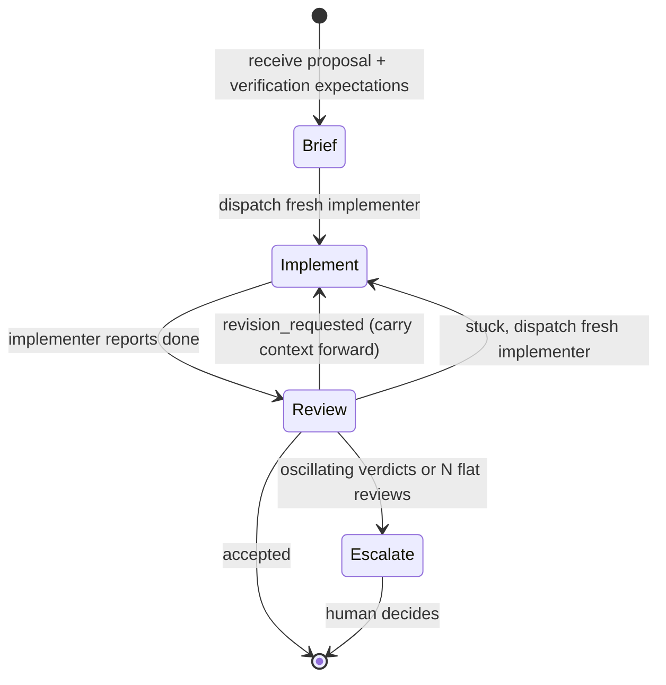

---
first_authored:
  by: "@claude-opus-4-7"
  at: 2026-05-13T12:00:00-07:00
task_list: cdocs/iterate-skill
type: report
state: live
status: review_ready
tags: [agent_orchestration, agent_roles, iteration, oversee, iterate_skill, prior_art, verification]
---

# Agent Roles and the Iterative Implement-Review Loop

> BLUF: A `/iterate` skill targeted at overseer agents needs a small, stable role taxonomy and an explicit turn-by-turn loop protocol.
> Across LangGraph, CrewAI, AutoGen, MetaGPT, Aider, and OpenHands the same three roles recur under different names: a non-coding **Overseer**, a code-writing **Implementer**, and a critical **Reviewer**; this report adopts those names and maps the synonyms.
> The loop's distinguishing feature, relative to existing cdocs orchestration, is **freshness-by-default for reviewers** (each review is a new subagent) and **freshness-on-fatigue for implementers** (the overseer retires a stuck implementer instead of nudging it).
> Termination is bounded by accept-or-escalate, not by retry count: the overseer is patient by mandate, but escalates on flat or oscillating review verdicts.

## Context / Background

The user has asked for a proposal for a new cdocs slash command `/iterate` that codifies a recurring pattern:

> 1. An `/implement`'er agent executes work (e.g., Playwright for UI verification).
> 2. When it considers its work complete, a *fresh* QA subagent is dispatched to `/review` with the same guidance, highly critical of rendering and usability issues.
> 3. Repeat as long as productive. Be very patient. If a subagent is fatigued/overwhelmed, dispatch a new one.

This is a specialization of the [`/oversee` RFP](../proposals/2026-03-26-rfp-oversee-skill.md): the overseer is a *manager* that never edits code, dispatching implementer and reviewer subagents in alternation.
Prompt-engineering principles for the overseer prompt itself are already captured in [`2026-03-27-overseer-prompt-engineering.md`](2026-03-27-overseer-prompt-engineering.md); this report is the role-and-protocol companion.

This report exists as a standalone document rather than an amendment because (a) the prompt-engineering report's scope is the prompt-writing principles for the manual `/oversee` invocation, and (b) the iterative loop deserves equal billing with the broader overseer concept — it is the most concrete sub-pattern the `/oversee` RFP names, and `/iterate` will become a peer skill to `/oversee`, not a sub-section of its documentation.

## Key Findings

### 1. The three-role taxonomy is convergent across frameworks

Six independent agent frameworks ship the same triad of roles. The names differ; the responsibilities do not.

| Role (this report) | LangGraph | CrewAI | AutoGen | MetaGPT | Aider | OpenHands | Claude Code (cdocs today) |
|---|---|---|---|---|---|---|---|
| **Overseer** | Supervisor | Manager | GroupChatManager | Product/Project Manager | (n/a — single agent) | Orchestrator | top-level agent + `/oversee` RFP |
| **Implementer** | Worker | Worker / Engineer | Coder | Engineer | Editor | Coder | top-level agent + `/cdocs:implement` |
| **Reviewer** | Worker (specialized) | Worker (specialized) | Critic | QA Engineer | (n/a) | Critique agent | `reviewer` agent + `/cdocs:review` |

Two of the six (Aider, single-mode OpenHands) collapse the triad into a single agent with mode switching. Four of the six (LangGraph, CrewAI, AutoGen, MetaGPT) make the overseer explicit and have it call workers via tool-call or message-pool. The user's pattern matches the four-role-explicit camp.

A useful frame from CrewAI's docs: the hierarchical process "automatically assigns a manager to the defined crew to properly coordinate the planning and execution of tasks through delegation and validation of results." Validation is half of the manager's job, not an afterthought.

OpenHands' "Iterative Refinement" guide is the closest published analogue to the requested pattern: "a refactoring agent performs the main task, a critique agent evaluates the quality and provides detailed feedback, and if quality is below threshold, the refactoring agent tries again with the feedback ... the workflow continues until the refactoring meets the quality threshold."

### 2. Freshness has a different meaning per role

The user's brief contains the load-bearing word *fresh* exactly once, applied to the QA subagent. This is correct and underdocumented in the existing cdocs corpus.

Two distinct freshness disciplines emerge:

- **Reviewers should always be fresh.** A reviewer that participated in implementation has lost the perspective that justifies a separate review step. This is already implicit in the cdocs `reviewer` agent (it runs in an isolated context via the Task tool) but is not stated as a rule. The 2026-01-30 process analysis report makes the point in passing: "Reviews benefit from a fresh perspective (a subagent hasn't seen the authoring process)."
- **Implementers should be fresh on fatigue, not by default.** An implementer mid-task carries valuable context: which approaches failed, which files it has already touched, which test commands matter. Retiring it for a fresh implementer on every iteration is wasteful. Retiring it when it is stuck, oscillating, or producing degraded output is essential. The 2026-01-30 report's "if the revision is the third or later major task in a session, suggest compaction or a fresh agent" heuristic generalizes here.

External corroboration: the SlopCodeBench paper (cited in the search results above) characterizes "long-horizon iterative task degradation" as a real, measurable phenomenon. Simon Willison's subagent guide makes the same point in plain English: subagents "fundamentally change your relationship with the context window by giving you a multiplication of context windows."

### 3. The cdocs corpus has the parts but not the protocol

A grep over `cdocs/` shows the building blocks already exist:

- **Overseer concept**: [`2026-03-26-rfp-oversee-skill.md`](../proposals/2026-03-26-rfp-oversee-skill.md) (RFP, not yet elaborated).
- **Implementer skill**: [`plugins/cdocs/skills/implement/SKILL.md`](../../plugins/cdocs/skills/implement/SKILL.md) already says "Request `/cdocs:review` from a subagent after each phase to catch issues early" and "Have a final subagent `/cdocs:review` the entire body of work and integrate the feedback."
- **Reviewer skill and agent**: [`plugins/cdocs/skills/review/SKILL.md`](../../plugins/cdocs/skills/review/SKILL.md) plus the formal `reviewer` agent in `plugins/cdocs/agents/`.
- **Subagent-driven development pattern**: [`plugins/cdocs/rules/workflow-patterns.md`](../../plugins/cdocs/rules/workflow-patterns.md) under "Subagent-Driven Development."
- **Verification rigor framing**: [`2026-03-27-overseer-prompt-engineering.md`](2026-03-27-overseer-prompt-engineering.md) "Express Verification Rigor as Consequences, Not Rules."

What is missing:

- A named protocol that wires `/implement` and `/review` together as a loop with explicit turn-by-turn responsibilities for an overseer.
- A freshness discipline that says when to retire which agent.
- Termination conditions that are not "accept" or "retry count exceeded" — patience plus escalation, per the user's brief.
- A vocabulary for verification-rigor beyond Playwright UI checks (it is the canonical instance, not the only one).

### 4. Existing skills do not currently distinguish manager work from worker work

`/cdocs:implement` is written as if a single agent executes the proposal end-to-end and dispatches a final review.
That matches the user's "implementer agent" persona.
`/cdocs:review` is written as if a single agent reviews a single document.
That matches the "fresh QA subagent" persona.

What is missing is a third skill that wraps both with the loop structure.
The `/oversee` RFP gestures at this but spans a wider scope (multi-proposal project arcs, AFK mode, escalation policy, shared state).
`/iterate` is the narrower, more concrete sibling: a single proposal's implement-review loop driven by a manager.

## Recommended Role Taxonomy

Three roles, named, with one-line responsibilities. Synonyms listed so prompt authors and reviewers can map across frameworks.

### Overseer (a.k.a. Supervisor, Manager, Orchestrator)

Dispatches subagents and judges their output; never edits source code itself.

- Owns the loop's termination decision.
- Owns the freshness decision (when to retire and replace a subagent).
- Owns the escalation decision (when to stop the loop and surface to the human).
- Reads handoff documents and writes only orchestration artifacts (devlog updates, the iteration log).
- Default tools: Read, Task; explicitly *not* Edit, Write, or Bash beyond status queries.

### Implementer (a.k.a. Worker, Engineer, Coder, Editor)

Executes the proposal; verifies its own output against real-world state before declaring done.

- Reads the proposal and the current iteration's review (if any).
- Edits source, runs tests, executes verification commands (Playwright, dev-server checks, container smoke tests).
- Commits frequently per cdocs conventions.
- Returns a structured summary: what changed, what was verified, what is uncertain.
- Default tools: full toolset.

### Reviewer (a.k.a. Critic, QA Engineer, Critique Agent)

Reads the implementer's output with a fresh context and a critical mindset.

- Reads the proposal, the implementer's summary, the diff, and the live system state where applicable.
- Produces a structured review per `/cdocs:review` conventions with a verdict: Accept / Revise / Reject.
- Surfaces blocking issues separately from non-blocking ones.
- Is rotated every iteration: the next iteration's reviewer is a new subagent, not the same one re-invoked.
- Default tools: Read, Task (for delegated verification), Bash (read-only verification commands), Edit (for the review document only).

> NOTE(opus/cdocs/iterate-skill): The reviewer's critical stance is a designed property, not an emergent one. The `/oversee` prompt-engineering report's "Express Verification Rigor as Consequences, Not Rules" principle applies here: the reviewer's prompt should paint pictures of failure ("if the cards don't render, the borders are invisible, or the zones are misaligned"), not enumerate rules.

## The Iterative Implementation Loop Protocol

This is the turn-by-turn protocol for `/iterate`. It is written as if the overseer is a fresh agent reading this section as guidance.



### Turn 0: Brief

The overseer:
1. Reads the proposal and any handoff devlog. Loads context once.
2. States the verification floor explicitly: "Done means X is verified by Y." If the proposal does not specify Y, the overseer asks the user before starting (this mirrors the `AskUserQuestion`-before-autonomy pattern from the existing overseer report).
3. Creates or appends to a devlog with an "Iteration Log" section: a table with columns `iteration`, `implementer`, `reviewer`, `verdict`, `blocking_count`, `notes`.

### Turn N.a: Implement

The overseer dispatches an implementer subagent via Task tool with:
- The proposal path.
- The verification floor from Turn 0.
- The previous iteration's review document path, if any.
- A directive to follow `/cdocs:implement` conventions for this single iteration.
- A clear stop condition: "Return when you believe the work meets the verification floor; do not dispatch your own reviewer — the overseer owns review dispatch."

The implementer:
1. Reads the proposal and previous review if applicable.
2. Executes the work.
3. Runs verification commands and inspects results.
4. Commits per conventional commit format.
5. Returns a structured summary: changes made, verification evidence, residual uncertainties.

### Turn N.b: Review

The overseer dispatches a **new** reviewer subagent (never the previous reviewer):
- Reviewer reads the proposal, the implementer's summary, the diff, and the live system state.
- Reviewer follows `/cdocs:review` conventions.
- Reviewer produces a review document with verdict Accept / Revise / Reject.

### Turn N.c: Decide

The overseer reads the review verdict and decides:

- **Accept**: terminate the loop, update the proposal frontmatter, write the final devlog entry, surface results to the user.
- **Revise, blocking_count decreasing**: loop to Turn N+1.a with the same implementer (it has useful context).
- **Revise, blocking_count flat for 2 iterations**: retire the implementer; loop to Turn N+1.a with a *new* implementer. The new implementer reads the iteration log and recent reviews to onboard.
- **Revise, blocking_count oscillating** (same issues appearing and disappearing): escalate to the user. Oscillation is a signal that two parts of the design conflict, not that the implementer is bad.
- **Reject**: escalate to the user. The reviewer is saying "this approach is wrong"; an overseer should not autonomously override that.

### Termination Conditions

1. Reviewer returns Accept.
2. The overseer's escalation rule fires (Reject, oscillation, or N flat iterations — `N=3` is a reasonable default).
3. The user interrupts.

There is no retry-count limit. The user said: "Be very patient." A patient overseer is bounded by review-signal quality, not by clock or retry count.

## Verification-Rigor Patterns

"Highly critical of all rendering and usability issues" is one instance of verification rigor — the web-UI instance. The general pattern: **the reviewer must inspect what was actually built, not what the implementer claims to have built.**

| Domain | Implementer verification | Reviewer verification |
|---|---|---|
| Web UI | Playwright smoke check; screenshots | Open the running dev server; look at the actual rendering with Playwright MCP; check borders, zone alignment, hover states |
| CLI | Run the command; check exit code and stdout | Run the command in a fresh shell; check that documented flags work; check error paths |
| Library / SDK | Unit tests pass | Import the library in a fresh project; exercise the public API end-to-end |
| Container / Service | `docker compose up`; tests pass | Open the service; exercise health checks; tail logs while making a request |
| Doc change | Tests still pass | Read the doc as a new reader; check that linked sections still exist; check examples actually run |

The reviewer's verification is always one rung above the implementer's in two ways:
1. **Cold context**: the reviewer comes fresh and does not know what the implementer believed to be true.
2. **Real-world state**: the reviewer inspects the running system, not just the artifact.

## Concrete Prompt Snippets

### Overseer kickoff prompt template

```
Please iterate on the /implement'ation of {proposal_path}.

The verification floor for this work is: {verification_floor_sentence}.
Examples of what "not good enough" looks like: {failure_picture_1}, {failure_picture_2}.

Iterate by dispatching a fresh implementer subagent, then a fresh reviewer subagent,
then deciding based on the review verdict. Do not edit code yourself.

Be patient. If the reviewer requests revisions, loop. If the implementer appears
stuck (same issues across two reviews), retire it and dispatch a fresh implementer
that reads the iteration log. If review verdicts oscillate or the reviewer says
Reject, stop and AskUserQuestion.

Maintain an Iteration Log table in the devlog. Stop on Accept or escalation.
```

### Implementer dispatch (from overseer)

```
Implement {proposal_path} per /cdocs:implement conventions.
Verification floor: {verification_floor_sentence}.
{previous_review_path ? "Previous review with blocking issues: " + previous_review_path : ""}

Do NOT dispatch your own reviewer. Return a structured summary including:
- Files changed
- Verification commands run and their results
- Residual uncertainties or known gaps
```

### Reviewer dispatch (from overseer)

```
Review the implementer's work on {proposal_path} per /cdocs:review conventions.

Inspect the running system, not just the diff: {verification_floor_sentence}.
Be highly critical of {domain_specific_failure_modes}. The implementer claims
{implementer_claims}; verify each claim against live state.

Surface blocking issues separately from non-blocking ones. Verdict: Accept,
Revise, or Reject. If Reject, explain what is fundamentally wrong with the
approach, not just what is currently broken.
```

## Recommendations

### For the `/iterate` skill proposal

1. **Scope as a peer skill to `/oversee`, not a sub-skill.** `/iterate` is one proposal, one implement-review loop. `/oversee` is a multi-proposal project arc. They compose: `/oversee` may invoke `/iterate` for each proposal it manages.
2. **Adopt the three-role taxonomy** (Overseer, Implementer, Reviewer) as the canonical names in the proposal and skill. Provide a synonyms table for prompt authors coming from other frameworks.
3. **Add an `iteration-log` table convention** to the devlog template (or to `frontmatter-spec.md`) so that any agent can resume an in-progress iteration from the devlog alone.
4. **Encode the freshness disciplines as rules**, not as soft suggestions:
   - Reviewers: fresh every iteration. Reuse is a bug.
   - Implementers: fresh on fatigue, defined as ≥2 reviews with flat or growing blocking_count.
5. **Termination is accept-or-escalate, not retry-count-exceeded.** This is the user's stated principle and should be in the skill's invocation docs.
6. **Verification-floor framing**: the skill should require the user (or proposal) to state a one-sentence verification floor with at least one failure-picture, mirroring the consequence-not-rule pattern from `2026-03-27-overseer-prompt-engineering.md`.

### For `/oversee` interaction

`/oversee` invokes `/iterate` per proposal in its chain. `/iterate` does not know about `/oversee`. This composition gives:
- `/oversee` the project arc, AFK mode, shared state, chain sequencing.
- `/iterate` the single-proposal loop with role discipline.
- A user can invoke either standalone.

### For `/cdocs:implement` and `/cdocs:review`

No changes required to the existing skills. `/iterate` invokes them as-is via the same Task-tool dispatch the cdocs reviewer agent already uses. The reviewer agent's frontmatter `skills: [cdocs:review]` field already gives it the review prompt.

### Open design questions to surface in the proposal

1. **Resumability**: can an interrupted `/iterate` resume from the iteration-log alone, or does it need a separate state file (per the `/oversee` RFP's shared-state question)? Probably the log is enough for `/iterate`; the multi-proposal state file is `/oversee`'s problem.
2. **Reviewer model selection**: should reviewer default to opus (judgment) while implementer defaults to sonnet (speed)? The 2026-01-29 triage-v2 proposal already runs the cdocs reviewer on sonnet; `/iterate` may want opus for harder critiques.
3. **Parallel-iteration safety**: if `/oversee` runs `/iterate` on multiple proposals in parallel, file-conflict detection from the `/oversee` RFP applies. `/iterate` itself is single-threaded.
4. **Fatigue heuristic**: is "≥2 reviews with flat blocking_count" the right rule, or should it be flat-count plus implementer-reported uncertainty? Worth empirical study after the skill ships.
5. **What about the `/cdocs:report` and `/cdocs:nit_fix` skills?** They are not part of the loop but a reviewer may dispatch them (e.g., `/cdocs:report` to investigate a recurring bug class). The proposal should clarify whether iterators can dispatch second-order subagents or whether that is the overseer's call.

## Related Documents

- [`cdocs/proposals/2026-03-26-rfp-oversee-skill.md`](../proposals/2026-03-26-rfp-oversee-skill.md) — the parent RFP this report supports.
- [`cdocs/reports/2026-03-27-overseer-prompt-engineering.md`](2026-03-27-overseer-prompt-engineering.md) — companion report on writing the overseer prompt itself.
- [`cdocs/reports/2026-01-30-cdocs-process-analysis.md`](2026-01-30-cdocs-process-analysis.md) — earlier process analysis containing the "fresh reviewer" intuition.
- [`plugins/cdocs/skills/implement/SKILL.md`](../../plugins/cdocs/skills/implement/SKILL.md) — the implementer-role skill.
- [`plugins/cdocs/skills/review/SKILL.md`](../../plugins/cdocs/skills/review/SKILL.md) — the reviewer-role skill.
- [`plugins/cdocs/rules/workflow-patterns.md`](../../plugins/cdocs/rules/workflow-patterns.md) — current parallel-agent and subagent-driven-development patterns.

## External Prior Art

- LangGraph Supervisor (Feb 2026): single supervisor coordinates worker agents via tool-calls; workers communicate only with the supervisor. <https://reference.langchain.com/python/langgraph-supervisor>
- CrewAI Hierarchical Process: manager agent breaks goal into subtasks, dispatches to workers, validates outcomes. <https://docs.crewai.com/en/learn/hierarchical-process>
- AutoGen GroupChat: critic/reviewer pattern with explicit scoring rubric (1–10) and rationale. <https://microsoft.github.io/autogen/0.2/docs/notebooks/agentchat_groupchat_vis/>
- MetaGPT: five-role SOP (PM → Architect → Project Manager → Engineer → QA). <https://www.ibm.com/think/topics/metagpt>
- Aider Architect Mode: planner-editor split, two-model pipeline. <https://aider.chat/>
- OpenHands Iterative Refinement: refactoring agent + critique agent loop until quality threshold met. <https://docs.openhands.dev/sdk/guides/iterative-refinement>
