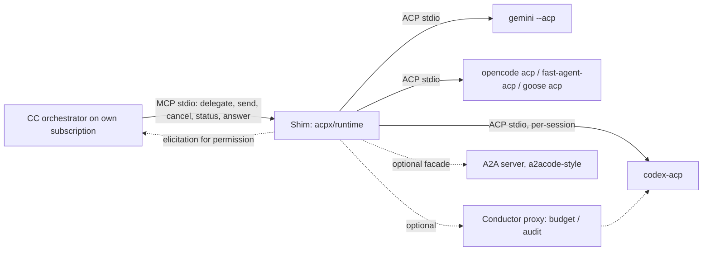

---
first_authored:
  by: "@claude-sonnet-5"
  at: 2026-09-19T18:00:00-07:00
task_list: cdocs/subagent-bridge-layers
type: report
state: live
status: wip
tags: [research, acp, subagents, gap_analysis, libraries, mcp, a2a]
---

# ACP vs Claude Code native subagents: gap analysis, and ACP libraries not covered by the survey

> BLUF: Of 22 gaps between ACP-based delegation and Claude Code (CC) native subagents, 3 are High, 10 Medium, 9 Low against the user's workload (read-mostly, review, search, bounded-edit delegation to cheaper or other-provider models).
> Most High/Medium gaps are **not spec gaps**: the stable ACP v1 schema already has cancel, permission requests, load/resume, config options for model and effort, usage/cost, and elicitation.
> They are CC-side (no ACP client, no MCP Tasks, no human relay), adapter-quality (permission enforcement, post-cancel cleanup, effort reverting), or client-side (nobody wires the pieces).
> Genuine spec absences: mid-turn steering, per-session system prompt, subagent identity, spend/depth caps, hooks (all open PRs or no RFD); prompt-cache sharing and CC-native hooks are inherent to a cross-vendor boundary.
> Part 2 verdict: keep [acpx](https://github.com/openclaw/acpx) as the base, and embed its `acpx/runtime` in the MCP shim; [AgentPool](https://github.com/phil65/agentpool) should not be adopted (stale, single maintainer, full framework); `@mcpc-tech/acp-ai-provider` is an optional library inside a Node shim, not a replacement for acpx.

## Context / Background

Prior arc reports (same directory, all dated 2026-09-19):

- [survey](2026-09-19-subagent-bridge-layers-survey.md) (Supplemental section): acpx plus MCP shim recommended.
- [feature breakdown](2026-09-19-claude-code-subagents-feature-breakdown.md): the Bridge requirements checklist.
- [synthesis](2026-09-19-subagent-bridge-layers-synthesis.md): coverage matrix with ACP scored P/N/U on many rows.

This report zooms in on every ACP row that scored P, N, or U, and on ACP libraries the survey did not examine.
Method: `gh api` (schema `meta.json` files, `docs/docs.json` RFD navigation, releases, issues, PRs), READMEs, npm/PyPI, and WebFetch, all on 2026-09-19.
No tool was run; no bridge experiment was executed.
Spec facts come from the [ACP repo](https://github.com/agentclientprotocol/agent-client-protocol) at releases `v1.9.1` and `schema-v1.23.0` (both 2026-09-18), plus `schema-v2.0.0-alpha.5` (2026-09-18, Draft).
RFD stages (Draft, Active, Preview, Completed) are from the [RFD update log](https://agentclientprotocol.com/rfds/updates).

## Key Findings

- **Stable v1 covers more than the survey stated.**
  Agent methods: `initialize`, `authenticate`, `session/new|load|resume|list|close|delete`, `session/set_mode`, `session/set_config_option`, `session/prompt`, `session/cancel`, `logout`.
  Client methods: `session/request_permission`, `session/update`, `fs/*`, `terminal/*`, `elicitation/create`, plus `$/cancel_request`.
  Config option categories include `mode`, `model`, `model_config`, `thought_level`; the "Unstable Session Model API" was removed 2026-06-01.
- **`session/new` takes only `cwd`, `additionalDirectories`, `mcpServers`, `_meta`.**
  No system prompt, model, effort, tool allowlist, or budget; those are set afterwards via config options or adapter `_meta`.
- **Spec-absent, with open PRs:** mid-turn injection ([#1261](https://github.com/agentclientprotocol/agent-client-protocol/pull/1261), open since 2026-05-19), client system prompt ([#1237](https://github.com/agentclientprotocol/agent-client-protocol/pull/1237), 2026-05-18), subagents and child sessions ([#855](https://github.com/agentclientprotocol/agent-client-protocol/pull/855) 2026-03-26; [#1992](https://github.com/agentclientprotocol/agent-client-protocol/pull/1992) 2026-08-20), session liveness ([#986](https://github.com/agentclientprotocol/agent-client-protocol/pull/986)), multi-client attach (#533).
  No RFD found for spend/depth caps or lifecycle hooks.
- **Adapter quality is the dominant risk.**
  `claude-agent-acp` has 172 open issues and `codex-acp` 120; safety-relevant ones: qwen-code `--acp` skips permission requests ([qwen-code#11887](https://github.com/QwenLM/qwen-code/issues/11887), 2026-09-14), `codex-acp` MCP calls can run before permission mediation ([codex-acp#401](https://github.com/agentclientprotocol/codex-acp/issues/401), 2026-08-14).
- **acpx is more capable than the survey stated** (permission policy with escalation, embeddable runtime with a per-turn `onPermissionRequest` callback); see `## Corrections to prior reports`.
- **No ACP library closes the CC-side gaps alone.**
  The closest ready-made CC-pluggable seed is a 1-star MCP bridge; everything else is a library, a GUI, or a different protocol.

## Part 1: gap-by-gap analysis

### Rubric (judgment, not measurement)

- **High:** blocks a core workload class or is a safety hazard (uncontrolled writes, unstoppable child, unmediated permission).
- **Medium:** degrades UX, cost control, or efficiency, and a workaround exists that costs shim work or discipline.
- **Low:** cosmetic, rarely needed for read-mostly/bounded delegation, or at parity with native.

Status vocabulary: full / partial / none / unverified (UNVERIFIED) for ACP support.
Gap layers: spec (protocol lacks it), adapter (protocol has it, an adapter is wrong or missing it), client (acpx/shim/editor does not wire it), CC-side (CC cannot host it).
Ranked by significance, then by how directly the row hits the user's workload.

### Gap table

| # | CC-native capability | ACP status | Gap layer | Workaround | Fix trajectory | Sig. | Rationale |
|---|---|---|---|---|---|---|---|
| 1 | Permission prompt relayed to the human in CC's UI, child named | partial: protocol full (`session/request_permission`, `allow_once/always`, `reject_once/always`), no CC-side receiver | CC-side + client | Shim raises MCP elicitation (documented for CC, UNVERIFIED mid-call from stdio); `acpx --permission-policy` with `escalate`, deny-then-retry loop using `_meta.acpx.permissionEscalation`; embedded `onPermissionRequest` callback | Spec done. CC: no ACP client planned; Channels permission relay is research preview ([survey](2026-09-19-subagent-bridge-layers-survey.md)). acpx: shipped (below) | High | Bounded-edit delegation is unsafe without a human-visible approval path, so it degrades to read-only or approve-all, which removes a whole workload class. |
| 2 | Enforced per-tool permission for every child action | partial: protocol full, adapters inconsistent | adapter | Only use adapters with a verified permission path; backend OS/sandbox mode (Codex `read-only`); run a canary write test per adapter | qwen-code#11887 (open, 2026-09-14): `--acp` never sends permission requests; codex-acp#401 (2026-08-14): MCP calls before mediation; opencode [#48232](https://github.com/anomalyco/opencode/issues/48232) (2026-09-09): Task-subagent permissions dropped, fix PR #48326 (2026-09-10, merge status UNVERIFIED) | High | A child that skips or precedes the permission gate can write or call MCP tools with no human or policy seeing it, which invalidates "bounded" edits. |
| 3 | Human/parent cancel that reliably stops the child and its descendants | partial: `session/cancel` and `$/cancel_request` stable (Completed 2026-06-29), propagation and cleanup broken in places | CC-side + adapter | Shim kills the child on stdio close, SIGTERM, and calls `session/cancel`; process-group kill; canary test (E1, E3) | CC cancel propagation UNVERIFIED (E1). claude-agent-acp [#994](https://github.com/agentclientprotocol/claude-agent-acp/issues/994) stop leaves background sub-agents running (2026-08-13), [#1061](https://github.com/agentclientprotocol/claude-agent-acp/issues/1061) ghost tool calls after cancel (2026-09-01), #1011 orphaned subprocesses; copilot-cli [#4561](https://github.com/github/copilot-cli/issues/4561) cancel answered `end_turn` (2026-08-21); codex-acp #492 per-task cancel (2026-09-09) | High | An orphaned child that keeps editing or spending after the human hits stop is the worst failure of any delegation design. |
| 4 | Async completion notified into the parent's turn; concurrent children | none in CC for MCP; ACP is async by nature | CC-side | Bash `run_in_background` + Monitor on acpx NDJSON; MCP call auto-backgrounds at 2 min (progress lost, [#86464](https://github.com/anthropics/claude-code/issues/86464)); Channels (research preview); a2a-bridge uses Channels | MCP Tasks (SEP-1686) unsupported in CC: [#76571](https://github.com/anthropics/claude-code/issues/76571) closed as duplicate of #52137, closed for inactivity 2026-06-19 | Med | Fan-out of search/review jobs works through Bash+Monitor, but with no in-band completion event and no progress visibility. |
| 5 | Spend cap and turn/depth cap that stops running children | none (only `max_turn_requests` as a stop reason, agent-side) | spec + adapter + shim | Shim wall-clock timeout and kill; poll `usage_update.cost` where emitted; cheap-model default; backend-level caps (Codex config, OpenCode agent `steps`) | No RFD found. Proxy-chains (Draft, last commit 2026-01-08) could host a budget proxy; conductor exists in the Rust SDK | Med | Cheap delegates make runaway spend a slow leak rather than a bill shock, but nothing stops a looping child except your own timer. |
| 6 | Per-call model and effort, with the served model reported | partial: config options stable; `model`/`thought_level` categories; effort ids are adapter-defined; no per-call param on `session/prompt` | adapter | Set options after `session/new` via `session/set_config_option`, re-apply each turn, read back `config_option_update`; verify served model in an event | codex-acp [#336](https://github.com/agentclientprotocol/codex-acp/issues/336) effort reverts after one turn (2026-07-29), #343 load returns wrong model/effort; claude-agent-acp #1075 `/model` drops effort option (2026-09-02), #1021 `usage_update` lacks effective model id, #1056 `_meta` model overridden by settings; opencode #46311 per-agent model no effect in ACP (2026-08-30); Gemini: no effort option found | Med | This is the core reason to delegate, and it works for Codex, but needs read-back verification per adapter to avoid silently running the wrong model or effort. |
| 7 | Isolation: worktree with escape enforcement | none in spec (`cwd`, `additionalDirectories` are hints) | spec + adapter | Shim-created git worktree + `cwd`; Codex `workspace-write` sandbox is real enforcement; container/bwrap for others | Not planned in spec; adapter-level (codex-acp #406 no workspace-write+network mode 2026-08-14, #519 permission profiles as modes 2026-09-16, #477 writable roots overwritten) | Med | Bounded edits need write confinement, which only some backends enforce, so the shim must choose backends by sandbox quality. |
| 8 | Tool allowlist/denylist per role, MCP scoping | partial: `mcpServers` in `session/new` (stdio baseline, `mcpCapabilities.http/.sse`), `session/set_mode`; no allowlist field | spec + adapter | Modes (`read-only`), adapter config, MCP server list limited to what the role needs; sandbox as the real boundary | No RFD found (open PR #1302 "requested tool categories", UNVERIFIED scope); adapter bugs: kimi [#2464](https://github.com/MoonshotAI/kimi-cli/issues/2464) MCP not loaded, codex-acp #489 MCP env dropped | Med | Read-mostly roles depend on "cannot write", which today rides on adapter modes rather than a portable field. |
| 9 | Per-role system prompt / declarative role | none: no `systemPrompt` in `session/new` | spec | Prepend role prompt to first turn; backend instruction files (AGENTS.md); shim-owned role files | PR #1237 open (2026-05-18, updated 2026-07-22, v2 bucket); kodizm/acp tiny wrapper claims systemPrompt replace/append (1 star) | Med | A prepended prompt is weaker than a system prompt and can be lost to compaction, which hurts reviewer roles that need strict output contracts. |
| 10 | Untrusted labeling and injection scanning of the returned message | none (out of scope for a protocol) | CC-side + shim | Shim wraps and escapes results; treat as untrusted; CC v2.1.210 scanner does not cover MCP results (UNVERIFIED) | Not an ACP concern | Med | Results from another vendor's model re-enter the orchestrator's context unscanned unless the shim does it. |
| 11 | Durable sessions, resume by ID | partial: `load` (with replay), `resume` (no replay, Completed 2026-04-22), `list`, `close`, `delete`; adapter reliability varies | adapter | Fresh session + summary; acpx named sessions in `~/.acpx/`; re-verify after load | Gemini [#29288](https://github.com/google-gemini/gemini-cli/issues/29288) sessionId mismatch (2026-09-11), #28775 load erases session (2026-08-11); codex-acp #516 partial replay (2026-09-14); claude-agent-acp #1019 resume yields no history, #1011 orphans; opencode #42442 load omits `sessionId` | Med | Warm specialists across turns are a nicety, but broken load can silently destroy a session, so one-shot delegation is safer. |
| 12 | Usage and cost attribution per child | partial: `usage_update{used,size,cost}` stable (Completed 2026-06-05); `PromptResponse.usage` and per-turn tokens unstable (end-turn-token-usage Draft) | spec + adapter | Read vendor dashboards; shim tallies emitted events; skip if absent | Spec: [#1860](https://github.com/agentclientprotocol/agent-client-protocol/issues/1860) usage semantics self-contradictory (2026-08-03). Adapters: Gemini #29389 (2026-09-18, usage only in `_meta.quota`), copilot #4233, cline #14251/PR #14252 (2026-09-18), codex-acp #447 last request only | Med | Without per-child cost, the "cheaper subagent" premise cannot be checked or budgeted. |
| 13 | Subagent / child session identity and nesting visibility | none stable: subagent RFD PRs open; adapters implement draft via capability negotiation | spec + adapter | Cap nesting in the backend; treat child agents as opaque | PR #1992 (open, updated 2026-09-16; adds `unstable_subagents` flag), #855; codex-acp and claude-agent-acp negotiate `clientCapabilities.subagents` (draft); claude-agent-acp #1014 sidechain listing flag | Med | Nested delegation inside a backend is invisible and unpermissioned to the orchestrator unless the backend exposes it (see #2 for opencode). |
| 14 | Effort/model precedence rules and role variants | n/a (shim-defined) | client | Shim role files with `backend/model/effort`; static variants | Shim work | Low | Cheap to build once row 6 read-back works. |
| 15 | Mid-run message injection / steering | none in stable; adapters invent queue/steer | spec | Cancel then re-prompt; `session/prompt` between turns on the same session (native `SendMessage` equivalent); acpx queueing | PR #1261 `session/inject` (open, updated 2026-08-26, depends on v2 prompt lifecycle); adapter bugs: claude-agent-acp #1114, #1039, #1027 (steered turn can hang, 2026-08/09), codex-acp #440 | Low | Bounded read-mostly tasks are cheaper to cancel and restart than to steer. |
| 16 | Lifecycle hooks with child identity (`SubagentStart/Stop`, `agent_id` on tool events) | none in ACP; CC hooks fire only on the shim call | spec + inherent | `PreToolUse` on `mcp__shim__delegate`; shim re-emits events into its own log | No RFD. Proxy-chains (Draft) is the nearest interception mechanism | Low | Policy for child tool calls lives in the backend anyway; call-level gating covers the orchestrator's decisions. |
| 17 | Fork (child seeded with parent context, cache hit) | partial: `session/fork` unstable (RFD Draft, author josevalim) | spec (fork), inherent (cache) | Summarize context into the prompt | Fork: claude-agent-acp #1110 regressed since v0.71.0 (2026-09-09), codex-acp #315 open, copilot #3256, cline #11909. Cache sharing across vendors is not addressable | Low | The user's target tasks are self-contained by design; fork matters for side-investigations that stay in Claude. |
| 18 | Prompt-cache reuse across parent and child | none | inherent | Each vendor caches its own prefix; keep prompts stable per backend | Not addressable | Low | Small delegated prompts on cheap models make cold prefixes a minor cost. |
| 19 | Liveness and progress signals | partial: update stream is liveness; no heartbeat/status method | spec | Watch NDJSON; shim heartbeat via MCP progress (lost after backgrounding, #86464) | PR #986 `session/status` (open, 2026-04-15); [#1847](https://github.com/agentclientprotocol/agent-client-protocol/issues/1847) tool calls outliving a turn have no protocol expression (2026-08-01) | Low | ACP already beats CC's own background liveness (native #91093), so this is not a regression. |
| 20 | Vendor auth posture usable under the TOS constraint | partial: `authenticate`, terminal auth (Completed 2026-08-20), `logout` | adapter + policy | Delegate only on vendors' own auth; API keys for Google/Anthropic-gray cases | `claude-agent-acp` subscription posture still UNVERIFIED (registry lists "authors Anthropic, Zed, JetBrains" for `claude-acp`, which does not settle it); codex-acp ChatGPT login supported; codex-acp #495 expired creds return `InternalError` not `AuthRequired` (2026-09-10); copilot enterprise auth #3161; cline account #12120 | Low | CC stays orchestrator and Claude is never a bridge backend on plan credentials, so the constraint rarely binds. |
| 21 | Clarifying questions from a child to the user | partial: elicitation Completed 2026-07-24 (aligned with MCP 2026-07-28 RC); adapters lag | adapter | Treat as unsupported; design tasks so children never ask | kimi #2495 empty answer, codex-acp #506 never delivered (2026-09-13); acpx fails with `PERMISSION_PROMPT_UNAVAILABLE` (exit 5) | Low | Native subagents cannot ask the user either (`AskUserQuestion` removed), so this is parity. |
| 22 | Remote/non-local transport, transcripts, multi-client attach | stdio only stable; HTTP/WebSocket RFD Active | spec | Local stdio; acpx session store; a2acode or a2a-bridge for a network boundary | Streamable-HTTP/WebSocket RFD Active (Draft 2026-04-22); #533 multi-client attach open | Low | The design is local single-user; remote boundaries are optional. |

Counts: High 3 (#1-3), Medium 10 (#4-13), Low 9 (#14-22).

Rows with no gap (ACP at parity or better, for reference): fresh context per session, cancel and permission primitives at protocol level, thought and plan streaming (`agent_thought_chunk`, `plan`), tool call kinds, `fs`/`terminal` client callbacks, session list/close/delete.

### Spec-closable vs inherent

| Class | Gaps | Notes |
|---|---|---|
| Closable by spec or v2 (RFDs/PRs exist) | #15 steering (#1261), #9 system prompt (#1237), #13 subagents (#1992/#855), #17 fork (Draft), #19 liveness (#986), #12 usage semantics (Draft), #22 transport (Active) | Timelines unstated; all in Draft, Active, or open-PR state, none stable. v2 alpha is Draft. |
| Closable by adapter fixes | #2, #3 (adapter part), #6, #11, #12, #20, #21 | Filed issues; adapters ship weekly (codex-acp 1.10 to 1.12 in 11 days), so expect churn as well as fixes. |
| Closable by CC-side work or a shim | #1, #3 (propagation), #4, #7, #10, #14 | Depends on CC (MCP Tasks, elicitation, channels) and shim; not addressable by ACP. |
| Possibly closable by a proxy | #5 caps, #16 hooks | Conductor/proxy-chains (Draft) lets a budget or audit proxy sit between client and agent; no RFD for caps as a protocol feature. |
| Inherent to cross-vendor delegation | #18 cache sharing, #17 fork's cache benefit, #16 CC-native hooks with `agent_id`, in-harness Esc/`/tasks` semantics | A cross-vendor child is outside CC's harness and prefix. |

## Part 2: libraries and existing ACP-based systems not covered by the survey

All figures via `gh api`/npm on 2026-09-19 unless noted.
Roles: C = ACP client, A = ACP agent, P = proxy.

### Detailed notes on the named targets

**AgentPool** ([phil65/agentpool](https://github.com/phil65/agentpool)): the repo was identified as `phil65/agentpool`; Python >=3.13, MIT, 187 stars, 11 open issues, created 2024-12-05, **last commit 2026-04-25**, PyPI 2.9.18 (2026-04-05), one maintainer (7372 commits; next contributor 14).
YAML-configured hub with agent types native (PydanticAI), `claude_code`, `codex` (`reasoning_effort` field), external `acp` (for example Goose), and AG-UI; teams (parallel) and chains (sequential).
Roles: C and A (`serve-acp`), plus `serve-opencode`, `serve-mcp` (stdio or SSE; exposes a `task` tool and `list_available_nodes`), `serve-agui`, `serve-api` (OpenAI-compatible) ([ACP integration](https://phil65.github.io/agentpool/advanced/acp-integration/), [MCP server](https://phil65.github.io/agentpool/servers/mcp-server/)).
Permissions: `allow_file_operations`, `allow_terminal`, `auto_grant_permissions`; modes auto-approve / confirm-destructive / confirm-all through an IDE selector; no documented relay to a non-IDE orchestrator.
The MCP page documents no async, cancel, or permission controls, so `task` is synchronous.
Per-call model/effort via config options: UNVERIFIED (models are static per agent in YAML).
Its direct Claude Code integration likely wraps the Agent SDK, so subscription posture is gray (UNVERIFIED).
Plug into CC: `claude mcp add agentpool -- agentpool serve-mcp cfg.yml`, or Bash `agentpool run`.
Assessment: closest to the "hub" idea, but a full framework (PydanticAI, storage, TTS, triggers) for a thin need, and stale.
Issues #38 (2026-07), #40, #43 (2026-09-05) show visible maintainer response as UNVERIFIED (comments not read).

**@mcpc-tech/acp-ai-provider** ([mcpc-tech/mcpc packages/acp-ai-provider](https://github.com/mcpc-tech/mcpc/tree/main/packages/acp-ai-provider)): TypeScript ACP client exposed as a Vercel AI SDK `LanguageModelV3/V2` provider.
npm 0.3.8 (modified 2026-09-15), about 8.7k downloads last month (2026-08-20 to 2026-09-18).
Monorepo: 104 stars, MIT, pushed 2026-09-15, primary author yaonyan (529 commits), 5 open issues.
Depends on `ai` ^6, `@agentclientprotocol/sdk` ^0.14.1 (the TS SDK is at v1.4.0 (2026-08-20), so the pin lags; impact UNVERIFIED), `@modelcontextprotocol/sdk`.
Listed on the [AI SDK community providers](https://ai-sdk.dev/providers/community-providers/acp) page, which is stale (says model selection unsupported pending PR #182, while the 0.3.8 README documents `setModel`, `setMode`, `setConfigOption`, `setThoughtLevel`, `setConfigOptionByCategory("model_config", ...)`).
One provider instance is one child process and session; `persistSession`, `existingSessionId` (uses `session/load`), `initSession()` returns modes, models, configOptions.
Cancel: AI SDK abort becomes `session/cancel` with a 30 s drain timeout for agents that ignore cancel.
Permission: default client auto-allows; `setPermissionRequestHandler` hook allows a programmatic relay; fs operations throw by default.
MCP passing via `session.mcpServers` (stdio); `acpTools()` host-side tools over a TCP callback proxy (experimental).
Structured output is prompt-level (schema injected, fences stripped), not enforced.
Usage handling: UNVERIFIED (none seen in `language-model.ts`).
It is a library, **not an MCP server**; the mcpc core has `AIACPExecutor` (`@mcpc/core` v0.3.41, 2026-03-03) that backs an "agentic MCP tool" with an ACP agent, which is the same pattern as the shim.
Plug into CC: only by writing a shim (est. 100 to 300 lines, not measured) that calls `streamText` and maps to MCP progress.

**acpx (re-verified)** ([openclaw/acpx](https://github.com/openclaw/acpx)): 3263 stars, MIT, pushed 2026-09-19, v0.17.0 (2026-09-17; v0.16.0 09-16, v0.15.1 09-08), 5 open issues, pre-1.0.
Permissions per `docs/permissions.md`: default `--approve-reads`, `--approve-all`, `--deny-all`, and `--permission-policy <json>` with `autoApprove`/`autoDeny`/`escalate`/`defaultAction` by tool kind or title.
Non-interactive: an escalated request is denied for the turn, and JSON output carries `_meta.acpx.permissionEscalation` "so an orchestrator can resume with a broader policy".
`acpx/runtime` export: `AcpRuntimeOptions.permissionPolicy`, per-turn async `onPermissionRequest`, `startTurn/runTurn`, `setModel`, `setMode`, `setConfigOption`, `getStatus`; serves concurrent sessions; an abort signal cancels a pending permission so a late approval cannot approve.
CLI: `acpx --model gpt-5.4 codex exec --config-option reasoning_effort=high ...`; `acpx <agent> set <key> <value>` maps to `session/set_config_option` and is replayed after reconnect; `acpx <agent> cancel` sends `session/cancel` via queue-owner IPC without a TTY; `acpx flow run` for TypeScript workflows with checkpoints.
User questions are encoded as permission requests and fail with exit 5 when no prompt is possible.

### Comparison table

| Project | What | Lang | Maturity (stars, last push, release) | Roles | Gaps closed or worked around | CC plug-in path | Verdict |
|---|---|---|---|---|---|---|---|
| [acpx](https://github.com/openclaw/acpx) | Headless ACP client CLI + embeddable runtime | TS | 3263, 2026-09-19, v0.17.0, pre-1.0 | C | #1 (policy escalate + callback), #3 (cancel via IPC), #6 (`--config-option`, `set`), #11 (named sessions), #15 (queue) | Bash+Monitor (NDJSON), or embed `acpx/runtime` in a stdio MCP shim | **Base.** Keep and embed. |
| [@mcpc-tech/acp-ai-provider](https://github.com/mcpc-tech/mcpc) | ACP client as AI SDK provider | TS | 104 (monorepo), 2026-09-15, npm 0.3.8, ~8.7k dl/mo | C | #3 (drain-timeout cancel), #6 (config-option helpers, cleanest seen), #11 (`existingSessionId`), #1 (handler hook) | Library inside a Node shim; no MCP server | **Complement, optional.** Use only if the shim wants AI SDK features; otherwise acpx/runtime plus the ACP TS SDK. |
| [AgentPool](https://github.com/phil65/agentpool) | YAML agent hub, many protocols | Py | 187, **2026-04-25**, PyPI 2.9.18 | C, A (also MCP, OpenCode, AG-UI, OpenAI servers) | None documented beyond a sync `task` MCP tool | `serve-mcp` (sync) or Bash | **Do not adopt.** Mine `ToolManagerBridge` for ideas. |
| [theorionic/mcp-acp-bridge](https://github.com/theorionic/mcp-acp-bridge) | MCP server driving ACP agents (gemini, claude, opencode, codex, pi, aider) | TS | 1, 2026-05-11, v1.1.0, no license | C | #4 (background prompts + incremental read), #1 (manual approval via tool, decided by the orchestrating model), concurrent sessions, session reset | Direct MCP server | **Seed/reference** for the shim; do not depend on it. |
| [firstintent/a2a-bridge](https://github.com/firstintent/a2a-bridge) | Daemon hub: A2A + ACP stdio + MCP Channels; CC plugin | (UNVERIFIED) | 9, 2026-04-15, v0.2.0 | C, A2A | #4 via CC Channels (research preview) | CC channel plugin | Reference for channel wiring; immature. |
| [allvegetable/acp-bridge](https://github.com/allvegetable/acp-bridge) | HTTP daemon over ACP with task DAG and permission endpoints | JS | 36, 2026-02-26 (stale), v0.3.0 | C | #1 (approve/deny endpoints), #4 | Bash/curl or wrapper | Skip (stale). |
| [langgenius/mosoo-agent-driver](https://github.com/langgenius/mosoo-agent-driver) | Driver kernel over Claude Agent SDK, Codex app-server, ACP fallback | (UNVERIFIED) | 73, 2026-09-18, Apache-2.0 | C | Permission flow, sandbox hosting | Not a CC shim; uses Agent SDK (TOS-gray) | Skip. |
| [Rust SDK + conductor](https://github.com/agentclientprotocol/rust-sdk) | Official SDK, roles Client/Agent/Proxy/Conductor, HTTP/WebSocket transport, `yopo` example client | Rust | 205, 2026-09-18, v2.2.0 | C, A, P | Proxy hosting for #5/#16 (budget or audit proxy in a chain); unstable fork and mcp-over-acp features | Not directly; a Rust proxy in front of an adapter | **Later**, if caps/hooks need protocol-level enforcement. |
| [TS SDK](https://github.com/agentclientprotocol/typescript-sdk) / [Python SDK](https://github.com/agentclientprotocol/python-sdk) / Kotlin / Java | Official bindings | TS/Py/Kt/Java | 254 v1.4.0 (2026-08-20) / 324 v1.0.0rc1 (2026-09-11) / 94 v0.32.0 / 68 v0.17.0 | C, A | Foundations for a custom shim | Shim implementation language choice | Use TS SDK if not embedding acpx/runtime. |
| [fast-agent](https://github.com/evalstate/fast-agent) | MCP/ACP/A2A-first agent framework | Py | 3922, 2026-09-19, v0.10.17 | A (`fast-agent-acp`), MCP server and client | Not a client; a model-agnostic ACP **target** with agents-as-tools | ACP target driven by acpx; or `--transport http` MCP server | **Delegate target**, not bridge. |
| [OpenCode `acp`](https://opencode.ai/docs/acp/) | ACP mode of OpenCode | TS | 208k (survey), v1.18.31 | A | Broad provider target | acpx | Target with caveats (#46311, #48232, #42442). |
| [Goose](https://github.com/aaif-goose/goose) | Agent; runs `goose acp` and drives other ACP agents as providers | Rust | 54.5k, v1.51.0 | A, C (as provider client; issue #12044, 2026-09-13) | Shows an orchestrator-in-agent pattern | acpx target | Target; watch #12239 (2026-09-19). |
| [BrokkAi/anvil](https://github.com/BrokkAi/anvil) | ACP agent with own model routing (Codex/ChatGPT, Bedrock, Ollama, DeepSeek, Kimi, OpenRouter) | Rust | 8, v0.28.4 (2026-09-12), LGPL-3 | A | Multi-provider target with permission gates, usage reporting | acpx | Candidate target; immature. |
| [a2acode](https://github.com/kanywst/a2acode) (from survey) | ACP-to-A2A facade | (survey) | 5, 2026-06 | A2A server over ACP client | Network boundary | via A2A (CC has no client) | Optional, unchanged. |
| [mrorigo/a2a-acp](https://github.com/mrorigo/a2a-acp) | A2A gateway over ACP with governance/audit | Py | 5, last push 2025-12-15 (stale) | C, A2A | Auto-approval policies, audit | Not CC-native | Skip. |
| Editors/UIs: [agent-shell](https://github.com/xenodium/agent-shell) (1865, GPL-3, Elisp), [Toad](https://github.com/batrachianai/toad) (3439, AGPL-3, last push 2026-05-26), marimo (22.8k; `use-acp` 69), JetBrains, Zed, CodeCompanion (6.8k), avante.nvim (18k), Codeg (3545) | Human-facing ACP clients | mixed | active | C | None for CC; permission-UX references | none | Not a CC path. |
| [GongRzhe/ACP-MCP-Server](https://github.com/GongRzhe/ACP-MCP-Server) | **Not** Agent Client Protocol (IBM/BeeAI Agent Communication Protocol) | Py | 24, 2025-06-18 | none | none | none | Exclude: name collision. |

Also observed, not evaluated in depth: Ming0429/bridge-mcp-server (0 stars; sync `delegate`, 10 min cap), kodizm/acp (1), stdiobus (19, C router), acpr (9, registry launcher), Remote Agent Server (9; async task API and callbacks), acp-connector, lark-acp-bridge, ACP Kit, Mastra `@mastra/acp`, Koog, Deep Agents, LlamaIndex `workflows-acp`.
The ACP [clients page](https://agentclientprotocol.com/get-started/clients) lists roughly 100 entries including fan-out orchestrators (Jockey, Harnss, Codeg, CompozyOS, Exo, VibeAround), all GUI or workbench oriented.
The [registry](https://github.com/agentclientprotocol/registry) lists 40 agents as of 2026-09-19 (Gemini, Codex, Claude, OpenCode, Cursor `cursor-agent acp`, Copilot CLI, Goose, Cline, Kimi, Qwen, Junie, Mistral Vibe, Auggie, fast-agent, Amp, Droid, Kilo, Pi, and others).
Cursor and Amp as delegation targets were not investigated beyond the listing (UNVERIFIED).

### Verdict

- **AgentPool:** no. It is stale (5 months, one maintainer), a whole competing framework, and closes none of Part 1's gaps in a way that reaches CC (sync `task` tool only).
- **acp-ai-provider:** complement at most. Its best feature is the config-option helper (`setThoughtLevel`, `model_config` by category), which is exactly the per-call model/effort mapping, but acpx already drives `session/set_config_option`, and the provider is not an MCP server.
  Use it inside a Node shim only if AI SDK output handling is wanted.
- **acpx:** stays the base, with a corrected understanding: use `acpx/runtime` in the shim for the async permission callback (closes row #1's client half), and `--permission-policy` with escalation for the shimless stage.
- **New seed:** `mcp-acp-bridge` is the nearest existing shape of the shim (background prompts, incremental reads, manual approval), but at 1 star it is a design reference, not a dependency.
- **Open-protocol posture:** ACP (agent side), MCP (CC side), A2A optional facade; all three have official or governed specs, and the CC-side glue is the only bespoke layer.

## Reference architecture (open protocols, CC as orchestrator)

Design points:

- **Per-call model and effort.**
  `delegate(role, prompt, backend, model, effort, cwd)` does `session/new` (with `cwd`, `mcpServers`), then `session/set_config_option` for the option with category `model` and for `thought_level` (or the adapter's own effort id, since category is UX-only and must not be assumed for correctness).
  Discover option ids and values from `configOptions` in the `session/new` response; re-apply before every turn (codex-acp #336 reverts effort after one turn); read back from `config_option_update` and record the served model (claude-agent-acp #1021: `usage_update` lacks it).
  Claude-adapter `_meta.claudeCode.options.model` is overridden by settings (#1056).
  Gemini: model only, no effort; OpenCode: per-agent variants.
- **Roles.** Shim-owned role files (`backend`, `model`, `effort`, prompt, sandbox mode); role prompt prepended to the first turn (no system prompt in ACP until #1237).
- **Permissions.** Read-mostly roles use the backend's read-only mode plus a deny policy; bounded-edit roles use a worktree, a `workspace-write` sandbox (Codex), and an `onPermissionRequest` callback that raises MCP elicitation (UNVERIFIED) or returns `pending_permission` to the orchestrating model without auto-approving.
- **Async.** Sync mode blocks (auto-backgrounds at 2 min); async mode uses Bash+Monitor on shim events, or a channel plugin (research preview).
- **Safety.** Process-group kill on shim exit; canary write test per adapter before trusting its permission path; wall-clock and cost caps in the shim (row #5).
- **TOS.** CC stays the orchestrator on its own subscription; the shim delegates out only on vendors' own auth (ChatGPT login or API key for Codex, Google account or key for Gemini, provider keys for OpenCode/fast-agent).
  Claude is never a bridge backend on plan credentials; `claude-agent-acp` remains gray (UNVERIFIED) and is not used.
- **Later options.** Conductor proxy for caps and audit; A2A facade when a network boundary is needed; migrate to ACP v2 when it leaves Draft.

## Corrections to prior reports

None of the prior reports was modified.

1. **acpx permissions (survey Supplemental and synthesis).**
   The survey says acpx "only offers approve-all/deny-all/interactive-TTY" and the synthesis Stage 1 rests on "approve-all".
   Actual (`docs/permissions.md`, README, 2026-09-19): default is `--approve-reads`; `--permission-policy` supports `escalate`; JSON output has `_meta.acpx.permissionEscalation`; `acpx/runtime` has a per-turn async `onPermissionRequest`.
   Effect: shimless stage can do deny-and-retry, and the shim can relay in-process, weakening the synthesis's stage 1 to 2 rationale.
2. **Model/effort in ACP (survey Supplemental "ACP protocol surface").**
   The survey says model and effort are "not in the base method list" and cites Gemini `unstable_setSessionModel`.
   Actual: `session/set_config_option` with `model`, `model_config`, `thought_level` categories is stable v1 (session-config-options and model-config-category RFDs Completed; unstable model API removed 2026-06-01).
   Gemini's `unstable_setSessionModel` may be stale (UNVERIFIED against `gemini-cli` 0.60.0).
3. **Optional methods (same section).**
   `session/list`, `resume`, `close`, `delete`, `logout` and `elicitation/*` are stable (Completed), not only `load`/`set_mode`.
4. **Fork scored N (survey checklist, synthesis S15).**
   Correct for cross-vendor and for cache sharing, but `session/fork` exists as unstable (Draft) and `claude-agent-acp` implements it (regressed, #1110); N is accurate only for the cache benefit and for codex-acp/copilot/cline.
5. **Per-call effort for the Claude adapter (survey "config defaults only").**
   claude-agent-acp exposes an effort config option (with bugs: #1075 drops it on model switch); it is partial, not defaults-only.
6. **`opencode acp` under acpx (survey conclusion shifts).**
   "Only `/undo` and `/redo` unsupported" is contradicted by opencode issues on ACP: per-agent model config has no effect (#46311, 2026-08-30), Task-subagent permission requests dropped (#48232, 2026-09-09), `session/load` omits `sessionId` (#42442), Content-Length framing failure (#48766).
   Treat "acpx drives OpenCode" as unverified until tested.
7. **"ACP clients are editors" (survey Protocols).**
   The clients page lists about 100 entries including orchestrators, bots, and remote gateways.
   Also, proxy/conductor implementations exist (Rust SDK) and were not examined in the survey.
8. **Codex-acp "native ACP subagent sessions" (survey Supplemental).**
   These exist only as a draft capability negotiated per PR #1992 (with a legacy tool-call fallback), not as stable ACP.
9. **Name collision.**
   `GongRzhe/ACP-MCP-Server` is the Agent Communication Protocol, unrelated; the survey's archived A2A-MCP-Server note is unaffected.
10. **Stale third-party doc.**
    The AI SDK community-provider page for ACP says model selection is unsupported; the package README (0.3.8) documents it.

## Limits

- No experiment was run: adapter behaviors are from issue titles/bodies and READMEs; some open issues may be fixed at HEAD.
- Significance ratings are judgment against the stated rubric.
- UNVERIFIED items: CC mid-call elicitation and cancel propagation (E1/E2 in the synthesis), Gemini cancel and permission behavior, AgentPool maintainer responsiveness and per-call config, acp-ai-provider usage handling, mosoo/a2a-bridge implementation languages, queueing during a running turn and multi-session concurrency semantics in the stable spec, opencode #48326 merge status.
- Star and version figures age within days; acpx, codex-acp, and claude-agent-acp ship almost daily.

## Recommendations

1. Keep the hybrid; use acpx first (Bash+Monitor with `--permission-policy`), then a stdio MCP shim embedding `acpx/runtime`.
2. Add three canary tests before trusting any adapter: a write attempt in read-only mode, a cancel mid-turn with orphan check, and a config-option read-back for model and effort.
3. Do not adopt AgentPool; treat `acp-ai-provider` as an optional dependency, and `mcp-acp-bridge` as a design reference.
4. Track ACP PRs #1261, #1237, #1992, the proxy-chains RFD, and `schema-v2`; revisit rows #9, #13, #15 when they leave Draft.
5. Run the synthesis experiments E1 to E3 first; they gate rows #1, #3, #4.
