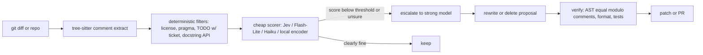

---
first_authored:
  by: "@claude-sonnet-5"
  at: 2026-09-19T12:00:00-07:00
task_list: cdocs/code-cleanup-llm
type: report
state: live
status: wip
tags: [research, code_quality, comments, linting, llm_review]
---

# Automatic LLM-driven code cleanup: landscape, cascade design, and prototype shortlist

> BLUF: Trellis ([jayminwest/trellis](https://github.com/jayminwest/trellis)) is a deterministic, no-model TypeScript structural audit (complexity, duplication, import cycles), not a comment or LLM tool; only its `trellis guide cleanup` agent prompt and baseline/compare/policy pattern are reusable.
> "Jev" is real, not a mis-transcription: a "System One" decision model from TypeSafe (early access 2026-09-15, $0.042/M input tokens, free output, decisions only, no generation), and Ray Amjad's video is dated 2026-09-18.
> The cheap-classifier-to-strong-rewriter cascade is well supported for comments (the ~$0.57/codebase figure reproduces under stated assumptions), but the "10x token reduction" review claim is an agent-generated estimate, and the model's own launch critics call diff-review use noisy.
> Mature building blocks exist for every guardrail (tree-sitter, AST-equality, ERA001/S125, drift detectors); what is missing is a repo-convention "why not what" comment style checker, which is a cheap, high-value first prototype for clauthier.

## Context / Background

Goal: survey automatic LLM-driven code cleanup, especially comment culling, plus qualitative linters, smell detection, and cheap-pass PR pre-filtering.
Seeds: the Trellis repo and a talk by Ray Amjad on a fast "system one" model.
Repo context: clauthier's CLAUDE.md and cdocs writing conventions already state "Explain WHY, not just WHAT" (`plugins/cdocs/rules/writing-conventions.md`), which is a machine-checkable comment-style rule in principle.
Dates are absolute; today is 2026-09-19.
Claims are marked `[verified]` (primary source read or API queried), `[secondary]` (blog/aggregator only), or `[unverified]`.

## Seed 1: Trellis

Verified via `gh api` and file reads on 2026-09-19.

- **What it is**: "Deterministic, offline-by-default sloppiness audit for TypeScript/TSX workspaces" (its CLAUDE.md). Parses with the TS compiler API; emits a 0-100 "sloppiness index" (lower is better) from complexity, structural erosion, duplication (including renamed-identifier clones), import cycles; separate non-scoring "safeguards" inspection (hooks/check wiring). [verified]
- **No model calls by design**: SPEC invariant "no-model execution on every audit path"; CLAUDE.md notes a deterministic pivot that retired an earlier LLM "readiness"/rubric assessment (legacy internals remain in `rubric/`, `detectors/`). [verified]
- **Comments**: nothing on comments, docstrings, or naming. Not a comment cleaner. [verified: no comment metric in README/architecture listing]
- **Maturity**: created 2026-06-07; v0.2.1 (`@os-eco/trellis-cli`); 31 stars, 2 forks, MIT; ~178 commits, last push 2026-09-18; 126 commits by one human plus 48 by a bot (`warren-run-bot`); Bun-only, install from source; extensive tests, SPEC.md, CI. Part of a small author ecosystem (mulch 334 stars, seeds 132 stars). [verified]
- **Optional providers**: pinned local tools (Knip for dead code, jscpd for clones) contribute unscored "evidence"; recently integrated (2026-09-18 commits). [verified]
- **Reusable ideas**:
  - `trellis guide cleanup` ([src/guides/cleanup.ts](https://github.com/jayminwest/trellis/blob/main/src/guides/cleanup.ts)): a well-written agent cleanup workflow (baseline, one bounded change, verify, compare, stop when unjustified, "do not game the metric"). Cheap to adapt as a skill prompt.
  - Baseline JSON + `compare` + declarative policy (`maxIndex`, `regression.maxIncrease`, `failOnNew`) with exit codes 0/1/2: a good template for a comment-quality ratchet in CI.
  - Anti-gaming rules (no suppressing or reclassifying to hide debt) apply directly to comment-cleanup agents.
- **Verdict**: adjacent inspiration and a deterministic complement (dead code/duplication side), not a comment tool. Do not depend on it (Bun-only, 0.x, single maintainer).

## Seed 2: the "system one" model and talk

- **Identification**: Jev by TypeSafe (founders include Diogo Almeida, Sasha Sheng, Erik Gafni per [RuntimeWire](https://runtimewire.com/article/typesafe-jev-system-one-ai-model-early-access)). Early access via waitlist from 2026-09-15 ([Latent Space AINews](https://www.latent.space/p/ainews-jev-a-system-one-model-that)). [secondary; TypeSafe primary docs at docs.typesafe.ai not read]
- **Talk**: Ray Amjad, YouTube, published 2026-09-18, summarized in [Jev + Claude Code: A Faster Agentic Coding Review Loop](https://www.ai.joaoqueiros.com/blog/jev-claude-code-agentic-coding-review-loop-ray-amjad). I did not watch or transcribe the video; the use-case list below relies on that write-up plus the user's summary. [secondary]
- **Model facts** [secondary, vendor claims, no independent validation per RuntimeWire]:
  - Decisions only: typed Choice (up to 255 options), Score, and yes/no probability ("Null" primitive); cannot generate prose, code, or reason.
  - $42 per billion input tokens ($0.042/M), output free ([MindStudio](https://www.mindstudio.ai/blog/jev-system-one-model-classification)); latency 70-500 ms ([RuntimeWire](https://runtimewire.com/article/typesafe-jev-system-one-ai-model-early-access)); claimed 40-400x cheaper, 20-200x faster than small frontier LLMs.
  - Forced-choice failure mode: without an "other" option it picked "sales" at confidence 0.31; always include an escape option ([MindStudio](https://www.mindstudio.ai/blog/jev-system-one-model-classification)).
  - 32k context window per [BiGGo summary of Theo Browne](https://finance.biggo.com/news/7c062f09b308f845) (MindStudio does not state one).
- **Talk claims vs. evidence**:
  - "150 comments assessed in 9.3 seconds for about one cent", "~57 cents to scan remaining comments", "$1.19 for a full code-smell pass" [secondary]. These reproduce: 1 cent / 150 = $6.7e-5 per comment, about 1,600 input tokens each at $0.042/M (comment plus surrounding code plus rubric), times ~8,500 comments = $0.57. So the number is a small repo (roughly 8-9k comments), not a large one.
  - "10x token reduction" for review: the write-up states it was "an agent-generated estimate in the video, not a measured end-to-end saving". [secondary] Treat as unverified.
  - Caveats in the same write-up: cannot certify software, security findings need independent validation, high probabilities are not guarantees, measure on held-out sets first.
- **Counter-view**: Theo Browne (per [BiGGo summary](https://finance.biggo.com/news/7c062f09b308f845), secondary) says using Jev for code-review/complexity flagging "produces noise" that forces expensive re-review, and that judging outputs of reasoning models with a non-reasoning model is a misuse. Comment triage (local, bounded, low-stakes) is a better fit than review of diffs.
- **Substitutability**: the pattern needs only a cheap calibrated scorer. Alternatives: Gemini 3.5 Flash-Lite ($0.30/M in, $2.50/M out per the sibling report `cdocs/reports/2026-09-17-delegate-model-comparison.md`), Claude Haiku via `model: haiku` subagents, or a fine-tuned local encoder (see Atlassian below). Jev's edge is price and calibrated scores, at the cost of vendor lock, waitlist, and non-Claude integration (the `model:` field in Claude Code is Anthropic-locked per the sibling report).

## Landscape table

Stars/last-push via `gh api` on 2026-09-19 where a repo exists. Cost column: rough order of magnitude.

| Item | Category | Mechanism | Maturity | Cost | Integration | Notes |
|---|---|---|---|---|---|---|
| [pr-review-toolkit `comment-analyzer`](https://github.com/anthropics/claude-plugins-official/tree/main/plugins/pr-review-toolkit) | CC comment agent | LLM subagent checks accuracy, completeness, long-term value ("why not what"), lists "Recommended Removals"; advisory, no edits, inherits model | shipped (official plugins repo, 36.5k stars) | model tokens per invocation | CC plugin, manual/proactive | Closest existing prompt to the target; no cheap pre-filter, no verification of edits |
| [`code-simplifier`, `code-review`](https://github.com/anthropics/claude-plugins-official/tree/main/plugins) plugins; built-in `/simplify`, `/code-review` skills | CC cleanup | LLM reviews changed code for reuse/simplification, applies fixes | shipped | tokens | CC skills | Scope is diff-level quality, not comment policy |
| "deslop" family ([brianlovin/claude-config](https://lobehub.com/skills/brianlovin-claude-config-deslop) 371 stars, plus many mcpmarket variants) | CC slop cleanup | Skill prompts scan branch diff for obvious comments, defensive checks, `any`, stray PLAN.md | open-source-working (quality varies; marketplace listings are `[secondary]`) | tokens | CC skill, some claim pre-commit | Diff-scoped; no eval, no AST guardrail known |
| [Claude Code Review (managed)](https://codeant.ai/blogs/anthropic-claude-code-review) | AI review | Multi-agent PR review, GitHub only, Team/Enterprise | shipped 2026-03-09 | $15-25 per review, ~20 min [secondary] | GitHub app | "<1% false positives" is a vendor claim [unverified] |
| [claude-code-action](https://github.com/anthropics/claude-code-action) | CI review | Runs Claude on PR events | shipped, 8.9k stars, pushed 2026-09-19 | tokens | GitHub Action | DIY host for a cascade |
| [claude-code-security-review](https://github.com/anthropics/claude-code-security-review) | CI review | LLM security scan on PR diff | shipped, 6.2k stars, last push 2026-02-11 | tokens | Action | Stale-ish |
| CodeRabbit, Greptile, Qodo, Cursor Bugbot, Copilot review, Sourcery | AI review SaaS | LLM review with repo indexing, filters, learned preferences | shipped | per-seat | GitHub/GitLab apps | Benchmarks conflict (see below) |
| [qodo-ai/pr-agent](https://github.com/qodo-ai/pr-agent) | AI review OSS | Self-hostable PR agent, `/review`, `/improve` | shipped, 13.1k stars, pushed 2026-09-19 | tokens | CLI/Action | Reusable prompts |
| [Atlassian Comment Ranker](https://www.atlassian.com/blog/atlassian-engineering/ml-classifier-improving-quality) (2025-08-25) | Cheap classifier cascade | ModernBERT fine-tuned on 53k+ review comments, label = "did author change code on that line"; threshold on propensity | shipped internally; blog only | negligible inference | Post-filter on LLM review output | Best public precedent of cheap-classifier-in-front-of-LLM; 40-45% code-resolution rate vs ~45% human; -30% PR cycle time [secondary vendor claims] |
| [Semgrep Assistant](https://semgrep.dev/blog/2025/announcing-ai-noise-filtering-and-triage-memories/); [SAST-Genius](https://arxiv.org/pdf/2509.15433) | Static + LLM hybrid | Deterministic rule finds candidates (recall), LLM triages (precision); triage "memories" | shipped / research (precision 35.7% to 89.5%, 225 to 20 FPs, one paper) | LLM only on findings | Semgrep CI | Direct model for "deterministic candidate then LLM verdict" |
| [ast-grep](https://github.com/ast-grep/ast-grep) 16.0k stars; [semgrep](https://github.com/semgrep/semgrep) 16.7k; [comby](https://github.com/comby-tools/comby) 2.7k (last push 2026-06-08) | Structural search/rewrite | Pattern queries over ASTs; feed matches to LLM or apply codemods | shipped | free | CLI, hooks | Good candidate generators for smell/PII-in-logs checks |
| [tree-sitter](https://github.com/tree-sitter/tree-sitter) 27.0k | Parsing | Language-agnostic comment node extraction | shipped | free | Library | Basis of a deterministic comment extractor |
| Ruff `ERA001`, `eslint-plugin-sonarjs` S125 ([SonarJS](https://github.com/SonarSource/SonarJS) 1.3k) | Commented-out code | Heuristic "does this comment parse as code" | shipped | free | Lint | Known false positives and autofix removing valid comments ([ruff #4845](https://github.com/astral-sh/ruff/issues/4845), [#6100](https://github.com/astral-sh/ruff/issues/6100)) |
| [`unicorn/expiring-todo-comments`](https://github.com/sindresorhus/eslint-plugin-unicorn/blob/main/docs/rules/expiring-todo-comments.md), ESLint `no-warning-comments` | TODO aging | Date/version/dependency conditions in TODOs; fails lint when met | shipped | free | ESLint | Fails on date can annoy ([#1541](https://github.com/sindresorhus/eslint-plugin-unicorn/issues/1541)) |
| eslint-plugin-jsdoc, pydoclint/darglint | Docstring vs signature | Deterministic param/return name checks | shipped | free | Lint | Cover signature drift, not semantic drift |
| [hammas159/docstring-drift](https://github.com/hammas159/docstring-drift) (0 stars, 2026-09-19), [sunnydachs/doc-drift](https://github.com/sunnydachs/doc-drift) (1 star), docvet, pystaleds | Docstring drift | AST diff, git-blame staleness, markdown-example drift | open-source-working, tiny/new | free | CI | Individually unproven; ideas rather than dependencies |
| [Knip](https://github.com/webpro-nl/knip) 12.3k, [Vulture](https://github.com/jendrikseipp/vulture) 4.8k, [Infer](https://github.com/facebook/infer) 15.7k, [PMD](https://github.com/pmd/pmd) 5.5k, [Lizard](https://github.com/terryyin/lizard) 2.5k | Dead code / smells / complexity | Static analysis | shipped | free | Lint/CI | Deterministic first pass before any LLM |
| [Danger JS](https://github.com/danger/danger-js) 5.5k (pushed 2026-08-28) | PR rules | Scripted PR checks, can call LLMs | shipped | free + tokens | CI | Host for diff-scoped checks |
| [CASCADE](https://arxiv.org/abs/2604.19400) (FSE 2026) | Code-doc inconsistency | LLM generates tests from doc and code from doc; flag only if original code fails tests while doc-generated code passes | research-prototype: 71 inconsistent / 814 consistent pairs; 13 new real inconsistencies found, 10 fixed | 2 LLM calls plus execution per item | Java/C#/Rust | Excellent precision design; expensive |
| [Detecting Code Comment Inconsistencies using LLM and Program Analysis](https://dl.acm.org/doi/10.1145/3663529.3664458) (FSE '24 companion); [C4RLLaMA](https://github.com/aiopsplus/C4RLLaMA) (7 stars, last push 2025-03) | Comment-code inconsistency | LLM extracts constraints from comments, program analysis checks; fine-tuned LLaMA detect + rectify | research-prototype | n/a | Paper artifacts | Java-centric |
| [DeepJIT / JITDATA](https://arxiv.org/abs/2010.01625) (AAAI 2021) | Just-in-time inconsistency | Model correlates comment with code change; dataset mined from history | research; labels heuristic and noisy | n/a | Dataset | Noted for label noise in later work |
| [LLMCup](https://arxiv.org/pdf/2507.08671), [structured-diff comment updating](https://arxiv.org/pdf/2512.19883) | Comment update | Generate updated comment from code edit | research | n/a | Papers | Rewrite half of cascade |
| [CodeFuse-CommitEval](https://arxiv.org/pdf/2511.19875) | Message vs diff inconsistency | Benchmark for LLM detection | research benchmark | n/a | Dataset | Adjacent (commit messages) |
| [Comment classification (FIRE IRSE)](https://arxiv.org/pdf/2310.10275), [redundant comment detection](https://arxiv.org/pdf/1806.04616), [GenAI comment-quality assessment](https://arxiv.org/pdf/2410.22323) | Comment quality | Useful/not-useful classifiers, ChatGPT-augmented labels | research; small labeled sets | n/a | Datasets | Label schemas usable as a starting taxonomy; C/C++-heavy, small |
| [Tenki](https://tenki.cloud/benchmarks/code-reviewer), [Martian Code Review Bench](https://entelligence.ai/code-review-benchmark-2026) etc. | Review benchmarks | Real-bug PR sets | vendor-run (`[secondary]`) | n/a | n/a | No standard benchmark; Greptile 82% catch vs CodeRabbit 44% (Greptile-run, July 2025), while others rank CodeRabbit/Qodo first on F1/precision; no FP counts in some |

## Design patterns

### Cascade: cheap classifier, strong rewriter

- The cheap stage must be tuned for recall on "bad", since the strong stage restores precision (the Semgrep and Atlassian pattern). Optimize threshold on a labeled set, not by feel.
- Always include a `keep/unsure` escape option (Jev's forced-choice failure shows why); route `unsure` upward.
- Multi-label taxonomy beats binary: `restates-code`, `stale/inaccurate`, `commented-out-code`, `narrates-change` ("added", "now", "fix for"), `orphan-TODO`, `ok-why`, `ok-contract`.
- Strong stage decides delete vs rewrite; prefer delete for `restates-code`. Deleting a wrong-but-harmless comment is cheaper than an inaccurate rewrite.
- Theo Browne's critique applies when the cheap stage judges hard semantics (complexity, correctness); scope the cheap stage to local, bounded questions.

### Precision, recall, and false-positive economics

- Cost of a false positive (FP) in automated deletion: a human re-adds a useful comment; in review flagging: reviewer attention plus escalation tokens. Cost of a false negative: the comment survives to the next run.
- Because the pass is repeatable and cheap, bias toward precision on deletion (auto-apply only high-confidence) and toward recall on escalation (cheap stage flags generously). Two thresholds, not one.
- Rough break-even for escalation: cheap-stage flag rate `f` costs `f * c_strong` per item; escalation is worth it while `f * c_strong < c_review_human * (1 - precision_gain)`. Numbers are project-specific; measure `f` on 200 labeled items first.
- Atlassian's evidence: a classifier trained on resolution outcomes held performance across generator-model swaps (GPT-4o to Claude Sonnet) [secondary vendor claim].

### Evaluating a comment-quality classifier

- **Hand-labeled seed**: 200-300 comments sampled across kinds, dual-labeled, using the taxonomy above; report per-class precision/recall and a calibration curve if the model outputs probabilities.
- **Mining from git history** (weak labels; noisy, cf. JITDATA label noise):
  - Positive "bad": comments deleted in a commit whose diff touches only that comment (or message says "remove obvious comment"/"cleanup"/"stale").
  - Positive "stale": comment unchanged while the adjacent code changed, then later edited by a comment-only commit (`git log -p -G` on comment lines; blame-based pairing).
  - Negative "good": comments that survive through many code-touching commits unedited and are longest-lived (survivorship bias noted).
  - Review-thread resolution: reviewer comments about a comment that led to a change (Atlassian's outcome-label idea).
- **Held-out repos**, not held-out lines, to avoid leakage; freeze a dataset per model version and store content hashes.
- **Agreement with strong model** as a proxy label only after human audit of a sample; otherwise circular.
- Public data (FIRE IRSE comment classification, JITDATA, C4RLLaMA data) is Java/C-centric and small; expect distribution shift to TS/Markdown-heavy repos.

### Deterministic pre-filters and guardrails

- **Extraction**: tree-sitter (or the TS compiler API) to get comment nodes with attachment (leading/trailing, enclosing symbol), so the model sees the comment plus its target code, not raw file slices.
- **Skip lists** before any model call: pragma/directive comments (`eslint-disable`, `noqa`, `@ts-`, `# type:`), license headers, `TODO(owner/ticket)` with a live ticket, public-API doc comments consumed by generators, `BLUF/NOTE(...)/WARN(...)` callouts (this repo's convention).
- **Comment-only diff verification** (the key safety property): after the strong stage edits, parse before and after; require identical AST with comment nodes stripped (or identical token stream ignoring comments and whitespace). Reject and revert any hunk that fails. Special-case languages where comments are semantic (Python type comments, JSX pragma, shebangs, `//go:build`, Rust doc attributes, string-literal docstrings that are runtime-visible).
- **Format/test gating**: run the formatter and existing tests only as a smoke check; with an AST-equality proof, tests are redundant for correctness but catch docstring-as-runtime cases.
- **Anti-gaming**: as in Trellis's guide, do not suppress or reclassify to reduce the flagged count.

### Diff-scoped vs whole-repo, caching

- Default to diff-scoped (comments in changed hunks plus comments attached to changed symbols) for hooks and PRs: bounded cost and reviewable. Whole-repo runs as a one-off backlog sweep, in batches, opening reviewable PRs per directory.
- Cache verdicts keyed by `sha256(comment text + attached code text + rubric version + model id)`; storing this in-repo (like a lockfile) makes reruns near-free and CI deterministic. Invalidate on rubric or model change.
- Stale-comment detection must key on the attached code's hash changing while the comment hash does not.

### Cost math (assumptions stated)

Assumptions: repo of ~100k LOC with ~8,500 comments; ~1,600 input tokens per cheap-stage item (comment, enclosing function, rubric; back-computed from the talk's 1 cent per 150 comments); 20% escalated; strong-stage item ~1,500 input and ~200 output tokens. Prices: Jev $0.042/M input, free output [secondary]; Gemini 3.5 Flash-Lite $0.30/$2.50 per M (sibling report, verified 2026-09-18); Claude Haiku assumed ~$1/$5 and Sonnet ~$3/$15 per M (list-price assumptions, `[unverified]`, check current pricing; batch discounts ignored).

| Stage | Tokens | Jev | Flash-Lite | Haiku (assumed) |
|---|---|---|---|---|
| Cheap scan, 8,500 x 1,600 in | 13.6M in, 0 out | ~$0.57 | ~$4.1 (plus output for short label, negligible) | ~$13.6 |
| Escalate 1,700 x (1,500 in, 200 out) | 2.55M in, 0.34M out | n/a (not a generator) | ~$1.6 | ~$4.3 (Sonnet ~$12.7) |
| Whole-repo total, cheap scan plus Haiku rewrite | | ~$5 | ~$6 | ~$18 |
| Strong-only baseline: Sonnet on all 8,500 (1,600 in, 200 out) | 13.6M in, 1.7M out | | | ~$66 |

Reading: the classifier cascade saves roughly 4-13x versus running a strong model on everything, but absolute dollars are small at every price point; engineering and review time, not tokens, dominate. The 10x-token-reduction review claim cannot be assessed from this arithmetic, since PR review escalation rates and diff context sizes are unknown (`[unverified]`).

## Design ideas and maturity

Maturity scale: `shipped-product` / `open-source-working` / `research-prototype` / `concept-only (unstarted)`. Effort S/M/L is for a prototype in this repo. Evidence is from the landscape above; "concept-only" means no tool found in this survey's searches, not proof none exists.

| # | Idea | Maturity | Evidence | Effort | Value / risk |
|---|---|---|---|---|---|
| 1 | Garbage-comment classifier then LLM rewrite/delete | open-source-working (skills) / research | deslop-style skills exist without evals; comment-quality papers; talk's demo of cascade [secondary] | M | High value on AI-generated code; risk: deleting useful "why" |
| 2 | Comment STYLE corrector enforcing repo conventions (why-not-what, no history narration, sentence-per-line, callout format) | concept-only for repo-configurable rule sets; `comment-analyzer` covers generic "why not what" | comment-analyzer prompt (verified); no repo-rule-file-driven tool found | S | High and specific to clauthier (rules already written); risk: subjective |
| 3 | Stale-comment detection against code diffs in PRs | research-prototype (JITDATA, LLM+program analysis) plus `comment-analyzer` at shipped-prompt level | FSE '24, AAAI 2021, C4RLLaMA (7 stars) | M | Highest true-value signal; risk: FPs, needs diff pairing |
| 4 | Comment-to-test extraction (verify claims in comments/docstrings) | research-prototype | CASCADE (FSE 2026): 13 new inconsistencies, 10 fixed | L | Strong precision; expensive, language-specific |
| 5 | TODO aging | shipped-product | `unicorn/expiring-todo-comments` (deterministic) | S | Deterministic wins; LLM only to classify "is this TODO obsolete given the code" (concept-only) |
| 6 | Commented-out-code removal | shipped-product | Ruff ERA001, Sonar S125; known FP/autofix bugs (ruff #4845) | S | Use deterministic detector plus LLM confirm before delete |
| 7 | Docstring/signature drift | open-source-working | pydoclint/darglint, eslint-plugin-jsdoc; docstring-drift (0 stars), docvet, pystaleds | S | Deterministic covers structure; semantic drift is idea #3 |
| 8 | Naming-vs-behavior linter (does `getX` mutate?) | concept-only (research on identifier-behavior inconsistency exists but no product found here) | talk's qualitative-linter example [secondary] | M | Medium-high; FP-prone, needs eval |
| 9 | PII/secrets-in-logs semantic linter | open-source-working (Semgrep rules, taint) plus LLM triage shipped | Semgrep Assistant, SAST-Genius | M | Use ast-grep to find log calls, LLM to judge argument sensitivity; must be validated independently per the talk's own caveat |
| 10 | Magic-number extractor | open-source-working | PMD, ESLint `no-magic-numbers` | S | LLM only for naming the constant |
| 11 | Decision-record linkage checks (comment/TODO references an existing cdoc/ADR/ticket) | concept-only | none found | S | Deterministic (regex + file exists); fits cdocs |
| 12 | Review-comment resolution learning loop (train ranker on "did author change code") | shipped-product (Atlassian, internal) | Atlassian blog 2025-08-25 | L | High leverage at volume; needs data clauthier lacks |
| 13 | Cheap-pass PR pre-filter (hundreds of tiny checks, escalate suspicious) | shipped-product for SAST triage, concept/research for general review | Semgrep Assistant; Browne critique; 10x claim unverified | L | Risky per critique; scope to narrow checks |
| 14 | Content-hash verdict cache committed to repo | concept-only for comments (generic build caches exist) | none found | S | Makes CI cheap and deterministic |
| 15 | Comment-only-diff verifier (AST equality modulo comments) as reusable guard | concept-only as a packaged tool (trivial per language with tree-sitter) | tree-sitter 27.0k stars | S | Foundation for every auto-edit |

## Prioritized shortlist for clauthier

1. **Comment-only diff verifier (idea 15) plus content-hash cache (14).** Small script under `plugins/cdocs/scripts/` using tree-sitter (or TS compiler API for the repo's `.ts` hooks). Everything else depends on it. Plug in: called by the skill below and usable from a `PostToolUse` hook on `Edit|Write` to warn when a "cleanup" edit changed non-comment tokens.
2. **`/cdocs:comment-audit` skill: repo-rule "why not what" style corrector (idea 2) with a Haiku-tier subagent, diff-scoped.** Rubric sourced from `writing-conventions.md` (why-not-what, no history-narration, callout format), taxonomy labels above, escape label `unsure`, strong-model rewrite only for flagged items, verifier from #1 gates every hunk. Plug in: user-invoked skill; optional advisory `Stop` hook that runs it on files changed in the session (report-only, no auto-edit, consistent with the existing hook set in `plugins/cdocs/hooks/hooks.json`). Compare against `comment-analyzer` as the baseline.
3. **Mined labeled eval set from this repo's git history plus a stale-comment-in-diff check (ideas 3, evaluation section).** Build 100-200 labeled comments from deletions/edits in history and hand-audit; measure the skill in #2 (and any cheap scorer such as Jev, Flash-Lite, Haiku) against it before enabling auto-apply. Plug in: CI job (claude-code-action or a script) on PRs, diff-scoped, comment-only advisory annotations.

Not first: CASCADE-style test extraction (L, language-specific), PII linter (needs independent validation), review-learning loop (needs volume), and the Jev integration itself (early access waitlist, non-Claude, vendor claims unvalidated). Reconsider Jev after a measured pilot against the eval set from item 3.

## Recommendations and open questions

- Treat the talk's numbers as directionally plausible for comments and unproven for review; the vendor's evals lack independent validation (RuntimeWire).
- Gate any auto-apply behind the verifier and a high threshold; ship report-only first.
- Open: TypeSafe primary docs (context limit, MCP/API surface, rate limits); actual current Haiku/Sonnet prices; whether tree-sitter or the TS compiler is the better verifier base for a mixed Markdown/TS/shell repo; the video itself was not viewed.
- NOTE(claude-sonnet-5/cdocs/code-cleanup-llm): star counts and push dates are point-in-time (2026-09-19); benchmark numbers for AI review tools come from vendor-run or aggregator pages and conflict, so none are used for recommendations.
