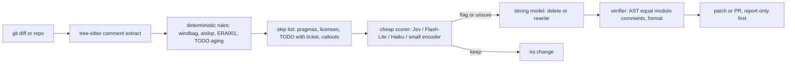

---
first_authored:
  by: "@claude-sonnet-5"
  at: 2026-09-19T12:00:00-07:00
task_list: cdocs/code-cleanup-llm
type: report
state: live
status: wip
tags: [research, code_quality, comments, linting, llm_review]
---

# Automatic LLM-driven code cleanup: landscape, battle-tested evidence, and adopt-first shortlist

> BLUF: A working ecosystem already exists for comment cleanup, and most of it is deterministic, not LLM-based: windbag (narrating/history comments), aislop, uncomment (tree-sitter removal), housestyle, Vale, plus deslop/desloppify-style agent skills and Anthropic's own `comment-analyzer` and `code-simplifier` agents.
> Practitioner evidence converges on four points: models over-comment and ignore prose rules, so enforcement must live in linters and hooks; naive "clean up" prompts over-delete "why" comments (20% survival in one test); wrong comments hurt LLM comprehension far more than missing ones; and review bots convert only 36-73% of comments into changes.
> The cascade pattern (cheap scorer, strong rewriter, independent verifier) is validated by industrial precedents (Atlassian, Semgrep, Spotify, Google AutoCommenter), but no public comment-quality classifier with held-out TS evaluation exists.
> Recommendation: adopt windbag and uncomment first, adapt `comment-analyzer` plus a repo-rule rubric into a diff-scoped cdocs skill, and build only the missing pieces (a history-mined eval set and a comment-only diff verifier); treat Jev (TypeSafe, early access) as an optional pilot backend behind an existing Jev-based comment linter, not a dependency.

## Context / Background

Goal: survey automatic LLM-driven code cleanup, especially comment culling, plus qualitative linters, smell detection, and cheap-pass PR review pre-filtering.
The user's seeds (Trellis and a Ray Amjad talk on Jev) are two entries among many below; the survey was widened after a first pass over-weighted them.
Repo context: clauthier's cdocs rules already state "Explain WHY, not just WHAT" and "History-Agnostic Framing" (`plugins/cdocs/rules/writing-conventions.md`), which are machine-checkable comment and prose rules in principle.
Method: about 75 searches and fetches on 2026-09-19 across GitHub, engineering blogs, arXiv, vendor docs, and practitioner threads.
Evidence tags: `[verified]` primary source read or API queried; `[secondary]` blog, aggregator, or vendor claim; `[unverified]` could not be checked.
Maturity tiers: `shipped-product` / `open-source-working` / `research-prototype` / `concept-only (unstarted)`.
Stars and push dates are `gh api` values on 2026-09-19 unless noted.

## Landscape inventory

"Reusable" is a judgment for clauthier: High (adopt or adapt directly), Med (borrow ideas or components), Low (context only).

### A. Comment-specific tools

| Name | What it does | Mechanism | Maturity | Evidence | Reusable |
|---|---|---|---|---|---|
| [windbag](https://github.com/scale-venture-partners/windbag) | Pre-commit linter for comments that narrate a change: ticket IDs, "used to be", hedging, cross-file refs, verbose, obvious (restates next line). Py/JS/TS/HCL/Rust/Go/Java/SQL/YAML/HTML/MD comments | Deterministic (Rust binary, tree-sitter-style comment extraction) | open-source-working | 25 stars, MIT, created 2026-08-05, pushed 2026-09-18, PyPI wheels [verified] | High: rules map to the "history-agnostic" convention; covers code comments, not Markdown prose |
| [uncomment](https://github.com/Goldziher/uncomment) | Strips comments via tree-sitter AST, 306 languages, keeps TODO/FIXME, docs, lint directives; dry-run diffs | Deterministic | open-source-working | 124 stars, MIT, pushed 2026-09-18; brew/cargo/npm/pip [verified] | High: safe deletion executor for cull verdicts |
| [housestyle](https://github.com/mroops0111/housestyle) | Lints/reflows prose in comments and docstrings; delegates punctuation to Vale; `housestyle-hook` for Claude Code/Codex repairs mechanical issues silently, exits 2 when a human rewrite is needed | Deterministic (tree-sitter extraction) | open-source-working, tiny | 1 star, 31 commits, created 2026-08-24 [verified] | Med: hook contract (auto-fix vs escalate, exit 2) is the reusable idea |
| [Vale code-aware linting](https://vale.sh/features/code) | Lints prose inside comments/docstrings using tree-sitter for 14 languages, delimiter scan for others | Deterministic, rule packs | shipped-product | [vale-cli/vale](https://github.com/vale-cli/vale) 6.1k stars, pushed 2026-09-18 [verified] | Med: style rules as YAML; no semantic judgment |
| [commentlint (ari-becker)](https://github.com/ari-becker/commentlint) | Extracts comments with tree-sitter and asks TypeSafe.ai (Jev) yes/no quality questions; default rule "active voice"; custom rules are questions; pre-commit and GH Action | LLM (Jev API) over deterministic extraction | open-source-working, v0.1.0 | 1 star, MIT, pushed 2026-09-17 [verified] | High as a pilot harness: only public comment linter found that consumes a System One model |
| [commentlint (sourcehaven-bv)](https://github.com/sourcehaven-bv/commentlint) | Go comment linter: scope discipline ("a comment may only talk about the scope it is attached to"), restatements, commented-out code, workarounds missing a removal condition, cross-codebase duplicate-fact detection by shingling, dead doc links | Deterministic; explicitly rejects embeddings/LLM scoring | open-source-working, tiny | 0 stars, pushed 2026-09-04 [verified] | Med: rule ideas (removal-condition, duplicated facts) |
| [eslint-plugin-ai-guardrails](https://github.com/isaacnewton123/eslint-plugin-ai-guardrails) | `no-ai-obvious-comments` (density 20%, length, quality), `no-orphan-todos`, size limits | Heuristic ESLint rules | open-source-working, tiny | 4 stars, created 2026-05-11 [verified] | Low: density heuristics are crude |
| [flake8-comments](https://github.com/orsinium-labs/flake8-comments) | Reports redundant Python comments | Heuristic | open-source-working, stale | 11 stars, last push 2021 [verified] | Low |
| Ruff `ERA001`, Sonar `S125` ([SonarJS](https://github.com/SonarSource/SonarJS) 1.3k stars) | Commented-out code detection | Heuristic "parses as code" | shipped-product | Known FPs and autofix bugs: [ruff #4845](https://github.com/astral-sh/ruff/issues/4845), [#6100](https://github.com/astral-sh/ruff/issues/6100) [verified] | Med: use as candidate generator, confirm before delete |
| [unicorn `expiring-todo-comments`](https://github.com/sindresorhus/eslint-plugin-unicorn/blob/main/docs/rules/expiring-todo-comments.md), ESLint `no-warning-comments`, [godox](https://github.com/matoous/godox) (19 stars), [godot](https://github.com/tetafro/godot) (50) | TODO aging and comment form (end with period) | Deterministic | shipped-product | unicorn 5.2k stars, pushed 2026-09-19 [verified] | Med: TODO aging is a solved deterministic problem |
| [eslint-plugin-jsdoc](https://github.com/gajus/eslint-plugin-jsdoc), pydoclint/darglint, Clippy `doc_markdown` | Docstring vs signature checks | Deterministic | shipped-product | jsdoc plugin 1.2k stars, pushed 2026-09-19 [verified] | Med: signature drift only, not semantic |
| [DocChecker](https://github.com/FSoft-AI4Code/DocChecker) | Detects code-comment inconsistency; can generate replacement comments | Fine-tuned encoder-decoder (contrastive + classification + generation) | research-prototype, on PyPI | 15 stars, Apache-2.0, last push 2024-01; beats baselines on JIT dataset [secondary] | Low-Med: 10 languages, dated |
| [docstring-drift](https://github.com/hammas159/docstring-drift), [doc-drift](https://github.com/sunnydachs/doc-drift), pystaleds, docvet | AST-based docstring/param drift, markdown example drift | Deterministic | open-source-working, tiny | 0-5 stars; docstring-drift pushed 2026-09-19 [verified] | Low: ideas only |

### B. Skills, commands, agents, and rules for coding agents

| Name | What it does | Mechanism | Maturity | Evidence | Reusable |
|---|---|---|---|---|---|
| [`comment-analyzer` (pr-review-toolkit)](https://github.com/anthropics/claude-plugins-official/tree/main/plugins/pr-review-toolkit) | Checks comment accuracy, completeness, long-term value ("why not what"); outputs Critical Issues, Improvements, Recommended Removals, Positive Findings; advisory only | LLM subagent (inherits model) | shipped-product | Official plugins repo 36.5k stars, pushed 2026-09-18 [verified prompt read] | High: closest prompt to the target; lacks pre-filter and edit verification |
| [`code-simplifier` plugin](https://github.com/anthropics/claude-plugins-official/tree/main/plugins/code-simplifier) and built-in `/simplify` | Simplifies recently modified code preserving behavior; `/simplify` runs three parallel reviewers (reuse, quality, efficiency) on the diff and applies fixes | LLM agents | shipped-product | Anthropic-maintained; `/simplify` mechanics from [claudefa.st](https://claudefa.st/blog/guide/mechanics/simplify-batch-commands) [secondary] | Med: no comment policy; good diff-scoped pattern |
| [deslop family](https://github.com/brianlovin/claude-config) (brianlovin 371 stars), [dabit3/deslop](https://github.com/dabit3/deslop) (16, regex-based CLI with 0-100 score), [millionco/deslop-js](https://github.com/millionco/deslop-js) (59), [gabelul/slopbuster](https://github.com/gabelul/slopbuster) (38, 152 patterns) | Remove AI slop from branch diffs: obvious comments, defensive checks, `any`, stray plan files | Mostly LLM skill prompts; dabit3 is regex | open-source-working, uneven | Stars as listed [verified]; no published evals | Med: prompt sources to mine |
| [deslop-GPT](https://github.com/MrZoyo/deslop-GPT) | Deletion-first skill for test bloat, verification theater, speculative fallbacks; read-only by default, edits need explicit `apply`; requires independent evidence (callers, contracts) before deletion | LLM skill with authorization gate | open-source-working v0.3.2 | 131 stars, MIT, pushed 2026-09-04; authors state evals are "not held-out model-effect evidence" [verified] | Med-High: safety posture (audit default, evidence roots) |
| [desloppify](https://github.com/peteromallet/desloppify) | Scan, score, review, triage, fix loop: mechanical detectors (dead code, duplication, complexity) plus subjective LLM review (naming, abstraction, contract coherence); lenient vs strict scores designed to resist gaming; 29 languages; `update-skill claude` | Hybrid | open-source-working | 3.1k stars, 250 forks, pushed 2026-05-13; free for individuals/OSS, other commercial use priced; no incremental/diff-only scan [verified] | High as reference; Med to adopt (heavy, no diff scope) |
| [aislop](https://github.com/scanaislop/aislop) | 50+ rules, 10 languages: narrative and trivial comments, TODO stubs, dead/commented-out code, swallowed exceptions, unsafe casts; `fix --safe` removes narrative comments; `hook install` for agent edits; 0-100 score | Deterministic, "no LLM in the runtime path"; paid hosted tier | open-source-working | 634 stars, MIT, created 2026-03-06, pushed 2026-09-19; "82,000 downloads" is a vendor claim [secondary] | High: trial as post-edit hook |
| [slop-scan](https://github.com/modem-dev/slop-scan) | Deterministic JS/TS slop-pattern scan; normalized against a frozen baseline of mature OSS pinned before 2025-01-01; only comment rule is `placeholder-comments`, off by default | Deterministic | open-source-working | 315 stars, MIT, pushed 2026-09-14 [verified] | Med: baseline-cohort calibration idea |
| [shut-up-and-code](https://github.com/chl03ks/shut-up-and-code) | CC plugin skill "load-bearing comments only"; before/after examples for line and doc comments; loadable or session-injected | Prompt only | open-source-working, tiny | 12 stars, created 2026-08-12 [verified] | Med: wording to borrow; prose rule alone is unreliable (see evidence) |
| [motlin comment-cleanup skill](https://github.com/motlin/claude-code-plugins) | Checklist: sparse comments, remove commented-out code, no changelog-style comments, comments above not at line end | Prompt only | open-source-working | 18 stars, Apache-2.0; a reviewer notes it risks stripping `# noqa`/`# type: ignore` pragmas and deleting "why" comments and is silent on licenses/shebangs/docstrings [secondary, [LobeHub](https://market.lobehub.com/s/skills/motlin-claude-code-plugins-comment-cleanup)] | Low-Med |
| [fallow-skills](https://github.com/fallow-rs/fallow-skills) | Agent skills teaching agents to use fallow (see section E) | Prompt plus deterministic tool | open-source-working | 122 stars, MIT, pushed 2026-09-17 [verified] | Med: packaging pattern |
| Preservation rule for Cursor | One `.mdc` rule "preserve all existing code comments during refactoring, cleanup, and optimization" | Prompt | practitioner result | [DEV post](https://dev.to/nedcodes/cursor-deleted-all-the-comments-in-my-file-30ad): 20% survival on "clean up", 28% on "refactor", 100% (41/41) with rule; n small [secondary] | High: shows cull prompts need explicit keep-rules |
| Rule catalogs: [awesome-cursorrules](https://github.com/PatrickJS/awesome-cursorrules), [Aider conventions](https://github.com/Aider-AI/conventions), [awesome-claude-code](https://github.com/hesreallyhim/awesome-claude-code) | Rule/skill catalogs | Prompt libraries | shipped | 40.8k / 204 / 54.3k stars [verified] | Low: mining ground for wording |
| Copilot code review instructions | Reads `copilot-instructions.md`, path `.instructions.md`, skills, AGENTS.md, and (per changelog) REVIEW.md/CLAUDE.md; reads from PR head branch | LLM | shipped-product | [changelog 2026-07-17](https://github.blog/changelog/2026-07-17-copilot-code-review-customization-and-configurability-improvements/), [2026-06-12](https://github.blog/changelog/2026-06-12-copilot-code-review-new-configurations-and-controls/) [verified via search snippet] | Med: existing CLAUDE.md rules already reach Copilot review |

### C. Review bots and review-comment filters

| Name | What it does | Mechanism | Maturity | Evidence | Reusable |
|---|---|---|---|---|---|
| [CodeRabbit](https://www.coderabbit.ai/blog/coderabbit-tops-martian-code-review-benchmark) | PR review with NL path instructions and learnings | LLM plus context engineering | shipped-product | Martian online bench: F1 51.2%, recall 53.5%, precision 49.2% [vendor blog]; in-the-wild study: 36.4% accepted, 56.3% rejected over 31,073 comments ([arXiv:2607.03316](https://arxiv.org/abs/2607.03316)) | Med: NL rules are probabilistic, per vendor docs |
| [Greptile](https://www.greptile.com/docs/code-review/custom-standards) | Full-repo-indexed review, custom rules, learns from past comments | LLM | shipped-product | 82% catch rate in its own July 2025 benchmark; no FP counts published [secondary] | Low |
| [Qodo / PR-Agent](https://github.com/qodo-ai/pr-agent) | Self-hostable `/review`, `/improve`; Qodo 2.0 (Feb 2026) multi-agent with "Rule Miner" turning PR history into rules | LLM | shipped-product; OSS core | 13.1k stars, pushed 2026-09-19 [verified] | Med: Rule Miner is the review-learning-loop precedent |
| [Cursor Bugbot](https://cursor.com/blog/building-bugbot) | Agentic PR reviewer; v1 used 8 parallel passes with randomized diff order, majority vote, validator model, category filters | LLM, multi-pass voting | shipped-product | Resolution rate 52% to 70%+ over 40 experiments (2025-07 to 2026-01); >2M PRs/month [verified, vendor blog] | High: resolution-rate metric and voting design |
| Graphite Diamond | Low-noise reviewer; reported under 5% negative comments, 3.5% downvoted, but 6% catch in Greptile's benchmark | LLM | shipped-product | [secondary]; reported merging into Bugbot after Cursor acquired Graphite (2025-12) [secondary] | Low |
| Claude Code Review (managed), [claude-code-action](https://github.com/anthropics/claude-code-action) | Multi-agent PR review; Action runs Claude on PR events | LLM | shipped-product | Review: launched 2026-03-09, Team/Enterprise, $15-25 per review [secondary via [CodeAnt](https://codeant.ai/blogs/anthropic-claude-code-review)]; Action 8.9k stars [verified] | High: Action hosts DIY cascades |
| [Kodus](https://github.com/kodustech/kodus-ai) | OSS review: AST rule engine feeds context to LLM; natural-language "Kody Rules"; BYO model; auto-files debt issues | Hybrid | open-source-working | 1.4k stars, pushed 2026-09-19; AGPL per site [verified] | Med-High: closest OSS analogue to a rules-driven cascade |
| [Sourcery](https://docs.sourcery.ai/reviews/review-rules/), Ellipsis, Codacy AI Reviewer, DeepSource Autofix, Sonar AI CodeFix/AI Code Assurance | Commercial review/quality platforms; Sonar's AI quality gate: no new issues, 80% coverage, <=3% duplication | Rules plus LLM | shipped-product | DeepSource "<5% FP" is a vendor claim [unverified]; Sonar docs [verified] | Low |
| [Atlassian Comment Ranker](https://www.atlassian.com/blog/atlassian-engineering/ml-classifier-improving-quality) (2025-08-25) | Filters LLM review comments before posting | Fine-tuned ModernBERT on 53k+ comments; label = author changed code on that line | shipped (internal) | 40-45% code-resolution rate vs ~45% human; PR cycle time -30%; stable across generator swap GPT-4o to Claude Sonnet [vendor blog] | High as design precedent |
| [Google AutoCommenter](https://arxiv.org/html/2405.13565) | Flags coding-best-practice violations in review (C++/Java/Python/Go) | Fine-tuned T5X | shipped (internal) | GA 2023-10; 80% "useful" after refinement (from 54%); ~40% of comments resolved by code changes; 66% of top violations beyond static analysis; per-rule thresholds [verified paper] | High as design precedent |
| [reviewdog](https://github.com/reviewdog/reviewdog), [Danger JS](https://github.com/danger/danger-js) | Glue: turn linter output into PR annotations; scripted PR checks | Deterministic | shipped-product | 9.6k / 5.5k stars [verified] | High: CI plumbing |

### D. LLM plus static-analysis hybrids

| Name | What it does | Mechanism | Maturity | Evidence | Reusable |
|---|---|---|---|---|---|
| [Semgrep Assistant, Custom Workflows](https://semgrep.dev/blog/2026/introducing-semgrep-custom-workflows/) | Deterministic scan, AI triage of findings, "memories"; workflows mix deterministic and AI steps | Hybrid | shipped-product | Claims 95% user agreement, ~1 in 5 findings filtered [vendor, [blog](https://semgrep.dev/blog/2025/announcing-ai-noise-filtering-and-triage-memories/)] | Med: pattern, not tool |
| [SAST-Genius](https://arxiv.org/pdf/2509.15433) | Semgrep candidates, LLM triage | Hybrid | research-prototype | Precision 35.7% to 89.5%, 225 to 20 FPs (single paper) [secondary] | Med |
| [IRIS](https://github.com/iris-sast/iris) | LLM infers taint specs for CodeQL | Neurosymbolic | research-prototype | 428 stars, MIT; 55 vs CodeQL's 27 vulns on CWE-Bench-Java ([arXiv:2405.17238](https://arxiv.org/abs/2405.17238)) [secondary] | Low |
| [ast-grep](https://github.com/ast-grep/ast-grep), [semgrep](https://github.com/semgrep/semgrep), [comby](https://github.com/comby-tools/comby), [tree-sitter](https://github.com/tree-sitter/tree-sitter) | Structural search/rewrite; candidate generators | Deterministic | shipped-product | 16.0k / 16.7k / 2.7k (last push 2026-06-08) / 27.0k stars [verified] | High: candidate generation for smell, PII-in-logs checks |
| [promptfoo](https://github.com/promptfoo/promptfoo) | Assertions incl. `llm-rubric`, `classifier`; CI regression evals | Harness | shipped-product | 25.3k stars, MIT, pushed 2026-09-19 [verified] | High: eval harness for a comment classifier |
| [PII Guard](https://github.com/rpgeeganage/pII-guard) | LLM-based PII detection in logs | LLM | open-source-working, dormant | 114 stars, last push 2025-11-01 [verified] | Low: runtime logs, not code |

### E. Structural and health auditors

| Name | What it does | Mechanism | Maturity | Evidence | Reusable |
|---|---|---|---|---|---|
| [Trellis](https://github.com/jayminwest/trellis) | See "Seed 1" below | Deterministic | open-source-working, 0.x | 31 stars | Med |
| [fallow](https://github.com/fallow-rs/fallow) | Rust-native TS/JS: unused code, duplication, cycles, complexity, boundaries, health score; MCP server; SARIF for PR annotations; paid runtime layer | Deterministic | open-source-working (broad) | 4.6k stars, pushed 2026-09-19 [verified] | Med-High: dead-code/dup pass for TS |
| [Knip](https://github.com/webpro-nl/knip), [Vulture](https://github.com/jendrikseipp/vulture), [jscpd](https://github.com/kucherenko/jscpd), [PMD](https://github.com/pmd/pmd), [Lizard](https://github.com/terryyin/lizard), [FTA](https://github.com/sgb-io/fta), [Infer](https://github.com/facebook/infer) | Dead code, clones, complexity, analysis | Deterministic | shipped-product | 12.3k / 4.8k / 6.2k / 5.5k / 2.5k / 345 / 15.7k stars [verified] | Med: first pass before any LLM |
| [CodeScene](https://codescene.com/product/code-health), CodeClimate | Commercial Code Health / maintainability scoring; CodeScene whitepaper claims healthy code improves AI performance ("up to 15x fewer defects" is a vendor claim) | Deterministic metrics | shipped-product | [secondary] | Low |

### F. Large-scale change methodologies

| Name | What it does | Mechanism | Maturity | Evidence | Reusable |
|---|---|---|---|---|---|
| [Google LLM migrations (FSE 2025)](https://arxiv.org/abs/2504.09691) | Change-location discovery plus LLM edits plus automated checks and human review | Hybrid | shipped (internal), published | 39 migrations, 595 changes, 93,574 edits; 74.45% of changes LLM-generated; ~50% time saved [verified] | Med: discovery-then-edit-then-check shape |
| [Spotify Honk](https://engineering.atspotify.com/2025/12/feedback-loops-background-coding-agents-part-3) | Background agent on Fleet Management; verifiers the agent can call but not see inside; LLM judge for scope | Agentic plus deterministic verifiers | shipped (internal) | Judge vetoes ~25% of sessions, ~50% of those recover; 1,500+ merged PRs at time of part 1 [verified] | High: judge-for-scope and opaque verifiers |
| [Airbnb test migration](https://airbnb.tech/infrastructure/accelerating-large-scale-test-migration-with-llms/) | Per-file state machine with validation steps, retry loops with richer prompts | LLM plus deterministic steps | shipped (internal) | 3,500 files in ~6 weeks vs est. 1.5 years; 97% automated, most fixed within 10 attempts [secondary summaries] | Med: capped retry loops |
| [Uber Piranha](https://github.com/uber/piranha) | Stale feature-flag cleanup via source-to-source rules | Deterministic (LLM-inferred scripts in research) | shipped-product | 2.5k stars, pushed 2026-04-02 [verified] | Low |
| [Moderne / OpenRewrite](https://github.com/openrewrite/rewrite) | 10k+ deterministic type-aware recipes; LLM used to discover/compose recipes; Amazon Q Code Transformation builds on OpenRewrite | Deterministic core, AI orchestration | shipped-product | 3.7k stars, pushed 2026-09-19 [verified] | Low for comments; validates "LLM orchestrates, recipes edit" |
| Sourcegraph Batch Changes | Multi-repo change campaigns with PR tracking | Deterministic | shipped-product | [docs](https://sourcegraph.com/docs/batch-changes) | Low |

### G. Research and benchmarks

| Name | What it does | Mechanism | Maturity | Evidence | Reusable |
|---|---|---|---|---|---|
| [DeepJIT / JITDATA](https://arxiv.org/abs/2010.01625) | Just-in-time comment-code inconsistency from code changes; dataset mined by heuristics | Neural | research-prototype | AAAI 2021; artifact [repo](https://github.com/panthap2/deep-jit-inconsistency-detection) 23 stars; labels noisy per later work [secondary] | Med: mining recipe |
| [CCISolver / CCIBench](https://arxiv.org/abs/2506.20558) | End-to-end detect and repair; relabeled benchmark | Fine-tuned LLM | research-prototype | F1 89.54; repair success 0.6533 (human eval); under review [verified abstract] | Med |
| [Structured code diffs for inconsistency](https://arxiv.org/abs/2512.19883) (SANER 2026 short) | Encode edits as ordered replace/delete/add activities on CodeT5+ | Small fine-tuned model | research-prototype | Beats fine-tuned DeepSeek-Coder, CodeLlama, Qwen2.5-Coder by 4.18-10.94 F1 [verified abstract] | High as evidence: small specialized beats large |
| [CASCADE](https://arxiv.org/abs/2604.19400) (FSE 2026) | LLM writes tests from docs and code from docs; report only if original fails and regenerated passes | LLM plus execution | research-prototype | 71 inconsistent / 814 consistent pairs; 13 new real inconsistencies, 10 fixed [verified abstract] | Med: precision design |
| [TDCleaner](https://arxiv.org/abs/2108.05846) | Obsolete TODO detection from code changes and commit messages | Neural | research-prototype | Top-10k Python/Java repos; 9 of 18 reported TODOs confirmed and removed [verified abstract] | Med |
| [SATD repayment with LLMs](https://dl.acm.org/doi/abs/10.1145/3796704) | Evaluates LLMs repaying self-admitted debt | LLM | research | TOSEM; Llama-3.1-70B and GPT-4o-mini best [secondary]; 20-50% of SATD vanishes by incidental deletion per a study snippet [secondary] | Low-Med |
| [Impact of comments on LLM comprehension](https://arxiv.org/html/2506.11007) | Quiz accuracy with no/partial/wrong comments (IBM assembler, 4 LLMs) | Experiment | research | 84% without comments, 90% with; 20% wrong comments negligible; fully wrong 61% [verified abstract; single legacy module] | High: prioritize stale/wrong over obvious |
| [LLM code-review overcorrection](https://arxiv.org/html/2603.00539v1), [CodeJudgeBench](https://arxiv.org/pdf/2507.10535) | LLM-as-judge reliability for code | Experiments | research | Titles and summaries only [unverified detail] | Med |
| [Martian Code Review Bench](https://codereview.withmartian.com/) | Offline (50 PRs, 136 golden comments) plus online (developer fix behavior) benchmark; open dataset and judge prompts | Benchmark | shipped benchmark | Vendors each claim first place on different cuts [secondary] | Med: online "did author change code" label |
| [FrugalGPT](https://arxiv.org/abs/2305.05176), RouteLLM | Cascades and routers | Learned scorer (DistilBERT in FrugalGPT) | research, widely used | Up to 98% cost cut; 85% on MT Bench at 95% GPT-4 quality [secondary]; needs calibrated confidence | High: cascade theory |
| [Comment-quality classification](https://arxiv.org/pdf/2310.10275) (FIRE IRSE), [redundant comment detection](https://arxiv.org/pdf/1806.04616), [GenAI quality assessment](https://arxiv.org/pdf/2410.22323) | Useful/not-useful labeling, LLM-augmented labels | Classifiers | research | Small, C/C++-heavy labeled sets [secondary] | Low-Med: label taxonomies |
| [LLM code smell taxonomy](https://dl.acm.org/doi/10.1145/3786582.3786835) (ICSE 2026) | Smells specific to LLM-generated code | Static detectors | research | Detection precision 86.06% reported [secondary] | Med |
| [Exploratory study of LLM code and comments in repos](https://arxiv.org/abs/2607.01867) (JSS, accepted 2026-07) | Empirical 2021-2025 | Detectors | research | Comments show few grammatical sentences; LLM code has intra-repo clones [verified abstract] | Low |

### H. Practitioner write-ups and threads

| Name | What it reports | Evidence | Reusable |
|---|---|---|---|
| [claude-code #65961](https://github.com/anthropics/claude-code/issues/65961) (2026-06-07, open) | Verbose, chain-of-thought-leaking comments by default across Opus 4-8/5 and Sonnet 5; CLAUDE.md rules, memory entries, and hooks did not reliably stop it; users run secondary passes to clean | [verified issue] | High: motivates lint-enforced rules |
| [claude-code #61305](https://github.com/anthropics/claude-code/issues/61305) | Repeated zero-comment instructions ignored | [verified title via search] | Med |
| [HN: "Claude's code comments"](https://news.ycombinator.com/item?id=49078710) | Workarounds: lint rules blocking comments, "no narrative comments" in CLAUDE.md, hook reminding the agent to reconsider new comments; training-data hypothesis ("commenting like a tutorial") | [verified page summary] | Med |
| [HN: "Your LLMs get rid of comments? Mine add them incessantly"](https://news.ycombinator.com/item?id=45624429) | Keep intent and edge cases, remove narration; prompting to remove redundant comments works but is an extra step; comments waste token budget for LLM readers | [verified page summary] | Med |
| [Cursor forum thread](https://forum.cursor.com/t/how-to-tell-the-model-not-write-unnecessary-comments/105136) | Rules like "do not write comments to note that changes were made" work partially and inconsistently | [verified page summary] | Med |
| [model-browser #32](https://github.com/ConfusedSky/model-browser/issues/32) | Comment-cleanup pass over test suites: 8,644 of 54,377 lines are comments; rules (why not mechanics, no history, no stale measurements, keep invisible constraints), target ~14% share; verification by stripping comments and requiring byte-identical transpiled output; tests need distinct judgment because "why a test exists" is not derivable from assertions | [verified issue]; an earlier source pass reportedly cut comment lines 15,240 to 5,415 [secondary, search snippet] | High: verification recipe and test-comment caveat |
| Theo Browne on Jev ([summary](https://finance.biggo.com/news/7c062f09b308f845)) | Non-reasoning classifier is a misuse for judging reasoning outputs, compaction, and code review ("fast for dumb things"); flagging complexity generates noise | [secondary summary of a video] | Med |

## Battle-tested evidence

What practitioners and studies report, ordered by decision relevance.

### False positives and acceptance

- Review comments are accepted less than half the time: CodeRabbit 36.4% accepted / 7.3% discussed / 56.3% rejected over 31,073 comments in 239 repos ([arXiv:2607.03316](https://arxiv.org/abs/2607.03316)); a rejection predictor reached up to 76% F1 in the same study [verified abstract].
- Agent-generated review comments (Copilot, Cursor, Codex, Devin, Claude) over 342 Python repos: Copilot 72.9% resolved; top non-resolution reasons were "incorrect suggestions" and "intentional design decisions"; inline code suggestions raised acceptance ([arXiv:2607.21997](https://arxiv.org/abs/2607.21997)) [verified abstract].
- Bugbot's resolution rate rose from 52% to 70%+ only after 40 experiments including multi-pass voting and validators [verified, vendor blog].
- Google AutoCommenter reached 80% useful after refinement from 54%, with about 40% of comments producing code changes, and only 2-10% of comments receiving explicit feedback, so implicit outcome signals are needed [verified paper].
- Independent benchmarks disagree by vendor, and no standard exists: Greptile 82% catch (own benchmark) vs CodeRabbit 44%, while Martian's online bench puts CodeRabbit at 49.2% precision [secondary]. Vendor "under 1%" (Claude Code Review) and "under 5%" (DeepSource) false-positive figures are `[unverified]`.
- Natural-language review rules are probabilistic, per CodeRabbit's own docs summary; deterministic path filters are the reliable layer [secondary].

### Failure modes specific to comment cleanup

- Models delete valuable context when told to "clean up": 20% of comments survived "clean up" and 28% "refactor" in one Cursor test, including JIRA references and deprecation timelines; an explicit preservation rule gave 41/41 survival (n small, single author) [secondary].
- Models add comments reflexively and disregard rules: [claude-code #65961](https://github.com/anthropics/claude-code/issues/65961), HN, and Cursor forum agree; rules help partially.
- Test-suite comments encode why a test exists and mutation-testing findings; treat them separately ([model-browser #32](https://github.com/ConfusedSky/model-browser/issues/32)).
- Pragmas are semantic: stripping `# noqa`, `# type: ignore`, lint directives breaks tooling; ERA001/S125 autofix has removed valid comments ([ruff #4845](https://github.com/astral-sh/ruff/issues/4845)) [verified issue titles/summary].
- Forced-choice classifiers fabricate: Jev picked "sales" at confidence 0.31 when no "other" option existed [secondary, [MindStudio](https://www.mindstudio.ai/blog/jev-system-one-model-classification)].
- Automated fixers from a checklist-only skill miss categories (licenses, shebangs, docstrings, TODOs), per the LobeHub review of the motlin skill [secondary].
- Agents that fix scores instead of code: desloppify ships lenient/strict scores and wontfix penalties specifically to resist gaming; Trellis's guide forbids suppressing findings [verified].

### Cost

- Jev demo: 150 comments in 9.3 s for about one cent; ~57 cents to scan the rest and $1.19 for a smell pass [secondary write-up of the talk]. Reproduces at ~1,600 input tokens per comment and ~8,500 comments at $0.042/M.
- Claude Code Review averages $15-25 per PR and ~20 minutes [secondary]; a comment-only pass is orders of magnitude cheaper and should not use that path.
- Cascades save 40-98% in the literature depending on query skew; savings depend on the fraction that is easy [secondary].

### Value of the comments themselves

- Wrong comments degrade LLM code comprehension (fully wrong: 61% vs 84% with none), while missing comments cost a few points and 20% wrong is nearly harmless ([arXiv:2506.11007](https://arxiv.org/html/2506.11007), single legacy module) [verified abstract].
- Implication: rank stale/inaccurate comments above merely obvious ones; obvious-comment removal is hygiene and token savings, not a correctness win.

## Recurring methodologies

Patterns that appear in three or more independent sources unless noted.

1. **Deterministic first, LLM on the residue.** Semgrep Assistant, SAST-Genius, Kodus, desloppify, Moderne, Google migrations, windbag/aislop/uncomment (deterministic only). Candidate generation must have high recall; the LLM restores precision.
2. **Independent verifier the agent cannot game.** Spotify (agent calls verifiers without seeing internals), Airbnb (per-step validation), Google (automated checks before review), model-browser #32 (strip-comments byte-identity), desloppify (strict scores), Trellis (never counts its own checks).
3. **Scope judge or read-only default.** Spotify's judge vetoes ~25% of sessions for over-ambition; deslop-GPT is read-only until `apply`; `comment-analyzer` is advisory; uncomment and aislop offer dry-run.
4. **Outcome-labeled feedback, not opinion.** Atlassian (author changed the line), Bugbot resolution rate, Martian online bench, AutoCommenter resolved rate, Qodo Rule Miner.
5. **Precision over recall for anything shown to humans.** AutoCommenter, Atlassian, Diamond; deletion should be stricter still.
6. **Enforce with tooling, not prose.** claude-code #65961, HN workarounds (lint rules, reminder hooks), housestyle-hook (silent fix or exit 2), aislop `hook install`, Codex hooks.
7. **Diff-scoped by default.** `/simplify`, code-simplifier ("recently modified code"), windbag `--staged`, Copilot/Bugbot PR-level review; whole-repo sweeps are one-offs (desloppify explicitly lacks incremental mode, a stated gap).
8. **Multi-pass agreement or validator.** Bugbot 8-pass voting plus validator, CASCADE dual verification, Semgrep triage memories.
9. **Capped retry with richer context.** Airbnb (up to ~10 attempts), Spotify feedback loops.
10. **Ratchet against a baseline.** Trellis policy exit codes, slop-scan pre-2025 OSS cohort, desloppify scores.
11. **Suppression with a reason.** aislop-ignore, windbag/commentlint inline suppression; treat false positives as configuration, not bugs.
12. **Keep the why, drop the story.** shut-up-and-code, model-browser #32, HN, Cursor forum, comment-analyzer, this repo's own conventions.

## Seed 1: Trellis

Verified via `gh api` and file reads on 2026-09-19.

- Deterministic offline TypeScript structural audit: complexity, erosion, duplication (renamed-identifier clones), import cycles; 0-100 sloppiness index, baseline compare, policy exit codes (0 pass, 2 policy fail, 1 error).
- No model calls by design (SPEC invariant); an earlier LLM rubric was retired in a deterministic pivot. No comment or naming analysis.
- Maturity: created 2026-06-07, v0.2.1, 31 stars, MIT, ~178 commits (126 human, 48 bot), last push 2026-09-18, Bun-only from source.
- Reusable: [`trellis guide cleanup`](https://github.com/jayminwest/trellis/blob/main/src/guides/cleanup.ts) (bounded change, verify, compare, stop rules, anti-gaming) and the baseline/policy contract. Not a dependency candidate.

## Seed 2: Jev and the Ray Amjad talk

- Product: Jev by TypeSafe ("first System One model", named `jev-1.13` in docs), early access from 2026-09-15 ([Latent Space](https://www.latent.space/p/ainews-jev-a-system-one-model-that), [RuntimeWire](https://runtimewire.com/article/typesafe-jev-system-one-ai-model-early-access)).
- Primary docs ([docs.typesafe.ai](https://docs.typesafe.ai)) confirm three primitives: Choice, Score, and Noul (yes/no, returns 0-1), each with probabilities and confidence; multiple questions per call evaluated in parallel and independently; SDKs for Python and JavaScript; the docs acknowledge "jagged edges" for jev-1.13 [verified].
- Primary docs do not state pricing, context window, rate limits, latency, or MCP support (checked the docs root and `llms.txt`). Those remain secondary: $0.042/M input, free output; 70-500 ms; up to 255 choices; 32k context per a summary of Theo Browne's video [secondary; 32k unverified].
- Primary evals ([evals.typesafe.ai](https://evals.typesafe.ai)): four workflow tasks (security incidents, agent traces, invoices, customer service) with reference labels averaged from two frontier models; Jev and Luna workflows cost under $0.01 per case and Jev/Haiku 4.5 workflows run under 1 s; most accurate were larger models at 73-79%. No comment-quality or code-review task is evaluated [verified]. Vendor-run, not independent.
- Talk: Ray Amjad, YouTube, 2026-09-18, summarized by [this write-up](https://www.ai.joaoqueiros.com/blog/jev-claude-code-agentic-coding-review-loop-ray-amjad); I did not watch it. Use cases per the write-up: skill selection, comment triage, smell detection, diff review against acceptance criteria. The "10x token" figure is stated there to be an agent-generated estimate, not a measurement [secondary]. The talk's own caveats: cannot certify software, security findings need independent validation, measure on held-out sets first.
- Ecosystem signal: [ari-becker/commentlint](https://github.com/ari-becker/commentlint) already wires Jev into a tree-sitter comment linter (1 star, v0.1.0). Theo Browne's critique targets diff review, not bounded comment questions [secondary].
- Substitutes for the cheap stage: Gemini 3.5 Flash-Lite ($0.30/$2.50 per M), Gemini 2.5 Flash-Lite ($0.10/$0.40), GPT-5 nano ($0.05/$0.40), Claude Haiku 4.5 ($1/$5) per [price aggregators](https://tokencost.app/blog/deepseek-v4-flash-vs-haiku-nano-flash-lite) [secondary]; a fine-tuned small encoder (Atlassian, SANER 2026) is the non-LLM alternative. Claude Code's `model:` field is Anthropic-locked, so non-Claude models require a script or gateway (see `cdocs/reports/2026-09-17-delegate-model-comparison.md`).

## Design patterns

### Cascade

- Tune the cheap stage for recall on "bad" and the strong stage plus verifier for precision; use two thresholds (escalate, auto-apply).
- Always offer a `keep` or `unsure` label; route `unsure` upward.
- Multi-label taxonomy: `restates-code`, `stale-or-wrong`, `commented-out-code`, `narrates-change`, `orphan-todo`, `ok-why`, `ok-contract`.
- Prefer delete over rewrite for `restates-code`; rewrites of stale comments need the strong model and human review.
- Use the cheap scorer for local, bounded questions only (per the Browne critique and Jev's forced-choice failure).

### Evaluating a comment-quality classifier

- Hand-label 200-300 comments (dual-labeled) across kinds; report per-class precision/recall and calibration.
- Mine weak labels from git history (noisy, cf. JITDATA): comment-only deletion commits (bad), comment edited after adjacent code changed (stale), long-lived unedited comments (good, with survivorship bias), review threads about comments resolved by change (Atlassian/Martian-style outcome label).
- Split by repository, freeze per model version with content hashes, and run in promptfoo (`llm-rubric`, `classifier`) as a regression suite.
- Use the strong model's labels only after a human audit of a sample.
- Public sets (JITDATA, CCIBench, FIRE IRSE) are Java/C-centric; expect shift for TS/Markdown repos.

### Deterministic pre-filters and guardrails

- Extraction: tree-sitter (uncomment, Vale, windbag, commentlint all rely on it or equivalent).
- Skip lists: pragmas, directives, licenses, shebangs, `TODO(owner/ticket)`, generator-consumed doc comments, `BLUF/NOTE(...)/WARN(...)` callouts.
- Verification: parse before and after; require identical AST or token stream ignoring comments and whitespace; model-browser #32 uses byte-identical transpiled output. Special cases: Python type comments, `# noqa`, JSX pragmas, `//go:build`, runtime-visible docstrings.
- Cheap gates after edits: formatter, typecheck, tests as smoke checks.
- Anti-gaming: no suppressing or reclassifying to reduce counts (Trellis guide, desloppify).

### Diff-scoped vs whole-repo, caching

- Default diff-scoped (changed hunks plus comments attached to changed symbols); whole-repo as a batched backlog sweep with per-directory PRs.
- Cache verdicts by `sha256(comment + attached code + rubric version + model id)`, stored in-repo like a lockfile; stale-comment detection keys on attached-code hash changing while comment hash does not.

### Cost math (assumptions stated)

Assumptions: ~100k LOC, ~8,500 comments, ~1,600 input tokens per cheap-stage item (back-computed from the talk), 20% escalated at ~1,500 in / 200 out per item, no batch discounts. Prices per M tokens: Jev $0.042 in / free out; Flash-Lite 3.5 $0.30/$2.50; Haiku 4.5 $1/$5; Sonnet ~$3/$15 (assumed, unverified).

| Stage | Tokens | Jev | Flash-Lite 3.5 | Haiku 4.5 |
|---|---|---|---|---|
| Cheap scan | 13.6M in | ~$0.57 | ~$4.1 | ~$13.6 |
| Escalate 1,700 items | 2.55M in, 0.34M out | n/a | ~$1.6 | ~$4.3 (Sonnet ~$12.7) |
| Cheap scan plus Haiku rewrite | | ~$5 | ~$6 | ~$18 |
| Strong-only baseline: Sonnet on all 8,500 | 13.6M in, 1.7M out | | | ~$66 |

Cascades save roughly 4-13x against a strong-only pass, but absolute dollars are small; review time dominates. Escalation rates for PR review are unknown, so the talk's 10x review claim cannot be checked here.

## Design ideas and maturity

"Existing tools" cites the inventory; effort S/M/L is for a prototype in this repo.

| # | Idea | Maturity | Existing tools / evidence | Effort | Value / risk |
|---|---|---|---|---|---|
| 1 | Garbage-comment classifier then rewrite/delete | open-source-working (deslop skills, aislop deterministic); research for learned classifiers | aislop, deslop family, uncomment executor; Jev/commentlint pilot | M | High on agent-written code; risk: deleting "why" (see evidence) |
| 2 | Repo-convention comment style corrector (why-not-what, no history narration) | open-source-working for the history/narration part (windbag); concept-only for repo-rule-file-driven semantic checks | windbag, comment-analyzer, sourcehaven commentlint, housestyle | S | High, specific to clauthier; gap: Markdown prose is not covered by comment linters |
| 3 | Stale-comment detection against PR code diffs | research-prototype; prompt-level in comment-analyzer | DeepJIT, CCISolver, SANER 2026 small model, Google-style diffs | M | Highest true-value signal (wrong comments hurt most); risk: FPs |
| 4 | Comment-to-test extraction | research-prototype | CASCADE (FSE 2026) | L | Strong precision, high cost |
| 5 | TODO aging | shipped-product | unicorn `expiring-todo-comments`, godox, TDCleaner (research for obsolescence) | S | Deterministic covers most; LLM only for "obsolete given code" |
| 6 | Commented-out-code removal | shipped-product | ERA001, S125, aislop, commentlint (sourcehaven) | S | Confirm before delete (autofix bugs) |
| 7 | Docstring/signature drift | open-source-working | jsdoc plugin, pydoclint, docstring-drift, doc-drift | S | Structural only; semantic drift is idea 3 |
| 8 | Naming-vs-behavior qualitative linter | concept-only as product; desloppify has subjective naming review | desloppify | M | Medium; needs eval |
| 9 | PII/secrets-in-logs linter | open-source-working (Semgrep taint/secrets) plus LLM triage shipped | Semgrep Assistant, ast-grep candidates | M | Independent validation required per the talk's own caveat |
| 10 | Magic-number extraction | shipped-product (PMD, ESLint) | PMD, `no-magic-numbers` | S | LLM only to name constants |
| 11 | Decision-record linkage (comment/TODO references an existing cdoc) | concept-only | none found | S | Deterministic file-exists check; fits cdocs |
| 12 | Review-comment resolution learning loop | shipped-product (Atlassian, Qodo Rule Miner, Bugbot) | Atlassian ranker, Bugbot resolution rate | L | Needs volume clauthier lacks |
| 13 | Cheap-pass PR pre-filter | shipped for SAST triage; contested for general review | Semgrep Assistant; Theo Browne critique | L | Risky beyond narrow checks |
| 14 | Content-hash verdict cache in repo | concept-only for comments | generic build-cache practice | S | Makes CI cheap and deterministic |
| 15 | Comment-only-diff verifier (AST equality modulo comments) | concept-only as packaged tool; practiced ad hoc (model-browser #32) | tree-sitter; uncomment is AST-safe by construction | S | Foundation for any auto-edit |

## Prioritized shortlist for clauthier

Adopt-first ordering; build only what is missing.

| # | Item | Build vs adopt | How it plugs in | Effort |
|---|---|---|---|---|
| 1 | Run windbag on `plugins/**` and scripts (TS hooks, YAML, HTML comments) | Adopt | `PostToolUse` hook on `Edit\|Write` (per-file, warn) and CI check; report-only first, errors gate later | S |
| 2 | uncomment as the delete executor, dry-run diffs surfaced to the user | Adopt | Called by the skill in item 3; not automatic | S |
| 3 | `/cdocs:comment-audit` skill: adapt `comment-analyzer` prompt plus this repo's why-not-what and history-agnostic rules and shut-up-and-code's keep-rules; Haiku-tier subagent on changed hunks; `unsure` label; report first | Adapt | User-invoked skill; advisory `Stop` hook running it on session-changed files, using the housestyle-hook contract (silent mechanical fix, exit 2 to escalate) | M |
| 4 | Mined eval set from this repo's git history (comment-only deletions, stale-comment edits) plus a promptfoo regression suite | Build (no TS/Markdown set exists) | `plugins/cdocs/scripts/` or `cdocs/` fixtures; CI job | M |
| 5 | Comment-only diff verifier and content-hash cache | Build (small) | Library used by items 3 and 6; can be a `PostToolUse` guard when an edit labeled cleanup changes non-comment tokens | S |
| 6 | Pilot ari-becker/commentlint with Jev on the item-4 eval set to test the System One claim | Adopt (pilot only) | Local run or optional CI job; no dependency until measured | S |
| 7 | Stale-comment-in-diff check | Build on comment-analyzer prompt | CI on PRs via claude-code-action, diff-scoped | M |
| 8 | Trial aislop hook and fallow for dead-code/dup on the TS hooks | Adopt (trial) | `aislop hook install`; CI SARIF | S |

Not first: CASCADE-style test extraction (L), PII linter (needs independent validation), review-learning loop (volume), desloppify (heavy, no incremental mode), Trellis (Bun-only, TS structure only).
Gap to state plainly: cdocs content is mostly Markdown prose, and the comment linters above target code comments; prose rules such as history-agnostic framing are covered today only by `cdocs:nit_fix` and could be checked by Vale rule packs (deterministic) before considering an LLM.

## Recommendations and open questions

- Treat Jev's numbers as plausible for local comment scoring and unproven for diff review; TypeSafe's own evals do not include code tasks.
- Ship every auto-edit behind the verifier, an explicit keep-rule, and report-only defaults.
- Open: TypeSafe pricing/context on a primary page; Haiku/Sonnet current prices; whether tree-sitter comment extraction from windbag/uncomment is reusable as a library; actual FP rate of windbag/aislop on this repo (run both on `main` to measure); the video was not watched.
- NOTE(claude-sonnet-5/cdocs/code-cleanup-llm): stars, push dates, and benchmark figures are point-in-time (2026-09-19); many tools are weeks old (created 2026-03 to 2026-08) and unproven beyond their authors, so treat their star counts as attention, not validation.
