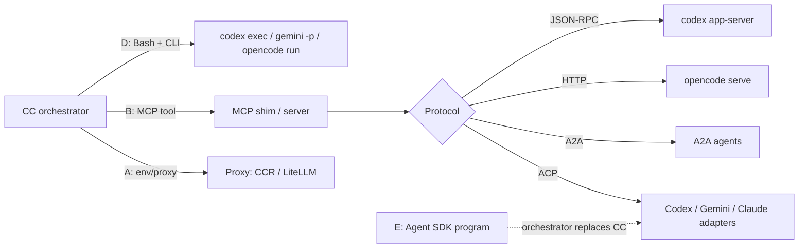

---
first_authored:
  by: "@claude-sonnet-5"
  at: 2026-09-19T12:00:00-07:00
task_list: cdocs/subagent-bridge-layers
type: report
state: live
status: wip
tags: [research, a2a, multi_provider, subagents, acp, mcp, survey, supplemental]
---

# Omni-harness bridge layers for delegating Claude Code subagent work to other models and harnesses: a survey

> BLUF: No single project gives Claude Code (CC) native, streamed, interruptible, permission-relaying delegation to other providers today: CC has no A2A or ACP client, so every option needs a thin MCP-server or CLI shim on the CC side.
> CC itself already covers half of problem (1): the `Agent` tool takes a per-invocation `model`, but **not** per-invocation `effort` (frontmatter-only; requests closed as duplicate/not_planned).
> The subscription constraint is real and enforced: Anthropic prohibits subscription OAuth in third-party products (Consumer Terms, enforced 2026-04-04), and does not support routing CC to non-Claude models through gateways.
> The safe direction is inverse: keep CC (unmodified) as orchestrator on the subscription, and delegate *out* to other providers using their own auth.
> Top 2: (1) an ACP-centered bridge (ACP adapters for Codex/Gemini/others, optionally exposed as A2A via a2acode-style translation) fronted by a thin MCP shim; (2) OpenCode server (`opencode serve`) as the multi-provider backend behind the same shim.
> Supplemental conclusions (see `## Supplemental: Top 2 vs native subagents`): a headless ACP client CLI, [acpx](https://github.com/openclaw/acpx), already exists, so candidate 1 needs a shim only for permission relay, not for basic streaming/steering/resume.
> CC's MCP client has no MCP Tasks (SEP-1686) support; async delegation must ride on CC's own auto-backgrounding of long MCP calls, Bash+Monitor, or research-preview channels.
> A **hybrid dominates both pure options**: native subagents (per-call `model`, static per-effort agent variants) for Claude tiers, bridge only for non-Claude targets.

## Context / Background

Constraints from the user:

- CC orchestrator under a Claude subscription.
- Subagent tasks that may suit other providers or harnesses (Codex CLI, Gemini CLI, OpenCode, Aider, Cursor).
- Plain `bash` calls to other CLIs lose interrupts, streamed/incremental exchange, multi-turn steering, and permission relay.

All stars, pushes, and release tags below were pulled via `gh api` on 2026-09-19 unless stated.
Claims from secondary blogs are marked as such.

## Key Findings

- **CC per-invocation control (verified, [sub-agents docs](https://code.claude.com/docs/en/sub-agents), fetched 2026-09-19):** model precedence is per-invocation `model` param > frontmatter `model` > `CLAUDE_CODE_SUBAGENT_MODEL` > main model.
  Before v2.1.251 the env var won over everything; `CLAUDE_CODE_SUBAGENT_MODEL_FORCE=1` (v2.1.257+) restores that.
  `effort` (`low|medium|high|xhigh|max`) is frontmatter-only.
  Per-invocation effort: [#72596](https://github.com/anthropics/claude-code/issues/72596) closed as duplicate of [#43083](https://github.com/anthropics/claude-code/issues/43083) (closed; a 2026-08-21 comment reports it unsolved on v2.1.239, and that subagents default to `low`), and [#39220](https://github.com/anthropics/claude-code/issues/39220) closed `not_planned`.
  Closure reasons of #43083 not verified.
  The docs' model field accepts Anthropic aliases and IDs only, so non-Claude models are not reachable via `model:`.
- **CC subagents are steerable (verified):** `SendMessage` resumes a subagent with full history; since v2.1.198 mid-task course corrections are honored; background subagent permission prompts surface in the main session.
  This is the interaction contract any external-provider bridge must approximate.
- **TOS (verified, primary):** [Legal and compliance](https://code.claude.com/docs/en/legal-and-compliance) says OAuth is for native Anthropic apps; developers building products, "including those using the Agent SDK", should use API keys; Anthropic "does not permit third-party developers ... to route requests through Free, Pro, or Max plan credentials".
  Explicitly still allowed: an end user signing in to the **unmodified Claude Code binary** with their own subscription, including on a platform that hosts it.
  [The Register (2026-02-20)](https://www.theregister.com/software/2026/02/20/anthropic-clarifies-ban-on-third-party-tool-access-to-claude/5014546) quotes the Consumer Terms: OAuth tokens from Free/Pro/Max "in any other product, tool, or service — including the Agent SDK — is not permitted".
  Enforcement escalated: OpenCode removed Anthropic OAuth on 2026-03-19 (PR #18186, secondary source [Rida Kaddir](https://ridakaddir.com/blog/post/did-anthropic-kill-opencode-claude-subscription-ban)); third-party tool subscription access was cut 2026-04-04 ([TechCrunch](https://techcrunch.com/2026/04/04/anthropic-says-claude-code-subscribers-will-need-to-pay-extra-for-openclaw-support/), [Apiyi](https://help.apiyi.com/en/anthropic-claude-subscription-third-party-tools-openclaw-policy-en.html), secondary).
- **TOS ambiguity, flagged:** the Agent SDK / `claude -p` / ACP-adapter path on subscription auth is contradictory across sources.
  The Consumer Terms quote above names the Agent SDK as not permitted.
  The support page [Use the Claude Agent SDK with your Claude plan](https://support.claude.com/en/articles/15036540-use-the-claude-agent-sdk-with-your-claude-plan) says a planned June 15 billing split (separate credit pool) is **paused** and SDK, `claude -p`, and third-party app usage "still draw from your subscription's usage limits" (also [Zed](https://zed.dev/blog/anthropic-subscription-changes), 2026-06-16).
  Not resolved here: whether `claude-agent-acp` on a subscription login is compliant.
  Assume `claude -p` spawned by a user's own tooling is lowest risk (unmodified binary), and SDK-based adapters are gray until Anthropic clarifies.
- **Gateways (verified):** [LLM gateway docs](https://code.claude.com/docs/en/llm-gateway) state Anthropic "doesn't support routing Claude Code to non-Claude models through any gateway".
  A gateway credential variable or `apiKeyHelper` replaces the subscription login for that session (billed per token); `ANTHROPIC_BASE_URL` alone leaves the subscription login active.
  So proxy routing means API billing and forfeits the subscription for that session.
- **Other providers' posture (secondary, unverified against primary):** Google reportedly treats Gemini CLI OAuth in third-party software as policy-violating and deprecated consumer Code Assist access 2026-06-18 ([syntackle](https://syntackle.com/blog/google-gemini-ai-subscription-with-opencode/)); OpenAI reportedly has not imposed the same restriction, and `codex-acp` lists ChatGPT-subscription auth as supported ([repo](https://github.com/zed-industries/codex-acp)).
  Verify before relying on either.

## Architectural approaches

| Approach | Mechanism | Strengths | Weaknesses |
|---|---|---|---|
| A. Proxy | `ANTHROPIC_BASE_URL` to translator; per-scenario or per-subagent routing | Zero CC-side code; keeps CC UI, subagents, hooks | Anthropic-unsupported for non-Claude; API billing replaces subscription; model swap is invisible to CC (capabilities mismatch, tool-call fidelity); no new harness diversity, only a new brain in the CC harness |
| B. MCP tool wrapper | Shim exposes `delegate/continue/cancel` tools to CC | Works today in CC; per-call model/effort args; uses each vendor's own auth | Sync `tools/call` (CC MCP Tasks client absent: [#76571](https://github.com/anthropics/claude-code/issues/76571) closed 2026-07-11, outcome unverified); streaming only via progress/log; permission relay must be hand-built |
| C. Protocol-level (A2A / ACP) | Typed task, streaming, cancel, input-required, session id | Real interrupt, steering, permission-as-state | CC has no native client; needs B as front door; adapters young |
| D. CLI subprocess | `codex exec`, `gemini -p`, `opencode run` via Bash | Trivial; vendor auth | No mid-run steering; permission model = bypass or nothing; session resume flag-dependent |
| E. SDK / own orchestrator | Agent SDK or vendor SDK drives everything | Full control | Replaces CC as orchestrator; Agent SDK on subscription is TOS-gray (above) |

## Project survey

### Protocols

**Google A2A** ([repo](https://github.com/a2aproject/A2A), 25.9k stars, Apache-2.0, pushed 2026-09-16; spec v1.0 released 2026-04-09 under Linux Foundation, per [Rapid Claw](https://rapidclaw.dev/blog/a2a-protocol-complete-guide-2026), secondary).
Ops: `SendMessage`, `SendStreamingMessage` (SSE), `GetTask`, `CancelTask`, `SubscribeToTask`, push webhooks; states include `INPUT_REQUIRED` and `AUTH_REQUIRED`; `contextId` groups multi-turn ([spec](https://a2a-protocol.org/latest/specification/)).
SDKs: Python (`a2a-python` v1.0.1, 2.1k stars), JS, Java, Go, .NET, Rust.
Shaped for opaque remote agents (agent cards, discovery, enterprise auth), not for editor-local coding sessions: no native file-diff or tool-call vocabulary.
No CC client.
The only MCP-to-A2A bridge found with real traction is [GongRzhe/A2A-MCP-Server](https://github.com/GongRzhe/A2A-MCP-Server): archived, last push 2025-06-18.

**Agent Client Protocol (ACP, Zed)** ([repo](https://github.com/agentclientprotocol/agent-client-protocol), 4.3k stars, Apache-2.0, `schema-v1.23.0` 2026-09-18).
JSON-RPC 2.0 over stdio; sessions, prompt turns, cancel, tool calls with permission requests, diffs, terminals, MCP servers passed by the client.
Purpose-built for the coding-agent side; the closest fit for "steerable, permission-relaying".
Native or adapter agents (from [Zed docs](https://zed.dev/docs/ai/external-agents) and [ACP agents list](https://agentclientprotocol.com/get-started/agents), fetched via search): Gemini CLI, Copilot CLI (preview), Goose, Cline, OpenHands, Mistral Vibe, Auggie; adapters for Claude ([claude-agent-acp](https://github.com/agentclientprotocol/claude-agent-acp), 2.5k stars, wraps the Agent SDK, so TOS-gray on subscription) and Codex ([agentclientprotocol/codex-acp](https://github.com/agentclientprotocol/codex-acp), 390 stars, built on Codex App Server; the old `zed-industries/codex-acp` is archived).
Clients are editors (Zed, JetBrains, Neovim, Emacs); no CC client, and CC itself is an agent, not an ACP client.
Gap: something must be an ACP *client* driven by CC.

**ACP-to-A2A bridge: [a2acode](https://github.com/kanywst/a2acode)** (5 stars, created 2026-06-13, pushed today).
Serves any ACP agent (Claude Code, Gemini CLI, Codex, OpenHands) over A2A: thinking becomes artifacts, tool calls become `working` updates, diffs become artifacts, permission gates become `input-required`, `contextId` resumes sessions.
Author claims end-to-end verification against real Claude (unverified by me).
Very immature but the exact shape asked for.
Similar: [a2a-wrapper](https://github.com/col/a2a-wrapper) (1 star), [a2a-adapter](https://github.com/hybroai/a2a-adapter) (96 stars, v0.2.13), [synapse-a2a](https://github.com/s-hiraoku/synapse-a2a) (15), [a2abridge](https://github.com/vbcherepanov/a2abridge) (11), [claude-a2a](https://github.com/ericabouaf/claude-a2a) (12).
All single-maintainer, low-star.

### Vendor-native server modes

**Codex CLI** ([repo](https://github.com/openai/codex), 125k stars, `rust-v0.155.1` 2026-09-18).
- `codex mcp-server`: tools `codex` (config: approval-policy, sandbox, model, base instructions) and `codex-reply` (by `threadId`); threads live until the server process dies ([secondary](https://codex.danielvaughan.com/2026/05/18/codex-cli-as-mcp-server-exposing-agent-capabilities-agents-sdk-multi-agent-delegation/)).
  Approvals only skipped with `approval_policy=never` and `danger-full-access`; clients without elicitation must use that.
  Works with CC as a plain MCP server today; sync call, no interrupt.
- `codex app-server` ([docs](https://learn.chatgpt.com/docs/app-server)): JSON-RPC 2.0 over stdio (WebSocket experimental, "not supported for production workloads"); `thread/start|resume|fork`, `turn/start`, `turn/interrupt`; per-turn overrides of model, effort, cwd, sandbox; streamed item deltas; approval requests answered by the client.
  Best-in-class fidelity for per-invocation model and effort, and the substrate for `codex-acp`.

**Gemini CLI** ([repo](https://github.com/google-gemini/gemini-cli), 107k stars, v0.60.0 2026-09-15).
ACP mode, headless mode (streaming-JSON detail not verified), experimental `a2a-server` package ([npm](https://www.npmjs.com/package/@google/gemini-cli-a2a-server)), and **remote subagents via A2A** as a *client* ([docs](https://geminicli.com/docs/core/remote-agents/)).
Per-subagent model overrides via `settings.json`.
Auth posture: see secondary claim above.

**`claude mcp serve`** ([docs](https://code.claude.com/docs/en/mcp)): stdio MCP server exposing only CC's own tools (not a session-level agent); "your own client is responsible for implementing user confirmation".
Useful for the reverse direction (other harnesses using CC), not for CC delegating out.
[steipete/claude-code-mcp](https://github.com/steipete/claude-code-mcp) (1.3k stars) is archived.

**OpenCode** ([repo](https://github.com/anomalyco/opencode), 208k stars, MIT, v1.18.31 2026-09-14).
`opencode serve` HTTP server ([docs](https://opencode.ai/docs/server/)): `POST /session`, `/session/:id/message` (sync), `/prompt_async`, `/session/:id/abort`, `POST /session/:id/permissions/:permissionID`, SSE at `/event` and `/global/event`; message body accepts `model` and `agent` per message; JS and Python SDKs.
Provider coverage is the broadest of any harness (models.dev-style catalog, API keys, ChatGPT/Copilot OAuth; Anthropic only via API key since OAuth removal, per the 2026-03 PR above).
Meets every requirement in one process: streaming, abort, multi-turn, permission relay, per-message model.
Effort control: not verified.

### MCP delegation servers

**PAL MCP (ex Zen MCP)** ([repo](https://github.com/BeehiveInnovations/pal-mcp-server), 11.8k stars, Apache-2.0 per README fetch, last push and latest release v9.8.2 both 2025-12-15, so **stale ~9 months**).
Providers: Gemini, OpenAI, Azure, xAI, OpenRouter, DIAL, Ollama.
`clink` spawns Gemini/Codex/Claude CLIs as role-scoped subagents returning final results; `consensus`, `thinkdeep`; per-call model choice; `continuation_id` threading.
Sync, final-result-only: no interrupt or permission relay.
Highest prior art for "CC calls other providers", but abandonware risk.

**consult-llm** ([repo](https://github.com/raine/consult-llm), 137 stars, MIT, v3.0.34 2026-09-07): CLI (not MCP) with API and CLI backends (Gemini, Codex, Cursor, Claude, OpenCode); multi-turn via `--thread-id`; skills `/consult`, `/debate`, `/collab` for CC.
Second-opinion shape, not task delegation.

**MCP Tasks** (SEP-1686, experimental in the [2025-11-25 spec](https://modelcontextprotocol.io/seps/1686-tasks)): call-now/fetch-later with `input_required` and `tasks/cancel`.
CC client support was requested in [#76571](https://github.com/anthropics/claude-code/issues/76571) (closed 2026-07-11; whether shipped not verified).
If CC supports it, an MCP shim can expose real async delegation without protocol gymnastics.
Verify on current CC (v2.1.278).

### Proxies

**claude-code-router** ([repo](https://github.com/musistudio/claude-code-router), 37.3k stars, MIT, v3.1.1 2026-09-16).
Local gateway translating Anthropic Messages to OpenAI/Gemini/DeepSeek/OpenRouter/etc.; scenario routing (default, background, think, longContext, web search) and `<CCR-SUBAGENT-MODEL>` tag for subagent routing (the tag mechanism is from the README summary; exact syntax not verified).
Answers problem (1) partially (a prompt-embedded tag is a dynamic per-invocation model override) but the target must speak through CC's harness and prompts.

**LiteLLM** ([repo](https://github.com/BerriAI/litellm), 59k stars, v1.101.0 2026-09-15; license reported as NOASSERTION by API): Anthropic-format `/v1/messages` endpoint, fallbacks, budgets; [CC tutorial](https://docs.litellm.ai/docs/tutorials/claude_responses_api).
Enterprise-grade for cost control; same TOS and fidelity caveats as CCR.

Proxy implications: subscription unusable while a gateway credential is set; non-Claude backends unsupported by Anthropic; subagent model selection collapses into gateway rules; effort and thinking params may be dropped or mistranslated (not verified per provider).

### Orchestrator frameworks

| Project | Stars / last push | Mechanism | Fit |
|---|---|---|---|
| [ruflo](https://github.com/ruvnet/ruflo) (ex claude-flow) | 72.8k / 2026-09-19, v3.42.4 | MCP server plus swarm layer, 100+ agent definitions, own memory; multi-provider routing claimed | Large surface; benchmark claims are self-reported and unverified; 668 open issues |
| [oh-my-claudecode](https://github.com/Yeachan-Heo/oh-my-claudecode) | 39.3k / 2026-09-18, v5.4.0 | CC plugin; team mode spawns tmux workers for claude, codex, gemini CLIs | Closest CC-native swarm; tmux-driven so steering is keystroke injection |
| [oh-my-openagent](https://github.com/code-yeongyu/oh-my-openagent) (ex oh-my-opencode) | 69.2k / 2026-09-19 | OpenCode plugin; category-based model routing (`ultrabrain`, `quick`, ...) | Replaces CC as orchestrator; Claude only via API key |
| [claude-squad](https://github.com/smtg-ai/claude-squad) | 8.5k / 2026-08-20, AGPL-3.0 | tmux sessions + worktrees per agent (Claude, Codex, Gemini, Aider) | Human-facing manager, not an agent-callable API |
| [vibe-kanban](https://github.com/BloopAI/vibe-kanban) | 28.1k / 2026-09-19 | Kanban UI dispatching CLI agents | Human-facing |
| [gastown](https://github.com/gastownhall/gastown) | 18.1k / 2026-09-18, MIT | Opinionated multi-agent workspace manager | Heavy framework; not evaluated in depth |
| [mcp_agent_mail](https://github.com/Dicklesworthstone/mcp_agent_mail) | 2.1k / 2026-09-06 | Mailbox and file-lease MCP server for inter-agent coordination | Coordination layer between already-running agents, not a model bridge; license NOASSERTION |
| [Aider](https://github.com/Aider-AI/aider) | 49k / 2026-05-22 | CLI; `--message` one-shot; no server mode found | Approach D only; slowest cadence |

Cursor CLI, Copilot CLI, and Amp were not investigated beyond mentions in secondary results (consult-llm backends, ACP list).

## Comparison matrix

Legend: Y = supported per verified source; P = partial or via wrapper; N = no; ? = unverified.

| Project | Approach | Stream | Interrupt | Steer / multi-turn | Permission relay | Per-call model | Per-call effort | Auth for non-Claude side | Non-Claude coverage | Maturity | CC integration effort |
|---|---|---|---|---|---|---|---|---|---|---|---|
| CC subagents (native) | in-harness | Y | Y (Esc/TaskStop) | Y (`SendMessage`) | Y | Y | N (frontmatter only) | n/a | Claude only | high | none |
| A2A protocol | C | Y | Y (`CancelTask`) | Y (`contextId`) | Y (`INPUT_REQUIRED`) | agent-defined | agent-defined | per agent card | any agent that implements it | spec v1.0; SDKs 5 langs | high (no CC client; needs MCP bridge) |
| ACP protocol + adapters | C | Y | Y | Y | Y | P (adapter config) | P (`claude-agent-acp` has effort defaults) | per agent | Gemini, Codex, Copilot, Goose, Cline, ... | 4.3k stars; adapters young | high (need ACP client + MCP shim) |
| a2acode (ACP to A2A) | C | Y | ? | Y | Y | ? | ? | env keys / agent's own | any ACP agent | 5 stars, 3 months | high |
| `codex mcp-server` | B | P | N | Y (`codex-reply`) | P (policy `never` or elicitation) | Y | ? | ChatGPT sub or key | OpenAI only | vendor | low |
| `codex app-server` | SDK/JSON-RPC | Y | Y (`turn/interrupt`) | Y | Y | Y | Y | ChatGPT sub or key | OpenAI only | experimental (WS), stdio ok | medium (write client shim) |
| Gemini CLI (ACP / a2a-server) | C | Y | ? | Y | ? | ? | N/A | Google account or key; OAuth 3P risk | Gemini | vendor; a2a-server experimental | medium |
| OpenCode server | HTTP SDK | Y (SSE) | Y (`abort`) | Y | Y | Y (per message) | ? | keys / OAuth; Claude API key only | broadest | 208k stars, active | medium (thin shim over HTTP) |
| PAL MCP `clink` | B | N | N | P (`continuation_id`) | N | Y | N | keys / CLIs' own | Gemini, OpenAI, xAI, Ollama, ... | 11.8k stars, stale 9 mo | low |
| consult-llm | D/skill | P | N | Y (`--thread-id`) | N | Y | ? | CLIs' own | many | 137 stars, active | low |
| claude-code-router | A | Y | Y (CC's) | Y (CC's) | Y (CC's) | Y (tag) | ? | provider keys | broad | 37k stars, active | low, but TOS and billing cost |
| LiteLLM | A | Y | Y (CC's) | Y (CC's) | Y (CC's) | Y | ? | provider keys | broadest | 59k stars, active | low, same caveats |
| oh-my-claudecode | D/tmux | P | P (keys) | P | P | Y | ? | CLIs' own | Codex, Gemini | 39k stars, active | low-medium |
| ruflo | B + swarm | ? | ? | ? | ? | Y (claimed) | ? | keys | claimed broad | 72.8k stars; unverified claims | medium, heavy |
| Aider | D | N | N | P | N | Y | N | keys | broad | 49k stars, slowing | low |

## Recommendations

Ranked for this user (subscription CC as orchestrator, need interrupt/stream/steer/permission relay):

1. **ACP-centered bridge behind a CC-side MCP shim.**
   ACP is the only protocol whose vocabulary already equals what CC subagents do (sessions, cancel, tool calls, permission requests, diffs).
   A2A adds discovery and remote-agent semantics the local single-user case does not need, but a2acode shows the ACP-to-A2A mapping is mechanical if a network boundary is wanted later.
2. **OpenCode server as the backend.**
   One process, one HTTP API, 75-plus-provider reach, per-message model, abort, permission endpoint, SSE.
   Hard constraint: Claude models on API key only.
   That is acceptable because Claude work stays in CC.
3. **Vendor-native: `codex app-server` (and `codex mcp-server` as a same-day stopgap).**
   Best per-turn model and effort override control found.
4. **PAL `clink` / consult-llm** as a zero-build baseline for one-shot second opinions; not for steerable tasks.
5. **Proxies (CCR, LiteLLM)**: only if the user accepts API billing and Anthropic non-support; they do not add harness diversity.
6. **Orchestrator swarms (ruflo, OMC)**: reference for patterns; heavy and replace rather than extend CC's subagent contract.

## Top 2 candidates

### 1. ACP bridge (ACP client + adapters, optional A2A facade) with a thin MCP shim for CC

- **Why:** matches the subagent contract (stream, cancel, steer via same session, permission requests as first-class events) and is harness-agnostic: Codex via `agentclientprotocol/codex-acp`, Gemini CLI natively, Goose/Cline/OpenHands/Copilot CLI, and others as ACP adoption grows.
  Each backend uses its own vendor auth, so the Claude subscription stays inside unmodified CC.
- **Open questions for the supplemental:** does CC's current MCP client support Tasks or progress streaming (needed for async delegation); how to map ACP permission requests onto CC (MCP elicitation vs a polling `respond` tool); whether a2acode is usable as-is or a small custom Python/TS shim is better; per-call model and effort mapping per adapter; adapter maturity (`codex-acp` 390 stars, a2acode 5 stars).
- **Risks:** permission relay still needs a shim (acpx only offers approve-all/deny-all/interactive-TTY); adapters are young; avoid `claude-agent-acp` on subscription until TOS clarity.
  Supplemental correction: a headless ACP client CLI exists ([acpx](https://github.com/openclaw/acpx)), so "no CC-side client" applies only to A2A.

### 2. OpenCode server (`opencode serve`) as a multi-provider delegation backend

- **Why:** the single most complete API found (per-message `model`+`agent`, `prompt_async`, `abort`, permission responses, SSE, sessions), the broadest provider matrix, mature (208k stars, MIT, daily releases), and reachable from CC with a small MCP or CLI shim over HTTP.
- **Open questions for the supplemental:** per-message effort/reasoning control; whether OpenCode's ACP mode (if any) lets it also sit under candidate 1; permission-endpoint ergonomics with a non-interactive caller; auth for ChatGPT and Copilot OAuth through OpenCode (posture of those vendors unverified); stability of the v1 to v2 SDK docs split (docs show both `/docs/sdk/` and `/v2/docs/build/sdk`).
- **Risks:** never route the Claude subscription through it (removed, unsupported); server-mode security defaults (CORS, auth) need review.

## Unverified / gaps

- Resolved in supplemental: CC's MCP client has no SEP-1686 Tasks support (see below); still unverified: whether stopping a backgrounded MCP task sends `notifications/cancelled`.
- Whether `claude-agent-acp`/Agent SDK on subscription auth is compliant post-pause (sources conflict).
- OpenAI and Google third-party OAuth policies (secondary sources only).
- a2acode claims of real-Claude verification; ruflo benchmark claims; CCR `<CCR-SUBAGENT-MODEL>` syntax.
- Cursor CLI, Copilot CLI, Amp, Goose, and Cline as delegation targets: not investigated beyond listings.

## Supplemental: Top 2 vs native subagents

Baseline: [2026-09-19-claude-code-subagents-feature-breakdown.md](2026-09-19-claude-code-subagents-feature-breakdown.md) (report B), including its `## Bridge requirements checklist`.
No live spawn or bridge experiments were run; everything below is from docs, READMEs, and `gh api` (2026-09-19).

### Newly verified items

| Item | Result | Source |
|---|---|---|
| CC MCP Tasks (SEP-1686) | **Not supported.** [#76571](https://github.com/anthropics/claude-code/issues/76571) was auto-closed as a duplicate of [#52137](https://github.com/anthropics/claude-code/issues/52137), itself closed for inactivity 2026-06-19 (no implementation). The MCP docs do not mention Tasks. | issues via `gh api`; [MCP docs](https://code.claude.com/docs/en/mcp) |
| CC handling of long MCP calls | An MCP tool call still running after 2 minutes moves to a CC background task (row in `/tasks`, stoppable). Progress notifications reset an idle timeout (`CLAUDE_CODE_MCP_TOOL_IDLE_TIMEOUT`; 5 min HTTP/SSE/WS, 30 min stdio). Progress is **discarded once backgrounded**: [#86464](https://github.com/anthropics/claude-code/issues/86464) open. `MCP_TOOL_TIMEOUT` default about 28 h. | MCP docs; #86464 |
| MCP cancellation on stop | **Unverified.** Docs say the backgrounded task can be stopped; nothing states that `notifications/cancelled` is sent to the server. Design the shim to cancel the child on stdio close and SIGTERM too. | - |
| MCP elicitation | Supported; a call blocked on an open elicitation dialog is not backgrounded. This is the only documented path from an MCP server to a human-facing prompt. Behavior when many parallel calls elicit: unverified. | MCP docs |
| Channels (server-push into the session) | Research preview. Pro/Max without an org: available, opt-in per session via `--channels`. Only allowlisted plugins register; a custom channel needs `--dangerously-load-development-channels`. Channel servers can declare a **permission relay capability** to forward prompts remotely. Not available on Bedrock/Vertex/Foundry. Flags and contract "may change". | [Channels](https://code.claude.com/docs/en/channels) |
| acpx (headless ACP client) | Exists: [openclaw/acpx](https://github.com/openclaw/acpx), 3.3k stars, MIT, v0.17.0 2026-09-17, created 2026-02-17, **pre-1.0**. Drives Claude, Codex, Gemini, Pi, OpenClaw, custom ACP servers; named persistent sessions in `~/.acpx/`; prompt queueing; `--format json` (NDJSON ACP events) or `quiet`; `--approve-all`, `--deny-all`, interactive; `--cwd` boundary; agents must be installed and authenticated separately. Rust port: [motosan-dev/acp-cli](https://github.com/motosan-dev/acp-cli) (11 stars). | README via fetch (summarized; not run) |
| ACP protocol surface | Required: `initialize`, `session/new`, `session/prompt`, client `session/request_permission`. Optional: `session/load` (needs `loadSession` capability), `session/set_mode`; notification `session/cancel`; client `fs/*`, `terminal/*`, `elicitation/create`. Model and effort selection are not in the base method list (adapters expose them as config options or unstable methods). | [ACP overview](https://agentclientprotocol.com/protocol/overview) |
| codex-acp maturity | [agentclientprotocol/codex-acp](https://github.com/agentclientprotocol/codex-acp): 390 stars, 519 commits, 120 open issues (API), v1.12.0 2026-09-15 (v1.10.0 on 2026-09-04: fast cadence, expect churn). Auth: ChatGPT login, `CODEX_API_KEY`/`OPENAI_API_KEY`, custom OpenAI-compatible gateway. Config options: model, reasoning effort, fast mode, approval, sandbox mode. Native ACP subagent sessions, background terminal tasks. | README via fetch |
| Gemini CLI ACP | `gemini --acp`: `initialize`, `authenticate`, `newSession`/`loadSession`, `prompt`, `cancel`, `setSessionMode` (approval level), `unstable_setSessionModel`. No effort control found. | [docs](https://geminicli.com/docs/cli/acp-mode/) |
| OpenCode server | Verified endpoints: `POST /session/:id/abort`, `/prompt_async`, `/message` (sync), `POST /session/:id/permissions/:permissionID`, SSE `/event` and `/global/event`; SDK `event.subscribe()` emits permission updates, message-part changes, `session.idle`, errors; `session.prompt` accepts `model{providerID,modelID}`, `agent`, `noReply`, structured `format` (JSON Schema). Per-**agent** config passes unknown options through to the provider (docs example: `reasoningEffort`), so effort is settable per agent definition; per-**message** effort is unverified. `opencode acp` also makes it an ACP agent (only `/undo`, `/redo` unsupported). | [server](https://opencode.ai/docs/server/), [SDK](https://opencode.ai/docs/sdk/), [agents](https://opencode.ai/docs/agents/), [ACP](https://opencode.ai/docs/acp/) |
| TOS posture of the picks | Both picks send only **non-Claude** traffic through the bridge, on each vendor's own auth, so Anthropic's subscription rules are not engaged. Do not add Claude as a bridge backend on subscription creds: the legal page permits an end user signing in to the *unmodified* Claude Code binary, but third-party tools that invoke it on consumer credentials are described as impermissible by secondary sources ([autonomee.ai](https://autonomee.ai/blog/claude-code-terms-of-service-explained/), [Daimon Legal](https://www.daimonlegal.com/blog/anthropic-banned-my-account-for-using-openclaw-heres-what-to-do-if-it-happens-to-you)); primary text: [Legal and compliance](https://code.claude.com/docs/en/legal-and-compliance). OpenAI and Google third-party OAuth posture remain secondary-source only. | see cited |

### Shared integration surface (both candidates)

CC has three ways to talk to an out-of-harness child; the candidates differ in what sits behind the shim, not in this layer.

- **Shimless MVP (Bash + Monitor):** CC runs `acpx --format json <agent> -s <name> "<prompt>"` via `Bash(run_in_background)` and watches NDJSON with `Monitor`; steering = another `acpx -s <name>` call (queued or after cancel); resume = the same `-s <name>`.
  No permission relay: only `--approve-all` (with a read-only or workspace sandbox in the backend), `--deny-all`, or an interactive TTY that CC cannot see.
  Zero code; good for read-mostly review/second-opinion work.
- **MCP shim (stdio, roughly a few hundred lines; estimate, not measured):** tools `delegate(role, prompt, backend, model, effort, cwd, worktree)`, `delegate_send(id, msg)`, `delegate_cancel(id)`, `delegate_status(id, since)`, `delegate_answer(id, permission_id, decision)`.
  Sync mode blocks the call (auto-backgrounds at 2 min as a `/tasks` row; heartbeat via progress notifications to avoid the idle timeout, though progress is invisible after backgrounding, #86464).
  Permission relay: shim raises an **MCP elicitation** so the human answers in CC's own dialog (documented but not exercised here), falling back to `delegate_status` returning `pending_permission` for the orchestrating model to answer via `delegate_answer` (that relays to the model, not the human, so it must not auto-approve).
- **Channel plugin (research preview):** shim declares the channel and permission-relay capabilities to push completion and permission events into the session.
  Highest fidelity, highest fragility (dev flag, "may change", allowlist).

Per-call model and effort: `delegate(model, effort)` is the shim's own parameter, mapped per backend (below); role files (`backend`, `model`, `effort`, prompt) live in one directory the shim loads, since ACP has no system-prompt parameter (unverified) and the role prompt must be prepended to the first turn.

### Candidate 1: ACP bridge (acpx or shim over ACP adapters)

**Checklist score** (F = full, P = partial, N = none, U = unverified):

| Report B item | Score | Mechanism |
|---|---|---|
| Fresh context, prompt-only channel (M) | F | New ACP session per delegation; nothing else shared |
| Single bounded return, untrusted label, ID for continuation (M) | P | `--format quiet` gives final text; shim must add the untrusted label and injection escaping (CC's v2.1.210 scanner does not cover MCP results, U) and the session name as ID |
| Declarative role definitions with scopes (M) | P | Shim-owned role files; no native precedence/plugin scoping unless built |
| Per-role and per-call model, effective model reported (M) | P | Codex: config option (model + reasoning effort); Gemini: `unstable_setSessionModel`; report served model from adapter events (U whether emitted) |
| Tool scoping enforced by child runtime (M) | P | ACP client passes `mcpServers`; built-in tool allowlists are adapter-specific; Codex sandbox and approval modes are real enforcement; Gemini `setSessionMode` |
| Permission handling, child named, no silent escalation (M) | P | ACP `session/request_permission` is first-class; acpx exposes only approve-all/deny-all/interactive; shim + elicitation gives human relay (U in practice) |
| Foreground and background, notification, concurrency cap (M) | P | Bash background + Monitor or backgrounded MCP call; cap must be enforced by the shim/CC-side rule (no native 20-cap) |
| Durable sessions, stable IDs, resume, transcripts (M) | F/P | acpx named sessions persisted in `~/.acpx/`; `session/load` needs adapter `loadSession`; transcript = NDJSON the shim saves; retention self-managed |
| Cancellation by parent and human (M) | P | `session/cancel` is standard; parent path = `delegate_cancel` or acpx cancel; human path via `/tasks` stop depends on U cancel propagation |
| Depth cap and spend cap stopping children (M) | N | Neither ACP nor acpx meters spend; codex-acp has native subagent sessions so depth must be capped in the backend; shim must implement budget and kill |
| Per-call effort/thinking (S) | P | Codex: yes (config option); Gemini: no; Claude adapter: config defaults only |
| Mid-run steering (S) | P | Prompt queueing (acpx) or cancel + re-prompt; true injection mid-turn is adapter-dependent (U) |
| Lifecycle events to hooks with identity (S) | P | CC hooks fire on the shim's MCP call (`PreToolUse` on `mcp__shim__delegate` can gate spawns); child-internal tool events do not reach CC hooks unless the shim re-emits |
| FS isolation with escape enforcement (S) | P | Shim creates a git worktree and sets `--cwd`; Codex `workspace-write` sandbox restricts writes to it; other backends do not enforce |
| Fork mode (S) | N | Would require replaying parent context as a prompt; no cache sharing across vendors |
| Liveness/progress and usage attribution (S) | P | ACP event stream gives liveness (better than native #91093); usage per adapter (U) |
| Non-Anthropic targets with parity checks (S) | F/P | Codex, Gemini, Goose, Cline, OpenHands, Copilot CLI, OpenCode (via `opencode acp`); parity checks are the user's job |
| Peer messaging / shared task list (S) | N | Out of scope; A2A facade (a2acode) would add tasks and `contextId` |

**Pros:** vendor-neutral vocabulary, richest event stream, cancel and permission are protocol primitives, a working headless client exists, each backend keeps its own auth and sandbox, lowest CC-side context cost.
**Cons:** pre-1.0 client (acpx v0.17), fast-moving adapters (codex-acp 120 open issues), effort/model configuration is per-adapter and partly `unstable_`, no spend or depth control, permission relay to the human is unproven.
**Failure modes:** orphaned adapter processes after CC exit; permission deadlock when the shim cannot answer (an equivalent deadlock is reported for `codex mcp-server` in [slopus/happy#993](https://github.com/slopus/happy/issues/993)); progress lost after CC backgrounds the call; adapter/ACP schema drift (`schema-v1.23.0` 2026-09-18) breaking acpx; result text carrying prompt injection into the orchestrator; child escaping cwd on non-sandboxed backends.
**Operational cost:** Node 22.13+; one adapter process per active session (`codex-acp` bundles Codex; Gemini CLI installed separately); auth per vendor (ChatGPT login or API key; Google account or key); config in `~/.acpx/` plus project JSON plus the shim's role dir; cold-start latency per session not measured; token cost on CC is only the tool call and returned text plus shim tool schemas; no cache sharing with CC, each vendor bills and caches on its own.
**CC sketch:** MVP = shimless acpx (above); then a stdio MCP shim over acpx or the ACP SDK; async via Monitor; permission via elicitation; `effort` maps to Codex reasoning-effort config option, ignored with a warning for Gemini; model via `-m`/config option; resume by session name = job id.

### Candidate 2: OpenCode server

**Checklist score:**

| Report B item | Score | Mechanism |
|---|---|---|
| Fresh context, prompt-only channel (M) | F | New session per delegation; but OpenCode loads its own project rules (AGENTS.md; whether it also loads CLAUDE.md: U) |
| Single bounded return, untrusted label (M) | P | Final assistant message from `/message` or SSE `session.idle`; optional JSON-Schema `format` gives structured returns (better than native); labeling/escaping is shim work |
| Declarative role definitions (M) | F | OpenCode agents (markdown/JSON: `model`, `mode: subagent`, `permission`, `steps`, `prompt`, provider passthrough options); different schema from CC frontmatter, so a converter is needed for reuse |
| Per-role and per-call model, effective model reported (M) | F/P | Per-message `model{providerID,modelID}`; per-role in agent config; effective model visible in message metadata (U) |
| Tool scoping by child runtime (M) | F | Agent `permission` (`ask|allow|deny`), per-message `tools`, MCP servers in config |
| Permission handling (M) | F | Permission requests emitted on SSE; answered via `POST /session/:id/permissions/:permissionID`; shim relays to elicitation or model |
| Foreground and background, notification, cap (M) | F/P | `prompt_async` + SSE `session.idle` is a natural async job; cap in shim |
| Durable sessions, resume, transcripts (M) | F | Sessions persisted server-side; `GET /session/:id/message` lists history; retention policy unverified |
| Cancellation (M) | F | `POST /session/:id/abort` (docs-verified); same U on CC-to-shim propagation |
| Depth/spend caps (M) | P | Agent `steps` caps iterations; no spend cap; nested subagents possible via OpenCode's own task tool (depth control U) |
| Per-call effort (S) | P | Per-agent provider option passthrough (`reasoningEffort`); per-message unverified; workaround: one agent definition per effort level |
| Mid-run steering (S) | P | `prompt_async` on a busy session: queue-vs-interrupt behavior U; abort then re-prompt works |
| Lifecycle events to hooks (S) | P | Full SSE event stream; shim can re-emit; same CC-hook limitation as candidate 1 |
| FS isolation (S) | P | Shim-made worktree and `directory` scoping; OpenCode does not enforce escape (U) |
| Fork mode (S) | P | Session fork exists in OpenCode (U, not verified on the fetched pages) |
| Liveness/usage (S) | F/P | SSE liveness; per-message token/cost metadata (U) |
| Non-Anthropic targets (S) | F | Broadest provider catalog; Claude via API key only |
| Peer messaging (S) | N | None |

**Pros:** the most complete single API found; one long-lived process serves N concurrent sessions; typed SDK; structured output; permissions and abort as plain HTTP; mature and daily-released (208k stars, v1.18.31 2026-09-14).
**Cons:** its own harness semantics (tools, prompts, compaction) differ from CC's; server auth/CORS must be secured; agent-level rather than message-level effort; the Anthropic-OAuth history means it is a different-risk vendor; the docs show two SDK generations (`/docs/sdk/`, `/v2/docs/build/sdk`), so API stability is unclear.
**Failure modes:** server crash loses in-flight work (persisted history survives, in-flight turn does not); port/password misconfiguration exposes a code-executing API on localhost; SSE reconnect gaps drop events (shim must reconcile via `GET /session/:id/message`); provider quota errors surface as `session.error` mid-task; permission prompts unanswered leave the session blocked.
**Operational cost:** one `opencode serve` (default port 4096) plus provider credentials in its auth store; shim is an HTTP/SSE client (simpler than a stdio protocol client); latency is warm-server (no per-call process spawn) which likely beats candidate 1's per-session adapter spawn (unmeasured); CC-side token cost same as candidate 1.
**CC sketch:** shim `delegate` = `POST /session` then `prompt_async` with `{model, agent}`; SSE consumer maps `permission.*` to elicitation, `session.idle` to completion (returned or pushed via Monitor/channel); `delegate_cancel` = `abort`; `delegate_send` = `prompt_async` on the same session; effort = choose among pre-defined agents (`review-low`, `review-high`) since per-message effort is unverified; resume = session id.

### Head-to-head against native subagents

| Dimension | Native CC subagent | ACP bridge / OpenCode bridge |
|---|---|---|
| Model choice | Claude tiers only; per-call `model`; requested-vs-served bugs (#83920, #83522, #85592) | Any provider; per-call model at the shim; served model must be read back |
| Effort | Frontmatter only; no per-call (#77298) | Codex per-call; OpenCode per-agent; Gemini none |
| Context isolation contract | Enforced, single-message return scanned since v2.1.210 | Reproduced by convention; scanner and untrusted-labeling are shim work |
| Hooks | `SubagentStart/Stop`, `PreToolUse`/`PostToolUse` with `agent_id` for child tools | Hooks fire only on the shim MCP call; child tool events invisible to CC policy hooks |
| Worktree isolation | `isolation: worktree` with cwd/git enforcement | Shim-created worktree; enforcement only where the backend sandbox provides it (Codex yes) |
| Transcripts and audit | `~/.claude/projects/.../subagents/*.jsonl`, `/tasks`, `/agent-view`, 30 d | NDJSON or server session store; one opaque `/tasks` row for the MCP call |
| Prompt cache | Cold on first spawn, warm on fork/resume, TTL 5 min default | No sharing with CC; vendor-side caches per backend |
| Fork (inherit context) | Yes | No (context must be summarized into the prompt) |
| Permission relay | Native, child named, Esc denies one call | Only via elicitation/shim (U) or preset policy |
| ESC / interrupt | Prompt-level Esc; `TaskStop`; whole-turn Esc for plain subagents unverified in B | Depends on CC-to-shim cancel propagation (U); protocol cancel itself is solid |
| Budget/depth caps | Concurrency 20, depth 3, `maxBudgetUsd` (SDK) | Must be built in the shim |
| Cost on the Claude subscription | Draws on plan limits | Zero plan tokens for the child; only shim call/result tokens |
| Instruction files | CLAUDE.md, skills, memory | Backend's own (AGENTS.md etc.); CC skills unavailable |

### When native still wins, and the decision rule

Native wins when any holds: the task fits a Claude tier; it needs fork, `SubagentStart/Stop` or `agent_id`-scoped hooks, enforced worktree isolation, or preloaded CC skills and CLAUDE.md; it is a large parallel fan-out (cap and spend accounting); the human relies on native permission UX and Esc semantics; or the shim's unverified pieces (cancel propagation, elicitation relay) would be load-bearing.

Decision rule:

1. Default to native, choosing tier via per-call `model` and effort via **static per-effort agent variants** (for example `reviewer-low` and `reviewer-xhigh` as separate definitions selected by `subagent_type`), which recovers most of the missing per-call effort without a bridge.
2. Route to the bridge only if (a) the task is self-contained (a prompt plus a repo path), returns one message, and is read-mostly or backend-sandboxed, **and** (b) a non-Claude model has a demonstrated advantage for that task class (for example the flash-tier fix and review evidence in [2026-09-17-delegate-model-comparison.md](2026-09-17-delegate-model-comparison.md)) or a second opinion from a different lab is the goal.
3. Between the two bridges: Codex/Gemini targets go through ACP (acpx/shim); wide-provider or many-concurrent-session needs go through OpenCode; Codex needing exact per-turn effort and interrupt can use `codex app-server` directly instead of ACP.

**Hybrid vs pure options:** the hybrid dominates pure-bridge outright (Claude tiers keep every native feature via per-call `model`, and a bridge cannot replace hooks, fork, cache, or worktree enforcement).
It dominates pure-native whenever there is at least one workload with a non-Claude advantage, at the cost of one shim and a routing rule; with no such workload the hybrid degenerates to native and the shim is unjustified.
The hybrid does not fix the two native gaps that stay Claude-side: served-model reliability (#83920 family) and per-call effort (mitigated by variants, step 1).

### Conclusion shifts from the main survey

- Candidate 1 is cheaper than first stated: acpx supplies the ACP client, so the shim is optional for review/second-opinion use.
- The two candidates are complementary rather than alternatives: `opencode acp` lets acpx drive OpenCode, while the HTTP server gives per-message model and permission endpoints acpx lacks.
- No candidate provides spend or depth caps, native hooks, or fork; those are permanent native advantages.
- Unverified and worth a spike before commitment: CC-to-shim cancel propagation, elicitation from a mid-call stdio server, acpx behavior with two concurrent named sessions, OpenCode `prompt_async` semantics on a busy session, per-message effort in OpenCode.
