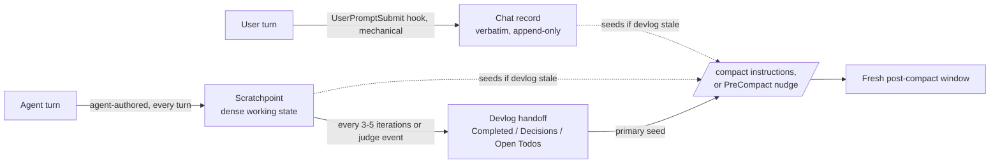

---
first_authored:
  by: "@claude-sonnet-5"
  at: 2026-09-22T10:34:02-07:00
task_list: meta/chat-record-scratchpoint-design
type: report
state: live
status: review_ready
tags: [meta, tooling, agent-memory, orchestration, context_persistence]
---

# Chat Record and Scratchpoint: A Durable-Checkpoint Design to Negate `/compact`

> BLUF(sonnet/chat-record-scratchpoint-design): Build both, they are not redundant: a **chat record** (mechanical, hook-written, verbatim user-turn log) and a **scratchpoint** (agent-authored, per-turn dense working-state checkpoint) close two different gaps that a devlog-only setup leaves open, and neither is a duplicate of "wrap `/compact`."
> Compaction-wrapping is the *delivery* mechanism (what a fresh window gets seeded from); the chat record and scratchpoint are the *capture* mechanisms (what durable state exists to deliver).
> Without them, wrapping `/compact` around a devlog only restores state as fresh as the last handoff, typically every 3-5 iterations per the existing cadence, so a mid-boundary compaction still loses a window's worth of work.
> Scope: chat record is top-level/overseer-only by construction (subagents have no interactive user turns); scratchpoint applies to the overseer and to Pillar-3 durable specialists (any agent whose context is intentionally carried warm across turns), not to one-shot dispatched reviewer/implementer/judge legs, whose checkpoint already is their returned summary.
> This generalizes a pattern this repo already ships in miniature (`orchestration-discipline.md`'s per-turn `overseer_thinness` columns), not a new category of artifact.
> Recommended rollout: ship the chat record and the `/compact`-steering convention first (cheap, mechanical, no validation needed); scratchpoint discipline second (a rule/skill change, needs a resumption-quality check); cap-and-reseed of durable specialists last (needs the scratchpoint validated as sufficient first).

## Context / Background

The maintainer's goal is to negate the utility of `/compact` entirely: have durable, deliberately-authored state make lossy cold auto-compaction unnecessary.
Three prior reports already establish the evidentiary basis, cited here rather than re-derived:

- [`2026-09-20-token-spend-by-role.md`](2026-09-20-token-spend-by-role.md), "Proposed cdocs workstreams" workstream 1, already names the two sub-mechanisms this report evaluates without naming them "chat record" and "scratchpoint": *"Auto-append every user message on send"* (the chat record) and *"Dense per-turn agent summary... distinct from the decision-focused devlog"* (the scratchpoint), plus a third idea, *"chapter turning / conscious compaction,"* which is what candidate (b) below formalizes.
- [`2026-09-20-read-source-attribution.md`](2026-09-20-read-source-attribution.md), "Context-management primitives available," is the ground truth for what Claude Code actually exposes: `/compact [instructions]` is steerable (interactive only); project-root `CLAUDE.md`/unscoped rules re-inject on compaction but the middle of the conversation, including earlier human turns, is summarized away; there is no agent-initiated selective eviction; the only agent-controllable eviction boundary is subagent return; and the API's `clear_tool_uses_20250919` context-editing feature is not exposed in Claude Code.
- [`2026-09-19-devlog-methodology-value.md`](2026-09-19-devlog-methodology-value.md) concludes the devlog should *absorb* compaction's role (point compaction at the devlog) rather than let compaction run as an independent third lossy summarization layer, on the strength of the Anthropic context-engineering cookbook, alexop.dev's memory-pattern survey, Factory.ai's anchored-iterative-summarization eval, OpenHands' `LLMSummarizingCondenser`, and two arXiv papers on dual-layer (event-log-plus-curated-summary) handoff architectures.
  That report explicitly frames the devlog as the *only* durable curated layer, with the raw transcript as a passive fallback and no independent third pass.

This report's job is to determine whether the devlog-value report's "two layers, not three" conclusion already covers the goal, or whether the devlog is too coarse an instrument to make cold auto-compaction unnecessary, and if so, what the minimal additional mechanism is.

## What "Chat Record" and "Scratchpoint" Actually Are

Grounding both terms in the token-spend report's own workstream 1 language, since the maintainer's phrasing maps directly onto it:

| Mechanism | What it captures | Authored by | Cadence | Precedent already in this repo |
|---|---|---|---|---|
| **Chat record** | Verbatim user input, append-only | Hook (mechanical, zero LLM cost) | Every user turn | None yet; the gap read-source report names explicitly ("`/compact` ... does not preserve full user history") |
| **Scratchpoint** | Dense, high-level summary of what the current turn/leg actually did: current subtask, key facts and decisions since the last devlog handoff, open threads, next action | Agent (judgment-bearing) | Every turn or every few turns | `orchestration-discipline.md`'s per-turn `overseer_thinness` context-estimate/inline-work columns (narrower scope, see below) |
| **Devlog handoff** | Curated decision record: Completed / Decisions Made / Open Todos | Agent (deliberate synthesis) | Task-unit boundary (every 3-5 iterations, or a judge invocation) | `orchestration-discipline.md` Pillar 2, already shipped |
| **`/compact`-wrap** | Nothing new; it is the delivery mechanism that seeds a fresh window from whichever of the above is freshest | Instructions string or hook nudge | At compaction time | Read-source report already verifies `/compact [instructions]` steering works; no repo mechanism uses it yet |

The devlog-value report's "two layers, not three" verdict holds for the *decision record vs. raw transcript* axis it was evaluating.
It does not settle the *granularity* axis this report is about: a devlog written every 3-5 iterations is, by the orchestration-discipline rule's own design, coarser than every turn.
Chat record and scratchpoint fill that granularity gap; neither is a competing third summarization pass over the same ground the devlog already covers, because neither re-derives a decision record.
The chat record is lossless-by-construction raw input; the scratchpoint is a *finer-grained instance of the same curated-checkpoint pattern* the devlog already uses, not a rival summary of it.

## Question 1: Organization (per-subagent/task, or overseer/top-level only?)

**Answer: neither uniformly.**
**Scope by mechanism, not by a single blanket rule.**

**Chat record is top-level/overseer-only by construction.**
A dispatched subagent (implementer, reviewer, judge, fork) has no interactive user; its "prompt" is the dispatch brief the overseer writes, which the `iterate` skill already durably records in the Dispatch/Return Events table (`plugins/cdocs/skills/iterate/SKILL.md`, "Append a `dispatch` row... naming the files it may claim").
There is no analogous verbatim-user-turn stream inside a subagent to capture.
This resolves cleanly without further argument.

**Scratchpoint scope tracks context lifetime, not agent role.**
The deciding factor is whether an agent's context is carried warm across multiple turns:

- The **overseer/top-level session** is always in scope: it is the one on the interactive critical path, the one the token-spend report shows actually gets auto-compacted mid-session (15.2% of weekly spend, 586M cache-read tokens per [`2026-09-20-token-spend-by-role.md`](2026-09-20-token-spend-by-role.md)), and the one `orchestration-discipline.md` Pillar 2 already targets with proactive-compaction cadence.
- **Pillar-3 durable specialists** (a named implementer kept warm across `iterate` rounds, per "Resume-by-name") are also in scope, and this is not hypothetical: the token-spend report's workstream 4 ("Cap-and-reseed the warm implementer") measured a durable implementer's context climbing 155K to 966K tokens across 18 rounds, alone 11.3% of the week's cache-read, resetting only when it saturates the ~1M window, "a sawtooth."
  That reset *is* a lossy auto-compaction-equivalent event happening inside a subagent, contradicting a naive assumption that subagents are always short-lived and fresh.
  Whatever mechanism prevents cold auto-compaction for the overseer should apply symmetrically to a durable specialist, since both are long-lived-by-design contexts.
- **One-shot dispatched legs** (a reviewer, a judge, most implementer legs, a `fork`) are explicitly out of scope.
  Their checkpoint already exists and is cheaper than a scratchpoint would be: the returned summary at the subagent-return eviction boundary, which the read-source report identifies as "the only agent-controllable eviction boundary today."
  Adding scratchpoint discipline here would duplicate that boundary for no benefit, since these legs rarely accumulate enough resident context to approach a compaction threshold before returning.

**Is this a generalization of the existing Dispatch/Return Events table and arc-state file, or a distinct thing?**
A generalization of the *pattern*, applied to a *different layer*, not a generalization of either *artifact*.
The Dispatch/Return Events table and the arc-state file (`oversee-arc.md`) are **orchestration-layer** durable checkpoints: who dispatched whom, which files are claimed, which proposals in a chain are done.
They are structured for a *second, possibly concurrent session* to reconcile programmatically (`oversee-arc.md`: "read and reconciled PROGRAMMATICALLY by a possibly-concurrent second session, so it is structured fields, not the free prose of a devlog").
A scratchpoint is a **working-context-layer** checkpoint: one agent's own dense notes about what it has been doing, for its own future self (post-compaction) or a cold-resuming peer, not for cross-agent reconciliation.
The clearest existing precedent for this exact shape already ships, narrowly: `orchestration-discipline.md`'s "Judge-Observable Thinness Signal" has the overseer append "an approximate current-context estimate and an 'inline-work performed this turn' flag as additive columns" to the Iteration Log **every turn**.
That is a proto-scratchpoint, scoped narrowly (two fields, only for judge-escalation purposes, only inside `iterate`).
The design below generalizes that same per-turn additive-append mechanism to (a) apply outside the iterate loop and (b) carry actual working-state content (current subtask, key facts, open threads), not just a bloat signal.

## Question 2: Precedent Beyond the Devlog-Value Report's Citations

A targeted search for prior art specifically on checkpoint/scratchpad patterns as compaction alternatives (not general agent-memory taxonomies, which the devlog-value report already covers via Anthropic's cookbook, alexop.dev, Factory.ai, OpenHands, and the two arXiv handoff papers) surfaced four concrete, on-point items:

1. **A shipped open-source implementation of candidate (b).**
   [mvara-ai/precompact-hook](https://github.com/mvara-ai/precompact-hook) is a Claude Code `PreCompact` hook billed as "LLM-interpreted recovery summaries before context compaction," described as firing "at the death boundary, the moment between full context and compaction," interpreting what is about to be lost for the agent that wakes up on the other side.
   This is an existing, independent implementation of exactly the compaction-wrapping idea this report evaluates, evidence the pattern is viable on the current hook surface, not merely theoretical.
2. **A scratchpad-vs-checkpoint distinction matching this report's Q3 conclusion, independently arrived at.**
   [Give Your Agent a Scratchpad: Keyed In-Memory Notes Between Tool Calls (dev.to)](https://dev.to/mukundakatta/give-your-agent-a-scratchpad-keyed-in-memory-notes-between-tool-calls-1dgp): "the scratchpad survives compaction; the raw file contents don't"; and, directly on the organization question, "the scratchpad and checkpoints are complementary: use the scratchpad for intra-session coordination, checkpoints for cross-session persistence."
   This corroborates treating chat-record/scratchpoint and compaction-wrap as complementary rather than either subsuming the other.
3. **Academic framing of agent-directed (vs. externally-triggered) compaction.** [Self-Compacting Language Model Agents (arXiv:2606.23525)](https://arxiv.org/pdf/2606.23525) is specifically about agents controlling their own compaction rather than a generic external summarizer running cold, the academic mirror of this report's candidate (a)/(b) framing rather than a generic memory-taxonomy citation.
4. **Platform-level evidence the desired end-state (agent-triggered proactive compaction) is a known gap, not yet shipped.**
   [claude-code#71803, "Let the agent trigger `/compact` itself (agent-invokable compaction)"](https://github.com/anthropics/claude-code/issues/71803) and [claude-code#14258, "PostCompact Hook Event and Compaction Content Control"](https://github.com/anthropics/claude-code/issues/14258) are both open feature requests.
   This matters directly for Question 4: the design below cannot assume agent-invokable compaction or a `PostCompact` hook exist; it has to work within `PreCompact` (pre-only) and `SessionStart` with a `compact` matcher (post-only, reinjection), exactly as `orchestration-discipline.md` already documents.

A fifth item is a caveat rather than precedent: [claude-code#13572, "PreCompact hook not triggered when `/compact` command runs"](https://github.com/anthropics/claude-code/issues/13572) reports `PreCompact` reliability gaps specifically on the *manual* `/compact` invocation path.
This is a concrete reason to treat `/compact [instructions]` steering (already verified working, per the read-source report) as the primary compaction-wrap mechanism and any `PreCompact` hook as a secondary, best-effort layer, not the reverse.

## Question 3: Duplication Check

**Does CLAUDE.md/rules reinjection on compaction already cover this?**
No.
Reinjection restores *static* project discipline (root `CLAUDE.md`, unscoped rules), verified in `orchestration-discipline.md`'s Pillar 2 "CLAUDE.md reseed mechanism" against `https://code.claude.com/docs/en/context-window.md`.
It is orthogonal to *dynamic* session state: what the agent was doing, why, and what is half-done.
A perfectly reinjected rule set tells a post-compact agent how to behave, not what it was in the middle of.
Reinjection is necessary but does not touch this report's problem at all.

**Does the memory tool already cover this?**
No, and it is not currently in use in this repo.
The only two references to it in this codebase are the read-source report's own note ("the memory tool is cross-session storage, not mid-session eviction") and a passing mention of Gemini CLI's memory tool in a parity report (`2026-03-13-parity-codex-gemini.md`).
There is no `hooks.json` entry, agent, or skill in this repo wiring up Anthropic's `memory_20250818` tool.
If it were adopted later, it would be a *storage backend* candidate for scratchpoint content, not a substitute for deciding what to write or when, which remains this report's actual subject.

**Is a `PreCompact` hook alone (re-inject devlog content) sufficient, making scratchpoints redundant?**
No, for a granularity reason grounded in this repo's own cadence rule.
`orchestration-discipline.md` Pillar 2 sets the devlog handoff cadence at "after every 3 to 5 iterations of the implement-review loop, OR whenever a judge invocation completes," targeting overseer turns "under roughly 150K tokens."
A `PreCompact` hook (or `/compact` instructions) that seeds from "the current devlog" is only ever as fresh as the *last* handoff.
If a compaction event fires between boundaries, whether from an unusually verbose tool result, a long non-loop stretch of inline work, or simply hitting the window ceiling mid-iteration, wrapping `/compact` around a stale devlog restores state that is missing up to an entire task unit's worth of work: exactly the loss the maintainer wants eliminated, just bounded rather than removed.
A scratchpoint written every turn (or every few turns) closes that window from "up to 3-5 iterations" down to "at most one turn," and it does so cheaply, since per-turn scratchpoint content is a few lines appended to an existing structure, not a fresh synthesis pass.
So: **compaction-wrapping is the necessary delivery mechanism regardless of what durable state exists, and it is genuinely simple to ship (an instructions string, or the `PreCompact` nudge pattern `inject-rules.ts` already uses for `SessionStart`).**
**But it is not sufficient by itself to hit "compaction never has to run cold," because the only durable state it currently has to point at (the devlog) is deliberately coarse.**
Scratchpoint is the missing fine-grained source; compaction-wrap is the missing delivery step.
Building only one does not achieve the stated goal.

The Dispatch/Return Events table and the arc-state file are not duplicated either, per Question 1's layer distinction: they are cross-agent orchestration bookkeeping, not a substitute for one agent's own working-context notes.

## Question 4: Concrete Recommended Design

Given the actual hook surface (`PreCompact`, `SessionStart` with a `compact` matcher, `UserPromptSubmit`, `PostToolUse` with `updatedToolOutput`) and this repo's existing skill/hook conventions (`plugins/cdocs/hooks/hooks.json`, `inject-rules.ts`'s reinjection pattern, `orchestration-discipline.md`'s prose-convention pattern), the minimal-mechanism design is:

### Phase 1: cheap, mechanical, ships now, needs no validation

1. **Chat record via a `UserPromptSubmit` hook.**
   A new hook entry appends each user message verbatim to a session-scoped append-only file (alongside or inside the active devlog, under a clearly delimited section, so it does not require a new frontmatter type).
   Zero LLM cost, lossless by construction, so there is nothing to validate: either the hook fires and appends, or it does not.
   This directly answers the "preserve my message history so a post-compact instance is not disoriented" need the read-source report names as unmet by `/compact` alone.
2. **`/compact` steering pointed at the durable state that exists.**
   Extend `orchestration-discipline.md` Pillar 2's handoff-before-compact convention with a concrete instructions string: when the overseer proactively runs `/compact`, it passes `/compact` instructions naming the current devlog handoff, the chat record, and (once Phase 2 ships) the scratchpoint.
   This is pure prompt discipline, already verified viable by the read-source report, and requires no hook or code change, only a rule addition.
3. **A `PreCompact` hook as a best-effort second layer**, mirroring `inject-rules.ts`'s existing `SessionStart` pattern: it cannot force an LLM write (the same limitation the still-open `devlog-autoflush-hook` proposal already identifies: "can a hook cause the model to write at all, or can it only emit an `additionalContext` directive that nudges the model"), so it emits a short `additionalContext` nudge pointing at the devlog/chat-record/scratchpoint paths, exactly the "Nudge" tier that proposal already scoped as an option.
   Given the `PreCompact`-on-manual-`/compact` reliability gap ([#13572](https://github.com/anthropics/claude-code/issues/13572)), this is explicitly a secondary defense, not the primary mechanism; item 2 above is primary.

### Phase 2: agent discipline change, needs a resumption-quality check before it is load-bearing

4. **Scratchpoint as a generalization of the existing thinness-signal columns.**
   Extend `orchestration-discipline.md`'s per-turn additive-append pattern (currently just a context-estimate and an inline-work flag) into a short structured entry, written every turn or every few turns by the overseer and by any active Pillar-3 durable specialist: current subtask, key facts/decisions since the last devlog handoff, open threads, next action.
   This is a rule/skill change, not a hook, because writing it requires judgment a hook cannot supply.
   Validation before treating it as load-bearing: an A/B resumption-quality check in the shape of Factory.ai's anchored-iterative-summarization eval (cited in the devlog-value report) comparing cold-resume quality from scratchpoint-plus-devlog against resume from full transcript, so the mechanism is proven to actually preserve what matters before the org depends on it in place of raw context.

### Phase 3: depends on Phase 2 validation, higher risk/reward

5. **Cap-and-reseed durable specialists** (the token-spend report's workstream 4), now enabled once the scratchpoint is validated as sufficient: when a Pillar-3 specialist's resident context crosses a cutoff well below the ~1M lossy-ceiling, checkpoint into its scratchpoint and dispatch a fresh leg seeded from it, rather than letting it run to the sawtooth reset.
   This was already flagged as hard-dependent on a durable-summary mechanism existing; this report's scratchpoint is that mechanism.
6. **A `cdocs:compact` skill that proactively invokes `/compact`** at scratchpoint-informed boundaries (not waiting for the reactive/automatic path), the actual "negate `/compact`'s utility" end-state: the reactive lossy path is rarely if ever exercised because the overseer always gets there first with fresh instructions.
   This carries the same enforcement risk the `devlog-autoflush-hook` proposal already flags for any convention a hook cannot force: it is model-obeyed, not harness-backed, until or unless a future `PostCompact`/agent-invokable-compaction primitive ships ([#71803](https://github.com/anthropics/claude-code/issues/71803), [#14258](https://github.com/anthropics/claude-code/issues/14258), both currently open).

### Summary: are hooks, a skill, or both needed?

Both, but not symmetrically.
The chat record is hook-only (mechanical, no judgment required).
The scratchpoint is skill/rule-only in Phase 1-2 (judgment-bearing, a hook cannot author it); a hook only enters as a best-effort nudge layer around compaction events, never as the writer.
The `/compact`-wrap is a prompt-steering convention first, with a `PreCompact` hook as defense-in-depth given its documented reliability gap on manual compaction.
None of the three needs new platform primitives to ship Phase 1; Phase 3 benefits from, but does not strictly require, primitives that do not exist yet.

## Recommendations

1. Ship the chat record (`UserPromptSubmit` hook, mechanical append) and the `/compact`-steering convention (rule addition to `orchestration-discipline.md` Pillar 2) together as Phase 1: cheap, low-risk, no validation gate.
2. Add a `PreCompact` best-effort nudge hook, explicitly scoped as secondary given [#13572](https://github.com/anthropics/claude-code/issues/13572)'s reliability caveat on manual `/compact`.
3. Generalize the existing `overseer_thinness` per-turn append mechanism into scratchpoint discipline, scoped to the overseer and to Pillar-3 durable specialists only, not to one-shot dispatched legs.
4. Gate cap-and-reseed of durable specialists (token-spend report workstream 4) and a `cdocs:compact` proactive-invocation skill behind a resumption-quality validation of the scratchpoint, using a Factory.ai-style anchored-iterative-summarization probe.
5. Do not build a memory-tool integration as part of this work; it is orthogonal (a possible future storage backend), not currently adopted anywhere in this repo, and does not change the capture-vs-delivery distinction this report resolves.

## Caveats

- The `PreCompact`-on-manual-`/compact` reliability gap ([#13572](https://github.com/anthropics/claude-code/issues/13572)) is reported against Claude Code generally; this report has not independently reproduced it against this repo's current Claude Code version, and the recommendation to treat `/compact [instructions]` as primary is precautionary, not confirmed-necessary.
- The token-spend report's workstream 4 sawtooth data (implementer context climbing 155K-966K across 18 rounds) is drawn from one 7-day window dominated by two long-running sessions, per that report's own caveats; the cap-and-reseed cutoff value is explicitly tentative there and inherited as tentative here.
- No implementation was attempted in this report; Phase 1 items are believed shippable on the documented hook surface but have not been built or tested against a live Claude Code session as part of this work.
