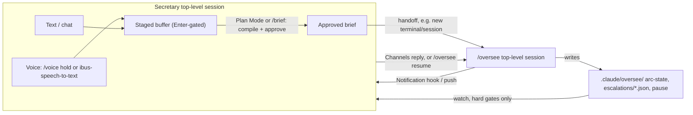

---
first_authored:
  by: "@claude-sonnet-5"
  at: 2026-09-26T14:00:00-07:00
task_list: cdocs/audio-interaction
type: report
state: live
status: review_ready
tags: [analysis, voice, audio, survey, oversee]
last_reviewed:
  status: revision_requested
  by: "@claude-opus-5-5"
  at: 2026-09-26T16:30:00-07:00
  round: 1
---

# Audio interaction approaches for a cdocs power user

> BLUF: The user perceives direct voice paths as lacking a review step; in fact `/voice` hold mode already waits for `Enter`, but that review surface is raw, unstructured text with no vocabulary correction beyond built-in coding-term tuning, which is the real gap.
> No Claude Code hook can silently rewrite a dictated prompt (`UserPromptSubmit` can only annotate, block, or ask for re-submission), so any cleanup step must stay visible to the user, not hide behind the scenes.
> The "secretary" the user imagines is best modeled as a second top-level Claude Code session, not a dispatched subagent (a dispatched agent cannot hold a live conversation with the human or dispatch its own workers), coordinating with a separately running `/oversee` session over the same file bus `/oversee` already writes (arc-state, escalations, pause marker) and, optionally, Channels.
> Recommendation: run a near-zero-cost input-precision experiment first (`/voice` hold mode feeding Plan Mode, or a no-tool `/brief` command), since that targets the user's actual complaint, with an escalation-digest reader as a cheap, parallel output-side companion; three open design questions (where the secretary lives, which cleanup model, and cloud-audio acceptability) are laid out as decision points, not resolved here.

> NOTE(claude-sonnet-5/audio-interaction, revision 1): This revision corrects the `UserPromptSubmit` capability claim (it cannot rewrite a prompt), re-places the secretary as a top-level session rather than a dispatched specialist, grounds the escalation/pause-marker return path in `/oversee`'s actual semantics, adds Plan Mode and Channels, fixes several misdescribed GitHub citations, states Talon's Fedora/Wayland unsuitability plainly, promotes `ibus-speech-to-text` as the Fedora-native zero-engineering option, reorders the recommendation to lead with an input-precision experiment, and cuts duplicated material. See `cdocs/reviews/2026-09-26-review-of-audio-interaction-approaches.md` for the full finding list.

## Context / Background

The user runs multi-agent workflows through cdocs (`/oversee`, `/iterate`, `/full-send`) and wants a lower-friction way to talk to Claude.
Their perception is that direct voice interfaces lack a review step, mishandle code identifiers and file paths, and commit to an acting agent the instant a word is misheard; this report tests that perception against the docs rather than assuming it.
Their imagined ideal is a dedicated assistant/secretary interface: something that compiles a voice-and-text back-and-forth into intent, and separately triages the boundary between the human and the running agent team, mirroring what `/oversee` already does for the agent team's internal escalations (see `plugins/cdocs/skills/oversee/SKILL.md` and `plugins/cdocs/rules/orchestration-discipline.md`).
This report surveys direct voice tools, analyzes why voice-to-agent is lossy, and lays out the secretary design space as reference options, not a decided proposal.

## Key Findings

- **`/voice` hold mode already has a review pause, but nothing to review against.** Per the official docs ([Voice dictation](https://code.claude.com/docs/en/voice-dictation)), hold mode (the default) inserts the finalized transcript at the cursor and waits for `Enter`; tap mode and `autoSubmit: true` remove that pause and auto-send once a transcript is 3+ words. The residual gap in hold mode is narrower than "no review step": it's raw, unstructured text with no diff-against-intent and no vocabulary correction beyond built-in coding-term tuning (`regex`, `OAuth`, `JSON`, `localhost`, project/branch-name hints). A related Desktop-app feature request ([#96353](https://github.com/anthropics/claude-code/issues/96353), open, `area:desktop`) asks that the live transcript revise while speaking rather than only at finalize, the same "every dictated message needs a proofread pass" burden. A per-project custom vocabulary is a separate, still-open request ([#31599](https://github.com/anthropics/claude-code/issues/31599)); a manual-edit-then-redictate bug discards the edit ([#93778](https://github.com/anthropics/claude-code/issues/93778), open); and no voice-to-voice mode exists (request [#50720](https://github.com/anthropics/claude-code/issues/50720), closed not-planned 2026-06-08). Transcription is cloud-only (Anthropic servers, claude.ai account required, not API-key/Bedrock/Foundry auth, no SSH/headless support) and also reaches background sessions via agent view's peek-and-reply panel.
- **Claude.ai / desktop / mobile voice mode is a different product from `/voice`, and the two are explicitly not interchangeable.** It defaults to continuous, hands-free listening with real bidirectional barge-in ("just start talking, Claude will stop and listen"; background noise can cause false interruptions), per Anthropic's support article ([Use voice mode](https://support.claude.com/en/articles/11101966-use-voice-mode)), which states plainly: "In Claude Cowork and Claude Code, dictation is available but voice mode isn't." Remote Control carries no voice input of its own (a request to add mobile dictation, [#29399](https://github.com/anthropics/claude-code/issues/29399), closed as a duplicate, unshipped).
- **Fedora's native offline option is `ibus-speech-to-text`, not a third-party wrapper.** Shipped as a Fedora 42 change (IBus-integrated, fully offline, Vosk-based, GTK4 model manager; [Fedora wiki](https://fedoraproject.org/wiki/Changes/ibus-speech-to-text)), it works as an input method into any IBus-aware app with no injection layer to fight. By contrast, whisper.cpp push-to-talk wrappers (`whisper-dictate-linux`, `vtd`) type into the focused window via `ydotool` or `wtype`, and `wtype` does not work under GNOME/Mutter (no virtual-keyboard protocol support), so they need `ydotool` with `uinput` permissions configured. GNOME itself has no built-in dictation as of 47/48 (an open, unbuilt Discourse proposal); third-party GNOME Shell extensions ([Blurt](https://github.com/QuantiusBenignus/blurt), [Speech2Text](https://extensions.gnome.org/extension/8238/gnome-speech2text/)) add whisper.cpp-based dictation. None of these Linux options match `/voice`'s coding-vocabulary tuning; for the Claude Code terminal specifically, `/voice` hold mode is strictly better except on offline operation and data locality.
- **Talon Voice is not a viable option on this machine.** Its precision comes from deterministic formatters ("camel hello world" -> `helloWorld`, casing derived from the spoken word rather than inferred), which remains valuable design prior art, but a named source reports the maintainer announced dropping Linux support with no Wayland plan ([OSnews, 2026-05-31](https://www.osnews.com/story/145162/accessibility-input-tool-removes-x11-support-doesnt-want-to-support-wayland-users-caught-in-the-middle/); KDE developers dispute the technical reasoning, not the announcement). Combined with Talon's existing X11-only support and this user's GNOME/Wayland desktop, Talon is off the table today regardless of that dispute's outcome.
- **The commercial "dictation + LLM cleanup" tier (Wispr Flow, Superwhisper, Aqua Voice, MacWhisper) ships no official Linux build**; Wispr Flow's docs state Linux is unsupported (an unofficial community port exists). Superwhisper and Aqua Voice's custom-dictionary and LLM-cleanup-pass features are the closest existing analogue to "correct against known vocabulary," but none run natively on Fedora.
- **No Claude Code hook can silently rewrite a prompt.** `UserPromptSubmit` supports only `permissionDecision` (`allow`/`deny`), `additionalContext`, and `systemMessage` ([hooks reference](https://code.claude.com/docs/en/hooks)); there is no field that replaces the submitted text. Any cleanup design must therefore either annotate (Claude sees the raw transcript plus suggested corrections as added context) or block-and-ask (deny with a `systemMessage` showing corrected text for the user to re-submit); a silent rewrite was never available in the first place, which also means the hook input carries no voice-origin signal to scope itself to dictated text only.
- **Anthropic has no public realtime/voice API**; the Messages API takes text and images only, and a request for audio input in the SDK is closed not-planned ([anthropic-sdk-python#1198](https://github.com/anthropics/anthropic-sdk-python/issues/1198)). A bespoke voice pipeline must bring its own STT/TTS. OpenAI Realtime, Deepgram, and AssemblyAI all offer vocabulary-biasing (`prompt`/`keywords`, Keyterm Prompting, `keyterms_prompt`) and turn-detection at the protocol level, at commodity API pricing, none of it turnkey.
- **`/oversee`'s escalation substrate exists, but its coverage is narrower than a "read the escalations directory" design assumes.** Hard-gate escalations (a `reject` verdict, an unresolvable footprint conflict, or scoping a `full <topic>` proposal set) write to `.claude/oversee/escalations/<arc-id>--<proposal-slug>.json`; soft gates never reach that directory and surface only as in-session questions or via the `Notification` hook / Remote Control's "Push when actions required" ([`plugins/cdocs/skills/oversee/SKILL.md`](../../plugins/cdocs/skills/oversee/SKILL.md) "AFK and Escalation Gates"; this distinction lives in that skill file, not in `oversee-arc.md`). The `.claude/oversee/pause` marker is a human-to-overseer STOP: the human drops it, the overseer checks it at each gate and clears it itself; an external reader cannot clear it to unblock anything, and a held arc resumes only via a live answer in the overseer's own session or `/oversee resume`.
- **Plan Mode and Channels are two first-party mechanisms that already serve half of the secretary pattern.** Plan Mode (`Shift+Tab` or `/plan`) has Claude research and propose without editing, then requires explicit approval before any tool acts, with `Ctrl+G` opening the plan in an external editor for direct correction ([permission modes docs](https://code.claude.com/docs/en/permission-modes)): this is an existing "compile, show, approve" gate. Channels (research preview) are two-way MCP bridges (Telegram, Discord, iMessage plugins today) that push messages into an already-running session and can relay permission prompts, and are the return leg an external secretary process would need to answer back into a live `/oversee` session ([Channels docs](https://code.claude.com/docs/en/channels)).

## Why Voice-to-Agent Is Lossy: Three Distinct Failure Modes

These compound but require different fixes; conflating them is why "better STT" alone doesn't solve the complaint.

1. **Transcription error.** The STT model mishears a word, worst on technical vocabulary, code identifiers, file paths, and punctuation. Mitigated by custom vocabulary (Talon, Superwhisper) or an LLM cleanup pass with the repo's symbol table as context.
2. **Intent under-specification.** Even a perfect transcript of rambling speech often isn't a well-formed instruction: it lacks the constraints, scope, and open questions a written brief would surface. This is a compilation problem, not an accuracy problem; it needs a structuring step after transcription and before dispatch.
3. **Thin review, not absent review.** `/voice` hold mode already waits for `Enter`, so the gap isn't "voice skips review" outright; it's that the review surface is raw transcribed text with no structure, no diff, and (per the Desktop FR above) a transcript that can still change at finalize even after it looked settled mid-speech. The sharper distinction from typing is that a misheard word costs a wasted or destructive agent turn once submitted, where a typo costs nothing until then, so the value of a *structured* review step (not merely a pause) is higher for voice than for text.

Control affordances that address each, roughly cheapest to most involved:

| Affordance | Addresses | Existing prior art |
|---|---|---|
| Staged transcript buffer (text lands in an editable field, not auto-submitted) | (3) | `/voice` hold mode already does this; any push-to-talk dictation tool typing at cursor |
| Custom vocabulary / hotword list | (1) | Talon vocabulary files, Superwhisper/Aqua Voice custom dictionaries, OpenAI Realtime `prompt`/`keywords`, Deepgram/AssemblyAI keyterm prompting |
| Annotate-or-block cleanup pass with repo context | (1) + light (2) | [wolfmanstout/talon-ai-tools](https://github.com/wolfmanstout/talon-ai-tools) invokes an LLM mid-dictation to fix errors; Superwhisper's pluggable-LLM correction pass (Mac/Windows only); a `UserPromptSubmit` hook can only annotate or block, never silently rewrite (see Key Findings) |
| Compile-then-approve gate | (2) + (3) | **Plan Mode** already does this for any input, voice or typed: research and propose, then require explicit approval before acting |
| Read-back confirmation (TTS or on-screen summary before dispatch) | (2) + (3) | Not found as a packaged tool; the gap a secretary layer's read-back could fill |
| Voice commands vs. free dictation mode switch | All three, at the cost of naturalness | Talon's command grammar (not viable on this machine, see Key Findings) |

## Direct Approaches Survey

| Tool | Capture mode | Transcript reviewable pre-send | Precision failure modes | Correction loop | Barge-in / interrupt | Platform |
|---|---|---|---|---|---|---|
| Claude Code `/voice` | Hold mode (default, push-to-talk) or tap mode (tap-to-start/tap-to-send); `autoSubmit` setting available | Hold mode: yes, waits for `Enter`. Tap mode / `autoSubmit`: no, auto-sends at 3+ words | Coding-vocabulary tuning; no per-project custom vocabulary ([#31599](https://github.com/anthropics/claude-code/issues/31599)); open bugs on edit-loss ([#93778](https://github.com/anthropics/claude-code/issues/93778)) and no mid-speech revision, filed against the desktop app ([#96353](https://github.com/anthropics/claude-code/issues/96353)) | Manual re-edit before `Enter` (hold mode); `Esc`/`Ctrl+C` cancels and restores prior prompt | None; no voice-to-voice mode ([#50720](https://github.com/anthropics/claude-code/issues/50720), closed not-planned); auto-stops after 15s silence or 2 min | Terminal + VS Code extension, macOS/Linux/Windows (WSLg); cloud-transcribed via claude.ai account; 20 languages ([docs](https://code.claude.com/docs/en/voice-dictation)) |
| Claude.ai / desktop / mobile voice mode | Default hands-free continuous; push-to-talk alternative | Not designed for pre-send review; a live spoken conversation, saved to history after | Not documented for code/identifiers | Re-speak / clarify conversationally | Real, bidirectional; background noise can falsely trigger it | Web, desktop, iOS, Android, all plans; explicitly not in Claude Code/Cowork ([support article](https://support.claude.com/en/articles/11101966-use-voice-mode)) |
| Claude Code Remote Control | No voice input; syncs an existing text/image/file session across devices | N/A | N/A | N/A | N/A | claude.ai/code, iOS, Android ([docs](https://code.claude.com/docs/en/remote-control)); mobile-dictation request closed as duplicate ([#29399](https://github.com/anthropics/claude-code/issues/29399)) |
| Fedora `ibus-speech-to-text` | IBus input method, offline, Vosk-based; push-to-talk/continuous behavior undocumented at the wiki level | Not documented at the OS level | Generic, not code-aware; no vocabulary customization documented | OS-level, none code-specific | N/A | Fedora 42+ ([Fedora wiki](https://fedoraproject.org/wiki/Changes/ibus-speech-to-text)); no Wayland text-injection issue since it's an input method |
| whisper.cpp push-to-talk wrappers (`whisper-dictate-linux`, `vtd`) + GNOME extensions (Blurt, Speech2Text) | Push-to-talk, fully offline | Yes, implicitly: types into the focused field | Generic Whisper weaknesses on jargon/identifiers; `--prompt` nudges (doesn't force) recognition, effective only within roughly the last 224 tokens | Manual; no built-in cleanup | N/A | Linux; standalone wrappers need `ydotool` (uinput permissions) since `wtype` doesn't work under GNOME/Mutter's missing virtual-keyboard protocol; the GNOME Shell extensions avoid this by running in-process |
| nerd-dictation | Push-to-talk, **Vosk-based** (not Whisper) | No: types directly into the focused window with no staging | All-lowercase output, no camelCase/snake_case handling | Scriptable Python post-processing hook, plus `--vosk-grammar-file` to constrain recognition | N/A | Linux |
| Wispr Flow / Superwhisper / Aqua Voice / MacWhisper | Hold/tap (Wispr Flow); push-to-talk with cleanup "modes" (Superwhisper); double-tap (Aqua Voice) | Not confirmed for hold mode; Aqua Voice supports voice-driven post-hoc editing | Custom dictionaries mitigate jargon (up to 800 terms, Aqua Voice Pro; CSV import, Superwhisper) | Wispr Flow/Superwhisper run an LLM cleanup pass with a chosen model; MacWhisper's dictation only works inside the app | Not confirmed | No official Linux builds (unofficial Wispr Flow port exists); Mac/Windows/mobile otherwise |
| Talon Voice (not viable here) | Continuous listening, explicit command grammar plus a dictation mode | Commands are visible as typed, not staged, but deterministic | Near-zero for drilled grammar; deterministic case formatters; homophones via pick menu | Best-in-class vocabulary tuning, but not usable | Command-driven silence threshold (0.3s default) | X11 only; reported dropping Linux, no Wayland plan ([OSnews, 2026-05-31](https://www.osnews.com/story/145162/accessibility-input-tool-removes-x11-support-doesnt-want-to-support-wayland-users-caught-in-the-middle/)) |
| OpenAI Realtime / Deepgram / AssemblyAI (build-your-own substrate) | Continuous streaming; server/semantic/client-controlled turn detection | No; API substrates, an app would add its own staging | Vocabulary biasing: OpenAI `prompt`/`keywords`, Deepgram Keyterm Prompting, AssemblyAI `keyterms_prompt` | App-defined | OpenAI Realtime: native `response.cancel` plus client buffer flush | API-only; roughly 190ms-1s end-to-end depending on vendor/percentile (vendor claims) |
| TTS for read-back | N/A, output side | N/A | N/A | N/A | N/A | ElevenLabs/OpenAI TTS (cloud); Piper (local, moved to [OHF-Voice/piper1-gpl](https://github.com/OHF-Voice/piper1-gpl) after the original repo archived, GPL-3.0); Coqui (moved to [idiap/coqui-ai-TTS](https://github.com/idiap/coqui-ai-TTS) after the original company shut down); neither fork's docs are Fedora-specific |

## The Secretary Pattern

The design goal: a user-facing counterpart to `/oversee`, compiling a noisy input stream into a structured, approved unit of work, and triaging what crosses the human/agent-team boundary in each direction.

**Placement.** A secretary that talks live to the human and can also reach the running agent team must be a **top-level session**, not a dispatched subagent: `/oversee` is explicitly top-level-only because a dispatched agent cannot dispatch its own workers and, separately, a dispatched agent cannot hold an open-ended conversation with the human the way a top-level session can (`plugins/cdocs/rules/orchestration-discipline.md`). Concretely, this means either (a) the user's own top-level session acts as the secretary while `/oversee` runs in a second terminal, or (b) a standalone secretary process (a Channels-connected session, or a Remote-Control-driven one) coordinates with a separately running `/oversee` session. Either way, the two sessions never nest; they coordinate over the file bus `/oversee` already writes and, optionally, Channels for a push-based return leg.

### What it needs to do

1. **Compile, don't relay.** Turn rambling voice-and-text into a structured brief (intent, constraints, open questions) the user explicitly approves before it reaches any acting agent. Plan Mode already provides the "propose, then approve" half of this for free; a thin `/brief` command could add the slot-filling structure Plan Mode doesn't impose by default.
2. **Maintain a running ledger/inbox**, in spirit like `/oversee`'s arc-state file (`.claude/oversee/<arc-id>.json`), but keyed to the human's queue.
3. **Read, not clear, `/oversee`'s hard-gate escalations.** A secretary can watch `.claude/oversee/escalations/*.json` and produce digests, but this only covers hard gates (reject, footprint conflict, scoping); soft gates and permission prompts surface separately via the `Notification` hook or Remote Control's push settings, which a complete triage layer must also watch. Answering back means resuming the actual overseer session (`/oversee resume`, or a live reply if it's already running), or a Channels message reaching that session directly; the secretary cannot clear the `pause` marker on the overseer's behalf, since that marker is a human-to-overseer signal the overseer itself clears on acknowledgement.
4. **Decide what needs the human vs. can proceed**, mirroring `/oversee`'s own soft-gate/hard-gate distinction (`plugins/cdocs/skills/oversee/SKILL.md`).

### Mapping onto existing mechanics

| Building block | Existing mechanic | Fit |
|---|---|---|
| Input capture + review pause | `/voice` hold mode, or `ibus-speech-to-text` off Claude Code | Already Enter-gated; no new component |
| Compile-then-approve | **Plan Mode** | Existing "research, propose, require approval" gate; `Ctrl+G` opens the plan in an editor for direct correction |
| Annotate-or-block cleanup | `UserPromptSubmit` hook (`additionalContext` or `permissionDecision: deny` + `systemMessage`) | Cannot rewrite silently; either shows suggested corrections alongside the raw transcript, or blocks and asks for re-submission |
| Escalation read (hard gates only) | `.claude/oversee/escalations/*.json` | Read-only; covers reject/footprint-conflict/scoping gates, not soft gates |
| Soft-gate / permission notice | `Notification` hook, Remote Control push settings | Covers what the escalation directory does not |
| Return leg to a live overseer session | **Channels** (research preview: Telegram/Discord/iMessage plugins, or a custom MCP server, two-way, optional permission relay) or `/oversee resume` | The mechanism an external secretary process needs to answer back; the pause marker itself is cleared only by the overseer |
| Scheduling | Scheduled/background agents | A periodic "what happened while you were away" digest reading arc-state files |

### Prior art

Anthropic's [chief-of-staff cookbook](https://platform.claude.com/cookbook/claude-agent-sdk-01-the-chief-of-staff-agent) delegates domain questions to subagents via `Task` and aggregates an executive summary; it also does direct work itself and uses `permission_mode="plan"` only as an optional, commented-out line, so it's a partial precedent for delegation-plus-approval, not a pure router. [LangChain's `executive-ai-assistant`](https://github.com/langchain-ai/executive-ai-assistant) is a closer full-loop precedent: classify every inbound item as ignore/notify/auto-draft, with human review of drafts through a companion "Agent Inbox" UI. A dev.to survey of "AI chief of staff" builds ([The AI Chief of Staff Is a Fleet, Not an Agent](https://dev.to/amitrix/the-ai-chief-of-staff-is-a-fleet-not-an-agent-1i)) names an autonomy ladder and "the file system is the bus," both of which map onto `/oversee`'s file-based arc-state and escalation markers. [salimfadhley/agent-inbox](https://github.com/salimfadhley/agent-inbox) is an independent, non-Anthropic mailbox built on the same insight this report reaches independently: "a running LLM turn cannot be interrupted from outside," so it uses wake-not-interrupt semantics via a session-start hook. Spoken-programming research (Begel's [spoken Java](https://andrewbegel.com/papers/begel-spoken-java.pdf); a 2023 ACM study on [speaking styles](https://dl.acm.org/doi/fullHtml/10.1145/3571884.3597130)) independently confirms that raw dictation loses information (unstated operator precedence, unresolvable homophones) a visual/typed feedback loop would otherwise catch, supporting the case for a semantic cleanup or compile step rather than transcript-is-final. Consumer voice-memo and executive-assistant products (Speakwise, Otter.ai, Marblism, Lindy) demonstrate the compile-and-approve halves in isolation but terminate at a document or a single human-facing agent, never a fleet of working agents; the cookbook and `executive-ai-assistant` above remain the only material found that targets a human-router agent in front of *other agents*.

## Options and Recommendations

Ranked cheapest to most ambitious; reference options for further consideration, not a decided architecture.

1. **Zero-engineering local capture.** `/voice` hold mode inside Claude Code (best vocabulary tuning, cloud-only); Fedora's `ibus-speech-to-text` for system-wide, fully offline capture into any IBus-aware app elsewhere. Both already Enter/paste-gated; no new components.
2. **Compile-then-approve using Plan Mode, or a no-tool `/brief` command.** Dictate into a prompt with Plan Mode active (`/plan` or `Shift+Tab`): Claude researches and proposes without editing, and requires explicit approval, with `Ctrl+G` opening the plan in an editor for direct correction first. Where Plan Mode's default framing doesn't fit, a tiny `/brief` skill that turns dictated or typed text into intent/constraints/open-questions and stops (no tool calls) covers the gap.
3. **Annotate-or-block cleanup via `UserPromptSubmit`.** A hook that, on a user-supplied voice marker, either adds `additionalContext` listing likely mishears and repo-symbol corrections alongside the raw transcript, or blocks with a `systemMessage` showing corrected text for re-submission. Neither variant hides what was heard; the annotate form keeps the flow moving, the block form is a harder, slower gate.
4. **Escalation-digest reader (hard-gate output side only).** A read-only watcher on `.claude/oversee/escalations/*.json`, explicitly scoped to hard gates; soft gates and permission prompts still need the `Notification` hook / Remote Control push path. Answering back means resuming the actual overseer session, not editing the pause marker externally.
5. **Full secretary as a second top-level session.** Owns compiling input (options 2-3) and triaging output (option 4), coordinating with a separately running `/oversee` session over the file bus and, if enabled, Channels for the return leg from phone or chat. This needs new durable state (an inbox format, distinct from arc-state) and its own soft/hard-gate policy, and must never nest under `/oversee` or be dispatched as a subagent (see Placement above).

**Suggested first experiment:** co-lead with options 1+2, since the user's stated pain point is input-side precision and control, and this combination needs no new code (just `/voice` or `ibus-speech-to-text` feeding an existing Plan Mode gate). Run option 4 in parallel as a cheap output-side companion, with its hard-gate-only coverage stated up front. Options 3 and 5 are follow-ups pending the decision points below.

## Decision Points for the User

These are open questions this report deliberately leaves unresolved.

1. **Where should the secretary live?** (a) Your own top-level session, with `/oversee` running in a second terminal: simplest, no new process, but ties the secretary to whichever terminal has focus. (b) A standalone process (a Channels-connected session or a custom MCP server) that injects into sessions: always-on and reachable from a phone, but adds a persistent background process and inherits Channels' research-preview status and allowlist trust model. (c) A Remote Control / mobile-first surface, with `/oversee` pushing notifications to it: native mobile UX, but Remote Control today is a text/image/file sync channel, not a programmable inbox, so less flexible for structured triage.
2. **Which cleanup model?** (a) Annotate-only: Claude sees the raw transcript plus suggested corrections and reconciles them itself, fastest but leaves reconciliation to model judgment. (b) Block-and-confirm: a harder gate that shows corrected text and requires explicit re-submission, most controllable but costs a round-trip every time. (c) Plan-Mode compile-then-approve with no cleanup hook at all: reuses an existing mechanism but structures intent without fixing transcription errors.
3. **Is cloud audio acceptable?** `/voice`, Claude.ai voice mode, and every surveyed commercial cleanup tool send audio off-machine for transcription. Only `ibus-speech-to-text` (Vosk) and the whisper.cpp-based wrappers/extensions keep audio local. If cloud transcription is unacceptable, local-only options should be weighted above `/voice` despite its superior coding-vocabulary tuning and existing Enter-gate review.
