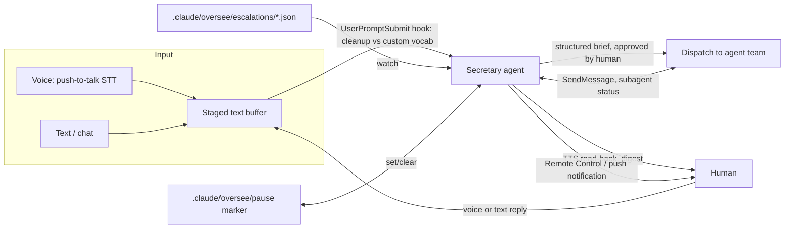

---
first_authored:
  by: "@claude-sonnet-5"
  at: 2026-09-26T14:00:00-07:00
task_list: cdocs/audio-interaction
type: report
state: live
status: review_ready
tags: [analysis, voice, audio, survey, oversee]
last_reviewed:
  status: revision_requested
  by: "@claude-opus-5-5"
  at: 2026-09-26T16:30:00-07:00
  round: 1
---

# Audio interaction approaches for a cdocs power user

> BLUF: Claude Code's `/voice` is more precision-aware than it first appears (coding-vocabulary tuning, a default hold-mode review pause before Enter), but its review step is still "read the raw transcript in the same box you'd type in," with no compilation, no custom-vocabulary correction beyond built-in coding terms, and no separation between "capture" and "an agent now acts on this."
> The user's complaint is best read as a missing control affordance, not a missing accuracy improvement: nothing on the direct-voice path structures rambling speech into an approved brief, or separates "what got heard" from "what should happen."
> That affordance generalizes into a user-facing "secretary" layer, the human-boundary counterpart to `/oversee`'s agent-team-facing role: it compiles conversation into a structured brief, holds a running inbox, and triages `/oversee` escalations by voice or text.
> Recommendation: start cheap (lean on `/voice` hold-mode's existing review pause, plus a `UserPromptSubmit` cleanup hook, no new architecture) before building any dedicated secretary agent; the escalation-triage half of the pattern already has a durable substrate to build on (`.claude/oversee/escalations/*.json`, Anthropic's own chief-of-staff cookbook pattern, and LangChain's `executive-ai-assistant` triage router) and is worth prototyping before the input-side half.

## Context / Background

The user runs multi-agent workflows through cdocs (`/oversee`, `/iterate`, `/full-send`) and wants a lower-friction way to talk to Claude, but has found direct voice interfaces imprecise: they lack a review step, mishandle code identifiers and file paths, and commit to an acting agent the instant a word is misheard.
The imagined ideal is a dedicated assistant/secretary interface: something that compiles a voice-and-text back-and-forth into intent, and separately triages the boundary between the human and the running agent team, mirroring what `/oversee` already does for the agent team's internal escalations (see `plugins/cdocs/skills/oversee/SKILL.md` and `plugins/cdocs/rules/orchestration-discipline.md`).
This report surveys direct voice tools, analyzes why voice-to-agent is lossy, and lays out the secretary design space as reference options, not a decided proposal.

## Key Findings

- **`/voice`'s default review step is real but thin.** Per the official docs ([Voice dictation](https://code.claude.com/docs/en/voice-dictation)), hold mode (the default) inserts the finalized transcript at the cursor and waits for `Enter`, so nothing is dispatched until the user explicitly submits, and typing/dictation can be freely mixed before that submit. Tap mode and `autoSubmit: true` remove that pause and auto-send once a transcript is 3+ words. Either way, the "review" is reading raw transcribed text in the normal prompt box: there is no compiled brief, no diff-against-intent, and no vocabulary correction beyond the built-in coding-term tuning below.
- **`/voice` is tuned for coding vocabulary and cloud-only.** Transcription recognizes terms like `regex`, `OAuth`, `JSON`, `localhost`, and auto-hints on the current project name and git branch, but it streams audio to Anthropic's servers for transcription (not local) and requires a claude.ai account login, not an API key, Bedrock, or Foundry auth, and does not work over SSH or in cloud/headless sessions ([Voice dictation](https://code.claude.com/docs/en/voice-dictation)). On Linux it uses a native module, falling back to `arecord` (ALSA) or `rec` (SoX).
- **`/voice` also dictates into background sessions via agent view's peek-and-reply panel**, i.e. Claude Code already lets a human voice-drive one session while others run unattended in the background ([Voice dictation](https://code.claude.com/docs/en/voice-dictation), [agent view docs](https://code.claude.com/docs/en/agent-view)): the closest existing primitive to "voice into a multi-session/multi-agent setup," though it targets one session at a time with no compiled cross-session brief.
- **A per-project/custom vocabulary for `/voice` is a live, unaddressed feature request.** [Issue #31599](https://github.com/anthropics/claude-code/issues/31599) explicitly asks for per-project dictionaries and spoken-to-written replacements, citing misheard library names, endpoints, and CLI flags: the exact gap this report's "custom vocabulary against repo symbols" mitigation would fill. Open bugs also report accuracy regressions ([#93778](https://github.com/anthropics/claude-code/issues/93778): re-dictating after a manual edit discards the edit; [#96353](https://github.com/anthropics/claude-code/issues/96353): the live transcript is not revised mid-speech, only at finalize, so every dictated message needs a proofread pass) and no built-in voice-to-voice mode exists (a "JARVIS-style" request, [#50720](https://github.com/anthropics/claude-code/issues/50720), closed for inactivity 2026-06-08 without being built). GitHub issue numbers here are as reported by a research subagent and not independently re-verified.
- **Claude.ai / desktop / mobile voice mode is a genuinely different interaction model from `/voice`: continuous, hands-free, with real barge-in.** Per Anthropic's own support article ([Use voice mode](https://support.claude.com/en/articles/11101966-use-voice-mode)), the default mode listens continuously and replies when the user pauses, push-to-talk is an alternative, and interruption is explicit and bidirectional ("just start talking, Claude will stop and listen"), with background noise falsely triggering interruption as a known failure mode. The same article states plainly: **"In Claude Cowork and Claude Code, dictation is available but voice mode isn't"**, i.e. the continuous/barge-in experience and the coding-tuned push-to-talk experience are deliberately different products, not two views of the same feature.
- **Claude Code Remote Control has no voice input of its own.** It syncs an existing session (text, images, files) across terminal/browser/phone; a request to add mobile dictation with custom vocabulary and pre-send review ([#29399](https://github.com/anthropics/claude-code/issues/29399)) was closed as a duplicate without a shipped feature as of this research.
- **GNOME has no built-in dictation as of GNOME 47/48**; a desktop-wide offline speech-to-text proposal (D-Bus API, pluggable Whisper/Vosk backends) is open on GNOME Discourse but unbuilt ([proposal](https://discourse.gnome.org/t/proposal-desktop-wide-offline-speech-to-text-dictation-support/35858)). Fedora shipped `ibus-speech-to-text` as a Fedora 42 change: IBus-integrated, fully offline, Vosk-based dictation into any IBus-aware app with a GTK4 model manager ([Fedora wiki](https://fedoraproject.org/wiki/Changes/ibus-speech-to-text)), though the wiki page does not document push-to-talk vs. continuous behavior or a review step. Third-party GNOME Shell extensions fill gaps with whisper.cpp: [Blurt](https://github.com/QuantiusBenignus/blurt) and [Speech2Text](https://extensions.gnome.org/extension/8238/gnome-speech2text/).
- **The commercial "dictation + LLM cleanup" tier is mostly closed to Fedora.** Wispr Flow, Superwhisper, and Aqua Voice ship official builds for macOS/Windows only; Wispr Flow's own docs state Linux is unsupported, though an unofficial community port exists ([wispr-flow-linux](https://github.com/wispr-flow-linux/wispr-flow-linux)). Superwhisper supports a CSV custom vocabulary and a per-mode cleanup prompt with a choice of LLM; Aqua Voice supports voice-driven editing commands ("make this a list") and an 800-entry custom dictionary on its paid tier; none are natively usable on this user's Fedora machine.
- **Talon Voice's precision comes from deterministic formatters, not better guessing.** "camel hello world" and "snake hello world" produce `helloWorld` and `hello_world` exactly, because casing is derived from the spoken formatter word, not inferred from audio ([Talon community wiki](https://talon.wiki/Voice%20Coding/voice-coding-overview/)). Correction has a real limitation: "scratch that" deletes by keystroke count, so it deletes the wrong text if the cursor moved or an IDE autocomplete inserted characters in between. Talon lists Linux (X11) support on its own site; a secondary, unconfirmed report claims the maintainer announced dropping Linux/Wayland support, disputed by KDE developers over the underlying platform APIs; treat the drop claim as **unverified**.
- **Anthropic has no public realtime/voice API; Claude's audio pipeline is internal to `/voice` and Claude.ai voice mode.** The public Messages API takes text and images only ([platform.claude.com/docs](https://platform.claude.com/docs/en/home)); a feature request for audio input is open ([anthropic-sdk-python#1198](https://github.com/anthropics/anthropic-sdk-python/issues/1198)). Any custom voice interface targeting Claude today must therefore bring its own STT/TTS (OpenAI Realtime, Deepgram, AssemblyAI, local Whisper) and pass cleaned text to Claude; there is no first-party equivalent to build on.
- **Realtime STT/TTS vendors already solve turn detection and vocabulary biasing at the protocol level, at a real dollar cost.** OpenAI's Realtime API offers a free-text `prompt`, a `keywords` list, and server/semantic/none turn-detection modes; Deepgram's Keyterm Prompting and AssemblyAI's `keyterms_prompt` do the same for streaming transcription (AssemblyAI claims ~300ms median latency and 21% fewer alphanumeric errors with keyterm prompting, a vendor claim, [source](https://www.assemblyai.com/blog/introducing-universal-streaming)). These are all commodity building blocks for a bespoke secretary-input pipeline, not turnkey products; AssemblyAI streaming bills continuously by session time including idle time ($0.15/hour, [pricing](https://www.assemblyai.com/docs/billing-and-pricing)).
- **Claude Code Remote Control already carries a cross-device conversation channel and a push-notification decision point**, which is the existing mechanical seam closest to a "secretary inbox": it syncs subagent/workflow progress across terminal, browser, and phone, and `agentPushNotifEnabled` plus `/config` push settings ("Push when Claude decides", "Push when actions required") already implement a coarse triage decision, just without a compiled brief or structured escalation queue ([Remote Control docs](https://code.claude.com/docs/en/remote-control)).
- **`/oversee` already has a durable, file-based escalation substrate** a secretary layer could consume directly rather than re-inventing: hard-gate escalations are written to `.claude/oversee/escalations/<arc-id>--<proposal-slug>.json` with `gate`, `raised_at`, `detail`, `afk_policy_applied` fields (`plugins/cdocs/skills/oversee/template.md`), and an out-of-band `.claude/oversee/pause` marker lets a human without a live session force a hold at the next gate. This is the agent-team-facing half of the boundary the user wants a human-facing counterpart to.
- **`UserPromptSubmit` is the concrete hook point for transcript cleanup before an agent acts on raw voice/dictation text**: it fires after the user submits a prompt but before Claude processes it, can inject context or block/modify the prompt, with a 30-second default timeout since it blocks the turn ([Claude Code hooks reference](https://code.claude.com/docs/en/hooks)).

## Why Voice-to-Agent Is Lossy: Three Distinct Failure Modes

These compound but require different fixes; conflating them is why "better STT" alone doesn't solve the user's complaint.

1. **Transcription error.** The STT model mishears a word. Worst on technical vocabulary, code identifiers (`camelCase`, `snake_case`, acronyms), file paths, and punctuation, none of which have a natural spoken form. Mitigated by custom vocabulary lists (Talon, Superwhisper) or an LLM cleanup pass that has the repo's symbol table available as context.
2. **Intent under-specification.** Even a perfect transcript of rambling speech is often not a well-formed instruction: it lacks the constraints, scope, and open questions a written brief would surface. This is a compilation problem, not an accuracy problem, and no STT engine fixes it. It needs a structuring step (slot-filling: intent / constraints / open questions) that happens after transcription and before dispatch.
3. **Irreversibility.** A typo in a text editor costs nothing; a misheard word that becomes an acting agent's premise costs a wasted (or destructive) turn, because voice today has no analog to "the cursor is still blinking in an empty prompt box." This is the sharpest distinction from typing: text-to-agent already has an implicit review step (the user reads their own prompt before hitting enter), and voice interfaces mostly skip it.

Control affordances that address each, roughly cheapest to most involved:

| Affordance | Addresses | Existing prior art |
|---|---|---|
| Staged transcript buffer (text lands in an editable field, not auto-submitted) | Irreversibility | Any push-to-talk dictation tool typing at cursor (`whisper-dictate-linux`) |
| Custom vocabulary / hotword list | Transcription error | Talon vocabulary files, Superwhisper/Aqua Voice custom dictionaries, OpenAI Realtime `prompt`/`keywords`, Deepgram/AssemblyAI keyterm prompting |
| LLM cleanup pass with repo context (symbol names, recent file paths) | Transcription error + light intent structuring | Superwhisper's pluggable-LLM correction pass (Mac/Windows only); [wolfmanstout/talon-ai-tools](https://github.com/wolfmanstout/talon-ai-tools) invokes an LLM mid-dictation specifically to fix errors; no Linux-native, no-setup equivalent found |
| Explicit commit gesture (separate "record" vs. "send") | Irreversibility | `/voice`'s hold-to-talk already separates capture from typing; nothing currently separates typing from submission for voice specifically |
| Read-back confirmation (TTS or on-screen summary before dispatch) | Intent under-specification + irreversibility | Not found in any surveyed tool; this is the gap a secretary layer fills |
| Structured slot-filling (intent/constraints/open-questions template) | Intent under-specification | No consumer tool found; closest analogue is a written proposal template (cdocs' own `/cdocs:propose`) |
| Voice commands vs. free dictation mode switch | All three, at the cost of naturalness | Talon's command grammar |

## Direct Approaches Survey

| Tool | Capture mode | Transcript reviewable pre-send | Precision failure modes | Correction loop | Barge-in / interrupt | Platform |
|---|---|---|---|---|---|---|
| Claude Code `/voice` | Hold mode (default, push-to-talk) or tap mode (tap-to-start/tap-to-send); `autoSubmit` setting available | Hold mode: yes, waits for `Enter`. Tap mode / `autoSubmit`: no, auto-sends once transcript is 3+ words | Coding-vocabulary tuning (`regex`, `OAuth`, `JSON`, `localhost`, project/branch-name hints); no per-project custom vocabulary ([open request #31599](https://github.com/anthropics/claude-code/issues/31599)); open bugs report dropped/substituted words and no mid-speech revision ([#93778](https://github.com/anthropics/claude-code/issues/93778), [#96353](https://github.com/anthropics/claude-code/issues/96353)) | Manual re-edit before `Enter` (hold mode only); `Esc`/`Ctrl+C` cancels and restores prior prompt | None; no voice-to-voice mode (request [#50720](https://github.com/anthropics/claude-code/issues/50720) closed unbuilt); recording auto-stops after 15s silence or 2 min total | Terminal + VS Code extension, macOS/Linux/Windows (WSLg); cloud-transcribed via claude.ai account (not API-key/Bedrock/Foundry auth); 20 languages ([official docs](https://code.claude.com/docs/en/voice-dictation)) |
| Claude.ai / desktop / mobile voice mode | Default hands-free continuous listening; push-to-talk available as an alternative | Not designed for pre-send review; it's a live spoken conversation, transcript saved to history after the fact | Not documented for code/identifiers; general conversational STT | Re-speak / clarify conversationally | Real, bidirectional: "just start talking, Claude will stop and listen"; background noise can cause false interruptions | Web, desktop, iOS, Android, all plans; explicitly **not** available in Claude Code or Claude Cowork, which get dictation instead ([support article](https://support.claude.com/en/articles/11101966-use-voice-mode)) |
| Claude Code Remote Control | No voice input; syncs an existing text/image/file session across devices | N/A | N/A | N/A | N/A | claude.ai/code, iOS, Android ([docs](https://code.claude.com/docs/en/remote-control)); mobile-dictation request closed as duplicate, unshipped ([#29399](https://github.com/anthropics/claude-code/issues/29399)) |
| GNOME / Fedora OS dictation | No GNOME-native dictation (47/48); Fedora 42's `ibus-speech-to-text` is IBus-integrated, offline, Vosk-based into any IBus app | Not documented at the OS level | Generic, not code-aware; no vocabulary customization documented | OS-level, none code-specific | N/A | Fedora ([Fedora wiki](https://fedoraproject.org/wiki/Changes/ibus-speech-to-text)); third-party GNOME Shell extensions add whisper.cpp-based dictation ([Blurt](https://github.com/QuantiusBenignus/blurt), [Speech2Text](https://extensions.gnome.org/extension/8238/gnome-speech2text/)) |
| whisper.cpp push-to-talk wrappers (`whisper-dictate-linux`, `vtd`) | Push-to-talk, fully offline | Yes, implicitly: types into whatever field is focused, so a text box is the natural staging buffer | Generic Whisper weaknesses on jargon/identifiers/proper nouns; a `--prompt` flag nudges (does not force) recognition toward given words, effective only within roughly the last 224 tokens | Manual; no built-in cleanup | N/A | Linux (X11/Wayland); no published latency benchmark, model-size-dependent memory (tiny ~273MB to large ~3.9GB) |
| nerd-dictation | Push-to-talk, **Vosk-based** (not Whisper) | No: types directly into the focused window with no staging | Vosk outputs all-lowercase with no camelCase/snake_case handling; author's own docs call fixing case "not very convenient" | Scriptable Python post-processing hook for text rewriting, plus a `--vosk-grammar-file` to constrain recognition to a fixed phrase set: the most code-adjacent customization found on Linux, but manual to set up | N/A | Linux |
| Wispr Flow / Superwhisper / Aqua Voice / MacWhisper | Hold or tap modes (Wispr Flow); push-to-talk with configurable cleanup "modes" (Superwhisper); double-tap start (Aqua Voice) | Not confirmed for hold mode in any of these; Aqua Voice supports voice-driven post-hoc editing ("make this a list") | Personal/custom dictionaries mitigate jargon (Wispr Flow, up to 800 terms on Aqua Voice Pro, CSV import on Superwhisper); Superwhisper reports ~88% accuracy on hard technical speech pre-cleanup (vendor/secondary) | Wispr Flow and Superwhisper run an LLM cleanup pass with a user-chosen model; MacWhisper is mainly file/meeting transcription, dictation only works inside the app itself | Not confirmed | **No official Linux builds** (Wispr Flow docs state Linux unsupported; unofficial community port exists, [wispr-flow-linux](https://github.com/wispr-flow-linux/wispr-flow-linux)); Mac/Windows/mobile only otherwise |
| Talon Voice | Continuous listening with explicit command grammar plus a separate dictation mode for prose | Commands are visible as typed as they execute; not a staged buffer, but deterministic and inspectable | Near-zero for drilled grammar; deterministic case formatters (`camel`/`snake` prefixes) rather than inferred casing; homophones resolved via a pick menu; "scratch that" deletes by keystroke count and can delete the wrong text if the cursor moved | Best-in-class: user-tunable vocabulary/command set, plus a December 2025 Conformer D model update claimed 4-10x faster and ~20% more accurate ([Talon changelog](https://talonvoice.com/dl/latest/changelog.html)) | Command-driven silence threshold (0.3s default, configurable), not conversational barge-in | macOS, Windows, Linux (X11) per talonvoice.com; a secondary, disputed report claims planned Linux/Wayland removal, **unverified** |
| OpenAI Realtime / Deepgram / AssemblyAI (build-your-own substrate) | Continuous streaming; OpenAI Realtime supports server VAD, semantic, or client-controlled (push-to-talk) turn detection | No (these are API substrates, not end-user review UIs; an app built on them would add its own staging) | Vocabulary biasing available: OpenAI free-text `prompt` + `keywords`; Deepgram Keyterm Prompting (500-token cap); AssemblyAI `keyterms_prompt` (up to 100 terms, vendor-claimed 21% fewer alphanumeric errors) | App-defined | OpenAI Realtime: native interrupt via `response.cancel` plus client-side audio-buffer flush | API-only; OpenAI ~190ms end-to-end (secondary); AssemblyAI ~300ms median/1012ms p99 (vendor claim); Deepgram ~516ms median (competitor benchmark) |
| TTS for read-back (ElevenLabs, OpenAI TTS, Piper, Coqui) | N/A, output side | N/A | N/A | N/A | N/A | ElevenLabs/OpenAI TTS: cloud, ~75ms model latency (ElevenLabs Flash). Piper: local/offline, original repo archived 2025-10-06, maintained fork [OHF-Voice/piper1-gpl](https://github.com/rhasspy/piper) (relicensed GPL-3.0). Coqui: original company shut down 2024, maintained fork [idiap/coqui-ai-TTS](https://github.com/idiap/coqui-ai-TTS). Neither Piper nor Coqui documentation is Fedora-specific. |

## The Secretary Pattern

The design goal: a user-facing layer that plays the same role for the human that `/oversee` plays for the agent team, compiling a noisy input stream into a structured, approved unit of work, and triaging what crosses the human/agent-team boundary in each direction.

### What it needs to do

1. **Compile, don't relay.** Take rambling voice-and-text back-and-forth and produce a structured brief (intent, constraints, open questions) that the user explicitly approves before it reaches any acting agent. This is the direct fix for intent under-specification and irreversibility (see table above): the approval step is the "cursor still blinking" moment voice currently lacks.
2. **Maintain a running ledger/inbox.** A durable record of pending items, similar in spirit to `/oversee`'s arc-state file (`.claude/oversee/<arc-id>.json`) and escalation markers, but keyed to the human's queue rather than an arc's proposal sequence.
3. **Triage incoming escalations.** `/oversee` already writes hard-gate escalations to `.claude/oversee/escalations/<arc-id>--<proposal-slug>.json` (`gate`, `raised_at`, `detail`, `afk_policy_applied`) and supports an out-of-band `.claude/oversee/pause` marker (`plugins/cdocs/skills/oversee/template.md`). A secretary layer's most concrete, buildable job is watching that directory, summarizing new escalations by voice or text, and routing the human's answer back (e.g., dropping/clearing the pause marker, or answering the hard-gate question that unblocks `afk_policy: hold`).
4. **Decide what needs the human vs. can proceed.** Mirrors `/oversee`'s own soft-gate/hard-gate distinction (`plugins/cdocs/rules/oversee-arc.md`); a secretary applying the same discipline to the human's inbox (some things can wait for a digest, some need an interrupt) is a direct reuse of a pattern already proven at the arc-overseer altitude.

### Mapping onto existing Claude Code mechanics

| Building block | Existing mechanic | Fit |
|---|---|---|
| Human input staging | `UserPromptSubmit` hook | Cleanup pass against repo vocabulary before the prompt reaches any agent; already the concrete hook point ([hooks reference](https://code.claude.com/docs/en/hooks)) |
| Structured-brief compiler | A dedicated subagent (durable specialist, Pillar 3 of `orchestration-discipline.md`) | The secretary is itself a `resume-by-name` specialist, addressable across turns, exactly the pattern `/oversee` already uses for per-workstream context |
| Escalation triage | `.claude/oversee/escalations/*.json` + `.claude/oversee/pause` | Already a durable, file-based interface; a secretary needs only to watch and summarize it, not redesign it |
| Cross-device presence | Remote Control | Already syncs conversation/subagent progress across terminal, browser, phone; the "notify vs. hold" decision (`agentPushNotifEnabled`, `/config` push settings) is the coarse-grained ancestor of the triage decision above ([Remote Control docs](https://code.claude.com/docs/en/remote-control)) |
| Notification/read-back trigger | `Notification` and `Stop` hooks | Route a digest or single escalation to a push service or a TTS read-back script ([hooks reference](https://code.claude.com/docs/en/hooks)) |
| External state | MCP server | If the ledger/inbox needs to live outside `.claude/`, an MCP server is the standard extension point rather than inventing a new file format |
| Scheduling | Scheduled/background agents (`schedule` skill in this environment) | A periodic digest ("summarize what happened while you were away") is a natural fit for a cron-triggered agent reading the arc-state files |

### Prior art

**Chief-of-staff / executive-assistant agent patterns.** Anthropic's own [chief-of-staff cookbook](https://platform.claude.com/cookbook/claude-agent-sdk-01-the-chief-of-staff-agent) is the most directly relevant precedent: a top-level agent that never does task work itself, delegates via the `Task` tool to domain subagents, aggregates their output into an executive summary, and uses `permission_mode="plan"` so strategic items are written to a plan file for human approval before execution, the plan-mode step being a direct precedent for an approval gate. [LangChain's `executive-ai-assistant`](https://github.com/langchain-ai/executive-ai-assistant) is a production-grade OSS triage router: every inbound item is classified into exactly one of ignore / notify / auto-draft-and-send, with human review of drafts happening through a companion "Agent Inbox" UI, architecturally the closest existing full loop (capture, classify, draft, human approval, dispatch) even though it targets email rather than an agent team. A dev.to survey of five "AI chief of staff" builds ([The AI Chief of Staff Is a Fleet, Not an Agent](https://dev.to/amitrix/the-ai-chief-of-staff-is-a-fleet-not-an-agent-1i)) names an autonomy ladder (read-only triage through auto-execute) with outbound/customer-facing actions gated on human approval regardless of rung, and "the file system is the bus" (flat CSV/YAML/Markdown coordination), both of which map directly onto `/oversee`'s own file-based arc-state and escalation markers. Academic framings of the same approval-gate idea exist ([Magentic-UI](https://arxiv.org/pdf/2507.22358); [pAI-Econ-claude](https://arxiv.org/pdf/2607.21268)).

**Talon + LLM cleanup for coding.** [wolfmanstout/talon-ai-tools](https://github.com/wolfmanstout/talon-ai-tools) and its forks are the active OSS lineage combining Talon's precise grammar with an LLM call (OpenAI API, local models, or the `simonw/llm` CLI) invoked mid-dictation specifically to "rapidly correct dictation errors," complementing structural voice-editing (Cursorless) rather than replacing it: precise grammar for navigation/structure, LLM only for fuzzy intent cleanup. Pre-LLM Talon accounts ([Josh Comeau](https://www.joshwcomeau.com/blog/hands-free-coding/); [Blake Watson](https://blakewatson.com/journal/speaking-in-code-hands-free-input-with-talon/)) report ~50% of typing speed, voice strain over long sessions, and stress that "you need to feel you can fix mistakes as they come up," which frames what any cleanup layer must preserve: fast, legible correction, not an opaque rewrite.

**Spoken-programming research confirms the three-failure-mode framing independently.** Begel's foundational work on [spoken Java](https://andrewbegel.com/papers/begel-spoken-java.pdf) identifies lexical ambiguity classes unique to spoken code (homophones, miscapitalization, concatenated identifiers) that a speech recognizer cannot resolve without a code-aware layer. A 2023 ACM study ([Programming by Voice: Exploring User Preferences and Speaking Styles](https://dl.acm.org/doi/fullHtml/10.1145/3571884.3597130)) found participants naturally speak arithmetic ambiguously (no stated operator precedence) unless prompted, direct evidence that raw dictation loses information a typed/visual feedback loop would otherwise catch immediately, motivating a semantic cleanup pass with project context rather than a transcript-is-final approach.

**A durable, file-based agent inbox already exists as independent OSS.** [salimfadhley/agent-inbox](https://github.com/salimfadhley/agent-inbox) is a non-Anthropic SQLite mailbox with an ActivityStreams-style message model (`to`/`cc`, `inReplyTo` threading) built specifically because "a running LLM turn cannot be interrupted from outside": it uses wake-not-interrupt semantics, checking the inbox via a Claude Code session-start hook and optionally waking an idle session when new mail arrives. This is a concrete existence proof for the ledger/inbox half of the secretary pattern, independent of cdocs' own arc-state file.

**Loose, non-agent-team-facing analogues.** Voice-memo-to-brief tools ([Speakwise](https://speakwiseapp.com/blog/best-app-entrepreneurs-voice-memos)) and meeting-notes-to-action-items tools ([Otter.ai](https://otter.ai/blog/otter-ai-notion-integration)) demonstrate the "compile unstructured voice into structured output" half in isolation, but terminate at a document or inert task, not a dispatched agent. AI-executive-assistant products ([Marblism Eva](https://www.marblism.com/blog/best-ai-executive-assistants); [Lindy](https://www.lindy.ai/blog/executive-assistant-automation)) demonstrate the approval-gate-before-send half for single-agent, human-facing work. None of these route to a fleet of working AI agents; the chief-of-staff cookbook and `executive-ai-assistant` above are the only material found that explicitly targets a human-router agent sitting in front of *other agents* rather than in front of a human's own inbox.

## Options and Recommendations

Ranked cheapest to most ambitious. These are reference options for further consideration, not a decided architecture.

1. **Local Whisper + manual submit (no new architecture).** `whisper-dictate-linux` or similar bound to a hotkey, typing into whatever prompt box is focused (terminal, editor, chat). Zero new components; the existing "read before you hit enter" habit is the review step. Weak on jargon/identifiers unless the user maintains their own replacement list manually. This is available today with no engineering.
2. **Add a cleanup pass via `UserPromptSubmit`.** Same input path, plus a hook that runs the raw transcript through a small LLM call with the repo's symbol table / recent file paths as context, rewriting obvious mishears before Claude sees the prompt. Still no staging UI; the correction happens transparently in the 30-second hook window. Buildable as a single hook script; the main risk is hook latency on every prompt, voice or not, unless scoped to detect voice input specifically (e.g. a marker character or a separate submit path).
3. **Staged transcript buffer with explicit approval.** A small local UI (or a terminal pane) that voice/text lands in, shows the compiled/cleaned text, and requires an explicit "send" action distinct from "stop talking." This is the first option that structurally fixes irreversibility rather than relying on habit. Needs a dedicated small app or Artifact-style page; nothing in the current toolset provides this out of the box.
4. **Escalation-triage secretary (read side only).** A durable specialist agent that watches `.claude/oversee/escalations/` and the `pause` marker, and produces voice or text digests ("arc X is blocked on a reject verdict, here's why") on demand or via a scheduled check. This reuses `/oversee`'s existing file substrate directly and needs no changes to `/oversee` itself. Lower risk than option 5 because it is read-only with respect to the arc; the human still acts through existing channels (clearing the pause marker, resuming the arc).
5. **Full secretary agent owning the human boundary.** A persistent, named specialist that both compiles input (options 2-3) and triages output (option 4), holding a running ledger and deciding what needs an interrupt versus a digest, analogous to `/oversee` but scoped to the human side of the boundary instead of the agent-team side. This is the most ambitious option: it needs new durable state (an inbox file format, analogous to but distinct from arc-state), a policy for its own soft/hard gates, and careful scoping so it doesn't become a second overseer with nested-dispatch problems (`/oversee` is explicitly top-level-only per `orchestration-discipline.md`; a secretary agent would need the same discipline applied to itself).

**Suggested minimal first experiment:** option 4 (escalation-triage secretary, read-only) before option 3 (staged input buffer), because it reuses an already-durable, already-designed substrate (`.claude/oversee/escalations/*.json`) with no new file formats, tests the "triage what needs the human" half of the pattern in isolation, and produces an immediately useful artifact (voice/text digests of arc status) independent of solving the harder input-precision problem. The input side (options 1-3) can be adopted piecemeal and in parallel since it does not depend on the secretary agent existing at all.

## Open Questions

- Anthropic has no public realtime/voice API today ([platform.claude.com/docs](https://platform.claude.com/docs/en/home); open request [anthropic-sdk-python#1198](https://github.com/anthropics/anthropic-sdk-python/issues/1198)), so any custom secretary pipeline's STT/TTS leg is necessarily third-party; the resulting cost and data-residency tradeoffs (audio leaving the machine for `/voice`, Claude.ai voice mode, and any cloud realtime API) are not evaluated here and should factor into a design decision.
- The disputed report of Talon dropping Linux/Wayland support is unverified against a primary source; confirm directly (talonvoice.com changelog, maintainer statement) before depending on Talon for a Fedora/Wayland workflow.
- GitHub issue numbers cited for `/voice` bugs and feature requests came from a research subagent's fetches and were not independently re-opened and confirmed by this report's author; spot-check before citing them further.
- Whether a "secretary" specialist would itself need to run under `/oversee`-style orchestration discipline (dispatch-by-default, single-writer ownership) if it grows past a thin triage layer is an open design question, not resolved here.
- Whether the arXiv paper on identifier-mangling in Whisper transcripts, cited by a research subagent as "2601.15339 (Lost in Transcription)," exists and supports the claim attributed to it is unverified; it is omitted from the body of this report for that reason and should not be cited from this document.
