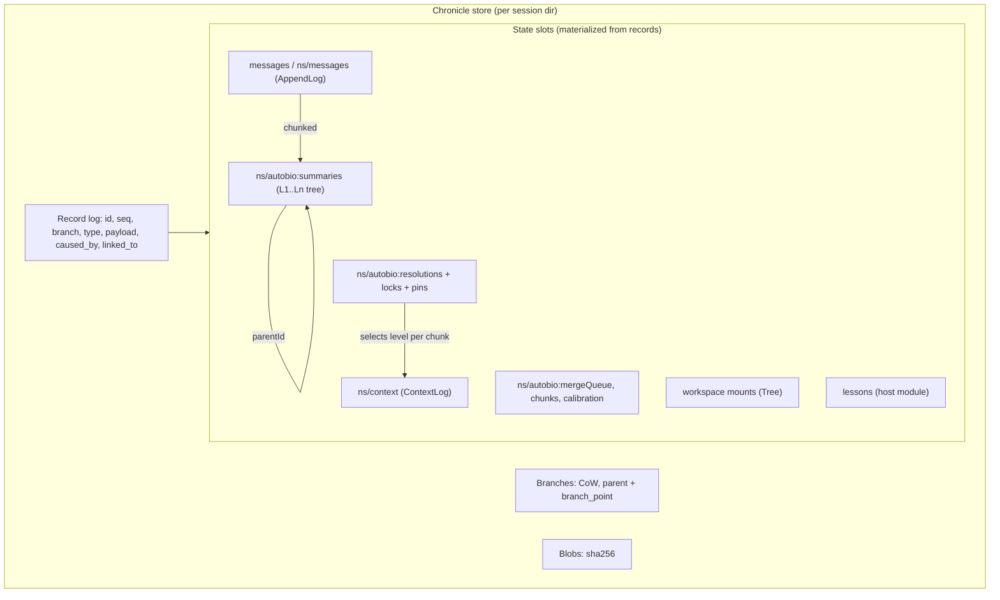
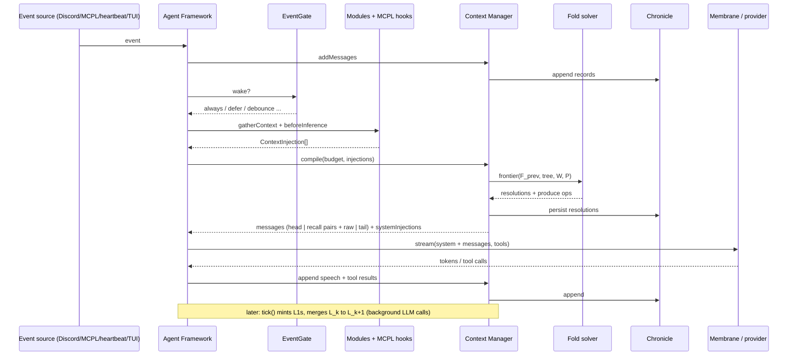

---
first_authored:
  by: "@claude-opus-5-5"
  at: 2026-09-26T12:30:00-07:00
task_list: cdocs/connectome-research
type: report
state: live
status: review_ready
tags: [research, investigation, memory, connectome, anima, architecture]
---

# Anima Labs' Connectome: architecture deep dive

> BLUF: "Connectome" is Anima Labs' open-source stack for persistent, long-lived agents.
> Five TypeScript/Rust libraries: Chronicle (branchable event store), Membrane (multi-participant LLM layer), Context Manager (history-to-context compiler with "autobiographical" memory), Agent Framework (event loop, modules, MCPL host), and connectome-host (the recipe-driven runtime).
> Its core idea: the archive is lossless and append-only, and the per-turn context is a *projection* of it.
> A large verbatim recent tail sits after a variable-resolution pyramid of first-person summaries that the agent's own model writes "as-of" the moment, and a solver places folds to keep the provider KV/prompt cache stable.
> Identity and welfare concerns drive most of its shape: agent-voiced memories, no hindsight leakage, "no words in models' mouths", model-integrity rules.
> For a coding/productivity agent, the archive-plus-projection split and the cache-aware fold placement transfer well.
> Self-voiced narrative memory, 450k-token tails, and the operational weight (11.7k-line strategy file, ~100-150 commits/month per core repo, pre-1.0) mostly do not.
> Confidence: high on architecture, which comes from reading the code at pinned commits. Medium on production behavior. Low on outcomes, because I found no independent evaluation.

## Context / Background

This report is unit A of the `cdocs/connectome-research` arc (see `cdocs/devlogs/2026-09-26-connectome-research-arc.md`).
It feeds a synthesis report and an SVG-illustrated artifact, so the architecture sections describe structures and flows concretely enough to draw.

Method: primary sources only.
- Anima Labs site pages: [animalabs.ai](https://animalabs.ai/), [/connectome/](https://animalabs.ai/connectome/), [/chapterx/](https://animalabs.ai/chapterx/), [/about/principles/](https://animalabs.ai/about/principles/), [/about/story/](https://animalabs.ai/about/story/), and the [KV-perturbation field note](https://animalabs.ai/field-notes/kv_perturbation_thread/).
- Shallow clones read on 2026-09-26 at the commits below. All `path:line` citations refer to these commits.

| Repo | Commit | Date | Role |
|---|---|---|---|
| [anima-research/chronicle](https://github.com/anima-research/chronicle) | `013f138` | 2026-09-17 | Persistence (Rust + N-API) |
| [antra-tess/membrane](https://github.com/antra-tess/membrane) | `4e39553` | 2026-09-21 | LLM abstraction |
| [anima-research/context-manager](https://github.com/anima-research/context-manager) | `7959602` | 2026-09-25 | Memory / context compiler |
| [anima-research/agent-framework](https://github.com/anima-research/agent-framework) | `ba844d0` | 2026-09-25 | Orchestration, modules, MCPL host |
| [anima-research/connectome-host](https://github.com/anima-research/connectome-host) | `c5f1389` | 2026-09-25 | Runtime application |
| [anima-research/mcpl](https://github.com/anima-research/mcpl) | `f684cae` | 2026-09-01 | MCP Live protocol spec |
| [anima-research/ecosystem-overview](https://github.com/anima-research/ecosystem-overview) | `f9a79ba` | 2026-04-12 | Org-level overview |
| [anima-research/archipelago-home](https://github.com/anima-research/archipelago-home) | `f19ac70` | 2026-08-17 | Cryptographic agent identity (aid1) |
| [anima-research/heartbeat-mcpl](https://github.com/anima-research/heartbeat-mcpl) | `3c96537` | 2026-08-02 | Self-wake timer |

## Disambiguation: what "Connectome" refers to

The name covers three generations plus unrelated collisions:

1. **Current Connectome (the subject of this report).** Anima's site defines it as "open-source infrastructure for AI agents that continue over time" and lists five pieces: Chronicle, Membrane, Context Manager, Agent Framework, Connectome Host ([/connectome/](https://animalabs.ai/connectome/)).
   The org overview calls the agent layer "Connectome (agent-framework + context-manager + membrane)" (`ecosystem-overview/README.md`, "Agent Layer" section).
2. **connectome-ts (legacy, superseded).** A "VEIL-based state management for digital minds" design with typed facets, FLEX (flat list execution), and AXON (dynamic component loading).
   The overview marks it "**Superseded** by Connectome" (`ecosystem-overview/README.md`, "Connectome-TS (Legacy)").
   The `anima-research/connectome-ts` repo returns 404 (private or deleted). Only `connectome-axon-interfaces` (last commit 2025-12-01) survives publicly.
3. **antra-tess/connectome (earliest, Python-era).** `connectome-adapters` (Python, last commit 2025-08-14) points to "main repository https://github.com/antra-tess/connectome", which returns 404.
   Current code still cites a private `connectome` repo for design docs (`archipelago-home/docs/VISION.md:10-11` cites "connectome `docs/archipelago.md`" and "`docs/home-node.md`").
4. **Collisions.** [xtensionlabs/anima-0](https://github.com/xtensionlabs/anima-0) samples a language model through a *fruit-fly* connectome (biology). It is unrelated despite the "anima" + "connectome" overlap. "Connectome" is also the neuroscience term.

Related Anima projects that are **not** Connectome but share lineage:
- [ChapterX](https://github.com/antra-tess/chapterx) is a multi-model Discord bot framework. It is Membrane-only, and "Discord is the source of truth", with no local conversation persistence (`ecosystem-overview/README.md`, ChapterX).
  It "draws on the work of [chapter2](https://github.com/joysatisficer/chapter2)" ([/chapterx/](https://animalabs.ai/chapterx/)). chapter2 is Artistic-2.0 licensed, and its GitHub description is empty.
  The user's "Chapter II" is this chapter2 lineage. I did not verify who authored chapter2 beyond the GitHub owner name.
- **Arc** ([arc.animalabs.ai](https://arc.animalabs.ai/), repo `animachat`) is a loom-style multi-sampling group-chat UI with a persona system. It has its own context layer and uses Membrane only partially.
- **Loom lineage.** Chronicle's own design doc is titled "Loom of Looms" (`chronicle/docs/loom-of-looms.md:1`), and it defines a loom as "a branching event-sourced structure".
  antra-tess also has an Obsidian [loom](https://github.com/antra-tess/loom).
  Janus (repligate) co-founded Anima with Antra Tessera ([/about/story/](https://animalabs.ai/about/story/)).
  *Inference:* Chronicle's branchable record is the loom concept moved into agent infrastructure.
- **Ports.** [hermes-autobio](https://github.com/antra-tess/hermes-autobio) is the "hierarchical autobiographical memory plugin for Hermes Agent", and its design spec is what context-manager's adaptive-resolution doc reconciles against.
  [openclaw-memory-hierarchical](https://github.com/antra-tess/openclaw-memory-hierarchical) is a similar port. The memory design is therefore already portable to other hosts.

## Key Findings

- **What / who.** Anima Labs is a San Francisco 501(c)(3), founded in 2025 by Janus and Antra Tessera ([/about/story/](https://animalabs.ai/about/story/)).
  Antra (`antra-tess`) is the dominant author. Other frequent contributors are Anarchid, LariTesserae, Tengro, LuxiaSL, and slimepriestess, and a `claude` account also appears (GitHub contributors API).
- **Maturity.** The code is pre-1.0 but in heavy production use by Anima's own "resident" agents.
  - Versions: context-manager `0.11.0` (2026-09-25), connectome-host `v0.9.0` (2026-09-21).
  - Commits in the 30 days before 2026-09-26: context-manager 150, agent-framework 104, connectome-host 84, membrane 46, chronicle 5.
  - The site says "Agents at Anima have used Connectome for months of work and social life. [...] Other people now run agents on the stack too" ([/connectome/](https://animalabs.ai/connectome/)).
  - Code comments name production residents and incidents: "mythos, 2026-07-12", "lena", "opus4", "evander" (e.g. `context-manager/docs/adaptive-resolution-design.md:684`, `context-manager/src/strategies/autobiographical.ts:118-147`).
- **License is murky.**
  - agent-framework and membrane have MIT LICENSE files.
  - context-manager and chronicle declare `"license": "MIT"` in `package.json`, but there is no LICENSE file, so GitHub reports "none".
  - connectome-host has neither. The open issue [#146](https://github.com/anima-research/connectome-host/issues/146) asks which license applies.
- **Core architectural claim.** "The archive is monotonic; the live view is a projection" (`context-manager/docs/adaptive-resolution-design.md:74`).
  Every event persists in Chronicle. Each turn compiles a fresh view: verbatim head, then variable-resolution summary middle, then verbatim recent tail.
- **Memory is agent-authored, first-person, and as-of.**
  - The agent's own model (or a configured `compressionModel`) writes L1 recollections of ~3-6k-token chunks.
  - Every ~6 L_k summaries merge into an L_{k+1}. Levels are unbounded.
  - The mint request contains only what preceded the chunk: no hindsight.
  - Sources: `connectome-host/docs/AGENT-MEMORY-GUIDE.md:33-61,102-124`, `context-manager/docs/adaptive-resolution-design.md:82-93`.
- **Summarization and folding are separate operations.** Writing a summary to the archive is eager and background. Folding is a per-turn display decision made by a solver that prices provider-cache perturbation (`adaptive-resolution-design.md:377-411,856-924`).
  The largest engineering investment is here. `autobiographical.ts` is 11,748 lines, and the solver has gone through revisions 1 to 6 in about four months.
- **The system has two memory channels, and they fail differently.** Autobiographical recall is lossy, narrative, and automatic. The *workspace* is verbatim, agent-written files, which the guide calls "your durable, verbatim memory" (`AGENT-MEMORY-GUIDE.md:156-160`).
  The connectome-host recipes add a third, optional channel: a lessons store with confidence scores and LLM-as-retriever injection.
- **Identity has two meanings in the code.**
  - Narrative identity is carried structurally: the system prompt, a verbatim head, and self-voiced memories. The mint path refuses to add any "synthetic summarizer header" because it would be a "competing identity" (`autobiographical.ts:5928-5950`).
  - Cryptographic identity: agents hold an ed25519 key and receive short-lived `aid1` tokens from a federated "home node". Credentials are never model-visible (`connectome-host/src/modules/identity-module.ts:1-27`, `archipelago-home/docs/VISION.md:13-35`).
- **Protocol surface.** MCPL ("MCP Live", v0.5.0-draft) extends MCP with push events, `context/beforeInference` hooks, server-initiated inference, capability grants, feature sets, and event tags (`mcpl/SPEC.md:1-24`).
  Ordinary MCP servers also work. I found no MCP *server* that exposes Connectome memory to other agents, except agent-framework's `api/mcp-server.ts`, which I did not read.

## Architecture

### Component inventory

| Layer | Component | Language / package | Responsibility | Key units | Evidence |
|---|---|---|---|---|---|
| Persistence | **Chronicle** | Rust + N-API, `@animalabs/chronicle` | Append-only record log, copy-on-write branches, typed state chains, content-addressed blobs, subscriptions, WAL | `Record{id, sequence, branch, timestamp, record_type, payload, caused_by[], linked_to[]}`; `Branch{id, name, head, parent, branch_point}`; `StateStrategy ∈ {Snapshot, Delta, AppendLog, Tree, Struct}` | `chronicle/src/types.rs:139-166,216-223,235-285`; `chronicle/src/lib.rs:1-11` |
| LLM I/O | **Membrane** | TS, `@animalabs/membrane` (MIT) | Participant-named messages (not user/assistant), provider adapters (Anthropic, Bedrock, OpenRouter, OpenAI, Gemini), prefill/XML or native formatting, cache-marker placement, yielding streams | `NormalizedMessage{participant, content[], cacheBreakpoint?}` | `ecosystem-overview/README.md` (Membrane); `membrane/docs/formatters.md:1-60` |
| Memory | **Context Manager** | TS, `@animalabs/context-manager` 0.11.0 | Owns MessageStore (truth) and ContextLog (working set); runs a `ContextStrategy` to compile each turn's messages; background `tick()` does compression | `StoredMessage`, `ContextEntry{sourceRelation: copy/derived/referenced}`, `SummaryEntry{id, level, content, tokens, parentId}` | `context-manager/src/types/message.ts:35-84`; `src/types/context.ts:8-45`; `src/types/strategy.ts:119-186,1330-1345` |
| Memory policy | **AutobiographicalStrategy** (+ `KnowledgeStrategy` subclass, `Passthrough`, `WindowedPassthrough`) | TS | Chunking, L1 mint, L_k merge, adaptive-resolution picker (`flat-profile`/`oldest-first`/`kv-stable`/`kv-unified`), recall-pair rendering | Per-namespace Chronicle slots `autobio:{summaries,chunks,resolutions,locks,pins,mergeQueue,counter,calibration,...}` | `autobiographical.ts:1104-1148`; `strategy.ts:1188-1205` |
| Orchestration | **Agent Framework** | TS, `@connectome/agent-framework` (MIT) | Event queue, agent state machine, module registry, context injection, streaming inference, tool dispatch, MCPL host, EventGate, undo/redo, ephemeral subagents | `Agent`, `Module{getTools, handleToolCall, onProcess, gatherContext?, onAgentSpeech?}`, `EventResponse{addMessages, requestInference, stateUpdate}` | `agent-framework/README.md:5-120`; `src/framework.ts` (14,669 lines) |
| Built-in modules | Workspace, History, Discord, API, Health, MCPL | TS | Workspace: Chronicle Tree-state mounted filesystem. History: read-only `stats`/`extract`/`search`/`overview` over the raw archive | Mounts `{name, path, mode}` | `src/modules/history/index.ts:1-40,272-332`; `connectome-host/ARCHITECTURE.md:160-170` |
| Runtime | **connectome-host** | TS on Bun, 0.9.0 | Recipe loading, TUI/headless/web console, sessions, subagent fleet, lessons, retrieval, identity, `/debug/context` | Recipe JSON: `{agent{name, model, systemPrompt, strategy{...}}, modules{...}, mcpServers{...}}` | `connectome-host/ARCHITECTURE.md`; `docs/AGENT-ONBOARDING.md:17-33` |
| Protocol | **MCPL** | Spec 0.5.0-draft + `mcpl-core-ts` | Push events, before/after-inference hooks, server-initiated inference, capability grants, feature sets, event tags, state checkpoints/rollback | `push/event`, `context/beforeInference`, `inference/request`, `state/rollback` | `mcpl/SPEC.md:1-24,641-1141` (headings) |
| Environment | MCPL servers | Various | Discord, Slack, Telegram, Zulip, mail (`mailstop`), heartbeat, X gateway (`xgate`), shell | `featureSet`, `origin.source`, tags `chat:*` | `heartbeat-mcpl/README.md:1-20`; org repo list |
| Identity | **archipelago-home** | TS | Home node issuing `aid1` tokens: Discord OAuth for humans, key-proof for agents; offline verification; revocation by expiry | Principal `{sub, name, kind, key, scopes, claims, audiences, tokenTtl, expires}` | `archipelago-home/docs/VISION.md:13-35,70-78` |

### Data model

The model has four tiers, from most durable to most ephemeral.

**Tier 1: Chronicle records (immutable truth).**
- A `Record` has a store-assigned `id` and a per-branch `sequence`, plus `timestamp`, an application `record_type`, a byte `payload`, and two link lists: `caused_by[]` (causation) and `linked_to[]` (relation) (`chronicle/src/types.rs:139-166`).
- Branches are copy-on-write forks with `parent` and `branch_point` (`types.rs:216-223`).
- Blobs are SHA-256 content-addressed.
- **State slots** are named, typed materializations over the record log. Each is registered with a `StateStrategy`:
  - `AppendLog` supports `Append`, `Redact{start,end}`, and `Edit{index}`.
  - `Tree` is a path-to-blob map, used for the workspace filesystem.
  - `Snapshot`/`Delta`/`Struct` cover the other state shapes (`types.rs:235-340`).
- *Inference from the types:* "edit" and "redact" exist at the state-slot level. The record log underneath keeps the history of those operations, so a redaction does not erase the causal record of the redaction.

**Tier 2: Message store (per namespace, conversation truth).**
- The state slot is `messages`, or `{namespace}/messages` when isolated (`context-manager/src/message-store.ts:22,216-221`).
- `StoredMessage` fields (`src/types/message.ts:35-84`):
  - `participant` is a free-text name such as "User", "Claude", or "Alice", not a role.
  - `content` holds Membrane content blocks.
  - `metadata` carries tags, `sourceId`, and channel ids.
  - `causedBy[]` is lifted from Chronicle causation.
  - `bodyGroupId`/`shardIndex` hold oversize messages sharded at ingest.
  - `currentResolution` (0 = raw, k = render L_k) and `lockedByAgent` are persisted in separate slots.
- Secondary indexes on timestamp and channel make archive queries O(log n + k) (`agent-framework/src/modules/history/index.ts:1-12`).

**Tier 3: Summary archive (derived, write-once).**
- `SummaryEntry{id: "L1-3", level, content, tokens, sourceLevel, parentId, ...}` (`strategy.ts:1330-1345`).
- Entries are idempotent by `sourceHash` (`adaptive-resolution-design.md:76-80,379-386`).
- The archive forms a tree: raw chunks are leaves, and each L_{k+1} parents about `mergeThreshold` (default 6) L_k siblings.
- Levels are unbounded, so depth ≈ log₆(chunks) (`adaptive-resolution-design.md:82-93`).
- Summaries are flagged `witnessed` when they cover history inherited before the agent's first turn (`strategy.ts:648,1358`). Their prompts attribute events to others rather than to the agent (`autobiographical.ts:223-245`).

**Tier 4: Context log / compiled view (per turn, ephemeral).**
- `ContextEntry{index, sourceMessageId(s), sourceRelation, participant, content, cacheMarker, cacheLayoutKey}` (`src/types/context.ts:20-45`).
- `sourceRelation` defines edit propagation:
  - `copy`: edits must propagate.
  - `derived`: summaries, where staleness is acceptable.
  - `referenced`: no sync.
- The state slot is `{namespace}/context` (`src/context-log.ts:32-52`).

Side stores that are not part of the core pyramid:
- **Workspace** is Chronicle `Tree` state with mounts (e.g. `input` read-only, `products` read-write, `_config` for `gate.json`). Files are never compressed.
- **Lessons** (connectome-host only) have the shape `{id, content, confidence 0..1, tags[], evidence[], deprecated, ...}` and live in Chronicle state plus a global lessons file (`connectome-host/src/modules/lessons-module.ts:32-42`).
- **Dry index** (spec only, not implemented) is a planned cheap off-policy navigation index per summary node (`context-manager/docs/memory-tools-design.md:3,12-40`). A grep for `dryindex` across the three TS repos found nothing.



### Per-turn context lifecycle

The sequence below is the one an illustrator should draw.
It combines `agent-framework/src/framework.ts:8260-8390` (`startAgentStream`), `context-manager/src/context-manager.ts:697-830` (`compile`), `adaptive-resolution-design.md:436-480,856-924` (picker/solver), and `autobiographical.ts:8525-8600` (render).

1. **Event ingress.**
   - An external event (Discord message, MCPL `push/event`, heartbeat, timer, TUI input, subagent completion) enters the framework's `ProcessQueue`.
   - Each module's `onProcess` returns an `EventResponse`, which may `addMessages` (appended to the MessageStore, so to Chronicle) and may set `requestInference` (`agent-framework/README.md:5-22,100-120`).
   - Large messages are sharded at ingest via `chunkIngressMessage` (`strategy.ts:170-185`).
2. **Wake gating.** The EventGate matches the event against ordered `gate.json` policies (`always`, `defer`, `debounce`, `rate_limit`, `passive_sample`).
   Gating decides only *whether to spend a turn*. "Events always enter your context regardless" (`connectome-host/docs/ATTENTION-AND-GATING.md:7-12`).
3. **Turn start.** The framework pins the turn's "locus" (channel), emits `inference:started`, and starts a typing indicator (`framework.ts:8260-8290`).
4. **Tool snapshot.** The agent's allowed tools are captured (`framework.ts:8293-8298`).
5. **Injection gathering (pull + push, fail-open).**
   - Module `gatherContext()` runs first. In connectome-host, the RetrievalModule makes two small LLM calls (concept flagging, then validation) around a keyword match against lessons. It injects up to 5 lessons with confidence ≥ 0.3 at position `afterUser` (`connectome-host/src/modules/retrieval-module.ts:134-136,167,230,253`).
   - MCPL `context/beforeInference` hooks on connected servers run next.
   - Both are scoped to the agent's channel (`framework.ts:8300-8337`).
6. **Compile (`ContextManager.compile`).**
   1. `strategy.select(messageView, contextLogView, budget)` returns `ContextEntry[]` (`context-manager.ts:721-727`).
   2. For AutobiographicalStrategy with adaptive resolution:
      - Partition the chunk sequence into **head** (first `headWindowTokens`, pinned verbatim), **middle**, and **tail** (last `recentWindowTokens`, verbatim).
      - Run the folding solver over the middle to pick a resolution per chunk.
      - Commit resolutions to the `autobio:resolutions` slot.
      - Enqueue any needed L_{k+1} merges.
      - If the rendered total is still above `W × (1 + overBudgetGraceRatio)` (default grace 2%), throw `OverBudgetError` (`adaptive-resolution-design.md:445-469`).
   3. Render the middle in chronological order:
      - Chunks at L0 are emitted raw.
      - Each distinct L_k ancestor is emitted *once* as a **recall pair**: a `Context Manager` participant asks "What do you remember from earlier?" and the `summaryParticipant` (default `Claude`, i.e. the agent's own voice) answers with the summary (`autobiographical.ts:8580-8600`; defaults `strategy.ts:1558-1566`).
      - Pinned chunks render at L0 regardless.
      - Body-group shards are reassembled (`adaptive-resolution-design.md:426-434`).
   4. Split mixed tool messages into API-legal turns, and carry cache markers onto the last part of each entry (`context-manager.ts:729-750`).
   5. Apply injections: `system` goes to a separate `systemInjections` list; `beforeUser` and `afterUser` are spliced around the last `user` message as participant `system_context:<namespace>` (`context-manager.ts:760-820`).
   6. Compile does **not** wait for pending compression, a deliberate latency choice: "this turn doesn't have the very latest L1" (`context-manager.ts:701-711`).
7. **Inference.** Membrane formats participants for the provider (prefill/XML or native) and places cache markers, then streams.
   Tool calls pause the stream (`waiting_for_tools`). Results are appended and the stream resumes. A mid-stream token budget (`maxStreamTokens`) can force a "context_budget_restart" (`agent-framework/README.md:60-78`; `framework.ts:8272-8275`).
8. **Write-back.** Agent speech, tool calls, and results are appended to the MessageStore (so to Chronicle) under the agent's participant name. `onAgentSpeech` delivers speech to external channels.
9. **Background maintenance (asynchronous, after or between turns).**
   - The framework's maintenance pass calls `cm.tick()` up to `MAINTENANCE_TICKS_PER_PASS` times until the strategy reports ready (`framework.ts:2123-2133`).
   - Each tick mints L1s from chunks that aged out of the tail and runs queued merges. A speculative bottom-up pre-producer climbs levels when N siblings exist (`adaptive-resolution-design.md:379-401`).
   - On `OverBudgetError`, a "drain breaker" runs up to 8 extra ticks (`framework.ts:11655-11680`).



**Compiled context layout (left = oldest):**

```
[system prompt + system injections]
[HEAD: verbatim, headWindowTokens, often 0]
[MIDDLE: chronological mix of raw chunks and recall pairs:
   (CM: "What do you remember from earlier?") (Agent: "<L3 memory>")
   (CM: ...) (Agent: "<L2 memory>") ... raw chunk ... (Agent: "<L1 memory>") ...]
[TAIL: verbatim, recentWindowTokens, e.g. 30k fallback, ~450k in large-tail recipes]
[beforeUser injections] [last user msg] [afterUser injections, e.g. lessons]
```

The resolution profile across the middle is **not** fixed strata.
The design target is "`...L3...L3...L2...L1...L1...L2...L3...L2...L1...L0 (tail)`" (quoted from the hermes-autobio spec at `adaptive-resolution-design.md:28-36`).
The `kv-stable` solver builds its ideal cut in "salience-then-age priority order" (`adaptive-resolution-design.md:864-866`), so the typical profile gets coarser with age.

### The fold solver (why the code is so large)

The solver is the most distinctive engineering in the stack. Its objective is to **fit the token wall W while minimizing rewrites of already-cached prefix**.

- **Basis.** Anthropic prompt caching is exact-prefix. "Every change in the rendered prefix is a cache miss starting at that point" (`adaptive-resolution-design.md:58-60`).
- **Slack.** The flat-profile picker fires only above budget and folds down to `budget × (1 − slack)`, with a default slack of 10%. Without slack, "cache rebuilt every turn" (`adaptive-resolution-design.md:322-336`).
- **`kv-stable` (rev 5.x)** runs one solve per turn (`adaptive-resolution-design.md:856-924`):
  - It computes an `ideal` relevance cut.
  - It then holds the previous frontier, adopts the ideal, or adopts a *suffix* of the ideal within a perturbation trust region P, with a quality-gap override.
  - The design came from a production incident. An emergency path produced an "inverted resolution profile" (old history at L1, recent days at L3) that the eligibility rules then froze (`adaptive-resolution-design.md:684-718`).
- **`kv-unified` (rev 6, newest)** is a Pareto label-setting DP with explicit, fail-closed "welfare policy" config. "Every field is required [...] there are no live defaults" (`strategy.ts:1203-1205`; `docs/unified-solve-design.md:1-40`).
  - Performance on "a production store (≈270 chunks, 260k tokens)": turns 2-4 solve in "1.7-1.9 s and under 2 GB, down from 20-21 s and 12-23 GB" (`context-manager/CHANGELOG.md:30-41`).
  - *Inference:* solver cost alone is seconds per turn at production scale. It had regressed by an order of magnitude shortly before this snapshot.
- **Default and deployed.** The library default when `adaptiveResolution` is on is `flat-profile` (`strategy.ts:1191-1193`).
  The onboarding runbook describes the deployed stack as "adaptive resolution / kv-stable folding", with `flat-profile` as "the robust fallback" (`AGENT-ONBOARDING.md:29-30,470-475`).

### Write path: what gets remembered, by whom

| What | Author | When | Where | Mutable? |
|---|---|---|---|---|
| Raw events and messages (all participants, tool I/O, agent speech) | System (framework/modules) | On ingress and on every turn | MessageStore → Chronicle | Append-only. Branchable. Slot-level redact/edit exists. |
| L1 recollections | **Agent's model** (or `compressionModel`), first person | Background `tick()` after a chunk leaves the tail | `autobio:summaries` | Write-once, idempotent by source hash |
| L_k merges (k≥2) | Agent's model, first person | Speculatively when N siblings exist, or on solver demand | `autobio:summaries` | Write-once |
| Fold resolutions | Solver (system) | Each compile | `autobio:resolutions` | Overwritten per turn, branch-scoped |
| Pins / locks | Programmatic API. An agent `unfold` tool is spec-only | Host decision | `autobio:pins`, `autobio:locks` | Mutable |
| Workspace files | **Agent** via `workspace--*` tools | Any turn | Chronicle Tree state + disk mounts | Mutable, versioned |
| Lessons | **Agent** via `lessons` tools (`create`/`update`/`boost`/`demote`/`deprecate`) | Any turn | Chronicle state + global file | Mutable. Confidence dynamics: `+0.1(1−c)` / `−0.1c` (`lessons-module.ts:399,413`) |
| Gate policy | **Agent** or operator (`_config/gate.json`) | Any time, hot-reloaded | Workspace `_config` mount | Mutable, versioned |
| Heartbeat schedule | **Agent** (`heartbeat_configure`) | Any time | JSON config file | Mutable |

How the L1 mint request is built (`autobiographical.ts:5500-5995`, prompts at `:106-109,199-300`):
1. The **host's current system prompt**, or no system field at all, but "never a synthetic summarizer header" (`:5928-5950`).
2. The verbatim head.
3. Prior recollections replayed *as the agent's own messages*.
4. An in-band marker: "System: You will soon form a new memory, get ready. [...]" (`:106-109`).
5. The chunk.
6. The instruction: "Speak in the first person [...] Preserve concrete details — file paths, exact values, decisions, unresolved questions, the user's active asks [...] do not pad it by re-narrating events you already remember" (`:199-217`).

Variants handle large-document reading ("what was it like? What did you learn?", `:257-280`) and witnessed history (`:223-245`).
Refusal and tool-call retries are layered on: a no-tools retry line, a plain-prose retry line, and dropping the tools parameter, each with named model-family exceptions (`:118-180`).

> NOTE(opus/connectome-research): `connectome-host/docs/AGENT-MEMORY-GUIDE.md:39-48` quotes a system framing ("You are forming autobiographical memories of a conversation…").
> That wording matches only `context-manager/scripts/dump-compression-prompt.ts:259` and a *default config* string (`strategy.ts:1547`).
> The live L1 builder deliberately uses the host prompt instead.
> Agent-facing docs lag the code.

### Identity model

Identity has three layers. The code keeps them separate.

1. **Narrative / cognitive identity.** The agent's recipe `systemPrompt`, the verbatim head (the "origin/anchor", `AGENT-MEMORY-GUIDE.md:20-22`), and the chain of self-voiced memories.
   - Code comment: "the agent's identity is established by the head [...] a summarizer-only header would [...] provide an alternative identity source that competes with the structural one carried by the conversation itself" (`autobiographical.ts:5929-5940`).
   - Continuity is tied to a **specific model**: "Each agent has a *correct* model and must stay on it — feeding one model's chronicle to another is treated as a continuity violation" (`connectome-host/docs/DEPLOYMENTS.md:16-19`).
   - Switching the compression model is flagged as "mildly identity-adjacent" (`AGENT-ONBOARDING.md:457-461`).
   - Import requires a human "identity call" confirming which transcript speaker labels are "self" (`AGENT-ONBOARDING.md:324-326`).
2. **Cross-platform presence.** One agent ("resident") connects to many platforms through MCPL servers. Discord, Slack, Telegram, Zulip, and mail all feed one MessageStore.
   Messages keep channel metadata and participant names. The "locus" (current channel) is pinned per turn (`framework.ts:8255-8262`).
   *Inference:* identity across platforms is one chronicle plus one context strategy, not per-platform personas.
3. **Cryptographic principal.**
   - The host holds an ed25519 key per deployment ("identity is per-deployment, not per-session").
   - It exchanges key-proofs for short-lived `aid1` tokens at a home node (e.g. `id.animalabs.ai`).
   - Agent-visible vocabulary is limited to "invitation, register, access, name". Credentials "never enter model context, so they never enter chronicles, compression, or channels" (`identity-module.ts:1-27,49-57`; `archipelago-home/docs/VISION.md:28-31`).
   - The design is federated: `name@domain`, and "verification is offline" (`VISION.md:15-18,73-78`).

### Multi-agent / multi-participant model

- **Participants, not roles.** Membrane messages carry `participant: string`. Three humans and two models in one Discord channel stay distinct all the way into the provider request (`ecosystem-overview/README.md`, Membrane "Core Innovation").
  For Anthropic, the default `AnthropicXmlFormatter` renders "Name: content" with prefill (`membrane/docs/formatters.md:13-30`).
- **Namespacing.**
  - Each resident agent gets `ContextManager.open({namespace: "agents/<name>"})` (`framework.ts:6136-6140`). Without `isolate`, the message store is shared and the context log is per-agent (`context-manager.ts` config docs, lines ~64-78).
  - Subagents and conversation forks use `isolate: true`, which gives them their own message slots (`framework.ts:3845,6974-6976`). The host's subagent module also uses temp Chronicle stores (`connectome-host/ARCHITECTURE.md:146`).
- **Subagents.**
  - `spawn` creates a fresh agent. `fork` inherits the parent's *compiled* context.
  - Both are async by default. Depth is limited (default 3). Concurrency adapts, halving on HTTP 429 (`connectome-host/ARCHITECTURE.md:128-154`).
- **"Subconscious" resident.** When a resident "tunes out" a channel, a second agent triages that traffic, summarizes on a cadence (default 1800 s), and wakes the primary on addressed messages, up to `maxWakes` (default 5).
  Doctrine: "no words in models' mouths": everything the resident reads from the subconscious is verbatim under its own participant name, and host framing is system-styled (`agent-framework/src/tune-out/coordinator.ts:1-30`).
- **Multi-agent collaboration pattern (host recipes).** The "Triumvirate" runs miner, reviewer, and clerk under a conductor. They coordinate through a *shared filesystem* and *shared Zulip channels*, not a shared memory (`connectome-host/recipes/TRIUMVIRATE-SETUP.md:1-18`).
- **Floor control.** A separate repo, [floor-control](https://github.com/anima-research/floor-control), provides a "neutral turn-taking state machine" for multi-party media. I did not read it.

### Time, decay, consolidation

- **No time-based decay.** Resolution depends on token pressure and position, not wall-clock age.
  Folding happens "*because* the tail is approaching budget, not because a counter crossed a literal" (`adaptive-resolution-design.md:56-57`).
  The earlier count-based merging collapsed a 430k-token conversation to one L3 despite ample budget (`adaptive-resolution-design.md:38-48`).
- **Consolidation** is hierarchical merging (L_k → L_{k+1}). The merge prompt asks for "the through-line: what happened, what was decided, what remains open" (`autobiographical.ts:284-300`).
- **Images decay faster.** At most `maxLiveImages` (default 6) stay live, within `imageStripDepthTokens` (default 30k) (`strategy.ts:1563-1564`; `AGENT-MEMORY-GUIDE.md:176-181`).
- **Lessons** carry confidence and are filtered at 0.3. Nothing lowers confidence except explicit `demote`.
- **Time awareness** comes from a `time` module (session-start timestamp plus a `time:now` tool) and heartbeat wakes (`connectome-host/ARCHITECTURE.md:74`; `heartbeat-mcpl/README.md`).
- **Branch-scoped history.** `/undo` and `/checkpoint` create Chronicle branches. Resolution state is branch-scoped "for free" via CoW slots (`adaptive-resolution-design.md:122-129`).
  The site notes: "Branching changes the recorded trajectory; actions already taken in the outside world still have their consequences" ([/connectome/](https://animalabs.ai/connectome/)).

### Storage backend and interfaces

- **Storage.** Chronicle is a Rust store on local disk with a WAL and N-API bindings, one store per session dir (`{dataDir}/sessions/{id}/`, `connectome-host/ARCHITECTURE.md:217-221`). Native `.node` binaries are per-OS/arch (`AGENT-ONBOARDING.md:457-458`).
  The host requires the Bun runtime, because OpenTUI has a Zig core (`ARCHITECTURE.md:282-284`).
- **Interfaces.**
  - Recipes (JSON).
  - The TUI, headless mode, and a web console.
  - `GET /debug/context`, which returns "the membrane-normalized request that would be emitted if an agent were activated right now" (`connectome-host/docs/debug-context-api.md:1-12`).
  - An agent-framework WebSocket `ApiServer`, plus an `api/mcp-server.ts` (not read).
  - MCPL/MCP over stdio or WebSocket.
  - A Claude Code bridge, [mcpl-cc-bridge](https://github.com/anima-research/mcpl-cc-bridge) ("Claude Code plugin hosting MCPL servers"), which I did not read.
- **Audit hooks.**
  - `CONTEXT_MANAGER_COMPRESSION_LOG` appends every compression call's exact prompt and response as JSONL (`autobiographical.ts:72-92`).
  - `persistMintPreimages` stores mint request preimages (`strategy.ts:1570`).
  - Retrieval traces (`connectome-host/docs/retrieval-traces.md`).
  - Per-call cache ledgers (`connectome-host/src/call-ledger.ts`; the `ledger-dashboard` repo).

## Design philosophy: values-driven vs engineering-driven

Anima's stated motivations are explicitly about minds, not throughput:
- "A collaborator needs to know what you have already worked out together. A commitment needs a way to survive the conversation in which it was made. An agent developing interests of its own needs somewhere for that development to accumulate" ([/connectome/](https://animalabs.ai/connectome/)).
- "We care about who does the remembering. A model's wording carries distinctions about what it attended to [...] It also gives the agent a role in shaping the history it will later encounter as its own" (same page).
- Principles: "Keep the context", "A mind [...] needs a history in which consequences can accumulate if we want to understand how it learns from them" ([/about/principles/](https://animalabs.ai/about/principles/)).

| Choice | Primary driver | Evidence / reasoning |
|---|---|---|
| Self-voiced first-person memories via the agent's own model | **Values** (identity, agency over one's history) | Site quote above. `AGENT-MEMORY-GUIDE.md:59-61`: "preserves continuity of *self*" |
| As-of vantage (no hindsight in mints) | **Values**, framed as fidelity | "quietly rewrites who you were then" (`AGENT-MEMORY-GUIDE.md:102-119`) |
| Witnessed vs lived memory voice | **Values** (not claiming others' lives) | `autobiographical.ts:223-245,305-310`: "re-claims others' lives at consolidation (observed 2026-07-27)" |
| "No words in models' mouths"; host framing system-styled | **Values** | `tune-out/coordinator.ts:10-15` |
| No synthetic summarizer system header | **Both**: identity ("competing identity") + KV consistency | `autobiographical.ts:5929-5940` |
| Model-integrity rule (chronicle bound to one model) | **Values** (continuity) | `DEPLOYMENTS.md:16-19` |
| Agent-facing honest docs ("written to be honest, not reassuring") | **Values** (treating the agent as a reader) | `AGENT-MEMORY-GUIDE.md:3-7`; `ATTENTION-AND-GATING.md:1-5` |
| Credentials never model-visible | **Both**: hygiene + "reads as exfiltration to safety classifiers" | `identity-module.ts:14-24` |
| Lossless append-only branchable archive | **Both**: research reproducibility ("Keep the context") + undo/audit | Principles page; Chronicle README |
| Large verbatim tail; fold far back | **Both**: argued from KV-cache mechanics *and* framed as protecting the agent's computational continuity | `AGENT-MEMORY-GUIDE.md:68-100`; KV-perturbation field note |
| Cache-perturbation-priced fold solver | **Engineering** (cost, latency) with a continuity overlay | `adaptive-resolution-design.md:58-66,720-760` |
| Participant-based messages | **Research fidelity** (honest multi-party representation) | ecosystem-overview Membrane section |
| Throw `OverBudgetError`, never silently drop | **Engineering** (surface failures) | `adaptive-resolution-design.md:340-366` |
| Gating that never hides events, only defers wakes | **Both** | `ATTENTION-AND-GATING.md:7-12` |
| Deprecated-model access via Bedrock; claude.ai "evacuation"; memorial dialog when unrecoverable | **Values** (model preservation) | `connectome-host/docs/claudeai-evacuation.md:1-10` |

The KV rationale is partly empirical.
The field note summarizes experiments (Qwen 7B/14B) showing that rolling a window mostly relabels RoPE positions, and that trimming cached values "collapses into looping nonsense".
It concludes that preserving cached state is "strictly *more* faithful to the model's own computational past than a re-prefill" ([KV thread](https://animalabs.ai/field-notes/kv_perturbation_thread/)).
*Inference:* that evidence is about open-weights KV internals.
For hosted Claude, what Connectome actually controls is the provider prompt cache: token cost and latency.
The "computational continuity" framing is therefore partly an analogy when applied to API-served models.
I found no measurement of behavioral continuity effects on hosted models.

## Practical assessment for a productivity / coding agent

**Token cost.**
- Large-tail deployments send ~160-178k tokens per turn on 200k models (`AGENT-ONBOARDING.md:444-452`), and "~450,000"-token tails on long-context models (`AGENT-MEMORY-GUIDE.md:192`).
- Economics depend on prompt-cache hits, which is exactly what the solver protects.
- Extra LLM spend on top of the main call:
  - One mint call per ~3-6k-token chunk.
  - One merge per ~6 summaries per level.
  - Two retrieval calls per turn when RetrievalModule is on (`ARCHITECTURE.md:211`: "~$0.001 each" on Haiku).
  - An initial "pre-compress" of imported history. Its cost is not quantified; the claude.ai evacuation guide mentions "hours of one-time warmup cost" (`claudeai-evacuation.md:12`).
- Replayed signed thinking blocks are billed as input on keep-all models, and had been under-priced ~10× (`context-manager/CHANGELOG.md:43-47`).
- *Inference:* for a coding agent with short task horizons, this is a large per-turn baseline compared with a small log-plus-retrieval design.

**Latency.**
- Compile is non-blocking on compression (`context-manager.ts:701-711`).
- The solver still took 1.7-1.9 s per compile at 260k tokens after optimization, and 20 s before (`CHANGELOG.md:30-41`).
- A "2026-07 mythos compile regression" caused "30+ s" of dead air (`framework.ts:8280-8286`).

**Determinism and auditability.**
- Strong on *records*: a lossless archive, `/debug/context`, compression JSONL logs, mint preimages, and branch time-travel.
- Weak on *content*:
  - Mints are separate temperature-0 inferences, but model outputs still vary across versions.
  - Fold layout depends on solver state carried across turns (`F_prev`).
  - Asynchronous background minting means "this turn doesn't have the very latest L1", so the same history can render differently depending on timing.
- *Inference:* reproducing exactly what an agent saw requires a replay of both Chronicle state and solver state. The debug API gives a snapshot only.

**Failure modes (observed in code comments and docs, not hypothetical).**
- **Memory drift / lossy recall.** "Recollections can drift or compress away nuance" (`AGENT-MEMORY-GUIDE.md:171-172`). Thinking blocks and tool-call details are not carried into recollections (`:168-170`).
  Mitigation: agent-written workspace notes, and the HistoryModule's raw archive search when enabled.
- **Sycophantic or self-flattering narrative.** First-person self-authored memory has no external check at mint time.
  The only guard I found is the anti-padding instruction (`autobiographical.ts:210-216`) and an invitation for the agent to report inconsistencies (`AGENT-MEMORY-GUIDE.md:210-214`).
  *Inference:* the design protects voice over accuracy. For a coding agent, a memory saying "I fixed the auth bug" when tests never passed is the dangerous case. Only the verbatim tail or the archive can correct it.
- **Stale beliefs.**
  - `derived` entries tolerate staleness by definition (`context.ts:11-12`).
  - Mints use the *current* host system prompt, not the historical one, so a changed identity policy recolors new memories of old spans (`autobiographical.ts:5941-5950`).
  - Lessons have no time decay.
- **Contamination.** The model-integrity rule exists because cross-model contamination happened ("If an agent is ever contaminated onto the wrong model, delete the contaminated interlude and re-ingest", `DEPLOYMENTS.md:17-19`).
  Witnessed-voice prompts exist because merges "re-claim others' lives".
  Rendered thinking text in imports "can trip refusals" (`AGENT-ONBOARDING.md:338-339,469`).
- **Compression stalls cascade into hard refusals.**
  - 413s on image-heavy merges stalled production for ~7 hours and led to `OverBudgetError` on every wake (`adaptive-resolution-design.md:686-692`).
  - Mis-sized budgets make "every reply silently 400" (`AGENT-ONBOARDING.md:444-452`).
  - Summarizer refusals from specific model families are handled with retry ladders and quarantine slots (`autobiographical.ts:118-180`; `autobio:compression-refusal-quarantine`).

**Operational complexity: high.**
- Bun plus Node, and Rust native bindings per platform.
- One OS user per agent under systemd or launchd, with a sibling terminal-sessions daemon (`DEPLOYMENTS.md:10-35`).
- A 566-line onboarding runbook written for an assisting AI instance.
- Core files are very large: `autobiographical.ts` 11,748 lines, `framework.ts` 14,669 lines.
- About 100-150 commits per month in the core repos, with solver semantics revised roughly monthly.
- Unclear licensing on two core packages and the host.

**What transfers to a coding/productivity setting.**
- **Archive plus projection.** Keep every event lossless, and treat the context as a compiled, inspectable view. `sourceRelation` (copy/derived/referenced) is a clean vocabulary for provenance and edit propagation.
- **Separate summarize from fold.** Write summaries eagerly and idempotently by source hash. Decide display per turn under budget. This avoids the one-way-merge trap they hit.
- **Cache-aware fold placement.** Keep a large verbatim recent tail. Fold only deep history, use slack or hysteresis, and price prefix perturbation. This pays off directly on Anthropic prompt caching.
- **Verbatim side channel for exact facts.** "If a detail must stay exact, [...] write it to your workspace" matches log- and doc-centric practice.
- **Gating that defers, not hides.** Useful for agents watching CI, chat, or issue feeds.
- **Fail loudly on over-budget.** No silent truncation.
- **Debug-context endpoint and compression logs** as audit primitives.

**What does not transfer well.**
- Self-voiced, as-of narrative memory as the *primary* recall channel. Coding needs exact, verifiable state (diffs, test results, decisions with rationale), and hindsight ("the bug turned out to be X") is exactly what a coding memory should record.
- Model-bound identity. Productivity setups routinely swap models.
- Very large tails as the main continuity mechanism: cost is linear in tail size even with caching.
- The operational footprint and solver complexity, relative to the benefit on task-scoped sessions.

## Open questions / not verified

- **Behavioral evidence.** I found no published evaluation of recall accuracy, drift rates, or task outcomes for autobiographical memory compared with alternatives. Claims of "months of work and social life" are self-reported.
- **Private design docs.** The `connectome` repo cited by current code (`docs/archipelago.md`, `docs/home-node.md`) and `connectome-ts` return 404. Their content is unverified.
- **Exact prompt as sent.** I traced the L1 builder's structure and instruction strings, not a captured production request. The merge builder (`~:7775`) was only spot-checked.
- **Multi-agent message sharing.** Non-isolated residents appear to share one `messages` slot with per-agent context logs and filtered views. I did not trace `strategyMessageView` filtering fully. Treat per-agent visibility rules as partially verified.
- **Which folding strategy runs in production today** (`kv-stable` or `kv-unified`) per resident. The docs say kv-stable, while the changelog shows active kv-unified production tuning.
- **Not read:** `agent-framework/src/api/mcp-server.ts` (whether Connectome memory is exposed *as* MCP), `mcpl-cc-bridge` (Claude Code integration depth), `floor-control`, `eidoverse-worlds`, and ChapterX/chapter2 internals.
- **Third-party commentary.** Web searches found no independent write-ups, only DeepWiki auto-generated pages and Glama listings. I did not search Anima's Discord or X for discussion threads, apart from the archived KV thread.
- **Doc drift.** `connectome-host/ARCHITECTURE.md` says LessonsModule injects the "top 10" lessons in the system position (`:195`). Current code has lessons injected by RetrievalModule, up to 5, `afterUser` (`retrieval-module.ts:136,253`). Its roadmap also lists hierarchical compression as future work, but it has shipped. Treat ARCHITECTURE.md as stale.

## Recommendations

For the synthesis report (unit D), not decisions:
- Compare cdocs against Connectome on three axes: **archive vs projection** (cdocs devlogs and reports are an archive with manual projection), **who authors memory** (cdocs: agent-authored but third-person and hindsight-rich), and **cache-aware context shaping** (cdocs: none).
- Treat "summarize eagerly, fold per turn under a cache-perturbation budget" and "verbatim tail, fold deep" as the two most portable ideas.
- Treat self-voiced as-of memory as a values choice to *describe*, not adopt, for coding agents. Flag the sycophantic self-narrative risk explicitly.
- If a hands-on spike is ever warranted, `hermes-autobio` (Python, SQLite + FTS5, with a Claude Code session importer per its README) is a much smaller entry point than the full TS stack.
