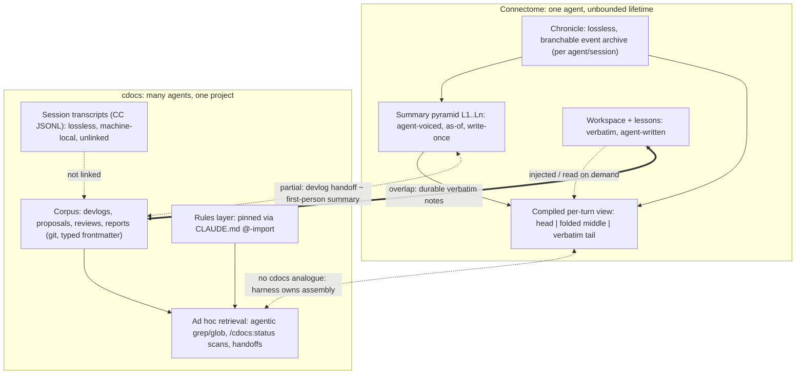

---
first_authored:
  by: "@claude-opus-5-5"
  at: 2026-09-26T16:30:00-07:00
task_list: cdocs/connectome-research
type: report
state: live
status: review_ready
last_reviewed:
  status: revision_requested
  by: "@claude-opus-5-5"
  at: 2026-09-26T17:20:00-07:00
  round: 1
tags: [analysis, synthesis, memory, connectome, identity, architecture]
---

# Connectome vs cdocs: Fit, Identity, and What to Adopt

> BLUF(opus/connectome-research): Connectome and cdocs solve different problems.
> Connectome keeps **one agent coherent inside an unbounded single lifetime**: a lossless per-agent archive plus a per-turn compiled view of it, with summaries the agent writes in its own voice.
> cdocs keeps **many short-lived agents coherent about one project across sessions**: a committed, shared, reviewed document corpus that agents read ad hoc.
> Recommendation: do not adopt Connectome as a runtime, and do not make self-voiced, as-of narrative memory a recall channel for coding.
> Do adopt its *archive/projection discipline*, in ranked order: (1) `supersedes` links plus a human-reviewed consolidation pass, (2) a generated, capped live index, (3) linking the lossless session transcripts Claude Code already writes beneath devlogs.
> Treat agent identity as **unmeasured, not refuted**: run it as one bounded experiment, a per-role working-notes layer that allows hindsight, requires citations, and is never pinned or rule-like, with falsifiers stated up front.
> The functions identity promises (calibrated judgment, fewer re-onboarding costs) are worth testing; the first-person voice and model-binding are values choices that buy a coding workflow little and carry the documented false-memory risk.

## Context / Background

This is unit D of the `cdocs/connectome-research` arc (`cdocs/devlogs/2026-09-26-connectome-research-arc.md`) and the argument spine for a later illustrated Artifact.
It synthesizes three reviewed inputs and does not re-research them:

- **A.** [`2026-09-26-connectome-deep-dive.md`](2026-09-26-connectome-deep-dive.md): Connectome architecture from code at pinned commits (review round 1: Revise; corrections applied in `dc31da0`, round 2 pending at time of writing).
- **B.** [`2026-09-26-long-lived-agent-memory-landscape.md`](2026-09-26-long-lived-agent-memory-landscape.md): comparators and evidence (accepted round 2 after a review that caught a pro-cdocs tilt).
- **C.** [`2026-09-26-cdocs-as-memory-system.md`](2026-09-26-cdocs-as-memory-system.md): cdocs characterized as a memory system (accepted round 2).

The question: Anima Labs is an identity- and community-focused lab, and persistence serves that agenda.
Does Connectome's design fit a productivity/coding environment, and could agent identity plus memory benefit us compared with cdocs' log-centric, classical-SWE document management?

Caveats carried forward from the reviews:
- A's latency figure (1.7-1.9 s per compile) is kv-unified only, after the #105 fix; production may run kv-stable. The 160-178k figure is a budget ceiling, not a measured per-turn send.
- Mint calls set no temperature, so mint text is not reproducible; the "68 initiations" incident is code-documented (`autobiographical.ts:5646-5652`), not hypothetical.
- B's reviewers required that identity be treated as unmeasured, not negative, and that Connectome not be scored only on coding-task metrics. This report follows that.
- C's reviewers required that cdocs consolidation be described as explicit and additive (not absent), and the retriever as agentic LLM search (not "no retrieval").
- Spot-check added here: Claude Code already persists full session transcripts as JSONL under `~/.claude/projects/<project>/` (13 files for this repo, oldest 2026-03-19), machine-local, not committed, retention governed by the `cleanupPeriodDays` setting. This matters for option 3.

## Key Findings

- **Different problems, not competing solutions.** Connectome's unit of continuity is an *agent*; cdocs' is a *project*. Connectome answers "what should this agent see this turn, given everything it has lived?"; cdocs answers "what does any future agent or human need to know about why the project is the way it is?"
- **The real overlap is narrower than it looks, and it is the verbatim side channel.** Connectome's own guide says "If a detail must stay exact, [...] write it to your workspace", calling the workspace "your durable, verbatim memory" (A, `AGENT-MEMORY-GUIDE.md:156-160`). The cdocs corpus is structurally that workspace channel, made shared, typed, committed, and reviewed. Connectome's autobiographical pyramid has no cdocs analogue; cdocs' shared review corpus has no Connectome analogue.
- **cdocs is missing Connectome's bottom layer.** Connectome keeps the lossless record and derives everything from it. cdocs' "archive" is the derived layer only: devlogs and reports are curated, and the raw transcript is outside the system. The transcript exists on disk (spot-check above), so closing this gap is mostly linking and retention, not capture.
- **Connectome's most portable engineering is not identity.** It is: archive-versus-projection, summarize-eagerly/fold-per-turn, cache-perturbation-aware fold placement, a `sourceRelation` provenance vocabulary (copy/derived/referenced), and fail-loud over-budget (A, "What transfers").
- **cdocs has no per-turn assembly lever.** Context assembly in Claude Code belongs to the harness: there is no agent-initiated selective eviction, and compaction is the harness's lossy summary (`2026-09-20-read-source-attribution.md`). Connectome's compiled-view machinery mostly has nowhere to plug into cdocs as it runs today.
- **Coding evidence favors abstracted, reviewed, human-owned memory.** Curated lessons help and raw trajectories can hurt (SWE-ContextBench, Kim et al.); repo context files cost ~20% more tokens without significant success gains (Gloaguen et al., including the CTXbench subset closest to cdocs); coding-tool vendors are demoting agent-written memory (Cursor, Devin, Codex, Windsurf) (B).
- **Having a record matters more than how it is indexed.** DreamBench-SWE: no-memory 11.7% versus 45-54% for any memory-bearing configuration (B; single-author, recent). cdocs already captures that value; the open question is marginal gains on top.
- **Identity's payoff on task outcomes is unmeasured in both directions** (B). Its risks are partly *observed*: Connectome's own code records runaway false memories, re-claiming of others' lives at consolidation, and cross-model contamination (A).

## The Core Contrast

Stated precisely:

- **Connectome is an in-session continuity system where the session never ends.** Its hard problem is fitting an ever-growing single history into a fixed window each turn without losing identity-bearing detail or thrashing the prompt cache. Everything else (solver, recall pairs, holdbacks, drain breakers) serves that. Cross-agent knowledge sharing is secondary: its multi-agent recipe (Triumvirate) coordinates through a shared filesystem and chat channels, not shared memory (A).
- **cdocs is a cross-session, cross-agent knowledge system where each agent is short-lived.** Its hard problem is making decisions, rationale, review verdicts, and status durable and findable by agents that share no memory. In-session continuity is delegated to the harness and patched with devlog handoffs and arc-state.

Where they actually overlap:

1. **Verbatim, agent-written durable notes.** Connectome workspace files versus the cdocs corpus. Same function; cdocs adds shared scope, schema, git history, and review.
2. **Two vantages on the past.** Connectome enforces *as-of* summaries (no hindsight). cdocs already has both: devlogs are as-of chronological records, while reports and reviews are hindsight syntheses. cdocs never needed a rule for this because document type encodes vantage.
3. **Consolidation.** Connectome merges L_k into L_{k+1} automatically ("the through-line: what happened, what was decided, what remains open"). cdocs consolidates explicitly and additively: reports, handoffs, `evolved` supersession (C). The devlog handoff (Completed / Decisions Made / Open Todos) is close in content to a Connectome merge prompt, minus the first-person voice and the automation.
4. **Distilled lessons.** Connectome-host's lessons store (confidence-scored, retrieved per turn) is the automated cousin of cdocs rules files, with none of the human ownership that the coding-tool evidence favors.
5. **File-based multi-agent coordination.** Both converge on plain shared files for cross-agent work; neither uses a shared memory service.

## Side-by-Side Design Comparison

| Axis | Connectome | cdocs | Consequence for a coding workflow |
|---|---|---|---|
| **Unit of memory** | Event/message record (Chronicle); ~3-6k-token chunk summarized as an L1 recollection; L_k merges of ~6 siblings; workspace file; lesson | Whole typed document (devlog, proposal, review, report) with fixed frontmatter; arc-state JSON; rule file | cdocs' unit is decision-sized and addressable by path; Connectome's is time-sized and addressable only through the pyramid or history search |
| **Authorship / voice** | Agent's own model, first person, "voiced as the agent itself"; witnessed history in others' voice; no synthetic summarizer header | Agent-written in impersonal technical prose under conventions; attributed callouts (`NOTE(opus/...)`); human steering invisible in provenance (C) | First person protects voice, not accuracy. cdocs' neutral voice is easier to verify against diffs and tests |
| **Write trigger** | Automatic: every event appended; timer-driven mints after chunk close (holdback 1) and merges at N siblings; agent writes workspace/lessons at will | Convention-driven: devlog at start of substantive work, handoffs every 3-5 iterations, skills for proposals/reviews/reports; hooks only validate | Connectome never forgets to write; cdocs depends on compliance (C, "Reliance on agent compliance") |
| **Read / assembly path** | Push: every turn compiles head, folded middle (recall pairs), verbatim tail, plus injected lessons (up to 5, `afterUser`); history search tool on demand | Pull: rules pinned; everything else via agentic grep/glob, `/cdocs:status` O(N) scans, explicit `Read` of handoffs | Connectome guarantees presence at a token cost every turn; cdocs pays only when it reads, and misses what it does not think to grep |
| **Consolidation / forgetting** | Hierarchical merge, unbounded levels; folding driven by token pressure, not age; no deletion; images decay faster; lessons decay only by explicit demote | Explicit, additive synthesis; soft invalidation via `state: archived`, `status: evolved`; no pruning; corpus grows monotonically (1,979 docs in weftwise) | Neither forgets in the ForgetEval sense. cdocs lacks machine-readable supersession; Connectome lacks any fact-level invalidation |
| **Identity** | Narrative (system prompt, verbatim head, self-voiced memory chain); model-bound by operator doctrine; cryptographic `aid1` principal | None persistent: roles are per-dispatch; `agents/*.md` are read-only procedural identity; attribution by model name, not continuing agent (C) | cdocs gets consistency from rules and role definitions, not from a remembered self |
| **Multi-agent** | Participants, not roles; per-agent namespaces over a shared or isolated message store; subagent spawn/fork; coordination via shared files and channels | Claim registry, single-writer ownership, footprint-overlap serialization, arc-state; all plain files, cross-tool (C) | Different targets: Connectome models many parties in one conversation; cdocs models many writers on one repo |
| **Auditability / determinism** | Strong on records (lossless archive, `/debug/context`, compression JSONL, mint preimages, branches). Weak on content: mints unseeded, fold layout depends on prior solver state, async mint timing changes renders | Strong on documents (git history, diffs, attribution, typed review lifecycle). Weak on reasoning: transcripts are outside git (C) | Connectome can replay *what the agent saw*; cdocs can replay *what the project believed*. Coding review needs the second more often |
| **Cost / latency** | Budgets ~160-178k tokens on 200k models, tails up to ~450k in large recipes; one mint per chunk, one merge per ~6 summaries; kv-unified solve 1.7-1.9 s at 260k tokens; cache economics protected by the solver | Session start ~constant (rules only); docs average ~2.5-2.9k tokens, read on demand; full-scan queries O(N), unbenchmarked past ~100 docs | For short task horizons, Connectome's per-turn baseline is large; cdocs' cost scales with retrieval behavior and corpus size |
| **Failure modes** | Observed: runaway false memories ("68 initiations"), re-claiming others' lives, cross-model contamination, 7-hour compression stall leading to `OverBudgetError` on every wake, silent 400s on mis-sized budgets; stale beliefs via current system prompt and tools at mint time | Observed: devlog sprawl (13-46KB devlogs failing the 30-second bar), handoffs not read by the next session, stale docs indistinguishable from live ones by grep, advisory-only discipline | Connectome fails by believing wrong things fluently; cdocs fails by not finding or not writing the right thing |
| **Human legibility** | Archive is inspectable through tools; summaries are prose but scattered across state slots; operationally heavy (11.7k-line strategy file, Bun + Rust bindings, one OS user per agent) | Every unit is markdown on GitHub; BLUF-first; reviewable by PR | cdocs is legible by default; Connectome is legible by instrumentation |

## The Identity Question

"Identity" bundles several functions.
Separating them clarifies what a coding workflow could gain, because most have a non-identity home already.

| Function identity promises | Existing non-identity home | Residual gap |
|---|---|---|
| Project knowledge (decisions, rationale) | cdocs corpus | None identity-specific |
| User model (preferences, style) | Harness: user `CLAUDE.md`, CC auto memory `user`/`feedback` types | Cross-repo relationship context, partial |
| Procedural consistency (how a role works) | `agents/*.md`, rules | None |
| **Calibrated judgment of a role over time** | Nothing: a reviewer never learns which of its findings were overturned | **Real gap** |
| **Working-state continuity across sessions** | Devlog handoffs, arc-state, proposed scratchpoint | Partial; granularity gap (C) |
| Self-knowledge ("I tend to over-claim tests pass") | Nothing | **Real gap** |

### The case for a persistent agent self in a coding workflow

- **Continuity of judgment.** Every cdocs reviewer starts cold. This arc's own reviewer of report B caught a pro-cdocs tilt; nothing carries that correction into the next review except, indirectly, the corpus. A persistent reviewer self with memory of its own overturned or confirmed findings could calibrate. B names "a persistent reviewer or overseer role whose judgments stay calibrated over time" as a plausible, untested mechanism.
- **Fewer re-onboarding costs.** When notes are current, a follow-on session's re-reads fell from 8 files to 4 and peak context from ~334K to ~173K tokens (`2026-09-19-devlog-methodology-value.md`, cited in C). DreamBench-SWE shows any memory beats none by 33-42 points. An agent that remembers *its own* working context carries the tacit parts a handoff omits.
- **Relationship with the human.** C notes that human steering is invisible in cdocs provenance: the corpus records who typed, not who caused. A self that remembers what this human pushed back on, and why, captures exactly the steering the corpus drops.
- **Calibrated self-knowledge.** A self-model that records "my claims of X were wrong N times" is the one memory type that could reduce a known coding failure (premature victory, which Anthropic's long-running-agent harness targets explicitly, per B). Kim et al. find cross-task transfer comes from "meta-knowledge, such as validation routines", which is what self-knowledge of this kind is.
- **Revealed demand.** OpenClaw (~390k stars) ships an agent-editable `SOUL.md`; Letta, Honcho, Hermes and Connectome all make the self first-class (B). Users want this, even though nobody has measured its effect.
- **Do not dismiss on the welfare framing.** Several Connectome choices driven by values are also good engineering: no hidden framing ("no words in models' mouths" keeps provenance honest), fail-loud over-budget, credentials never model-visible, gating that defers rather than hides. Values-driven design and engineering-driven design coincide more than the framing suggests.

### The case against

- **False memories are observed, and they compound.** In Connectome's "68 initiations" incident, a prompt-ordering bug made the summarizer narrate the verbatim head as fresh events, "compounding across merges into runaway false memories" (A). The fix was ordering, not a fact check: nothing in the pipeline verifies a recollection against the record. For coding, the dangerous memory is "I fixed the auth bug" when tests never passed.
- **Self-narrative sycophancy.** First-person self-authored memory has no external check at mint time; the only guards are an anti-padding instruction and an invitation to report inconsistencies (A). A self that curates its own history drifts toward a flattering history. A relationship memory adds a second vector: remembering what the human liked reinforces agreement.
- **Consolidation re-authors other parties.** Merges "re-claim others' lives" (observed 2026-07-27), which forced a witnessed-voice prompt (A). In a multi-agent coding arc, the analogue is an agent remembering a reviewer's finding as its own insight, or an implementer's shortcut as the plan.
- **As-of is the wrong vantage for coding.** "The bug turned out to be X" is the most valuable coding memory, and as-of minting forbids it by design (A). cdocs already keeps the as-of record where it is useful (devlogs).
- **Non-reproducibility.** Mints are unseeded, fold layout depends on solver state carried across turns, and async minting means the same history renders differently depending on timing (A). A coding review cannot reproduce why an agent believed something.
- **Model binding.** Connectome treats feeding one model's chronicle to another as a "continuity violation" (A, `DEPLOYMENTS.md:16-19`). Coding workflows swap models routinely; cdocs' model tiering (opus judgment, sonnet search, haiku mechanical) is the opposite doctrine. This is operator doctrine, not a hard constraint: `compressionModel` is separable (A). But a self whose continuity depends on a model version is an operational liability.
- **Attack surface and vendor retreat.** Persistent memory poisoning reached up to 99.8% implant success, with retrieved poisoned memories driving attacker-intended actions in 60-89% of cases (B, arXiv:2605.15338). Coding-tool vendors are moving agent-written memory out of the must-follow path (B). An unreviewed self is exactly the pattern they are retreating from.

### Net

The case for identity rests on functions (calibration, self-knowledge, relationship context, working-state continuity), not on narrative voice or model binding.
The case against rests mostly on the voice (first-person, as-of, self-authored without verification) and on binding.
So: test the functions with a design that removes the documented failure mechanisms: third-person or plainly attributed, hindsight allowed, every claim citing a commit, test run, or doc path, a separate trust tier, never pinned as instructions, and model-agnostic.
If that design shows no gain, identity for coding is weakly refuted in this setting.
If it shows gain, a richer self can be tried next.
Connectome's own mitigation, verbatim workspace notes for anything that must stay exact, points the same way.

## Adoption Options for cdocs

Evidence grades:
- **A**: measured in a coding setting by independent work.
- **B**: measured outside coding, or consistent across multiple independent products or sources.
- **C**: design reasoning plus production anecdote (e.g. Connectome code comments).
- **D**: plausible mechanism, no evidence found.

Ranked by expected value per unit cost for this repo.

| Rank | Option | Kind | Cost | Benefit | Evidence | Falsified if |
|---|---|---|---|---|---|---|
| 1 | `supersedes` / `superseded_by` links + human-reviewed consolidation pass | Cheap experiment, then light structural | Low (frontmatter fields, triage extension); ongoing human review time | Stale docs become skippable deterministically; devlogs distilled into abstracted lessons | **B** (ForgetEval on forgetting failures; SWE-ContextBench and Kim et al. on abstraction; Dreams/Codex/Letta all emit reviewable diffs) | After ~1 month, agents still cite superseded docs at a similar rate, or distilled lessons are not read or not reviewed (review rubber-stamped by agents only) |
| 2 | Generated, capped live index (one line per live doc: path, type, status, BLUF first sentence, "read when") | Cheap experiment | Low (generator script or hook; ~1-3k tokens if pinned) | Replaces O(N) scans; gives grep a vocabulary; `/cdocs:status`'s own named escape hatch | **B** for the pattern (Claude Code 200-line `MEMORY.md`, Letta `system/`, OpenClaw), **A-negative** for pinned overviews (Gloaguen: +~20% tokens, no significant gain) | A/B on matched tasks shows no drop in orientation reads/tokens, or token cost rises without accuracy change. Mitigation to test: keep it unpinned, read on demand |
| 3 | Lossless session archive beneath devlogs: record the CC session id(s) in devlog frontmatter/handoffs; set retention; optional history-search skill over JSONL | Cheap experiment | Low (transcripts already exist); privacy and size of retaining them | Closes C's "audit covers documents, not reasoning" gap; gives Connectome's archive-versus-projection property: devlogs become a projection with a recoverable source | **C** (Connectome's core claim; cdocs' own scratchpoint design names the gap) | Over ~2 months nobody (human or agent) follows a transcript link to resolve a question the devlog could not answer |
| 4 | Agent-authored working-notes layer, distinct from reviewed docs (per workstream or per role; hindsight allowed; citation-required; never pinned or rule-like; marked unreviewed) | Bounded experiment on the identity question | Medium (convention, directory, skill hook; audit effort) | Captures tacit working state and self-knowledge that handoffs drop; tests identity's functions without its voice | **D** for coding; **C** for the failure mechanisms it is designed around | Audit of a sample against git/tests finds unsupported claims at a meaningful rate (e.g. >5%), or resumption quality (re-reads, time to first correct action) does not improve versus handoff-only |
| 5 | Per-role persistent specialist memory (e.g. a reviewer calibration file: findings raised, later overturned or confirmed, with links) | Structural bet | Medium-high (lifecycle, cross-worktree scope, drift control) | The one direct test of "continuity of judgment" | **D** (plausible via Kim et al.'s meta-knowledge transfer; unmeasured) | Reviewer verdicts show no improved agreement with later outcomes or human verdicts after N reviews, or the file drifts toward self-flattering summaries on audit |
| 6 | Compiled-view / cache-aware context assembly | Structural bet, mostly out of reach | High, and largely not implementable inside Claude Code (harness owns assembly; no selective eviction) | Large on cost/latency where applicable | **B** for cache economics; **C** for the solver | Narrow cheap variant: order `/oversee` dispatch briefs stable-prefix-first (rules, then arc context, then task). Falsified if cache-read share of subagent input tokens does not rise |

Option notes:

- **Options 1 and 2 compound.** The index should list only live, non-superseded docs, so supersession links are what keep it small. Build 1 first.
- **Option 1's review gate is the whole point.** B's warning applies directly: an agent-reviewed consolidation pass reproduces the unreviewed-memory pattern Cursor and Devin dropped. cdocs today is agent-written and mostly agent-reviewed (C), so this option is also a corrective.
- **Option 3 overlaps the unbuilt chat-record design** (`2026-09-22-chat-record-scratchpoint-design.md`). Linking existing CC transcripts may make a separate hook-written chat record redundant for audit, though not for compaction recovery. Decide before building either.
- **Option 4 is the identity experiment.** It deliberately inverts Connectome's voice choices (hindsight allowed, citations required, trust tier separate) while keeping its function (the agent authors its own continuity). It should live in its own directory and never be `@`-imported.
- **Option 5 depends on option 4's result.** If unreviewed notes produce unsupported claims at a meaningful rate, a persistent per-role self will too, only compounding over longer horizons.
- **Option 6 is listed for completeness.** Connectome's best engineering is in context assembly, which cdocs does not control. It becomes relevant only if cdocs grows an Agent SDK harness of its own. Porting Connectome for a spike would start with `hermes-autobio` (Python, SQLite + FTS5, with a Claude Code session importer per its README), not the TypeScript stack (A).

Not recommended:
- Self-voiced as-of summaries as a primary recall channel (wrong vantage for coding; unverified content).
- Model-bound continuity (contradicts model tiering).
- Large verbatim tails as the continuity mechanism (linear cost; not controllable in Claude Code anyway).
- Adopting Connectome components directly (pre-1.0, ~100-150 commits/month in core repos, solver semantics revised roughly monthly, unclear licensing on context-manager, chronicle, and connectome-host).

## Recommendations

1. Write a proposal for option 1 (supersession fields plus a `/cdocs:triage`-adjacent distill pass whose output is a human-reviewed commit), then option 2 on top of it.
2. Run option 3 as a zero-build trial: add a `sessions:` list to new devlogs in this repo for a month and count how often the link is used.
3. Scope option 4 as an RFP with the falsifiers above as acceptance criteria. Decide beforehand who audits a sample of notes against git and tests.
4. Defer options 5 and 6 until 4 reports.
5. When presenting this to the Artifact audience, lead with "different problems" and the verbatim-notes overlap, not with a scorecard. Connectome's design goals (continuity, consistency, self-model coherence) need their own evaluation axis, which no source in this arc supplies (B).

## Open Questions

- **Does identity help coding at all?** No study found tests persistent agent identity on task outcomes (B). Option 4 is a small internal test, not an answer.
- **What would a reviewer's calibration memory actually contain?** "Findings later overturned" requires a ground-truth signal cdocs does not record today: reviews have verdicts, but no field tracks whether a finding was later judged wrong.
- **Who reviews consolidation?** Human review time is the scarce input for options 1 and 4. If it is not available, the evidence says the reviewed pattern degrades to the unreviewed one.
- **Transcript retention and privacy.** Linking JSONL transcripts makes them part of the audit trail but keeps them machine-local and unshareable across collaborators; committing them is a different, larger decision.
- **Does Connectome's production behavior match its design?** A's round-2 review was pending when this was written; A also flags which folding strategy runs in production (kv-stable or kv-unified) as unverified, and found no published evaluation of recall accuracy or drift rates.
- **Is there a middle ground on voice?** Attributed callouts (`NOTE(opus/...)`) are already a weak form of agent voice. Whether a first-person register improves the agent's own later use of its notes, independent of accuracy, is untested.
- **Cross-project scope.** Relationship and self-knowledge memory is naturally cross-repo, which cdocs delegates to the harness (C). An identity layer may belong in the harness (user-level memory) rather than in cdocs at all.
