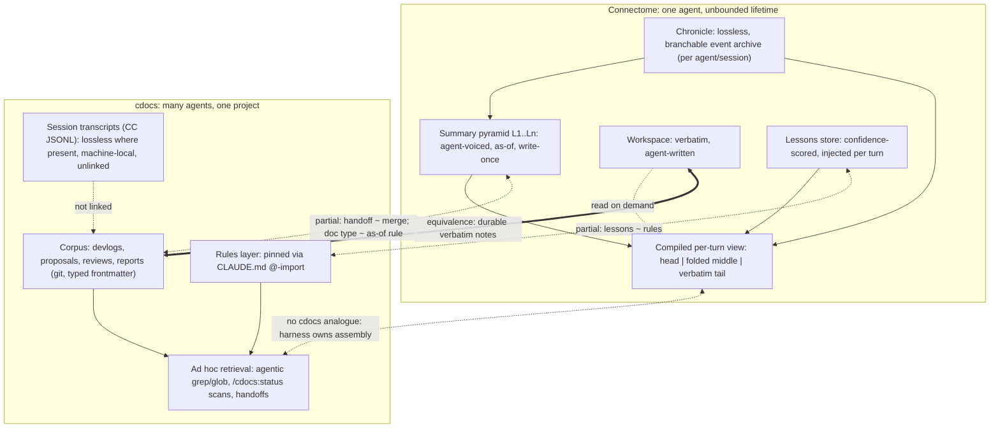

---
first_authored:
  by: "@claude-opus-5-5"
  at: 2026-09-26T16:30:00-07:00
task_list: cdocs/connectome-research
type: report
state: live
status: review_ready
last_reviewed:
  status: accepted
  by: "@claude-opus-5-5"
  at: 2026-09-26T18:10:00-07:00
  round: 2
tags: [analysis, synthesis, memory, connectome, identity, architecture]
---

# Connectome vs cdocs: Fit, Identity, and What to Adopt

> BLUF(opus/connectome-research): Connectome and cdocs mostly solve different problems, which converge only for a long-lived, single-project specialist.
> Connectome keeps **one agent coherent inside an unbounded single lifetime**: a lossless per-agent archive plus a per-turn compiled view of it, with summaries the agent writes in its own voice.
> cdocs keeps **many short-lived agents coherent about one project across sessions**: a committed, shared document corpus, written and mostly reviewed by agents, that agents read ad hoc.
> The overlap is tiered: one functional equivalence (Connectome workspace notes and the cdocs corpus), three partial analogues, and one convergent practice.
> Recommendation: do not adopt Connectome as a runtime.
> Do adopt its *archive/projection discipline*, in ranked order: (1) a human-reviewed distill pass plus cheap `supersedes` links, (2) a generated, unpinned live index, (3) links from devlogs to the session transcripts Claude Code already writes, where they exist.
> Treat agent identity as **unmeasured, not refuted**, and test it with a two-arm experiment against current handoffs: cited per-role working notes alone, and the same notes plus a persistent first-person self-model for a long-lived specialist.
> The main risks of identity (unverified consolidation producing false memories, memory poisoning) apply to any agent-written memory, cdocs included. The risks specific to identity are the as-of vantage, re-authoring other parties' contributions, and model binding.

> Illustrated companion: [Connectome vs cdocs](https://claude.ai/artifact/6mdteEvHWFpv37x5NpnoRm) (source: `2026-09-26-connectome-synthesis-assets/connectome-vs-cdocs.html`; standalone SVGs alongside).

> **Revision note (round 1):** Revised per `cdocs/reviews/2026-09-26-review-of-connectome-synthesis.md` (verdict: Revise).
> Tiered the overlap consistently across BLUF, Key Findings, diagram, body, and Recommendations.
> Tagged each risk in "The case against" as identity-specific or shared with cdocs, fixed the failure-modes row, and replaced "cdocs already captures that value" with DreamBench's own non-discrimination caveat.
> Redesigned option 4 as a two-arm experiment that includes a persistent first-person self, stated what each outcome would and would not show, and made its falsifiers (and option 5's) comparative against a same-method audit of handoffs and devlogs.
> Split option 1 into distill-plus-review (**B**) and supersession links (**C**), and carried B's abstract-level caveat on 2026 arXiv sources.
> Non-blocking: A marked accepted; inference lines labeled; the Kim et al. link softened; the re-onboarding evidence scoped to memory, not identity; Pillar 3 specialists added; the convergence condition stated; transcript-coverage caveat and falsifier added to option 3; option 2's rank tied to the unpinned variant; the option 4/scratchpoint overlap noted.

## Context / Background

This is unit D of the `cdocs/connectome-research` arc (`cdocs/devlogs/2026-09-26-connectome-research-arc.md`) and the argument spine for a later illustrated Artifact.
It synthesizes three reviewed inputs and does not re-research them:

- **A.** [`2026-09-26-connectome-deep-dive.md`](2026-09-26-connectome-deep-dive.md): Connectome architecture from code at pinned commits (accepted round 2, after round-1 corrections in `dc31da0`).
- **B.** [`2026-09-26-long-lived-agent-memory-landscape.md`](2026-09-26-long-lived-agent-memory-landscape.md): comparators and evidence (accepted round 2 after a review that caught a pro-cdocs tilt).
- **C.** [`2026-09-26-cdocs-as-memory-system.md`](2026-09-26-cdocs-as-memory-system.md): cdocs characterized as a memory system (accepted round 2).

The question: Anima Labs is an identity- and community-focused lab, and persistence serves that agenda.
Does Connectome's design fit a productivity/coding environment, and could agent identity plus memory benefit us compared with cdocs' log-centric, classical-SWE document management?

Caveats carried forward from the reviews:
- A's latency figure (1.7-1.9 s per compile) is kv-unified only, after the #105 fix; production may run kv-stable. The 160-178k figure is a budget ceiling, not a measured per-turn send.
- Mint calls set no temperature, so mint text is not reproducible (A's round-1 review). The "68 initiations" incident is code-documented (`autobiographical.ts:5646-5652`), not hypothetical.
- B's reviewers required that identity be treated as unmeasured, not negative, and that Connectome not be scored only on coding-task metrics. This report acknowledges the second requirement but does not meet it: its comparison is coding-focused, with one short "on its own terms" paragraph below.
- B's closing NOTE: several 2026 arXiv sources (DreamBench-SWE, ForgetEval, and others) are recent, some single-author, unreviewed, and were read at abstract level. Evidence grades below that lean on them should be read with that discount.
- C's reviewers required that cdocs consolidation be described as explicit and additive (not absent), and the retriever as agentic LLM search (not "no retrieval").
- Spot-check added here: Claude Code already persists session transcripts as JSONL under `~/.claude/projects/<cwd-path>/`, machine-local, not committed, with retention governed by `cleanupPeriodDays`. Coverage for this repo is partial: transcripts are keyed by working-directory path, so they are split across at least five project directories (host, container, and worktree paths), with about 40 top-level JSONL files against 87 devlogs. Sessions run on other machines or remotely are absent, and this machine's retention (99999 days) is not the default. This matters for option 3.

## Key Findings

- **Different problems, which converge in one scenario.** Connectome's unit of continuity is an *agent*; cdocs' is a *project*. Connectome answers "what should this agent see this turn, given everything it has lived?"; cdocs answers "what does any future agent or human need to know about why the project is the way it is?" The two converge for a long-lived, single-project specialist, such as a persistent reviewer or a Pillar 3 specialist carried across arcs. That is the scenario options 4 and 5 probe, so "different problems" does not mean "nothing to learn."
- **The overlap is tiered.**
  - *Functional equivalence (one):* Connectome's workspace, which its guide calls "your durable, verbatim memory" for anything that "must stay exact" (A, `AGENT-MEMORY-GUIDE.md:156-160`), and the cdocs corpus. cdocs is that channel made shared, typed, and committed.
  - *Partial analogues (three):* devlog handoff and Connectome merge; cdocs rules and Connectome-host lessons; vantage encoded by cdocs document type and Connectome's as-of rule.
  - *Convergent practice (one):* file-based multi-agent coordination.
  - Neither has an analogue for the other's core: Connectome's automated, per-turn-assembled pyramid, and cdocs' shared review lifecycle.
- **cdocs is missing Connectome's bottom layer.** Connectome keeps the lossless record and derives everything from it. cdocs' "archive" is the derived layer only: devlogs and reports are curated, and the raw transcript is outside the system. Transcripts exist on disk for some sessions (spot-check above), so closing the gap is partly linking and retention and partly capture, for sessions run elsewhere.
- **Connectome's most portable engineering is not identity.** It is: archive-versus-projection, summarize-eagerly/fold-per-turn, cache-perturbation-aware fold placement, a `sourceRelation` provenance vocabulary (copy/derived/referenced), and fail-loud over-budget (A, "What transfers").
- **cdocs has no per-turn assembly lever.** Context assembly in Claude Code belongs to the harness: there is no agent-initiated selective eviction, and compaction is the harness's lossy summary (`2026-09-20-read-source-attribution.md`). Connectome's compiled-view machinery mostly has nowhere to plug into cdocs as it runs today.
- **Coding evidence leans toward abstracted memory with human-owned review.** Curated lessons help and raw trajectories can hurt (SWE-ContextBench, Kim et al.); repo context files cost ~20% more tokens without significant success gains (Gloaguen et al., including the CTXbench subset closest to cdocs); coding-tool vendors are demoting agent-written memory (Cursor, Devin, Codex, Windsurf) (B). The vendor part is a product trend, not a measurement.
- **Any memory beats none, and the evidence does not rank architectures.** DreamBench-SWE: no-memory 11.7% versus 45-54% for any memory-bearing configuration, and it "explicitly does not establish superiority among memory architectures" (B; single author, recent). Its tasks hinge on non-inferable earlier-session evidence, which cdocs captures only if a devlog happened to record it. The result supports a lossless archive (Connectome, option 3) as much as it supports a curated corpus.
- **Identity's payoff on task outcomes is unmeasured in both directions** (B). Its documented risks are partly *observed* in Connectome's code: runaway false memories, re-claiming of others' lives at consolidation, and cross-model contamination (A). Several of those risks (unverified consolidation, memory poisoning) are properties of agent-written persistent memory in general and apply to cdocs too. The risks specific to identity are the as-of vantage, re-authoring other parties' contributions in a first-person merge, and model binding.

## The Core Contrast

The fifth overlap, file-based multi-agent coordination, is a convergent practice rather than a shared component, so it is not drawn.

Stated precisely:

- **Connectome is an in-session continuity system where the session never ends.** Its hard problem is fitting an ever-growing single history into a fixed window each turn without losing identity-bearing detail or thrashing the prompt cache. Everything else (solver, recall pairs, holdbacks, drain breakers) serves that. Cross-agent knowledge sharing is secondary: its multi-agent recipe (Triumvirate) coordinates through a shared filesystem and chat channels, not shared memory (A).
- **cdocs is a cross-session, cross-agent knowledge system where each agent is short-lived.** Its hard problem is making decisions, rationale, review verdicts, and status durable and findable by agents that share no memory. In-session continuity is delegated to the harness and patched with devlog handoffs and arc-state.
- **Where they converge.** A long-lived specialist working one project needs both: Connectome's per-agent continuity and cdocs' shared project record. cdocs' nearest mechanism, the Pillar 3 durable specialist, is scoped to one workstream and disposed of when it ends (C).

**On its own terms.** Connectome's goal is a single agent that stays continuous and self-consistent across an unbounded lifetime, with every past event recoverable and per-turn cost held in check by a cache-aware solver. By design and by production use it delivers a lossless, branchable record, a view compiled every turn, and an explicit provenance vocabulary. Whether recall stays accurate and self-description stays stable over months is unmeasured: A found no published evaluation of recall accuracy or drift. No source in this arc supplies an evaluation axis for these goals.

Where they overlap, by tier:

1. **Functional equivalence: verbatim, agent-written durable notes.** Connectome workspace files versus the cdocs corpus. Same function; cdocs adds shared scope, schema, git history, and a review lifecycle.
2. **Partial analogue: consolidation.** Connectome merges L_k into L_{k+1} automatically ("the through-line: what happened, what was decided, what remains open"). cdocs consolidates explicitly and additively: reports, handoffs, `evolved` supersession (C). The devlog handoff (Completed / Decisions Made / Open Todos) is close in content to a Connectome merge prompt, minus the first-person voice and the automation.
3. **Partial analogue: distilled lessons.** Connectome-host's lessons store (confidence-scored, retrieved per turn) is the automated cousin of cdocs rules files. cdocs rules are committed and human-owned, which is the property the coding-tool evidence favors.
4. **Partial analogue: two vantages on the past.** Connectome enforces *as-of* summaries (no hindsight). cdocs has both vantages by document type: devlogs are as-of chronological records, while reports and reviews are hindsight syntheses. cdocs needs no rule because document type encodes vantage, but nothing enforces that a devlog stays as-of.
5. **Convergent practice: file-based multi-agent coordination.** Both converge on plain shared files for cross-agent work; neither uses a shared memory service.

## Side-by-Side Design Comparison

| Axis | Connectome | cdocs | Consequence for a coding workflow |
|---|---|---|---|
| **Unit of memory** | Event/message record (Chronicle); ~3-6k-token chunk summarized as an L1 recollection; L_k merges of ~6 siblings; workspace file; lesson | Whole typed document (devlog, proposal, review, report) with fixed frontmatter; arc-state JSON; rule file | cdocs' unit is decision-sized and addressable by path; Connectome's is time-sized and addressable only through the pyramid or history search |
| **Authorship / voice** | Agent's own model, first person, "voiced as the agent itself"; witnessed history in others' voice; no synthetic summarizer header | Agent-written in impersonal technical prose under conventions; attributed callouts (`NOTE(opus/...)`); human steering invisible in provenance (C) | Inference: verifiability comes from citations to commits, tests, and paths, not from grammatical person. Neither system requires citations for every claim |
| **Write trigger** | Automatic: every event appended; timer-driven mints after chunk close (holdback 1) and merges at N siblings; agent writes workspace/lessons at will | Convention-driven: devlog at start of substantive work, handoffs every 3-5 iterations, skills for proposals/reviews/reports; hooks only validate | Connectome never forgets to write; cdocs depends on compliance (C, "Reliance on agent compliance") |
| **Read / assembly path** | Push: every turn compiles head, folded middle (recall pairs), verbatim tail, plus injected lessons (up to 5, `afterUser`); history search tool on demand | Pull: rules pinned; everything else via agentic grep/glob, `/cdocs:status` O(N) scans, explicit `Read` of handoffs | Connectome guarantees presence at a token cost every turn; cdocs pays only when it reads, and misses what it does not think to grep |
| **Consolidation / forgetting** | Hierarchical merge, unbounded levels; folding driven by token pressure, not age; no deletion; images decay faster; lessons decay only by explicit demote | Explicit, additive synthesis; soft invalidation via `state: archived`, `status: evolved`; no pruning; corpus grows monotonically (1,979 docs in weftwise) | Neither forgets in the ForgetEval sense. cdocs lacks machine-readable supersession; Connectome lacks any fact-level invalidation |
| **Identity** | Narrative (system prompt, verbatim head, self-voiced memory chain); model-bound by operator doctrine; cryptographic `aid1` principal | None persistent: roles are per-dispatch; `agents/*.md` are read-only procedural identity; Pillar 3 specialists persist within one workstream only; attribution by model name, not continuing agent (C) | cdocs gets consistency from rules and role definitions, not from a remembered self |
| **Multi-agent** | Participants, not roles; per-agent namespaces over a shared or isolated message store; subagent spawn/fork; coordination via shared files and channels | Claim registry, single-writer ownership, footprint-overlap serialization, arc-state; all plain files, cross-tool (C) | Different targets: Connectome models many parties in one conversation; cdocs models many writers on one repo |
| **Auditability / determinism** | Strong on records (lossless archive, `/debug/context`, compression JSONL, mint preimages, branches). Weak on content: mints unseeded, fold layout depends on prior solver state, async mint timing changes renders | Strong on documents (git history, diffs, attribution, typed review lifecycle). Weak on reasoning: transcripts are outside git (C). Document text is also unseeded LLM output | Connectome can replay *what the agent saw*; cdocs can replay *what the project believed*. Coding review needs the second more often |
| **Cost / latency** | Budgets ~160-178k tokens on 200k models, tails up to ~450k in large recipes; one mint per chunk, one merge per ~6 summaries; kv-unified solve 1.7-1.9 s at 260k tokens; cache economics protected by the solver | Session start ~constant (rules only); docs average ~2.5-2.9k tokens, read on demand; full-scan queries O(N), unbenchmarked past ~100 docs | For short task horizons, Connectome's per-turn baseline is large; cdocs' cost scales with retrieval behavior and corpus size |
| **Failure modes** | Observed: runaway false memories ("68 initiations"), re-claiming others' lives, cross-model contamination, 7-hour compression stall leading to `OverBudgetError` on every wake, silent 400s on mis-sized budgets; stale beliefs via current system prompt and tools at mint time | Observed: devlog sprawl (13-46KB devlogs failing the 30-second bar), handoffs not read by the next session, stale docs indistinguishable from live ones by grep, advisory-only discipline. Unmeasured: how often agent-written claims ("tests pass") are unsupported | Both can believe wrong things: Connectome through unverified automated consolidation, cdocs through stale or unverified agent-written docs. cdocs also fails by not finding or not writing. Connectome's errors compound automatically across merges; cdocs' propagate through reports that synthesize earlier docs, and each propagation step is a reviewable diff |
| **Human legibility** | Archive is inspectable through tools; summaries are prose but scattered across state slots; operationally heavy (11.7k-line strategy file, Bun + Rust bindings, one OS user per agent) | Every unit is markdown on GitHub; BLUF-first; reviewable by PR | cdocs is legible by default; Connectome is legible by instrumentation |

## The Identity Question

"Identity" bundles several functions.
Separating them clarifies what a coding workflow could gain, because some have a non-identity home already.

| Function identity promises | Existing non-identity home | Residual gap |
|---|---|---|
| Project knowledge (decisions, rationale) | cdocs corpus | None identity-specific |
| User model (preferences, style) | Harness: user `CLAUDE.md`, CC auto memory `user`/`feedback` types | Cross-repo relationship context, partial |
| Procedural consistency (how a role works) | `agents/*.md`, rules | None |
| **Calibrated judgment of a role over time** | Nothing: a reviewer never learns which of its findings were overturned | **Real gap** |
| **Working-state continuity across sessions** | Devlog handoffs, arc-state, Pillar 3 durable specialists (within one workstream; C calls them "the closest analogue to persistent identity"), proposed scratchpoint | Partial; granularity gap and cross-workstream gap (C) |
| Self-knowledge ("I tend to over-claim tests pass") | Nothing | **Real gap** |

### The case for a persistent agent self in a coding workflow

- **Continuity of judgment.** Every cdocs reviewer starts cold. This arc's own reviewer of report B caught a pro-cdocs tilt; nothing carries that correction into the next review except, indirectly, the corpus. A persistent reviewer self with memory of its own overturned or confirmed findings could calibrate. B names "a persistent reviewer or overseer role whose judgments stay calibrated over time" as a plausible, untested mechanism.
- **Fewer re-onboarding costs.** When notes are current, a follow-on session's re-reads fell from 8 files to 4 and peak context from ~334K to ~173K tokens (`2026-09-19-devlog-methodology-value.md`, cited in C). DreamBench-SWE shows any memory beats none by 33-42 points. This is evidence for *memory*, not for identity specifically: neither result separates an agent's own memory from a shared handoff. The identity-specific claim is that an agent remembering *its own* working context carries tacit parts a handoff omits, and that claim is untested.
- **Relationship with the human.** C notes that human steering is invisible in cdocs provenance: the corpus records who typed, not who caused. A self that remembers what this human pushed back on, and why, captures exactly the steering the corpus drops.
- **Calibrated self-knowledge.** A self-model that records "my claims of X were wrong N times" could reduce a known coding failure (premature victory, which Anthropic's long-running-agent harness targets explicitly, per B). Kim et al.'s finding that cross-task transfer comes from "meta-knowledge, such as validation routines" is adjacent: it concerns procedural knowledge of how to validate, which points as much to rules or lessons as to self-knowledge.
- **Revealed demand.** OpenClaw (~390k stars) ships an agent-editable `SOUL.md`; Letta, Honcho, Hermes and Connectome all make the self first-class (B). Users want this, even though nobody has measured its effect.
- **Do not dismiss on the welfare framing.** Several Connectome choices driven by values are also good engineering: no hidden framing ("no words in models' mouths" keeps provenance honest), fail-loud over-budget, credentials never model-visible, gating that defers rather than hides. Values-driven design and engineering-driven design coincide more than the framing suggests.

### The case against

Each item is tagged **[shared]** if it applies to agent-written persistent memory generally, cdocs included, or **[identity]** if it follows from first-person voice, the as-of rule, or a persistent self.

- **[shared] False memories from unverified consolidation.** In Connectome's "68 initiations" incident, a prompt-ordering bug made the summarizer narrate the verbatim head as fresh events, "compounding across merges into runaway false memories" (A). The fix was ordering, not a fact check: nothing in the pipeline verifies a recollection against the record. The mechanism is an unverified automated summarizer, not the first-person voice. cdocs shares it wherever an agent writes a claim nobody checks: a devlog or handoff asserting "tests pass" is the same failure as "I fixed the auth bug" when tests never passed. The differences are of degree: Connectome's merges run automatically and compound; cdocs' errors propagate through reports that synthesize earlier docs, one reviewable commit at a time, with reviews that are mostly agent-run (C). This constrains option 1's distill pass as much as it constrains identity.
- **[identity, inference] Self-narrative sycophancy.** First-person self-authored memory has no external check at mint time; the only guards are an anti-padding instruction and an invitation to report inconsistencies (A). Inference, not observed (A marks it as mechanism plus inference): a self that curates its own history may drift toward a flattering history. The relationship vector (remembering what the human liked reinforces agreement) is **[shared]** with any user memory, including Claude Code's `feedback` memory.
- **[identity] Consolidation re-authors other parties.** Merges "re-claim others' lives" (observed 2026-07-27), which forced a witnessed-voice prompt (A). The mechanism is a first-person merge over multi-party history. In a multi-agent coding arc, the analogue is an agent remembering a reviewer's finding as its own insight, or an implementer's shortcut as the plan. cdocs has a weaker cousin: synthesized reports drop the human steering behind decisions (C).
- **[identity] As-of is the wrong vantage for coding.** "The bug turned out to be X" is the most valuable coding memory, and as-of minting forbids it by design (A). cdocs keeps the as-of record where it is useful (devlogs).
- **[mostly shared] Non-reproducibility.** Mints are unseeded, fold layout depends on solver state carried across turns, and async minting means the same history renders differently depending on timing (A). cdocs documents are also unseeded LLM output, and their reasoning is not in git (C). The difference is that a cdocs belief is stored once as committed text, whereas Connectome's per-turn view varies with timing and solver state.
- **[identity] Model binding.** Connectome treats feeding one model's chronicle to another as a "continuity violation" (A, `DEPLOYMENTS.md:16-19`). Coding workflows swap models routinely; cdocs' model tiering (opus judgment, sonnet search, haiku mechanical) is the opposite doctrine. This is operator doctrine, not a hard constraint: `compressionModel` is separable (A). But a self whose continuity depends on a model version is an operational liability.
- **[shared] Attack surface.** Persistent memory poisoning reached up to 99.8% implant success, with retrieved poisoned memories driving attacker-intended actions in 60-89% of cases (B, arXiv:2605.15338). This applies to any memory that agents read back, including the cdocs corpus, which agents write and later agents read as context. Git review lowers the exposure only as far as review actually happens.
- **[shared] Vendor retreat.** Coding-tool vendors are moving agent-written memory out of the must-follow path (B). cdocs' must-follow layer (rules) is committed and human-owned, but the rest of its corpus is agent-written memory that agents read and often act on.

### Net

The case for identity rests on functions (calibration, self-knowledge, relationship context, working-state continuity), and some of its supporting evidence supports memory in general rather than identity.
The case against splits in two.
The shared risks (unverified consolidation, poisoning, non-reproducibility) argue for verifying any agent-written memory, cdocs' own included, not specifically against identity.
The identity-specific risks are the as-of vantage, re-authoring others in a first-person merge, model binding, and (by inference) self-flattery.

So the experiment should test the persistent self and its voice directly, not only a stripped-down notes file.
Option 4 does this with two arms against a current-handoff baseline (design and interpretation under the option notes below).
A null result from the notes arm alone would weakly refute *agent-authored working notes beyond handoffs*, not identity.
Only the self-model arm speaks to the persistent self and voice, and even it leaves the as-of vantage, model binding, and unbounded-lifetime continuity untested.
Connectome's own mitigation, verbatim workspace notes for anything that must stay exact, is one of the things the experiment compares.

## Adoption Options for cdocs

Evidence grades:
- **A**: measured in a coding setting by independent work.
- **B**: measured outside coding, or consistent across multiple independent products or sources.
- **C**: design reasoning plus production anecdote (e.g. Connectome code comments).
- **D**: plausible mechanism, no evidence found.

Grades that lean on 2026 arXiv sources carry B's caveat: several are single-author, unreviewed, and were read at abstract level.

Ranked by expected value per unit cost for this repo.

| Rank | Option | Kind | Cost | Benefit | Evidence | Falsified if |
|---|---|---|---|---|---|---|
| 1a | Distill pass: devlogs into abstracted lessons, emitted as a diff and merged only after human review | Cheap experiment, then light structural | Low build; ongoing human review time | Abstracted, reviewed lessons in place of raw logs | **B** for distillation (SWE-ContextBench measured abstraction in coding, A-leaning; Kim et al.). **B** by product consistency for the human-review gate (Dreams, Codex, Letta emit reviewable diffs; Cursor and Devin dropped unreviewed memory). No source measures human versus agent review of consolidation in coding | Distilled lessons are not read by later sessions, or review is rubber-stamped (agent-only or approved without edits at a rate indistinguishable from no review) |
| 1b | `supersedes` / `superseded_by` frontmatter links, surfaced by triage | Cheap experiment | Very low (two fields, triage extension) | Stale docs become skippable deterministically | **C** (cdocs' observed stale-doc failure, C; design reasoning). ForgetEval covers forgetting failures in general memory stores, not document supersession. The specific effect is unmeasured (**D**) | After ~1 month, agents cite superseded docs at a rate similar to before the links existed |
| 2 | Generated, capped live index, kept **unpinned** and read on demand (one line per live doc: path, type, status, BLUF first sentence, "read when") | Cheap experiment | Low (generator script or hook) | Replaces O(N) scans; gives grep a vocabulary; `/cdocs:status`'s own named escape hatch | **B** for the pattern (Claude Code 200-line `MEMORY.md`, Letta `system/`, OpenClaw). **A-negative** for the pinned variant (Gloaguen: +~20% tokens, no significant gain) | A/B on matched tasks shows no drop in orientation reads/tokens, or token cost rises without accuracy change |
| 3 | Lossless session archive beneath devlogs: record the CC session id(s) and project directory in devlog frontmatter/handoffs; set retention; optional history-search skill over JSONL | Cheap experiment | Low where transcripts exist; privacy and size of retaining them; capture gap for sessions run elsewhere | Closes C's "audit covers documents, not reasoning" gap for covered sessions; gives Connectome's archive-versus-projection property: devlogs become a projection with a recoverable source | **C** (Connectome's core claim; cdocs' own scratchpoint design names the gap) | Over ~2 months nobody (human or agent) follows a transcript link to resolve a question the devlog could not answer, or links resolve to a missing transcript (other machine, pruned, different path) often enough to make the archive unreliable |
| 4 | Two-arm identity experiment against a current-handoff baseline: (N) cited per-role working notes; (S) the same notes plus a persistent first-person self-model for one long-lived specialist | Bounded experiment on the identity question | Medium-high (convention, directory, specialist lifecycle, audit effort for three conditions) | First internal evidence separating memory, working notes, and a persistent self | **D** for coding; **C** for the failure mechanisms it measures | See option notes: comparative falsifiers against the baseline audit |
| 5 | Per-role reviewer calibration file (findings raised, later overturned or confirmed, with links) | Structural bet | Medium-high (lifecycle, cross-worktree scope, drift control, a ground-truth signal cdocs lacks) | The most direct test of "continuity of judgment" | **D** (plausible mechanism; Kim et al. is adjacent at best; unmeasured) | Over N reviews, verdict agreement with later outcomes or human verdicts is no better than cold-start reviewers on matched documents, or an audit of calibration entries against the linked review outcomes finds misstatements at a materially higher rate than cold-start reviewers' summaries of the same prior reviews |
| 6 | Compiled-view / cache-aware context assembly | Structural bet, mostly out of reach | High, and largely not implementable inside Claude Code (harness owns assembly; no selective eviction) | Large on cost/latency where applicable | **B** for cache economics; **C** for the solver | Narrow cheap variant (see notes): falsified if the cache-read share of subagent input tokens does not rise |

Option notes:

- **Options 1b and 2 compound.** The index should list only live, non-superseded docs, so supersession links keep it small. 1a and 1b are separable: 1a carries the stronger evidence, 1b the lower cost.
- **Option 1a's review gate is the whole point.** B's warning applies directly: an agent-reviewed consolidation pass reproduces the unreviewed-memory pattern Cursor and Devin dropped. cdocs today is agent-written and mostly agent-reviewed (C), so this option is also a corrective for the shared false-memory risk above.
- **Option 2 ranks above option 3 only in its unpinned form.** The only independent coding measurement in this table is negative, and it applies to pinned overviews. The ranking rests on lower cost and B-by-consistency evidence for on-demand indexes. If the index ends up pinned, it drops below option 3.
- **Option 3 overlaps the unbuilt chat-record design** (`2026-09-22-chat-record-scratchpoint-design.md`). Linking existing CC transcripts may make a separate hook-written chat record redundant for audit, though not for compaction recovery, and not for sessions whose transcripts are absent. Decide before building either.
- **Option 4 design.** Three conditions, run on matched workstreams over several weeks:
  - *Baseline (H):* current cdocs practice, handoffs and devlogs only.
  - *Arm N (notes):* H plus a per-role working-notes file carried across workstreams (for example, one for the implementer role). Plainly attributed, hindsight allowed, every factual claim cites a commit, test run, or doc path, a separate unreviewed trust tier, never `@`-imported or rule-like, model-agnostic.
  - *Arm S (self):* N plus a persistent first-person self-model, maintained by one long-lived specialist (a Pillar 3 specialist carried across arcs, for example a reviewer) in its own voice: what it tends to get wrong, what this human has pushed back on and why, what it is currently carrying. Self-characterizations need not cite; factual claims about work still must. The model is held fixed within the arm, so binding is controlled, not tested. Arms N and S use the same role, so S-vs-N differences are not confounded by role.
  - *Same measurements for all three:* resumption cost (re-reads, tokens, time to first correct action), an unsupported-claim audit using one method for handoffs, devlogs, notes, and self-model (sampled claims checked against git and tests), misattribution of other agents' or the human's contributions, and, for a reviewer specialist, agreement with later outcomes.
- **What option 4 results would show.**
  - *N better than H, S no better than N:* the functions are worth having and a persistent self adds nothing measurable at this horizon. Adopt N (it doubles as the scratchpoint evaluation).
  - *S better than N:* first internal evidence that a persistent self-model (content plus voice) helps coding. It does not isolate voice from content; an optional S′ arm (same self-model content in third person, rotated across agents) would. Promote option 5, and try a richer Connectome-like self next.
  - *S worse than N on unsupported claims or misattribution (each measured against the H audit):* the identity-specific risks are real in coding, not just in Connectome.
  - *N no better than H:* weakly refutes agent-authored working notes beyond handoffs; says nothing about S unless S is also flat.
  - *N and S both flat:* weakly refutes the functional case and the persistent-self case *in this setting*.
  - *Would not show, under any outcome:* the effect of as-of vantage, model binding, unbounded-lifetime continuity backed by a lossless archive, or Connectome's non-coding goals. Sample sizes will be small and the horizon short, so results are directional.
- **Option 4 falsifiers are comparative.** Arm N or S fails if its unsupported-claim rate is materially worse than the baseline audit of handoffs and devlogs (for example, double the rate, or non-overlapping intervals), or if resumption cost does not improve over H; arm S additionally fails if it does not improve over N. An absolute threshold would hold the new layer to a standard the existing corpus has never been measured against. The baseline audit also yields cdocs' own unsupported-claim rate, which C does not have.
- **Option 4 overlaps the unbuilt scratchpoint design** (`2026-09-22-chat-record-scratchpoint-design.md`): arm N is close to an agent-authored working-state checkpoint for the overseer and durable specialists. Decide whether arm N *is* the scratchpoint trial before building either.
- **Option 5 depends on option 4's result.** Arm S partly subsumes it. If notes produce unsupported claims at a rate materially worse than handoffs, a persistent per-role file will likely too, compounding over longer horizons.
- **Option 6 is listed for completeness, but its narrow variant is cheap and independent.** Connectome's best engineering is in context assembly, which cdocs does not control. The narrow variant (order `/oversee` dispatch briefs stable-prefix-first: rules, then arc context, then task) needs no harness change and can run alongside options 1-3. The full option becomes relevant only if cdocs grows an Agent SDK harness of its own. Porting Connectome for a spike would start with `hermes-autobio` (Python, SQLite + FTS5, with a Claude Code session importer per its README), not the TypeScript stack (A).

Not recommended:
- Self-voiced as-of summaries as a primary recall channel (wrong vantage for coding; unverified content).
- Model-bound continuity (contradicts model tiering).
- Large verbatim tails as the continuity mechanism (linear cost; not controllable in Claude Code anyway).
- Adopting Connectome components directly (pre-1.0, ~100-150 commits/month in core repos, solver semantics revised roughly monthly, unclear licensing on context-manager, chronicle, and connectome-host).

## Recommendations

1. Write a proposal for option 1: supersession fields (1b) plus a `/cdocs:triage`-adjacent distill pass whose output is a human-reviewed commit (1a). Then build option 2, unpinned, on top of it.
2. Run option 3 as a zero-build trial: add a `sessions:` list (session id and project directory) to new devlogs in this repo for a month, and count both how often the link is used and how often it resolves.
3. Scope option 4 as an RFP with the comparative falsifiers above as acceptance criteria. Before it starts, name the auditor. The same auditor should sample baseline handoff and devlog claims and arm N and S claims, using one method, with an optional agent pre-check against git and tests. State up front the conclusions a null result does and does not support (option notes).
4. Defer option 5 and the full option 6 until option 4 reports. The narrow option 6 variant can run anytime.
5. When presenting this to the Artifact audience, lead with "different problems, converging for a long-lived specialist" and the tiered overlap, not with a scorecard. Connectome's design goals (continuity, consistency, self-model coherence) need their own evaluation axis, which no source in this arc supplies (B).

## Open Questions

- **Does identity help coding at all?** No study found tests persistent agent identity on task outcomes (B). Option 4 is a small internal test, not an answer.
- **What would a reviewer's calibration memory actually contain?** "Findings later overturned" requires a ground-truth signal cdocs does not record today: reviews have verdicts, but no field tracks whether a finding was later judged wrong.
- **Who reviews consolidation and audits notes?** Human review time is the scarce input for options 1a and 4. If it is not available, the evidence says the reviewed pattern degrades to the unreviewed one, for cdocs' existing corpus as much as for new layers.
- **Transcript retention, coverage, and privacy.** Linking JSONL transcripts makes them part of the audit trail but keeps them machine-local, path-keyed, and unshareable across collaborators. Committing them is a different, larger decision.
- **Does Connectome's production behavior match its design?** A (accepted round 2) flags which folding strategy runs in production (kv-stable or kv-unified) as unverified, and found no published evaluation of recall accuracy or drift rates.
- **Is there a middle ground on voice?** Attributed callouts (`NOTE(opus/...)`) are already a weak form of agent voice. Arm S of option 4 tests a first-person self-model, but not a first-person register for all notes independent of the self-model.
- **Cross-project scope.** Relationship and self-knowledge memory is naturally cross-repo, which cdocs delegates to the harness (C). An identity layer may belong in the harness (user-level memory) rather than in cdocs at all.
