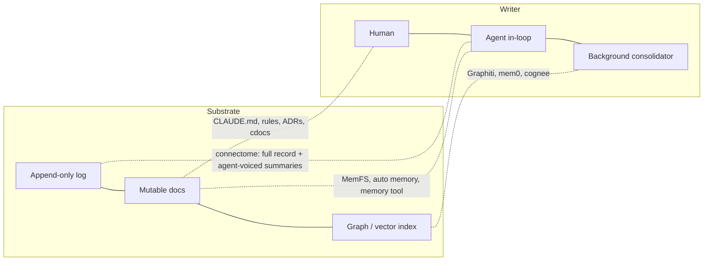

---
first_authored:
  by: "@claude-opus-5-5"
  at: 2026-09-26T12:45:00-07:00
task_list: cdocs/connectome-research
type: report
state: live
status: review_ready
tags: [research, landscape, memory, context-management, connectome]
last_reviewed:
  status: accepted
  by: "@claude-opus-5-5"
  at: 2026-09-26T14:15:00-07:00
  round: 2
---

# Long-Lived Agent Memory Landscape: Comparators for Connectome and cdocs

> BLUF(opus/connectome-research): Two trends that are easy to conflate should be kept apart.
> **Substrate:** agent harnesses and coding tools are shifting toward **plain files as the durable store, a small pinned index loaded every turn, on-demand reads for everything else, and an asynchronous consolidation pass** ("sleep-time", "dreaming", "defragmentation", "phase-2 consolidation").
> Letta replaced database-backed memory tools with git-backed markdown (MemFS), Anthropic ships a file-based memory tool plus offline "dreams", and Claude Code, Codex, and OpenClaw all keep markdown memory on disk.
> **Authorship:** this is *not* converging on the agent as writer. In coding tools, autonomous agent-written memory is being demoted (Cursor removed Memories, Devin deprecated Knowledge, Codex/Windsurf point must-follow guidance to rules files), and the consolidation passes that remain emit a reviewable output rather than mutating in place.
> Outside coding tools, the most-adopted dedicated memory layers (mem0, Graphiti, cognee) are not files-first, and they remain strongest for **per-user conversational recall with temporal updates**.
> Identity persistence is mainstream in personal-agent harnesses (OpenClaw, ~390k stars, ships an agent-editable `SOUL.md`) but unmeasured on task outcomes; it is rare only among coding tools and memory-layer SaaS.
> For coding agents specifically the evidence is thin and sobering: repo-level context files do not reliably raise SWE-bench success and cost ~20% more tokens, while *curated, abstracted* prior experience helps and *raw* trajectories can hurt.
> Vendor memory benchmarks (LoCoMo, LongMemEval-S) are near-saturated, fit in context, and have been publicly disputed between vendors; treat every leaderboard number as marketing unless the protocol is published.
> That includes the result most flattering to file-based designs (a Letta grep-over-files agent beating Mem0's self-reported LoCoMo score), which is a cross-harness comparison where a full-context baseline also beats Mem0.
> For cdocs, the transferable patterns are: a size-capped pinned index, typed/timestamped frontmatter, validity/supersession links rather than silent overwrite, an explicit human-reviewed consolidation pass, and preferring abstracted lessons over raw logs at retrieval time.

## Context / Background

This report is unit B of the connectome research arc (see [`cdocs/devlogs/2026-09-26-connectome-research-arc.md`](../devlogs/2026-09-26-connectome-research-arc.md)).
A sibling report covers Anima Labs' [connectome](https://animalabs.ai/connectome) itself; here it appears only as a positioning point.
Per Anima's own description, connectome keeps "a complete, branchable record of events" and lets agents "write their own memories as their histories grow, with the original record still available", with a default "autobiographical memory strategy" whose summaries are "voiced as the agent itself" ([animalabs.ai/connectome](https://animalabs.ai/connectome)).
That places it at the **identity-persistence** end of the space, alongside OpenClaw, Letta persona blocks, and Honcho; coding tools and memory-layer SaaS mostly do not target that end.

This report is written for the cdocs team and ends with cdocs-specific patterns.
The survey sections (Key Findings through Evidence) aim to be a neutral landscape; cdocs-favorable inferences are confined to "Patterns That Transfer" and "Recommendations" and labelled there.
Readers should weigh it accordingly.

The question this report serves: what do other long-lived context systems do, how do they differ on explicit axes, what actually works for coding/productivity agents, and what transfers to cdocs, a git-committed, log-centric markdown doc system (devlogs, proposals, reports, reviews with frontmatter).

Method: vendor docs, papers, and GitHub metadata (stars and last push via `gh api`, 2026-09-26), plus the Codex memories pipeline README read from source.
Where a claim rests on a vendor's own benchmark or a secondary blog, it is flagged.

## Key Findings

- **Substrate is shifting toward files, within agent harnesses and coding tools.** Letta (the MemGPT originators) announced in March 2026 that "memory moves from specialized memory tools that edit memory in a database to generalized computer use tools like bash that operate over memory projected into git-backed files" ([Letta's Next Phase](https://www.letta.com/blog/our-next-phase/)).
  Anthropic's memory tool is a client-side file CRUD tool rooted at `/memories` ([docs](https://platform.claude.com/docs/en/agents-and-tools/tool-use/memory-tool)); Claude Code auto memory, Codex memories, OpenClaw, Hermes Agent and Basic Memory are all markdown-on-disk.
  Limits of this claim: Letta (24.9k stars) made the MemFS switch six months before this report and published no evaluation of it; the most-adopted dedicated memory layers (mem0 66k, Graphiti 31k, cognee 31k) are vector/graph-first and show no sign of moving.
  "Shifting toward" is the defensible wording, not "converged".
- **Pinned index plus lazy detail is the dominant retrieval shape.** Claude Code loads the first 200 lines / 25KB of `MEMORY.md` and reads topic files on demand ([docs](https://code.claude.com/docs/en/memory)); Letta MemFS pins `system/` files and leaves the rest until read ([Context Repositories](https://www.letta.com/blog/context-repositories/)); Devin Knowledge distinguishes repo-pinned from trigger-retrieved items ([docs](https://docs.devin.ai/product-guides/knowledge)).
- **Consolidation has become a named, asynchronous, separate pass.** Letta sleep-time agents, then MemFS "reflection" and "defragmentation" subagents; Anthropic [Dreams](https://platform.claude.com/docs/en/managed-agents/dreams) (research preview, beta header `dreaming-2026-04-21`); OpenAI ChatGPT "Dreaming" (June 2026) and Codex's two-phase extraction/consolidation pipeline ([source README](https://github.com/openai/codex/blob/main/codex-rs/memories/README.md)).
  The Anthropic and Codex variants both produce a reviewable diff/new store rather than mutating in place.
- **Authorship is not converging on the agent: agent-written auto-memory in coding tools is being demoted, not promoted.** Cursor staff confirmed "The Memories feature was intentionally removed starting from version 2.1.x" and told users "You can export your memories and move them into Rules" (Cursor team reply, 2025-11-25, [forum](https://forum.cursor.com/t/are-my-memories-gone/144057)); no stated rationale was found. Devin's docs say "Knowledge is deprecated and will be removed in a future update. Existing Knowledge is being migrated to Skills in Plugins automatically" ([docs](https://docs.devin.ai/product-guides/knowledge)); Windsurf/Devin Desktop and Codex docs both say durable rules belong in rules files or `AGENTS.md`, with memories as "a helpful recall layer, not ... the only source for rules that must always apply" ([Codex memories](https://learn.chatgpt.com/docs/customization/memories?surface=app)).
  The direction in coding tools is toward human-owned rules plus a reviewed consolidation pass, which is a different claim from "files won" and one the file-substrate trend does not imply.
  It also cuts against any design, cdocs included, whose corpus is mostly agent-written and only loosely reviewed.
- **Coding evidence is thin and mixed.** Gloaguen et al. (ETH, Feb 2026) find context files "do not generally improve task success rates, while increasing inference cost by over 20%" (the >20% is mainly LLM-generated files; developer-written ones cost up to ~19%); developer-written files gave +2.4pp (not significant) and LLM-generated ones slightly negative (evaluated on SWE-bench Lite and CTXbench, a niche-repo set with developer-committed context files) ([arXiv:2602.11988](https://arxiv.org/abs/2602.11988)).
  SWE-ContextBench finds summarized, correctly retrieved prior experience helps while "unfiltered or incorrectly selected context provides limited or negative benefits" ([arXiv:2602.08316](https://arxiv.org/abs/2602.08316)); Kim et al. find "high-level insights generalize well, whereas low-level traces often induce negative transfer" ([arXiv:2604.14004](https://arxiv.org/abs/2604.14004)).
- **Benchmarks are weak instruments.** LoCoMo conversations fit in context; a full-context baseline (~73%) beat Mem0's best (~68%) ([Zep critique](https://blog.getzep.com/lies-damn-lies-statistics-is-mem0-really-sota-in-agent-memory/)); a grep-over-files Letta agent scored 74.0%, self-run and set against Mem0's self-reported number ([Letta](https://www.letta.com/blog/benchmarking-ai-agent-memory/)); Mem0 and Zep publicly disputed each other's configurations.
  The safe reading is that on LoCoMo almost anything that sees enough of the conversation beats Mem0's graph variant; it says little about files versus graphs.
  Independent 2026 work argues leaderboards are "not interpretable without the full protocol" ([arXiv:2607.16848](https://arxiv.org/abs/2607.16848)) and that "production failures are predominantly forgetting failures rather than recall failures, yet existing benchmarks measure only recall" ([arXiv:2606.15903](https://arxiv.org/abs/2606.15903)).
- **Persistent memory is an attack surface.** "Sleeper memory poisoning" via external content reached up to 99.8% implant success on GPT-5.5, and retrieved poisoned memories drove attacker-intended actions in 60-89% of cases ([arXiv:2605.15338](https://arxiv.org/abs/2605.15338)).
  Human-legible, diff-reviewed memory is a real mitigation, not just an aesthetic preference (inference).
- **Identity persistence is mainstream in personal-agent harnesses, rare in coding tools and memory-layer SaaS.** OpenClaw, at ~390k stars by far the most-adopted system surveyed here, injects agent-editable `SOUL.md`/`IDENTITY.md` persona files every session; Hermes Agent plugs into Honcho (self-representation as observer==observed); Letta's lineage began with persona blocks (e.g. the Bluesky agent "void"); Generative Agents and connectome treat the *agent's own* evolving self as a first-class memory object.
  Coding tools and memory layers (Cursor, Devin, Codex, Claude Code, mem0, Zep) model the *user* or the *project* instead.
  What identity designs optimize for (behavioral consistency across sessions, relationship continuity with a user or community, a coherent self-model the agent can reason from) is not what any benchmark in this report measures; no study found here tests identity persistence on task outcomes, positively or negatively.

## Taxonomy

Eight axes, each with its value set.
The comparison table below uses these codes.

| Axis | Values | Why it matters for cdocs |
|---|---|---|
| **Unit of memory** | message/event; extracted fact; note/document; KG node+edge; block (labelled context span); procedure/skill; derived artifact (e.g. repo map) | cdocs' unit is a whole authored document plus frontmatter |
| **Writer** | agent (in-loop), system (background extractor/consolidator), human | Determines trust, drift, and injection exposure |
| **Structure** | log (append-only), doc (mutable files), graph, vector, tiered (pinned + archival) | Many systems are hybrids; the table lists the primary one |
| **Retrieval** | pinned (always in context), keyword/grep, embedding, graph traversal, agentic (agent decides what to open) | Pinned costs every turn; agentic costs tool calls |
| **Consolidation / forgetting** | none; overwrite-in-place; invalidate-with-validity-interval; periodic LLM consolidation; usage/decay-based eviction; size-cap pressure | The least-benchmarked axis, and per arXiv:2606.15903 the one that fails in production |
| **Identity model** | none; user model; persona block (static or agent-editable); evolving self-model | Connectome's distinguishing axis |
| **Auditability** | opaque DB; inspectable via API/UI; plain files; plain files + VCS history | cdocs is at the maximal end |
| **Scope** | per-user, per-project/repo, per-agent, shared/team | Git-committed = shared team scope by default |

## Systems

Grouped by family.
Maturity data from `gh api` on 2026-09-26 unless stated.

### Tiered / self-editing: Letta (MemGPT)

- **Origin.** MemGPT ([arXiv:2310.08560](https://arxiv.org/abs/2310.08560)) framed the context window as RAM with paged archival/recall storage and let the agent edit "core memory" blocks (`persona`, `human`) via tools.
  A memory block is "a labeled section of the context window with an associated character limit" ([docs](https://docs.letta.com/guides/agents/architectures/sleeptime/)).
- **Sleep-time agents.** A second agent sharing the primary's blocks rewrites them asynchronously ([docs](https://docs.letta.com/guides/agents/architectures/sleeptime/)); the paper reports ~5x less test-time compute for equal accuracy and up to 18% accuracy gains on its benchmarks ([arXiv:2504.13171](https://arxiv.org/abs/2504.13171)), on stateful math/QA tasks rather than coding.
- **Current state (2026).** Letta's flagship is now Letta Code, a model-agnostic coding harness; server-side sleep-time and legacy memory tools are being sunset ([Next Phase](https://www.letta.com/blog/our-next-phase/), 2026-03-16).
  Memory is **MemFS / Context Repositories**: a git repo of markdown files with frontmatter descriptions; `system/` is pinned into the system prompt; every change is auto-committed; memory subagents (initialization, reflection, defragmentation into "15-25 focused files") work in isolated git worktrees and merge back ([Context Repositories](https://www.letta.com/blog/context-repositories/), 2026-02-12).
  No quantitative evaluation was published for MemFS.
- `letta-ai/letta` 24.9k stars, pushed 2026-09-10; `letta-ai/letta-code` 3.4k, pushed 2026-09-26.
- **Relevance.** MemFS is the closest external analogue to cdocs: git-backed markdown with frontmatter, agent-written, worktree-concurrent.
  The difference is ownership: MemFS is *the agent's* repo (per-agent scope), cdocs lives *in the project* repo (shared scope).

### Temporal knowledge graph: Zep / Graphiti

- **Mechanism.** Graphiti ingests "episodes" (messages, JSON, text), LLM-extracts entities and relations, and stores **bi-temporal edges**: valid-from/valid-to in the world plus ingested/invalidated-at in the system, so contradicted facts are invalidated rather than deleted ([Zep paper, arXiv:2501.13956](https://arxiv.org/abs/2501.13956); [Graphiti docs](https://help.getzep.com/graphiti/getting-started/welcome)).
  Retrieval is hybrid (embedding + BM25 + graph traversal) without an LLM call at query time.
- **Claims.** Zep reports 94.8% vs MemGPT 93.4% on DMR and up to 18.5% accuracy gain with ~90% latency reduction on LongMemEval versus full-context baselines (vendor paper).
- **State.** Zep Community Edition was deprecated in April 2025; Graphiti (Apache-2.0) is the OSS core, with an MCP server ([announcement](https://blog.getzep.com/announcing-a-new-direction-for-zeps-open-source-strategy/)).
  `getzep/graphiti` 31.2k stars, pushed 2026-09-26.
- **Relevance.** The validity-interval model is the most transferable idea in the whole landscape for a doc system: supersession as a first-class, queryable fact.

### Extracted-fact memory layers: mem0, LangMem, cognee

- **mem0.** LLM extracts salient facts from conversation into a vector store (optional graph); the 2025 paper claims 26% relative improvement over OpenAI memory on LoCoMo with 91% lower p95 latency ([arXiv:2504.19413](https://arxiv.org/abs/2504.19413)).
  The April 2026 algorithm switched to single-pass **ADD-only** extraction ("no UPDATE/DELETE operations ... nothing being overwritten"), replaced external graph stores with built-in entity linking, and fuses semantic + BM25 + entity retrieval; it claims 91.6 LoCoMo / 93.4 LongMemEval ([migration docs](https://docs.mem0.ai/migration/platform-v2-to-v3); [mem0 blog](https://mem0.ai/blog/state-of-ai-agent-memory-2026)).
  Those are vendor numbers on benchmarks this report considers saturated.
  OpenMemory is its local MCP server. `mem0ai/mem0` 66.0k stars, pushed 2026-09-25.
- **LangMem** (LangChain). SDK for semantic, episodic, and **procedural** memory; procedural memory rewrites the agent's system prompt via metaprompt/gradient optimizers ([launch](https://www.langchain.com/blog/langmem-sdk-launch)).
  Repo active (pushed 2026-09-09, 1.7k stars) but PyPI still 0.0.x per [Ry Walker's survey](https://rywalker.com/research/langmem) (secondary).
- **cognee.** "ECL" pipeline (extract, cognify, load) building a combined graph + vector store from 38+ formats, with a "memify" stage that refines the graph from interaction traces; MCP support ([repo](https://github.com/topoteretes/cognee)).
  31.0k stars, pushed 2026-09-26. No independent evaluation found.

### Research architectures: Generative Agents, A-MEM

- **Generative Agents** (Park et al., [arXiv:2304.03442](https://arxiv.org/abs/2304.03442)): an append-only **memory stream** of observations, each LLM-scored for *importance* (1-10); retrieval ranks by recency (exponential decay) + importance + embedding relevance; **reflection** fires when summed recent importance crosses a threshold, writing higher-level inferences back into the stream as memories that cite their evidence.
  The agent's self-description is regenerated from memory, making it an evolving self-model.
  Reference repo dormant since 2024-08 (22.1k stars), but the recency/importance/relevance triple and reflection-with-citations are the ancestor of most "dreaming" designs.
- **A-MEM** (Xu et al., NeurIPS 2025, [arXiv:2502.12110](https://arxiv.org/abs/2502.12110)): Zettelkasten-style notes with LLM-generated keywords, tags, and context; each new note triggers link generation to related notes and **memory evolution**, where new notes update attributes of old ones.
  Research code (two repos, ~1k stars each, last pushed 2025-12 and 2026-03); effectively a paper artifact.

### Model-vendor memory: Anthropic, OpenAI

- **Anthropic memory tool** (`memory_20250818`): client-side file ops (`view`, `create`, `str_replace`, `insert`, `delete`, `rename`) under `/memories`.
  The API injects: "IMPORTANT: ALWAYS VIEW YOUR MEMORY DIRECTORY BEFORE DOING ANYTHING ELSE ... ASSUME INTERRUPTION: Your context window might be reset at any moment" ([docs](https://platform.claude.com/docs/en/agents-and-tools/tool-use/memory-tool)).
  The docs recommend a multisession software pattern (initializer session, progress log, feature checklist, end-of-session update), mirroring [Effective harnesses for long-running agents](https://www.anthropic.com/engineering/effective-harnesses-for-long-running-agents) (`claude-progress.txt` + JSON feature list + git commits).
- **Context editing and compaction.** Context editing clears stale tool results client-side; compaction summarizes older turns server-side.
  Anthropic's launch post reports +29% (editing) and +39% (editing + memory) on an *internal* agentic-search eval and 84% token reduction on a 100-turn web-search eval ([claude.com/blog/context-management](https://claude.com/blog/context-management), 2025-09-29): vendor, internal, not coding-specific.
- **Managed Agents Dreams** (research preview): an async job takes a memory store plus 1-100 session transcripts and emits a **new** store with "duplicates merged, stale or contradicted entries replaced with the latest value, and new insights surfaced"; "the input store is never modified, so you can review the output and discard it" ([docs](https://platform.claude.com/docs/en/managed-agents/dreams)).
  The widely repeated "Harvey ~6x task completion" figure is a customer anecdote relayed by press, not a published eval.
- **Claude Code.** Human-authored `CLAUDE.md` hierarchy (managed/user/project/local, `@` imports up to four hops, path-scoped `.claude/rules/`), plus **auto memory** on by default: per-repo, machine-local `~/.claude/projects/<project>/memory/`, typed notes (`user`, `feedback`, `project`, `reference`) in frontmatter, a `MEMORY.md` index whose first 200 lines / 25KB load each session with harness pressure to keep it one line per entry, and a `modified` timestamp stamped into frontmatter on write ([docs](https://code.claude.com/docs/en/memory)).
  Auto memory explicitly "skips anything it can derive from the codebase" and anything `CLAUDE.md` already says.
- **ChatGPT.** Two layers: explicit "saved memories" and "reference chat history", the latter a regenerated user dossier injected into every conversation rather than per-query retrieval ([OpenAI](https://openai.com/index/memory-and-new-controls-for-chatgpt/); Simon Willison's reverse-engineering and critique: [I really don't like ChatGPT's new memory dossier](https://simonwillison.net/2025/May/21/chatgpt-new-memory/)).
  In June 2026 OpenAI rebuilt dossier generation as "Dreaming" and added "Memory Sources" attribution per response ([OpenAI](https://openai.com/index/chatgpt-memory-dreaming/); page returned 403 to this fetcher, details from secondary coverage).
- **Codex memories** (preview, off by default): Phase 1 extracts `raw_memory` + `rollout_summary` per idle rollout with secret redaction; Phase 2 takes a global lock, selects memories by `usage_count` and recency within `max_unused_days`, writes `raw_memories.md` and `rollout_summaries/` into `~/.codex/memories/` which is **itself a git baseline**, writes a `phase2_workspace_diff.md`, and runs a no-network consolidation subagent against that diff ([source](https://github.com/openai/codex/blob/main/codex-rs/memories/README.md)).
  This is the most concrete published example of *usage-based forgetting* plus *diff-driven consolidation*.

### Coding-tool memory: Cursor, Devin / Windsurf, Aider

- **Cursor.** Project rules in `.cursor/rules/` (always-applied, glob-scoped, or agent-requested by description), plus `AGENTS.md` support.
  Auto "Memories" (mid-2025, background-generated with user approval) were intentionally removed in 2.1.x; Cursor staff pointed users to an "Export memories" command producing an `.mdc` file to add as user or project rules ([forum, Cursor team reply 2025-11-25](https://forum.cursor.com/t/are-my-memories-gone/144057)).
  No rationale was found; the reporting user remarked that memories "are almost no different than .mdc files".
- **Devin Knowledge.** Items with a *trigger description* retrieved "when relevant, not all at once"; repo-pinnable; auto-suggested from chat feedback for human approval; deprecated, with "Existing Knowledge ... being migrated to Skills in Plugins automatically" ([docs](https://docs.devin.ai/product-guides/knowledge)).
- **Windsurf / Devin Desktop Cascade memories.** Auto-generated, workspace-scoped, machine-local in `~/.codeium/windsurf/memories/`; docs steer durable guidance to Rules/`AGENTS.md` ([docs](https://docs.devin.ai/desktop/cascade/memories)).
- **Aider repo map.** Not memory in the episodic sense but the canonical *derived, regenerated* context: tree-sitter extracts definitions/references, a file dependency graph is ranked (PageRank-style) to select "the most important identifiers", within `--map-tokens` (default 1k) sized dynamically ([docs](https://aider.chat/docs/repomap.html)).
  Nothing to go stale because nothing is stored. `Aider-AI/aider` 49.2k stars but last push 2026-05-22: slowing.

### Doc-as-memory and identity-first file systems

- **ADRs / devlogs / `AGENTS.md`.** Human- (or agent-) authored, VCS-versioned, reviewed via PR; retrieval by path convention, grep, or explicit import.
  The Gloaguen result applies directly: undirected repository overviews do not pay; project-specific non-standard instructions might.
- **Basic Memory** (AGPL, 4.0k stars, active): markdown notes with `[category]` observations and `[[wiki-link]]` typed relations, indexed in SQLite, exposed as ~15 MCP tools including `build_context` graph navigation; humans edit in Obsidian, agents via MCP ([repo](https://github.com/basicmachines-co/basic-memory)).
  It shows a doc system can carry a lightweight graph *inside* markdown without a graph DB.
- **OpenClaw** (390k stars, active): workspace of injected files (`AGENTS.md`, `SOUL.md` identity/tone, `USER.md`, `MEMORY.md` curated long-term, `memory/YYYY-MM-DD.md` daily logs, "read today + yesterday on session start") ([docs](https://docs.openclaw.ai/concepts/memory)).
  This is a log-plus-curated-index design with an explicit persona file: structurally the nearest mass-market cousin of both cdocs (dated logs) and connectome (identity).
  Its adoption is the strongest evidence in this survey that users want an agent with a persistent, editable self, even though no evaluation of that self's effect was found.
- **Hermes Agent** (Nous Research): agent-curated `MEMORY.md` with periodic nudges, auto-created and self-patched skills after 5+ tool-call tasks, optional `write_approval` staging, pluggable providers including Honcho ([docs](https://hermes-agent.nousresearch.com/docs/user-guide/features/memory)).
  A 2026 paper warns self-evolving skills can drift unsafe ([arXiv:2608.12851](https://arxiv.org/pdf/2608.12851), title only checked).
- **Honcho** (Plastic Labs, AGPL, 7.4k stars, active): stores per-(observer, observed) peer representations, so self-representation is the observer==observed case; explicit "identity" positioning and theory-of-mind reasoning ([repo](https://github.com/plastic-labs/honcho)).
  Its reported ~90% LongMem-class score comes from a secondary review, unverified.

## Comparison Table

Codes: Writer A=agent, S=system/background, H=human.
Retrieval P=pinned, K=keyword/grep, E=embedding, G=graph, Ag=agentic.
Audit: 0=opaque, 1=API/UI inspectable, 2=plain files, 3=files+VCS.
Free-text cells in Structure and Retrieval (e.g. `entity`, `trigger-Ag`, `dialectic query`, `doc store`) mark hybrids or system-specific mechanisms that the axis codes do not cover; the Systems section above describes each.

| System | Unit | Writer | Structure | Retrieval | Consolidation / forgetting | Identity | Audit | Scope | State (2026-09) |
|---|---|---|---|---|---|---|---|---|---|
| Letta classic (MemGPT) | block + archival passage | A, S (sleep-time) | tiered | P + E + Ag | agent rewrite; sleep-time rewrite; char caps | persona block (agent-editable) | 1 | per-agent | legacy, being sunset |
| Letta MemFS | md file + frontmatter | A, S (reflection/defrag subagents) | doc (git) | P (`system/`) + K + Ag | defrag into 15-25 files; git history | persona files | 3 | per-agent | active flagship |
| Zep / Graphiti | episode, entity, bi-temporal edge | S | graph + vector | E + K + G | invalidate with validity interval | user/entity model | 1 | per-user / group | active; Zep CE deprecated |
| mem0 (2026) | extracted fact + entities | S | vector + entity index | E + K + entity | ADD-only accumulation; temporal ranking | user model | 1 | per-user/agent/session | active |
| LangMem | fact, episode, prompt update | S (+A tools) | vector store (LangGraph) | E | background reflection; prompt rewrite | procedural (prompt) | 1 | configurable namespaces | active, pre-1.0 |
| cognee | KG node/edge + chunk | S | graph + vector | E + G | "memify" refinement | none | 1 | per-dataset/project | active |
| Generative Agents | observation, reflection | A (in sim) | log (stream) | recency + importance + E | reflection on importance threshold; decay | evolving self-model | 2 (JSON stream) | per-agent | dormant research |
| A-MEM | Zettel note | S | graph of notes | E + links | memory evolution (rewrites old notes) | none | 1 | per-agent | research artifact |
| Anthropic memory tool | file | A | doc | Ag (view first) | agent-managed; app-defined expiry | none | 2 (app-owned) | app-defined | GA tool |
| Anthropic Dreams | memory entry | S | doc store | n/a (offline) | merge, replace contradicted, surface insights; new store, human chooses whether to adopt | none | 1-2 | per-store | research preview |
| Claude Code CLAUDE.md + rules | instruction file | H (A on request) | doc | P + path-scoped P | manual | none | 3 (if committed) | org/user/project | active |
| Claude Code auto memory | typed md note + index | A | doc (index + topics) | P (200 lines) + Ag | size-cap pressure; `modified` stamp | user model (`user` type) | 2 | per-repo, machine-local | active, default on |
| ChatGPT memory | saved fact; dossier | A + S ("Dreaming") | doc (dossier) | P | background rewrite; auto-prioritize | user model | 1 (Memory Sources) | per-user | active |
| Codex memories | raw memory, rollout summary | S | doc (local git baseline) | P (injected) | usage + recency selection, `max_unused_days`, diff-driven consolidation agent | user/project | 2-3 (local git) | per-user, machine-local | preview |
| Cursor | rule file | H | doc | P / glob / Ag (description) | manual | none | 3 | project/user | Memories removed 2.1 |
| Devin Knowledge | knowledge item + trigger | H (A suggests) | doc store | trigger-Ag + repo pin | manual; enable/disable | none | 1 | org/repo | migrating to Skills |
| Windsurf Cascade memories | memory | A | doc store | Ag | none documented | none | 2 (local) | per-workspace, local | active, de-emphasized |
| Aider repo map | ranked symbol list | S (derived) | graph (ephemeral) | G rank under token budget | regenerated each turn | none | n/a | per-repo | slowing |
| ADRs / devlogs / AGENTS.md | document | H (+A) | log + doc | P / K / Ag | supersede by new doc | none | 3 | project, shared | convention |
| Basic Memory | note w/ observations + relations | H + A | doc + in-md graph | K + G (`build_context`) | manual | none | 2-3 | per-project | active |
| OpenClaw | daily log + curated MEMORY + SOUL | A (+H) | log + doc | P (today+yesterday, MEMORY) + Ag | agent curation daily-to-MEMORY | persona file (agent-editable) | 2 | per-agent | very active |
| Hermes Agent | MEMORY entry, skill | A (optional approval) | doc | P + Ag | nudged curation; skill self-patching | user model (+Honcho) | 2 | per-agent/user | active |
| Honcho | peer representation | S | vector + reasoning store | E + dialectic query | continual derivation | evolving self/other model | 1 | per-peer pair | active |
| *connectome (positioning)* | event + agent-voiced summary | A (own model) | branchable log + folds | pinned folds + adaptive resolution | fold/compress, original retained | evolving autobiographical self | 2-3 (inference) | per-agent, shared spaces | active (see sibling report) |
| *cdocs (positioning)* | frontmatter md doc | A (H directs; review mostly by agents) | log (dated) + doc | P (rules) + K + Ag | supersede via `status: evolved`, `state: archived` | none | 3 | project, shared | this repo |

## Evidence: What Works for Coding and Productivity Agents

### Benchmark landscape, critically

- **LoCoMo** ([Maharana et al., ACL 2024, arXiv:2402.17753](https://arxiv.org/abs/2402.17753)) and **LongMemEval** ([Wu et al., ICLR 2025, arXiv:2410.10813](https://arxiv.org/abs/2410.10813)) are *personal-assistant conversational recall* benchmarks.
  Neither contains code, repositories, or task execution.
- **They fit in context.** LoCoMo conversations are ~16-26k tokens; a full-context baseline scored ~73% versus Mem0's reported 68.5% ([Zep](https://blog.getzep.com/lies-damn-lies-statistics-is-mem0-really-sota-in-agent-memory/)).
  LongMemEval-S is ~115k tokens, and its single-session categories sit at 96-99 for top systems (per [secondary summary](https://dev.to/valesys/critical-flaws-in-long-term-memory-benchmarks-addressing-unreliable-and-uninterpretable-results-1o05); not independently verified).
- **Answer keys and judges are noisy.** Zep documents missing ground truth, speaker attribution errors, and ambiguous questions in LoCoMo; a secondary source reports an independent audit finding 6.4% score-corrupting answer-key errors and lenient LLM judging (unverified).
- **Vendor disputes are the norm.** Mem0's CTO argued Zep's 84% should be 58.44% due to excluding the adversarial category from the denominator; Zep re-reported 75.14% and accused Mem0 of misconfiguring Zep; Letta stated Mem0's MemGPT numbers could not be reproduced ([Letta](https://www.letta.com/blog/benchmarking-ai-agent-memory/); [Zep](https://blog.getzep.com/lies-damn-lies-statistics-is-mem0-really-sota-in-agent-memory/)).
  No major vendor number in this space has been independently replicated under a shared protocol that this report could find.
- **Protocol dominates architecture.** Sheverev et al. show rankings flip under a retrieval budget (one top system used 2.6M characters per query) ([arXiv:2607.16848](https://arxiv.org/abs/2607.16848)); Spencer reports a "tenure crossover" where a curated-map system falls from 96% to 72% recall between three and nine weeks while a provenance-typed graph rises to 90% ([arXiv:2607.21962](https://arxiv.org/abs/2607.21962), single-author, synthetic).
- **Forgetting is under-measured.** ForgetEval ([arXiv:2606.15903](https://arxiv.org/abs/2606.15903)) finds deterministic stores fail canonicalization, write-time LLM extraction fixes that but cannot do intent-aware deletion, and mutation-time hooks recover it (78-85%).
- **Simple matches bespoke on the old benchmarks.** Letta's grep/open-files agent scored 74.0% on LoCoMo with GPT-4o mini, and Letta's stated reason is that agents are better at filesystem tools that "appear frequently in training data" than at specialized memory APIs ([Letta](https://www.letta.com/blog/benchmarking-ai-agent-memory/)).
  It gets the same discount as every other number here: Letta ran its own system and compared it against Mem0's self-reported 68.5%, not in a shared harness, on a benchmark whose conversations fit in context and where a full-context baseline (~73%) also beats Mem0.
  It is weak evidence that a file-based agent is *not worse* on conversational recall, and no evidence about files versus graphs for coding.
  The training-data-familiarity argument is plausible but untested here.

### Coding-specific evidence

- **Static repo context files:** no significant success gain; cost +20-23% for LLM-generated files and up to ~19% for developer-written ones; more steps; developer-written beat LLM-generated (p=3.8%); overviews ineffective; recommend only "specific additional instructions beyond what is already available in the codebase" ([arXiv:2602.11988](https://arxiv.org/abs/2602.11988)).
  Caveat: SWE-bench Lite tasks are single-shot issue fixes where cross-session memory has little to offer by construction.
  But the study also ran CTXbench (138 instances from niche repos whose developers had committed context files), the setting closest to cdocs, and still found no significant gain; the caveat does not rescue project-level context files.
- **Cross-task experience:** SWE-ContextBench (1,476 tasks, 51 repos) shows summarized, accurately retrieved prior experience improves resolution and cuts cost "particularly on harder tasks", while raw or mis-selected context is neutral-to-harmful ([arXiv:2602.08316](https://arxiv.org/abs/2602.08316)).
- **Abstraction level:** cross-domain memory +3.7% on average, "primarily by transferring meta-knowledge, such as validation routines, rather than task-specific code"; low-level traces cause negative transfer ([arXiv:2604.14004](https://arxiv.org/abs/2604.14004)).
- **Multi-session continuation:** DreamBench-SWE, where later tasks depend on non-inferable earlier-session evidence, shows no-memory at 11.7% versus 45-54% for any memory-bearing configuration, but explicitly does not establish superiority among memory architectures ([arXiv:2608.20664](https://arxiv.org/abs/2608.20664), single author, recent).
  Read: *having* a written record of decisions matters far more than *how* it is indexed.
- **Harness practice:** Anthropic's long-running-agent harness relies on a progress file, a structured feature list, and git history rather than any retrieval system, targeting failure modes like "agent declares victory prematurely" ([Anthropic engineering](https://www.anthropic.com/engineering/effective-harnesses-for-long-running-agents)).
- **Practitioner and product signals:** Cursor removed auto-memories; Devin is folding Knowledge into Skills; Windsurf and Codex tell users to put must-follow guidance in `AGENTS.md`/rules; Willison objects to injected dossiers on context-control grounds ([blog](https://simonwillison.net/2025/May/21/chatgpt-new-memory/)).
  Inference: in coding tools, un-reviewed agent-written memory has produced enough noise ("context rot") that vendors are steering users back to explicit, human-owned files.

### Net assessment

Confidence **medium-high** that for coding, (a) the presence of a durable decision/progress record matters, (b) abstracted lessons beat raw logs at retrieval time, (c) blanket pinned context has a real token cost without guaranteed accuracy gain.
Confidence **low** in any claim that graph or vector memory layers beat plain files plus agentic search for coding, and equally low in the reverse; no coding benchmark isolates that comparison fairly.
Confidence **medium** that coding-tool vendors are moving away from un-reviewed agent-written memory toward human-owned rules.
**No evidence either way** on whether persistent agent identity helps or hurts task outcomes; it has not been measured.

## Patterns That Transfer to cdocs

This section is inference aimed at cdocs, not survey.
On *substrate*, cdocs already sits at the "plain files + VCS, shared project scope, human-legible, log-centric" corner that agent harnesses and coding tools are shifting toward.
On *authorship*, it does not: per the sibling cdocs-as-memory report, cdocs documents are written almost entirely by agents and reviewed mostly by agents, which is the pattern coding-tool vendors are retreating from.
The gaps are on human review in the write path, consolidation, supersession, and retrieval shaping.

1. **Size-capped pinned index, everything else agentic.**
   Claude Code's 200-line `MEMORY.md` cap with harness pressure, Letta's `system/` pin, and OpenClaw's "today + yesterday" all bound the per-turn tax.
   cdocs analogue: a generated, capped index (one line per live doc: path, type, status, BLUF first sentence) rather than pinning rule bodies or doc content.
   The ETH result argues the pinned part should be *project-specific non-obvious instructions*, not overviews.
2. **Typed, timestamped frontmatter as the retrieval key.**
   Claude Code auto memory's `type` + `modified`, Basic Memory's observation categories, Devin's trigger descriptions, and Letta's frontmatter descriptions all give the agent something cheap to filter on before opening a file.
   cdocs frontmatter already has `type`/`status`/`state`/`tags`; a one-line trigger-style description field (when to read this) is the missing piece (inference).
3. **Supersession as data, not overwrite.**
   Graphiti's validity intervals and mem0's ADD-only turn are both "never silently lose the old fact".
   cdocs' `status: evolved` and `state: archived` are coarse versions; explicit `supersedes:` / `superseded_by:` links would let retrieval skip stale docs deterministically, which is exactly the forgetting failure mode ForgetEval says benchmarks miss.
4. **Consolidation as a separate, reviewable pass that emits a diff.**
   Dreams produce a new store for approval; Codex runs its consolidator against `phase2_workspace_diff.md` inside a git baseline; Letta's defrag subagent works in a worktree.
   cdocs analogue: a periodic "distill" pass that reads recent devlogs and proposes lesson/rule updates as a normal reviewed commit, i.e. `/cdocs:triage` extended from frontmatter hygiene to content consolidation.
   This keeps humans in the write path, which is also the main defense against memory poisoning.
   It only works if a human actually reviews the distilled output; an agent-reviewed consolidation pass reproduces the unreviewed-memory pattern that Cursor and Devin dropped.
5. **Abstract before you retrieve.**
   Coding evidence consistently favors high-level lessons over raw trajectories.
   Devlogs are raw trajectories; reports and reviews are closer to abstractions.
   Retrieval guidance should prefer BLUFs, reports, and accepted proposals, reaching into devlogs only for provenance (inference from arXiv:2604.14004 and 2602.08316).
6. **Usage-based decay signals.**
   Codex ranks by `usage_count` and drops memories unused for `max_unused_days`; Generative Agents decay by recency.
   A git-native analogue is cheap: last-referenced date derived from grep of later docs/commits, used only to *rank* or flag archive candidates, never to delete.
7. **Treat identity as an open question with an unmeasured payoff, not a settled "no".**
   Identity-persistence systems (OpenClaw `SOUL.md`, connectome, Letta persona, Honcho) are widely adopted, OpenClaw most of all, and optimize for behavioral consistency, relationship continuity, and a coherent self-model rather than per-task success.
   The costs are known (pinned tokens every turn, a persona file is one more injection target); the benefits for coding work are *unmeasured*, not shown to be absent.
   Plausible mechanisms exist: stable working style across sessions, fewer re-derived conventions, and a persistent reviewer or overseer role whose judgments stay calibrated over time.
   For cdocs, the cheap position is that the project's decision history and conventions are the primary thing to persist; whether a persisted agent role or self-model adds value on top is an experiment worth running, not a question this evidence closes (inference).
8. **Derived views over stored copies where the source of truth is the repo.**
   Aider's repo map is regenerated, so it cannot go stale.
   Anything cdocs could derive from code or git (file layouts, architecture summaries) should be computed on demand, matching Claude Code auto memory's rule to skip "anything it can derive from the codebase".

## Recommendations

- Treat this landscape as consistent with cdocs' *substrate* choice (plain files + git); it does not confirm cdocs' *writer* model, and no evidence here justifies adopting a graph or vector memory layer for coding work, nor rules one out.
- Take the coding-tool retreat from agent-written memory seriously: put a human-reviewed gate on anything that becomes pinned or rule-like.
- Prioritize, for follow-up proposals: (a) a generated, capped index of live docs; (b) explicit supersession links in frontmatter; (c) a reviewed consolidation pass that distills devlogs into rules/reports as ordinary commits.
- When citing any memory-system benchmark in future cdocs, require the protocol (context budget, judge, category handling) or mark the number as vendor-reported.
- For the connectome comparison, the sharpest contrasts to carry into synthesis are **scope** (per-agent autobiographical vs project-shared), **writer** (agent's own model voicing its history vs mixed human/agent authorship with review), and **what is persisted** (an identity vs a decision record).
  Connectome should not be scored only on coding-task metrics: its design goals (continuity, consistency, self-model coherence) need their own evaluation axis, which this report does not supply.

> NOTE(opus/connectome-research): Several 2026 arXiv papers cited here (DreamBench-SWE, Ground Truth First, ForgetEval, Beyond Memory Leaderboards) are recent, some single-author, and unreviewed; they were read at abstract level via WebFetch summaries.
> OpenAI's Dreaming page and the Memory FAQ returned 403; ChatGPT 2026 details rely on secondary coverage.
> Honcho's benchmark figure and the LoCoMo 6.4% answer-key audit figure are unverified secondary claims.
> Letta's 74.0% vs Mem0's 68.5% is a cross-harness comparison (self-run vs self-reported), not a head-to-head.
> The Cursor Memories removal is sourced to a staff forum reply, not an official changelog entry; no rationale was found.

> NOTE(opus/connectome-research): Round-1 revision (2026-09-26), per [the review](../reviews/2026-09-26-review-of-long-lived-agent-memory-landscape.md).
> Split the convergence thesis into substrate (shifting toward files, scoped to harnesses/coding tools) and authorship (not converging on the agent); downgraded the Letta-vs-Mem0 LoCoMo result to the report's vendor-benchmark standard and removed it from the BLUF's evidence; rescoped identity from "niche" to "mainstream in personal-agent harnesses, unmeasured on tasks" and rewrote Pattern 7; replaced the Cursor citation with a staff reply that supports it.
> Also: verbatim Devin quote, CTXbench and split cost figures in the ETH caveat, Dreams date from the beta header, table legend footnote, Generative Agents Audit=2, undirected mermaid substrate links, cdocs row writer aligned with the sibling report, and a Context note on the report's audience.
