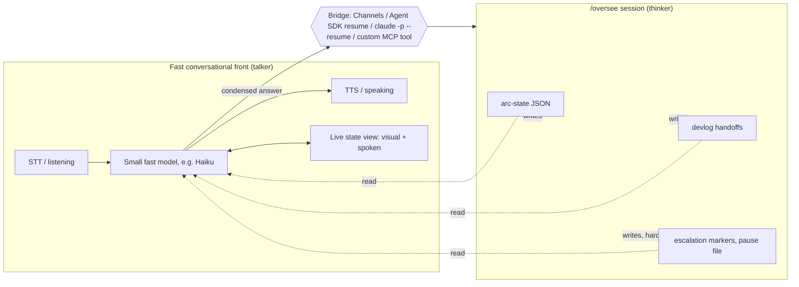

---
first_authored:
  by: "@claude-sonnet-5"
  at: 2026-09-26T15:30:00-07:00
task_list: cdocs/audio-interaction
type: report
state: live
status: review_ready
tags: [analysis, voice, audio, architecture]
last_reviewed:
  status: revision_requested
  by: "@claude-opus-5-5"
  at: 2026-09-26T14:13:27-07:00
  round: 1
---

# Voice-companion architecture: a fast front, a slow overseer, and the bridge between them

> BLUF: The clunkiness in Claude's voice modes is structural, not a missing polish pass: today's `/voice` and the VoiceMode MCP server both put a single slow reasoning agent in the role of live conversational partner, using silence-timeout turn-taking with no shared visual anchor for what's being discussed.
> Refined voice assistants (OpenAI Realtime, Gemini Live, LiveKit/Pipecat stacks) fix this with a **talker/thinker split**: a small fast model or speech-to-speech (S2S) model owns the live conversation and a separate slow agent does the actual work, connected by a state model both sides can read.
> Claude Code today has real, if research-preview and beta, plumbing for that bridge (Channels, the Agent SDK's session resume, `claude -p --resume`, custom MCP tools), but nothing wires them into a state-aware companion out of the box.
> Recommendation: build the thinnest version of the talker/thinker split first (a Haiku-class "talker" reading `/oversee`'s arc-state file and speaking through local TTS/STT, with VoiceMode or a small Pipecat pipeline as the ears/mouth) to test whether a state model alone fixes the felt clunkiness, before committing to a standalone app or a Weftwise integration.

## Context / Background

A prior report, [`2026-09-26-audio-interaction-approaches.md`](2026-09-26-audio-interaction-approaches.md), surveyed `/voice` dictation and a "secretary" pattern for compiling rambling speech into structured briefs.
It targeted input precision (transcript review, Plan Mode, `UserPromptSubmit` hooks) and never looked at the **VoiceMode MCP server** ([voicemode.dev](https://voicemode.dev), [github.com/mbailey/voicemode](https://github.com/mbailey/voicemode)), which is what the user meant by "Claude voice mode": a `converse` tool that gives Claude Code a spoken back-and-forth, distinct from `/voice`'s push-to-talk dictation.
The user found that report's framing clunky in a different sense (jargon-heavy, solving the wrong problem) and restated the actual goal:

> "a separate app with continuous audio io triages context and maintains user-interpretable view of active state (eventually this is a weftwise integration) with a bridge to the overseer session to make user-facing requests legible and condense/format user responses... none of the above sounds like it addresses the overall clunkiness and lack of refinement that I view as endemic to the current audio modes."

This report starts from that framing.
It diagnoses *why* voice interaction with Claude Code feels unrefined using standard conversational-AI vocabulary, surveys what a refined voice stack looks like today, and lays out concrete build options from thin to thick for the talker/thinker architecture the user is imagining, ending with a cheap first experiment.

## Diagnosing the clunkiness

Six concepts explain the specific texture of "clunky" the user is pointing at, each concrete and each present in `/voice` and VoiceMode today.

**Walkie-talkie turn-taking vs. full duplex.** A walkie-talkie conversation has a hard baton: one side transmits, the other listens, and speaking over each other is either impossible or destructive.
Human conversation is full duplex: both parties can vocalize simultaneously (backchannels like "mm-hmm," overlapping starts, interruption mid-sentence) without breaking down.
`/voice` and VoiceMode's `converse` tool are both walkie-talkie: the agent (or user) finishes a complete turn, then the other side starts.
VoiceMode's own GitHub issue tracker documents this as a straight record-until-silence loop with no interrupt path ([issue #532](https://github.com/mbailey/voicemode/issues/532), unverified beyond that thread but consistent with the tool's `converse`-as-single-blocking-call design).

**Silence-based endpointing vs. semantic turn detection.** "Endpointing" is deciding when a speaker is done talking, which is the load-bearing decision in walkie-talkie systems.
The naive approach, silence-based endpointing, just waits for N milliseconds of quiet and declares the turn over; it's what VoiceMode uses (WebRTC voice-activity detection, VAD, tuned by `vad_aggressiveness` and bounded by `listen_duration_min`/`listen_duration_max`) and it fails exactly when a person pauses mid-thought ("so I want to... let me think... okay so I want to").
Semantic turn detection instead looks at *what was said* (grammatical completeness, trailing filler words, prosodic cues) to decide whether the speaker is actually finished, independent of pause length.
OpenAI's Realtime API calls this `semantic_vad` mode and lets a model estimate turn-completion probability with a tunable `eagerness` knob ([Realtime VAD guide](https://developers.openai.com/api/docs/guides/realtime-vad)); Pipecat ships an open model for the same job, Smart Turn, which runs after VAD detects silence and judges completion from the actual audio rather than the pause alone ([pipecat-ai/smart-turn](https://github.com/pipecat-ai/smart-turn)); LiveKit's turn detector is a 135M-parameter transformer trained to predict end-of-utterance from a sliding window of transcript text ([LiveKit blog](https://livekit.com/blog/using-a-transformer-to-improve-end-of-turn-detection)).
None of this exists in `/voice` or VoiceMode.

**Barge-in and backchannels.** Barge-in is the ability for a listener to interrupt a talker mid-utterance and have the talker actually stop, not just get ignored; a backchannel is the small "yeah," "right," "uh-huh" a listener emits without taking the floor.
Both require full-duplex audio and a turn-taking model that can distinguish "this is a backchannel, keep talking" from "this is a real interruption, stop and yield."
Neither `/voice` nor VoiceMode has any of this: VoiceMode's agent, once it starts speaking via TTS, cannot be talked over, and the user cannot backchannel while the agent is mid-sentence without the system likely double-triggering.

**Latency budgets.** Conversational speech has an expected response gap of roughly 200-500ms before a pause starts reading as "the AI froze" or "did it hear me?"
Cascaded pipelines (speech-to-text (STT), then LLM, then text-to-speech (TTS), each a network round trip) tend to blow this budget; native speech-to-speech models compress it because one model ingests and emits audio directly rather than three services taking turns.
OpenAI and Google's Realtime/Live APIs report low-hundreds-of-ms time-to-first-audio in vendor materials, though **neither publishes a single authoritative spec, and cross-vendor benchmarks found were third-party, not primary sources**.
VoiceMode publishes no latency numbers at all, only "fast enough to feel like a real conversation" ([README](https://github.com/mbailey/voicemode/blob/master/README.md)); each `converse` call is a synchronous MCP tool invocation, so the calling Claude Code turn is frozen for the entire speak-then-listen round trip.

**The voice front and the working agent are the same slow reasoning loop.** This is the structural core of the complaint. `/voice` and VoiceMode both route audio through Claude itself: the same model that plans multi-step work, calls tools, and reasons carefully is also the one expected to hold up its end of a live conversation.
A deep-thinking agent is bad at conversation for the same reason a person deep in thought is a bad conversationalist: it wants to finish a chain of reasoning before responding, it doesn't naturally emit filler or acknowledgment while it works, and every response carries the latency of a full agentic turn (tool calls, file reads) rather than the latency of "let me just say something back."
Conversational refinement and deep reasoning are different jobs; forcing one model to do both means the conversational half inherits the reasoning half's latency and turn-taking style.

**No shared visual state to anchor what's being talked about.** Human conversations about complex work usually happen next to a shared artifact: a whiteboard, a shared doc, a screen.
Voice-only interaction with Claude Code has no such anchor: the user can't glance at "what's it currently doing," "what's it waiting on me for," or "what did it just say" without breaking out of voice entirely and reading a terminal.
This compounds the latency problem, since a person will re-ask or restate when they aren't sure the system registered something, and it compounds the reasoning-loop problem, since the only way to know what a slow agent is doing is to wait for it to finish and report back.

## What refined voice looks like today

The pieces that fix each problem above already exist, separately, as of late 2026.

**VoiceMode MCP, in depth.** VoiceMode is an MCP server exposing a single primary tool, `converse`, which speaks a message via TTS and then records the reply in one call ([mcpservers.org](https://mcpservers.org/servers/mbailey/voicemode)).
It is synchronous and blocking, not a persistent session object: the calling agent's turn is frozen until `converse` returns a transcript.
Recording ends on silence detection bounded by `listen_duration_min`/`listen_duration_max` (defaults: 2s minimum, 120s maximum, per the [converse parameters reference](https://glama.ai/mcp/servers/@mbailey/voicemode/blob/4d530f7bf44e30cb584c9e13c8666f6476f6c33a/docs/reference/converse-parameters.md); [issue #532](https://github.com/mbailey/voicemode/issues/532) reports the maximum hard-cuts a user mid-word).
Backends are OpenAI-API-compatible and swappable: cloud OpenAI Whisper/TTS by default, or local **whisper.cpp** for STT and **Kokoro** for TTS ([whisper setup](https://github.com/mbailey/voicemode/blob/master/docs/guides/whisper-setup.md), [Kokoro setup](https://github.com/mbailey/voicemode/blob/master/docs/guides/kokoro-setup.md)); no ElevenLabs support was found in official docs.
Install for Claude Code is a plugin marketplace add (`claude plugin marketplace add mbailey/voicemode`) or `pip`/`uvx` install ([README](https://github.com/mbailey/voicemode/blob/master/README.md)).
It positions itself as "voice conversations with Claude Code," but architecturally it's exactly the "same slow agent talks" problem: it hands the live-conversation job to whichever model is running the calling session.
A separate cloud product, VoiceMode Connect, reportedly routes voice between agents and mobile/web clients, but its architecture is **unverified** beyond one secondary source.

**Realtime speech-to-speech APIs.** OpenAI's Realtime API (`gpt-realtime`) is a single multimodal model doing audio-in/audio-out directly over WebSocket/WebRTC, with `semantic_vad` turn detection and server-initiated interruption (`conversation.interrupted` events, plus client-sent `response.cancel`) as described above ([server events reference](https://developers.openai.com/api/reference/resources/realtime/server-events)); community reports flag imperfect transcript trimming on interruption ([forum thread](https://community.openai.com/t/realtime-api-interruptions-dont-properly-trim-the-transcript/1000703)).
Google's Gemini Live API offers similar bidirectional streaming with sensitivity-tuned automatic activity detection rather than a distinct semantic mode, plus a manual mode where the client controls activity start/end explicitly ([Live API capabilities](https://ai.google.dev/gemini-api/docs/live-api/capabilities)); some GitHub reports describe missed interruption signals ([issue #2593](https://github.com/googleapis/python-genai/issues/2593)).
**Anthropic has no public developer speech-to-speech API**, confirmed against the Claude Platform docs' full capability table, which lists no audio/voice modality ([platform.claude.com/docs/en/build-with-claude/overview](https://platform.claude.com/docs/en/build-with-claude/overview)); the consumer Claude app's voice mode is a separate, closed, end-user feature with no accompanying developer API ([TechCrunch, 2026-07-23](https://techcrunch.com/2026/07/23/anthropic-updates-claude-voice-mode-with-more-capable-models/), which itself notes Anthropic hasn't detailed the underlying stack).
Amazon's Nova 2 Sonic is a lesser-known native S2S model with configurable pause sensitivity ([AWS docs](https://docs.aws.amazon.com/nova/latest/nova2-userguide/using-conversational-speech.html)).

**Voice-agent frameworks.** Pipecat ([pipecat.ai](https://docs.pipecat.ai/pipecat/learn/speech-input), [GitHub](https://github.com/pipecat-ai/pipecat)) is an open-source Python framework for real-time voice pipelines, backend-agnostic (cloud or fully local STT/LLM/TTS), self-hostable on plain Linux with no cloud dependency, and ships Smart Turn for semantic endpointing plus first-class barge-in handling.
LiveKit Agents ([GitHub](https://github.com/livekit/agents)) is comparably mature, built on LiveKit's WebRTC server, with a genuine transformer-based turn detector self-hostable at the "v1-mini" tier; its stronger "adaptive interruption" model is gated to LiveKit Cloud, so self-hosting means a weaker (but still non-VAD-only) turn detector ([GitHub issue #6033](https://github.com/livekit/agents/issues/6033)).
Vapi and Retell are hosted, telephony-first voice-agent platforms (IVR, call centers, per-minute billing, SOC2/HIPAA compliance); architecturally the wrong fit for a local desktop companion since they're built around phone calls, not a Linux workstation ([vapi.ai/enterprise](https://vapi.ai/enterprise), [retellai.com](https://www.retellai.com/)).

**Full-duplex models.** Kyutai Moshi ([GitHub](https://github.com/kyutai-labs/moshi)) is a genuine full-duplex speech-text model, listening and generating on continuous parallel streams with no discrete turn-taking step and 160ms theoretical / ~200ms practical latency on an L4 GPU ([kyutai.org/Moshi.pdf](https://kyutai.org/Moshi.pdf), [README](https://github.com/kyutai-labs/moshi)); it's open source and self-hostable but GPU-hungry (Kyutai's README asks for 24GB for the unquantized PyTorch build; int8 Rust/candle builds are lighter) and research-grade, with limited demonstrated tool-use/agentic capability.
Kyutai's own Unmute wrapper ([GitHub](https://github.com/kyutai-labs/unmute)) is explicitly turn-based, not full duplex, trading Moshi's naturalness for compatibility with ordinary text LLMs; tool calling is not implemented (the README asks for contributions) and it needs a 16GB+ CUDA GPU.
Sesame CSM ([GitHub](https://github.com/SesameAILabs/csm)) is likewise not full duplex despite Sesame's research narrative: the open 1B-parameter release is a text+audio-conditioned decoder that must be paired with an external LLM, and Sesame states it "cannot model the structure of the conversation itself" ([Sesame blog](https://www.sesame.com/blog/crossing-the-uncanny-valley-of-voice)).

### Comparison table

| Stack | Turn model | Barge-in | Self-hostable on Fedora | Fits "talker" role for a coding agent |
|---|---|---|---|---|
| `/voice` (Claude Code dictation) | Push-to-talk, Enter-gated | None | N/A (cloud, built in) | No: text-only, no live conversation |
| VoiceMode MCP `converse` | Silence-timeout, blocking call | None | Yes (whisper.cpp + Kokoro) | Weak: same agent does both jobs |
| OpenAI Realtime | Semantic VAD (tunable eagerness) | Yes, server + client cancel | No (cloud only) | Good, as an external talker |
| Gemini Live | Sensitivity-tuned VAD, manual mode option | Yes, reported inconsistent | No (cloud only) | Good, as an external talker |
| Pipecat + Smart Turn | Semantic, post-VAD model | Yes, first-class | Yes, fully local stack possible | Strong: designed for exactly this role |
| LiveKit Agents | Transformer text-based (self-host tier) | Yes, weaker without cloud tier | Yes, with reduced fidelity | Strong, comparable to Pipecat |
| Vapi / Retell | Proprietary, telephony-tuned | Yes | No (hosted only) | Poor fit: built for phone calls |
| Kyutai Moshi | True full duplex, no turn model needed | Native | Yes, GPU required | Interesting but research-grade |
| Unmute / Sesame CSM | Turn-based (Unmute) / not applicable (CSM alone) | Unmute: yes; CSM: N/A | Yes | Immature for this use case |

## The architecture the user is imagining

The pattern the user describes is a **talker/thinker split**: a fast conversational front owns the human, a slow overseer owns the work, and a state model plus a bridge connect them.

**What state the companion reads.** `/oversee` already maintains exactly the durable signals a talker needs, described plainly:

- **Arc-state JSON** (`.claude/oversee/<arc-id>.json`): one file per arc, machine-readable, updated at every transition (a proposal starting, finishing, or hitting trouble), tracking which proposals are done, which is active, and whose turn it is ([`oversee-arc.md`](../../plugins/cdocs/rules/oversee-arc.md)).
  In plain terms: it's the to-do list and status board for the whole multi-agent run, always current.
- **Devlog handoffs**: a human-readable narrative written before every context reset, with exactly three parts: what got done, what was decided and why, and what's left ([`orchestration-discipline.md`](../../plugins/cdocs/rules/orchestration-discipline.md) Pillar 2).
  This is the "catch me up in 30 seconds" document; a talker reading it aloud is functionally reading the overseer's own status report to the user.
- **Escalation markers**: a directory of JSON files (`.claude/oversee/escalations/*.json`) written only for hard stops (a `reject` verdict, an unresolvable footprint conflict between proposals, or, for `/oversee full <topic>`, deciding which proposals make up the arc) and a `pause` file the human drops to tell the overseer to stop at its next checkpoint.
  Softer questions (a permission prompt, a judgment call) never reach this directory; they only surface as an in-session question or a Claude Code `Notification` hook.
  A talker that only watches the escalations directory sees hard stops, not the full range of "the overseer wants your input."

Together, these three answer "what's running, what's waiting on me, what was decided" without the talker needing to parse raw agent transcripts.

**How answers get back in.** Four mechanisms exist, each verified against current docs, with different maturity:

- **Claude Code Channels** (research preview): a Channel is an MCP server that *pushes* events into an already-running session and can receive replies back through the same bridge, documented in a "build your own channel" guide covering capability declaration and reply tools ([channels reference](https://code.claude.com/docs/en/channels-reference)).
  Explicitly unstable: "the `--channels` flag syntax and protocol contract may change," and it requires the session to stay open the whole time ([channels docs](https://code.claude.com/docs/en/channels)).
- **Claude Agent SDK session resume**: `resume` with a captured session ID picks a persisted session back up with full history, and `fork_session` branches it without touching the original ([Agent SDK sessions docs](https://code.claude.com/docs/en/agent-sdk/sessions)).
  This is asynchronous turn-taking against a persisted transcript, not a live attach to an in-flight loop; the CLI sessions docs state that resuming the same session in two places without forking makes "messages from both interleave into one transcript" ([sessions docs](https://code.claude.com/docs/en/sessions)), so only a fork is safe against a live overseer.
- **`claude -p --resume <session-id>`**: documented and designed for exactly this kind of scripting, including piping structured JSON output ([sessions docs](https://code.claude.com/docs/en/sessions)).
  Stable and simple, but each invocation is a fresh process, not a standing connection.
- **Custom MCP tools as an inbound bridge**: a tool the overseer calls (e.g., "ask the human") can be backed by the companion process; MCP's elicitation pattern blocks the calling session on a human response, which is documented but not a maturity-labeled first-class Anthropic pattern ([MCP docs](https://code.claude.com/docs/en/mcp)).
  A third-party implementation of this exact idea exists for Slack ([lexbrugman/claude-slack-bridge](https://github.com/lexbrugman/claude-slack-bridge)), unverified for reliability.

**Where the talker's brain runs.** Three options, in increasing sophistication: a small fast text model (Haiku-class) reading state and driving a separate STT/TTS pair; a realtime S2S model (OpenAI Realtime, Gemini Live) that does the conversation natively and calls a function/tool to fetch state or relay a condensed answer; or a pipeline (Pipecat/LiveKit) combining local STT, a small local or fast-cloud LLM, and local TTS, with the LLM's job narrowed to "talk about this state, don't reason deeply." All three are strictly separate processes from the overseer; none of them should be the model doing the actual `/oversee` work.

## Thin to thick: four build options

Ordered thinnest to thickest. Each entry states what it fixes, what stays clunky, and rough effort.

**(a) VoiceMode MCP inside the overseer session, plus a condense/format skill.**
What exists: VoiceMode itself, installable today.
What's built: a skill that formats overseer state into a short spoken-friendly summary before calling `converse`.
Effort: hours, no new infrastructure.
Fixes: nothing structural. The overseer and the talker are still the same model and the same blocking call; every `converse` invocation freezes the whole agentic loop, and there's still no visual state, no barge-in, no semantic turn detection.
This option answers "can I talk to Claude Code at all" and nothing more; it does not address the user's stated complaint.

**(b) A separate Claude Code session running VoiceMode as the "secretary," bridged to the overseer via Channels or files.**
What exists: VoiceMode, `/oversee`'s file bus (arc-state, devlog, escalations), Channels (research preview) or plain file-watching.
What's built: a second top-level session dedicated to holding the `converse` loop, watching the overseer's files, and using Channels (or `claude -p --resume` polling) to relay condensed answers back.
Effort: days. No new model infrastructure, but real integration work on the watch-and-relay loop, and Channels' instability is inherited directly.
Fixes: separates the conversational session from the working session, so the overseer isn't frozen mid-`converse`, and the secretary can watch multiple signal sources instead of only escalations.
Still clunky: the secretary session is still a full Claude model doing the talking, still walkie-talkie turn-taking (VoiceMode's own limitation), still no visual state.
This is the natural "next step up" from (a) but does not touch the structural latency/turn-taking problems, only the coupling problem.

**(c) A standalone voice-agent app (Pipecat or LiveKit + a small fast model + an Agent SDK bridge) with a small state UI.**
What exists: Pipecat/LiveKit as frameworks, Smart Turn/LiveKit's turn detector, local STT (Whisper) and TTS (Kokoro/Piper) components, the Agent SDK for reading and injecting into the overseer session.
What's built: the whole app: a pipeline wiring these together, a small model (Haiku-class or a local LLM) whose only job is holding the conversation and reading/summarizing overseer state, a minimal visual surface (even a simple always-on-top status window) showing current state, and a bridge process using the Agent SDK's `resume`/`fork_session` or `claude -p --resume` to read and write the overseer session.
Effort: weeks. This is genuinely new software, not configuration.
Fixes: the structural problems directly. Semantic turn detection and barge-in are native to the framework choice; the talker is a separate, fast, narrowly-scoped model instead of the overseer itself; a real state view exists.
Still clunky, honestly: the bridge into the overseer is still the least mature part of the whole stack (Channels research-preview, or a polling loop against `resume`), so the "seams" move from the conversation itself to the handoff at the boundary. This is the first option that can plausibly deliver what the user means by "refined."

**(d) Weftwise integration.**
Speculative, and flagged as such throughout: rather than a standalone status window, the companion writes and reads a live state document inside Weftwise, the user's own communal-document app (`/var/home/mjr/code/weft/weftwise/main`) built on Loro CRDTs and CodeMirror (it has migrated off Y.js/Liveblocks) with line-level authorship tracking.
The natural fit is Weftwise's authorship model itself: a document where the overseer's writes are attributed to the agent and the human's edits (typed or transcribed from the companion's condensed rendering of speech) are attributed to the user, giving a durable, co-edited, visually anchored record of "what's active, what's pending, what was decided" that both sides can scroll back through, not just hear once.
This reframes the "shared visual state" gap directly, since Weftwise's whole reason for existing is shared, authorship-tracked documents.
Effort: largest of the four, and contingent on option (c)'s bridge machinery already existing (Weftwise would consume the same overseer-state feed a standalone app would).
This is the most speculative option in this report: no prototyping has been done, and it should be read as a plausible eventual home for option (c)'s state view, not a separately justified build.

## Recommendation

Test the core hypothesis, that **a fast front with a legible state model is what makes voice feel refined, not better transcription**, as cheaply as possible before committing to (c) or (d).

**First step:** build a minimal slice of option (c), skipping the full app.
Use VoiceMode's own local backends (whisper.cpp STT, Kokoro TTS) or a small Pipecat pipeline with Smart Turn, but replace the "brain" with a Haiku-class model given a single job: read `/oversee`'s arc-state JSON and latest devlog handoff, and answer questions about current state conversationally.
No overseer-write bridge yet; this version is read-only and speaks state, it doesn't relay answers back in.
Effort: a few days, reusing VoiceMode's local-model setup instructions directly rather than standing up Pipecat from scratch.

**What would falsify the hypothesis:** if this read-only, state-aware, fast-talker slice still feels clunky to the user (because the conversation itself is still stilted, or because reading state aloud doesn't actually reduce the "what's it doing" anxiety), that's evidence the fix isn't the talker/thinker split at all, and the deeper problem is either latency (needing genuine full-duplex, i.e. Moshi-class models, still research-grade per this report) or something about the state model's content/framing rather than its existence.
If it does feel meaningfully better, extend it incrementally: add the write-back bridge (Channels or `claude -p --resume` polling) next, then the visual surface, deferring the Weftwise question until the standalone version is proven.

## Unverified claims (flagged inline, restated here)

- No hard latency numbers exist for VoiceMode; all vendor/community latency figures for OpenAI Realtime and Gemini Live are approximate or third-party, not authoritative single specs.
- VoiceMode's exact GitHub star count is inconsistent across mirrors (roughly 149-1400 depending on source); not load-bearing to any conclusion here.
- VoiceMode Connect (voicemode.dev's cloud product) is mentioned only in a secondary source (Glama) and its architecture is otherwise unverified.
