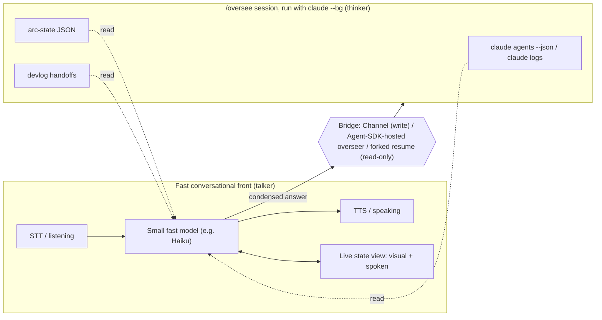

---
first_authored:
  by: "@claude-sonnet-5"
  at: 2026-09-26T12:30:00-07:00
task_list: cdocs/audio-interaction
type: report
state: live
status: review_ready
tags: [analysis, voice, audio, architecture]
last_reviewed:
  status: accepted
  by: "@claude-opus-5-5"
  at: 2026-09-26T14:20:03-07:00
  round: 2
---

# Voice-companion architecture: a fast front, a slow overseer, and the bridge between them

> BLUF: The clunkiness has two separable causes: **audio-stack causes** (walkie-talkie turn-taking, silence-based endpointing, no barge-in, no echo cancellation), fixed by which audio pipeline you pick, and one **architecture cause**, the same slow reasoning agent doing both the talking and the thinking with no shared state view, fixed only by a talker/thinker split.
> Refined audio stacks exist today (Pipecat/LiveKit with semantic turn detection); Claude Code has real, if research-preview or newly-surfaced, plumbing for the architecture half (`claude agents --json`, Channels' permission relay, the Agent SDK hosting the overseer outright).
> Recommendation: run a pre-registered, four-condition experiment (a state-reading fast talker on Pipecat + Smart Turn, the same pipeline with Smart Turn off, the same talker fed only `claude agents --json`, and plain VoiceMode as baseline) across a couple of real `/oversee` arcs to test whether a separate, state-reading fast talker beats same-agent voice, and whether semantic turn detection adds to it, before committing to a standalone app or a Weftwise integration.

> NOTE(claude-opus-5-5/audio-interaction): The bridge analysis here (answer-path table, options (a)/(b)) is superseded by [`2026-09-27-claude-code-inter-session-messaging.md`](2026-09-27-claude-code-inter-session-messaging.md), which covers native cross-session messaging, the inbox socket, and subscription constraints; see its revisions list.

## Context / Background

A prior report, [`2026-09-26-audio-interaction-approaches.md`](2026-09-26-audio-interaction-approaches.md), surveyed `/voice` dictation and a "secretary" pattern for compiling rambling speech into structured briefs.
It targeted input precision (transcript review, Plan Mode, `UserPromptSubmit` hooks) and never looked at the **VoiceMode MCP server** ([voicemode.dev](https://voicemode.dev), [github.com/mbailey/voicemode](https://github.com/mbailey/voicemode)), which is what the user meant by "Claude voice mode": a `converse` tool that gives Claude Code a spoken back-and-forth, distinct from `/voice`'s push-to-talk dictation.
The user found that report's framing clunky in a different sense (jargon-heavy, solving the wrong problem) and restated the actual goal:

> "a separate app with continuous audio io triages context and maintains user-interpretable view of active state (eventually this is a weftwise integration) with a bridge to the overseer session to make user-facing requests legible and condense/format user responses... none of the above sounds like it addresses the overall clunkiness and lack of refinement that I view as endemic to the current audio modes."

This report starts from that framing.
It diagnoses *why* voice interaction with Claude Code feels unrefined, surveys what a refined stack looks like today, and lays out concrete build options from thin to thick for the talker/thinker architecture the user is imagining, ending with a discriminating first experiment.

## Diagnosing the clunkiness

Two different kinds of cause produce the same felt "clunkiness," and they need different fixes.

### Audio-stack causes (fixed by pipeline choice)

**Walkie-talkie turn-taking vs. full duplex.** A walkie-talkie conversation has a hard baton: one side transmits, the other listens, and speaking over each other is either impossible or destructive.
Human conversation is full duplex: both parties can vocalize simultaneously (backchannels like "mm-hmm," overlapping starts, interruption mid-sentence) without breaking down.
`/voice` and VoiceMode's `converse` tool are both walkie-talkie: the agent (or user) finishes a complete turn, then the other side starts, with no interrupt path.

**Silence-based endpointing vs. semantic turn detection.** "Endpointing" is deciding when a speaker is done talking.
The naive approach just waits for N milliseconds of quiet; VoiceMode uses this (WebRTC voice-activity detection tuned by `vad_aggressiveness`), and it fails exactly when a person pauses mid-thought ("so I want to... let me think... okay so I want to").
Semantic turn detection instead looks at *what was said* (grammatical completeness, trailing filler words, prosody) to decide whether the speaker is actually finished, independent of pause length: OpenAI's Realtime API calls this `semantic_vad`, with a tunable `eagerness` ([guide](https://developers.openai.com/api/docs/guides/realtime-vad)); Pipecat's Smart Turn is an ~8M-parameter audio classifier that runs after Silero VAD detects silence and judges completion from the actual audio ([pipecat-ai/smart-turn](https://github.com/pipecat-ai/smart-turn)); LiveKit's turn detector is a 135M-parameter transformer predicting end-of-utterance from the last four turns of *text*, so it inherits STT latency on top of its own inference time ([blog](https://livekit.com/blog/using-a-transformer-to-improve-end-of-turn-detection)).

**Barge-in and backchannels.** Barge-in is a listener interrupting a talker mid-utterance and the talker actually stopping; a backchannel is a small "yeah," "uh-huh" that doesn't take the floor.
Both require full-duplex audio and a model that can distinguish "backchannel, keep talking" from "real interruption, yield."
Neither `/voice` nor VoiceMode has this once the agent starts speaking via TTS.

**Latency budgets.** Conversational speech expects a response gap of roughly 200-500ms before a pause reads as "did it hear me?"
Cascaded pipelines (STT, then LLM, then TTS, each a round trip) tend to blow this; native speech-to-speech models compress it by having one model ingest and emit audio directly.
VoiceMode publishes no latency numbers ([README](https://github.com/mbailey/voicemode/blob/master/README.md)); each `converse` call is a synchronous, blocking MCP tool invocation, freezing the calling turn until it returns (Claude Code auto-backgrounds any MCP call past 2 minutes, `CLAUDE_CODE_MCP_AUTO_BACKGROUND_MS`, which caps but doesn't remove this).

**Echo cancellation.** Barge-in over laptop or desk speakers, rather than a headset, needs acoustic echo cancellation (AEC): without it the system hears its own TTS output through the microphone and either interrupts itself or garbles the transcript.
On Fedora this means PipeWire's `echo-cancel` module, or simply a headset; it is not automatic, and it is a large, mundane source of real-world clunkiness that a state model does nothing about.

### Architecture causes (fixed by a talker/thinker split)

**The voice front and the working agent are the same slow reasoning loop.** `/voice` and VoiceMode both route audio through Claude itself: the same model that plans multi-step work and calls tools is also expected to hold up its end of a live conversation.
A deep-thinking agent is structurally bad at conversation for the same reason a person deep in thought is: it wants to finish reasoning before responding, doesn't naturally emit filler or acknowledgment while it works, and every response carries a full agentic turn's latency.
Conversational refinement and deep reasoning are different jobs; forcing one model to do both means the conversational half inherits the reasoning half's latency and turn-taking style. No audio-stack fix touches this.

**No shared visual state to anchor what's being talked about.** Human conversations about complex work usually happen next to a shared artifact: a whiteboard, a shared doc, a screen.
Voice-only interaction has no such anchor: the user can't glance at "what's it doing," "what's it waiting on me for," or "what did it just say" without breaking out of voice entirely.
This compounds both the latency problem (people re-ask when unsure something registered) and the reasoning-loop problem (the only way to know what a slow agent is doing is to wait for it to report back).

The recommendation below depends on keeping these two kinds of cause apart: an experiment that only changes the audio stack cannot tell you whether the architecture cause matters, and vice versa.

## What refined voice looks like today

**VoiceMode MCP.** A single, blocking `converse` tool: it speaks via TTS then listens, freezing the calling turn until it returns (`wait_for_response=false` skips the listening half for announcement-only use).
Recording is bounded by `listen_duration_min`/`listen_duration_max` (2s/120s defaults; [issue #532](https://github.com/mbailey/voicemode/issues/532) documents a mid-word hard cut at the maximum).
Backends are OpenAI-API-compatible and swappable: cloud Whisper/TTS by default, or local **whisper.cpp** (STT) and **Kokoro** (TTS) ([whisper setup](https://github.com/mbailey/voicemode/blob/master/docs/guides/whisper-setup.md), [Kokoro setup](https://github.com/mbailey/voicemode/blob/master/docs/guides/kokoro-setup.md)); no ElevenLabs support was found.
Install via `claude plugin marketplace add mbailey/voicemode` or `pip`/`uvx` ([README](https://github.com/mbailey/voicemode/blob/master/README.md)).

**Realtime speech-to-speech (S2S) APIs.** OpenAI Realtime (`gpt-realtime`) is a single audio-native model over WebSocket/WebRTC with `semantic_vad` and both server- and client-initiated interruption ([server events](https://developers.openai.com/api/reference/resources/realtime/server-events)); community reports flag imperfect transcript trimming on interruption ([forum thread](https://community.openai.com/t/realtime-api-interruptions-dont-properly-trim-the-transcript/1000703)).
Gemini Live offers similar bidirectional streaming with sensitivity-tuned voice-activity detection (VAD) rather than a distinct semantic mode; some reports describe missed interruption signals ([issue #2593](https://github.com/googleapis/python-genai/issues/2593)).
**Anthropic has no public developer S2S API**, confirmed against the Claude Platform docs' full capability table, which lists no audio modality ([platform.claude.com/docs/en/build-with-claude/overview](https://platform.claude.com/docs/en/build-with-claude/overview)); the consumer app's voice mode is separate, closed, and undisclosed-stack ([TechCrunch, 2026-07-23](https://techcrunch.com/2026/07/23/anthropic-updates-claude-voice-mode-with-more-capable-models/)).
Amazon's Nova 2 Sonic is a lesser-known native S2S model with configurable pause sensitivity ([AWS docs](https://docs.aws.amazon.com/nova/latest/nova2-userguide/using-conversational-speech.html)).

**Frameworks and full-duplex models.** Pipecat ([GitHub](https://github.com/pipecat-ai/pipecat)) is a self-hostable, backend-agnostic Python framework with Smart Turn and first-class barge-in.
LiveKit Agents ([GitHub](https://github.com/livekit/agents)) is comparably mature, self-hostable at a weaker "v1-mini" turn-detector tier since its stronger "adaptive interruption" model is cloud-gated ([issue #6033](https://github.com/livekit/agents/issues/6033)).
Vapi and Retell are hosted, telephony-billed platforms built for call centers, an architecturally poor fit for a local desktop companion ([vapi.ai/enterprise](https://vapi.ai/enterprise), [retellai.com](https://www.retellai.com/)).
Kyutai Moshi ([GitHub](https://github.com/kyutai-labs/moshi)) is genuinely full duplex, 160ms theoretical / ~200ms practical latency on an L4 GPU, but wants 24GB VRAM unquantized (lighter int8 builds exist) and remains research-grade for agentic use.
Its own Unmute wrapper is turn-based, has no tool-calling support (the README asks for contributions), and needs a 16GB+ CUDA GPU.
Sesame CSM's open release is a decoder-only text-plus-audio-conditioned model, not the full-duplex system its research narrative describes ([Sesame blog](https://www.sesame.com/blog/crossing-the-uncanny-valley-of-voice)).

| Stack | Turn model | Barge-in | Self-hostable on Fedora | Fits "talker" role |
|---|---|---|---|---|
| `/voice` (Claude Code dictation) | Push-to-talk, Enter-gated | None | N/A (cloud, built in) | No: text-only |
| VoiceMode MCP `converse` | Silence-timeout, blocking | None | Yes | Weak: same agent does both jobs |
| OpenAI Realtime | Semantic VAD | Yes | No (cloud only) | Good, as an external talker |
| Gemini Live | Sensitivity-tuned VAD | Yes, reported inconsistent | No (cloud only) | Good, as an external talker |
| Pipecat + Smart Turn | Semantic, post-VAD | Yes, first-class | Yes | Strong: built for this role |
| LiveKit Agents | Transformer, text-based | Yes, weaker without cloud tier | Yes, reduced fidelity | Strong |
| Vapi / Retell | Proprietary, telephony-tuned | Yes | No | Poor fit |
| Kyutai Moshi | True full duplex | Native | Yes, GPU required | Interesting, research-grade |
| Unmute / Sesame CSM | Turn-based / not applicable | Unverified / N/A | Yes | Immature for this use case |

## The architecture the user is imagining

The pattern the user describes is a **talker/thinker split**, following the shape of DeepMind's "Talker-Reasoner" framing ("Agents Thinking Fast and Slow," 2024), distinct from Qwen2.5-Omni's internal "Thinker-Talker" module, which names the same two words for pieces inside one model, not two separate processes.
A fast conversational front owns the human, the slow overseer owns the work, and a state model plus a bridge connect them.

**What state the companion reads.** The thinnest read feed is Claude Code's own supported one, not `/oversee`-specific: **`claude agents --json`** (plus `claude logs <id>`) is "the supported way to read session state from outside Claude Code, for example from a status bar" ([agent view docs](https://code.claude.com/docs/en/agent-view#read-session-state-from-a-script)).
It reports `state` (`working`/`blocked`/`done`), `status`, and `waitingFor` (`permission prompt`, `input needed` for a question from Claude or an MCP server, `sandbox request`, `dialog open`).
This needs no arc-state file and no custom instrumentation. Interactive sessions are listed too, with `status` and `waitingFor` while their process is alive, but `state`, the short `id` that `claude logs` takes, and peek-reply apply only to background sessions, so run `/oversee` with `claude --bg` for the full feed; the agent-view peek panel already accepts dictated replies, so a companion built purely on this feed can piggyback on an existing reply path.

`/oversee` additionally maintains two richer signals worth reading when available:

- **Arc-state JSON** (`.claude/oversee/<arc-id>.json`): the to-do list and status board for a multi-proposal run, updated at every transition ([`oversee-arc.md`](../../plugins/cdocs/rules/oversee-arc.md)).
- **Devlog handoffs**: a "catch me up in 30 seconds" narrative written before every context reset, with what got done, what was decided, and what's left ([`orchestration-discipline.md`](../../plugins/cdocs/rules/orchestration-discipline.md) Pillar 2).

Escalation markers (`.claude/oversee/escalations/*.json`) cover only hard stops: a `reject` verdict, an unresolvable overlap between two proposals' file footprints, or, for `/oversee full <topic>`, deciding which proposals make up the arc.
Softer questions, a permission prompt or a judgment call, are not invisible: they surface through `claude agents --json`'s `waitingFor` field or the `Notification` hook, which is a more complete picture than reading the escalations directory alone.
One caveat: only questions asked through a prompt (`AskUserQuestion`, a permission dialog) read as `blocked`; a question the overseer asks in plain prose at the end of its turn (for example a `hold` escalation or a soft "continue?" gate) reads as `done`, so the talker should treat `done` as "possibly waiting on you" and read the last output via `claude logs`.

**How answers get back in.** Not every mechanism that reads a session can safely write into a *live* one; conflating "resume" with "attach" is the mistake to avoid.

| Mechanism | Direction | Safe against a live `/oversee`? | Maturity |
|---|---|---|---|
| `claude agents --json` / `claude logs` | Read only | Yes | Stable, documented |
| Agent SDK `resume` (no fork) | Read/write | No: interleaves into one transcript with the live process ([sessions docs](https://code.claude.com/docs/en/sessions)) | Stable API, unsafe usage |
| Agent SDK `resume` with `fork_session` (a branch of history the SDK can start without touching the original) | Read only, if the fork's tools are restricted to read-only (a fork's file edits are real) | Yes, but each query replays the overseer's full context, so it is costly to poll | Stable |
| `claude -p --resume <id>` | Read/write | No, same interleaving risk | Stable, wrong tool here |
| Claude Code Channels | Read/write (push) | Yes: the only documented push into an unattended live session; must be enabled when the overseer is launched | Research preview |
| Agent-view peek reply (human-driven) | Write, by the human | Yes: replies go to the live background session | Stable, documented |
| Agent SDK hosting the overseer | Read/write (native) | Yes: the companion process IS the harness | Stable API, new integration work |
| Custom MCP "ask the human" tool | Write (blocking) | Yes, but blocks until answered | Stable MCP, ad hoc pattern |

- **Channels** is the one push mechanism into a session already running unattended, with three constraints: a custom channel loads only via `--dangerously-load-development-channels` during the preview (plain `--channels` accepts only allowlisted built-in plugins); events queue while the overseer is mid-turn and deliver on its next turn, so reply latency is bounded by however long that turn runs; and a channel can declare a **permission-relay** capability forwarding permission prompts to itself, the concrete mechanism for "make user-facing requests legible" ([channels reference](https://code.claude.com/docs/en/channels-reference)).
- **The Agent SDK hosting the overseer**, rather than a sidecar attaching to someone else's session, fits the vision most directly: the companion process runs `/oversee` itself through the SDK with streaming input, receiving every permission request and question through the SDK's own in-loop input callbacks, no polling needed. The cost: the user stops launching `/oversee` from an ordinary terminal.
- **A custom MCP tool** the overseer calls (e.g. `ask_human`) is a plain blocking tool call the companion backs. This is not MCP elicitation, which is answered inside the Claude Code terminal itself and does not route to a companion. Such a call is subject to Claude Code's 2-minute MCP auto-backgrounding threshold.

**Triage policy: when the talker speaks unprompted.** "Triages context" implies deciding when to interrupt the human, not just answering when asked. Three open questions, deliberately left unresolved here: what interrupts the user (likely only hard-gate escalations and permission prompts with a short timeout, not routine progress); how several blocked items get batched (a single spoken digest beats stacking interruptions); and what stays silent by default (in-progress work, soft calls the overseer resolves on its own). A deliberate budget for unprompted speech is a large part of what separates "refined" from "chatty," and is worth its own design pass once the read/write plumbing above is proven.

**Where the talker's brain runs.** A small, fast model chosen for low per-turn latency over reasoning depth ("Haiku-class," e.g. Claude Haiku) reading state and driving STT/TTS; a realtime S2S model calling a function/tool to fetch state; or a Pipecat/LiveKit pipeline with the LLM's job narrowed to "talk about this state, don't reason deeply." All three are separate processes from the overseer; none should be the model doing the actual `/oversee` work.

## Thin to thick: what to build, and what each fixes

For reference, the zero-effort baseline is plain VoiceMode's `converse` running inside the overseer session itself: it fixes none of the audio-stack or architecture causes above (same blocking call, same walkie-talkie turn-taking, same single reasoning agent, no state view). It is the control condition in the experiment below, not a build option.

**(a) Thin translation sidecar.** A small process that polls `claude agents --json`, the latest devlog handoff, and arc-state, and speaks through a Pipecat (or LiveKit) pipeline. Reads via `claude agents --json`/`claude logs` and forked resumes; writes by having the human answer in the agent-view peek panel, or a custom Channel if unattended replies matter. Effort: days, wiring existing pieces (VoiceMode's local STT/TTS servers, Pipecat's Smart Turn, the SDK's read APIs) rather than building new ones.

**(b) MCP tool / Channel as the product surface.** The companion is *exposed to* the overseer rather than launched alongside it: a Channel with reply and permission-relay tools, or a plain MCP `ask_human` tool. This most directly answers "bridge to the overseer session to make requests legible," since Channels' permission relay is built for exactly that. Effort: days to a couple weeks, gated on Channels' research-preview stability.

**(c) Standalone voice-agent app.** A full Pipecat/LiveKit pipeline, a narrowly-scoped small model, its own visual surface, and either (a)'s sidecar bridging or the Agent-SDK-hosted-overseer pattern above. Effort: weeks, genuinely new software. On Fedora/GNOME Wayland, an "always-on-top status window" is not generally available to ordinary clients (KDE supports it via window rules; GNOME needs a shell extension), so the visual surface should be a panel indicator, desktop notifications, a browser tab, or (d) below, not an assumed floating window.

**(d) Weftwise integration.** The companion reads and writes a live state document inside Weftwise, using its line-level authorship tracking to distinguish the overseer's writes from the human's condensed spoken replies. This is less speculative than it first appears: `weftwise/main/cdocs/proposals/2026-08-24-cm-native-claude-code-interface.md` (status `wip`) already proposes running a headless Agent SDK session behind a host-agnostic transport inside a CodeMirror surface, which is the SDK-hosted-overseer bridge above, in Weftwise. If that proposal lands, (d) converges with (c) instead of needing a separate standalone window.

Turn-taking, barge-in, and latency come from the **audio pipeline** (Pipecat/LiveKit plus VoiceMode's local STT/TTS servers), not from which of these four shapes is chosen; any option gets them once it uses that pipeline. What differs between the options is coupling and legibility:

| Option | Turn-taking / barge-in / latency | Overseer stays unfrozen | State legibility | Request legibility (bridge) | Effort |
|---|---|---|---|---|---|
| (a) Thin sidecar | Fixed by pipeline choice | Yes | Yes (read-only) | Weak: human replies manually | Days |
| (b) MCP/Channel surface | Fixed by pipeline choice | Yes | Yes | Strong: permission relay built for this | Days-weeks, preview-gated |
| (c) Standalone app | Fixed by pipeline choice | Yes | Yes, with a real UI | Depends which bridge it uses | Weeks |
| (d) Weftwise | Fixed by pipeline choice | Yes | Strongest: durable, co-edited, attributed | Depends which bridge it uses | Weeks, contingent on (c)/SDK work |

## Recommendation

Test whether a separate, state-reading fast talker drives felt refinement over same-agent voice, and whether semantic turn detection adds to it, with a design that can attribute each result.

**Build:** option (a), thin sidecar. Pipecat + Smart Turn as the pipeline, pointed at VoiceMode's already-installed local whisper.cpp and Kokoro servers (both OpenAI-compatible, no new STT/TTS setup). A Haiku-class model with a single job: read `claude agents --json`, the latest devlog handoff, and arc-state, and answer questions about them conversationally. Use a headset, since barge-in over open speakers needs echo cancellation this slice does not attempt.

**Comparison conditions**, run across the same two or three real `/oversee` arcs:

1. Pipecat + Smart Turn (full treatment).
2. The same pipeline with Smart Turn disabled, silence-only endpointing (isolates whether semantic turn detection specifically matters, versus just having a separate fast talker at all).
3. Plain VoiceMode `converse` inside the overseer, the zero-effort baseline above (isolates whether the talker/thinker split matters at all).
4. Condition 1 with the talker fed only `claude agents --json` (no devlog handoff or arc-state), isolating the richer state feed's contribution.

Rotate condition order across arcs; this is a small, single-rater sample, so treat results as directional.

**Pre-registered metrics**, fixed before running: count of terminal-escapes to check state, count of re-asks/restatements, time-to-first-audio per turn, and a 1-5 felt-refinement rating per session, collected the same way each time, with a written threshold for "meaningfully better."

**What would falsify the hypothesis:** if condition 1 doesn't clearly beat condition 3 on rating and break-out/re-ask counts, the package (separate fast talker, state feed, refined pipeline) isn't what drives refinement, and the real problem is elsewhere (full-duplex audio, or the state content itself). If condition 1 doesn't beat condition 4, the richer state feed isn't earning its integration cost over `claude agents --json` alone.
If condition 1 doesn't beat condition 2, semantic turn detection specifically isn't pulling weight relative to a bare separate fast talker, arguing for spending less on the audio-stack half and more on the bridge/legibility half.

**If it holds:** wire in a concrete write-back next, a custom Channel with permission relay, not an open menu of options. Defer the Weftwise question and the always-on-top surface question until this slice is proven.

## Decision points

Left open, not resolved here:

1. **Bridge direction.** (A) A sidecar that attaches to an overseer you launch yourself, via Channels plus `claude agents --json`. (B) The companion *hosts* the overseer through the Agent SDK, cleaner but changes how `/oversee` gets launched. (C) Keep both live and let the experiment above decide.
2. **Headset vs. speakers.** (A) A headset for the first experiment, sidestepping echo cancellation. (B) Speakers required, which means setting up PipeWire acoustic echo cancellation as a prerequisite.
3. **Weftwise timing.** (A) Defer any Weftwise work until the standalone sidecar slice is proven. (B) Build the state view as a Weftwise pane from day one, alongside `cm-native-claude-code-interface`. (C) Revisit once that proposal lands.

## Unverified claims

- No hard latency numbers exist for VoiceMode; all vendor/community latency figures for OpenAI Realtime and Gemini Live are approximate or third-party, not authoritative single specs.
- Whether a `claude --bg` session can also be launched with a custom Channel enabled; the recommended write-back assumes both at once.
- VoiceMode Connect (voicemode.dev's cloud product) is mentioned only in a secondary source (Glama) and its architecture is otherwise unverified.
