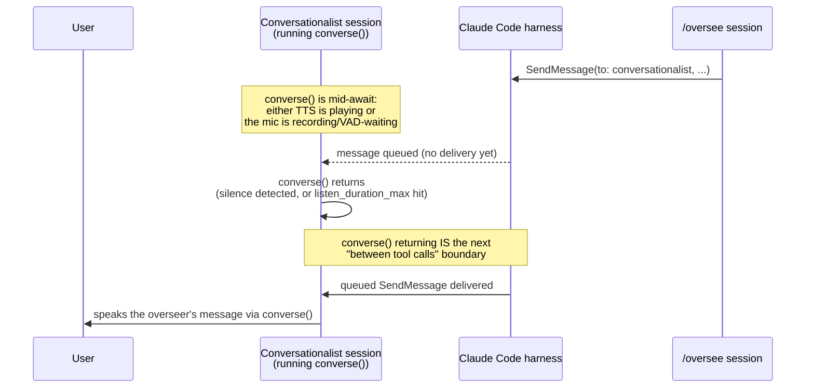

---
first_authored:
  by: "@claude-sonnet-5"
  at: 2026-09-27T14:10:00-07:00
task_list: cdocs/audio-interaction
type: report
state: live
status: review_ready
tags: [analysis, voice, voicemode, messaging]
last_reviewed:
  status: revision_requested
  by: "@claude-opus-5-5"
  at: 2026-09-27T09:48:25-07:00
  round: 1
---

# VoiceMode deep dive: what it actually does, and whether it can be the voice<>overseer bridge

> BLUF: VoiceMode ([mbailey/voicemode](https://github.com/mbailey/voicemode)) is a mature, actively maintained MCP server built almost entirely for the job the user wants: a natural voice loop against a Claude Code session, with local STT/TTS, automatic cloud failover, and a real (if narrow) multi-agent turn-taking layer called the "conch." It solves none of the cross-session bridging problem by itself: its `converse` tool is a single blocking MCP tool call, and nothing in VoiceMode talks to Claude Code's native cross-session messaging (`SendMessage`/`ListAgents`, covered in the prior report). The two systems are complementary, not overlapping, which is good news: the smallest viable build is VoiceMode running unmodified inside one dedicated "conversationalist" session, doing nothing more clever than looping short `converse()` calls and using the harness's own `SendMessage`/`ListAgents` to talk to overseers, wrapped in a single cdocs skill file. No fork, no new service, days not weeks.

## Context / Background

[`2026-09-26-voice-companion-architecture.md`](2026-09-26-voice-companion-architecture.md) diagnosed voice clunkiness as two separable causes (audio-stack, architecture) and proposed a talker/thinker split, treating plain VoiceMode `converse` as the zero-effort baseline it recommended testing *against*, not building on.
[`2026-09-27-claude-code-inter-session-messaging.md`](2026-09-27-claude-code-inter-session-messaging.md) then found that Claude Code has a native, on-by-default, subscription-compatible peer-messaging interface (`ListAgents`/`SendMessage`), with an idle-wake rule and a bypass-mode inbound hold as its two sharp edges.
The user's direction narrows the target concretely: keep `/oversee` running as today, add one dedicated Claude Code session that runs VoiceMode as the human's conversational front end, and have that session prepare/condense messages to overseers via native `SendMessage`, favoring the smallest working slice over a new pipeline. This report reads VoiceMode's actual source (cloned at commit `126d15e`, 2026-09-15) to settle what it does, what's genuinely reusable, and exactly where the blocking-`converse`-vs-inbound-`SendMessage` interaction lands.

## Key Findings

- **`converse` is one MCP tool with ~25 parameters**, defined at [`voice_mode/tools/converse.py:4308`](https://github.com/mbailey/voicemode/blob/master/voice_mode/tools/converse.py#L4308). It speaks via TTS, then (unless `wait_for_response=false`) records and transcribes a reply, all inside one synchronous `await`. It is a walkie-talkie call exactly as the prior report assumed, confirmed against code rather than the README.
- **Silence-only endpointing, exactly as assumed, now with an exact mechanism.** `record_audio_with_silence_detection` ([`converse.py:1335`](https://github.com/mbailey/voicemode/blob/master/voice_mode/tools/converse.py#L1335)) uses `webrtcvad`, a frame-level speech/non-speech classifier (not a semantic model), stopping after `SILENCE_THRESHOLD_MS` (default 1000ms) of continuous silence once `listen_duration_min` has elapsed. No semantic turn detection anywhere in the codebase.
- **A real, if narrow, multi-agent turn-taking layer exists: the "conch."** [`voice_mode/conch.py`](https://github.com/mbailey/voicemode/blob/master/voice_mode/conch.py), `conch_queue.py`, and `tools/conch.py` implement a single-speaker flock-based lock with a FIFO waiter queue, `hold_conch` (keep the floor across turns, short refreshed TTL), and two queueing modes (`wait`: block; `callback`: register and return immediately, delivered "out of band" later). This is VoiceMode's own answer to "what if two agents want the mic," and it is a genuinely useful precedent for turn arbitration, but it is scoped to VoiceMode's own agents sharing one physical microphone/speaker on one host, unrelated to Claude Code's `SendMessage`.
- **The conch's "out of band" delivery is a tmux nudge, not a Claude Code message.** [`voice_mode/conch_notify.py`](https://github.com/mbailey/voicemode/blob/master/voice_mode/conch_notify.py) pushes a granted-turn notice by shelling out to `session send <target> "🐚 You've been granted the conch..."` (a tmux-pane-injection CLI from Mike Bailey's separate "skillbox" tooling), local-grantee only. For a remote/non-tmux grantee, `_remote_marker()` is an explicit, documented no-op: "Seam for VM-970's MCP channel notification to a remote grantee... VM-970 fills this in." **This confirms VoiceMode has no cross-session push today and knows it**: the seam is reserved for VM-970, described in `tools/conch.py` as "MCP channel notifications" to remote VoiceMode agents, which is adjacent to our bridge problem but not the same one (an MCP server cannot call Claude Code's `SendMessage`).
- **A real barge-in primitive exists, but it is opt-in, external, and TTS-scoped.** `voice_mode/control_channel.py` and `control_socket.py` implement a Unix-domain-socket "control channel" (`~/.voicemode/control.sock`, off by default: `VOICEMODE_CONTROL_CHANNEL_ENABLED=false`) that accepts `pause`/`resume`/`stop`/`skip_forward`/`skip_back` commands from "a Stream Deck press, a media key, a spoken keyword, or any local process." `skip_forward` ([`control_channel.py:44`](https://github.com/mbailey/voicemode/blob/master/voice_mode/control_channel.py#L44)) is explicitly "transport barge-in: end the current utterance now and advance to the record/listen turn." **Caveat verified from the code, not assumed**: this interrupts VoiceMode's own TTS *playback*, not the blocking `converse()` call itself, and nothing in VoiceMode does live speech recognition *during* TTS playback to detect a spoken interrupt — "a spoken keyword" in the docstring describes a category of external trigger someone could wire up (e.g., an always-listening hotword daemon posting to the socket), not a built-in feature.
- **Config knobs are unusually granular and match the diagnosis in the prior report almost knob-for-knob**: `VOICEMODE_VAD_AGGRESSIVENESS` (0–3), `VOICEMODE_SILENCE_THRESHOLD_MS`, `VOICEMODE_MIN_RECORDING_DURATION`, `VOICEMODE_INITIAL_SILENCE_GRACE_PERIOD`, `VOICEMODE_DEFAULT_LISTEN_DURATION` (120s), `VOICEMODE_STT_PROMPT` (Whisper vocabulary-biasing prompt), all in [`voice_mode/config.py:945-978`](https://github.com/mbailey/voicemode/blob/master/voice_mode/config.py#L945).
- **STT/TTS provider selection is a health-checked, ordered failover chain**, not a hardcoded local-vs-cloud switch: `TTS_BASE_URLS`/`STT_BASE_URLS` default to `http://127.0.0.1:8880/v1,https://api.openai.com/v1` and `http://127.0.0.1:2022/v1,https://api.openai.com/v1` respectively ([`config.py:777-778`](https://github.com/mbailey/voicemode/blob/master/voice_mode/config.py#L777)); `get_tts_client_and_voice`/`get_stt_client` in [`voice_mode/providers.py`](https://github.com/mbailey/voicemode/blob/master/voice_mode/providers.py) walk the list and use the first healthy, capability-matching endpoint. `PREFER_LOCAL`/`ALWAYS_TRY_LOCAL` (both default `true`) bias toward the local whisper.cpp/Kokoro servers before falling back to OpenAI's cloud API.
- **Latency is measured and logged in detail at runtime, contra the prior report's "publishes no latency numbers."** That claim was about the *README*, and holds for it, but `voice_mode/utils/event_logger.py` timestamps `TTS_REQUEST`/`TTS_FIRST_AUDIO`/`RECORDING_START`/`STT_COMPLETE` etc. per interaction, and `voice_statistics_recent` in [`voice_mode/tools/statistics.py`](https://github.com/mbailey/voicemode/blob/master/voice_mode/tools/statistics.py) reports per-call TTFA (time-to-first-audio), TTS-generation, TTS-playback, and STT-processing times. A companion or the user can literally ask "how slow was that" and get real numbers, once the `statistics` tools are enabled (they are not in the default `converse,service` set).
- **A "turns" parameter supports multi-question surveys in one call**: an ordered list of `{"say": ...}` / `{"ask": ...}` steps, pipelined so turn N+1 synthesizes while turn N plays, with spoken controls mid-survey (skip-forward, "repeat", "wait", "break"/"stop the survey") and durable per-answer persistence (a killed call still leaves every already-given reply on disk). Full schema at `_TURNS_PARAM_DESCRIPTION`, [`converse.py:2883`](https://github.com/mbailey/voicemode/blob/master/voice_mode/tools/converse.py#L2883).
- **A native CLI mode exists, independent of any Claude Code session**: `voicemode converse [--voice] [--skip-tts] [--skip-stt] [--timeout]` ([`docs/reference/cli.md`](https://github.com/mbailey/voicemode/blob/master/docs/reference/cli.md)) runs a full speak-then-listen turn from a plain shell command, no MCP client required.
- **Hooks ship, but they are earcons, not narration.** All six shipped hooks (`Notification`, `PermissionRequest`, `PreToolUse`, `PostToolUse`, `PreCompact`, `Stop`) invoke the same `voicemode-hook-receiver` script, which plays a short sound file ("soundfont") keyed by event/tool/subagent, not TTS speech. There is no "speak while thinking" feature; the closest thing is these audio cues plus the `ack` param on survey turns (a short content-free confirmation chime meaning "heard you").
- **LiveKit was removed, and the CLI reference docs are stale about it.** `CHANGELOG.md` records "Removed LiveKit room-based real-time communication feature" and "Removed `livekit` CLI command group" under 8.0.0 (2026-01-25, VM-353); `docs/reference/glossary.md` and `docs/reference/cli.md` still describe a `livekit` transport and CLI command group, but no `livekit` command or module exists (`voice_mode/cli_commands/` has no livekit file). Only vestigial strings survive in source (a module docstring in `voice_mode/__init__.py`, a `livekit` choice in the `exchanges` CLI filter, two diagnostic suggestions), plus `docs/web/`, `docs/.archive/`, and a `pyproject.toml` keyword. Treat the CLI doc's `livekit` section as documentation drift, not a live feature.
- **Selective tool loading exists and matters for scoping.** By default VoiceMode loads only `converse`/`service` (~7,000 tokens); `VOICEMODE_TOOLS_ENABLED=converse,service` (whitelist) or `VOICEMODE_TOOLS_DISABLED=...` (blacklist) controls this explicitly ([`docs/guides/selective-tool-loading.md`](https://github.com/mbailey/voicemode/blob/master/docs/guides/selective-tool-loading.md)); loading all ~40 tools costs roughly 25,000 tokens. A shipped example agent, `voice-only` ([`agents/voice-only.md`](https://github.com/mbailey/voicemode/blob/master/agents/voice-only.md)), is scoped to the `converse` tool alone and nothing else, by design.
- **Fedora is a first-class documented target.** The README's system-dependency block lists `sudo dnf install alsa-lib-devel ffmpeg gcc portaudio portaudio-devel python3-devel` for Fedora/RHEL directly; audio I/O goes through PortAudio/ALSA, which rides Fedora's default PipeWire ALSA/PulseAudio shims (`pipewire-alsa`, `pipewire-pulse`) with no VoiceMode-specific PipeWire code — unverified whether any Wayland-specific behavior exists (none was found, and none would be expected: VoiceMode has no GUI/window surface to be Wayland-sensitive about).
- **Maturity: active, fast-moving, no LTS discipline.** The clone's `CHANGELOG.md` shows releases roughly every 1-3 weeks through 2026 (8.5.0 in March, 8.12.0 in July, `Unreleased` entries after); the last commit in this clone is 2026-09-15. This is a fast-moving dependency, consistent with the extensive internal VM-#### issue references seen throughout the code (e.g. VM-1739 for `skip_forward`, VM-1967/VM-2015 for cancellation-handling fixes visible directly in `converse.py`'s `finally` block) — the codebase reads as one under continuous, careful iteration, not abandoned, but also not a stable target to pin against indefinitely.

## The interaction loop: what's good, what's weak, verified against code

**Good, and stronger than the prior report gave credit for:**
- **Turn-taking arbitration for multiple voice agents (the conch)** is a real, tested primitive (`hold_conch`, FIFO queueing, stale-lock recovery, TTL-based idle expiry) that a naive "just call `converse`" design would have had to invent.
- **Granular, well-named tuning knobs** for exactly the failure modes report 1 predicted (mid-word cutoffs, over-eager silence detection): `listen_duration_min`/`max`, `vad_aggressiveness`, `VOICEMODE_INITIAL_SILENCE_GRACE_PERIOD`, and — new finding — `VOICEMODE_STT_PROMPT` for vocabulary biasing, directly useful for repo jargon ("cdocs," "overseer," "arc-state," proposal slugs) that a generic Whisper model will otherwise mangle.
- **Durable transcript/metrics logging** (`event_logger.py`, `voice_statistics_*` tools, `voice_mode/exchanges/`) gives the conversationalist a ready-made audit trail without building one.
- **A native CLI mode** means the STT/TTS loop can, in principle, run completely outside any Claude Code session at all (relevant to reuse option C, below).

**Weak, exactly as diagnosed, now pinned to code:**
- **No semantic turn detection.** `webrtcvad` plus a fixed silence timeout is the whole story; a thoughtful pause mid-sentence still risks a premature cutoff (issue [#532](https://github.com/mbailey/voicemode/issues/532), cited but not re-verified here, previously reported as a mid-word hard cut at `listen_duration_max`).
- **No live barge-in during TTS playback**, unless the control channel is explicitly enabled *and* something external feeds it a `skip_forward` command; nothing ships that listens for speech while VoiceMode itself is talking.
- **`converse()` fully blocks the calling session's turn while listening**, up to `listen_duration_max` (120s default) or until silence-based endpointing fires. This is the load-bearing fact for the integration question below.

## The key integration question: converse() vs. inbound SendMessage



Reasoning from both codebases' documented behavior, since neither has been run together here:

- Report 2 established that an inbound `SendMessage` is delivered "between tool calls during an active turn," or as a fresh turn if the receiver is idle. A Claude Code session that has called an MCP tool and is awaiting its result (VoiceMode's `converse`) is, from the harness's point of view, mid-turn with a tool call in flight — not idle, and not between tool calls. **The message cannot interrupt `converse()`; it queues.**
- **It is delivered the instant `converse()` returns**, because that return is exactly the "next tool-call boundary" the harness watches for. There is no extra polling delay beyond however long is left on that specific `converse()` call.
- **Worst-case latency is therefore bounded by the conversationalist's current listen window**, not by anything about `SendMessage` itself: up to `listen_duration_max` (120s by default) if the user has gone quiet and VAD hasn't fired, or near-zero if the user just finished speaking and VAD is about to end the call anyway.
- **VoiceMode has no mechanism that reaches into this.** The control channel's `skip_forward` interrupts TTS *playback*, not the recording/listening phase, and nothing in VoiceMode is aware of Claude Code's tool-call boundaries or messaging system at all — confirmed by `conch_notify.py`'s explicit unfilled `_remote_marker` seam, which is VoiceMode's own acknowledgment that "push a notification into some other agent, off this host's tmux" is unsolved upstream.
- **The mitigation is entirely on the conversationalist's side: keep listen windows short and loop.** Passing a modest `listen_duration_max` (e.g. 10-20s instead of the 120s default) each `converse()` call, and having the conversationalist's own instructions re-issue `converse()` in a loop when nothing was said, bounds the worst-case SendMessage delivery delay to that window, at the cost of the conversationalist re-prompting more often during long silences (mitigated by making re-prompts silent/`wait_for_response`-only rather than repeating TTS every loop).
- **Auto-backgrounding caps the block at two minutes, with a hazard.** Per the [MCP docs](https://code.claude.com/docs/en/mcp#automatic-backgrounding-of-long-tool-calls), a main-conversation MCP call still running after two minutes (`CLAUDE_CODE_MCP_AUTO_BACKGROUND_MS`) "moves to a background task": Claude gets a task ID immediately and keeps working, and the result arrives later as a task notification. A default `converse()` (TTS playback, plus up to 120s of listening, plus STT) can exceed two minutes, so at defaults it can be backgrounded mid-listen. The turn then continues (and queued messages deliver), but the backgrounded call still owns the microphone, and a new `converse()` issued in the meantime overlaps it. Keeping `listen_duration_max` well under 120s (as recommended below) avoids this entirely; setting `CLAUDE_CODE_MCP_AUTO_BACKGROUND_MS=0` for the conversationalist is the belt-and-braces option. Delivery timing within the window should still be spot-checked empirically.

## Reuse options, incremental-first

| Option | What it is | Dev-time | Fixes |
|---|---|---|---|
| **(A) VoiceMode as-is + a thin cdocs skill** | Dedicated conversationalist session runs unmodified VoiceMode; a `SKILL.md` owns "condense user speech into a structured message, `ListAgents` to find the right overseer, `SendMessage` it, and speak inbound overseer messages back." No new service, no new process. | Hours: one skill file + a scoped `.mcp.json`/env file. No code. | The bridge itself. Gets the user talking to a session that reaches every overseer today. |
| **(B) (A) + config tuning** | Lower `VOICEMODE_DEFAULT_LISTEN_DURATION`/per-call `listen_duration_max` to bound the blocking-window problem above; set `VOICEMODE_STT_PROMPT` with repo vocabulary (arc-id slugs, "overseer," "cdocs," proposal names); set `VOICEMODE_VAD_AGGRESSIVENESS`/`SILENCE_THRESHOLD_MS` to taste. | An hour of env tuning + a few real conversations to dial in. | Mid-word cutoffs, jargon misrecognition, and directly shortens worst-case `SendMessage` delivery latency. |
| **(C) Borrow local STT/TTS only, different front end** | Point a Pipecat/Smart-Turn pipeline (per report 1's recommendation) at VoiceMode's already-running whisper.cpp/Kokoro OpenAI-compatible endpoints, skip the MCP `converse` tool and the blocking-tool-call problem entirely; drive `SendMessage`/`ListAgents` from a plain process via `claude -p`/CLI, or host the overseer directly (report 2's "design 0"). | Days: reuses two running services, builds a new front end and bridge glue. | The blocking-`converse` problem structurally (no Claude Code tool call is ever "in flight" for minutes), plus adds real semantic turn detection and barge-in, which (A)/(B) cannot. Loses VoiceMode's conch, survey turns, `ack` cues, and metrics for free — they'd need reimplementing or dropping. |
| **(D) Fork/upstream contribution** | Patch `record_audio_with_silence_detection` to accept an external cancellation signal (e.g., poll a Claude Code inbox-socket-adjacent sentinel), or fill VoiceMode's own documented `_remote_marker` seam (VM-970) to push a `SendMessage` instead of a no-op when a remote/non-tmux grantee needs notifying. | Days, plus maintainer coordination or a maintained fork. The recording loop already has a cooperative-cancel hook: a `stop_event` (VM-2015, `converse.py:1977-1983`) set when the awaiting coroutine is cancelled (for example ESC), polled every 0.1s by the VAD loop. An external cancel would need a new path to set it. The `_remote_marker` seam is reserved for VM-970's MCP channel notifications, not `SendMessage`, which an MCP server cannot call. | Would make "interruptible listening" real rather than "short loop and hope," but is the least incremental option and the one most likely to compete with weftwise devtime, per the user's explicit constraint. |

**Recommendation: (A) first, (B) immediately after, defer (C)/(D).** (A) is a genuinely tiny build: the skill markdown is the only new artifact, and it can be iterated on live without touching any running process. (B) is config only. Both keep "things more or less as they are," exactly the instruction. (C) is the right move only once (A)/(B) prove out the user actually wants to talk to this session regularly and the 10-20s listen-loop latency is felt as annoying rather than invisible; it is where report 1's Pipecat/Smart-Turn recommendation still lives, undisturbed by this report. (D) is not worth it before (C) is even tried.

### Setup checklist (Fedora)

1. **Install without touching other sessions**: the plugin route (`claude plugin marketplace add mbailey/voicemode`, `claude plugin install voicemode@voicemode`) registers VoiceMode's MCP server *and* six earcon hooks (`PreToolUse`, `PostToolUse`, etc., soundfonts on by default) in every session where the plugin is enabled, so a user-scope install would add tools and sounds to every `/oversee` session. Either choose **local scope** when installing from inside the conversationalist's directory, or skip the plugin and run `uvx voice-mode-install` (services only) plus an MCP entry in the conversationalist's own config (step 3). System deps: `sudo dnf install alsa-lib-devel ffmpeg gcc portaudio portaudio-devel python3-devel`.
2. **Local services**: `voicemode whisper install` + `voicemode whisper enable` (whisper.cpp STT, default port 2022); `voicemode kokoro install` + `voicemode kokoro enable` (Kokoro TTS, default port 8880). Both `enable` subcommands register systemd **user** units on Linux (templates `voice_mode/templates/systemd/voicemode-whisper.service` and `voicemode-kokoro.service`; managed with `systemctl --user`).
3. **MCP config scoped to only the conversationalist session**: give that session its own directory and an MCP config declaring only `voicemode` (the README's command is `uvx --refresh --from voice-mode voicemode-mcp-launcher`), and launch it with `claude --mcp-config <path> --strict-mcp-config`, which ignores all other MCP configurations for this session. Isolation of *other* sessions comes from step 1 (not installing VoiceMode at user scope), not from this flag. Put `VOICEMODE_TOOLS_ENABLED=converse,service` in that MCP entry's `env` block (`~/.voicemode/voicemode.env` is global, not per-project) to keep the footprint at ~7K tokens instead of ~25K. Launch with `--name conversationalist` so overseers can address it, and restrict built-ins with `--tools` (for example `ListAgents,SendMessage,Read,Write`, keeping `Read`/`Write` only if it maintains the ledger below).
4. **Inbound holds, both directions**: the default hold depends on *both* sessions' permission classes. A prompting receiver holds only messages from a bypass-mode sender; a bypass-mode receiver holds everything except messages from another bypass-mode sender. So running the conversationalist in `bypassPermissions` does *not* by itself sidestep holds: it makes it hold messages from prompting-mode overseers. The rule of thumb is to **match the overseers' permission class**. If overseers run with `--dangerously-skip-permissions`, run the conversationalist in bypass mode too, and messages flow both ways with no overseer change, which honors "keep `/oversee` as-is". If overseers prompt, leave the conversationalist prompting. For robustness on the conversationalist side, also pass `crossSessionInbound: "accept"` via `--settings` at its launch (a project or local `accept` is ignored; user settings would apply to every session, overseers included).
5. **Headset recommended, control channel left off by default.** Barge-in requires echo cancellation (report 1) and VoiceMode's own barge-in (`skip_forward`) requires `VOICEMODE_CONTROL_CHANNEL_ENABLED=true` plus an external trigger process this report found no built-in source for; skip both for the first slice.

## The prep-and-send component: a sketch, not a proposal

**Outbound message contract** (plain text, since `SendMessage` carries text only): a short structured body the conversationalist composes before calling `SendMessage`, something like:

```
Intent: question | decision | status-check | instruction
For: <overseer session name / arc-id>
User said (verbatim): "<exact quote>"
Condensed ask: <one or two sentences>
Constraints: <any explicit limits the user stated>
```

The verbatim quote matters specifically because `SendMessage` content is explicitly untrusted-relay text at the receiver (report 2): keeping the user's own words alongside the condensation lets the overseer (or a human later reading its transcript) sanity-check the paraphrase against the source.

**A small ledger**, a plain JSON or markdown file (e.g. `.claude/conversationalist/ledger.json`; not under `.claude/oversee/`, whose JSON files `/oversee resume` scans as arc-state candidates) mapping each sent message to `{overseer, timestamp, verbatim, condensed, reply_received_at, reply_text}`. This is operational state, not a cdocs artifact, and doesn't need frontmatter — it exists purely so the conversationalist (and a fresh instance of it, after a restart) knows which overseer it's mid-conversation with and what was last asked.

**State tracking**: `notify_when_idle`, called by the conversationalist against each overseer session it's actively waiting on, is the "tell me when they probably have an answer" signal (one-shot, re-subscribe each time it fires, per report 2). `claude agents --json`/`claude logs <id>` is the pull-based complement, useful when the conversationalist wakes up and wants to summarize "what's everyone doing" without waiting on a push.

**What the overseer side needs: checked, and nothing is strictly required.** `plugins/cdocs/skills/oversee/SKILL.md` and its supporting rules (`orchestration-discipline.md`, `oversee-arc.md`) use `SendMessage` only for the arc overseer's own internal dispatch to durable specialists within one arc; there is no mention of `ListAgents`, inbound cross-session messages, or a reply convention anywhere in those three files. Claude Code itself tells the receiving Claude that an inbound message came from another session (not the user), with the sender's name and a reply address, so an overseer can already reply via `SendMessage`. What it lacks is any signal that the sender is a *voice* front end speaking for the user, or a convention that replies should be short and speakable. A future, small addendum to `oversee/SKILL.md` — "an inbound cross-session message not from a known specialist is untrusted relay text, likely from a voice conversationalist; reply via `SendMessage` to its sender rather than assuming it's the human typing directly" — would close this gap. That addendum is out of scope here; this report only confirms the gap exists and is real to close.

## Unverified claims

- Exact `SendMessage` delivery timing relative to a `converse()` return, and behavior when a backgrounded `converse()` overlaps a new one (the two-minute auto-backgrounding itself is documented). Needs an empirical test.
- Whether PipeWire on Fedora introduces any audio-path quirk for VoiceMode's PortAudio-based capture (no VoiceMode-specific PipeWire code was found, so none is expected, but it was not tested against a live PipeWire session in this report).
- Issue [#532](https://github.com/mbailey/voicemode/issues/532)'s mid-word cutoff at `listen_duration_max`, carried over from the prior report and not re-checked against the live issue tracker in this pass.
- Whether `--strict-mcp-config` also suppresses plugin-provided MCP servers (the docs say it ignores "all other MCP configurations"; plugin hooks are unaffected either way, hence step 1's local-scope install). The flag does not touch permission modes or `crossSessionInbound`.
