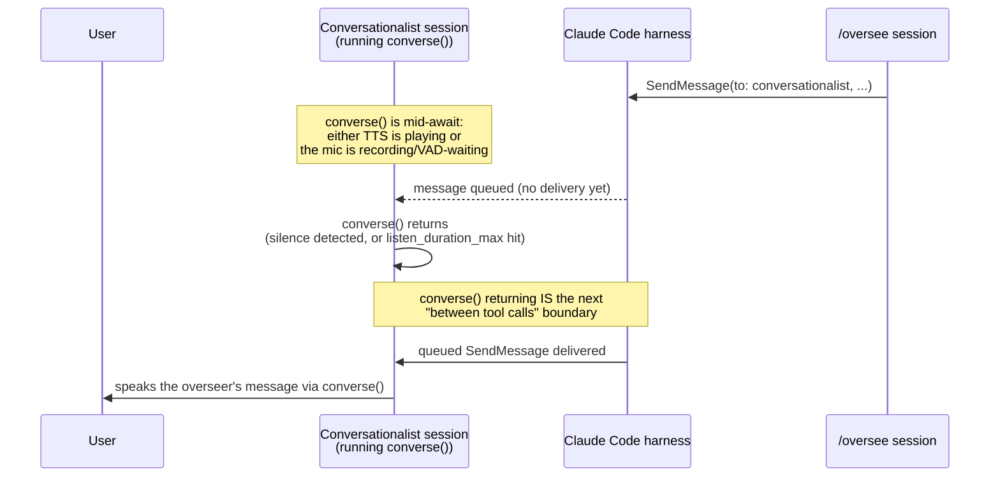

---
first_authored:
  by: "@claude-sonnet-5"
  at: 2026-09-27T14:10:00-07:00
task_list: cdocs/audio-interaction
type: report
state: live
status: review_ready
tags: [analysis, voice, voicemode, messaging]
last_reviewed:
  status: accepted
  by: "@claude-opus-5-5"
  at: 2026-09-27T09:55:27-07:00
  round: 2
---

# VoiceMode deep dive: what it actually does, and whether it can be the voice<>overseer bridge

> BLUF: VoiceMode ([mbailey/voicemode](https://github.com/mbailey/voicemode)) is a mature, actively maintained MCP server built almost entirely for the job the user wants: a natural voice loop against a Claude Code session, with local STT/TTS, automatic cloud failover, and a real (if narrow) multi-agent turn-taking layer called the "conch." It solves none of the cross-session bridging problem itself: its `converse` tool is a single blocking MCP tool call, and nothing in VoiceMode talks to `SendMessage`/`ListAgents` (covered in the prior report). The two systems are complementary: the smallest viable build is VoiceMode unmodified in one dedicated "conversationalist" session, idle (zero cost) between exchanges and woken by an overseer's `SendMessage` or by the user, using `SendMessage`/`ListAgents` to talk to overseers, wrapped in a single cdocs skill file. No fork, no new service, days not weeks.

## Context / Background

[`2026-09-26-voice-companion-architecture.md`](2026-09-26-voice-companion-architecture.md) diagnosed voice clunkiness as two separable causes (audio-stack, architecture) and proposed a talker/thinker split, treating plain VoiceMode `converse` as the zero-effort baseline it recommended testing *against*, not building on.
[`2026-09-27-claude-code-inter-session-messaging.md`](2026-09-27-claude-code-inter-session-messaging.md) then found that Claude Code has a native, on-by-default, subscription-compatible peer-messaging interface (`ListAgents`/`SendMessage`), with an idle-wake rule and a bypass-mode inbound hold as its two sharp edges.
The user's direction narrows the target concretely: keep `/oversee` running as today, add one dedicated Claude Code session that runs VoiceMode as the human's conversational front end, and have that session prepare/condense messages to overseers via native `SendMessage`, favoring the smallest working slice over a new pipeline. This report reads VoiceMode's actual source (cloned at commit `126d15e`, 2026-09-15) to settle what it does, what's genuinely reusable, and exactly where the blocking-`converse`-vs-inbound-`SendMessage` interaction lands.

## Key Findings

- **`converse` is one MCP tool with ~25 parameters**, defined at [`voice_mode/tools/converse.py:4308`](https://github.com/mbailey/voicemode/blob/master/voice_mode/tools/converse.py#L4308). It speaks via TTS, then (unless `wait_for_response=false`) records and transcribes a reply, all inside one synchronous `await`. It is a walkie-talkie call exactly as the prior report assumed, confirmed against code rather than the README.
- **Silence-only endpointing, exactly as assumed, now with an exact mechanism.** `record_audio_with_silence_detection` ([`converse.py:1335`](https://github.com/mbailey/voicemode/blob/master/voice_mode/tools/converse.py#L1335)) uses `webrtcvad`, a frame-level speech/non-speech classifier (not a semantic model), stopping after `SILENCE_THRESHOLD_MS` (default 1000ms) of continuous silence once `listen_duration_min` has elapsed. No semantic turn detection anywhere in the codebase.
- **A real, if narrow, multi-agent turn-taking layer exists: the "conch."** [`voice_mode/conch.py`](https://github.com/mbailey/voicemode/blob/master/voice_mode/conch.py), `conch_queue.py`, and `tools/conch.py` implement a single-speaker flock-based lock with a FIFO waiter queue, `hold_conch` (keep the floor across turns, short refreshed TTL), and two queueing modes (`wait`: block; `callback`: register and return immediately). Scoped to VoiceMode's own agents sharing one physical mic on one host, unrelated to `SendMessage`. Its "out of band" delivery to a granted waiter is a tmux nudge ([`conch_notify.py`](https://github.com/mbailey/voicemode/blob/master/voice_mode/conch_notify.py) shells out to `session send`), local-grantee only; for a remote grantee, `_remote_marker()` is an explicit documented no-op reserved for VM-970's future "MCP channel notifications" to remote *VoiceMode* agents — adjacent to our bridge problem, not the same one (an MCP server cannot call Claude Code's `SendMessage`). **Confirms VoiceMode has no cross-session push today, and its own maintainers know it.**
- **A real barge-in primitive exists, but it is opt-in, external, and TTS-scoped.** `voice_mode/control_channel.py`/`control_socket.py` implement a Unix-domain-socket "control channel" (off by default: `VOICEMODE_CONTROL_CHANNEL_ENABLED=false`) accepting `pause`/`resume`/`stop`/`skip_forward`/`skip_back` from "a Stream Deck press, a media key, a spoken keyword, or any local process." `skip_forward` ([`control_channel.py:44`](https://github.com/mbailey/voicemode/blob/master/voice_mode/control_channel.py#L44)) is "transport barge-in: end the current utterance now and advance to the record/listen turn." **Verified, not assumed**: this interrupts TTS *playback*, not the blocking `converse()` call, and nothing in VoiceMode does live speech recognition during TTS playback — "spoken keyword" names a category of external trigger someone could build, not a shipped feature.
- **Config knobs match the prior report's diagnosis knob-for-knob**: `VOICEMODE_VAD_AGGRESSIVENESS` (0–3), `SILENCE_THRESHOLD_MS`, `MIN_RECORDING_DURATION`, `INITIAL_SILENCE_GRACE_PERIOD`, `DEFAULT_LISTEN_DURATION` (120s), and `STT_PROMPT` (Whisper vocabulary-biasing) — all in [`voice_mode/config.py:945-978`](https://github.com/mbailey/voicemode/blob/master/voice_mode/config.py#L945).
- **STT/TTS provider selection is a health-checked, ordered failover chain**, not a hardcoded switch: `TTS_BASE_URLS`/`STT_BASE_URLS` default to local-first, cloud-fallback lists ([`config.py:777-778`](https://github.com/mbailey/voicemode/blob/master/voice_mode/config.py#L777)); `providers.py` walks the list to the first healthy, capability-matching endpoint, biased toward local whisper.cpp/Kokoro by `PREFER_LOCAL`/`ALWAYS_TRY_LOCAL` (both default `true`).
- **Latency is measured and logged in detail at runtime, contra the prior report's "publishes no latency numbers."** That claim held only for the README; `event_logger.py` timestamps every TTS/STT/recording event per interaction, and `voice_statistics_recent` ([`tools/statistics.py`](https://github.com/mbailey/voicemode/blob/master/voice_mode/tools/statistics.py)) reports per-call TTFA, TTS-gen, TTS-play, and STT times — once the `statistics` tools are enabled (not in the default `converse,service` set).
- **A "turns" parameter supports multi-question surveys in one call**: ordered `{"say"|"ask": ...}` steps, pipelined synthesis, spoken mid-survey controls ("repeat", "wait", "break"), and durable per-answer persistence even on a killed call. Full schema at `_TURNS_PARAM_DESCRIPTION`, [`converse.py:2883`](https://github.com/mbailey/voicemode/blob/master/voice_mode/tools/converse.py#L2883).
- **A native CLI mode exists, independent of any Claude Code session**: `voicemode converse [--voice] [--skip-tts] [--skip-stt] [--timeout]` runs a full speak-then-listen turn from a plain shell command, no MCP client required.
- **Hooks ship, but they are earcons, not narration.** All six shipped hooks (`Notification`, `PermissionRequest`, `Pre/PostToolUse`, `PreCompact`, `Stop`) invoke the same receiver script, which plays a short sound file keyed by event/tool, not TTS speech. No "speak while thinking" feature; the closest is these cues plus the `ack` param (a content-free confirmation chime meaning "heard you").
- **LiveKit was removed, and the CLI reference docs are stale about it.** `CHANGELOG.md` records removal of the LiveKit feature and the `livekit` CLI command group under 8.0.0 (2026-01-25, VM-353); `docs/reference/glossary.md` and `docs/reference/cli.md` still describe a `livekit` transport and CLI group, but no `livekit` command or module exists (`voice_mode/cli_commands/` has no livekit file). Vestigial strings remain (a docstring in `voice_mode/__init__.py`, a stale choice in the `exchanges` CLI filter, two diagnostic suggestions, `docs/web/`, a `pyproject.toml` keyword). Treat the CLI doc's `livekit` section as documentation drift, not a live feature.
- **Selective tool loading exists and matters for scoping.** By default VoiceMode loads only `converse`/`service` (~7,000 tokens); `VOICEMODE_TOOLS_ENABLED=converse,service` (whitelist) or `VOICEMODE_TOOLS_DISABLED=...` (blacklist) controls this explicitly ([`docs/guides/selective-tool-loading.md`](https://github.com/mbailey/voicemode/blob/master/docs/guides/selective-tool-loading.md)); loading all ~40 tools costs roughly 25,000 tokens. A shipped example agent, `voice-only` ([`agents/voice-only.md`](https://github.com/mbailey/voicemode/blob/master/agents/voice-only.md)), is scoped to the `converse` tool alone and nothing else, by design.
- **Fedora is a first-class documented target.** The README lists `sudo dnf install alsa-lib-devel ffmpeg gcc portaudio portaudio-devel python3-devel` for Fedora/RHEL directly; audio I/O goes through PortAudio/ALSA, riding Fedora's default PipeWire shims with no VoiceMode-specific PipeWire code — no Wayland-specific behavior found or expected (no GUI surface to be Wayland-sensitive about).
- **Maturity: active, fast-moving, no LTS discipline.** `CHANGELOG.md` shows releases roughly every 1-3 weeks through 2026; last commit in this clone is 2026-09-15. Extensive internal VM-#### issue references throughout the code (e.g. VM-1739 for `skip_forward`, VM-1967/VM-2015 for cancellation fixes in `converse.py`'s `finally` block) read as continuous, careful iteration, not abandonment, but not a stable target to pin against indefinitely.

## The interaction loop: what's good, what's weak, verified against code

**Good, and stronger than the prior report gave credit for:** turn-taking arbitration for multiple voice agents (the conch, tested, TTL-based idle expiry); granular, well-named tuning knobs for exactly the failure modes report 1 predicted, plus `VOICEMODE_STT_PROMPT` for vocabulary biasing, directly useful for repo jargon ("cdocs," "overseer," "arc-state") a generic Whisper model would otherwise mangle; durable transcript/metrics logging with no building required; and a native CLI mode meaning the STT/TTS loop can run entirely outside any Claude Code session (relevant to option C, below).

**Weak, exactly as diagnosed, now pinned to code:** no semantic turn detection (`webrtcvad` plus a fixed silence timeout is the whole story; a thoughtful mid-sentence pause still risks a premature cutoff, issue [#532](https://github.com/mbailey/voicemode/issues/532), not re-verified here); no live barge-in during TTS playback unless the control channel is explicitly enabled *and* something external feeds it; and **`converse()` fully blocks the calling session's turn while listening**, up to `listen_duration_max` (120s default) — the load-bearing fact for everything below.

## The key integration question: converse() vs. inbound SendMessage



This matters only while an exchange is actually active. When the conversationalist is idle (no `converse()` in flight — see the interaction-shape design below), an overseer's `SendMessage` just triggers ordinary idle-wake: a fresh turn, no blocking, no latency question at all. The reasoning below is scoped to the minority case: a `SendMessage` arriving *while the user and conversationalist are mid-exchange*.

- Report 2 established that an inbound `SendMessage` is delivered "between tool calls during an active turn," or as a fresh turn if idle. A session awaiting an MCP tool result (VoiceMode's `converse`) is, from the harness's view, mid-turn with a call in flight — not idle, not between calls. **The message cannot interrupt `converse()`; it queues.**
- **It is delivered the instant `converse()` returns** — exactly the next tool-call boundary the harness watches for, no extra polling delay.
- **Worst-case latency is bounded by the current listen window**: up to `listen_duration_max` (120s default) if the user's gone quiet, near-zero if they just finished speaking.
- **VoiceMode has no mechanism that reaches into this.** `skip_forward` interrupts TTS *playback*, not listening, and nothing in VoiceMode is aware of Claude Code's tool-call boundaries or messaging — confirmed by `conch_notify.py`'s unfilled `_remote_marker` seam.
- **Mitigation during an active exchange: a short `listen_duration_max`** (e.g. 10-20s rather than 120s), bounding worst-case delay to the window. Whether this loop is the whole session's default shape, or scoped only to an active exchange, is what the next section resolves — it should not be the idle default.
- **Auto-backgrounding caps the block at two minutes, with a hazard.** Per the [MCP docs](https://code.claude.com/docs/en/mcp#automatic-backgrounding-of-long-tool-calls), a call still running past two minutes (`CLAUDE_CODE_MCP_AUTO_BACKGROUND_MS`) "moves to a background task," result arriving later as a notification. A default `converse()` (TTS plus up to 120s listening plus STT) can exceed that and get backgrounded mid-listen — the turn continues, but the backgrounded call still owns the microphone, and a new `converse()` issued meanwhile overlaps it. Short `listen_duration_max` avoids this; `CLAUDE_CODE_MCP_AUTO_BACKGROUND_MS=0` is the belt-and-braces option. Delivery timing should still be spot-checked empirically.

## Interaction shape: idle-wake by default, hands-free as an opt-in

The always-listening short-window loop (re-issuing `converse()` every 10-20s "in case something was said") is a real mitigation for latency *during* an exchange, but it is the wrong **default** shape for the whole session: it has an ongoing cost even when nobody is talking to it.

**Quantified cost of always-listening.** At a 10-20s `listen_duration_max` looping continuously, that's roughly 180-360 `converse()` calls per hour of silence — each followed by a model call on the subscription to decide the next step, each adding to the transcript toward compaction, for a conversationalist meant to sit quietly beside an `/oversee` arc for hours.

**Default design: idle-wake, not idle-poll.**

- **Active exchange**: while the user and conversationalist are actually talking, it loops `converse()` with a short `listen_duration_max` (the mitigation from the section above), so it stays responsive to both the user and to a `SendMessage` arriving mid-conversation.
- **Idle**: once the user signs off, or after a short silence, the conversationalist simply ends its turn — no `converse()` in flight, no cost, no context growth, the same idle state any Claude Code session sits in between turns.
- **Overseer-initiated wake**: an overseer's `SendMessage` arriving while idle triggers Claude Code's documented idle-wake — "Claude Code starts a new turn with the message" (report 2) — at zero polling cost. The conversationalist wakes, speaks the message via `converse()`, listens for a reply, then goes idle again.
- **User-initiated wake**: nothing is listening while idle, so the user needs an explicit way back in. Three options, by cost:

| Wake path | Mechanism | Effort | Notes |
|---|---|---|---|
| Type in its terminal | Typing a prompt is itself a wake | None | Zero build. Requires being at that terminal. |
| Hotkey/script → inbox socket | A hotkey-bound script writes to the session's inbox socket, whose path a `SessionStart` hook publishes to a file from `CLAUDE_CODE_MESSAGING_SOCKET` (report 2's direct-socket path); with `crossSessionInbound: "accept"` set, the post is delivered and starts a turn | Small: one script + one keybinding | Message-line wire format after the auth line is undocumented — **needs empirical verification** (report 2 flagged this too). |
| Spoken hotword → inbox socket | An always-on wake-word process (e.g. openWakeWord) that, on its keyword, posts to the conversationalist's inbox socket exactly like the hotkey row | Medium-large | **Verified in source: no hotword listener ships** (`docs/reference/control-channel.md` shows only a pseudo-handler). VoiceMode's control channel is *not* a wake path: it accepts only `pause`/`resume`/`stop`/`skip_forward`/`skip_back` for in-flight playback (`control_channel.py:21`), so with no `converse()` running it has nothing to act on and cannot start a Claude turn. |

**Recommendation: type-in-terminal as the default** (zero build), inbox-socket hotkey as the natural next step once verified. Hotword is the only genuinely hands-free option and the most expensive; defer it.

**Hands-free mode stays available, as an explicit opt-in.** The user can ask the conversationalist to "stay hands-free for a while," switching it into the always-listening short-loop pattern for a bounded stretch (cooking, walking), the cost above made an explicit tradeoff, not a hidden default.

**Model choice for the conversationalist: a Sonnet- or Haiku-class model via `--model`, not the overseer's own tier.** Three reasons: its job is narrow (condense speech, look up a session, call `ListAgents`/`SendMessage`, speak a reply) and doesn't need deep reasoning; it is invoked far more often per minute of actual conversation than an overseer is per minute of work, so per-call latency and cost compound fastest here; and this realizes report 1's talker/thinker split in its cheapest form — the overseer never does the talking, so making the talker a smaller, faster model is exactly the latency benefit report 1's proposed Pipecat experiment was designed to test, obtained here without building a new pipeline.

## Reuse options, incremental-first

| Option | What it is | Dev-time | Fixes |
|---|---|---|---|
| **(A) VoiceMode as-is + a thin cdocs skill** | Dedicated conversationalist session runs unmodified VoiceMode; a `SKILL.md` owns the idle-wake shape above: listen in a loop only during an active exchange, condense the user's speech into a structured message, `ListAgents` to find the right overseer, `SendMessage` it, speak inbound overseer messages back, then go idle. No new service, no new process. | Hours: one skill file + a scoped `.mcp.json`/env file. No code. | The bridge itself, at near-zero idle cost. Gets the user talking to a session that reaches every overseer today. |
| **(B) (A) + config tuning** | Lower per-call `listen_duration_max` for active-exchange loops; set `--model` to a Sonnet/Haiku-class model; set `VOICEMODE_STT_PROMPT` with repo vocabulary (arc-id slugs, "overseer," "cdocs," proposal names); set `VOICEMODE_VAD_AGGRESSIVENESS`/`SILENCE_THRESHOLD_MS` to taste. | An hour of env tuning + a few real conversations to dial in. | Mid-word cutoffs, jargon misrecognition, and directly shortens worst-case `SendMessage` delivery latency during an exchange. |
| **(C) Borrow local STT/TTS only, different front end** | Point a Pipecat/Smart-Turn pipeline (report 1) at VoiceMode's already-running whisper.cpp/Kokoro endpoints, skip the MCP `converse` tool entirely; drive `SendMessage`/`ListAgents` from a plain process via `claude -p`/CLI, direct inbox-socket posting (report 2's non-Claude write path), or host the overseer directly (report 2's "design 0"). | Days: reuses two running services, builds a new front end and bridge glue. | The blocking-`converse` problem structurally, plus real semantic turn detection and barge-in, which (A)/(B) cannot. Loses VoiceMode's conch, survey turns, `ack` cues, and metrics for free — they'd need reimplementing or dropping. |
| **(D) Fork/upstream contribution** | Patch `record_audio_with_silence_detection` to accept an external cancellation signal, reusing the cooperative-cancel `stop_event` the recording loop already polls every 0.1s (VM-2015, `converse.py:1977-1983`, today only set on ESC/coroutine-cancel) rather than adding a new hook. | Days plus maintainer coordination or a maintained fork. | Would make "interruptible listening" real rather than "idle-wake plus short loop," but is the least incremental option, most likely to compete with weftwise devtime. |

**Recommendation: (A) first, (B) immediately after, defer (C)/(D).** (A) is a genuinely tiny build: the skill markdown is the only new artifact, and it can be iterated on live without touching any running process. (B) is config only. Both keep "things more or less as they are," exactly the instruction, and both default to idle-wake rather than always-listening. (C) is the right move only once (A)/(B) prove out the user actually wants to talk to this session regularly and active-exchange listen-loop latency is felt as annoying rather than invisible; it is where report 1's Pipecat/Smart-Turn recommendation still lives, undisturbed by this report. (D) is not worth it before (C) is even tried.

### Setup checklist (Fedora)

1. **Install without touching other sessions**: the plugin route registers VoiceMode's MCP server *and* six earcon hooks in every session where it's enabled, so a user-scope install would add tools and sounds to every `/oversee` session. Choose **local scope** installing from the conversationalist's own directory, or skip the plugin and run `uvx voice-mode-install` (services only) plus an MCP entry (step 3). System deps: `sudo dnf install alsa-lib-devel ffmpeg gcc portaudio portaudio-devel python3-devel`.
2. **Local services**: `voicemode whisper install` + `enable` (whisper.cpp STT, port 2022); `voicemode kokoro install` + `enable` (Kokoro TTS, port 8880). Both register systemd **user** units (`voice_mode/templates/systemd/`, `systemctl --user`).
3. **MCP config scoped to only the conversationalist**: its own directory, an MCP config declaring only `voicemode` (`uvx --refresh --from voice-mode voicemode-mcp-launcher`), launched with `claude --mcp-config <path> --strict-mcp-config` (ignores all other MCP configs for *this* session; isolation of *other* sessions comes from step 1, not this flag). `VOICEMODE_TOOLS_ENABLED=converse,service` in the MCP entry's `env` block keeps the footprint at ~7K tokens instead of ~25K. Add `--name conversationalist`, `--model` set to Sonnet/Haiku-class (rationale above), and `--tools` restricted (e.g. `ListAgents,SendMessage,Read,Write`, keeping `Read`/`Write` only for the ledger below).
4. **Permission mode: default to matching this overseer's own setup.** This report is itself running inside an `/oversee` session in bypass-permissions mode — evidence the user's overseers commonly run `--dangerously-skip-permissions`. The inbound-hold rule depends on *both* sides (a bypass-mode receiver holds everything except messages from another bypass-mode sender; a prompting receiver holds only bypass-mode senders' messages), so bypass mode does not by itself sidestep holds. Default: **run the conversationalist in bypass mode too**, matching the overseers, plus `crossSessionInbound: "accept"` via `--settings` at its launch (project/local `accept` is ignored; user settings would apply to every session). The two settings cover different directions: `accept` makes the conversationalist take every inbound message, including hotkey posts, regardless of mode, while bypass mode is what lets its *outbound* messages through to bypass-mode overseers, which would otherwise hold them. Bypass also means its `Write` (ledger) runs unprompted, acceptable given the `--tools` restriction. If overseers prompt instead, leave the conversationalist prompting, same match-the-overseer rule.
5. **Headset recommended, control channel left off.** Barge-in needs echo cancellation (report 1); VoiceMode's own barge-in needs `VOICEMODE_CONTROL_CHANNEL_ENABLED=true` plus an external trigger this report found no built-in source for. Skip both for the first slice.
6. **If using the hotkey wake path**: add a `SessionStart` hook to the conversationalist's settings that writes `$CLAUDE_CODE_MESSAGING_SOCKET` (not the token) to a user-only file the hotkey script reads.

## The prep-and-send component: a sketch, not a proposal

**Outbound message contract** (plain text, since `SendMessage` carries text only): a short structured body the conversationalist composes before calling `SendMessage`, something like:

```
Intent: question | decision | status-check | instruction
For: <overseer session name / arc-id>
User said (verbatim): "<exact quote>"
Condensed ask: <one or two sentences>
Constraints: <any explicit limits the user stated>
```

The verbatim quote matters because `SendMessage` content is explicitly untrusted-relay text at the receiver (report 2): keeping the user's own words alongside the condensation lets the overseer sanity-check the paraphrase.

**A small ledger**, a plain JSON file (e.g. `.claude/conversationalist/ledger.json`; not under `.claude/oversee/`, whose JSON files `/oversee resume` scans as arc-state candidates) mapping each sent message to `{overseer, timestamp, verbatim, condensed, reply_received_at, reply_text}`. Operational state, not a cdocs artifact — it just lets the conversationalist (and a fresh instance of it, after restart) know which overseer it's mid-conversation with and what was last asked.

**State tracking**: `notify_when_idle`, called against each overseer session actively awaited, is the "tell me when they probably have an answer" push (one-shot, re-subscribe each firing, per report 2). `claude agents --json`/`claude logs <id>` is the pull-based complement for a "what's everyone doing" summary.

**What the overseer side needs: checked, and nothing is strictly required.** `oversee/SKILL.md` and its supporting rules use `SendMessage` only for the arc overseer's own internal dispatch to specialists; no mention of `ListAgents`, inbound messages, or a reply convention. Claude Code itself tells the receiving Claude a message came from another session with a reply address, so an overseer can already reply — what's missing is any signal the sender is a *voice* front end, or a convention that replies stay short and speakable. A small future addendum to `oversee/SKILL.md` would close this; out of scope here, this report only confirms the gap.

## Decision points for the user

- **Preferred wake method for an idle conversationalist**: type in its terminal (default, zero build), a hotkey/script into its inbox socket (small build, wire format needs verification), or a spoken hotword via a separate wake-word process posting to that same inbox socket (real new software: no hotword listener ships, and VoiceMode's control channel cannot wake a session).
- **Overseer permission mode**: do `/oversee` sessions normally run with `--dangerously-skip-permissions`? If yes, the conversationalist should default to bypass mode too (this report's default, above). If no, or mixed, it should prompt instead, and cross-session sends between mismatched modes may need manual approval.

## Unverified claims

- Exact `SendMessage` delivery timing relative to a `converse()` return, and behavior when a backgrounded `converse()` overlaps a new one. Needs an empirical test.
- Whether PipeWire on Fedora introduces any audio-path quirk for VoiceMode's PortAudio-based capture (no VoiceMode-specific PipeWire code found, none tested live).
- Issue [#532](https://github.com/mbailey/voicemode/issues/532)'s mid-word cutoff, carried over from the prior report, not re-checked against the live tracker.
- Whether `--strict-mcp-config` also suppresses plugin-provided MCP servers (docs say it ignores "all other MCP configurations"; hooks are unaffected either way, hence step 1's local-scope install). Touches neither permission modes nor `crossSessionInbound`.
- The inbox-socket wake path's message-line wire format (flagged in the table above).
