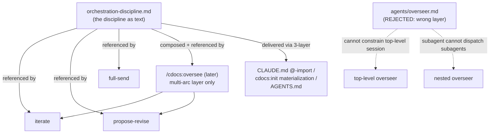

# Review of the Overseer Approach: Role, Slash Command, and the Factoring Question

> BLUF: The right canonical unit for overseer discipline is a shared RULE file, exactly the `orchestration-discipline.md` that [`overseer-alignment`](../proposals/2026-08-28-overseer-alignment.md) Pillar 1 already proposes, referenced by `iterate`/`propose-revise`/`full-send`.
> An `agents/overseer.md` role type is a category error: the overseer is the top-level session, which cannot be forced into a subagent's frontmatter, and a dispatched subagent-overseer cannot dispatch its own workers (the platform forbids subagent-from-subagent `Task`).
> A `/cdocs:oversee` slash command is warranted only for the genuinely-additional multi-proposal-arc layer (chaining, arc-level durability, file-ownership), which it should COMPOSE the loops for and REFERENCE the same rule, not re-embed the discipline.
> This session's two live failures (a full-send DEADLOCK on child-liveness, and two agents clobbering one proposal file) are evidence that the coordination gap is real, not hypothetical, and argue for a small liveness-reconcile + file-ownership addition NOW rather than a whole new skill.
> On the memory decision: WITHHOLD memory from `nit-fix` (it contradicts that agent's own charter), CONSTRAIN `triage`, and gitignore `.claude/agent-memory/` regardless: it is currently trackable and cross-contaminable.

## Scope and Method

This reviews the overseer discipline "as currently planned" across the three consolidation-named documents ([consolidation memo](../proposals/2026-09-01-overseer-consolidation.md), [overseer-alignment](../proposals/2026-08-28-overseer-alignment.md), [RFP](../proposals/2026-03-26-rfp-oversee-skill.md)) and the shipped reality (`plugins/cdocs/skills/{iterate,propose-revise,full-send}/SKILL.md`, `plugins/cdocs/agents/{judge,reviewer,triage,nit-fix}.md`).
It centers on the owner's crux question: can the overseer be ONE referenceable unit (rule, agent, and/or slash command) that the required commands delegate to, instead of each skill re-embedding the discipline?
It does not implement anything and changes no proposal state.

## The Duplication, Measured

The overseer discipline is duplicated, but less than the framing implies, and the shipped skills are already partway to the fix.

- `iterate/SKILL.md` and `propose-revise/SKILL.md` both carry the verbatim paragraph "The overseer is a behavioral mode the top-level session agent enters when invoking this skill. The human user is the supervisor..." and a near-identical Roles table Overseer row ("top-level agent, restricted to orchestration; owns dispatch, freshness, termination").
- The dispatch-threshold line is the live DRIFT the plan already names: `iterate` says dispatch "for all tasks beyond trivial few-liners"; `propose-revise` says "for all tasks, even trivial ones."
- `full-send/SKILL.md` does NOT re-embed: it already just says "Both loop skills describes the *overseer mode*" and defers. It is the model the other two should follow.

So the concrete duplication is roughly two paragraphs plus one Roles row across two skills, with one drifted sentence.
That is worth deduplicating, but it is a rule-extraction job, not a re-architecture.
`overseer-alignment` Pillar 1 already prescribes exactly this: create `orchestration-discipline.md`, reduce each skill to a reference plus its carve-out, and resolve the drift by making iterate's wording the default and propose-revise's the documented stricter exception.
The owner's question is therefore largely a request to CONFIRM that direction and to decide whether it should ALSO become an agent type and/or a slash command.

## Verdict on the Factoring

**Recommended: the shared RULE file is the canonical unit. Do not create an `agents/overseer.md`. Add a `/cdocs:oversee` skill only for the multi-arc layer, later, and have it reference the rule rather than duplicate it.**

The three candidate artifacts are not interchangeable; they sit at different layers and only one can be the canonical home.

### Why the rule, and not the slash command, is canonical

A rule reaches a session that runs NO skill.
A bare top-level session doing ad hoc orchestration, or a session mid-`/cdocs:implement`, still loads `orchestration-discipline.md` via the source-repo `CLAUDE.md` `@`-import or the init-materialized `.claude/rules/cdocs.md`.
A skill only governs sessions that invoke it.
Since the owner wants the discipline to bind ANY overseer-style session, the discipline must live where it is always loadable, which is the rules layer, not a skill body.
This is also why "a `/oversee` skill that wraps the others" cannot be the canonical home: wrapping is an invocation surface, not a delivery mechanism.

### Why the rule fits the three-layer delivery and multi-target constraint

The rule route is the only option that is parity-safe by construction, and it reuses machinery that already ships `writing-conventions.md` and `frontmatter-spec.md`.

- **Cross-target rule layer (recommended):** a new `rules/*.md` is auto-covered by the `SessionStart` hash and the `.opencode/rules/cdocs/` glob. The one manual seam is `/cdocs:init`'s hardcoded three-section AGENTS.md inline template (`init/SKILL.md:73-81`): a fourth rule is hashed-as-stale but never inlined until that template grows. `overseer-alignment` already flags this split-brain and folds it into Phase 1. Bounded, known cost.
- **`@`-imported partial into skill bodies:** creates a second delivery path parallel to the rule layer, redundant with it, and the OpenCode build is a risk: `generateOCFrontmatter` emits only a fixed allowlist and there is no evidence the skill-body build inlines `@`-imports, so an OC skill could reference a partial that never shipped. Reject in favor of the rule layer, which the OC build already handles via `.opencode/rules/`.
- **Named agent type:** does not deliver the discipline to the top-level session at all (frontmatter governs dispatched subagents only). Wrong layer. See below.
- **`/oversee` skill:** an invocation surface, not a delivery mechanism; reaches only invoked sessions. Good for the multi-arc layer, wrong as the canonical home.

## Does "Overseer as a Named Subagent Role" Even Work?

**No, for the primary use, and this is the load-bearing reconciliation.**
The overseer is almost always the TOP-LEVEL session, and two hard constraints make an agent-type framing incoherent there.

1. **A top-level session cannot be constrained by subagent frontmatter.** The overseer IS the user's own session. `overseer-alignment` states this directly: "A hard tool-allowlist on the top-level session is not available (it is the user's own session); only dispatched subagents have allowlists." An `agents/overseer.md` with `tools:`/`model:`/`memory:` fields would apply to a dispatched worker, not to the session actually running the loop. The frontmatter would govern the wrong thing.
2. **A dispatched subagent-overseer cannot dispatch its own workers.** The platform forbids subagent-from-subagent `Task` dispatch (stated in `reviewer.md` Constraints: "the platform forbids subagent-from-subagent dispatch"). An overseer's entire job is to dispatch implementers, reviewers, and judges. A dispatched overseer role could not do that, so the role type would be inert for the one thing it exists to do.

The nested case (Pillar 3's "escalate to a parent overseer") does not rescue the role type: the sub-overseer would be exactly the forbidden subagent-that-dispatches-subagents.
Nested orchestration, where it is needed, runs through the `fork`/`SendMessage` durable-specialist mechanics, which are a different primitive from `Task` dispatch and are not what an `agents/*.md` type provides.

The reconciliation the owner asked for: "overseer as a role you can dispatch" and "overseer as the discipline the lead session follows" are not two implementations of one thing.
The first is largely incoherent on this platform.
The overseer is a DISCIPLINE that a session adopts, delivered as a RULE, parameterized by a SKILL.
"Role" is the right word for the concept and the wrong word for an artifact type: it is a role in the sense of a hat the session wears, not in the sense of an `agents/` entry.

## Misgivings

Where this factoring bites, in rough order of how much it should shape the build.

1. **"One rule" is not "enforced everywhere."** The only INDEPENDENT enforcer of overseer discipline is the `judge`, and the judge exists only inside `/cdocs:iterate`. `propose-revise` and `full-send` have no judge and fall back to the written self-check. Factoring the discipline into a rule makes the TEXT consistent; it does not add enforcement to the two loops that lack a judge. Do not read "single canonical overseer rule" as "now enforced across all three skills." Enforcement asymmetry survives the factoring untouched.

2. **Reference-indirection is silently weaker in an un-init'd marketplace install.** If a skill reduces to a one-line "follow `orchestration-discipline.md`," the content must arrive by another path. In a source repo the `CLAUDE.md` `@`-import loads it always. In a marketplace install the `SessionStart` hook injects NO content (it only nags to re-run `/cdocs:init`); the content is materialized only once `/cdocs:init` has run. So in a fresh install that skipped init, the skill's reference points at a discipline the agent never loaded. This is the same graceful-degradation gap the whole rules architecture already has, but reference-only skills inherit it where inlined skills do not. Recommended floor: each skill keeps a 2-3 line irreducible summary inline (dispatch-by-default, durable state before compact, fresh reviewer/judge) and references the rule for the full text. This is a small, deliberate duplication, the opposite of the zero-duplication goal, and it is the right trade: a correctness floor beats a clean-but-absent reference.

3. **The durable-memory pillar is in tension with the memory-on-mechanical-agents decision.** `overseer-alignment` leans the entire enforcement backbone on freshness (fresh reviewer, fresh judge), and the [frontmatter proposal](../proposals/2026-09-01-agent-frontmatter-marketplace-metadata.md) correctly WITHHELD `memory` from reviewer/judge for that reason. But the same principle, an agent whose correctness depends on carrying nothing forward, applies to a MECHANICAL enforcer that is supposed to mirror the current rule files. Granting `triage`/`nit-fix` persistent memory quietly contradicts the freshness value the overseer plan elevates. See the memory section below; the two questions are the same question.

4. **Multi-overseer coordination stays genuinely unsolved, and the plan knows it.** `overseer-alignment` explicitly punts concurrency to "the `/oversee` skill's cross-agent coordination layer," which does not exist. The RFP's §A#4-5 (locks, serialization) are the real gap. Factoring the discipline into a rule gives concurrency a home to be documented in; it does not solve it. The risk is false confidence: "we factored the overseer" can read as "concurrency is handled" when it is not. This session's two failures (next section) are proof the gap bites in practice.

5. **A full `/cdocs:oversee` skill is an over-engineering risk right now.** The RFP is from March 2026 and still unbuilt; that is evidence the multi-proposal-chaining pull is not yet strong. The two observed failures are addressable with a small rule addition plus an iterate/full-send checkpoint step, not a new skill. Build the skill when chaining is a recurring real need, not speculatively.

## Empirical Failure Modes as Motivation

This session hit two failures that map directly onto the coordination gap and should anchor the near-term work.

- **Full-send orchestrator DEADLOCK.** On resume the orchestrator re-reported the same "child in flight" state, although the harness notifies only when it has NO live children: the orchestrator could not tell its dispatched child had terminated. Its in-window belief about child liveness diverged from reality with no reconciliation. This is a liveness gap, and it is also an argument FOR the durable-memory pillar with a correction: writing a handoff is not enough if the resumed session trusts its pre-interrupt belief instead of re-deriving state. Recommendation: the Iteration Log should record child dispatch/return as events, and the rule should require an on-resume step that reconstructs child liveness from the log and distrusts in-window state. Durable memory without on-resume reconciliation still deadlocks.

- **Two agents writing one proposal file.** Two concurrent agents clobbered the same proposal and needed manual reconciliation. This is exactly RFP §A#4-5 (claim markers, serialization with real file-conflict detection). It confirms serialization is not polish. Recommendation: a single-writer file-ownership convention (a claim marker, or one-writer-per-file, coordinated through the devlog) belongs in the rule now, ahead of any full `/oversee` build.

Both failures argue the coordination layer addresses observed, not hypothetical, problems, AND that the first increment should be small: a liveness-reconcile-on-resume step and a file-claim convention, delivered as rule text plus a checkpoint, not a new skill.

## Do the 19 Questions Reduce Once Factored?

Yes, materially. The factoring collapses the consolidation memo's ~19 into roughly three tracks.

- **Group C (12-19), the `overseer-alignment` frontier:** these mostly reduce to "land `orchestration-discipline.md` plus the two blocking revisions" (#17 logged thinness signal, #18 correct rule-delivery description). #19/#14 already have recommended defaults. Effectively one unit of work, which IS the factoring.
- **Group A (1-7), the real `/oversee` frontier:** factoring merges several. #4 (locks) and #5 (serialization) are one concern: file-ownership, and the priority per the failures above. #2 (arc-level AFK) and #3 (cross-session arc durability) are one concern: a durable arc-progress file. #1 (invocation surface), #6 (troubleshooting budget), and #7 (verification-depth ladder) are separable rule snippets. So A's seven reduce to roughly three: file-ownership, arc-progress durability, invocation surface, plus two orthogonal rule additions.
- **Group B (8-11), iterate loop refinements:** independent of the factoring and should NOT block it. Keep on a separate track.

So the honest count after factoring is: one rule-landing (C), about three oversee-frontier concerns (A), and a separable iterate-refinements bucket (B). The factoring reduces the surface; it does not evaporate it.

## Memory on the Two Mechanical Enforcers

Recommendation: **WITHHOLD from `nit-fix`; CONSTRAIN `triage`; and gitignore `.claude/agent-memory/` regardless of the above.**

The recent commit ([`6b01b1c`](https://github.com/) on branch `cdocs/agent-frontmatter-marketplace`) granted `memory: project` to `triage` and `nit-fix` while withholding it from `reviewer`/`judge`.
The withholding half is correct and well-argued.
The granting half is under-scrutinized: its round-1 review praised the withholding and did not examine the drift, determinism, or on-disk risks of the granting.

**1. Memory contradicts these agents' own charters (the decisive point for `nit-fix`).**
`nit-fix.md` states, in its own words: "You do NOT have hardcoded knowledge of the conventions" and "These files are the source of truth for all conventions you enforce."
Its correctness is defined as being a faithful, current mirror of the rule files, read fresh every run.
The frontmatter proposal's stated benefit is that memory "lets it retain learned conventions and edge-case classifications across runs."
That is precisely a shadow copy of the conventions that can DIVERGE from the canonical rule files.
A linter that remembers conventions is a linter that can enforce yesterday's rules against today's `writing-conventions.md`.
This is convention-drift, and it is worst exactly for the agent whose value is fidelity to the live rules.
`triage` has the same shape one step removed (it reads `frontmatter-spec.md` as "the source of truth").

**2. Determinism and reproducibility regress.**
A mechanical fixer should be a pure function of (document, current rules).
Memory makes its output history-dependent: the same document under the same rules can get different fixes depending on what the agent "learned" earlier.
That breaks reproducibility and makes bisection and audit harder, for the two agents whose entire selling point is mechanical determinism.
The same freshness principle that (correctly) withholds memory from `judge`/`reviewer` applies here: these agents should forget, not accumulate.

**3. The on-disk risk is concrete and currently live.**
`memory: project` resolves to `.claude/agent-memory/<name>/` (confirmed in the proposal and its review).
The repo `.gitignore` ignores `.claude/rules/` but NOT `.claude/agent-memory/`.
So memory written to `.claude/agent-memory/triage/` and `.claude/agent-memory/nit-fix/` is untracked-but-trackable: it will show up in `git status` and can be committed by accident, or cross-contaminate, carrying one project's or one session's learned state into the plugin repo or into a consumer.
This must be gitignored irrespective of the keep/withhold call.

**4. Multi-target asymmetry.**
The OpenCode build drops `memory` entirely (`generateOCFrontmatter` emits a fixed allowlist; the proposal's own review confirms `color`/`maxTurns`/`memory` are dropped on OC).
So the same agent behaves differently across targets: it accumulates learned conventions on Claude Code and does not on OpenCode.
For a mechanical enforcer meant to be identical everywhere, that is a silent divergence.

**5. The claimed benefit is thin.**
Tag vocabulary and status norms already live in `frontmatter-spec.md` and the corpus, and `triage` is already instructed to be conservative about tags.
The marginal gain from a memory cache does not justify the drift, determinism, commit, and parity costs above.

Disposition:
- `nit-fix`: **withhold.** Memory directly contradicts "you do NOT have hardcoded knowledge; the files are the source of truth." Remove `memory: project`.
- `triage`: **constrain, or withhold.** If kept, constrain what it may persist to genuinely project-idiosyncratic, NON-normative caches only (for example a project's accepted tag vocabulary that is not already in the spec), with an explicit prohibition on persisting anything that duplicates rule-file content, so memory can never become a stale second copy of the conventions. If that boundary cannot be stated crisply in the agent prompt, withhold instead.
- Both, unconditionally: **add `.claude/agent-memory/` to `.gitignore` now.**

## Resolve Before Building (Prioritized)

1. **Land `orchestration-discipline.md` as the single rule** (`overseer-alignment` Phase 1) with its two blocking revisions (#17 logged thinness signal, #18 correct rule-delivery description). This IS the factoring. Do NOT create `agents/overseer.md`.
2. **Decide the reference-vs-inline floor for skills.** Recommended: a 2-3 line inline discipline summary in each skill plus a reference to the rule, so the discipline survives an un-init'd install.
3. **Add the two empirically-motivated disciplines to the rule and to iterate/full-send checkpoints now:** on-resume liveness reconciliation from the Iteration Log (distrust in-window child state), and a single-writer file-ownership/claim convention. Both are cheap and both address failures already observed this session.
4. **Defer the full `/cdocs:oversee` skill** until multi-proposal chaining is a recurring real need. When built, it composes the loops and references the rule; it does not re-embed the discipline.
5. **Fix the memory decision:** gitignore `.claude/agent-memory/` unconditionally; withhold memory from `nit-fix`; constrain (or withhold from) `triage`.
6. **Keep Group-B iterate refinements on a separate track;** they do not block the factoring.

## Verdict

The overseer factoring the owner is reaching for is correct in shape and already the `overseer-alignment` Pillar 1 plan: one shared RULE, referenced by the loop skills, delivered through the existing cross-target rule layer.
The two additions the owner floated should be handled asymmetrically: reject the `agents/overseer.md` role type as a category error, and scope any `/cdocs:oversee` slash command down to the multi-arc coordination layer that neither shipped skill covers, to be built later and to reference the same rule.
The near-term, high-value work is small and empirically motivated: land the rule, keep a thin inline floor in each skill, and add liveness-reconcile and file-ownership disciplines that this session's own deadlock and file-clobber failures demand.
On memory: the withholding from reviewer/judge is right; the granting to `triage`/`nit-fix` is not, and `.claude/agent-memory/` must be gitignored either way.
