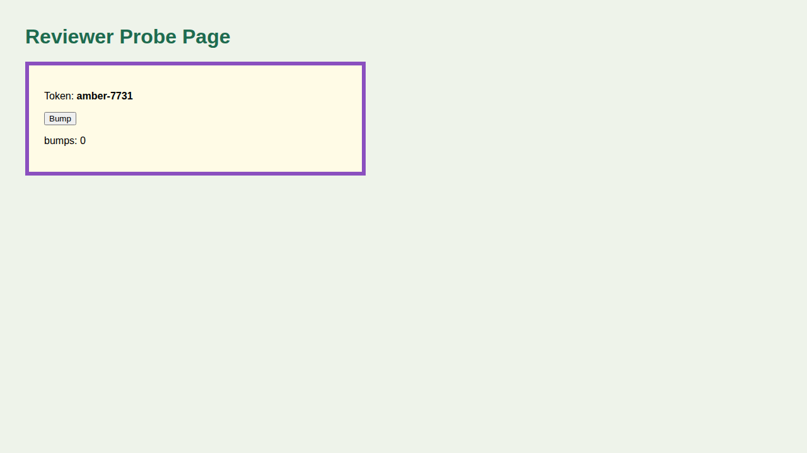
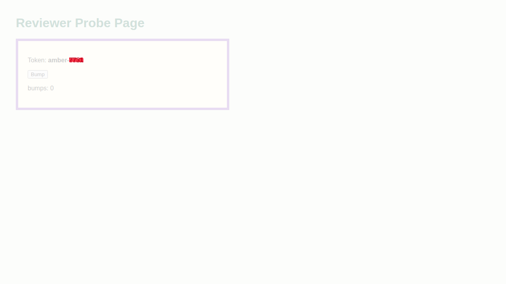
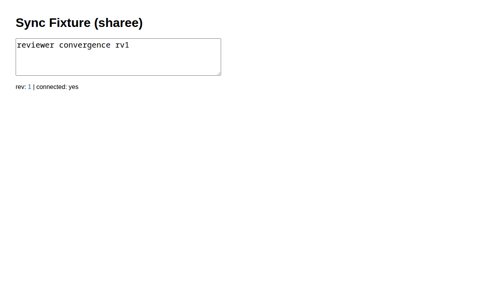

# Review: Browser Delegation Plugin Implementation (impl-1, round 1)

> BLUF: Revise, with one small blocking fix.
> The floor passes: in my own nested `claude -p --plugin-dir` dispatch, a fresh `browser-delegate-review-viewer` session reported `opened`, the AE score was correct, and the screenshot shows exactly what the Facts claim.
> The agent body, README and Phase 3 text match the proposal, every listed deviation is justified, and the worktree is clean.
> The blocker: the `poll-until` loop reports `converged: yes` whenever every session's eval fails with the same error. I reproduced this against two live sessions. It is a false pass in exactly the place the proposal says must never pass.
> review_proof: `confirmed` (artifacts below come from delegates this reviewer dispatched this round).

## Summary Assessment

impl-1 builds Phases 1-4 of the browser-delegation proposal: the `browser-delegate` plugin (manifest, agent, README, marketplace entry), the iterate `confirmed`-row clause and the two `reviewer.md` bullets, plus a Phase 1 spike record.
The work is careful and well evidenced.
Each Phase 1 verdict has raw evidence, I verified each committed `_media` file byte-for-byte against its scratch source, and the gaps (fixture rather than weftwise, an ephemeral container from the weftwise image, no full iterate loop, no OpenCode build) are stated in the BLUF.
I re-ran the floor and three spot checks through a real nested harness (fresh `opened`, `reused` with carried state, baseline AE, two-session convergence), and all of them passed.
A direct probe of the agent's convergence script showed that matching errors count as agreement, so the verdict is **Revise** with one blocking item.

## Reviewer's Own Floor Re-run

Setup: a scratch git repo on branch `browser-delegate` (`$S/rv1/repo`, so the delegate's branch derivation runs for real), my own fixture page on `127.0.0.1:18741` (token `amber-7731`), a variant on `:18742` (token `amber-0000`) that I captured myself as the baseline, and a copy of the implementer's SSE relay on `:18732`.
Harness: `claude -p --model sonnet --plugin-dir <worktree>/plugins/browser-delegate --strict-mcp-config --settings '{"enabledPlugins":{"cdocs@clauthier":false}}' --allowedTools "Agent Bash Read"`, with `PATH` prefixed by the scratch `@playwright/cli@0.1.22`, and config `$S/cfg/hs1208.json` (headless shell 1208).
`$S` = `/tmp/claude-1000/-var-home-mjr-code-weft-clauthier-main/63ac45de-462d-4f43-ae1c-4ab6d59049b8/scratchpad`.
Each init listed `browser-delegate:browser-delegate`, the delegate used only `Bash`, and the implementer's parser (`$S/dispatch/parse_report.py`) returned `VALID` for all three reports.

Before r1, I opened an implementer-proxy session `browser-delegate-preview` on the same route and set `localStorage.implmarker = "impl-was-here"`.

### r1: floor (fresh sessions, baseline diff), nested session `78ee4b0e`, $0.11

Report lines (all except `Truncated`):

```
BROWSER DELEGATE REPORT
Sessions: browser-delegate-review-viewer (role: review-viewer, route: http://127.0.0.1:18741/, opened)
Status: OK
Artifacts: /tmp/claude-1000/browser-delegate/run.uLti7T/browser-delegate-review-viewer-panel.png (screenshot)
Artifacts: /tmp/claude-1000/browser-delegate/run.uLti7T/browser-delegate-review-viewer-diff.png (diff)
AE score: 402 (/tmp/claude-1000/browser-delegate/run.uLti7T/browser-delegate-review-viewer-panel.png vs /tmp/claude-1000/-var-home-mjr-code-weft-clauthier-main/63ac45de-462d-4f43-ae1c-4ab6d59049b8/scratchpad/rv1/baseline-amber-0000.png)
Facts:
- cli: /tmp/claude-1000/-var-home-mjr-code-weft-clauthier-main/63ac45de-462d-4f43-ae1c-4ab6d59049b8/scratchpad/pwcli/node_modules/.bin/playwright-cli (0.1.22, global; the `command -v` check was folded into an `&&` chain, so I can't confirm the path came from PATH rather than the project)
- config: /tmp/claude-1000/-var-home-mjr-code-weft-clauthier-main/63ac45de-462d-4f43-ae1c-4ab6d59049b8/scratchpad/cfg/hs1208.json
- scratch: /tmp/claude-1000/browser-delegate/run.uLti7T
- session name derived from branch `browser-delegate` and role `review-viewer`
- fresh close run first: session was not open
- loaded http://127.0.0.1:18741/: yes (Page Title: Reviewer Probe r1)
- selector #review-panel found: yes
- text "Token: amber-7731" present: yes
- screenshot "panel" (viewport): 1280x720 colors=1141
- baseline size: 1280x720 (same as the screenshot)
- compare exit status: 1 (images differ)
- clicked #bump: yes
- text "bumps: 1" present: yes
```

Independent checks: both artifacts exist (`ls -l`), and `compare -metric AE <panel> <baseline> null:` printed `402 (0.000436198)` with exit 1, matching the report.
The screenshot shows the probe page: the purple-bordered `#review-panel`, "Token: **amber-7731**", the Bump button, and "bumps: 0" (taken before the click, as the action order requires).
The diff marks only the four token digits in red, which is consistent with AE 402 against a baseline that differs only in `0000` vs `7731`.


*Source: `/tmp/claude-1000/browser-delegate/run.uLti7T/browser-delegate-review-viewer-panel.png`.*


*Source: `/tmp/claude-1000/browser-delegate/run.uLti7T/browser-delegate-review-viewer-diff.png`.*

After r1: `browser-delegate-preview` was still live and `implmarker` was still `"impl-was-here"`. The review session read `null` for `implmarker` and `bumps=1`.
`git status --short --untracked-files=all` was empty in both the scratch repo and the worktree, and `.playwright-cli/` exists only under `/tmp/claude-1000/browser-delegate/`.

### r2: `reused` spot check (same name, not fresh), nested session `ff705613`, $0.08

```
BROWSER DELEGATE REPORT
Sessions: browser-delegate-review-viewer (role: review-viewer, route: http://127.0.0.1:18741/, reused)
Status: OK
Artifacts: /tmp/claude-1000/browser-delegate/run.zuVy5F/browser-delegate-review-viewer-carried.png (screenshot)
AE score: n/a
Facts:
- cli: /tmp/claude-1000/-var-home-mjr-code-weft-clauthier-main/63ac45de-462d-4f43-ae1c-4ab6d59049b8/scratchpad/pwcli/node_modules/.bin/playwright-cli (0.1.22, global; resolved by command -v playwright-cli)
- config: /tmp/claude-1000/-var-home-mjr-code-weft-clauthier-main/63ac45de-462d-4f43-ae1c-4ab6d59049b8/scratchpad/cfg/hs1208.json (file exists; not passed to the CLI because the session was already open and no `open` was run)
- scratch: /tmp/claude-1000/browser-delegate/run.zuVy5F
- session name derived from branch browser-delegate: browser-delegate-review-viewer (it was status open at dispatch start)
- loaded browser-delegate-review-viewer: yes (Page URL http://127.0.0.1:18741/, Page Title "Reviewer Probe r1")
- text "bumps: 1" present: yes
- screenshot (viewport) dimensions: 1280x720 colors=1128
- artifact exists on disk: yes
```

The screenshot shows "bumps: 1": r1's localStorage carried into the reused session, so `reused` means what the README table says.
This run backs only the session-state spot check, not the `confirmed` row.


*Source: `/tmp/claude-1000/browser-delegate/run.zuVy5F/browser-delegate-review-viewer-carried.png`.*

### r3: two-session convergence (fresh), nested session `a164f15f`, $0.10

```
BROWSER DELEGATE REPORT
Sessions: browser-delegate-review-sharer (role: review-sharer, route: http://127.0.0.1:18732/?doc=rv1&role=sharer, opened)
Sessions: browser-delegate-review-sharee (role: review-sharee, route: http://127.0.0.1:18732/?doc=rv1&role=sharee, opened)
Status: OK
Artifacts: /tmp/claude-1000/browser-delegate/run.IDyu2M/browser-delegate-review-sharer-viewport.png (screenshot)
Artifacts: /tmp/claude-1000/browser-delegate/run.IDyu2M/browser-delegate-review-sharee-viewport.png (screenshot)
AE score: n/a
Facts:
- cli: /tmp/claude-1000/-var-home-mjr-code-weft-clauthier-main/63ac45de-462d-4f43-ae1c-4ab6d59049b8/scratchpad/pwcli/node_modules/.bin/playwright-cli (0.1.22, global, found by `command -v playwright-cli`)
- config: /tmp/claude-1000/-var-home-mjr-code-weft-clauthier-main/63ac45de-462d-4f43-ae1c-4ab6d59049b8/scratchpad/cfg/hs1208.json
- scratch: /tmp/claude-1000/browser-delegate/run.IDyu2M
- session names: the branch is `browser-delegate`, so each name is `browser-delegate-<role>`.
- fresh close: both sessions reported "is not open" before the open, so neither was live at dispatch start.
- loaded browser-delegate-review-sharer: yes (Page Title: Sync Fixture)
- loaded browser-delegate-review-sharee: yes (Page Title: Sync Fixture)
- typed #editor "reviewer convergence rv1" in browser-delegate-review-sharer: yes
- converged: yes after 4s
- last-seen browser-delegate-review-sharer: "reviewer convergence rv1"
- last-seen browser-delegate-review-sharee: "reviewer convergence rv1"
- screenshot browser-delegate-review-sharer-viewport.png: 1280x720 colors=905
- screenshot browser-delegate-review-sharee-viewport.png: 1280x720 colors=914
- both screenshot files exist (confirmed with `ls -l`).
```

The transcript shows a single `fill` (on the sharer), and the relay's `/state?doc=rv1` read `{"text":"reviewer convergence rv1","rev":1}`.
The sharee screenshot shows "Sync Fixture (sharee)" with the editor holding "reviewer convergence rv1", rev 1, and connected yes, although only the sharer typed.
The whole dispatch took two Bash calls, which confirms the one-call poll design is cheap.


*Source: `/tmp/claude-1000/browser-delegate/run.IDyu2M/browser-delegate-sharee-viewport.png`.*

### Convergence false pass (direct probe)

I ran the agent body's poll script verbatim against the two live r3 sessions with `expr="document.querySelector('#nope').value"`, no `expected`, and `req=5`:

```
converged after 1s
last-seen browser-delegate-review-sharer: TypeError: Cannot read properties of null (reading 'value')
last-seen browser-delegate-review-sharee: TypeError: Cannot read properties of null (reading 'value')
```

`--raw eval` exits 1 on a thrown error (verified), but the loop discards the exit status and compares only the first output line, so identical errors count as agreement.
A related edge case: `[ -z "$first" ] && first=${v[$s]}` re-seeds `first` when a session printed nothing, so an empty value followed by any other value also counts as agreement.
In practice this fires on a selector typo, or on a page whose sync root has not mounted in any session. In both cases the report says `converged: yes`.

Cleanup: I closed all four sessions by name (never `close-all`), and `list` then printed `(no browsers)`. All three servers are stopped and the ports are free.

## Section-by-Section Findings

### BLUF and Scratchpoint

Accurate and complete.
The re-run instructions in the Scratchpoint worked as written: the CLI, config, parser and relay were all reusable from scratch.
The "blocker (for the iterate reviewer)" callout correctly predicted that this review needed a nested harness.

### Phase 1 Results

Each verdict is supported:
- **Item 1:** `$S/ctr-spike2.out` shows `open exit=0` and `shot exit=0` with live `chrome_crashpad` processes and no SIGTRAP strings, and the committed spike image is byte-identical to `$S/ctr-out/b.png`.
  The gap (ephemeral container from the weftwise image, not the live container; CfT before 155 not retested) is labeled.
- **Items 2-4:** the raw transcripts are inline, and the workspace-scoping finding (namespace = CLI package root) is the important design input. It is reflected in both the README and the resolution order.
- **Item 5:** primary sources cited, and Phase 5 promotion stays deferred.
- **Item 6:** the transcript shows a subagent `tool_use` with a non-null parent.
- **Non-blocking:** item 2 notes the two-worktree case was exercised at the CLI level only. Phase 4's wA/wB runs later covered it with real concurrent delegates, but item 2's text does not point there. A forward reference would help.

### Implementation Notes and deviations

Each listed deviation is justified by Phase 1 evidence:
- **`Optional: config` prompt line:** a config is required wherever system Chrome is absent (item 4, and the host and weftwise-image logs). The proposal left its source open.
- **`node_modules/.bin/playwright-cli` instead of `npx --no-install playwright cli`:** weftwise's pinned 1.57 has no `cli` subcommand (item 4 transcript), and npx copies split the session namespace (item 2).
- **`wait-for` via `run-code`:** the CLI has no wait command. It worked in d5b and in my r1 (`selector #review-panel found: yes`).
- **`colors=` fact:** a cheap blank-capture guard that stays inside `Facts`.
- **Root README line:** consistent with the existing plugin list.
- **Unlisted (non-blocking):** the agent frontmatter adds `color: cyan`. It is harmless, but the deviation NOTE should mention it.

### Agent body vs proposal

Matches the proposal on:
- the report format (verbatim);
- session naming and sanitization (with sensible `detached-`/`nogit` fallbacks);
- the fresh-sessions option and its description line;
- the scratch root and `cd "$d"`, and `--filename` under `$out`;
- liveness from `list --json` at dispatch start, and `reopened` on the two Phase 1 error strings;
- the single-pair AE diff with a size-mismatch fact;
- the 570 s convergence cap computed inside the script;
- `tools: Bash, Read`, no `Agent`, and no rules files.

Findings:
- **Blocking: false convergence on identical errors.** See the direct probe above.
  The proposal requires that a timeout be "reported as divergence ... never as success". A shared error is a non-observation, so reporting it as agreement is the same class of false pass.
  Fix: capture each eval's exit status (`${PIPESTATUS[0]}`), and treat a nonzero exit or empty output as non-agreement for that iteration. Seed `first` with a first-iteration flag rather than an emptiness test.
  A one-line addition to the Convergence prose would also help: "an eval error is never agreement; it shows as the session's last-seen state."
  Re-verify with a both-sessions-missing-selector poll that must report `converged: no, timed out ...`.
- **Non-blocking: free-text commentary in `cli` facts.** r1 reported ``(0.1.22, global; the `command -v` check was folded into an `&&` chain, so I can't confirm ...)``.
  The `(which Setup rule resolved it)` wording in Output Format invites narration. Specify the literal tokens instead: `(<version>, global | project-local)`.
  Other Facts lines also drift into prose (`both screenshot files exist (confirmed with ls -l).`). None of it is verdict language and the parser accepts it, but tighter facts would keep reports compact.

### README

Matches the proposal's file-table scope: install, pinning, dispatch example, report and session states, sessions across dispatches, multi-client, iterate integration (naming, fresh sessions, inlining, `cp -n`/`cmp` copy) and the complements table.
- **Non-blocking:** in Pinning, "but earlier revisions crashed there" reads as a CLI result. The crashes were weftwise's `@playwright/mcp` incidents, and the CLI was not tested at earlier revisions. Attribute the claim explicitly.
- **Non-blocking:** the iterate section says the reviewer "names sessions `<branch>-review-<role>`" but not how. Passing the role as `review-<role>` (as I did) or an explicit `(name: ...)` both work. One example line would remove the guesswork.

### Phase 3 (iterate and reviewer)

- The iterate `confirmed`-row parenthetical matches the proposal's file-table clause, and Turn N.b is unchanged.
- Both `reviewer.md` bullets match the proposal's Phase 3 text exactly. I checked this with `grep -xF` of each quoted bullet against the file.
- Main has since landed `18eb92d` (an iterate skill trim). `git merge-tree` of main and `browser-delegate` reports a clean merge, and the `confirmed` line on main is unchanged, so the clause will apply.
- The p3 nested reviewer leg is good evidence for the reviewer half of the Phase 3 success criterion. This review round is a second real instance.
  "No full iterate loop" is honestly labeled. The overseer writing this round's Iteration Log row will close that gap.
- **Non-blocking:** the OpenCode build of the two edited cdocs files was not run. `scripts/build-opencode.ts` transforms every cdocs agent, so `reviewer.md` output changes. Run `npm run build:cdocs` from main after merge, where `node_modules` exists.

### Phase 4

c1, c2, c3b and wA/wB are well designed: the muted client forces real divergence, only the sharer `fill`s, and the relay state is checked.
The fixture-not-weftwise gap is honest and well reasoned (the user's live dev data would be written to).
My r3 reproduced convergence independently. The blocking issue above shows the divergence tests covered timeouts but not error states.

### Changes Made and hygiene

- `git diff --stat 8089d2b..9b16cdb` touches none of the avoided paths (`scripts/build-opencode*`, `package*.json`, `CLAUDE.md`, `plugins/cdocs/README.md`, OpenCode docs).
- `git -C <worktree> status` is clean.
- `claude plugin validate plugins/browser-delegate` and `claude plugin validate .` both pass.
- All six committed implementer `_media` PNGs are byte-identical to their cited scratch sources.

## Verdict

**Revise.**
The floor is met, and the evidence chain from report to artifact to image held in every case I checked.
One blocking fix is required before acceptance: `poll-until` must not report convergence when every session's eval errors or prints nothing.
Everything else is non-blocking polish.

review_proof: **confirmed**. I re-ran the floor in a fresh `browser-delegate-review-viewer` session reported `opened`, and I cite `/tmp/claude-1000/browser-delegate/run.uLti7T/browser-delegate-review-viewer-panel.png`, which a delegate I dispatched this round produced.

## Action Items

1. [blocking] In `plugins/browser-delegate/agents/browser-delegate.md` Convergence, capture each eval's exit status and treat a nonzero exit or empty output as non-agreement. Replace the `[ -z "$first" ]` seed with a first-iteration flag. Add one prose line saying an eval error is never agreement. Re-verify with a two-session poll on a missing selector, which must report `converged: no, timed out ...` with the error as last-seen.
2. [non-blocking] In Output Format, replace "(which Setup rule resolved it)" with the literal `(<version>, global | project-local)`, and ask for Facts without narration.
3. [non-blocking] In the README Pinning section, attribute "earlier revisions crashed there" to weftwise's `@playwright/mcp` incidents.
4. [non-blocking] In the README iterate section, add one example of how the reviewer requests `<branch>-review-<role>` names (role `review-viewer`, or an explicit `(name: ...)`).
5. [non-blocking] In the sub-devlog, point Phase 1 item 2's two-worktree caveat forward to Phase 4 wA/wB, and list `color: cyan` in the deviations NOTE.
6. [non-blocking] After merge, run `npm run build:cdocs` from main to verify the OpenCode output for `reviewer.md` and `iterate/SKILL.md`.

## Questions for the Maintainer

1. Should the convergence fix ride in impl-2 of this loop, or land as an accepted-with-follow-up item?
   - (a) impl-2 fixes it now (recommended: it is a few lines, and it is a false pass in an evidence tool).
   - (b) Accept impl-1 and track the fix as a follow-up.
2. The OpenCode build of the edited cdocs files is unverified. Who runs it?
   - (a) The overseer, from main after the merge (recommended).
   - (b) The implementer in impl-2, by temporarily linking `node_modules` into the worktree.
   - (c) Leave it to CI (`opencode-build.yml`).
