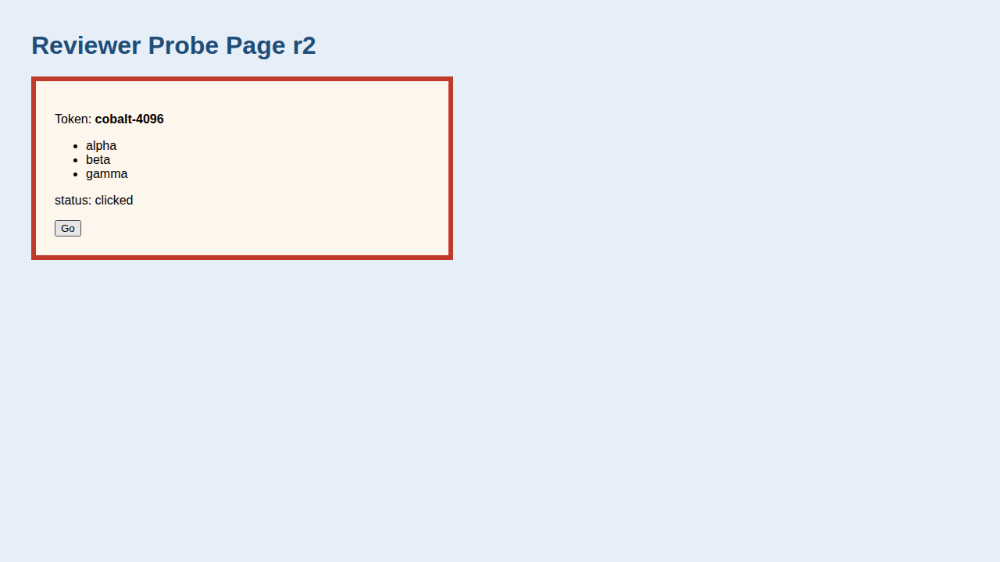
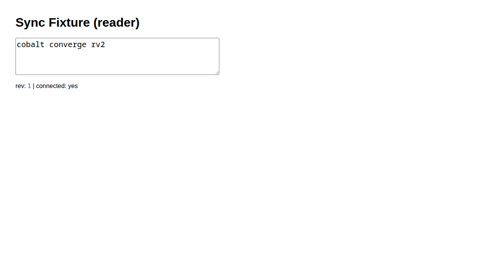

# Review: Browser Delegation Plugin Implementation (impl-2, round 2)

> BLUF: Accept.
> The r1 blocker is fixed. In my own nested dispatches, a two-session poll on a missing selector reported `converged: no, timed out at 11s` with the `TypeError` as last-seen, and a genuine two-session sync reported `converged: yes`.
> I also ran the verbatim poll template against live sessions and stub CLIs. It never passes on errors, on empty output, on a single erroring session, on a dead session, or on an expected-value mismatch.
> The floor passes: a fresh `browser-delegate-review-viewer` session reported `opened`, it did not inherit the stale session's localStorage, and its screenshot shows what the Facts claim.
> r1 items 2-6 are addressed, the worktree is clean with `--ignored`, and no avoided path is touched.
> One residual false-pass path exists only in theory: `2>&1` feeds stderr into the value channel. It needs a constant stderr line on a successful eval, which CLI 0.1.22 never emits. It is non-blocking, along with five other nits.
> review_proof: `confirmed` (the cited artifacts come from delegates this reviewer dispatched this round).

## Summary Assessment

impl-2 answers the r1 review with a fix to the convergence loop's exit-status handling, plus README, Output Format and devlog edits, and it runs the OpenCode build.
The fix is small and correct, and it does what r1 asked: it captures `rc`, treats a nonzero exit or empty output as divergence, uses a first-iteration flag, and adds one prose line.
I re-ran the floor and both convergence checks through a real nested harness from a scratch git repo, then probed the loop's edge cases directly.
The verdict is **Accept**, with non-blocking hardening items.

## Reviewer's Own Floor Re-run

Setup: a scratch git repo on branch `browser-delegate` (`$S/rv2/repo`), my own probe page on `127.0.0.1:18751` (token `cobalt-4096`), and a copy of the SSE relay fixture on `:18752`.
`$S` = `/tmp/claude-1000/-var-home-mjr-code-weft-clauthier-main/63ac45de-462d-4f43-ae1c-4ab6d59049b8/scratchpad`.
Harness: `claude -p --model sonnet --plugin-dir /var/home/mjr/code/weft/clauthier/browser-delegate/plugins/browser-delegate --strict-mcp-config --settings '{"enabledPlugins":{"cdocs@clauthier":false}}' --allowedTools "Agent Bash Read"`, run from `$S/rv2/repo` with `PATH` prefixed by the scratch `@playwright/cli@0.1.22`, and config `$S/cfg/hs1208.json`.
Each init listed `browser-delegate:browser-delegate`, the delegate used only `Bash`, and `$S/dispatch/parse_report.py` returned `VALID` for all three reports.

Before dispatching, I opened two sessions by hand:
- `browser-delegate-preview` (implementer proxy), with `localStorage.implmarker = "impl-was-here"`;
- a stale `browser-delegate-review-viewer`, with `localStorage.stale = "stale-review"`, so that the fresh option had a live session to close.

### f1: floor (fresh, stale session pre-opened), nested session `13004684`, $0.09

```
BROWSER DELEGATE REPORT
Sessions: browser-delegate-review-viewer (role: review-viewer, route: http://127.0.0.1:18751/, opened)
Status: OK
Artifacts: /tmp/claude-1000/browser-delegate/run.ZEOLzy/browser-delegate-review-viewer-panel.png (screenshot)
AE score: n/a
Facts:
- cli: /tmp/claude-1000/-var-home-mjr-code-weft-clauthier-main/63ac45de-462d-4f43-ae1c-4ab6d59049b8/scratchpad/pwcli/node_modules/.bin/playwright-cli (0.1.22, global)
- config: /tmp/claude-1000/-var-home-mjr-code-weft-clauthier-main/63ac45de-462d-4f43-ae1c-4ab6d59049b8/scratchpad/cfg/hs1208.json
- scratch: /tmp/claude-1000/browser-delegate/run.ZEOLzy
- session was live at dispatch start (as browser-delegate-review-viewer); closed first because fresh was requested, then opened
- loaded http://127.0.0.1:18751/: yes (Page Title: Reviewer Probe r2)
- selector #review-panel found: yes (timeout 10000 ms)
- text "Token: cobalt-4096" present: yes
- eval localStorage.getItem('stale'): null
- clicked #go: yes
- text "status: clicked" present: yes
- screenshot (viewport) identify: 1280x720 colors=1405
```

The artifact exists (`ls -l`, 21066 bytes).
The screenshot shows "Reviewer Probe Page r2", the red-bordered `#review-panel`, "Token: **cobalt-4096**", the alpha/beta/gamma list, and "status: clicked" (taken after the click, as ordered).
`stale` read `null`, so the fresh option really replaced the live session rather than reusing it, and the state was correctly reported as `opened`.
After the dispatch, `browser-delegate-preview` still read `"impl-was-here"`.


*Source: `/tmp/claude-1000/browser-delegate/run.ZEOLzy/browser-delegate-review-viewer-panel.png`.*

### m1: r1 blocker re-verification, missing selector in both sessions, nested session `33c390e0`, $0.10

```
BROWSER DELEGATE REPORT
Sessions: browser-delegate-review-sharer (role: review-sharer, route: http://127.0.0.1:18752/?doc=rv2m&role=sharer, opened)
Sessions: browser-delegate-review-sharee (role: review-sharee, route: http://127.0.0.1:18752/?doc=rv2m&role=sharee, opened)
Status: OK
Artifacts: none
AE score: n/a
Facts:
- cli: /tmp/claude-1000/-var-home-mjr-code-weft-clauthier-main/63ac45de-462d-4f43-ae1c-4ab6d59049b8/scratchpad/pwcli/node_modules/.bin/playwright-cli (0.1.22, global)
- config: /tmp/claude-1000/-var-home-mjr-code-weft-clauthier-main/63ac45de-462d-4f43-ae1c-4ab6d59049b8/scratchpad/cfg/hs1208.json
- scratch: /tmp/claude-1000/browser-delegate/run.Dsqjda
- fresh sessions: both were closed first and reported "is not open", then opened. Session names are `<branch>-<role>` with the branch `browser-delegate` and the roles given in the dispatch.
- loaded browser-delegate-review-sharer: yes (Page Title: Sync Fixture)
- loaded browser-delegate-review-sharee: yes (Page Title: Sync Fixture)
- typed #editor "missing selector check" (sharer): yes (the fill command exited 0)
- converged: no, timed out at 11s; last-seen browser-delegate-review-sharer: TypeError: Cannot read properties of null (reading 'value')
- converged: no, timed out at 11s; last-seen browser-delegate-review-sharee: TypeError: Cannot read properties of null (reading 'value')
- poll eval exit status: nonzero (rc=1) in both sessions on every iteration. An eval error never counts as agreement, so the poll could not converge.
```

The transcript shows that the poll script is the new template (`raw=$(...); rc=$?`, `firstiter`, and `[ "$rc" -ne 0 ] || [ -z ... ] && same=0`), run with a 40000 ms Bash timeout.
The relay's `/state?doc=rv2m` read `{"text":"missing selector check","rev":1}`, so the fill landed.
This is exactly the scenario that r1 reproduced as a false `converged after 1s`.

### g1: genuine two-session convergence, nested session `6f28c4e5`, $0.10

```
BROWSER DELEGATE REPORT
Sessions: browser-delegate-review-writer (role: writer, route: http://127.0.0.1:18752/?doc=rv2g&role=writer, opened)
Sessions: browser-delegate-review-reader (role: reader, route: http://127.0.0.1:18752/?doc=rv2g&role=reader, opened)
Status: OK
Artifacts: /tmp/claude-1000/browser-delegate/run.LalArR/browser-delegate-review-reader-viewport.png (screenshot)
AE score: n/a
Facts:
- cli: /tmp/claude-1000/-var-home-mjr-code-weft-clauthier-main/63ac45de-462d-4f43-ae1c-4ab6d59049b8/scratchpad/pwcli/node_modules/.bin/playwright-cli (0.1.22, global)
- config: /tmp/claude-1000/-var-home-mjr-code-weft-clauthier-main/63ac45de-462d-4f43-ae1c-4ab6d59049b8/scratchpad/cfg/hs1208.json
- scratch: /tmp/claude-1000/browser-delegate/run.LalArR
- session names: the `browser-delegate-` prefix comes from the branch name `browser-delegate`, followed by the role `review-writer` or `review-reader`
- fresh close before open: both sessions printed "is not open", then were opened
- loaded browser-delegate-review-writer: yes (Page Title: Sync Fixture)
- loaded browser-delegate-review-reader: yes (Page Title: Sync Fixture)
- typed #editor in writer: yes ("cobalt converge rv2")
- screenshot size: 1280x720 colors=937
- converged: yes after 1s
- last-seen browser-delegate-review-writer: "cobalt converge rv2"
- last-seen browser-delegate-review-reader: "cobalt converge rv2"
```

The transcript has a single `fill`, on the writer, and the poll used `expected='cobalt converge rv2'` with the new loop.
The relay read `{"text":"cobalt converge rv2","rev":1}`.
The reader's screenshot shows "Sync Fixture (reader)" with the editor holding "cobalt converge rv2", rev 1, connected yes, although only the writer typed.
The README's new `Sessions: review-<role>` example (r1 item 4) produced the intended `browser-delegate-review-*` names in both m1 and g1.


*Source: `/tmp/claude-1000/browser-delegate/run.LalArR/browser-delegate-review-reader-viewport.png`.*

### Poll-loop edge cases (direct probe)

I extracted the fenced template verbatim from `agents/browser-delegate.md` and filled its placeholders. I ran it against live g1 sessions, never-opened names, and three stub CLIs (`$S/rv2/probe/`):

| Case | Result | False pass? |
|---|---|---|
| One session, missing selector | `timed out at 5s`, last-seen `TypeError` | no |
| One session, valid value, no expected | `converged after 0s` | trivially true (see item 3) |
| Two sessions, both never opened | `timed out at 3s`, last-seen "is not open" | no |
| One live, one dead | `timed out at 4s` | no |
| Two equal values, expected differs | `timed out at 4s` | no |
| Stub: exit 0, no output | `timed out at 3s`, empty last-seen | no |
| Stub: exit 0, only `### Result` and blank lines | `timed out at 3s` | no |
| `req=900` | prints the `timeout capped` line, `T=570` | n/a |
| `req=10s` (non-integer) | arithmetic error aborts line 2 (`I` unset too), loop never ends until killed, no output | no, but hangs (item 4) |
| Two sessions, `window.nope` | `converged after 1s`, both `"undefined"` | vacuous (item 3) |
| Stub: constant stderr line, stdout values `"1"` vs `"2"` | `converged after 0s`, last-seen = the warning | **yes** (item 1) |

CLI facts behind the table:
- a successful `--raw eval` writes nothing to stderr (0 lines);
- a page-side `TypeError` exits 1 with the stack on **stdout**;
- "is not open" exits 1 on **stdout**.

So every real CLI signal is on stdout, and `2>&1` only lets in outside noise.

Cleanup: I closed all six sessions by name (never `close-all`), and `list` printed `(no browsers)`. Both servers are stopped and ports 18751/18752 are free.

## Section-by-Section Findings

### r1 action items

1. **[blocking] Poll false pass on matching errors: fixed.**
   The diff (`8b4cf7e`) matches r1's recommendation line for line. `[ "$rc" -ne 0 ] || [ -z "${v[$s]}" ] && same=0` parses as `(a || b) && c`, which is correct. `rc=$?` reads the substitution's exit status (the CLI's), because the substitution contains no pipe.
   The new prose line ("An eval error is never agreement ...") is accurate.
   My m1 confirms it end to end, and the probe table confirms it for single-session, dead-session, and empty-output cases.
2. **[non-blocking] `cli` fact shape: fixed.** All three of my reports print `(0.1.22, global)` with no narration.
   Other Facts lines still narrate (m1's last fact, f1's session line); see item 5 below.
3. **[non-blocking] README Pinning attribution: fixed.** The crashes are now attributed to weftwise's `@playwright/mcp` incidents, with "not retested with the CLI" stated.
4. **[non-blocking] README reviewer-naming example: fixed.** It was exercised for real in m1 and g1.
5. **[non-blocking] Devlog forward reference and `color: cyan`: fixed.** Both are in the sub-devlog (Phase 1 item 2, and the deviations NOTE).
6. **[non-blocking] OpenCode build: done by the implementer.**
   The run was `npm ci`, `build:cdocs`, `test:opencode` 8/8, `npm pack --dry-run`, and three greps of the built `reviewer.md` and `iterate/SKILL.md`, after which `node_modules/` and `build/` were removed.
   I did not re-run it, because this reviewer does not install dependencies. The worktree is clean under `--ignored`, which is consistent with the stated cleanup.

### Agent body (impl-2 diff)

No regressions.
The only other body change is the Output Format `cli` wording.
Residual findings, all non-blocking:
- **stderr in the value channel.** `raw=$(... 2>&1)` merges stderr, so a constant stderr line on a successful eval becomes the compared "value". I reproduced a false `converged` with a stub.
  CLI 0.1.22 writes nothing to stderr on success, and Node's own warnings carry a per-process `(node:PID)` prefix, so two sessions would disagree rather than falsely agree. The realistic risk is therefore low.
  The fix costs one token, because every real CLI signal is on stdout: use `2>/dev/null`, or capture stderr to `$out/poll.err` and use it only when `rc` is nonzero.
- **Vacuous agreement.** Without an expected value, two sessions that both return `"undefined"` or `"null"` converge, and a one-session poll converges on any successful eval.
  The report is mechanically accurate (the last-seen values are visible), but a dispatcher skimming `converged: yes` could take it as sync evidence.
  One prose line would close this: "Without an expected value, an expression that returns `undefined`/`null` on absence can agree vacuously; prefer an expected value or an expression that throws."
- **Non-integer timeout hangs.** If the agent substitutes `req=10s`, the arithmetic aborts the rest of that line (including `I=`), the loop never terminates, and the Bash tool kills it with no output.
  This does not produce a false pass, and in practice the delegate substituted integers in every run I saw.
  `req=${req%%[!0-9]*}` or "integer seconds" in the placeholder would make it robust.
- **Piped exit status.** The m1 delegate improvised `fill ... 2>&1|tail -5; echo rc=$?` and then reported "the fill command exited 0". That `rc` belongs to `tail`, so the fact is unsupported, although the fill did land (relay rev 1).
  A body line such as "never pipe a command whose exit status you record; use `${PIPESTATUS[0]}`" would keep exit-status facts honest.
- **Timeout status not specified.** m1 reported `Status: OK` for a timed-out poll, while the implementer's e1 reported `WARNINGS` for the same situation.
  The body does not say which is correct. Defining it (for example, "a timed-out poll is not itself a warning; the `converged: no` fact carries it") would make reports consistent.
- **Role field drift (cosmetic).** g1's `Sessions` lines show `role: writer` for `browser-delegate-review-writer`, while m1 shows `role: review-sharer`. The names are right, but the role field is not stable.

### README (impl-2 diff)

Both edits are accurate and history-agnostic.
The fenced example is minimal and works as written.

### Sub-devlog

The impl-2 section is accurate: I reproduced its CLI-behavior claims (`TypeError` exits 1 on stdout, and `String('')` is non-empty `""`), and both table rows match my independent m1/g1.
The BLUF correctly drops the OpenCode gap and adds the impl-2 line.
The Scratchpoint re-run instructions still work, and I used them to set up this round.
Two minor notes:
- e1/e2 ran with `run.sh`'s default cwd, which is the worktree itself. Hygiene stayed clean, but a scratch repo (as in wA/wB) is the safer default for a delegate that `git -C "$start"`s.
- Per the dispatch instructions, I did not edit the sub-devlog's `last_reviewed`. That update belongs to the overseer.

### Hygiene and scope

- `git -C <worktree> status --short --ignored --untracked-files=all`: empty.
- The scratch repo `$S/rv2/repo` is clean under `--ignored`.
- `git diff --stat 8089d2b..01c37e0` over `scripts/build-opencode*`, `package*.json`, `CLAUDE.md`, `plugins/cdocs/README.md` and OpenCode docs is empty. The impl-2 range touches only the agent body, the plugin README, and the sub-devlog.
- `claude plugin validate plugins/browser-delegate` and `claude plugin validate .` both pass.
- `git merge-tree --write-tree main browser-delegate` merges cleanly against main `06c9260`.

## Verdict

**Accept.**
The blocking false pass is fixed and independently re-verified through a real nested harness, both negatively (m1) and positively (g1).
The floor holds: a fresh review session reported `opened`, it did not inherit stale state, and its screenshot matches its Facts.
The remaining items are hardening and spec-clarity nits.
None of them produces false evidence with the CLI as pinned.

review_proof: **confirmed**. My own fresh `browser-delegate-review-viewer` session reported `opened`, and I cite `/tmp/claude-1000/browser-delegate/run.ZEOLzy/browser-delegate-review-viewer-panel.png` and `/tmp/claude-1000/browser-delegate/run.LalArR/browser-delegate-review-reader-viewport.png`, both produced this round by delegates I dispatched.

## Action Items

1. [non-blocking] In the Convergence template, stop merging stderr into the poll value: `2>/dev/null` (all CLI signals, including errors, are on stdout), or capture stderr separately and use it only when `rc` is nonzero. This closes the last false-pass path, which a stub reproduces.
2. [non-blocking] Add one Actions-section line: never pipe a command whose exit status is reported, or use `${PIPESTATUS[0]}`.
3. [non-blocking] Add one Convergence prose line on vacuous agreement (`"undefined"`/`"null"` and single-session polls without an expected value), recommending an expected value or an expression that throws on absence.
4. [non-blocking] Make the timeout placeholder robust to unit suffixes (`req=${req%%[!0-9]*}`) or state "integer seconds".
5. [non-blocking] Specify the `Status` for a timed-out poll (OK vs WARNINGS), and keep the `Sessions` role field equal to the requested role entry.
6. [non-blocking] Point the Scratchpoint's `run.sh` at a scratch repo cwd by default rather than the worktree.

## Questions for the Maintainer

1. Should the stderr hardening (item 1) land before merge, or as a follow-up?
   - (a) A one-line follow-up commit on this branch before merge, with no new review round (recommended: it is a one-token change in the template, and the m1/g1 behavior is unchanged).
   - (b) Merge as is and track items 1-5 together as a polish follow-up.
   - (c) Treat it as blocking and run an impl-3 round.
2. Should a timed-out poll set `Status: WARNINGS`?
   - (a) No: `Status` reflects capture health, and `converged: no` carries the outcome (recommended: it keeps verdict-like signals out of `Status`).
   - (b) Yes: any unmet poll condition is a warning.
