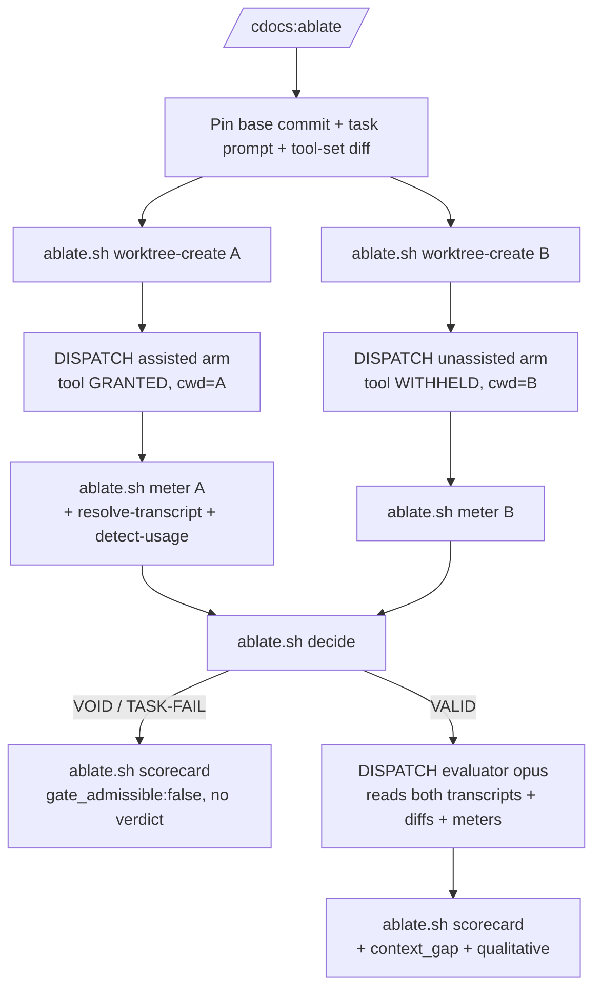

# CDocs Ablate

> BLUF(claude-opus-4-8/cdocs/mcp-ablation): Run the SAME task twice from one pinned base, once WITH a target MCP tool and once WITHOUT, meter each arm, and have an opus evaluator emit a scorecard. If the assisted arm never invoked the tool the run is VOID, never a false "no effect". Single-shot is INDICATIVE-only and never gate-admissible.

An assisted-versus-unassisted ablation that isolates tool access as the ONLY variable between two arms and reports what the tool actually bought.
Parameterized by a target MCP tool and a representative task; graphify is the running example but the harness is tool-agnostic.

Implements [`cdocs/proposals/2026-09-17-mcp-tool-effectiveness-ablation.md`](../../../../cdocs/proposals/2026-09-17-mcp-tool-effectiveness-ablation.md).
Read the proposal for the full rationale; this skill is the operational protocol.

## Overseer discipline (this skill dispatches; it never does an arm's work inline)

The invoking session runs in *overseer mode*: a thin router that pins the base and prompt, DISPATCHES the two arms and the evaluator as subagents, and assembles the scorecard from their returned results.
Before dispatching, invoke `/cdocs:oversee-workstream` (skip if its text is already in context).
The ablation-specific floor:

- Dispatch by default; the overseer never performs an arm's task itself.
  Doing an arm's work inline would both violate overseer thinness AND contaminate the ablation with the overseer's own tokens, destroying the measurement.
- Only the deterministic mechanics run inline, via [`ablate.sh`](./ablate.sh): worktree lifecycle, meter normalization, usage detection, the outcome decision, and scorecard assembly.
  Judgment (the task itself, and the context-gap verdict) lives ONLY in the dispatched subagents.
- Write durable run state (the tool-set diff, the pinned base, per-arm meters) to the run directory at task-unit boundaries.

> NOTE(claude-opus-4-8/cdocs/mcp-ablation): This skill dispatches subagents (the two arms and the evaluator), so run it from a lead with two dispatch layers below it: a top-level session, or a depth-1 agent under the default depth limit.
> Its deferred e2e test runs from a top-level session.

## Invocation

```
/cdocs:ablate --tool <mcp-tool-id> --task <spec-or-path> [--base <commit>] [--trials N] [--run-dir <dir>]
```

- `--tool <target>`: the target capability, in EITHER form:
  - **MCP tool name:** fully qualified as `mcp__<server>__<tool>` (e.g. `mcp__graphify__scope`), or the bare trailing name (`scope`). The usage check matches `tool_use.name`.
  - **CLI-command signature:** `cli:<regex>` (e.g. `cli:graphify `). For a CLI-first tool (its shell-out surfaces as a `Bash` tool_use, `.name == "Bash"`), the usage check matches the regex against the `Bash` tool_use's `.input.command` **at a command boundary**: the command is split at shell separators (`&&`, `||`, `;`, `|`) and the signature is tested per-segment (and against the whole string). So a `^`-anchored `cli:^graphify ` anchors to the real command even when a worktree-bound arm wraps it as `cd <worktree> && graphify …` — the caret matches `graphify`, not the leading `cd`. To exclude an unrelated command, either use the caret form `cli:^graphify ` or the trailing-space bare form `cli:graphify ` (the `graphify-out/` path etc. won't match); both are safe.
- `--task <spec-or-path>`: the representative task, inline or a path to a task-spec file.
  One pinned prompt string is passed VERBATIM to both arms (D4).
- `--base <commit>`: the pinned base commit both arms check out from. Defaults to `HEAD`.
  The committed base is what is tested; uncommitted WIP in the invoking tree is deliberately EXCLUDED (D1).
- `--trials N`: repetitions per arm. **This round ships single-shot only (`N=1`); `--trials>1` (N-trials aggregation) is Phase 3, deferred.**
- `--run-dir <dir>`: where per-arm meters and the scorecard land. Defaults to a timestamped dir under the harness scratchpad.

## Protocol



### Step 0: Pin the invariants (overseer, inline)

Resolve and record, in the run directory, the four held-constant conditions (D4) so the run is auditable:

- the pinned base commit (`git rev-parse <base>`),
- the one task-prompt string (passed verbatim to both arms),
- the base model id (identical for both arms; the evaluator's opus is separate),
- the **tool-set diff**: the exact single entry (`--tool`) that differs between arms, recorded explicitly.

Anything that differs beyond that one tool entry is a confound that invalidates the comparison.

### Step 1: Create the two isolated worktrees (inline, via the helper)

```sh
ABLATE=plugins/cdocs/skills/ablate/ablate.sh
BASE_SHA=$("$ABLATE" worktree-create --base "$BASE" --path "$RUN/arm-A")   # assisted
"$ABLATE" worktree-create --base "$BASE" --path "$RUN/arm-B"               # unassisted
```

Each arm gets its own fresh worktree checked out at the SAME pinned commit (D1): byte-identical starts, genuine filesystem isolation, and NO contact with the shared stash stack.
On a dirty invoking tree the helper refuses by default (it tests the committed base and excludes WIP); pass `--allow-dirty` only when you deliberately want the committed base tested despite local WIP.

### Step 2: Dispatch the two arms (the ONLY difference is tool access, D4)

Dispatch both arms with the SAME task prompt, SAME base model, each bound to its pre-created worktree as its working directory.
The two arms are dispatched with EXPLICIT per-arm tool allowlists that are identical except for exactly the one target entry:

- **Assisted arm:** allowlist = the shared base tool set PLUS the target tool.
- **Unassisted arm:** the SAME allowlist MINUS that one entry; every other tool is identical.

`general-purpose` (a fixed `tools: *` agent type) is NOT dispatchable directly for gating, because `tools: *` grants the target tool to BOTH arms and the withhold is not expressible.
The arms are instead dispatched at the general-purpose CAPABILITY level but with a constructed allowlist: a custom per-arm agent definition, or a per-dispatch tool allowlist, whichever the platform exposes (see "Per-arm single-tool gating" below for the mechanism and the profile-omission fallback).
Each arm rolls out to end of turn and returns its result payload (the harness surfaces `totalTokens`, `totalDurationMs`, `agentId`, `status`).
The arm also reports whether it completed the task, in its own words; the overseer records a `--task-completed true|false` per arm from that report.

> NOTE(claude-opus-4-8/cdocs/mcp-ablation): The arms run against a REAL target tool. For graphify specifically, access is CLI-first (the graphify MCP is shadowed by a lace config over-mount bug), so the "assisted" arm's grant is graphify's CLI availability in-container; see "Phase 4: graphify reference invocation".

### Step 3: Meter each arm + run the usage precondition (inline, via the helper)

For each arm, normalize its result payload into a meter file. For the assisted arm, ALSO resolve its transcript and detect tool invocation:

```sh
# assisted: resolve the arm's own transcript from its agentId, then detect the target tool_use
TX=$("$ABLATE" resolve-transcript --agent-id "$A_AGENT_ID" --session-dir "$SESSION_DIR")
USED=$("$ABLATE" detect-usage --transcript "$TX" --tool "$TOOL")     # "used" | "unused"
"$ABLATE" meter --payload "$RUN/A.payload.json" --arm assisted --tool "$TOOL" \
    --tool-granted true --tool-invoked "$USED" --task-completed "$A_DONE" \
    --transcript "$TX" --diff "$RUN/A.diff" --out "$RUN/arm-assisted.meter.json"

"$ABLATE" meter --payload "$RUN/B.payload.json" --arm unassisted --tool "$TOOL" \
    --tool-granted false --task-completed "$B_DONE" --diff "$RUN/B.diff" \
    --out "$RUN/arm-unassisted.meter.json"
```

**The usage precondition is the honesty gate (D:usage).**
"Invoked" is deterministic: at least one `tool_use` block naming the target tool in the assisted arm's transcript, INCLUDING a call that returned an error (the treatment still occurred).
Invocation is read from the FULL TRANSCRIPT, never from the compact result payload: the payload confirms only `totalTokens`/`totalDurationMs`, not per-tool-call boundaries.

### Step 4: Decide the outcome (inline, via the helper)

```sh
"$ABLATE" decide --assisted "$RUN/arm-assisted.meter.json" \
                 --unassisted "$RUN/arm-unassisted.meter.json" > "$RUN/outcome.json"
```

Exactly one outcome, by PRECEDENCE (VOID always beats TASK-FAIL):

| outcome | condition | scorecard |
|---|---|---|
| **VOID** | assisted arm lacked the tool (`unavailable`) OR had it but never invoked it (`available_unused`) | logged as VOID, NO verdict, never "no effect" |
| **TASK-FAIL** | treatment occurred but one or both arms did not complete | no token-win verdict; the completion asymmetry is the finding |
| **VALID** | both arms completed AND the assisted arm verifiably USED the tool | the ONLY outcome that carries a context-gap verdict |

The precedence is load-bearing: an unused-AND-incomplete assisted arm is VOID (no treatment), not TASK-FAIL.
A VOID or TASK-FAIL run STILL emits a `scorecard.json` (with `gate_admissible:false`), so a consumer always reads an artifact rather than inferring the run's fate from its absence.

### Step 5 (VALID only): Dispatch the evaluator and assemble the scorecard

See "Phase 2: Evaluator + scorecard" below.
On a non-VALID run, skip the evaluator and assemble the scorecard directly from the outcome and meters.

```sh
"$ABLATE" scorecard --outcome "$RUN/outcome.json" \
  --assisted "$RUN/arm-assisted.meter.json" --unassisted "$RUN/arm-unassisted.meter.json" \
  --trials 1 --run-dir "$RUN" [--eval "$RUN/eval.json"]
```

### Step 6: Teardown (inline, via the helper)

Capture each arm's diff first, then remove the worktree with `--force` (the tree is dirty with the arm's work):

```sh
"$ABLATE" worktree-remove --path "$RUN/arm-A" --diff-out "$RUN/A.diff"
"$ABLATE" worktree-remove --path "$RUN/arm-B" --diff-out "$RUN/B.diff"
```

Teardown touches no shared mutable state: no stash, no shared branch.

## Capability spike findings (Phase 1 preconditions)

Two load-bearing preconditions, not yet validated live.

### (a) Per-arm single-tool gating (D4)

**Mechanism the overseer uses:** per-agent tool restriction.
A dispatched agent's available tools are constrained by its agent definition's `tools:` field (a comma-separated allowlist, or `"*"` for all), as the cdocs agents themselves demonstrate (`nit-fix` is `tools: Read, Glob, Grep, Edit`; `judge` excludes Edit/Bash/Task).
The overseer constructs the two arms so their tool sets differ by EXACTLY the one target MCP entry:

- **Assisted arm:** an explicit tool allowlist = the shared base set PLUS the target MCP tool.
- **Unassisted arm:** the SAME explicit allowlist MINUS that one entry.

Building both allowlists explicitly (rather than granting `"*"` and trying to subtract) is the primary mechanism, not a fallback: it makes the one-entry diff exact and auditable, which is what Step 0 records.

> WARN(claude-opus-4-8/cdocs/mcp-ablation): PARTIALLY CONFIRMED.
> Per-agent tool restriction via `tools:` frontmatter is confirmed present in this repo's agents.
> The exact per-DISPATCH grant expression (whether the dispatcher can hand a per-call tool allowlist, or must reference a pre-registered agent definition, and whether a single MCP tool can be named at that granularity vs. a whole MCP server) is not yet confirmed live.
> This is a precondition the overseer's top-level e2e test MUST confirm. Fallback if a single-tool withhold is not cleanly expressible: route the unassisted arm through a profile/agent definition that omits the tool (or the whole server), keeping every other tool identical.

### (b) Per-tool-call transcript visibility (the VOID gate)

**CONFIRMED** by sampling the STRUCTURE (keys only) of existing on-disk transcripts:

- A dispatched agent's transcript is written to `<project-session-dir>/subagents/agent-<agentId-prefix>*.jsonl`, carrying `isSidechain: true`.
- Assistant messages expose `tool_use` blocks with keys `id, input, name, type`.
- MCP tools appear in `.name` as `mcp__<server>__<tool>` (sampled real example: `mcp__playwright__browser_click`).
- A CLI-first tool's shell-out surfaces as a `Bash` tool_use, its invocation in `.input.command` (not in `.name`, which is `"Bash"`); `ablate.sh detect-usage --tool cli:<regex>` matches that command.
- The Task result payload (`toolUseResult`) carries `agentId`, which resolves the transcript file (via `ablate.sh resolve-transcript`).

So the VOID gate reads the assisted arm's transcript and matches the target against `tool_use.name` (MCP) or `.input.command` (CLI): this is `ablate.sh detect-usage`, no sentinel needed for either.
The sentinel-marker fallback (instruct the arm to emit a marker after any target-tool use) is documented in the proposal but is NOT required, since direct detection works for both MCP-name and CLI-command tools.

> NOTE(claude-opus-4-8/cdocs/mcp-ablation): The metering field names differ from the proposal's placeholders.
> The real Claude Code result payload surfaces `toolUseResult.totalTokens` and `toolUseResult.totalDurationMs` (plus `usage`, `agentId`, `status`, `totalToolUseCount`), NOT `subagent_tokens`/`duration_ms`.
> `ablate.sh meter` reads the real names and aliases the placeholders for safety.
> The overseer's e2e test must confirm this payload shape reaches the dispatcher in exactly this nesting (it is confirmed here only from persisted transcripts, not from a live dispatch return).

## Phase 2: Evaluator + scorecard

On a VALID run, dispatch ONE evaluator subagent on opus (D5: judgment-heavy; a consumer model floor wins if stricter).
The evaluator reads both arms' transcripts, both diffs, and both meter files, and returns a JSON contribution the overseer writes to `eval.json`:

```json
{
  "context_gap": <signed integer in [-10, +10]>,
  "qualitative": "<prose assessment of what the tool did or did not do for this task>",
  "per_arm_read": { "A": "<read before reveal>", "B": "<read before reveal>" },
  "divergent_paths": <true|false>
}
```

**Axis discipline (carried onto the machine artifact by `ablate.sh scorecard`):**

- **Context gap** is the PRIMARY CAUSAL axis: a signed integer in `[-10,+10]` scored on the fixed rubric (D5).
  `+10` = the tool surfaced load-bearing information the unassisted arm demonstrably missed; `-10` = the tool result confused the agent or cost it context; `0` = no discernible effect on the agent's information state.
- **Token delta** is CORROBORATING magnitude only: metered cleanly, but a JOINT measure of tool effect plus path variance that does not attribute cause.
- **Wallclock delta** is INDICATIVE only: model-latency variance dominates; never the sole basis for a verdict.
- A verdict NEVER rests on a token or wallclock delta alone.

**Partial blinding (D5), honestly labeled.**
The meter files label the arms neutrally (A/B); the evaluator records its per-arm read BEFORE it is told which arm is assisted.
This is close to ceremonial: the discriminating feature (the tool calls) sits in the very transcript the evaluator reads, so it can infer arm identity trivially.
It is retained as a cheap up-front anchor, not real blinding; the scorecard states that the assisted arm is identifiable by its tool calls.
Because two full transcripts plus two diffs plus two meters is a large context, the evaluator works over pointed excerpts against the fixed rubric, or a summarization pre-pass, rather than ingesting raw transcripts whole.

**Artifacts (D7), under the run directory:**

- `arm-assisted.meter.json`, `arm-unassisted.meter.json`: tokens, `duration_ms` (indicative), tool-set grant, transcript/diff pointers, and the assisted arm's `tool_invocation_confirmed` flag.
- `scorecard.json`: `outcome`, `void_reason`, `context_gap` (primary, VALID-only), `token_delta` and `wallclock_delta` (corroborating; wallclock indicative), `trials`, `spread` (Phase 3), and `gate_admissible`.
- `scorecard.md`: human summary, leading with the outcome and the caveat, then the qualitative read.

**Single-shot admissibility guard (D3/D7), enforced on the MACHINE artifact.**
`ablate.sh scorecard` sets `gate_admissible = (outcome == VALID AND trials > 1)`.
A single-shot run (`trials == 1`) is INDICATIVE-only and sets `gate_admissible: false`, always, and carries a loud caveat.
A downstream gate MUST check `gate_admissible` and refuse a non-admissible scorecard, so a noisy one-draw A/B pair can never silently become a pass/fail gate verdict.

## Phase 3: N-trials aggregation (DEFERRED)

> NOTE(claude-opus-4-8/cdocs/mcp-ablation): Deferred to a follow-up iterate session.
> Phase 3 runs `--trials N` (default 3) per arm, aggregates token and wallclock as median-plus-spread, reports the spread as a signal, flags sign-unstable small deltas as within-noise, and is the FIRST configuration that may set `gate_admissible: true`.
> The `trials` and `spread` fields already exist in the scorecard schema so Phase 3 slots in without a schema change.

## Phase 4: graphify reference invocation (the tool-agnostic example)

The reference wiring: graphify as the target tool on graphify's canonical win case, a "what does this change touch" context-gathering task.

Because graphify is CLI-first in-container (its MCP is shadowed by the lace over-mount bug), the target is expressed as a `cli:` signature, not an `mcp__` name:

```
/cdocs:ablate \
  --tool 'cli:graphify ' \
  --task "Enumerate every file, symbol, and doc the change to <module X> touches, and summarize the blast radius." \
  --base HEAD
```

`ablate.sh detect-usage --tool 'cli:graphify '` matches the regex against a `Bash` tool_use's `.input.command`, so the usage gate has a REAL signal for graphify (no sentinel needed).
The signature is tested at a command boundary (the command is split at `&&`/`||`/`;`/`|` and matched per-segment), so a `^`-anchored `cli:^graphify ` anchors to the real command even when a worktree-bound arm wraps it as `cd <worktree> && graphify …` — it no longer matches the leading `cd`. Use `cli:^graphify ` to require graphify at a command start, `cli:graphify (update|scope)` to restrict subcommands, or the bare trailing-space `cli:graphify ` (excludes `graphify-out/`-style path substrings); all are safe.

Expected, on a coherent run:

1. **VALID:** the assisted arm actually invokes graphify (its transcript carries a `Bash` `tool_use` whose command matches the `cli:` signature), both arms complete, so a context-gap verdict is admissible.
2. **The token axis is populated** from the assisted and unassisted `totalTokens`, reported as a corroborating delta (graphify's claim is that scoping cuts context-gathering burn; the token delta corroborates magnitude, the context gap attributes cause).
3. **The honesty path:** point graphify at a task that does not need it (present-but-unused) and the run reports VOID (`available_unused`), NOT a false "graphify had no effect".

> NOTE(claude-opus-4-8/cdocs/mcp-ablation): graphify is exercised CLI-first in-container: its MCP is shadowed by a lace config over-mount bug, so the "assisted" grant in practice is graphify's CLI availability in the arm's container, while the tool-agnostic abstraction (the arm either has or lacks the capability) is unchanged.
> The usage check for a CLI-shaped tool matches the `cli:<regex>` signature against a `Bash` tool_use's `.input.command` (its `.name` is just `"Bash"`), which `ablate.sh detect-usage` supports directly, so no sentinel marker is needed.
> This is the one place the "MCP tool" abstraction meets a CLI reality; the harness still measures "capability granted vs withheld".

The graphify proposal ([`cdocs/proposals/2026-09-17-graphify-cdocs-integration.md`](../../../../cdocs/proposals/2026-09-17-graphify-cdocs-integration.md)) can CONSUME this `scorecard.json` for its own token/recall gates, checking `gate_admissible` first; this skill does not re-spec graphify's internals.

> WARN(claude-opus-4-8/cdocs/mcp-ablation): This Phase-4 wiring is DOCUMENTED, not yet run live.
> The live graphify dogfood (a VALID scorecard end to end plus the VOID honesty path) is the overseer's top-level e2e test in a lace devcontainer with real graphify.

## Deferred to the top-level e2e test

These are not yet run live, and are deferred to a top-level overseer run:

- The live three-subagent dispatch (two arms + evaluator) on a real target tool.
- Confirming precondition (a)'s exact per-dispatch single-tool grant expression, with the profile/omission fallback if a single-tool withhold is not cleanly expressible.
- Confirming the live result-payload nesting reaches the dispatcher as `toolUseResult.totalTokens`/`totalDurationMs`.
- The graphify dogfood, blocked on its container: VALID scorecard end to end, and the present-but-unused VOID honesty path, in a container with real (CLI-first) graphify.

## Links

- Proposal: [`cdocs/proposals/2026-09-17-mcp-tool-effectiveness-ablation.md`](../../../../cdocs/proposals/2026-09-17-mcp-tool-effectiveness-ablation.md).
- Helper script: [`ablate.sh`](./ablate.sh). Unit tests: [`test-ablate.sh`](./test-ablate.sh).
- Overseer discipline: `/cdocs:oversee-workstream`.
- Workflow patterns: "CDocs Workflow Patterns".
