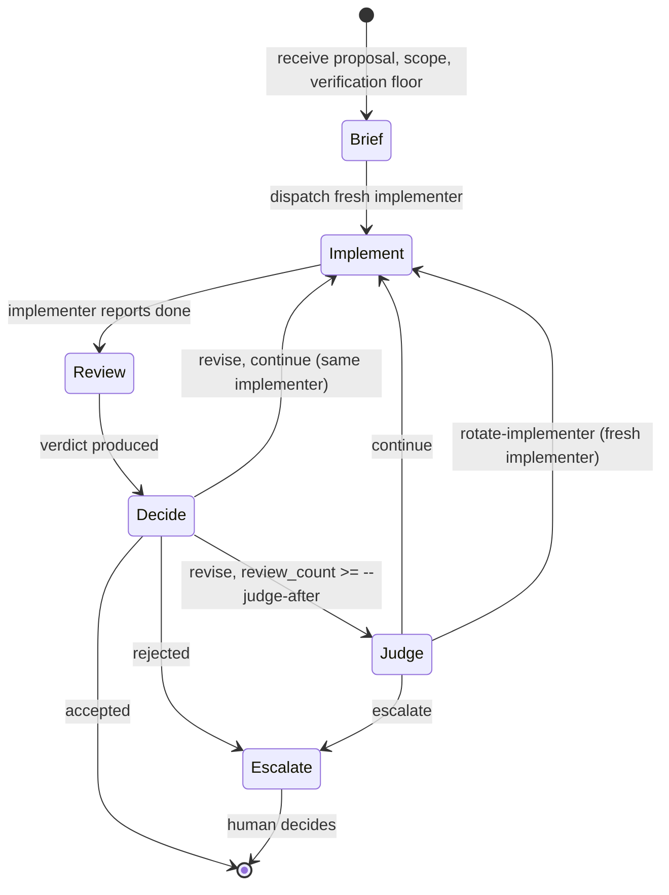

# CDocs Iterate

Run an iterative implement-review loop scoped to a proposal, a phase, or any unit the overseer chooses.
The invoking session agent enters *overseer mode* and restricts itself to orchestration: it dispatches fresh subagents in alternation, judges their output, periodically dispatches a judge subagent to assess loop health, and terminates on accept-or-escalate.

> NOTE(opus/cdocs/iterate-skill): The overseer is a behavioral mode the top-level session agent enters when invoking this skill.
> The human user is the supervisor: they invoke the skill and receive escalations; the agent runs the loop.

## Invocation

```
/cdocs:iterate <proposal_path> [--verification-floor "<sentence>"] [--judge-after N]
```

- `<proposal_path>` is required; the proposal should have `status: implementation_ready` (warn but proceed otherwise).
  The overseer states the scope (full proposal, phase N, a subset) in Turn 0's Brief.
- `--verification-floor "<sentence>"`: a one-sentence floor including at least one failure-picture.
  If omitted and the proposal lacks a concrete `## Verification Methodology`, `AskUserQuestion` blocks the loop until provided.
  AFK fallback: write a placeholder floor and tag affected rows `[placeholder-floor]`, with a `> WARN` callout on the final summary.
- `--judge-after N` defaults to 3; the judge runs from the Nth Revise verdict onward, and the overseer may invoke earlier at its discretion.

## Roles

- **Overseer**: top-level agent, restricted to orchestration; owns dispatch, freshness, termination.
- **Implementer**: fresh `general-purpose` subagent dispatched with `/cdocs:implement --dispatched`; executes the proposal and self-verifies before reporting done.
- **Reviewer**: fresh `cdocs:reviewer` subagent each iteration; reads the implementer's output with fresh context, inspects the live system, produces a review document with a verdict.
- **Judge**: fresh `cdocs:judge` subagent invoked to assess loop *meta-health*; reads the iteration log and recent reviews, not source. Returns `{continue, rotate-implementer, escalate}` with a short rationale.

## Loop Protocol



### Turn 0 (Brief)

Read the proposal and any handoff devlog once.
State scope and verification floor explicitly.
Create or append to a devlog with "Iteration Log" and empty "Judge Log" sections from `./template.md`.
Prefer appending to the most recent devlog whose `task_list` matches the proposal's; otherwise create a new one and record the choice.

### Turn N.a (Implement)

Dispatch the implementer via Task with `subagent_type: "general-purpose"` and a prompt that follows `/cdocs:implement --dispatched` conventions, including:

- The proposal path and goals for this iterate session (scope, verification floor, prior review path if any).
- Whether commit authority rests with the implementer (the default) or the overseer.

`--dispatched` mode suppresses subagent dispatch and routes investigation requests back to the overseer via `## Investigation Requested` blocks; see `/cdocs:implement` Invocation Modes for the schema.

### Turn N.b (Review)

Dispatch a *new* reviewer subagent (never the previous one) with `subagent_type: "reviewer"`.
The reviewer inspects the live system rather than only the diff and produces a review document with a verdict.
For verification floors that require empirical evidence (browser, dev server, integration, end-to-end, live behavior), the reviewer empirically re-runs the floor and cites at least one artifact path in the review, inlining excerpts for ephemeral artifacts.
This citation is what makes a `confirmed` row admissible.

### Turn N.c (Decide)

Read the review and branch on the verdict:

- **Accept**: terminate. Update proposal frontmatter per `/cdocs:implement` conventions; write the final devlog entry.
- **Reject**: escalate immediately. Reject pre-empts the judge path even if `review_count >= --judge-after`.
- **Revise**, `review_count < --judge-after`: loop to Turn (N+1).a with the same implementer.
- **Revise**, `review_count >= --judge-after`: dispatch the judge before the next implementer turn.

The overseer may invoke the judge earlier on suspicion of trouble (high uncertainty, structural concerns, near-identical commits); discretionary invocations are logged with `trigger: discretionary`.

### Turn N.d (Judge)

Dispatch a fresh judge with the iteration log and the recent review paths.
The judge returns `continue`, `rotate-implementer`, or `escalate` with a rationale (inline for one or two sentences; longer rationales go to `cdocs/devlogs/_judge/` with the path in `judge_path`).
Append a Judge Log row.

## Termination

The loop terminates on Accept, Reject, judge `escalate`, or user interrupt.
No retry-count cap on Accept-bound progress: a patient overseer is bounded by review-signal quality and judge meta-assessment.

## Iteration Log and Judge Log

Two tables live in the devlog body (not in frontmatter); copy them from `./template.md` on Turn 0.

The Iteration Log carries a `review_proof` column with one of `confirmed`, `n/a`, `deferred-to-followup`, or `skipped`:

- `confirmed`: the reviewer empirically re-verified the work and cited at least one artifact in the review; ephemeral artifacts have excerpts inlined. Re-citing a prior round's artifact does not justify `confirmed`; the row rests on evidence the round-N reviewer produced.
- `n/a`: the verification floor does not require empirical browser/runtime evidence. Floors that mention browser, dev server, integration, end-to-end, or live behavior cannot be `n/a`.
- `deferred-to-followup`: self-referential changes (e.g., to `/cdocs:iterate` itself) whose smoke test runs as a separate top-level invocation. The `notes` column points at where the deferred verification will be recorded.
- `skipped`: fail-loud. The overseer justifies it in `notes` or in `### Overseer synthesis` before Accept.

The overseer assigns the value per row; the reviewer produces the evidence that makes `confirmed` admissible.

The iteration log is the durable resumption point: a fresh overseer reading only the devlog can reconstruct iteration count, current implementer handle, and pending review verdict.
Write a final row before yielding so an interrupted loop never leaves the log half-populated.

## Conventions

### Freshness disciplines

Reviewers are fresh every iteration.
The judge is fresh every invocation.
Implementers are fresh only when the judge says `rotate-implementer`: an implementer mid-task carries valuable context and is not replaced reflexively.

### The judge is a meta-reviewer

The reviewer judges the work; the judge judges the loop.
A short rationale is mandatory: the verdict alone is not auditable.

### Sandboxed-runtime trust posture

The reviewer runs with full tools backed by written-instruction constraints; this assumes a sandboxed (container or equivalent) runtime.
See [`reviewer.md`](../../agents/reviewer.md) for the boundaries.
