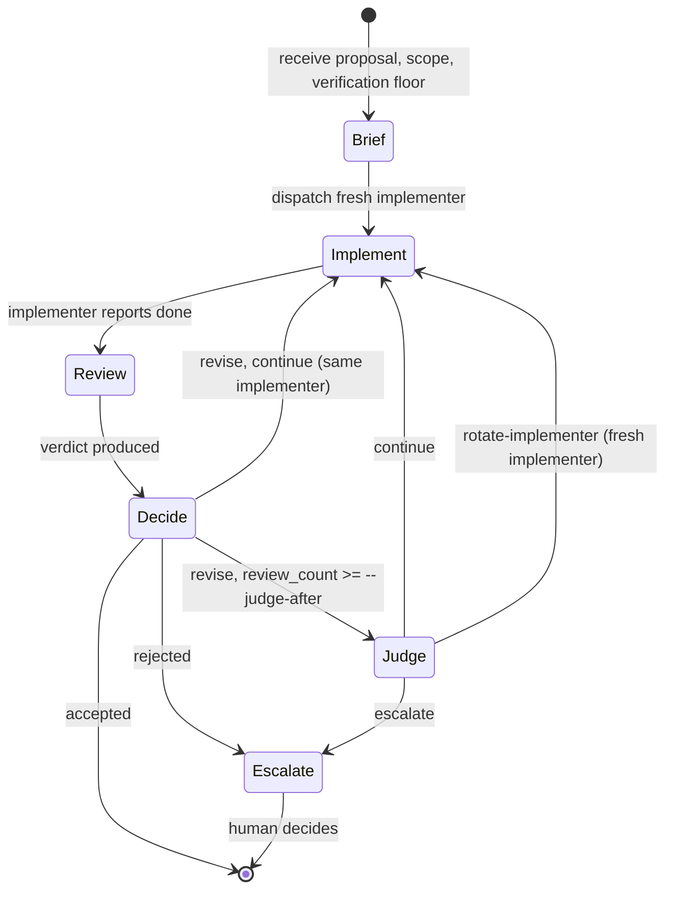

# CDocs Iterate Loop

Run an iterative implement-review loop scoped to a proposal, a phase, or any unit specified using /cdocs:implement and /cdocs:review subagents,
The invoking session agent enters *overseer mode* and restricts itself to orchestration:
it dispatches fresh subagents in alternation, judges their output, periodically dispatches a judge subagent to assess loop health, and terminates on accept-or-escalate.

The overseer discipline (thin lead, dispatch-by-default, single-writer file ownership, on-resume liveness reconciliation) is defined canonically in [`orchestration-discipline.md`](../../rules/orchestration-discipline.md); this skill references it rather than restating it.
Inline floor: dispatch by default for all tasks beyond trivial few-liners (single-line edits, one-off checks); write durable state to the Iteration Log and a Completed/Decisions Made/Open Todos handoff before compacting; use a fresh reviewer every iteration and a fresh judge every invocation.
Worktree/filesystem isolation binds the dispatched implementer and reviewer, never this overseer session, which stays free to land, resolve, and fork; the principle is canonical in [`orchestration-discipline.md`](../../rules/orchestration-discipline.md) "Isolation is a dispatched-agent property".
The overseer should feel empowered to ask the user multi-choice questions for feedback and guidance unless otherwise strongly stated.
The human user is the supervisor: they invoke the skill and receive escalations; the agent runs the loop.

Code and cdocs should be committed early and often.

## Invocation

```
/cdocs:iterate <proposal_path> [--verification-floor "<sentence>"] [--judge-after N]
```

- `<proposal_path>` is required; the proposal should have `status: implementation_ready` (warn but proceed otherwise).
  The overseer states the scope (full proposal, phase N, a subset) in Turn 0's Brief.
- `--verification-floor "<sentence>"`: a one-sentence floor including at least one failure-picture.
  If omitted and the proposal lacks a concrete `## Verification Methodology`, `AskUserQuestion` blocks the loop until provided.
  AFK fallback: write a placeholder floor and tag affected rows `[placeholder-floor]`, with a `> WARN` callout on the final summary.
- `--judge-after N` defaults to 3; the judge runs from the Nth Revise verdict onward, and the overseer may invoke earlier at its discretion.
- `-m | --model "<model_description"`: Which model & config to have implementation and review rounds done with.
  Defaults to preferred model in CLAUDE.md or elsewhere, or the current session's config if none is specified.
- `-f | --first-round ["<model_description"]`: Use a different model config for the first round implementation and review.
  If this flag is passed without a value, any preferred expert expensive model in CLAUDE.md or elsewhere is used.
  If no such preference exists, the overseer selects an appropriate larger model+config, like fable to lead an opus loop (a common pattern).
  For default tier guidance (opus lead/judgment, sonnet search/explore, haiku mechanical; consumer floor wins), see [`model-tiering.md`](../../rules/model-tiering.md).
- `--graphify-scope`: opt into priming a graphify-resolved dependent-set brief into the reviewer's dispatch (see "Graphify scoping" below).
  DEFAULT OFF: with the flag absent the loop behaves exactly as today and makes zero graphify calls.

## Graphify scoping (flag-gated, reviewer only, default OFF)

When `--graphify-scope` is passed, the overseer primes a compact graph-resolved dependent-set brief into the reviewer's dispatch prompt up front, so the reviewer starts from the change's true MULTI-FILE dependent set instead of a speculative read sweep.
This is deliberately minimal: prime a brief + point the reviewer at the graphify CLI. It is currently wired for the REVIEWER role only (the RFP's original consumer); implementer and judge are out of scope for this increment.

At **Turn N.b (Review)**, before dispatching the reviewer, and ONLY when the flag is on, the overseer runs the helper against the round's changed files:

```
plugins/cdocs/scripts/graphify-scope.sh brief --enable --diff-base <base-ref>
```

- If the first line is `SCOPE-STATUS: scoped`, the overseer pastes the brief VERBATIM into the reviewer's dispatch prompt under a "Graphify scoped-context brief" heading, and the reviewer treats it per [`reviewer.md`](../../agents/reviewer.md) (an AID, never a completeness guarantee).
- If the first line is `SCOPE-STATUS: skip-scope` or `disabled` (missing/stale index, missing graphify binary, engine error, or an empty/near-empty set), the round is a fallback round: the overseer primes NO brief and the reviewer runs today's unscoped sweep. Note the labeled status in the Iteration Log `notes` (e.g. `[graphify: skip-scope missing-index]`) so instrumentation can tell scoped rounds from fallback rounds.

The helper is ADDITIVE ONLY: it can only ever ADD context to a round, never narrow it, so its absence or any fallback never lowers recall below the current baseline.
The overseer never blocks a round on scoping.
Flag off = no helper call at all.

## Roles

- **Overseer**: top-level agent, restricted to orchestration; owns dispatch, freshness, termination.
- **Implementer**: fresh `cdocs:implementer` subagent dispatched with `/cdocs:implement --dispatched`; executes the proposal and self-verifies before reporting done.
- **Reviewer**: fresh `cdocs:reviewer` subagent each iteration; reads the implementer's output with fresh context, inspects the live system, produces a review document with a verdict.
- **Judge**: fresh `cdocs:judge` subagent invoked to assess loop *meta-health*; reads the iteration log and recent reviews, not source. Returns `{continue, rotate-implementer, escalate}` with a short rationale.

## Loop Protocol


```mermaid
stateDiagram-v2
    [*] --> Brief: receive proposal, scope, verification floor
    Brief --> Implement: dispatch fresh implementer
    Implement --> Review: implementer reports done
    Review --> Decide: verdict produced
    Decide --> Implement: revise, continue (same implementer)
    Decide --> Judge: revise, review_count >= --judge-after
    Decide --> [*]: accepted
    Decide --> Escalate: rejected
    Judge --> Implement: continue
    Judge --> Implement: rotate-implementer (fresh implementer)
    Judge --> Escalate: escalate
    Escalate --> [*]: human decides
```

### Turn 0 (Brief)

Read the proposal and any handoff devlog once.
State scope and verification floor explicitly.
Create or append to a devlog, copying all four table sections from `./template.md`: the Iteration Log, the (empty) Judge Log, the Dispatch/Return Events table, and the (empty) Steering Log.
Prefer appending to the most recent devlog whose `task_list` matches the proposal's; otherwise create a new one and record the choice.

### Turn N.a (Implement)

Dispatch the implementer via Task with `subagent_type: "cdocs:implementer"` and a prompt that follows `/cdocs:implement --dispatched` conventions, including the proposal path and goals for this iterate session (scope, verification floor, prior review path if any).

`--dispatched` mode suppresses subagent dispatch and routes investigation requests back to the overseer via `## Investigation Requested` blocks; see `/cdocs:implement` Invocation Modes for the schema.

Append a `dispatch` row to the Dispatch/Return Events table when a child (implementer, reviewer, judge, or fork) is dispatched, naming the files it may claim, and a matching `return` row when it reports done.
These rows are what the on-resume reconciliation reads, so the write is not optional: an unpopulated table leaves a resumed overseer nothing to reconcile against.

### Turn N.b (Review)

Dispatch a *new* reviewer subagent (never the previous one) with `subagent_type: "reviewer"`.
The reviewer inspects the live system rather than only the diff and produces a review document with a verdict.
For verification floors that require empirical evidence (browser, dev server, integration, end-to-end, live behavior), the reviewer empirically re-runs the floor and cites at least one artifact path in the review, inlining excerpts for ephemeral artifacts.
This citation is what makes a `confirmed` row admissible.

### Turn N.c (Decide)

Read the review and branch on the verdict:

- **Accept**: terminate. Update proposal frontmatter per `/cdocs:implement` conventions; write the final devlog entry, then run the Checkpoint (below).
  If landing the accepted work is a cross-worktree step (a merge into `main`, or a fork off `main`), the overseer is NOT isolation-bound: it surfaces that step as an explicit precondition up front and ROUTES it to the consuming repo's cross-worktree commands (e.g. in weftwise: `/resolve-wt`, `/dogfood-wt`, `/worktree`), warning never refusing. See the "Isolation is a dispatched-agent property" section (Isolation-aware routing) of [`orchestration-discipline.md`](../../rules/orchestration-discipline.md).
- **Reject**: escalate immediately. Reject pre-empts the judge path even if `review_count >= --judge-after`.
- **Revise**, `review_count < --judge-after`: loop to Turn (N+1).a with the same implementer.
- **Revise**, `review_count >= --judge-after`: dispatch the judge before the next implementer turn.

The overseer may invoke the judge earlier on suspicion of trouble (high uncertainty, structural concerns, near-identical commits); discretionary invocations are logged with `trigger: discretionary`.

### Turn N.d (Judge)

Dispatch a fresh judge with the iteration log and the recent review paths.
The judge returns `continue`, `rotate-implementer`, or `escalate` with a rationale (inline for one or two sentences; longer rationales go to `cdocs/devlogs/_judge/` with the path in `judge_path`).
Append a Judge Log row, then run the Checkpoint (below).

### Checkpoint (handoff-before-compact)

The checkpoint fires at each judge assessment (Turn N.d) and on Accept (Turn N.c Accept branch), and proactively after every 3 to 5 iterations at a task-unit boundary.
Write the handoff into the devlog first, THEN compact (`/compact`, or `/clear` for a hard reset).
The handoff is the three-subsection Completed / Decisions Made / Open Todos section defined in [`orchestration-discipline.md`](../../rules/orchestration-discipline.md) Pillar 2; do not restate the format here.
The checkpoint is not complete until the handoff is written: compacting without it is a failure, because the hand-written handoff is more complete than auto-compaction's lossy summary.

## Termination

The loop terminates on Accept, Reject, judge `escalate`, or user interrupt.
No retry-count cap on Accept-bound progress: a patient overseer is bounded by review-signal quality and judge meta-assessment.

A `pause` steering directive (see "Injection points") is NOT a fourth loop-terminal verdict: it suspends turn advancement without invoking Accept, Reject, or the judge, and makes no claim about the work's quality.
On a `pause` the overseer finishes the turn in flight, writes its Iteration Log or Judge Log row as it otherwise would, and yields with a resumable closing note; it does not touch the Accept/Reject/Escalate taxonomy.

A soft context-budget signal is a JUDGE INPUT weighed against progress, never a hard kill.
Overseer context trending past the ~150K target, a run of inline-work turns, or excessive loop length is surfaced by the overseer to the judge, which weighs it against forward progress; it does not itself terminate the loop.
This preserves the accept/reject/escalate/interrupt contract: the soft budget informs a verdict, it never overrides one.

## Injection points

The overseer already pauses between turns: it dispatches one subagent, waits for it to report, then decides. These existing pauses are the only injection points for human steering; no new interrupt machinery is introduced.

The concrete point where the overseer consults the Steering Log is **Turn N.c (Decide)** — its own reasoning turn between Review and the next dispatch, where it already reads the verdict and branches. After Turn N.b (Review) resolves, the overseer at Turn N.c consults the Steering Log before the next dispatch (Turn (N+1).a, or Turn N.d if the judge threshold fired). After Turn N.d (Judge) resolves it consults the Steering Log again before Turn (N+1).a — this is the post-judge dispatch boundary, not a second Decide turn, since the judge verdict branches directly to the next dispatch with no named Decide turn after it.

A user message that arrives while a subagent is actively dispatched (mid Task call) is **queued, not injected**: the overseer never interrupts or reinjects into an in-flight subagent, since that would breach the same freshness/isolation invariant the DISPATCHED reviewer and judge are built on (isolation binds the dispatched subagent, not the overseer session; see [`orchestration-discipline.md`](../../rules/orchestration-discipline.md) "Isolation is a dispatched-agent property"). The queued message is applied at the next injection point instead.

Directives are recorded in the devlog's `## Steering Log` table (see `./template.md`). The overseer appends a row the moment it notices the directive (even if application is deferred) and updates `applied_at_iteration` when it actually folds the content into a dispatch. The five `kind` values and their handling:

- `steer-implementer`: at the next injection point, include the row's `content` verbatim in the next implementer's dispatch prompt as additional Brief context (not a rewrite of the proposal).
- `steer-reviewer-floor`: the row's `content` replaces the active verification floor for the next Review turn onward. Prior Iteration Log rows keep their already-recorded `review_proof` value — per the history-agnostic convention a floor change does not retroactively invalidate past `confirmed` rows.
- `pause`: the overseer finishes the turn in flight (writing its Iteration Log or Judge Log row as it would have anyway), then writes a closing devlog note naming the resumption point (e.g. "Turn 4.a, impl-2 continues") plus a pointer to any `pending` Steering Log rows, and stops WITHOUT invoking Accept, Reject, or the judge. This extends the existing "write a final row before yielding" resumption discipline from crash-driven to deliberate interruption; see "Termination".
- `resume` (possibly a fresh overseer session): re-read the Iteration Log, Judge Log, and Steering Log, reconstruct the resumption point from the closing note, re-queue any `pending` Steering Log directives (the Steering Log, not the closing note, is the source of truth for pending directives), and continue from there.
- `override-judge`: a human explicitly instructs the overseer to continue past a judge `escalate` verdict. The Judge Log row is NEVER edited — the judge's assessment stays a legible record even when overridden. The next Iteration Log row's `notes` column cross-references the override (e.g. `[user-override: see Steering Log <at>]`) so the audit trail shows a human, not the judge, authorized continuation.

Overriding a terminal Accept or Reject verdict is out of scope: those are Decide-turn verdicts the overseer acts on directly (loop termination), materially different from overriding an in-progress judge assessment.

## On-Resume Reconciliation

Before acting on a resumed loop, reconstruct child-dispatch liveness from the Iteration Log's Dispatch/Return Events rows, not from in-window belief.
The harness notifies the overseer only when NO live children remain, so a session resumed mid-interruption can hold a stale "child in flight" belief.
If you believe a child (implementer, reviewer, or judge) is in flight but the harness has returned control (no live children remain), that child has terminated: inspect its on-disk artifacts (its review file, the devlog, committed work) and proceed from the actual state rather than waiting on a child that is already gone.
Likewise, before dispatching a writer against a path, check the event rows for an open ownership claim by another live agent and serialize or re-scope rather than dispatch a second concurrent writer.
See [`orchestration-discipline.md`](../../rules/orchestration-discipline.md) Pillar 1b for the full liveness-reconciliation and single-writer-ownership disciplines.

A fresh overseer resuming a paused loop also re-reads the Steering Log and re-queues any row whose `applied_at_iteration` is `pending` (a directive noticed but not yet folded into a dispatch), applying it at the next injection point (see "Injection points"). The Steering Log, not the pause closing note, is the source of truth for pending directives, so a `pause` interrupted mid-directive never silently drops it.

## Iteration Log and Judge Log

Four tables live in the devlog body (not in frontmatter); copy them from `./template.md` on Turn 0: the Iteration Log, the Judge Log, the Dispatch/Return Events table, and the Steering Log (see "Injection points" for the Steering Log's role).

The Iteration Log carries two additive thinness columns for overseer-context legibility: `overseer_ctx_est` (an approximate current-context estimate, e.g. "~150K (30% inline)") and `inline_work` (a yes/no flag for whether the overseer did inline work this turn).
The overseer writes these each row; the judge reads them to key `escalate` and writes its own `overseer_thinness` verdict (`clean`/`bloat_detected`/`signal_missing`) in the Judge Log.
Absent the overseer columns, the judge logs `signal_missing`, so the checkpoint is enforceable rather than only inferable from prose.
See [`orchestration-discipline.md`](../../rules/orchestration-discipline.md) "Judge-Observable Thinness Signal."

The Dispatch/Return Events table records each child dispatch and return (with the target files it claims) so a resumed overseer can reconcile liveness and file-ownership from the log rather than from in-window belief (see "On-Resume Reconciliation" above).

The Iteration Log carries a `review_proof` column with one of `confirmed`, `n/a`, `deferred-to-followup`, or `skipped`:

- `confirmed`: the reviewer empirically re-verified the work and cited at least one artifact in the review; ephemeral artifacts have excerpts inlined.
  Re-citing a prior round's artifact does not justify `confirmed`; the row rests on evidence the round-N reviewer produced.
- `n/a`: the verification floor does not require empirical browser/runtime evidence. Floors that mention browser, dev server, integration, end-to-end, or live behavior cannot be `n/a`.
- `deferred-to-followup`: self-referential changes (e.g., to `/cdocs:iterate` itself) whose smoke test runs as a separate top-level invocation. The `notes` column points at where the deferred verification will be recorded.
- `skipped`: fail-loud. The overseer justifies it in `notes` or in `### Overseer synthesis` before Accept.

The overseer assigns the value per row; the reviewer produces the evidence that makes `confirmed` admissible.

The iteration log is the durable resumption point: a fresh overseer reading only the devlog can reconstruct iteration count, current implementer handle, and pending review verdict.
Write a final row before yielding so an interrupted loop never leaves the log half-populated.

## Conventions

### Freshness disciplines

Reviewers are fresh every iteration.
The judge is fresh every invocation.
Implementers are fresh only when the judge says `rotate-implementer`: an implementer mid-task carries valuable context and is not replaced reflexively.

### The judge is a meta-reviewer

The reviewer judges the work; the judge judges the loop.
A short rationale is mandatory: the verdict alone is not auditable.

### Sandboxed-runtime trust posture

The DISPATCHED reviewer runs with full tools backed by written-instruction constraints; these constraints bind the reviewer, not the overseer session, which is never isolation-bound (see [`orchestration-discipline.md`](../../rules/orchestration-discipline.md) "Isolation is a dispatched-agent property").
See [`reviewer.md`](../../agents/reviewer.md) for the boundaries.
