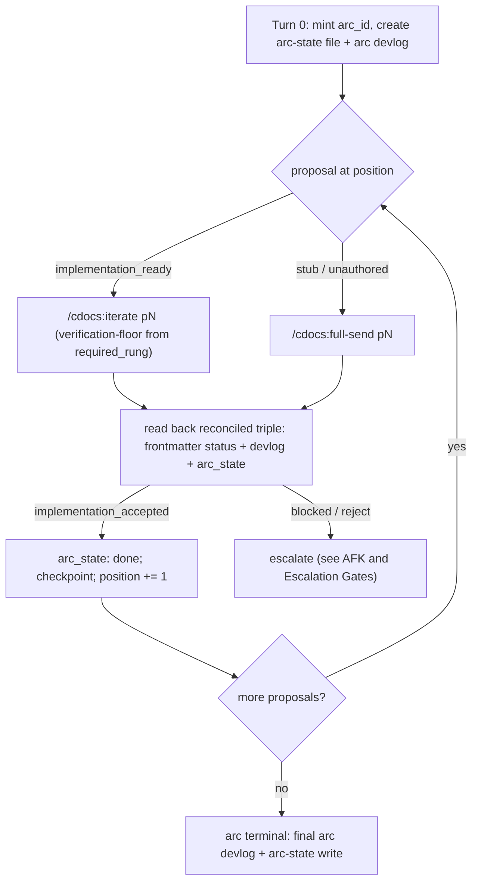

# CDocs Oversee

`/oversee` is the arc layer ABOVE `/cdocs:full-send`: it sequences MULTIPLE proposals through their full lifecycle by composing the existing loop skills per proposal, never reimplementing a loop.
Its unit of work is a proposal, not a file: it advances proposal N+1 only when proposal N reaches a terminal accepted state, reading each proposal's frontmatter `status` as the return contract.

The arc overseer runs in *overseer mode*, defined canonically in [`orchestration-discipline.md`](../../rules/orchestration-discipline.md), and the arc-level primitives it applies are defined in [`oversee-arc.md`](../../rules/oversee-arc.md); this skill references both rather than restating them.
Inline floor: dispatch by default (each composed loop keeps its own carve-out); write the arc-state file and a Completed/Decisions Made/Open Todos handoff BEFORE compacting; the arc overseer reads durable signals (proposal frontmatter `status`, devlog handoff, arc-state), never the composed loop's raw turns.
The human user is the supervisor: they invoke the skill and receive escalations; the arc overseer runs the arc.

> NOTE: `/oversee` is TOP-LEVEL ONLY. A dispatched subagent cannot dispatch its own loops ([`orchestration-discipline.md`](../../rules/orchestration-discipline.md): no nested dispatch), so if invoked as a subagent it degrades to sequential-advisory or declines, and says so.

## Invocation

```
/oversee chain [p1, p2, ...]        # sequence an explicit list of proposals
/oversee full <topic>               # scope a proposal set for a topic, then chain it
/oversee resume [arc-id]            # resume an interrupted arc from its arc-state file
```

- **`chain [p1, p2, ...]`**: an ordered list of proposal paths. Each element routes per its readiness at its turn (see the composition mapping).
- **`full <topic>`**: a scoping step (dispatch `/cdocs:propose` to author the arc's proposal set, or an RFP) then treat the result as a `chain`. Deciding the set is a hard gate under AFK (see AFK and Escalation Gates).
- **`resume [arc-id]`**: reconstruct an arc from `.claude/oversee/<arc-id>.json` (see Cross-Session Resume).

Flags:

- `--afk[=skip-blocked]`: seed the arc AFK field; see AFK and Escalation Gates. `--afk` alone sets `afk_policy: hold`; `--afk=skip-blocked` sets `skip-blocked`.
- `--max-parallel N`: cap concurrently interleaved footprint-disjoint proposals (default 3); see Footprint Conflict, Interleaving, and the Claim Registry.
- `-m | --model "<...>"` and `-f | --first-round ["<...>"]`: passed through UNCHANGED to each composed loop, governed by [`model-tiering.md`](../../rules/model-tiering.md). `/oversee` never rewrites them.

The arc overseer mints `arc_id` from the invocation (`YYYY-MM-DD` plus a dash-cased slug of the `full` topic, or of the first proposal's basename for a `chain`), states it in the Turn-0 brief, and reuses it on resume.

## Roles

- **Arc Overseer**: the top-level session, restricted to arc-altitude orchestration; owns the arc-state file, sequences proposals, applies the rule's heuristics, and escalates at hard gates. It is the ONLY overseer in the arc.
- **Composed loop**: a `/cdocs:full-send` or `/cdocs:iterate` invocation the arc overseer runs AS itself for one proposal. `/oversee` never runs an implement/review/judge loop directly.
- **Footprint scout** (Phase 5): a cheap sonnet-tier subagent that predicts a proposal's touched paths when no `footprint:` is declared.

## Composition, Not Reimplementation

Per proposal the arc overseer invokes an existing loop skill and reads back a terminal contract across two directional interfaces.

**Down (what `/oversee` passes into a composed loop):**

- the proposal path (or topic, for `full`);
- a `--verification-floor` derived from the proposal's required ladder rung (see [`oversee-arc.md`](../../rules/oversee-arc.md) "Verification-Depth Ladder"), including at least one failure-picture as `iterate` requires;
- model flags (`-m` / `-f`) passed through unchanged;
- an autonomy signal derived from the arc AFK field, conveyed as dispatch-BRIEF PROSE, not a flag. `iterate` / `full-send` expose no autonomy parameter, and adding one would modify a composed skill (forbidden), so the arc overseer states the expectation ("run to accept-or-escalate without pausing for confirmation; I am AFK") in the brief it already controls.

**Up (what `/oversee` reads back):** the composed loop's terminal state, as the reconciled TRIPLE, never a single field: the proposal's new frontmatter `status` (`implementation_accepted` on success), its final devlog handoff, and the arc-state file's `arc_state` for the proposal.
Consistent with Pillar 1 summary-absorption, the arc overseer reads these durable signals to decide advance-vs-escalate; it does NOT re-read the loop's Iteration Log turns or the implementer's diffs.

Mode-to-composition mapping (decided per element AT ITS TURN, since an earlier proposal may change a later one's readiness):

| Per-proposal condition | Composition |
|---|---|
| `pN` is `implementation_ready` | `/cdocs:iterate pN` |
| `pN` is an RFP stub or unauthored | `/cdocs:full-send pN` |
| `full <topic>` | scope first (`/cdocs:propose`), then treat the result as a `chain` |

## Arc-State File Lifecycle

The arc-state file (`.claude/oversee/<arc-id>.json`, normative schema in [`oversee-arc.md`](../../rules/oversee-arc.md)) is the durable substrate.
The copyable skeleton is in [`./template.md`](./template.md).

- **Create** on Turn 0: seed `proposals` from the invocation with `arc_state: pending`, `position: 0`, `budget.full_cycle_retries_max: 2`, and the AFK fields.
- **Transition-write BEFORE compact**: rewrite the file at every arc-level transition (proposal start, proposal terminal, escalation, claim acquire/release). This is the arc-altitude analogue of Pillar 2's handoff-before-compact; the prose half still goes to the arc devlog.
- Keep a normal arc devlog beside the JSON (Completed / Decisions Made / Open Todos), the human-readable narrative the JSON does not replace.

## Sequential Chain

Sequential is the default and the floor: conflicting proposals always serialize, and absent the Phase 5 interleaving primitives the whole arc runs sequentially.



Per proposal at `position`:

1. Set `arc_state: in_progress` and write the arc-state file.
2. Select the required rung (precedence chain in [`oversee-arc.md`](../../rules/oversee-arc.md)) and generate the `--verification-floor` sentence.
3. Compose: `iterate` for `implementation_ready`, `full-send` for a stub, running AS the arc overseer itself.
4. On loop terminal, read the reconciled triple. On `implementation_accepted`, mirror `status`, set `arc_state: done`, run the Checkpoint, and advance `position`. Otherwise escalate the proposal as `blocked`.

When a proposal runs in its own `worktree` (arc-state field) and a boundary reaches a cross-worktree step (landing or resolving that worktree into `main`, or forking the next proposal's worktree off `main`), the arc overseer is NOT isolation-bound and performs it as normal work. It surfaces the step up front and ROUTES it to the consuming repo's cross-worktree commands (e.g. in weftwise: `/resolve-wt`, `/dogfood-wt`, `/worktree`), warning never refusing. See the "Isolation is a dispatched-agent property" section (Isolation-aware routing) of [`orchestration-discipline.md`](../../rules/orchestration-discipline.md).

## Footprint Conflict, Interleaving, and the Claim Registry

Concurrency at the arc level is INTERLEAVED turns under ONE overseer, never nested overseers: a dispatched subagent cannot dispatch its own workers, so the arc overseer cannot spawn sub-overseers that each run a loop.
The one overseer dispatches proposal A's and proposal B's implementers concurrently (parallel subagent dispatch IS supported), then interleaves its own thin review/decide turns. The expensive dispatched work runs concurrently; only the overseer's own turns serialize.

**Footprint declaration and the overlap test** (heuristic defined in [`oversee-arc.md`](../../rules/oversee-arc.md)):

1. Read each proposal's `footprint:` field, or derive it by dispatching the sonnet-tier footprint scout against the proposals' Implementation Phases.
2. Intersect the two glob sets. Non-empty intersection means the proposals CONFLICT and must SERIALIZE.
3. Disjoint proposals are eligible to interleave.
4. **Uncertainty defaults to serialize** (low scout confidence or broad globs like `**/*`): a false conflict costs latency, a missed conflict costs a clobber.

**Concurrency cap.** At most **3** footprint-disjoint proposals interleave at once by default (each a distinct workstream with one durable specialist, honoring Pillar 3's one-per-workstream bound against the overseer's ~150K-token budget), adjustable with `--max-parallel N`.
Past the cap the overseer serializes the surplus (defers them to run after an in-flight one terminates) or re-scopes, exactly as Pillar 3 escalates when workstream count outgrows one overseer; it does NOT spawn a second overseer.

**Claim registry** (repo-global `.claude/oversee/claims/`, format and protocol in [`oversee-arc.md`](../../rules/oversee-arc.md); skeleton in [`./template.md`](./template.md)):

- Before starting or interleaving a proposal whose footprint intersects an EXISTING live claim owned by a different arc/owner, acquire fails: serialize or re-scope.
- Acquire a claim file on proposal start; release (delete or mark `stale`) on terminal. Each is an arc-level transition, so write the arc-state file too.
- On resume, a `live` claim whose owner is gone (no live children) is reconciled to `stale` and released, so the arc does not deadlock. This extends the Phase 3 liveness reconciliation to the registry.

**The per-dispatch Pillar 1b check inside each loop is the backstop.** Footprint prediction REDUCES conflicts; it does not replace the per-dispatch single-writer guarantee. If two "disjoint" interleaved proposals turn out to touch the same file mid-flight, the second writer against the now-shared path is caught at dispatch time and serialized inside the loop. Do not weaken that check.

## Checkpoint (proposal boundary)

At each proposal boundary, BEFORE starting the next proposal (and before compacting), write the arc-state file AND a three-subsection Completed / Decisions Made / Open Todos handoff into the arc devlog, then compact (`/compact`, or `/clear` for a hard reset).
The handoff format is defined in [`orchestration-discipline.md`](../../rules/orchestration-discipline.md) Pillar 2; do not restate it here.
The checkpoint is not complete until both durable writes land: compacting without them is a failure.

## AFK and Escalation Gates

The arc AFK signal governs whether the overseer advances between PROPOSALS unattended.
It is distinct from `iterate`'s per-loop AFK fallback (which only handles a MISSING verification floor within one loop); this is a separate, higher signal and does not touch that fallback.

**AFK lives in the arc-state file** (`afk` + `afk_policy`), because the defining requirement is that an arc interrupted mid-flight and resumed in a fresh session knows whether to keep going without re-asking, and only the arc-state file is read on resume.
The `--afk` flag is the SETTER that writes the field on invocation; a `.claude/oversee/pause` marker file is the out-of-band STOP (a user with no live session drops it to force the arc to escalate-and-hold at its next gate), checked at each gate and cleared on acknowledgement.

Gate semantics:

- A **soft gate** ("should I continue to the next proposal?", "which of two acceptable defaults?") under `afk: true` becomes "apply the logged default and proceed."
- A **hard gate** fires even under AFK. Hard gates: a `reject` verdict, an unresolvable footprint conflict, and (for `full <topic>`) deciding the proposal SET. At a hard gate the overseer writes the escalation into the arc-state file AND a `.claude/oversee/escalations/` marker (skeleton in [`./template.md`](./template.md)), then per `afk_policy`:
  - `hold` (default): stop the arc and surface the escalation.
  - `skip-blocked` (`--afk=skip-blocked`): mark the blocked proposal `arc_state: blocked`, skip it, and continue the rest of the arc, recording the choice.

`/oversee full <topic>` scoping is itself a hard gate under AFK: deciding the proposal set for an open topic is judgment the user may want to see, so the default is to escalate the proposed set once even under AFK (an Open Question preserved in the proposal).

## Cross-Session Resume

Resume is the DEFINING durability guarantee: an arc interrupted mid-flight (rate limit, crash, closed terminal) must reconstruct itself in a fresh session without re-running or double-implementing a done proposal.
`/oversee resume` needs only the arc-state file.

On resume:

1. **Reconstruct** arc `position` and each proposal's `arc_state` from `.claude/oversee/<arc-id>.json`.
2. **Apply Pillar 1b liveness reconciliation at the arc altitude**: the harness notifies the overseer only when NO live children remain, so a resumed session can hold a stale "loop in flight" belief. If `arc_state: in_progress` but no live children exist, that loop has TERMINATED: adopt the on-disk triple (frontmatter `status` + final devlog handoff + `arc_state`) and proceed, rather than re-running the loop or waiting on a child that is already gone. Reuse Pillar 1b's mechanism; do not invent a new liveness test.
3. **Detect and repair `arc_state`-vs-frontmatter drift, both directions:**
   - Frontmatter reads `implementation_accepted` but `arc_state: in_progress`: the loop finished during the interruption. Reconcile FORWARD: mark `arc_state: done` and advance.
   - The terminal-write race, where a loop died between the review-Accept decision and the write of its frontmatter/devlog: all three signals read stale-in-progress, so re-run the loop. This is SAFE: `iterate` re-reviews the already-done work, finds it passing, and re-Accepts at the cost of one redundant review round. This is exactly why the return signal is the reconciled triple, not frontmatter alone.
4. **Do NOT re-run an already-done proposal** (`arc_state: done`); resume at `position`.

**Arc disambiguation.** `resume` with no `arc-id` disambiguates among the arcs under `.claude/oversee/`: if exactly one arc file is non-terminal, resume that one; otherwise list the candidate arc ids and `AskUserQuestion` (or, under AFK, resume the most recently written non-terminal arc and log the choice).

## Termination

The arc terminates when every proposal reaches `arc_state: done`, when a hard gate holds the arc (see AFK and Escalation Gates), or on user interrupt.
The arc-state file is the durable record: a fresh session reading only it plus the arc devlog can reconstruct the whole arc.

## Cross-Target Degradation

Rule CONTENT ships cross-target cleanly; only RUNTIME mechanics degrade (absent `fork`/`SendMessage` the arc runs sequential-only; absent `/compact` the checkpoint becomes a fresh-session restart from the arc-state file plus the last handoff).
See [`oversee-arc.md`](../../rules/oversee-arc.md) "Cross-Target Degradation" for the full mapping.
